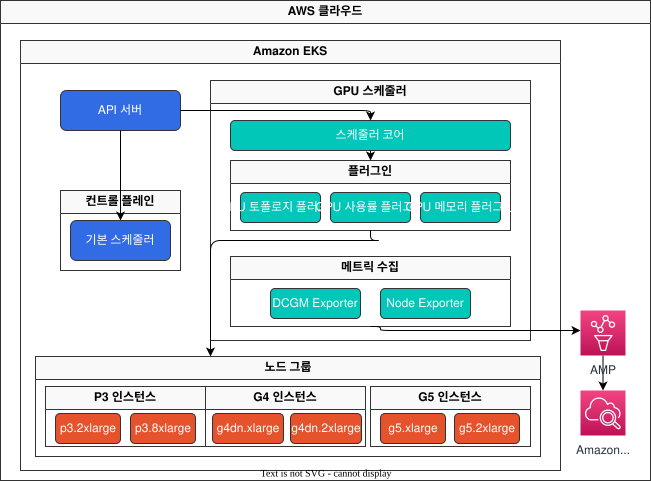
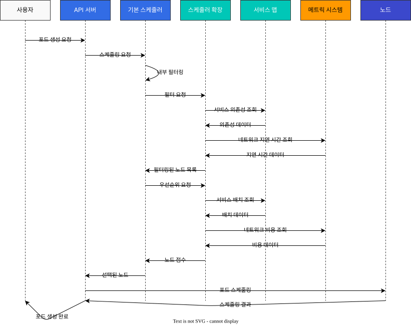

# Part 3: 커스텀 스케줄러 구현 사례 및 모니터링

## EKS에서의 커스텀 스케줄러 구현 사례

이 섹션에서는 EKS에서 커스텀 스케줄러를 구현하는 실제 사례를 살펴보겠습니다.

### 사례 1: GPU 워크로드 최적화 스케줄러

AI/ML 워크로드를 실행하는 EKS 클러스터에서는 GPU 리소스를 효율적으로 활용하는 것이 중요합니다. 다음은 GPU 워크로드를 최적화하는 커스텀 스케줄러의 구현 사례입니다.

#### GPU 워크로드 최적화 스케줄러 아키텍처

다음 다이어그램은 GPU 워크로드 최적화 스케줄러의 아키텍처를 보여줍니다:



#### GPU 워크로드 스케줄링 워크플로우

다음 다이어그램은 GPU 워크로드 스케줄링 워크플로우를 보여줍니다:


#### 요구 사항

1. GPU 메모리 요구 사항에 따라 노드 선택
2. GPU 모델(예: NVIDIA A100, V100, T4 등)에 따른 노드 선택
3. GPU 사용률을 고려한 노드 선택
4. 다중 GPU 인스턴스에서 GPU 공유 최적화

#### 구현 접근 방식

이 사례에서는 스케줄러 프레임워크 플러그인 접근 방식을 사용합니다.

1. **노드 레이블링**: 각 노드에 GPU 관련 정보를 레이블로 추가합니다.

```bash
# GPU 모델 레이블 추가
kubectl label node <node-name> gpu.nvidia.com/model=A100

# GPU 메모리 레이블 추가
kubectl label node <node-name> gpu.nvidia.com/memory=40960

# GPU 수 레이블 추가
kubectl label node <node-name> gpu.nvidia.com/count=8
```

2. **커스텀 스케줄러 플러그인 구현**:

```go
// GPUTopologyPlugin은 GPU 토폴로지를 고려하는 스케줄러 플러그인입니다.
type GPUTopologyPlugin struct {
    handle framework.Handle
}

// Filter는 GPU 요구 사항에 따라 노드를 필터링합니다.
func (gtp *GPUTopologyPlugin) Filter(ctx context.Context, state *framework.CycleState, pod *v1.Pod, node *framework.NodeInfo) *framework.Status {
    // GPU 요구 사항 확인
    gpuReq := getGPURequest(pod)
    if gpuReq == 0 {
        return framework.NewStatus(framework.Success, "")
    }

    // 노드의 GPU 정보 확인
    gpuCount := getGPUCount(node.Node())
    if gpuCount < gpuReq {
        return framework.NewStatus(framework.Unschedulable, "Not enough GPUs")
    }

    // GPU 모델 요구 사항 확인
    requiredModel := getRequiredGPUModel(pod)
    if requiredModel != "" && getGPUModel(node.Node()) != requiredModel {
        return framework.NewStatus(framework.Unschedulable, "GPU model mismatch")
    }

    // GPU 메모리 요구 사항 확인
    memReq := getGPUMemoryRequest(pod)
    if memReq > 0 && getGPUMemory(node.Node()) < memReq {
        return framework.NewStatus(framework.Unschedulable, "Not enough GPU memory")
    }

    return framework.NewStatus(framework.Success, "")
}

// Score는 GPU 토폴로지에 따라 노드에 점수를 할당합니다.
func (gtp *GPUTopologyPlugin) Score(ctx context.Context, state *framework.CycleState, pod *v1.Pod, nodeName string) (int64, *framework.Status) {
    nodeInfo, err := gtp.handle.SnapshotSharedLister().NodeInfos().Get(nodeName)
    if err != nil {
        return 0, framework.NewStatus(framework.Error, fmt.Sprintf("Error getting node info: %v", err))
    }

    node := nodeInfo.Node()
    
    // GPU 요구 사항이 없으면 기본 점수 반환
    gpuReq := getGPURequest(pod)
    if gpuReq == 0 {
        return 0, framework.NewStatus(framework.Success, "")
    }

    // GPU 사용률 확인
    gpuUtilization := getGPUUtilization(node)
    
    // GPU 수에 따른 점수 계산
    gpuCount := getGPUCount(node)
    
    // 사용 가능한 GPU가 요청된 GPU보다 약간 많은 노드에 높은 점수 할당
    // 이는 GPU 리소스를 효율적으로 활용하기 위함
    score := 100 - int64(math.Abs(float64(gpuCount-gpuReq))*10)
    if score < 0 {
        score = 0
    }
    
    // GPU 사용률이 낮은 노드에 더 높은 점수 할당
    utilizationScore := int64((1.0 - gpuUtilization) * 100)
    
    // 최종 점수는 두 점수의 가중 평균
    finalScore := (score * 7 + utilizationScore * 3) / 10
    
    return finalScore, framework.NewStatus(framework.Success, "")
}
```

3. **스케줄러 구성**:

```yaml
apiVersion: kubescheduler.config.k8s.io/v1beta1
kind: KubeSchedulerConfiguration
clientConnection:
  kubeconfig: /etc/kubernetes/scheduler.conf
profiles:
- schedulerName: gpu-scheduler
  plugins:
    filter:
      enabled:
      - name: GPUTopologyPlugin
    score:
      enabled:
      - name: GPUTopologyPlugin
        weight: 10
  pluginConfig:
  - name: GPUTopologyPlugin
    args: {}
```

4. **포드 스펙에서 GPU 요구 사항 지정**:

```yaml
apiVersion: v1
kind: Pod
metadata:
  name: gpu-pod
  annotations:
    gpu.nvidia.com/model: "A100"
    gpu.nvidia.com/memory: "40960"
spec:
  schedulerName: gpu-scheduler
  containers:
  - name: gpu-container
    image: nvidia/cuda:11.6.0-base-ubuntu20.04
    resources:
      limits:
        nvidia.com/gpu: 2
```

### 사례 2: 네트워크 지역성 최적화 스케줄러

EKS 클러스터에서 네트워크 비용을 최적화하기 위해 네트워크 지역성을 고려하는 커스텀 스케줄러를 구현할 수 있습니다.

#### 네트워크 지역성 최적화 스케줄러 아키텍처

다음 다이어그램은 네트워크 지역성 최적화 스케줄러의 아키텍처를 보여줍니다.


#### 네트워크 지역성 최적화 워크플로우

다음 다이어그램은 네트워크 지역성 최적화 스케줄러의 워크플로우를 보여줍니다.



## 커스텀 스케줄러 모니터링 및 디버깅

커스텀 스케줄러를 구현한 후에는 모니터링 및 디버깅이 중요합니다. 이 섹션에서는 커스텀 스케줄러를 모니터링하고 디버깅하는 방법을 알아보겠습니다.

### 모니터링 아키텍처

다음 다이어그램은 EKS에서 커스텀 스케줄러를 모니터링하기 위한 아키텍처를 보여줍니다.


### 주요 모니터링 메트릭

다음 다이어그램은 커스텀 스케줄러의 주요 모니터링 메트릭과 그 관계를 보여줍니다:


### 로깅

커스텀 스케줄러의 로그를 확인하여 스케줄링 결정을 이해할 수 있습니다:

```bash
kubectl logs -n kube-system -l app=custom-scheduler
```

### 이벤트 확인

포드 스케줄링과 관련된 이벤트를 확인할 수 있습니다:

```bash
kubectl get events --field-selector involvedObject.name=<pod-name>
```

### 메트릭 수집

Prometheus를 사용하여 커스텀 스케줄러의 메트릭을 수집할 수 있습니다:

```yaml
apiVersion: monitoring.coreos.com/v1
kind: ServiceMonitor
metadata:
  name: custom-scheduler
  namespace: monitoring
spec:
  selector:
    matchLabels:
      app: custom-scheduler
  endpoints:
  - port: metrics
    interval: 15s
```

### 대시보드 구성

Grafana를 사용하여 커스텀 스케줄러의 메트릭을 시각화할 수 있습니다:

```yaml
apiVersion: v1
kind: ConfigMap
metadata:
  name: custom-scheduler-dashboard
  namespace: monitoring
data:
  custom-scheduler-dashboard.json: |
    {
      "annotations": {
        "list": [
          {
            "builtIn": 1,
            "datasource": "-- Grafana --",
            "enable": true,
            "hide": true,
            "iconColor": "rgba(0, 211, 255, 1)",
            "name": "Annotations & Alerts",
            "type": "dashboard"
          }
        ]
      },
      "editable": true,
      "gnetId": null,
      "graphTooltip": 0,
      "id": 1,
      "links": [],
      "panels": [
        {
          "aliasColors": {},
          "bars": false,
          "dashLength": 10,
          "dashes": false,
          "datasource": null,
          "fieldConfig": {
            "defaults": {
              "custom": {}
            },
            "overrides": []
          },
          "fill": 1,
          "fillGradient": 0,
          "gridPos": {
            "h": 8,
            "w": 12,
            "x": 0,
            "y": 0
          },
          "hiddenSeries": false,
          "id": 2,
          "legend": {
            "avg": false,
            "current": false,
            "max": false,
            "min": false,
            "show": true,
            "total": false,
            "values": false
          },
          "lines": true,
          "linewidth": 1,
          "nullPointMode": "null",
          "options": {
            "alertThreshold": true
          },
          "percentage": false,
          "pluginVersion": "7.2.0",
          "pointradius": 2,
          "points": false,
          "renderer": "flot",
          "seriesOverrides": [],
          "spaceLength": 10,
          "stack": false,
          "steppedLine": false,
          "targets": [
            {
              "expr": "scheduler_scheduling_duration_seconds_count",
              "interval": "",
              "legendFormat": "",
              "refId": "A"
            }
          ],
          "thresholds": [],
          "timeFrom": null,
          "timeRegions": [],
          "timeShift": null,
          "title": "Scheduling Duration",
          "tooltip": {
            "shared": true,
            "sort": 0,
            "value_type": "individual"
          },
          "type": "graph",
          "xaxis": {
            "buckets": null,
            "mode": "time",
            "name": null,
            "show": true,
            "values": []
          },
          "yaxes": [
            {
              "format": "short",
              "label": null,
              "logBase": 1,
              "max": null,
              "min": null,
              "show": true
            },
            {
              "format": "short",
              "label": null,
              "logBase": 1,
              "max": null,
              "min": null,
              "show": true
            }
          ],
          "yaxis": {
            "align": false,
            "alignLevel": null
          }
        }
      ],
      "schemaVersion": 26,
      "style": "dark",
      "tags": [],
      "templating": {
        "list": []
      },
      "time": {
        "from": "now-6h",
        "to": "now"
      },
      "timepicker": {},
      "timezone": "",
      "title": "Custom Scheduler Dashboard",
      "uid": "custom-scheduler",
      "version": 1
    }
```

## 결론

커스텀 스케줄러는 특정 요구 사항에 맞게 Kubernetes 스케줄링 동작을 조정할 수 있는 강력한 방법입니다. EKS에서는 다중 스케줄러 접근 방식, 스케줄러 확장 접근 방식, 스케줄러 프레임워크 플러그인 접근 방식 등 다양한 방법으로 커스텀 스케줄러를 구현할 수 있습니다.

GPU 워크로드 최적화, 네트워크 지역성 최적화 등 다양한 사례에서 커스텀 스케줄러를 활용할 수 있습니다. 커스텀 스케줄러를 구현할 때는 모니터링 및 디버깅을 위한 도구를 함께 구성하는 것이 중요합니다.

## 퀴즈

이 장에서 배운 내용을 테스트하려면 [주제 퀴즈](../quizzes/advanced/02-custom-scheduler-part3-quiz.md)를 풀어보세요.
