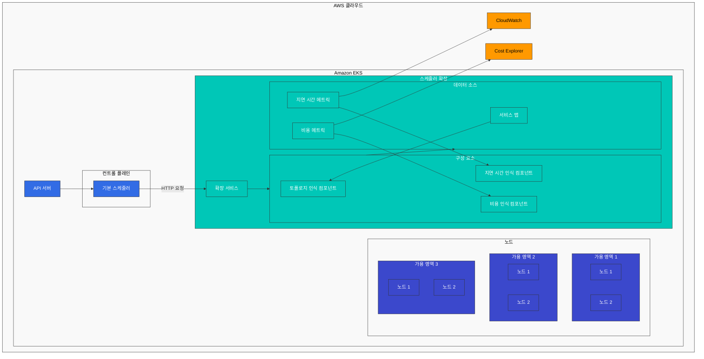
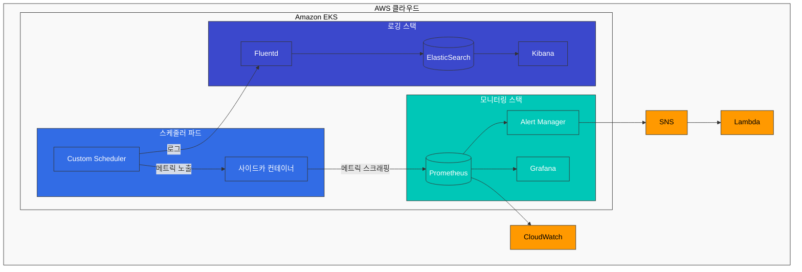
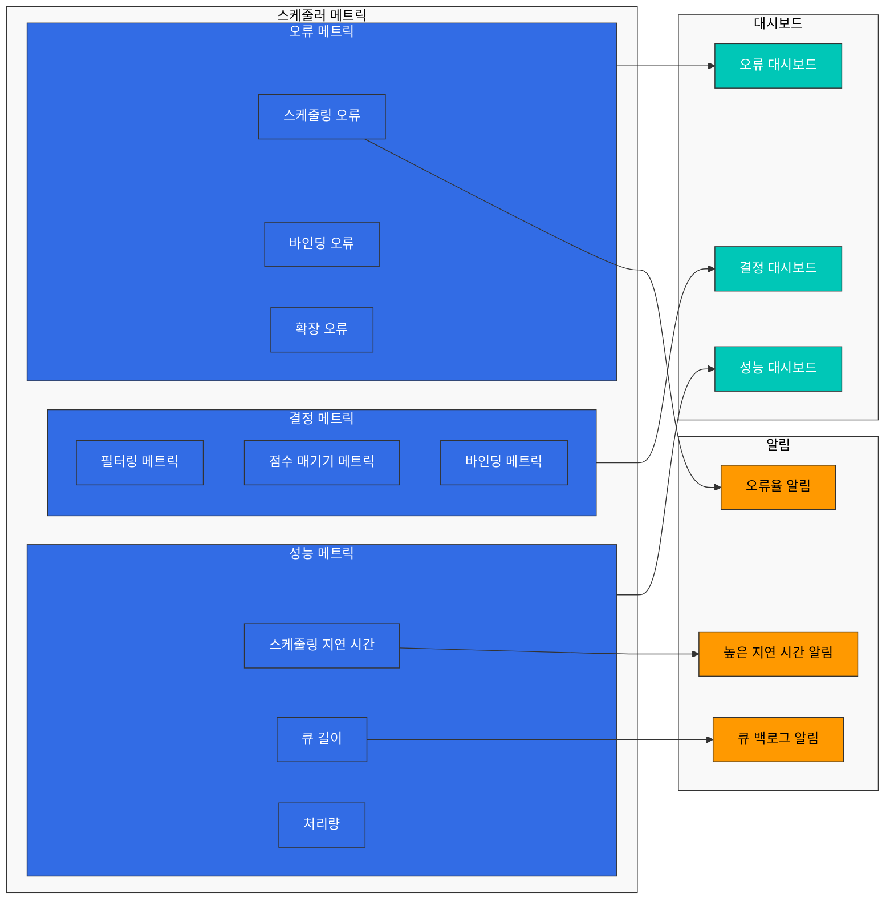

# Part 3: 커스텀 스케줄러 구현 사례 및 모니터링

## EKS에서의 Custom Scheduler 구현 사례

이 섹션에서는 EKS에서 Custom Scheduler를 구현하는 실제 사례를 살펴보겠습니다.

### 사례 1: GPU 워크로드 최적화 스케줄러

AI/ML 워크로드를 실행하는 EKS 클러스터에서는 GPU 리소스를 효율적으로 활용하는 것이 중요합니다. 다음은 GPU 워크로드를 최적화하는 Custom Scheduler의 구현 사례입니다.

#### GPU 워크로드 최적화 스케줄러 아키텍처

다음 다이어그램은 GPU 워크로드 최적화 스케줄러의 아키텍처를 보여줍니다:

```mermaid
flowchart TD
    subgraph AWS [AWS 클라우드]
        subgraph EKS [Amazon EKS]
            APIServer[API 서버]
            
            subgraph ControlPlane [컨트롤 플레인]
                DefaultScheduler[기본 스케줄러]
            end
            
            subgraph GPUScheduler [GPU 스케줄러]
                SchedulerCore[스케줄러 코어]
                
                subgraph Plugins [플러그인]
                    GPUTopologyPlugin[GPU 토폴로지 플러그인]
                    GPUUtilizationPlugin[GPU 사용률 플러그인]
                    GPUMemoryPlugin[GPU 메모리 플러그인]
                end
                
                subgraph Metrics [메트릭 수집]
                    DCGMExporter[DCGM Exporter]
                    NodeExporter[Node Exporter]
                end
            end
            
            subgraph NodeGroups [노드 그룹]
                subgraph P3Instances [P3 인스턴스]
                    P3_2xl[p3.2xlarge]
                    P3_8xl[p3.8xlarge]
                    P3_16xl[p3.16xlarge]
                end
                
                subgraph G4Instances [G4 인스턴스]
                    G4dn_xl[g4dn.xlarge]
                    G4dn_2xl[g4dn.2xlarge]
                    G4dn_4xl[g4dn.4xlarge]
                end
                
                subgraph G5Instances [G5 인스턴스]
                    G5_xl[g5.xlarge]
                    G5_2xl[g5.2xlarge]
                    G5_4xl[g5.4xlarge]
                end
            end
        end
        
        CloudWatch[CloudWatch]
        Prometheus[(Prometheus)]
    end
    
    APIServer --> DefaultScheduler
    APIServer --> SchedulerCore
    SchedulerCore --> Plugins
    
    Plugins --> NodeGroups
    Metrics --> Prometheus
    Prometheus --> CloudWatch
    
    classDef awsService fill:#FF9900,stroke:#333,stroke-width:1px,color:black;
    classDef k8sComponent fill:#326CE5,stroke:#333,stroke-width:1px,color:white;
    classDef gpuComponent fill:#00C7B7,stroke:#333,stroke-width:1px,color:white;
    classDef gpuNode fill:#E6522C,stroke:#333,stroke-width:1px,color:white;
    
    class CloudWatch,Prometheus awsService;
    class APIServer,DefaultScheduler k8sComponent;
    class SchedulerCore,GPUTopologyPlugin,GPUUtilizationPlugin,GPUMemoryPlugin,DCGMExporter,NodeExporter gpuComponent;
    class P3_2xl,P3_8xl,P3_16xl,G4dn_xl,G4dn_2xl,G4dn_4xl,G5_xl,G5_2xl,G5_4xl gpuNode;
```


                end
                
                subgraph G5Instances [G5 인스턴스]
                    G5_xl[g5.xlarge]
                    G5_2xl[g5.2xlarge]
                    G5_4xl[g5.4xlarge]
                end
            end
        end
        
        CloudWatch[CloudWatch]
        Prometheus[(Prometheus)]
    end
    
    APIServer --> DefaultScheduler
    APIServer --> SchedulerCore
    SchedulerCore --> Plugins
    
    Plugins --> NodeGroups
    Metrics --> Prometheus
    Prometheus --> CloudWatch
    
    classDef awsService fill:#FF9900,stroke:#333,stroke-width:1px,color:black;
    classDef k8sComponent fill:#326CE5,stroke:#333,stroke-width:1px,color:white;
    classDef gpuComponent fill:#00C7B7,stroke:#333,stroke-width:1px,color:white;
    classDef gpuNode fill:#E6522C,stroke:#333,stroke-width:1px,color:white;
    classDef default fill:#f9f9f9,stroke:#333,stroke-width:1px,color:black;
    
    class CloudWatch,Prometheus awsService;
    class APIServer,DefaultScheduler k8sComponent;
    class SchedulerCore,Plugins,GPUTopologyPlugin,GPUUtilizationPlugin,GPUMemoryPlugin,Metrics,DCGMExporter,NodeExporter,GPUScheduler gpuComponent;
    class P3_2xl,P3_8xl,P3_16xl,G4dn_xl,G4dn_2xl,G4dn_4xl,G5_xl,G5_2xl,G5_4xl,P3Instances,G4Instances,G5Instances gpuNode;
    class AWS,EKS,ControlPlane,NodeGroups default;
```

#### GPU 워크로드 스케줄링 워크플로우

다음 다이어그램은 GPU 워크로드 스케줄링 워크플로우를 보여줍니다:

```mermaid
sequenceDiagram
    participant User as 사용자
    participant API as API 서버
    participant GPUSched as GPU 스케줄러
    participant Plugins as 스케줄러 플러그인
    participant Metrics as 메트릭 시스템
    participant Node as GPU 노드
    
    User->>API: GPU 포드 생성 요청
    API->>GPUSched: 스케줄링 요청
    GPUSched->>Plugins: 필터링 요청
    Plugins->>Metrics: GPU 사용률 조회
    Metrics->>Plugins: GPU 사용률 데이터
    Plugins->>GPUSched: 필터링된 노드 목록
    GPUSched->>Plugins: 점수 매기기 요청
    Plugins->>Metrics: GPU 토폴로지 조회
    Metrics->>Plugins: GPU 토폴로지 데이터
    Plugins->>GPUSched: 노드 점수
    GPUSched->>API: 선택된 노드
    API->>Node: 포드 스케줄링
    Node->>API: 스케줄링 결과
    API->>User: 포드 생성 완료
    
    classDef user fill:#f9f9f9,stroke:#333,stroke-width:1px,color:black;
    classDef k8s fill:#326CE5,stroke:#333,stroke-width:1px,color:white;
    classDef scheduler fill:#00C7B7,stroke:#333,stroke-width:1px,color:white;
    classDef metrics fill:#FF9900,stroke:#333,stroke-width:1px,color:black;
    classDef node fill:#E6522C,stroke:#333,stroke-width:1px,color:white;
    
    class User user;
    class API k8s;
    class GPUSched,Plugins scheduler;
    class Metrics metrics;
    class Node node;
```

#### 요구 사항

1. GPU 메모리 요구 사항에 따라 노드 선택
2. GPU 모델(예: NVIDIA A100, V100, T4 등)에 따른 노드 선택
3. GPU 사용률을 고려한 노드 선택
4. 다중 GPU 인스턴스에서 GPU 공유 최적화

#### 구현 접근 방식

이 사례에서는 스케줄러 프레임워크 플러그인 접근 방식을 사용합니다.

1. **노드 레이블링**: 각 노드에 GPU 관련 정보를 레이블로 추가합니다.

```bash
# GPU 모델 레이블 추가
kubectl label node <node-name> gpu.nvidia.com/model=A100

# GPU 메모리 레이블 추가
kubectl label node <node-name> gpu.nvidia.com/memory=40960

# GPU 수 레이블 추가
kubectl label node <node-name> gpu.nvidia.com/count=8
```

2. **Custom Scheduler 플러그인 구현**:

```go
// GPUTopologyPlugin은 GPU 토폴로지를 고려하는 스케줄러 플러그인입니다.
type GPUTopologyPlugin struct {
    handle framework.Handle
}

// Filter는 GPU 요구 사항에 따라 노드를 필터링합니다.
func (gtp *GPUTopologyPlugin) Filter(ctx context.Context, state *framework.CycleState, pod *v1.Pod, node *framework.NodeInfo) *framework.Status {
    // GPU 요구 사항 확인
    gpuReq := getGPURequest(pod)
    if gpuReq == 0 {
        return framework.NewStatus(framework.Success, "")
    }

    // 노드의 GPU 정보 확인
    gpuCount := getGPUCount(node.Node())
    if gpuCount < gpuReq {
        return framework.NewStatus(framework.Unschedulable, "Not enough GPUs")
    }

    // GPU 모델 요구 사항 확인
    requiredModel := getRequiredGPUModel(pod)
    if requiredModel != "" && getGPUModel(node.Node()) != requiredModel {
        return framework.NewStatus(framework.Unschedulable, "GPU model mismatch")
    }

    // GPU 메모리 요구 사항 확인
    memReq := getGPUMemoryRequest(pod)
    if memReq > 0 && getGPUMemory(node.Node()) < memReq {
        return framework.NewStatus(framework.Unschedulable, "Not enough GPU memory")
    }

    return framework.NewStatus(framework.Success, "")
}

// Score는 GPU 토폴로지에 따라 노드에 점수를 할당합니다.
func (gtp *GPUTopologyPlugin) Score(ctx context.Context, state *framework.CycleState, pod *v1.Pod, nodeName string) (int64, *framework.Status) {
    nodeInfo, err := gtp.handle.SnapshotSharedLister().NodeInfos().Get(nodeName)
    if err != nil {
        return 0, framework.NewStatus(framework.Error, fmt.Sprintf("Error getting node info: %v", err))
    }

    node := nodeInfo.Node()
    
    // GPU 요구 사항이 없으면 기본 점수 반환
    gpuReq := getGPURequest(pod)
    if gpuReq == 0 {
        return 0, framework.NewStatus(framework.Success, "")
    }

    // GPU 사용률 확인
    gpuUtilization := getGPUUtilization(node)
    
    // GPU 수에 따른 점수 계산
    gpuCount := getGPUCount(node)
    
    // 사용 가능한 GPU가 요청된 GPU보다 약간 많은 노드에 높은 점수 할당
    // 이는 GPU 리소스를 효율적으로 활용하기 위함
    score := 100 - int64(math.Abs(float64(gpuCount-gpuReq))*10)
    if score < 0 {
        score = 0
    }
    
    // GPU 사용률이 낮은 노드에 더 높은 점수 할당
    utilizationScore := int64((1.0 - gpuUtilization) * 100)
    
    // 최종 점수는 두 점수의 가중 평균
    finalScore := (score * 7 + utilizationScore * 3) / 10
    
    return finalScore, framework.NewStatus(framework.Success, "")
}
```

3. **스케줄러 구성**:

```yaml
apiVersion: kubescheduler.config.k8s.io/v1beta1
kind: KubeSchedulerConfiguration
clientConnection:
  kubeconfig: /etc/kubernetes/scheduler.conf
profiles:
- schedulerName: gpu-scheduler
  plugins:
    filter:
      enabled:
      - name: GPUTopologyPlugin
    score:
      enabled:
      - name: GPUTopologyPlugin
        weight: 10
  pluginConfig:
  - name: GPUTopologyPlugin
    args: {}
```

4. **포드 스펙에서 GPU 요구 사항 지정**:

```yaml
apiVersion: v1
kind: Pod
metadata:
  name: gpu-pod
  annotations:
    gpu.nvidia.com/model: "A100"
    gpu.nvidia.com/memory: "40960"
spec:
  schedulerName: gpu-scheduler
  containers:
  - name: gpu-container
    image: nvidia/cuda:11.6.0-base-ubuntu20.04
    resources:
      limits:
        nvidia.com/gpu: 2
```

### 사례 2: 네트워크 지역성 최적화 스케줄러

EKS 클러스터에서 네트워크 비용을 최적화하기 위해 네트워크 지역성을 고려하는 Custom Scheduler를 구현할 수 있습니다.

#### 네트워크 지역성 최적화 스케줄러 아키텍처

다음 다이어그램은 네트워크 지역성 최적화 스케줄러의 아키텍처를 보여줍니다:



#### 네트워크 지역성 최적화 워크플로우

다음 다이어그램은 네트워크 지역성 최적화 스케줄러의 워크플로우를 보여줍니다:

```mermaid
sequenceDiagram
    participant User as 사용자
    participant API as API 서버
    participant Scheduler as 기본 스케줄러
    participant Extender as 스케줄러 확장
    participant ServiceMap as 서비스 맵
    participant Metrics as 메트릭 시스템
    participant Node as 노드
    
    User->>API: 포드 생성 요청
    API->>Scheduler: 스케줄링 요청
    Scheduler->>Scheduler: 내부 필터링
    Scheduler->>Extender: 필터 요청
    Extender->>ServiceMap: 서비스 의존성 조회
    ServiceMap->>Extender: 의존성 데이터
    Extender->>Metrics: 네트워크 지연 시간 조회
    Metrics->>Extender: 지연 시간 데이터
    Extender->>Scheduler: 필터링된 노드 목록
    Scheduler->>Extender: 우선순위 요청
    Extender->>ServiceMap: 서비스 배치 조회
    ServiceMap->>Extender: 배치 데이터
    Extender->>Metrics: 네트워크 비용 조회
    Metrics->>Extender: 비용 데이터
    Extender->>Scheduler: 노드 점수
    Scheduler->>API: 선택된 노드
    API->>Node: 포드 스케줄링
    Node->>API: 스케줄링 결과
    API->>User: 포드 생성 완료
    
    classDef user fill:#f9f9f9,stroke:#333,stroke-width:1px,color:black;
    classDef k8s fill:#326CE5,stroke:#333,stroke-width:1px,color:white;
    classDef extender fill:#00C7B7,stroke:#333,stroke-width:1px,color:white;
    classDef metrics fill:#FF9900,stroke:#333,stroke-width:1px,color:black;
    classDef node fill:#3B48CC,stroke:#333,stroke-width:1px,color:white;
    
    class User user;
    class API,Scheduler k8s;
    class Extender,ServiceMap extender;
    class Metrics metrics;
    class Node node;
```

#### 요구 사항

1. 동일한 가용 영역 내에서 관련 포드 배치
2. 네트워크 지연 시간 최소화
3. 가용 영역 간 데이터 전송 비용 최소화
4. 서비스 간 의존성을 고려한 배치

#### 구현 접근 방식

이 사례에서는 스케줄러 확장(Extender) 접근 방식을 사용합니다.

1. **포드 어피니티 및 안티-어피니티 설정**:

```yaml
apiVersion: apps/v1
kind: Deployment
metadata:
  name: web-server
spec:
  replicas: 3
  selector:
    matchLabels:
      app: web-server
  template:
    metadata:
      labels:
        app: web-server
    spec:
      affinity:
        podAffinity:
          preferredDuringSchedulingIgnoredDuringExecution:
          - weight: 100
            podAffinityTerm:
              labelSelector:
                matchExpressions:
                - key: app
                  operator: In
                  values:
                  - cache
              topologyKey: topology.kubernetes.io/zone
        podAntiAffinity:
          requiredDuringSchedulingIgnoredDuringExecution:
          - labelSelector:
              matchExpressions:
              - key: app
                operator: In
                values:
                - web-server
            topologyKey: kubernetes.io/hostname
      containers:
      - name: web-server
        image: nginx:latest
```

2. **스케줄러 확장 구현**:

```go
// 우선순위 핸들러
func prioritizeHandler(w http.ResponseWriter, r *http.Request, _ httprouter.Params) {
    var extenderArgs extenderv1.ExtenderArgs
    var hostPriorityList extenderv1.HostPriorityList

    if err := json.NewDecoder(r.Body).Decode(&extenderArgs); err != nil {
        http.Error(w, err.Error(), http.StatusBadRequest)
        return
    }

    pod := extenderArgs.Pod
    nodes := extenderArgs.Nodes.Items

    // 포드의 서비스 의존성 확인
    dependencies := getDependencies(pod)
    
    // 각 노드에 점수 할당
    hostPriorityList = make(extenderv1.HostPriorityList, len(nodes))
    for i, node := range nodes {
        // 기본 점수
        hostPriorityList[i] = extenderv1.HostPriority{
            Host:  node.Name,
            Score: 0,
        }
        
        // 노드의 가용 영역 확인
        zone := node.Labels["topology.kubernetes.io/zone"]
        
        // 의존성이 있는 서비스의 포드가 같은 가용 영역에 있는지 확인
        for _, dep := range dependencies {
            if podsInSameZone(dep, zone) {
                hostPriorityList[i].Score += 10
            }
        }
        
        // 네트워크 지연 시간 고려
        latency := getNetworkLatency(node.Name)
        hostPriorityList[i].Score += int64(100 - latency)
    }

    if err := json.NewEncoder(w).Encode(hostPriorityList); err != nil {
        http.Error(w, err.Error(), http.StatusInternalServerError)
        return
    }
}

// 포드의 서비스 의존성 확인 함수
func getDependencies(pod *extenderv1.Pod) []string {
    // 포드 어노테이션에서 의존성 확인
    if deps, ok := pod.Annotations["scheduler.alpha.kubernetes.io/dependencies"]; ok {
        return strings.Split(deps, ",")
    }
    return []string{}
}

// 서비스의 포드가 같은 가용 영역에 있는지 확인하는 함수
func podsInSameZone(service string, zone string) bool {
    // 실제 구현에서는 Kubernetes API를 호출하여 확인
    // 여기서는 간단한 예제로 대체
    return true
}

// 네트워크 지연 시간 확인 함수
func getNetworkLatency(nodeName string) float64 {
    // 실제 구현에서는 모니터링 시스템에서 데이터 가져오기
    // 여기서는 간단한 예제로 대체
    return 10.0
}
```

## Custom Scheduler 모니터링 및 디버깅

Custom Scheduler를 구현한 후에는 모니터링 및 디버깅이 중요합니다. 이 섹션에서는 Custom Scheduler를 모니터링하고 디버깅하는 방법을 알아보겠습니다.

### 모니터링 아키텍처

다음 다이어그램은 EKS에서 Custom Scheduler를 모니터링하기 위한 아키텍처를 보여줍니다:



### 주요 모니터링 메트릭

다음 다이어그램은 Custom Scheduler의 주요 모니터링 메트릭과 그 관계를 보여줍니다:



### 로깅

Custom Scheduler의 로그를 확인하여 스케줄링 결정을 이해할 수 있습니다:

```bash
kubectl logs -n kube-system -l app=custom-scheduler
```

### 이벤트 확인

포드 스케줄링과 관련된 이벤트를 확인할 수 있습니다:

```bash
kubectl get events --field-selector involvedObject.name=<pod-name>
```

### 메트릭 수집

Prometheus를 사용하여 Custom Scheduler의 메트릭을 수집할 수 있습니다:

```yaml
apiVersion: monitoring.coreos.com/v1
kind: ServiceMonitor
metadata:
  name: custom-scheduler
  namespace: monitoring
spec:
  selector:
    matchLabels:
      app: custom-scheduler
  endpoints:
  - port: metrics
    interval: 15s
```

### 대시보드 구성

Grafana를 사용하여 Custom Scheduler의 메트릭을 시각화할 수 있습니다:

```yaml
apiVersion: v1
kind: ConfigMap
metadata:
  name: custom-scheduler-dashboard
  namespace: monitoring
data:
  custom-scheduler-dashboard.json: |
    {
      "annotations": {
        "list": [
          {
            "builtIn": 1,
            "datasource": "-- Grafana --",
            "enable": true,
            "hide": true,
            "iconColor": "rgba(0, 211, 255, 1)",
            "name": "Annotations & Alerts",
            "type": "dashboard"
          }
        ]
      },
      "editable": true,
      "gnetId": null,
      "graphTooltip": 0,
      "id": 1,
      "links": [],
      "panels": [
        {
          "aliasColors": {},
          "bars": false,
          "dashLength": 10,
          "dashes": false,
          "datasource": null,
          "fieldConfig": {
            "defaults": {
              "custom": {}
            },
            "overrides": []
          },
          "fill": 1,
          "fillGradient": 0,
          "gridPos": {
            "h": 8,
            "w": 12,
            "x": 0,
            "y": 0
          },
          "hiddenSeries": false,
          "id": 2,
          "legend": {
            "avg": false,
            "current": false,
            "max": false,
            "min": false,
            "show": true,
            "total": false,
            "values": false
          },
          "lines": true,
          "linewidth": 1,
          "nullPointMode": "null",
          "options": {
            "alertThreshold": true
          },
          "percentage": false,
          "pluginVersion": "7.2.0",
          "pointradius": 2,
          "points": false,
          "renderer": "flot",
          "seriesOverrides": [],
          "spaceLength": 10,
          "stack": false,
          "steppedLine": false,
          "targets": [
            {
              "expr": "scheduler_scheduling_duration_seconds_count",
              "interval": "",
              "legendFormat": "",
              "refId": "A"
            }
          ],
          "thresholds": [],
          "timeFrom": null,
          "timeRegions": [],
          "timeShift": null,
          "title": "Scheduling Duration",
          "tooltip": {
            "shared": true,
            "sort": 0,
            "value_type": "individual"
          },
          "type": "graph",
          "xaxis": {
            "buckets": null,
            "mode": "time",
            "name": null,
            "show": true,
            "values": []
          },
          "yaxes": [
            {
              "format": "short",
              "label": null,
              "logBase": 1,
              "max": null,
              "min": null,
              "show": true
            },
            {
              "format": "short",
              "label": null,
              "logBase": 1,
              "max": null,
              "min": null,
              "show": true
            }
          ],
          "yaxis": {
            "align": false,
            "alignLevel": null
          }
        }
      ],
      "schemaVersion": 26,
      "style": "dark",
      "tags": [],
      "templating": {
        "list": []
      },
      "time": {
        "from": "now-6h",
        "to": "now"
      },
      "timepicker": {},
      "timezone": "",
      "title": "Custom Scheduler Dashboard",
      "uid": "custom-scheduler",
      "version": 1
    }
```

## 결론

Custom Scheduler는 특정 요구 사항에 맞게 Kubernetes 스케줄링 동작을 조정할 수 있는 강력한 방법입니다. EKS에서는 다중 스케줄러 접근 방식, 스케줄러 확장 접근 방식, 스케줄러 프레임워크 플러그인 접근 방식 등 다양한 방법으로 Custom Scheduler를 구현할 수 있습니다.

GPU 워크로드 최적화, 네트워크 지역성 최적화 등 다양한 사례에서 Custom Scheduler를 활용할 수 있습니다. Custom Scheduler를 구현할 때는 모니터링 및 디버깅을 위한 도구를 함께 구성하는 것이 중요합니다.
