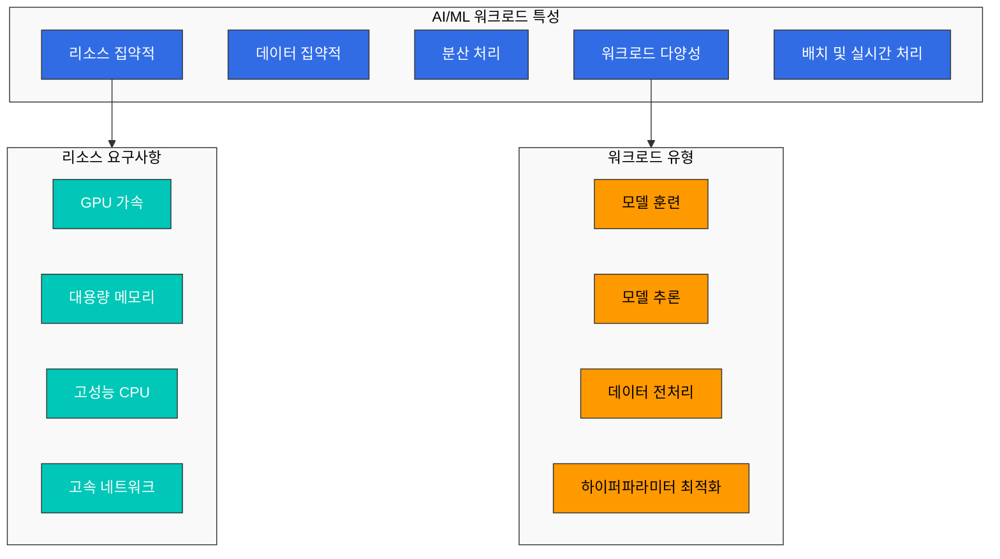
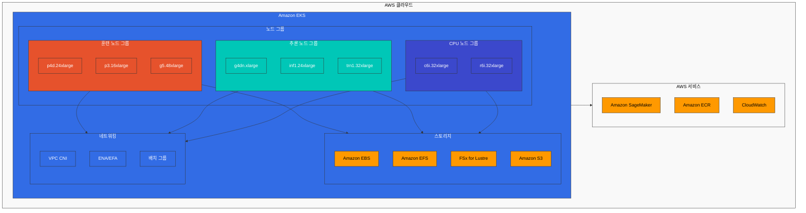
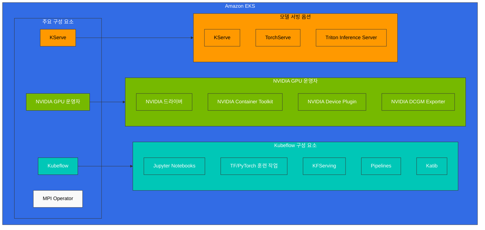
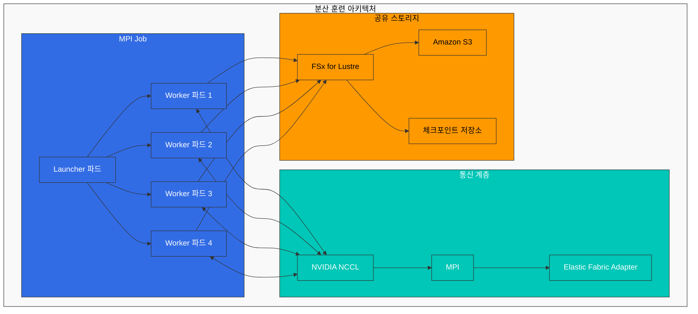
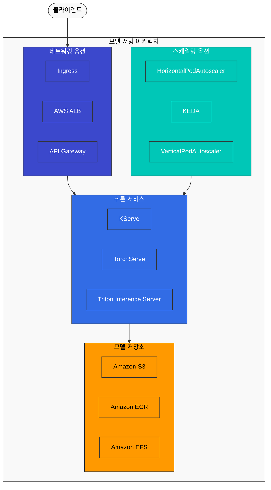
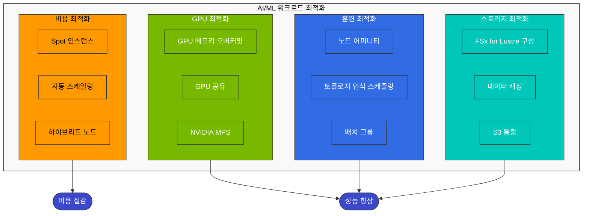
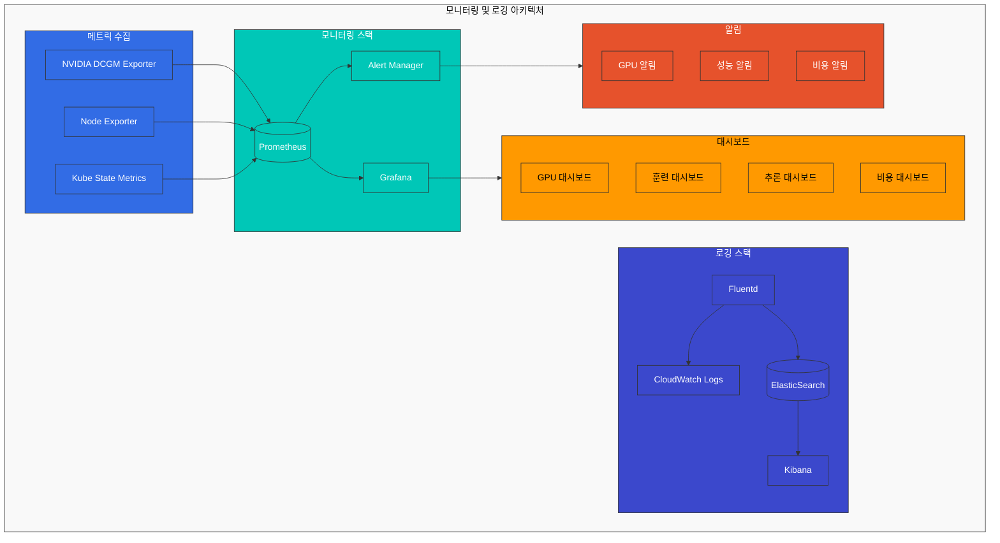

# AI/ML 워크로드

> **지원 버전**: Kubernetes 1.26, 1.27, 1.28  
> **마지막 업데이트**: 2023년 7월 20일

Kubernetes는 AI/ML 워크로드를 실행하기 위한 강력한 플랫폼입니다. 이 장에서는 EKS에서 AI/ML 워크로드를 실행하는 방법과 모범 사례를 알아보겠습니다.

## AI/ML 워크로드의 특성

AI/ML 워크로드는 일반적인 애플리케이션 워크로드와 다른 특성을 가지고 있습니다:



1. **리소스 집약적**: GPU, 고성능 CPU, 대용량 메모리 등 많은 컴퓨팅 리소스가 필요합니다.
2. **데이터 집약적**: 대용량 데이터셋에 대한 빠른 액세스가 필요합니다.
3. **분산 처리**: 대규모 모델 훈련을 위해 여러 노드에 걸친 분산 처리가 필요합니다.
4. **워크로드 다양성**: 훈련, 추론, 데이터 전처리 등 다양한 유형의 워크로드가 있습니다.

## 최신 AI/ML 트렌드 (2023)

Kubernetes에서 AI/ML 워크로드를 실행하는 최신 트렌드는 다음과 같습니다:

### 1. 대규모 언어 모델(LLM) 배포

대규모 언어 모델(LLM)은 최근 AI 분야에서 가장 주목받는 기술 중 하나입니다. Kubernetes에서 LLM을 효율적으로 배포하기 위한 주요 고려사항:

- **모델 샤딩**: 대규모 모델을 여러 GPU에 분산하여 로드
- **양자화**: 모델 정밀도를 낮추어 메모리 사용량 감소 (INT8, FP16 등)
- **추론 최적화**: vLLM, TensorRT, ONNX Runtime 등을 사용한 추론 성능 향상
- **스케일링 전략**: 수평적 확장을 통한 처리량 증가

### 2. AI 오케스트레이션 프레임워크

Kubernetes 위에서 AI/ML 워크로드를 관리하기 위한 특화된 오케스트레이션 프레임워크:

- **Kubeflow**: 머신러닝 워크플로우를 위한 종합적인 플랫폼
- **Ray on Kubernetes**: 분산 컴퓨팅 프레임워크
- **KServe**: 서버리스 추론 서비스
- **Seldon Core**: 모델 서빙 및 모니터링

### 3. GPU 공유 및 최적화

GPU 리소스를 효율적으로 활용하기 위한 기술:

- **MIG (Multi-Instance GPU)**: NVIDIA A100/H100 GPU의 파티셔닝
- **시간 공유 스케줄링**: NVIDIA MPS, GPU 시간 슬라이싱
- **동적 할당**: 필요에 따라 GPU 리소스 동적 할당
- **GPU Operator**: Kubernetes에서 GPU 관리 자동화

### 4. MLOps 및 GitOps 통합

AI/ML 라이프사이클 관리를 위한 DevOps 원칙 적용:

- **모델 버전 관리**: Git과 통합된 모델 버전 관리
- **CI/CD 파이프라인**: 모델 훈련 및 배포 자동화
- **A/B 테스팅**: 새로운 모델 버전의 점진적 롤아웃
- **모니터링 및 피드백 루프**: 모델 성능 모니터링 및 재훈련

### 5. 벡터 데이터베이스 통합

임베딩 및 시맨틱 검색을 위한 벡터 데이터베이스 통합:

- **Pinecone**: 관리형 벡터 검색
- **Milvus**: 오픈소스 벡터 데이터베이스
- **Faiss**: Facebook AI의 효율적인 유사성 검색 라이브러리
- **OpenSearch**: 벡터 검색 기능이 추가된 검색 엔진
5. **배치 및 실시간 처리**: 배치 처리와 실시간 추론이 모두 필요합니다.

## EKS에서의 AI/ML 인프라 구성



### 노드 유형 선택

AI/ML 워크로드에 적합한 EC2 인스턴스 유형은 다음과 같습니다:

1. **GPU 인스턴스**:
   - p4d.24xlarge: 8x NVIDIA A100 GPU, 320GB GPU 메모리
   - p3.16xlarge: 8x NVIDIA V100 GPU, 128GB GPU 메모리
   - g5.xlarge~g5.48xlarge: NVIDIA A10G GPU, 최대 8개의 GPU
   - g4dn.xlarge~g4dn.16xlarge: NVIDIA T4 GPU, 최대 4개의 GPU

2. **CPU 최적화 인스턴스**:
   - c6i.32xlarge: 128 vCPU, 256GB 메모리
   - c7g.16xlarge: 64 vCPU (AWS Graviton3), 128GB 메모리

3. **메모리 최적화 인스턴스**:
   - r6i.32xlarge: 128 vCPU, 1024GB 메모리
   - x2gd.16xlarge: 64 vCPU, 1024GB 메모리

4. **Inferentia 인스턴스**:
   - inf1.24xlarge: 16 AWS Inferentia 칩, 96 vCPU, 192GB 메모리

5. **Trainium 인스턴스**:
   - trn1.32xlarge: 16 AWS Trainium 칩, 128 vCPU, 512GB 메모리

### 스토리지 구성

AI/ML 워크로드에는 고성능 스토리지가 필요합니다:

1. **Amazon EBS**:
   - gp3: 기본 범용 SSD 스토리지
   - io2: 고성능 SSD 스토리지
   - st1: 처리량 최적화 HDD 스토리지

2. **Amazon EFS**:
   - 여러 노드에서 공유 데이터에 액세스해야 하는 경우 유용
   - 성능 모드: 범용 또는 최대 I/O
   - 처리량 모드: 버스팅 또는 프로비저닝된 처리량

3. **Amazon FSx for Lustre**:
   - 고성능 병렬 파일 시스템
   - 대규모 데이터셋에 대한 빠른 액세스 제공
   - S3와의 통합으로 데이터 가져오기 및 내보내기 간소화

4. **Amazon S3**:
   - 대용량 데이터셋 저장
   - 훈련 데이터 및 모델 아티팩트 저장

### 네트워킹 구성

분산 훈련을 위한 네트워킹 구성:

1. **클러스터 배치 그룹**:
   - 노드 간 지연 시간 최소화
   - 동일한 가용 영역 내에 노드 배치

2. **향상된 네트워킹**:
   - Elastic Network Adapter(ENA)
   - ENA Express
   - Elastic Fabric Adapter(EFA)

3. **VPC CNI 구성**:
   - 대규모 포드 배포를 위한 IP 주소 관리
   - 보조 IP 주소 범위 구성

## AI/ML 워크로드 배포



### NVIDIA GPU 운영자

NVIDIA GPU 운영자는 Kubernetes 클러스터에서 NVIDIA GPU를 관리하기 위한 도구입니다:

```bash
# Helm을 사용한 설치
helm repo add nvidia https://helm.ngc.nvidia.com/nvidia
helm repo update

helm install --wait --generate-name \
  -n gpu-operator --create-namespace \
  nvidia/gpu-operator
```

GPU 운영자는 다음과 같은 구성 요소를 배포합니다:

1. **NVIDIA 드라이버**: GPU 드라이버 자동 설치
2. **NVIDIA Container Toolkit**: 컨테이너에서 GPU 사용 가능하게 함
3. **NVIDIA Device Plugin**: Kubernetes에 GPU 리소스 노출
4. **NVIDIA DCGM Exporter**: GPU 모니터링 메트릭 제공

### Kubeflow

Kubeflow는 Kubernetes에서 ML 워크플로우를 실행하기 위한 플랫폼입니다:

```bash
# Kubeflow 설치
kustomize build https://github.com/kubeflow/manifests/tree/master/example | kubectl apply -f -
```

Kubeflow는 다음과 같은 구성 요소를 제공합니다:

1. **Jupyter Notebooks**: 대화형 개발 환경
2. **TensorFlow/PyTorch 훈련 작업**: 분산 훈련 작업 실행
3. **KFServing**: 모델 서빙
4. **Pipelines**: 엔드-투-엔드 ML 워크플로우
5. **Katib**: 하이퍼파라미터 튜닝

### 분산 훈련

분산 훈련을 위한 Kubernetes 리소스:



1. **MPI Operator**:

```yaml
apiVersion: kubeflow.org/v1
kind: MPIJob
metadata:
  name: tensorflow-benchmarks
spec:
  slotsPerWorker: 8
  cleanPodPolicy: Running
  mpiReplicaSpecs:
    Launcher:
      replicas: 1
      template:
        spec:
          containers:
          - image: mpioperator/tensorflow-benchmarks:latest
            name: tensorflow-benchmarks
            command:
            - mpirun
            - --allow-run-as-root
            - -np
            - "16"
            - -bind-to
            - none
            - -map-by
            - slot
            - -x
            - NCCL_DEBUG=INFO
            - python
            - scripts/tf_cnn_benchmarks/tf_cnn_benchmarks.py
            - --model=resnet50
            - --batch_size=64
            - --variable_update=horovod
    Worker:
      replicas: 2
      template:
        spec:
          containers:
          - image: mpioperator/tensorflow-benchmarks:latest
            name: tensorflow-benchmarks
            resources:
              limits:
                nvidia.com/gpu: 8
```

2. **PyTorch Elastic**:

```yaml
apiVersion: batch/v1
kind: Job
metadata:
  name: pytorch-elastic-job
spec:
  completions: 1
  parallelism: 1
  template:
    spec:
      containers:
      - name: pytorch-elastic
        image: pytorch/pytorch:1.9.0-cuda10.2-cudnn7-runtime
        command:
        - torchrun
        - --nnodes=2
        - --nproc_per_node=8
        - --rdzv_id=job1
        - --rdzv_backend=c10d
        - --rdzv_endpoint=$(MASTER_ADDR):$(MASTER_PORT)
        - train.py
        env:
        - name: MASTER_ADDR
          value: pytorch-elastic-job-0
        - name: MASTER_PORT
          value: "29500"
        resources:
          limits:
            nvidia.com/gpu: 8
      restartPolicy: Never
```

### 모델 서빙

모델 서빙을 위한 옵션:



1. **KServe**:

```yaml
apiVersion: serving.kserve.io/v1beta1
kind: InferenceService
metadata:
  name: bert-model
spec:
  predictor:
    model:
      modelFormat:
        name: pytorch
      storageUri: s3://my-bucket/bert-model
      resources:
        limits:
          nvidia.com/gpu: 1
```

2. **TorchServe**:

```yaml
apiVersion: apps/v1
kind: Deployment
metadata:
  name: torchserve
spec:
  replicas: 3
  selector:
    matchLabels:
      app: torchserve
  template:
    metadata:
      labels:
        app: torchserve
    spec:
      containers:
      - name: torchserve
        image: pytorch/torchserve:latest
        ports:
        - containerPort: 8080
        - containerPort: 8081
        volumeMounts:
        - name: model-store
          mountPath: /home/model-server/model-store
        resources:
          limits:
            nvidia.com/gpu: 1
      volumes:
      - name: model-store
        persistentVolumeClaim:
          claimName: model-store-pvc
---
apiVersion: v1
kind: Service
metadata:
  name: torchserve
spec:
  selector:
    app: torchserve
  ports:
  - port: 8080
    targetPort: 8080
    name: inference
  - port: 8081
    targetPort: 8081
    name: management
  type: LoadBalancer
```

3. **Triton Inference Server**:

```yaml
apiVersion: apps/v1
kind: Deployment
metadata:
  name: triton-server
spec:
  replicas: 3
  selector:
    matchLabels:
      app: triton-server
  template:
    metadata:
      labels:
        app: triton-server
    spec:
      containers:
      - name: triton-server
        image: nvcr.io/nvidia/tritonserver:21.08-py3
        command:
        - tritonserver
        - --model-repository=/models
        ports:
        - containerPort: 8000
        - containerPort: 8001
        - containerPort: 8002
        volumeMounts:
        - name: model-repository
          mountPath: /models
        resources:
          limits:
            nvidia.com/gpu: 1
      volumes:
      - name: model-repository
        persistentVolumeClaim:
          claimName: model-repository-pvc
---
apiVersion: v1
kind: Service
metadata:
  name: triton-server
spec:
  selector:
    app: triton-server
  ports:
  - port: 8000
    targetPort: 8000
    name: http
  - port: 8001
    targetPort: 8001
    name: grpc
  - port: 8002
    targetPort: 8002
    name: metrics
  type: LoadBalancer
```

## AI/ML 워크로드 최적화



### GPU 메모리 최적화

1. **GPU 메모리 오버커밋**:

```yaml
apiVersion: node.k8s.io/v1
kind: RuntimeClass
metadata:
  name: nvidia-mps
handler: nvidia-container-runtime
---
apiVersion: v1
kind: Pod
metadata:
  name: cuda-mps
spec:
  runtimeClassName: nvidia-mps
  containers:
  - name: cuda-mps
    image: nvidia/cuda:11.6.0-base-ubuntu20.04
    command: ["nvidia-cuda-mps-control", "-d"]
    securityContext:
      privileged: true
    resources:
      limits:
        nvidia.com/gpu: 1
```

2. **GPU 공유**:

```yaml
apiVersion: v1
kind: Pod
metadata:
  name: gpu-pod-1
spec:
  containers:
  - name: gpu-container
    image: nvidia/cuda:11.6.0-base-ubuntu20.04
    resources:
      limits:
        nvidia.com/gpu: 0.5
```

### 분산 훈련 최적화

1. **노드 어피니티**:

```yaml
apiVersion: v1
kind: Pod
metadata:
  name: gpu-pod
spec:
  affinity:
    nodeAffinity:
      requiredDuringSchedulingIgnoredDuringExecution:
        nodeSelectorTerms:
        - matchExpressions:
          - key: node.kubernetes.io/instance-type
            operator: In
            values:
            - p3.16xlarge
    podAntiAffinity:
      requiredDuringSchedulingIgnoredDuringExecution:
      - labelSelector:
          matchExpressions:
          - key: app
            operator: In
            values:
            - gpu-intensive
        topologyKey: kubernetes.io/hostname
  containers:
  - name: gpu-container
    image: nvidia/cuda:11.6.0-base-ubuntu20.04
    resources:
      limits:
        nvidia.com/gpu: 8
```

2. **토폴로지 인식 스케줄링**:

```yaml
apiVersion: v1
kind: Pod
metadata:
  name: gpu-pod
  annotations:
    topology.kubernetes.io/region: us-west-2
    topology.kubernetes.io/zone: us-west-2a
spec:
  containers:
  - name: gpu-container
    image: nvidia/cuda:11.6.0-base-ubuntu20.04
    resources:
      limits:
        nvidia.com/gpu: 8
```

### 스토리지 최적화

1. **FSx for Lustre 구성**:

```yaml
apiVersion: fsx.aws.k8s.io/v1beta1
kind: Lustre
metadata:
  name: lustre-fs
spec:
  deploymentType: SCRATCH_2
  storageCapacity: 1200
  subnetIds:
    - subnet-0123456789abcdef0
  securityGroupIds:
    - sg-0123456789abcdef0
  perUnitStorageThroughput: 200
---
apiVersion: storage.k8s.io/v1
kind: StorageClass
metadata:
  name: fsx-lustre
provisioner: fsx.csi.aws.com
parameters:
  fileSystemId: fs-0123456789abcdef0
  mountName: lustre-fs
---
apiVersion: v1
kind: PersistentVolumeClaim
metadata:
  name: lustre-pvc
spec:
  accessModes:
    - ReadWriteMany
  storageClassName: fsx-lustre
  resources:
    requests:
      storage: 1200Gi
```

2. **데이터 캐싱**:

```yaml
apiVersion: apps/v1
kind: DaemonSet
metadata:
  name: alluxio-worker
spec:
  selector:
    matchLabels:
      app: alluxio-worker
  template:
    metadata:
      labels:
        app: alluxio-worker
    spec:
      containers:
      - name: alluxio-worker
        image: alluxio/alluxio:2.7.3
        resources:
          limits:
            memory: 8Gi
        volumeMounts:
        - name: alluxio-domain
          mountPath: /opt/domain
      volumes:
      - name: alluxio-domain
        hostPath:
          path: /mnt/alluxio
          type: DirectoryOrCreate
```

## 모니터링 및 로깅



### Prometheus 및 Grafana

```yaml
apiVersion: monitoring.coreos.com/v1
kind: ServiceMonitor
metadata:
  name: gpu-metrics
  namespace: monitoring
spec:
  selector:
    matchLabels:
      app: dcgm-exporter
  endpoints:
  - port: metrics
    interval: 15s
---
apiVersion: v1
kind: ConfigMap
metadata:
  name: gpu-dashboard
  namespace: monitoring
  labels:
    grafana_dashboard: "1"
data:
  gpu-dashboard.json: |
    {
      "annotations": {
        "list": [
          {
            "builtIn": 1,
            "datasource": "-- Grafana --",
            "enable": true,
            "hide": true,
            "iconColor": "rgba(0, 211, 255, 1)",
            "name": "Annotations & Alerts",
            "type": "dashboard"
          }
        ]
      },
      "editable": true,
      "gnetId": null,
      "graphTooltip": 0,
      "id": 1,
      "links": [],
      "panels": [
        {
          "aliasColors": {},
          "bars": false,
          "dashLength": 10,
          "dashes": false,
          "datasource": null,
          "fieldConfig": {
            "defaults": {
              "custom": {}
            },
            "overrides": []
          },
          "fill": 1,
          "fillGradient": 0,
          "gridPos": {
            "h": 8,
            "w": 12,
            "x": 0,
            "y": 0
          },
          "hiddenSeries": false,
          "id": 2,
          "legend": {
            "avg": false,
            "current": false,
            "max": false,
            "min": false,
            "show": true,
            "total": false,
            "values": false
          },
          "lines": true,
          "linewidth": 1,
          "nullPointMode": "null",
          "options": {
            "alertThreshold": true
          },
          "percentage": false,
          "pluginVersion": "7.2.0",
          "pointradius": 2,
          "points": false,
          "renderer": "flot",
          "seriesOverrides": [],
          "spaceLength": 10,
          "stack": false,
          "steppedLine": false,
          "targets": [
            {
              "expr": "DCGM_FI_DEV_GPU_UTIL",
              "interval": "",
              "legendFormat": "GPU {{gpu}}",
              "refId": "A"
            }
          ],
          "thresholds": [],
          "timeFrom": null,
          "timeRegions": [],
          "timeShift": null,
          "title": "GPU Utilization",
          "tooltip": {
            "shared": true,
            "sort": 0,
            "value_type": "individual"
          },
          "type": "graph",
          "xaxis": {
            "buckets": null,
            "mode": "time",
            "name": null,
            "show": true,
            "values": []
          },
          "yaxes": [
            {
              "format": "percent",
              "label": null,
              "logBase": 1,
              "max": null,
              "min": null,
              "show": true
            },
            {
              "format": "short",
              "label": null,
              "logBase": 1,
              "max": null,
              "min": null,
              "show": true
            }
          ],
          "yaxis": {
            "align": false,
            "alignLevel": null
          }
        }
      ],
      "schemaVersion": 26,
      "style": "dark",
      "tags": [],
      "templating": {
        "list": []
      },
      "time": {
        "from": "now-6h",
        "to": "now"
      },
      "timepicker": {},
      "timezone": "",
      "title": "GPU Dashboard",
      "uid": "gpu-dashboard",
      "version": 1
    }
```

### 로그 수집

```yaml
apiVersion: v1
kind: ConfigMap
metadata:
  name: fluentd-config
  namespace: logging
data:
  fluent.conf: |
    <source>
      @type tail
      path /var/log/containers/*.log
      pos_file /var/log/fluentd-containers.log.pos
      tag kubernetes.*
      read_from_head true
      <parse>
        @type json
        time_format %Y-%m-%dT%H:%M:%S.%NZ
      </parse>
    </source>
    
    <filter kubernetes.**>
      @type kubernetes_metadata
      @id filter_kube_metadata
    </filter>
    
    <match kubernetes.var.log.containers.**>
      @type cloudwatch_logs
      log_group_name /eks/ml-cluster/pods
      log_stream_name_key $.kubernetes.pod_name
      remove_log_stream_name_key true
      auto_create_stream true
      region us-west-2
    </match>
```

## 비용 최적화

### Spot 인스턴스 활용

```yaml
apiVersion: karpenter.sh/v1alpha5
kind: Provisioner
metadata:
  name: gpu-spot
spec:
  requirements:
  - key: node.kubernetes.io/instance-type
    operator: In
    values:
    - g4dn.xlarge
    - g4dn.2xlarge
    - g4dn.4xlarge
  - key: karpenter.sh/capacity-type
    operator: In
    values:
    - spot
  - key: kubernetes.io/arch
    operator: In
    values:
    - amd64
  limits:
    resources:
      nvidia.com/gpu: 10
  provider:
    instanceProfile: KarpenterNodeInstanceProfile
    subnetSelector:
      karpenter.sh/discovery: gpu-cluster
    securityGroupSelector:
      karpenter.sh/discovery: gpu-cluster
  ttlSecondsAfterEmpty: 30
```

### 자동 스케일링

```yaml
apiVersion: autoscaling/v2
kind: HorizontalPodAutoscaler
metadata:
  name: inference-service
spec:
  scaleTargetRef:
    apiVersion: apps/v1
    kind: Deployment
    name: inference-service
  minReplicas: 1
  maxReplicas: 10
  metrics:
  - type: Resource
    resource:
      name: cpu
      target:
        type: Utilization
        averageUtilization: 70
  - type: Resource
    resource:
      name: nvidia.com/gpu
      target:
        type: Utilization
        averageUtilization: 80
  - type: Pods
    pods:
      metric:
        name: inference_requests_per_second
      target:
        type: AverageValue
        averageValue: 100
```

### 하이브리드 노드 활용

```yaml
apiVersion: v1
kind: Pod
metadata:
  name: training-pod
spec:
  nodeSelector:
    node.kubernetes.io/instance-type: p3.16xlarge
  containers:
  - name: training-container
    image: tensorflow/tensorflow:latest-gpu
    resources:
      limits:
        nvidia.com/gpu: 8
---
apiVersion: v1
kind: Pod
metadata:
  name: inference-pod
spec:
  nodeSelector:
    node.kubernetes.io/instance-type: g4dn.xlarge
  containers:
  - name: inference-container
    image: tensorflow/tensorflow:latest-gpu
    resources:
      limits:
        nvidia.com/gpu: 1
```

## 결론

EKS에서 AI/ML 워크로드를 실행하는 것은 강력한 인프라, 유연한 스케일링, 그리고 다양한 최적화 옵션을 제공합니다. 적절한 노드 유형, 스토리지 구성, 네트워킹 설정을 선택하고, Kubeflow와 같은 도구를 활용하여 ML 워크플로우를 관리하며, GPU 메모리 및 분산 훈련을 최적화하는 것이 중요합니다. 또한, 모니터링 및 로깅을 통해 워크로드 성능을 추적하고, Spot 인스턴스 및 자동 스케일링을 활용하여 비용을 최적화할 수 있습니다.
