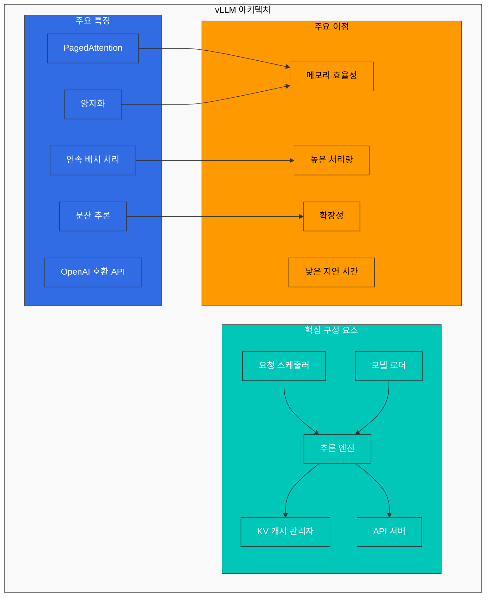
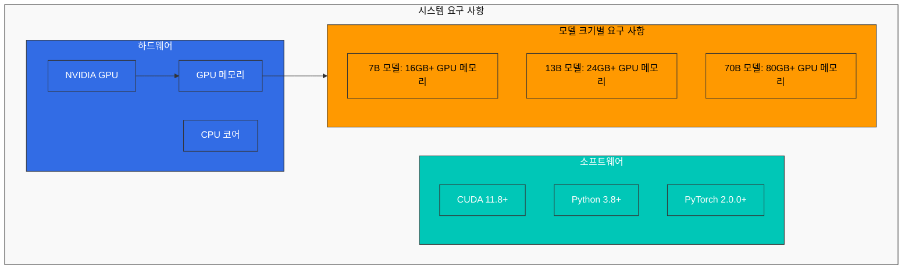
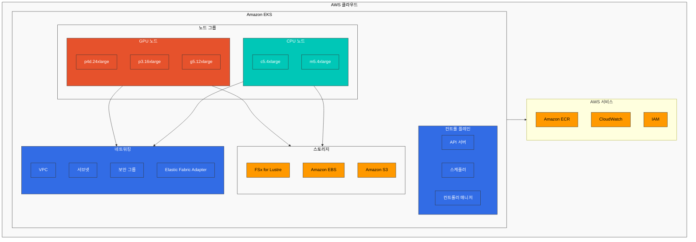
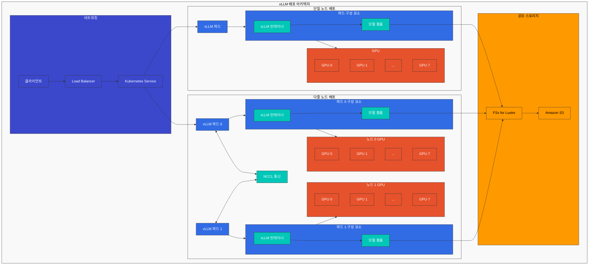
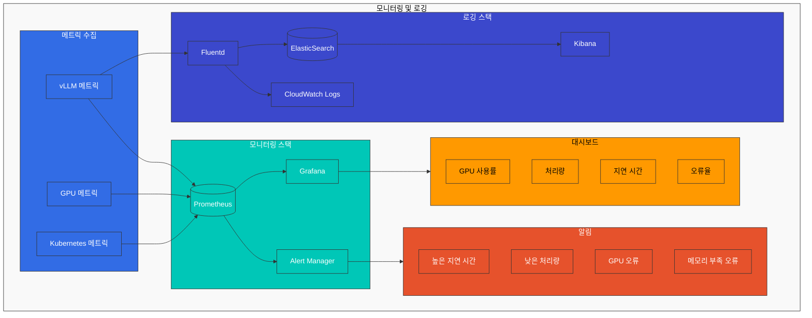
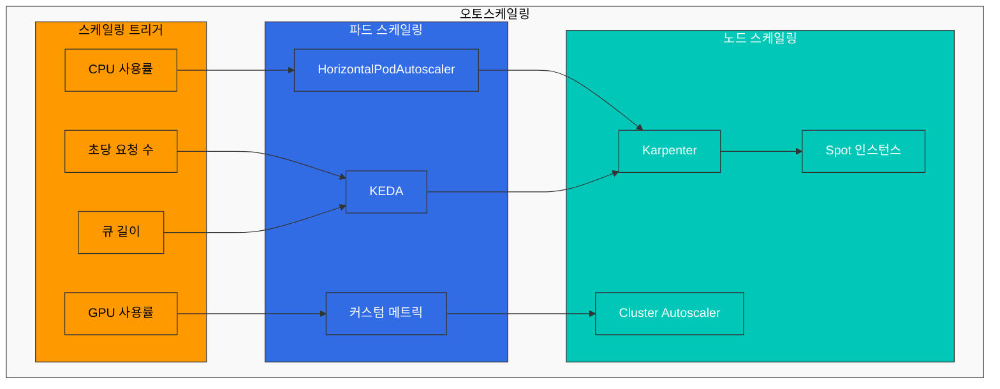
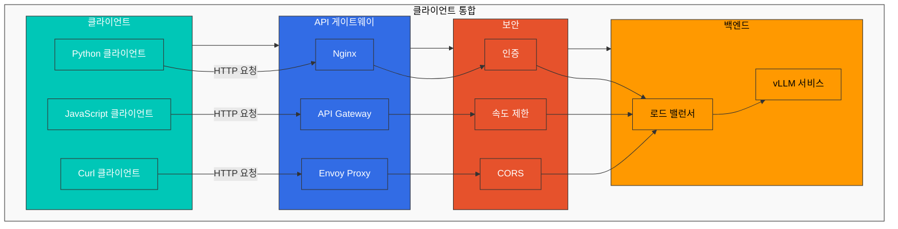

# vLLM 배포

vLLM은 대규모 언어 모델(LLM)을 위한 고성능 추론 엔진입니다. 이 장에서는 EKS에서 vLLM을 배포하고 최적화하는 방법을 알아보겠습니다.

## vLLM 소개

vLLM은 다음과 같은 특징을 가진 LLM 추론 엔진입니다:



1. **PagedAttention**: 메모리 효율적인 어텐션 메커니즘으로, 긴 시퀀스를 처리할 때 메모리 사용량을 최적화합니다.
2. **연속 배치 처리**: 요청을 동적으로 배치 처리하여 처리량을 향상시킵니다.
3. **분산 추론**: 여러 GPU와 노드에 걸쳐 모델을 분산하여 대규모 모델을 처리할 수 있습니다.
4. **양자화**: INT8/INT4 양자화를 지원하여 메모리 사용량을 줄이고 처리량을 향상시킵니다.
5. **OpenAI 호환 API**: OpenAI API와 호환되는 인터페이스를 제공합니다.

## 시스템 요구 사항

vLLM을 EKS에 배포하기 위한 시스템 요구 사항은 다음과 같습니다:



1. **하드웨어**:
   - NVIDIA GPU(Volta, Turing, Ampere, Hopper 아키텍처)
   - 최소 GPU 메모리: 모델 크기에 따라 다름
     - 7B 모델: 최소 16GB GPU 메모리
     - 13B 모델: 최소 24GB GPU 메모리
     - 70B 모델: 최소 80GB GPU 메모리(또는 여러 GPU에 분산)

2. **소프트웨어**:
   - CUDA 11.8 이상
   - Python 3.8 이상
   - PyTorch 2.0.0 이상

3. **EKS 노드 유형**:
   - p4d.24xlarge: 8x NVIDIA A100 GPU, 각 40GB 또는 80GB
   - p3.16xlarge: 8x NVIDIA V100 GPU, 각 16GB
   - g5.12xlarge: 4x NVIDIA A10G GPU, 각 24GB
   - g4dn.12xlarge: 4x NVIDIA T4 GPU, 각 16GB

## EKS 인프라 구성



## 스토리지 구성

vLLM은 대규모 모델 가중치를 로드해야 하므로 고성능 스토리지가 필요합니다:

### FSx for Lustre 설정

FSx for Lustre는 고성능 병렬 파일 시스템으로, 대규모 모델 가중치를 빠르게 로드하는 데 적합합니다:

```yaml
apiVersion: fsx.aws.k8s.io/v1beta1
kind: Lustre
metadata:
  name: vllm-models
spec:
  deploymentType: SCRATCH_2
  storageCapacity: 1200
  subnetIds:
    - subnet-0123456789abcdef0
  securityGroupIds:
    - sg-0123456789abcdef0
  perUnitStorageThroughput: 200
---
apiVersion: storage.k8s.io/v1
kind: StorageClass
metadata:
  name: fsx-lustre-sc
provisioner: fsx.csi.aws.com
parameters:
  fileSystemId: fs-0123456789abcdef0
  mountName: vllm-models
---
apiVersion: v1
kind: PersistentVolumeClaim
metadata:
  name: vllm-models-pvc
spec:
  accessModes:
    - ReadWriteMany
  storageClassName: fsx-lustre-sc
  resources:
    requests:
      storage: 1200Gi
```

### S3에서 모델 다운로드

Hugging Face 모델을 S3에 저장하고 FSx for Lustre로 다운로드하는 작업:

```yaml
apiVersion: batch/v1
kind: Job
metadata:
  name: model-download
spec:
  template:
    spec:
      containers:
      - name: model-download
        image: huggingface/transformers:latest
        command:
        - python
        - -c
        - |
          from huggingface_hub import snapshot_download
          import os
          
          model_id = "meta-llama/Llama-2-70b-chat-hf"
          dest_dir = "/models/llama-2-70b"
          
          os.makedirs(dest_dir, exist_ok=True)
          snapshot_download(repo_id=model_id, local_dir=dest_dir, token=os.environ["HF_TOKEN"])
        env:
        - name: HF_TOKEN
          valueFrom:
            secretKeyRef:
              name: huggingface-token
              key: token
        volumeMounts:
        - name: models-volume
          mountPath: /models
      restartPolicy: Never
      volumes:
      - name: models-volume
        persistentVolumeClaim:
          claimName: vllm-models-pvc
```

## vLLM 배포

### 배포 아키텍처

다음 다이어그램은 EKS에서 vLLM을 배포하는 두 가지 주요 아키텍처를 보여줍니다:



### 단일 노드 배포

단일 GPU 또는 단일 노드의 여러 GPU에서 vLLM을 실행하는 배포:

```yaml
apiVersion: apps/v1
kind: Deployment
metadata:
  name: vllm-inference
spec:
  replicas: 1
  selector:
    matchLabels:
      app: vllm-inference
  template:
    metadata:
      labels:
        app: vllm-inference
    spec:
      containers:
      - name: vllm-server
        image: vllm/vllm-openai:latest
        command:
        - python
        - -m
        - vllm.entrypoints.openai.api_server
        - --model=/models/llama-2-70b
        - --tensor-parallel-size=8
        - --gpu-memory-utilization=0.9
        - --max-num-batched-tokens=8192
        - --port=8000
        ports:
        - containerPort: 8000
        resources:
          limits:
            nvidia.com/gpu: 8
        volumeMounts:
        - name: models-volume
          mountPath: /models
        env:
        - name: CUDA_VISIBLE_DEVICES
          value: "0,1,2,3,4,5,6,7"
      volumes:
      - name: models-volume
        persistentVolumeClaim:
          claimName: vllm-models-pvc
---
apiVersion: v1
kind: Service
metadata:
  name: vllm-inference
spec:
  selector:
    app: vllm-inference
  ports:
  - port: 8000
    targetPort: 8000
  type: LoadBalancer
```

### 다중 노드 분산 배포

여러 노드에 걸쳐 대규모 모델을 분산 배포하는 방법:

```yaml
apiVersion: v1
kind: ConfigMap
metadata:
  name: vllm-config
data:
  hostfile: |
    vllm-inference-0 slots=8
    vllm-inference-1 slots=8
  run_server.sh: |
    #!/bin/bash
    
    RANK=$HOSTNAME
    if [[ $HOSTNAME == "vllm-inference-0" ]]; then
      RANK=0
    elif [[ $HOSTNAME == "vllm-inference-1" ]]; then
      RANK=1
    fi
    
    python -m vllm.entrypoints.openai.api_server \
      --model=/models/llama-2-70b \
      --tensor-parallel-size=16 \
      --pipeline-parallel-size=1 \
      --max-num-batched-tokens=8192 \
      --port=8000 \
      --host=0.0.0.0 \
      --master-addr=vllm-inference-0 \
      --master-port=29500 \
      --rank=$RANK
---
apiVersion: apps/v1
kind: StatefulSet
metadata:
  name: vllm-inference
spec:
  serviceName: "vllm-inference"
  replicas: 2
  selector:
    matchLabels:
      app: vllm-inference
  template:
    metadata:
      labels:
        app: vllm-inference
    spec:
      affinity:
        podAntiAffinity:
          requiredDuringSchedulingIgnoredDuringExecution:
          - labelSelector:
              matchExpressions:
              - key: app
                operator: In
                values:
                - vllm-inference
            topologyKey: kubernetes.io/hostname
      containers:
      - name: vllm-server
        image: vllm/vllm-openai:latest
        command:
        - bash
        - /config/run_server.sh
        ports:
        - containerPort: 8000
        - containerPort: 29500
        resources:
          limits:
            nvidia.com/gpu: 8
        volumeMounts:
        - name: models-volume
          mountPath: /models
        - name: config-volume
          mountPath: /config
        env:
        - name: CUDA_VISIBLE_DEVICES
          value: "0,1,2,3,4,5,6,7"
        - name: NCCL_DEBUG
          value: "INFO"
        - name: NCCL_IB_DISABLE
          value: "0"
        - name: NCCL_IB_GID_INDEX
          value: "3"
        - name: NCCL_NET_GDR_LEVEL
          value: "5"
      volumes:
      - name: models-volume
        persistentVolumeClaim:
          claimName: vllm-models-pvc
      - name: config-volume
        configMap:
          name: vllm-config
          defaultMode: 0755
---
apiVersion: v1
kind: Service
metadata:
  name: vllm-inference
spec:
  selector:
    app: vllm-inference
  ports:
  - port: 8000
    targetPort: 8000
    name: api
  - port: 29500
    targetPort: 29500
    name: nccl
  clusterIP: None
---
apiVersion: v1
kind: Service
metadata:
  name: vllm-inference-lb
spec:
  selector:
    app: vllm-inference
    statefulset.kubernetes.io/pod-name: vllm-inference-0
  ports:
  - port: 8000
    targetPort: 8000
  type: LoadBalancer
```

## 성능 최적화

```mermaid
flowchart TD
    subgraph Optimization [성능 최적화]
        subgraph GPUMemory [GPU 메모리 최적화]
            MemoryUtil[GPU 메모리 사용률 조정]
            Quantization[양자화 적용]
            SwapSpace[스왑 공간 활용]
        end
        
        subgraph Throughput [처리량 최적화]
            BatchSize[배치 크기 조정]
            KVCache[KV 캐시 최적화]
            TensorParallel[텐서 병렬 처리]
        end
        
        subgraph NetworkOpt [네트워크 최적화]
            EFA[EFA 활용]
            NCCLSettings[NCCL 설정 최적화]
            NodePlacement[노드 배치 최적화]
        end
    end
    
    MemoryUtil -->|--gpu-memory-utilization=0.9| Performance([성능 향상])
    Quantization -->|--quantization awq| Performance
    SwapSpace -->|--swap-space=16| Performance
    
    BatchSize -->|--max-num-batched-tokens=8192| Performance
    KVCache -->|--block-size=16| Performance
    TensorParallel -->|--tensor-parallel-size=8| Performance
    
    EFA -->|vpc.amazonaws.com/efa: 1| Performance
    NCCLSettings -->|NCCL_DEBUG=INFO| Performance
    NodePlacement -->|topology.kubernetes.io/zone| Performance
    
    classDef gpuMemNode fill:#326CE5,stroke:#333,stroke-width:1px,color:white;
    classDef throughputNode fill:#00C7B7,stroke:#333,stroke-width:1px,color:white;
    classDef networkNode fill:#E6522C,stroke:#333,stroke-width:1px,color:white;
    classDef performanceNode fill:#FF9900,stroke:#333,stroke-width:1px,color:black;
    classDef default fill:#f9f9f9,stroke:#333,stroke-width:1px,color:black;
    
    class MemoryUtil,Quantization,SwapSpace,GPUMemory gpuMemNode;
    class BatchSize,KVCache,TensorParallel,Throughput throughputNode;
    class EFA,NCCLSettings,NodePlacement,NetworkOpt networkNode;
    class Performance performanceNode;
    class Optimization default;
```



### GPU 메모리 최적화

vLLM의 GPU 메모리 사용량을 최적화하는 방법:

1. **GPU 메모리 사용률 조정**:

```bash
--gpu-memory-utilization=0.9
```

2. **양자화 적용**:

```bash
--quantization awq
```

3. **스왑 공간 활용**:

```bash
--swap-space=16
```

### 처리량 최적화

vLLM의 처리량을 최적화하는 방법:

1. **배치 크기 조정**:

```bash
--max-num-batched-tokens=8192
```

2. **KV 캐시 최적화**:

```bash
--block-size=16
```

3. **텐서 병렬 처리 조정**:

```bash
--tensor-parallel-size=8
```

### 네트워크 최적화

분산 배포에서 네트워크 성능을 최적화하는 방법:

1. **EFA(Elastic Fabric Adapter) 활용**:

```yaml
resources:
  limits:
    nvidia.com/gpu: 8
    vpc.amazonaws.com/efa: 1
```

2. **NCCL 설정 최적화**:

```yaml
env:
- name: NCCL_DEBUG
  value: "INFO"
- name: NCCL_MIN_NCHANNELS
  value: "4"
- name: NCCL_SOCKET_IFNAME
  value: "^lo,docker"
- name: NCCL_ASYNC_ERROR_HANDLING
  value: "1"
```

3. **노드 배치 최적화**:

```yaml
affinity:
  nodeAffinity:
    requiredDuringSchedulingIgnoredDuringExecution:
      nodeSelectorTerms:
      - matchExpressions:
        - key: topology.kubernetes.io/zone
          operator: In
          values:
          - us-west-2a
```

## 모니터링 및 로깅



### Prometheus 메트릭

vLLM 서버에서 Prometheus 메트릭을 수집하는 방법:

```yaml
apiVersion: v1
kind: Service
metadata:
  name: vllm-metrics
  labels:
    app: vllm-inference
spec:
  selector:
    app: vllm-inference
  ports:
  - port: 8001
    targetPort: 8001
    name: metrics
---
apiVersion: monitoring.coreos.com/v1
kind: ServiceMonitor
metadata:
  name: vllm-metrics
  namespace: monitoring
spec:
  selector:
    matchLabels:
      app: vllm-inference
  endpoints:
  - port: metrics
    interval: 15s
```

### 로그 수집

vLLM 서버의 로그를 CloudWatch로 수집하는 방법:

```yaml
apiVersion: v1
kind: ConfigMap
metadata:
  name: fluentd-config
  namespace: logging
data:
  fluent.conf: |
    <source>
      @type tail
      path /var/log/containers/vllm-*.log
      pos_file /var/log/fluentd-vllm.log.pos
      tag kubernetes.vllm.*
      read_from_head true
      <parse>
        @type json
        time_format %Y-%m-%dT%H:%M:%S.%NZ
      </parse>
    </source>
    
    <filter kubernetes.vllm.**>
      @type kubernetes_metadata
      @id filter_kube_metadata
    </filter>
    
    <match kubernetes.vllm.**>
      @type cloudwatch_logs
      log_group_name /eks/vllm/logs
      log_stream_name_key $.kubernetes.pod_name
      remove_log_stream_name_key true
      auto_create_stream true
      region us-west-2
    </match>
```

## 오토스케일링



### HPA(Horizontal Pod Autoscaler)

요청량에 따라 vLLM 서버를 자동으로 스케일링하는 방법:

```yaml
apiVersion: autoscaling/v2
kind: HorizontalPodAutoscaler
metadata:
  name: vllm-inference-hpa
spec:
  scaleTargetRef:
    apiVersion: apps/v1
    kind: Deployment
    name: vllm-inference
  minReplicas: 1
  maxReplicas: 5
  metrics:
  - type: Resource
    resource:
      name: cpu
      target:
        type: Utilization
        averageUtilization: 70
  - type: Pods
    pods:
      metric:
        name: requests_per_second
      target:
        type: AverageValue
        averageValue: 100
```

### Karpenter를 사용한 노드 오토스케일링

GPU 노드를 자동으로 프로비저닝하는 방법:

```yaml
apiVersion: karpenter.sh/v1alpha5
kind: Provisioner
metadata:
  name: vllm-gpu
spec:
  requirements:
  - key: node.kubernetes.io/instance-type
    operator: In
    values:
    - p3.16xlarge
    - g5.12xlarge
  - key: karpenter.sh/capacity-type
    operator: In
    values:
    - on-demand
  - key: kubernetes.io/arch
    operator: In
    values:
    - amd64
  - key: vpc.amazonaws.com/efa
    operator: In
    values:
    - "true"
  limits:
    resources:
      nvidia.com/gpu: 32
  provider:
    instanceProfile: KarpenterNodeInstanceProfile
    subnetSelector:
      karpenter.sh/discovery: vllm-cluster
    securityGroupSelector:
      karpenter.sh/discovery: vllm-cluster
  ttlSecondsAfterEmpty: 30
```

## 보안 구성

### 네트워크 정책

vLLM 서버에 대한 네트워크 액세스를 제한하는 방법:

```yaml
apiVersion: networking.k8s.io/v1
kind: NetworkPolicy
metadata:
  name: vllm-network-policy
spec:
  podSelector:
    matchLabels:
      app: vllm-inference
  policyTypes:
  - Ingress
  - Egress
  ingress:
  - from:
    - podSelector:
        matchLabels:
          app: api-gateway
    ports:
    - protocol: TCP
      port: 8000
  - from:
    - podSelector:
        matchLabels:
          app: vllm-inference
    ports:
    - protocol: TCP
      port: 29500
  egress:
  - to:
    - podSelector:
        matchLabels:
          app: vllm-inference
    ports:
    - protocol: TCP
      port: 29500
  - to:
    ports:
    - protocol: TCP
      port: 443
```

### 보안 컨텍스트

컨테이너의 보안 컨텍스트를 구성하는 방법:

```yaml
securityContext:
  runAsUser: 1000
  runAsGroup: 1000
  fsGroup: 1000
  allowPrivilegeEscalation: false
  capabilities:
    drop:
    - ALL
```

## 클라이언트 통합



### API 게이트웨이

vLLM 서버 앞에 API 게이트웨이를 배포하는 방법:

```yaml
apiVersion: apps/v1
kind: Deployment
metadata:
  name: api-gateway
spec:
  replicas: 3
  selector:
    matchLabels:
      app: api-gateway
  template:
    metadata:
      labels:
        app: api-gateway
    spec:
      containers:
      - name: api-gateway
        image: nginx:latest
        ports:
        - containerPort: 80
        volumeMounts:
        - name: nginx-config
          mountPath: /etc/nginx/conf.d
      volumes:
      - name: nginx-config
        configMap:
          name: nginx-config
---
apiVersion: v1
kind: ConfigMap
metadata:
  name: nginx-config
data:
  default.conf: |
    server {
      listen 80;
      
      location /v1/ {
        proxy_pass http://vllm-inference:8000;
        proxy_set_header Host $host;
        proxy_set_header X-Real-IP $remote_addr;
      }
    }
---
apiVersion: v1
kind: Service
metadata:
  name: api-gateway
spec:
  selector:
    app: api-gateway
  ports:
  - port: 80
    targetPort: 80
  type: LoadBalancer
```

### 클라이언트 예제

Python 클라이언트를 사용하여 vLLM 서버에 요청을 보내는 방법:

```python
import requests
import json

url = "http://api-gateway/v1/completions"

payload = {
    "model": "llama-2-70b",
    "prompt": "Once upon a time",
    "max_tokens": 100,
    "temperature": 0.7
}

headers = {
    "Content-Type": "application/json"
}

response = requests.post(url, headers=headers, data=json.dumps(payload))

print(response.json())
```

## 모범 사례

### 리소스 관리

1. **메모리 오버헤드 고려**:
   - GPU 메모리 외에도 CPU 메모리를 충분히 할당합니다.
   - 모델 크기의 약 2배 정도의 CPU 메모리를 할당하는 것이 좋습니다.

2. **CPU 코어 할당**:
   - GPU당 최소 4개의 CPU 코어를 할당합니다.
   - 텐서 병렬 처리를 사용하는 경우 더 많은 CPU 코어가 필요할 수 있습니다.

3. **노드 선택**:
   - 모델 크기에 맞는 적절한 노드 유형을 선택합니다.
   - 메모리 대역폭이 높은 노드를 선택합니다.

### 고가용성

1. **다중 가용 영역 배포**:
   - 여러 가용 영역에 걸쳐 vLLM 서버를 배포합니다.
   - 각 가용 영역에 충분한 용량을 확보합니다.

2. **로드 밸런싱**:
   - 여러 vLLM 서버 인스턴스 간에 요청을 분산합니다.
   - 세션 어피니티를 구성하여 동일한 사용자의 요청이 동일한 서버로 라우팅되도록 합니다.

3. **장애 복구**:
   - 상태 확인을 구성하여 장애가 발생한 서버를 감지합니다.
   - 자동 복구 메커니즘을 구현합니다.

### 비용 최적화

1. **Spot 인스턴스 활용**:
   - 비용을 절감하기 위해 Spot 인스턴스를 사용합니다.
   - 중단 허용 워크로드에 적합합니다.

2. **모델 양자화**:
   - INT8 또는 INT4 양자화를 적용하여 메모리 사용량을 줄입니다.
   - 정확도와 성능 간의 균형을 고려합니다.

3. **오토스케일링**:
   - 요청량에 따라 서버를 자동으로 스케일링합니다.
   - 유휴 시간에는 서버를 축소하여 비용을 절감합니다.

## 결론

EKS에서 vLLM을 배포하는 것은 대규모 언어 모델을 효율적으로 제공하기 위한 강력한 방법입니다. 적절한 하드웨어 선택, 스토리지 구성, 성능 최적화, 모니터링 및 로깅, 오토스케일링, 보안 구성 등을 통해 안정적이고 확장 가능한 LLM 추론 서비스를 구축할 수 있습니다. 또한, 모범 사례를 따르면 리소스 관리, 고가용성, 비용 최적화 측면에서 더 나은 결과를 얻을 수 있습니다.
