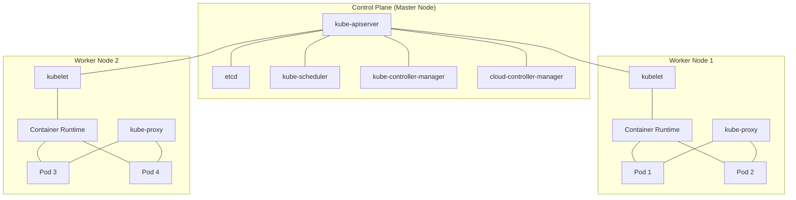

# Kubernetes 소개

## Kubernetes란 무엇인가?

Kubernetes(쿠버네티스, 약칭 K8s)는 컨테이너화된 애플리케이션의 자동 배포, 스케일링 및 관리를 위한 오픈소스 플랫폼입니다. 구글이 내부적으로 사용하던 Borg 시스템에서 영감을 받아 개발되었으며, 2014년에 오픈소스로 공개되었습니다. 현재는 Cloud Native Computing Foundation(CNCF)에서 관리하고 있습니다.

Kubernetes는 다음과 같은 핵심 기능을 제공합니다:

- **서비스 디스커버리와 로드 밸런싱**: Kubernetes는 DNS 이름을 사용하거나 자체 IP 주소를 사용하여 컨테이너를 노출할 수 있습니다. 컨테이너에 대한 트래픽이 많으면, Kubernetes는 네트워크 트래픽을 로드 밸런싱하고 분산하여 배포가 안정적으로 이루어지도록 합니다.

- **스토리지 오케스트레이션**: Kubernetes를 사용하면 로컬 저장소, 퍼블릭 클라우드 제공자 등과 같은 저장소 시스템을 자동으로 마운트할 수 있습니다.

- **자동화된 롤아웃과 롤백**: Kubernetes를 사용하여 배포된 컨테이너의 원하는 상태를 서술할 수 있으며, 현재 상태를 원하는 상태로 설정한 속도에 따라 변경할 수 있습니다.

- **자동화된 빈 패킹(bin packing)**: 컨테이너화된 작업을 실행하는데 사용할 수 있는 Kubernetes 클러스터 노드를 제공합니다. 각 컨테이너가 필요로 하는 CPU와 메모리(RAM)를 Kubernetes에게 지시합니다. Kubernetes는 컨테이너를 노드에 맞추어서 리소스를 가장 효율적으로 사용할 수 있도록 합니다.

- **자가 치유**: Kubernetes는 실패한 컨테이너를 다시 시작하고, 컨테이너를 교체하며, '사용자 정의 상태 검사'에 응답하지 않는 컨테이너를 죽이고, 서비스 준비가 끝날 때까지 그러한 과정을 클라이언트에 보여주지 않습니다.

- **시크릿과 구성 관리**: Kubernetes를 사용하면 암호, OAuth 토큰 및 SSH 키와 같은 중요한 정보를 저장하고 관리할 수 있습니다. 컨테이너 이미지를 재구성하지 않고 스택 구성에 시크릿을 배포하고 업데이트할 수 있습니다.

## 컨테이너 오케스트레이션의 필요성

컨테이너 기술은 애플리케이션과 그 종속성을 패키징하는 효율적인 방법을 제공하지만, 프로덕션 환경에서 컨테이너를 관리하는 것은 복잡한 작업입니다. 특히 다음과 같은 문제가 발생합니다:

1. **스케일링**: 수요에 따라 컨테이너 인스턴스를 자동으로 확장하거나 축소해야 합니다.
2. **로드 밸런싱**: 여러 컨테이너 인스턴스 간에 트래픽을 분산해야 합니다.
3. **서비스 디스커버리**: 컨테이너가 서로를 찾고 통신할 수 있어야 합니다.
4. **롤링 업데이트**: 다운타임 없이 애플리케이션을 업데이트해야 합니다.
5. **자가 치유**: 실패한 컨테이너를 자동으로 감지하고 교체해야 합니다.
6. **구성 관리**: 애플리케이션 구성을 외부화하고 관리해야 합니다.
7. **보안**: 컨테이너 간의 통신을 보호하고 민감한 정보를 안전하게 관리해야 합니다.

컨테이너 오케스트레이션 도구인 Kubernetes는 이러한 문제를 해결하기 위한 통합 솔루션을 제공합니다. Kubernetes를 사용하면 개발자와 운영팀이 컨테이너화된 애플리케이션을 대규모로 관리하고 배포하는 복잡성을 추상화할 수 있습니다.

## Kubernetes의 역사와 발전

Kubernetes의 역사는 구글의 내부 시스템인 Borg에서 시작됩니다. Borg는 구글이 수년 동안 내부적으로 사용해온 컨테이너 오케스트레이션 시스템으로, 수천 개의 애플리케이션을 관리하는 데 사용되었습니다.

### 주요 이정표:

- **2014년 6월**: 구글이 Kubernetes 프로젝트를 오픈소스로 공개
- **2015년 7월**: Kubernetes 1.0 출시 및 Cloud Native Computing Foundation(CNCF) 설립
- **2016년**: 주요 클라우드 제공업체들이 관리형 Kubernetes 서비스 출시 시작
- **2017년**: Kubernetes가 Docker Swarm과 Apache Mesos를 제치고 컨테이너 오케스트레이션의 사실상 표준으로 부상
- **2018년**: Kubernetes가 CNCF의 첫 번째 '졸업' 프로젝트가 됨
- **2019년-현재**: 지속적인 기능 개선 및 생태계 확장

Kubernetes는 빠르게 발전하여 현재는 클라우드 네이티브 애플리케이션 개발의 핵심 구성 요소가 되었습니다. 다양한 기업과 조직이 Kubernetes를 채택하고 있으며, 풍부한 생태계가 형성되어 있습니다.

## Kubernetes 아키텍처 개요

Kubernetes는 마스터-노드 아키텍처를 따릅니다. 클러스터는 하나 이상의 마스터 노드와 여러 워커 노드로 구성됩니다.

### 마스터 컴포넌트 (컨트롤 플레인)

마스터 컴포넌트는 클러스터의 컨트롤 플레인을 형성하며, 클러스터에 대한 전역 결정(예: 스케줄링)을 내리고 클러스터 이벤트(예: 디플로이먼트의 `replicas` 필드가 충족되지 않을 때 새로운 포드 시작)를 감지하고 응답합니다.

- **kube-apiserver**: API 서버는 Kubernetes API를 노출하는 마스터 컴포넌트입니다. 모든 내부 및 외부 요청의 프론트엔드로 작동합니다.

- **etcd**: 모든 클러스터 데이터를 저장하는 일관성 있고 고가용성을 갖춘 키-값 저장소입니다.

- **kube-scheduler**: 노드가 할당되지 않은 새로 생성된 포드를 감시하고, 실행할 노드를 선택합니다.

- **kube-controller-manager**: 컨트롤러 프로세스를 실행하는 마스터 컴포넌트입니다. 논리적으로, 각 컨트롤러는 별도의 프로세스이지만, 복잡성을 줄이기 위해 모두 단일 바이너리로 컴파일되고 단일 프로세스로 실행됩니다.

- **cloud-controller-manager**: 클라우드별 컨트롤 로직을 포함하는 컴포넌트입니다. 클라우드 컨트롤러 매니저를 통해 클러스터를 클라우드 제공자의 API에 연결하고, 해당 클라우드 플랫폼과 상호 작용하는 컴포넌트와 클러스터와만 상호 작용하는 컴포넌트를 분리할 수 있습니다.

### 노드 컴포넌트

노드 컴포넌트는 모든 노드에서 실행되며, 실행 중인 포드를 유지 관리하고 Kubernetes 런타임 환경을 제공합니다.

- **kubelet**: 각 노드에서 실행되는 에이전트로, 포드에서 컨테이너가 확실하게 동작하도록 관리합니다.

- **kube-proxy**: 각 노드에서 실행되는 네트워크 프록시로, Kubernetes 서비스 개념의 구현부입니다. 노드의 네트워크 규칙을 유지 관리하며, 이 네트워크 규칙이 내부 네트워크 세션이나 클러스터 바깥에서 포드로 네트워크 통신을 할 수 있도록 해줍니다.

- **컨테이너 런타임**: 컨테이너 실행을 담당하는 소프트웨어입니다. Kubernetes는 Docker, containerd, CRI-O와 같은 다양한 컨테이너 런타임을 지원합니다.

### 애드온

애드온은 Kubernetes 리소스(DaemonSet, Deployment 등)를 사용하여 클러스터 기능을 구현합니다. 이들은 클러스터 수준의 기능을 제공하기 때문에 애드온에 대한 네임스페이스 리소스는 kube-system 네임스페이스에 속합니다.

- **DNS**: 클러스터 DNS는 Kubernetes 서비스를 위해 DNS 레코드를 제공하는 DNS 서버입니다.

- **웹 UI (대시보드)**: 클러스터를 위한 일반적인 웹 기반 UI���니다.

- **컨테이너 리소스 모니터링**: 중앙 데이터베이스에 컨테이너에 대한 일반적인 시계열 메트릭을 기록하고 해당 데이터를 탐색하기 위한 UI를 제공합니다.

- **클러스터-레벨 로깅**: 중앙 로그 저장소에 컨테이너 로그를 저장하는 메커니즘입니다.

## Kubernetes 아키텍처 다이어그램

## Kubernetes vs 다른 오케스트레이션 도구

Kubernetes는 컨테이너 오케스트레이션 시장에서 지배적인 위치를 차지하고 있지만, 다른 도구들도 특정 사용 사례에 적합할 수 있습니다.

### Docker Swarm

**장점**:
- 설정이 간단하고 학습 곡선이 완만함
- Docker와의 통합이 원활함
- 소규모 배포에 적합함

**단점**:
- 고급 오케스트레이션 기능이 제한적임
- 대규모 배포에서 확장성 문제가 있을 수 있음
- 생태계가 Kubernetes보다 작음

### Apache Mesos + Marathon

**장점**:
- 매우 대규모 클러스터에서 뛰어난 확장성
- 다양한 워크로드 유형(컨테이너, 빅데이터 프레임워크 등) 지원
- 세분화된 리소스 할당

**단점**:
- 설정 및 유지 관리가 복잡함
- 학습 곡선이 가파름
- Kubernetes에 비해 커뮤니티 지원이 적음

### Nomad (HashiCorp)

**장점**:
- 경량화되고 단일 바이너리로 배포 가능
- 컨테이너 및 비컨테이너 워크로드 모두 지원
- HashiCorp 제품(Consul, Vault 등)과의 통합이 원활함

**단점**:
- 기본 기능 세트가 Kubernetes보다 제한적임
- 생태계가 더 작음
- 일부 고급 기능에는 엔터프라이즈 버전이 필요함

### Kubernetes의 차별화 요소

- **풍부한 생태계**: 다양한 도구, 확장 기능 및 통합
- **강력한 커뮤니티 지원**: 활발한 개발 및 지속적인 혁신
- **클라우드 제공업체 지원**: 모든 주요 클라우드 제공업체가 관리형 Kubernetes 서비스 제공
- **선언적 구성**: 인프라를 코드로 관리하는 현대적인 접근 방식
- **자동화된 운영**: 자가 치유, 자동 스케일링 등의 고급 기능
- **이식성**: 온프레미스, 퍼블릭 클라우드, 하이브리드 환경에서 일관된 경험

## 결론

Kubernetes는 컨테이너화된 애플리케이션의 배포, 스케일링 및 관리를 위한 강력한 플랫폼입니다. 그 유연성, 확장성 및 풍부한 기능 세트로 인해 클라우드 네이티브 애플리케이션 개발의 사실상 표준이 되었습니다. 다음 장에서는 Kubernetes 클러스터를 설치하고 구성하는 방법에 대해 알아보겠습니다.

## 참고 자료

- [Kubernetes 공식 문서](https://kubernetes.io/docs/home/)
- [CNCF(Cloud Native Computing Foundation)](https://www.cncf.io/)
- [Kubernetes: Up and Running](https://www.oreilly.com/library/view/kubernetes-up-and/9781492046531/) (Kelsey Hightower, Brendan Burns, Joe Beda)
- [Kubernetes in Action](https://www.manning.com/books/kubernetes-in-action) (Marko Lukša)
