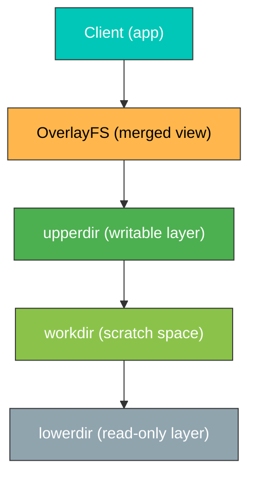
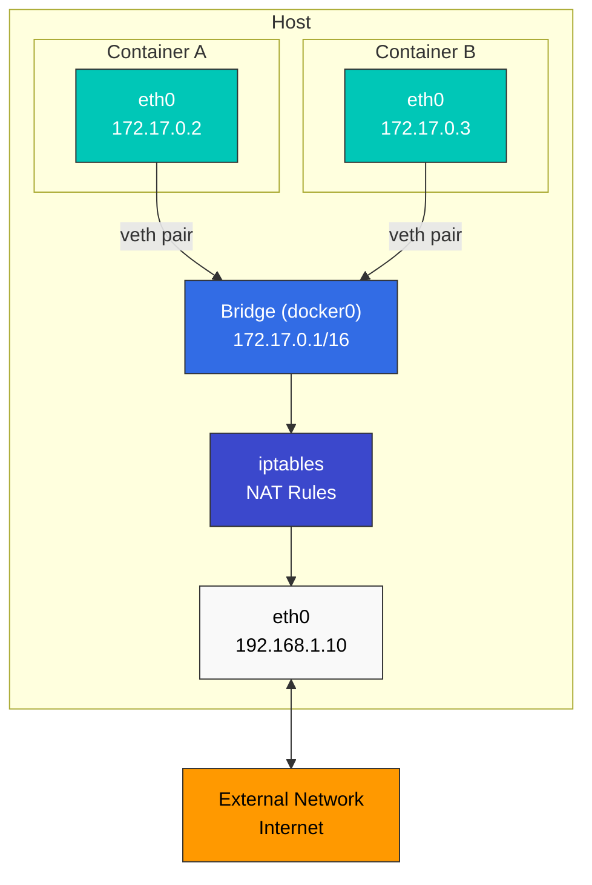

# Linux 기초

> **지원 버전**: 모든 주요 Linux 배포판 (Ubuntu 20.04+, CentOS/RHEL 8+, Debian 11+)  
> **마지막 업데이트**: 2025년 7월 25일

Kubernetes와 컨테이너 기술을 이해하기 위해서는 Linux에 대한 기본적인 이해가 필수적입니다. 이 문서에서는 Kubernetes 환경에서 특히 중요한 Linux의 핵심 개념들을 다룹니다.

## 실습 환경 설정

이 문서의 예제를 따라하기 위해서는 다음과 같은 환경이 필요합니다:

### 필수 환경
- Linux 운영체제 (Ubuntu 20.04+, CentOS/RHEL 8+, Debian 11+ 권장)
- 터미널 액세스
- sudo 권한

### 클라우드 환경 설정 (선택 사항)
AWS EC2 인스턴스를 사용하는 경우:
```bash
# Amazon Linux 2 인스턴스 시작
aws ec2 run-instances \
  --image-id ami-0c55b159cbfafe1f0 \
  --instance-type t3.micro \
  --key-name your-key-pair \
  --security-group-ids sg-12345678 \
  --subnet-id subnet-12345678

# SSH 접속
ssh -i your-key.pem ec2-user@your-instance-public-ip
```

### 로컬 환경 설정 (선택 사항)
로컬 환경에서 실습하려면 다음 중 하나를 사용할 수 있습니다:
- **VirtualBox + Vagrant**: 가상 머신 환경 구성
- **WSL2**: Windows에서 Linux 환경 사용
- **Docker**: 컨테이너 환경에서 실습

## 목차

* [Linux 커널과 사용자 공간](#linux-커널과-사용자-공간)
* [프로세스 관리](#프로세스-관리)
* [네임스페이스](#네임스페이스)
* [cgroups (Control Groups)](#cgroups-control-groups)
* [파일 시스템](#파일-시스템)
* [네트워킹 기초](#네트워킹-기초)
* [보안 컨텍스트](#보안-컨텍스트)
* [주요 Linux 명령어](#주요-linux-명령어)
* [컨테이너 관련 Linux 기능](#컨테이너-관련-linux-기능)

## Linux 커널과 사용자 공간

### 커널의 역할

> **핵심 개념**: Linux 커널은 운영체제의 핵심으로, 하드웨어와 소프트웨어 사이의 중개자 역할을 합니다.

Linux 커널은 운영체제의 핵심으로, 하드웨어와 소프트웨어 사이의 중개자 역할을 합니다. 주요 기능은 다음과 같습니다:

* **프로세스 관리**: 프로세스 생성, 스케줄링, 종료
* **메모리 관리**: 가상 메모리, 물리적 메모리 할당
* **장치 관리**: 하드웨어 장치와의 통신
* **시스템 호출 인터페이스**: 사용자 공간 프로그램이 커널 서비스에 접근할 수 있는 방법 제공

### 사용자 공간

사용자 공간은 일반 응용 프로그램이 실행되는 메모리 영역입니다. 사용자 공간 프로그램은 시스템 호출을 통해 커널 서비스에 접근합니다.

<style>.linux-arch-container{font-family:Arial,sans-serif;margin:20px 0;display:flex;flex-direction:column;align-items:center;width:100%}.linux-arch-user-space{background-color:#326CE5;border:2px solid #2A5CAD;border-radius:10px;padding:10px;margin-bottom:20px;color:white;width:800px;text-align:center}.linux-arch-kernel-space{background-color:#FF9900;border:2px solid #D68000;border-radius:10px;padding:10px;color:black;width:800px;text-align:center}.linux-arch-syscall{background-color:#FFD966;border:2px solid #D6B656;border-radius:5px;padding:10px;margin:10px auto;text-align:center;color:#7F6000;font-weight:bold;width:60%}.linux-arch-kernel-subsystems{background-color:#FFC266;border:2px solid #D6A656;border-radius:10px;padding:10px;margin:10px 0;text-align:center}.linux-arch-hal{background-color:#00C7B7;border:2px solid #00A697;border-radius:10px;padding:10px;margin:10px 0;color:white;text-align:center}.linux-arch-component{background-color:#4F8CEA;border:2px solid #3A77D5;border-radius:5px;padding:5px;margin:5px;display:inline-block;width:170px;text-align:center;color:white;font-weight:bold}.linux-arch-kernel-component{background-color:#FFAA33;border:2px solid #D68C23;color:black;border-radius:5px;padding:5px;margin:5px;display:inline-block;width:170px;text-align:center;font-weight:bold}.linux-arch-hardware-component{background-color:#33DFD1;border:2px solid #23BFAF;color:white;border-radius:5px;padding:5px;margin:5px;display:inline-block;width:170px;text-align:center;font-weight:bold}.linux-arch-section-title{font-weight:bold;margin-bottom:10px;font-size:18px;text-shadow:1px 1px 1px rgba(0,0,0,0.3);text-align:center}.linux-arch-arrow{text-align:center;font-size:24px;margin:5px 0;color:#333}.linux-arch-components-row{display:flex;justify-content:center;flex-wrap:wrap;gap:10px;padding:5px}</style><div class="linux-arch-container"><div class="linux-arch-user-space"><div class="linux-arch-section-title">사용자 공간 (User Space)</div><div class="linux-arch-components-row"><div class="linux-arch-component">웹 서버</div><div class="linux-arch-component">데이터베이스</div><div class="linux-arch-component">컨테이너 런타임</div><div class="linux-arch-component">셸 (bash, zsh)</div></div><div class="linux-arch-components-row"><div class="linux-arch-component" style="width:350px">시스템 라이브러리 (glibc, libcap)</div></div></div><div class="linux-arch-arrow">↓</div><div class="linux-arch-kernel-space"><div class="linux-arch-section-title">커널 공간 (Kernel Space)</div><div class="linux-arch-syscall">시스템 호출 인터페이스</div><div class="linux-arch-arrow">↓</div><div class="linux-arch-kernel-subsystems"><div class="linux-arch-section-title">커널 서브시스템</div><div class="linux-arch-components-row"><div class="linux-arch-kernel-component">프로세스 관리</div><div class="linux-arch-kernel-component">메모리 관리</div><div class="linux-arch-kernel-component">파일 시스템</div><div class="linux-arch-kernel-component">네트워킹</div></div><div class="linux-arch-components-row"><div class="linux-arch-kernel-component">cgroups</div><div class="linux-arch-kernel-component">네임스페이스</div><div class="linux-arch-kernel-component">보안 모듈</div></div></div><div class="linux-arch-arrow">↓</div><div class="linux-arch-hal"><div class="linux-arch-section-title">하드웨어 추상화 계층</div><div class="linux-arch-components-row"><div class="linux-arch-hardware-component">CPU</div><div class="linux-arch-hardware-component">메모리</div><div class="linux-arch-hardware-component">디스크</div><div class="linux-arch-hardware-component">네트워크 인터페이스</div></div></div></div></div>


### 시스템 호출 예시

| 시스템 호출 | 설명 | 관련 명령어 |
|------------|------|------------|
| `fork()` | 새 프로세스 생성 | `ps`, `top` |
| `exec()` | 프로그램 실행 | `bash`, `sh` |
| `open()` | 파일 열기 | `cat`, `less` |
| `read()` | 파일에서 데이터 읽기 | `cat`, `grep` |
| `write()` | 파일에 데이터 쓰기 | `echo`, `tee` |
| `socket()` | 네트워크 소켓 생성 | `netstat`, `ss` |
| `clone()` | 네임스페이스 생성 | `unshare`, `docker` |

### 리눅스 커널 아키텍처


<style>.linux-kernel-container{font-family:Arial,sans-serif;margin:20px 0;display:flex;flex-direction:column;align-items:center;width:100%}.linux-kernel-section{border-radius:10px;padding:15px;margin-bottom:15px;width:800px;text-align:center}.linux-kernel-user-space{background-color:#00C7B7;border:2px solid #009688;color:white}.linux-kernel-kernel-space{background-color:#5C6BC0;border:2px solid #3F51B5;color:white}.linux-kernel-hardware{background-color:#f9f9f9;border:2px solid #e0e0e0;color:black}.linux-kernel-syscall{background-color:#326CE5;border:2px solid #1A56D6;border-radius:5px;padding:10px;margin:10px auto;text-align:center;color:white;font-weight:bold;width:60%}.linux-kernel-subsystems{background-color:#7986CB;border:2px solid #5C6BC0;border-radius:10px;padding:10px;margin:15px 0;text-align:center;color:white}.linux-kernel-drivers{background-color:#7986CB;border:2px solid #5C6BC0;border-radius:5px;padding:10px;margin:15px auto;text-align:center;color:white;font-weight:bold;width:60%}.linux-kernel-app{background-color:#00C7B7;border:2px solid #009688;border-radius:5px;padding:8px;margin:5px;display:inline-block;width:170px;text-align:center;color:white;font-weight:bold}.linux-kernel-lib{background-color:#4DB6AC;border:2px solid #00897B;border-radius:5px;padding:8px;margin:10px;display:inline-block;width:350px;text-align:center;color:white;font-weight:bold}.linux-kernel-subsystem-component{background-color:#5C6BC0;border:2px solid #3F51B5;border-radius:5px;padding:8px;margin:5px;display:inline-block;width:170px;text-align:center;color:white;font-weight:bold}.linux-kernel-hardware-component{background-color:#f9f9f9;border:2px solid #e0e0e0;border-radius:5px;padding:8px;margin:5px;display:inline-block;width:170px;text-align:center;color:black;font-weight:bold}.linux-kernel-section-title{font-weight:bold;margin-bottom:10px;font-size:18px;text-shadow:1px 1px 1px rgba(0,0,0,0.3)}.linux-kernel-arrow{text-align:center;font-size:24px;margin:5px 0;color:#333}.linux-kernel-components-row{display:flex;justify-content:center;flex-wrap:wrap;gap:10px;padding:5px}</style><div class="linux-kernel-container"><div class="linux-kernel-section linux-kernel-user-space"><div class="linux-kernel-section-title">사용자 공간</div><div class="linux-kernel-components-row"><div class="linux-kernel-app">애플리케이션 1</div><div class="linux-kernel-app">애플리케이션 2</div><div class="linux-kernel-app">애플리케이션 3</div><div class="linux-kernel-app">셸 (Bash, Zsh)</div></div><div class="linux-kernel-components-row"><div class="linux-kernel-lib">시스템 라이브러리</div></div></div><div class="linux-kernel-arrow">↓</div><div class="linux-kernel-section linux-kernel-kernel-space"><div class="linux-kernel-section-title">커널 공간</div><div class="linux-kernel-syscall">시스템 호출 인터페이스</div><div class="linux-kernel-arrow">↓</div><div class="linux-kernel-subsystems"><div class="linux-kernel-section-title">커널 서브시스템</div><div class="linux-kernel-components-row"><div class="linux-kernel-subsystem-component">프로세스 관리</div><div class="linux-kernel-subsystem-component">메모리 관리</div><div class="linux-kernel-subsystem-component">파일 시스템</div><div class="linux-kernel-subsystem-component">네트워킹</div><div class="linux-kernel-subsystem-component">보안 (SELinux, AppArmor)</div></div></div><div class="linux-kernel-arrow">↓</div><div class="linux-kernel-drivers">장치 드라이버</div></div><div class="linux-kernel-arrow">↓</div><div class="linux-kernel-section linux-kernel-hardware"><div class="linux-kernel-section-title">하드웨어</div><div class="linux-kernel-components-row"><div class="linux-kernel-hardware-component">CPU</div><div class="linux-kernel-hardware-component">메모리</div><div class="linux-kernel-hardware-component">스토리지</div><div class="linux-kernel-hardware-component">네트워크 카드</div></div></div></div>


## 프로세스 관리

### 프로세스와 스레드

* **프로세스**: 실행 중인 프로그램의 인스턴스로, 독립된 메모리 공간을 가짐
* **스레드**: 프로세스 내에서 실행되는 작업 단위로, 같은 프로세스의 스레드들은 메모리 공간을 공유

### 프로세스 상태

* **실행(Running)**: CPU에서 실행 중
* **대기(Waiting)**: I/O 완료 또는 이벤트 발생 대기
* **준비(Ready)**: 실행 가능하지만 CPU 할당 대기
* **좀비(Zombie)**: 종료되었지만 부모 프로세스가 상태를 확인하지 않은 상태
* **중단(Stopped)**: 일시 중지된 상태

### 주요 프로세스 관리 명령어

```bash
# 프로세스 목록 확인
ps aux

# 실시간 프로세스 모니터링
top

# 더 향상된 실시간 프로세스 모니터링
htop

# 프로세스 종료
kill <PID>
killall <프로세스명>

# 백그라운드 실행
command &

# 작업 관리
jobs
fg %<작업번호>
bg %<작업번호>
```

## 네임스페이스

네임스페이스는 Linux 커널의 기능으로, 프로세스 그룹을 격리하여 각 그룹이 시스템 자원을 독립적으로 볼 수 있게 합니다. 이는 컨테이너 기술의 핵심 요소입니다.

### 주요 네임스페이스 유형

* **PID 네임스페이스**: 프로세스 ID 격리
* **네트워크 네임스페이스**: 네트워크 스택 격리 (인터페이스, 라우팅 테이블, 방화벽 등)
* **마운트 네임스페이스**: 파일 시스템 마운트 포인트 격리
* **UTS 네임스페이스**: 호스트명과 도메인명 격리
* **IPC 네임스페이스**: 프로세스 간 통신 자원 격리
* **사용자 네임스페이스**: 사용자 및 그룹 ID 격리
* **cgroup 네임스페이스**: cgroup 루트 디렉토리 격리

### 네임스페이스 관련 명령어

```bash
# 프로세스의 네임스페이스 확인
ls -la /proc/<PID>/ns/

# 새로운 네임스페이스에서 명령 실행
unshare --net --pid --fork --mount-proc bash

# 기존 프로세스의 네임스페이스에 진입
nsenter --target <PID> --net --pid bash
```

## cgroups (Control Groups)

cgroups는 프로세스 그룹의 자원 사용을 제한하고 격리하는 Linux 커널 기능입니다. 컨테이너의 자원 제한을 구현하는 데 사용됩니다.

### cgroups의 주요 기능

* **CPU 시간 제한**: 프로세스 그룹이 사용할 수 있는 CPU 시간 제한
* **메모리 제한**: 프로세스 그룹이 사용할 수 있는 메모리 양 제한
* **블록 I/O 제한**: 디스크 I/O 대역폭 제한
* **네트워크 대역폭 제한**: 네트워크 트래픽 제한
* **장치 접근 제어**: 특정 장치에 대한 접근 제어

### cgroups v1과 v2

* **cgroups v1**: 각 자원 유형별로 별도의 계층 구조
* **cgroups v2**: 통합된 단일 계층 구조로 더 일관된 관리 제공

### cgroups 관련 명령어

```bash
# cgroups 확인
ls -la /sys/fs/cgroup/

# systemd를 통한 cgroups 관리
systemctl set-property <서비스명> CPUQuota=20%
systemctl set-property <서비스명> MemoryLimit=1G
```

## 파일 시스템

### 파일 시스템 계층 구조

Linux는 단일 루트 디렉토리(`/`)에서 시작하는 계층적 파일 시스템 구조를 가집니다.

주요 디렉토리:

* `/bin`: 기본 명령어
* `/sbin`: 시스템 관리 명령어
* `/etc`: 시스템 구성 파일
* `/home`: 사용자 홈 디렉토리
* `/var`: 가변 데이터 (로그, 캐시 등)
* `/tmp`: 임시 파일
* `/usr`: 사용자 프로그램 및 데이터
* `/proc`: 프로세스 및 커널 정보 (가상 파일 시스템)
* `/sys`: 시스템 및 하드웨어 정보 (가상 파일 시스템)

### 파일 시스템 유형

* **ext4**: Linux의 기본 파일 시스템
* **XFS**: 대용량 파일 시스템에 적합
* **Btrfs**: 스냅샷, 압축 등 고급 기능 제공
* **OverlayFS**: 여러 디렉토리를 겹쳐서 단일 디렉토리로 표현 (컨테이너에서 많이 사용)
* **tmpfs**: 메모리 기반 임시 파일 시스템

### 마운트와 볼륨

```bash
# 파일 시스템 마운트
mount -t <파일시스템유형> <소스> <마운트포인트>

# 마운트된 파일 시스템 확인
mount
df -h

# 파일 시스템 언마운트
umount <마운트포인트>
```

## 네트워킹 기초

### 네트워크 인터페이스

* **lo**: 루프백 인터페이스 (127.0.0.1)
* **eth0, ens3 등**: 물리적 네트워크 인터페이스
* **docker0, cni0 등**: 가상 브릿지 인터페이스 (컨테이너 네트워킹)

### 네트워크 구성 명령어

```bash
# 네트워크 인터페이스 확인
ip addr show
ifconfig

# 라우팅 테이블 확인
ip route
route -n

# 네트워크 연결 확인
netstat -tuln
ss -tuln

# 네트워크 패킷 분석
tcpdump -i <인터페이스>
```

### 네트워크 네임스페이스와 가상 인터페이스

```bash
# 네트워크 네임스페이스 생성
ip netns add <네임스페이스명>

# 가상 이더넷 페어 생성
ip link add <veth1> type veth peer name <veth2>

# 가상 인터페이스를 네임스페이스에 연결
ip link set <veth2> netns <네임스페이스명>
```

## 보안 컨텍스트

### 사용자와 그룹

* **UID (User ID)**: 사용자 식별자
* **GID (Group ID)**: 그룹 식별자
* **root (UID 0)**: 관리자 권한을 가진 특별한 사용자

### 파일 권한

Linux 파일 권한은 소유자, 그룹, 기타 사용자에 대한 읽기(r), 쓰기(w), 실행(x) 권한으로 구성됩니다.

<style>.file-perm-container{font-family:Arial,sans-serif;margin:20px 0;display:flex;flex-direction:column;align-items:center;width:100%}.file-perm-main{display:flex;flex-direction:column;width:900px;border:2px solid #333;border-radius:10px;padding:15px;margin-bottom:20px;background-color:#f8f9fa}.file-perm-title{font-size:20px;font-weight:bold;text-align:center;margin-bottom:15px;color:#333}.file-perm-structure{display:flex;justify-content:space-between;margin-bottom:20px;text-align:center}.file-perm-section{flex:1;padding:10px;margin:0 5px;border-radius:8px;font-weight:bold}.file-perm-type{background-color:#f9f9f9;border:2px solid #333;color:black}.file-perm-owner{background-color:#00C7B7;border:2px solid #009688;color:white}.file-perm-group{background-color:#326CE5;border:2px solid #1A56D6;color:white}.file-perm-other{background-color:#3B48CC;border:2px solid #2A37BB;color:white}.file-perm-details{display:flex;flex-wrap:wrap;justify-content:space-between;margin-top:10px}.file-perm-detail-section{width:22%;margin-bottom:15px;border-radius:8px;padding:10px;box-sizing:border-box}.file-perm-detail-title{font-weight:bold;margin-bottom:8px;text-align:center}.file-perm-detail-content{background-color:rgba(255,255,255,0.7);border-radius:5px;padding:8px;font-size:14px;color:#333}.file-perm-examples{background-color:#FF9900;border:2px solid #E68A00;border-radius:10px;padding:15px;width:900px;color:black}.file-perm-example-row{display:flex;align-items:center;margin:10px 0;font-weight:bold}.file-perm-example-item{padding:8px 15px;margin:0;background-color:rgba(255,255,255,0.7);border-radius:5px;text-align:center}.file-perm-example-table{width:100%;border-collapse:separate;border-spacing:5px}.file-perm-example-table td{padding:8px;background-color:rgba(255,255,255,0.7);border-radius:5px;text-align:center;font-weight:bold;width:25%}.file-perm-arrow{text-align:center;font-size:24px;margin:10px 0;color:#333}</style><div class="file-perm-container"><div class="file-perm-main"><div class="file-perm-title">파일 권한 구조</div><div class="file-perm-structure"><div class="file-perm-section file-perm-type">파일 타입</div><div class="file-perm-section file-perm-owner">소유자 권한</div><div class="file-perm-section file-perm-group">그룹 권한</div><div class="file-perm-section file-perm-other">기타 사용자 권한</div></div><div class="file-perm-details"><div class="file-perm-detail-section file-perm-type"><div class="file-perm-detail-title">파일 타입</div><div class="file-perm-detail-content">-: 일반 파일<br>d: 디렉토리<br>l: 심볼릭 링크<br>c: 문자 장치<br>b: 블록 장치</div></div><div class="file-perm-detail-section file-perm-owner"><div class="file-perm-detail-title">소유자 권한</div><div class="file-perm-detail-content">r: 읽기<br>w: 쓰기<br>x: 실행</div></div><div class="file-perm-detail-section file-perm-group"><div class="file-perm-detail-title">그룹 권한</div><div class="file-perm-detail-content">r: 읽기<br>w: 쓰기<br>x: 실행</div></div><div class="file-perm-detail-section file-perm-other"><div class="file-perm-detail-title">기타 사용자 권한</div><div class="file-perm-detail-content">r: 읽기<br>w: 쓰기<br>x: 실행</div></div></div></div><div class="file-perm-arrow">↓</div><div class="file-perm-examples"><div class="file-perm-title">예시</div><div style="text-align:center;margin-bottom:15px;font-weight:bold;font-size:16px">drwxr-xr--</div><table class="file-perm-example-table"><tr><td>d</td><td>rwx</td><td>r-x</td><td>r--</td></tr><tr><td>디렉토리</td><td>소유자(모든 권한)</td><td>그룹(읽기,실행)</td><td>기타(읽기만)</td></tr></table></div></div>

### 권한 관련 명령어

```bash
# 파일 권한 변경
chmod 755 <파일명>  # rwxr-xr-x
chmod u+x <파일명>  # 소유자에게 실행 권한 추가

# 파일 소유자 변경
chown <사용자>:<그룹> <파일명>

# 특수 권한
chmod 4755 <파일명>  # setuid 설정
chmod 2755 <파일명>  # setgid 설정
chmod 1755 <파일명>  # sticky bit 설정
```

### SELinux와 AppArmor

* **SELinux (Security-Enhanced Linux)**: NSA에서 개발한 강제적 접근 제어 시스템
* **AppArmor**: 프로그램별 보안 프로필을 통한 접근 제어 시스템

## 주요 Linux 명령어

### 파일 및 디렉토리 관리

```bash
ls -la           # 파일 목록 (숨김 파일 포함)
cd <디렉토리>     # 디렉토리 변경
pwd              # 현재 디렉토리 확인
mkdir -p <경로>   # 디렉토리 생성 (필요시 상위 디렉토리도 생성)
rm -rf <경로>     # 파일/디렉토리 삭제
cp -r <소스> <대상> # 파일/디렉토리 복사
mv <소스> <대상>   # 파일/디렉토리 이동 또는 이름 변경
find <경로> -name "<패턴>" # 파일 검색
```

### 텍스트 처리

```bash
cat <파일>        # 파일 내용 출력
less <파일>       # 파일 내용 페이지별 확인
grep "<패턴>" <파일> # 파일에서 패턴 검색
sed 's/<패턴>/<대체>/' <파일> # 텍스트 치환
awk '{print $1}' <파일> # 텍스트 처리
```

### 시스템 정보

```bash
uname -a         # 커널 정보
lsb_release -a   # 배포판 정보
free -h          # 메모리 사용량
df -h            # 디스크 사용량
du -sh <경로>     # 디렉토리 크기
```

### 프로세스 및 서비스 관리

```bash
systemctl status <서비스> # 서비스 상태 확인
systemctl start/stop/restart <서비스> # 서비스 제어
journalctl -u <서비스> # 서비스 로그 확인
```

## 컨테이너 관련 Linux 기능

### OverlayFS

OverlayFS는 여러 디렉토리를 겹쳐서 단일 디렉토리로 표현하는 유니온 마운트 파일 시스템입니다. Docker와 같은 컨테이너 런타임에서 이미지 레이어를 구현하는 데 사용됩니다.



### 네트워크 브릿지와 NAT

컨테이너 네트워킹은 주로 브릿지 인터페이스와 NAT(Network Address Translation)를 사용하여 구현됩니다.



### 시스템 호출 필터링 (seccomp)

seccomp(Secure Computing Mode)는 프로세스가 사용할 수 있는 시스템 호출을 제한하는 Linux 커널 기능입니다. 컨테이너의 보안을 강화하는 데 사용됩니다.

### 기능(Capabilities) 제한

Linux 기능은 전통적인 root 권한을 더 작은 권한 단위로 나눈 것입니다. 컨테이너는 필요한 기능만 부여받아 보안을 강화합니다.

주요 기능:

* `CAP_NET_ADMIN`: 네트워크 설정 변경
* `CAP_SYS_ADMIN`: 시스템 관리 작업
* `CAP_CHOWN`: 파일 소유권 변경
* `CAP_DAC_OVERRIDE`: 파일 권한 무시

## 결론

Linux의 기본 개념과 기능은 Kubernetes와 컨테이너 기술을 이해하는 데 필수적입니다. 특히 네임스페이스, cgroups, OverlayFS와 같은 기능은 컨테이너 격리와 자원 관리의 기반이 됩니다. 이러한 개념을 이해함으로써 Kubernetes 환경에서 발생하는 문제를 더 효과적으로 해결하고 최적화할 수 있습니다.

## 참고 자료

* [The Linux Documentation Project](https://tldp.org/)
* [Linux Kernel Documentation](https://www.kernel.org/doc/)
* [Linux Namespaces](https://man7.org/linux/man-pages/man7/namespaces.7.html)
* [Control Groups v2](https://www.kernel.org/doc/html/latest/admin-guide/cgroup-v2.html)
