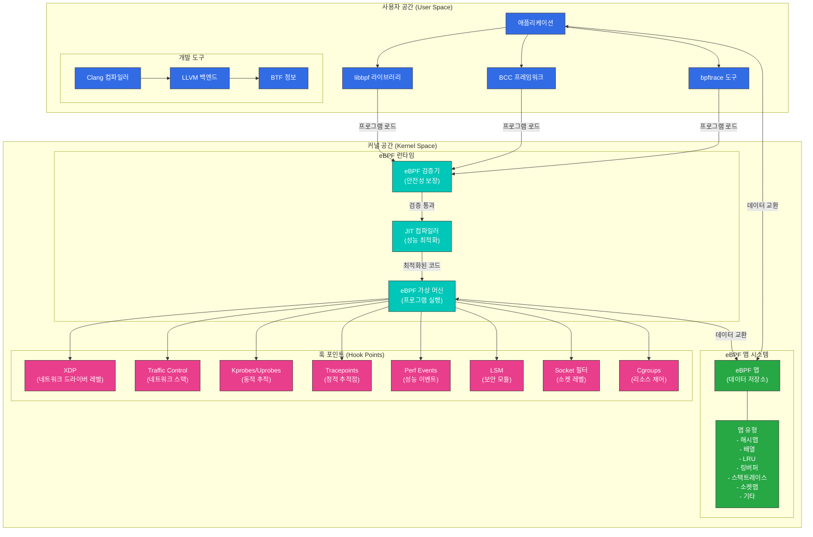
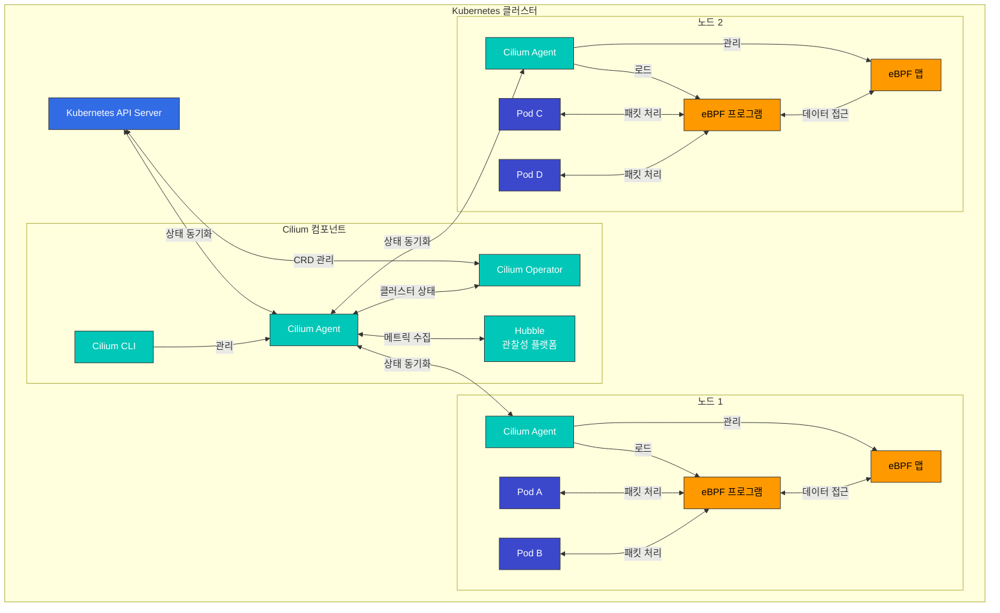

# eBPF 기술 심층 분석

> **지원 버전**: Linux 커널 4.19+  
> **마지막 업데이트**: 2025년 7월 25일

## 실습 환경 설정

이 문서의 예제를 따라하기 위해서는 다음과 같은 도구와 환경이 필요합니다:

### 필수 도구
- Linux 커널 4.19 이상 (5.10+ 권장)
- bpftool, libbpf-dev, clang, llvm
- bcc (BPF Compiler Collection)

### 환경 설정

```bash
# Ubuntu/Debian 시스템에서 필요한 패키지 설치
sudo apt-get update
sudo apt-get install -y build-essential clang llvm libelf-dev libbpf-dev bpftool linux-tools-common linux-tools-generic

# BCC 설치
sudo apt-get install -y bpfcc-tools python3-bpfcc

# 커널 버전 확인
uname -r

# eBPF 기능 지원 확인
bpftool feature
```

## eBPF 기술 소개 및 역사적 배경

eBPF(extended Berkeley Packet Filter)는 Linux 커널 내에서 안전하게 프로그램을 실행할 수 있는 혁신적인 기술입니다. 이 기술은 커널을 수정하지 않고도 커널의 동작을 확장하고 관찰할 수 있는 강력한 메커니즘을 제공합니다. 현대 클라우드 네이티브 환경에서 eBPF는 네트워킹, 보안, 모니터링 및 성능 분석 분야에서 혁명적인 변화를 가져왔습니다.

### BPF에서 eBPF로: 진화의 역사

#### 초기 BPF의 탄생과 한계 (1992-2013)
1992년, UC 버클리의 Steven McCanne와 Van Jacobson은 "The BSD Packet Filter: A New Architecture for User-level Packet Capture"라는 논문을 발표하며 Berkeley Packet Filter(BPF)를 소개했습니다. 이 기술은 네트워크 패킷 필터링을 위한 혁신적인 접근 방식을 제시했습니다.

BPF는 다음과 같은 핵심 개념을 도입했습니다:
- **인-커널 가상 머신**: 커널 내에서 안전하게 사용자 정의 코드 실행
- **레지스터 기반 설계**: 스택 기반보다 효율적인 실행 모델
- **안전성 보장**: 무한 루프 방지 및 메모리 접근 제한
- **패킷 필터링 최적화**: 불필요한 패킷 복사 방지

초기 BPF는 주로 tcpdump와 같은 네트워크 모니터링 도구에서 사용되었으며, 다음과 같은 한계를 가지고 있었습니다:
- 제한된 명령어 세트 (2개의 32비트 레지스터만 사용)
- 제한된 프로그램 크기 (최대 4096개 명령어)
- 제한된 기능 (주로 패킷 필터링에만 사용)
- 사용자 공간과의 제한된 상호작용
- 현대적인 CPU 아키텍처 활용 불가

이러한 한계에도 불구하고, BPF는 20년 이상 Linux 커널의 중요한 부분으로 남아있었습니다.

#### eBPF의 탄생과 초기 발전 (2013-2016)
2013년, PLUMgrid의 Alexei Starovoitov는 기존 BPF의 한계를 극복하기 위해 extended BPF(eBPF)를 제안했습니다. 이 제안은 BPF를 현대적인 프로세서 아키텍처에 맞게 완전히 재설계하는 것을 목표로 했습니다.

eBPF의 초기 설계 목표는 다음과 같았습니다:
- 64비트 아키텍처 지원
- 더 많은 레지스터 (10개 → 현재 11개)
- 더 큰 스택 공간 (512바이트)
- 맵(maps)을 통한 상태 저장 및 사용자 공간과의 통신
- 다양한 이벤트에 연결 가능한 범용성

주요 발전 단계:
- **2014년 5월 (Linux 커널 3.15)**: 초기 eBPF 인프라가 Linux 커널에 통합
  - 새로운 eBPF 명령어 세트 도입
  - 기존 cBPF(classic BPF)에서 eBPF로의 변환 레이어 추가
  - 초기 eBPF 맵 유형 도입 (해시, 배열)

- **2014년 12월 (Linux 커널 3.18)**: eBPF JIT(Just-In-Time) 컴파일러 도입
  - x86_64 아키텍처에 대한 JIT 컴파일 지원
  - 실행 성능 대폭 향상
  - 테일 콜(tail call) 기능 추가로 프로그램 체이닝 가능

- **2015년 6월 (Linux 커널 4.1)**: eBPF 맵(maps) 기능 확장
  - 사용자 공간과 커널 공간 간 데이터 공유 메커니즘 강화
  - 새로운 맵 유형 추가 (LRU 해시, 스택 트레이스)
  - eBPF 프로그램을 kprobe와 연결하는 기능 추가

- **2016년 1월 (Linux 커널 4.4)**: XDP(eXpress Data Path) 도입
  - 네트워크 드라이버 레벨에서 고성능 패킷 처리 가능
  - 패킷이 커널 네트워크 스택에 진입하기 전에 처리
  - 초당 수백만 패킷 처리 가능한 성능

- **2016년 7월 (Linux 커널 4.7)**: 추가적인 eBPF 프로그램 유형 도입
  - 트래픽 제어(TC) 프로그램 지원
  - 소켓 필터링 기능 강화
  - 헬퍼 함수 확장

이 시기에 eBPF는 단순한 패킷 필터링 도구에서 범용 커널 프로그래밍 인프라로 진화하기 시작했으며, 네트워킹 분야를 넘어 다양한 용도로 확장되었습니다.

#### 현대 eBPF 생태계의 성장과 혁신 (2017-현재)
2017년 이후, eBPF는 클라우드 네이티브 컴퓨팅의 핵심 기술로 자리잡기 시작했으며, 다양한 프로젝트와 기업들이 이 기술을 채택하기 시작했습니다.

##### 주요 프로젝트 및 기술적 발전:

- **2017년**: 
  - **Cilium 프로젝트 시작**: eBPF를 컨테이너 네트워킹 및 보안에 활용하는 최초의 주요 프로젝트
  - **BCC(BPF Compiler Collection)**: eBPF 프로그램 개발을 위한 고수준 도구 모음 등장
  - **Linux 커널 4.10-4.14**: cgroup, 소켓, 트레이스포인트 프로그램 유형 추가

- **2018년**: 
  - **Linux 커널 4.18**: BTF(BPF Type Format) 도입, CO-RE(Compile Once – Run Everywhere) 지원 기반 마련
  - **bpftrace**: DTrace 스타일의 고수준 추적 언어 등장
  - **Facebook Katran**: eBPF 기반 L4 로드 밸런서 오픈소스화

- **2019년**: 
  - **Linux 커널 5.0-5.3**: BPF-to-BPF 함수 호출 지원, raw tracepoint 프로그램 추가
  - **Falco**: eBPF 기반 런타임 보안 모니터링 도구 인기 상승
  - **Hubble**: Cilium 기반 네트워크 관찰성 도구 등장

- **2020년**: 
  - **Linux 커널 5.5-5.10**: BPF 링크 추상화, 글로벌 변수, 슬립 기능, 루프 지원
  - **libbpf**: 사용자 공간 라이브러리 성숙화
  - **eBPF Foundation 설립**: 기술 발전을 위한 공식 조직 형성
  - **Isovalent(Cilium 개발사) 시리즈 A 투자 유치**: 상용 eBPF 솔루션 등장

- **2021년**: 
  - **Linux 커널 5.11-5.15**: 메모리 할당 기능, 타이머 지원, 동적 포인터 추가
  - **Kubernetes와의 통합 강화**: 서비스 메시, 네트워킹, 보안 영역에서 채택 확대
  - **상용 제품 출시**: 다수의 기업이 eBPF 기반 제품 출시

- **2022년-현재**: 
  - **Linux 커널 6.0+**: 지속적인 기능 확장 및 최적화
  - **클라우드 네이티브 표준 기술화**: CNCF 프로젝트와의 통합 확대
  - **eBPF Summit**: 전용 컨퍼런스 개최 및 커뮤니티 성장
  - **주요 클라우드 제공업체 채택**: AWS, GCP, Azure 등에서 eBPF 기술 활용

##### 현재 eBPF 활용 분야:

1. **네트워킹**:
   - 컨테이너 네트워킹 (Cilium, Calico)
   - 로드 밸런싱 (Katran, Cilium)
   - 패킷 필터링 및 방화벽 (bpfilter)
   - 네트워크 가속화 (XDP 기반 솔루션)

2. **보안**:
   - 런타임 보안 모니터링 (Falco, Tracee)
   - 침입 탐지 시스템 (Tetragon)
   - 시스템 콜 필터링 (seccomp-bpf)
   - 권한 관리 (LSM BPF)

3. **관찰성**:
   - 시스템 모니터링 및 추적 (bpftrace, BCC)
   - 성능 분석 (BPF Performance Tools)
   - 분산 추적 (Hubble)
   - 메트릭 수집 (eBPF Exporter)

4. **서비스 메시**:
   - 사이드카 없는 서비스 메시 (Cilium Service Mesh)
   - L7 프록시 및 로드 밸런싱
   - 트래픽 관리 및 라우팅

5. **스토리지**:
   - 블록 I/O 추적 및 최적화
   - 파일 시스템 모니터링
   - 캐시 성능 분석

### eBPF의 기술적 진화: 커널 버전별 주요 기능

eBPF의 기술적 발전은 Linux 커널의 여러 버전에 걸쳐 점진적으로 이루어졌으며, 각 버전마다 중요한 기능들이 추가되었습니다. 아래 표는 주요 커널 버전별 eBPF 기능 추가 내역을 보여줍니다:

| 커널 버전 | 연도 | 주요 eBPF 기능 추가 | 기술적 의미 |
|----------|------|-------------------|------------|
| 3.15 | 2014 | 초기 eBPF 인프라 도입 | 새로운 명령어 세트, 레지스터 확장 |
| 3.18 | 2014 | JIT 컴파일러 추가 | 실행 성능 대폭 향상 |
| 4.1 | 2015 | eBPF 맵 기능, 사용자 공간 API | 상태 저장 및 데이터 공유 가능 |
| 4.4 | 2016 | XDP(eXpress Data Path) 도입 | 초고속 패킷 처리 가능 |
| 4.7 | 2016 | 추가 프로그램 유형, 테일 콜 지원 | 프로그램 체이닝 및 확장성 향상 |
| 4.10 | 2017 | 소켓 및 cgroup 프로그램 | 네트워크 소켓 제어, 컨테이너 지원 |
| 4.14 | 2017 | XDP 오프로드, 더 많은 헬퍼 함수 | 하드웨어 가속화 지원 |
| 4.18 | 2018 | BTF(BPF Type Format) 도입 | CO-RE 지원 기반 마련 |
| 5.0 | 2019 | BPF-to-BPF 함수 호출 지원 | 모듈화 및 코드 재사용 가능 |
| 5.5 | 2020 | BPF 링크 추상화, 글로벌 변수 | 프로그램 관리 개선 |
| 5.8 | 2020 | 루프 지원 (bounded loops) | 프로그래밍 유연성 향상 |
| 5.10 | 2020 | 슬립 기능 | 비동기 프로그래밍 가능 |
| 5.13 | 2021 | 메모리 할당 기능 | 동적 메모리 관리 가능 |
| 5.15 | 2021 | 타이머 지원 | 시간 기반 이벤트 처리 |
| 6.0+ | 2022+ | 지속적인 기능 확장 및 최적화 | 완전한 프로그래밍 환경으로 발전 |

이러한 발전을 통해 eBPF는 단순한 패킷 필터에서 완전한 프로그래밍 환경으로 진화했으며, 현재는 Linux 커널의 가장 중요한 기술 중 하나로 자리매김했습니다. 특히 CO-RE(Compile Once – Run Everywhere) 기능의 도입으로 eBPF 프로그램의 이식성이 크게 향상되어, 다양한 커널 버전에서 재컴파일 없이 동일한 프로그램을 실행할 수 있게 되었습니다.

### eBPF vs 전통적인 커널 모듈: 패러다임의 변화

eBPF는 Linux 커널을 확장하는 방식에 있어 전통적인 커널 모듈과 근본적으로 다른 접근 방식을 제공합니다. 이 차이점을 이해하는 것은 eBPF의 혁신성을 파악하는 데 중요합니다.

| 특성 | eBPF | 커널 모듈 |
|------|------|----------|
| **안전성** | 검증기를 통한 안전 보장, 커널 충돌 불가능 | 커널 패닉 가능성 있음, 전체 시스템 안정성에 영향 |
| **배포 방식** | 런타임에 동적 로드, 바이너리 호환성 유지 | 커널 버전별 재컴파일 필요, 호환성 문제 발생 가능 |
| **업그레이드** | 커널 재부팅 없이 실시간 업데이트 가능 | 대부분 재부팅 필요, 서비스 중단 발생 |
| **성능** | JIT 컴파일로 최적화, 네이티브에 근접한 성능 | 네이티브 성능, 직접적인 커널 접근 |
| **개발 복잡성** | 제한된 환경, 특수 도구 필요, 디버깅 어려움 | 완전한 커널 API 접근, 표준 디버깅 도구 사용 가능 |
| **권한 모델** | 제한된 권한, 샌드박스 환경 | 완전한 커널 권한, 무제한 접근 |
| **이식성** | CO-RE(Compile Once – Run Everywhere) 지원 | 커널 버전별 재컴파일 필요 |
| **배포 범위** | 프로덕션 환경에 안전하게 배포 가능 | 주로 벤더 제공 커널 모듈에 한정 |

eBPF의 가장 큰 혁신은 안전성과 동적 로드 기능입니다. 전통적인 커널 모듈은 커널 내부에서 제한 없이 실행되어 버그가 있을 경우 전체 시스템을 불안정하게 만들 수 있습니다. 반면 eBPF 프로그램은 커널의 검증기를 통과해야만 로드될 수 있으며, 이 검증기는 메모리 접근, 무한 루프, 커널 충돌 가능성 등을 철저히 검사합니다.

## 커널 내 eBPF 아키텍처 심층 분석

> **핵심 개념**: eBPF는 Linux 커널 내에서 샌드박스 가상 머신으로 작동하며, 커널 코드를 수정하지 않고도 커널 동작을 확장할 수 있습니다.

eBPF는 단순한 기술이 아닌 완전한 기술 스택으로, 커널 내부의 가상 머신부터 사용자 공간 라이브러리까지 다양한 구성 요소로 이루어져 있습니다. 이 아키텍처를 이해하는 것은 eBPF의 강력함과 유연성을 파악하는 데 필수적입니다.

### eBPF 아키텍처 상세 다이어그램



### eBPF 아키텍처 구성 요소 상세 설명

#### 1. 사용자 공간 구성 요소

**개발 도구 및 라이브러리**:
- **Clang/LLVM**: eBPF 프로그램을 C 또는 Rust에서 eBPF 바이트코드로 컴파일
- **libbpf**: 저수준 eBPF 조작 라이브러리, 커널과 직접 상호작용
- **BCC(BPF Compiler Collection)**: Python 및 Lua 바인딩을 제공하는 고수준 라이브러리
- **bpftrace**: eBPF 기반 추적 언어, DTrace와 유사한 문법 제공

**CO-RE(Compile Once – Run Everywhere)**:
- BTF(BPF Type Format)를 사용하여 커널 버전 간 이식성 제공
- 다양한 커널 버전에서 재컴파일 없이 동일한 eBPF 프로그램 실행 가능
- 구조체 재배치(struct relocation) 기능으로 커널 구조체 변경에 대응

#### 2. 커널 공간 구성 요소

**eBPF 런타임**:
- **eBPF 검증기(Verifier)**: 프로그램의 안전성을 보장하는 핵심 구성 요소
  - 무한 루프 방지
  - 유효한 메모리 접근만 허용
  - 커널 안정성 보장
  - 권한 검사
  
- **JIT(Just-In-Time) 컴파일러**: 
  - eBPF 바이트코드를 네이티브 머신 코드로 변환
  - 아키텍처별 최적화 (x86_64, ARM64, RISC-V 등)
  - 실행 성능 대폭 향상

- **eBPF 가상 머신**:
  - 11개의 레지스터
  - 512바이트 스택
  - 헬퍼 함수를 통한 커널 기능 접근
  - 테일 콜(tail call) 지원으로 프로그램 체이닝

**eBPF 맵 시스템**:
- 키-값 저장소로 구현된 데이터 구조
- 커널 공간과 사용자 공간 간 데이터 공유
- 다양한 맵 유형 지원:
  - **BPF_MAP_TYPE_HASH**: 일반적인 해시 테이블
  - **BPF_MAP_TYPE_ARRAY**: 고정 크기 배열
  - **BPF_MAP_TYPE_LRU_HASH**: 최근 사용 항목 추적
  - **BPF_MAP_TYPE_RINGBUF**: 고성능 링 버퍼
  - **BPF_MAP_TYPE_STACK_TRACE**: 스택 트레이스 저장
  - **BPF_MAP_TYPE_SOCKHASH**: 소켓 참조 저장
  - **BPF_MAP_TYPE_DEVMAP**: 네트워크 디바이스 참조
  - **BPF_MAP_TYPE_PROG_ARRAY**: eBPF 프로그램 참조

**훅 포인트(Hook Points)**:

eBPF 프로그램은 커널 내 다양한 지점에 연결될 수 있으며, 이러한 지점을 훅 포인트라고 합니다. 각 훅 포인트는 특정 이벤트나 작업이 발생할 때 eBPF 프로그램을 실행할 수 있게 해줍니다. 주요 훅 포인트는 다음과 같습니다:

- **XDP(eXpress Data Path)**: 
  - 네트워크 드라이버 수준에서 패킷 처리
  - NIC에서 패킷이 커널에 진입하기 전 처리
  - 최고 성능의 패킷 처리 지점 (초당 수천만 패킷 처리 가능)
  - 가능한 작업: 패킷 드롭, 패스, 리다이렉션, 수정
  - 사용 사례: DDoS 방어, 패킷 필터링, 로드 밸런싱
  - 하드웨어 오프로드 지원 (특정 NIC에서)
  
- **Traffic Control(TC)**: 
  - 네트워크 스택의 트래픽 제어 계층
  - 인그레스/이그레스 큐잉 지점
  - XDP보다 더 많은 컨텍스트 제공
  - 패킷 헤더 및 페이로드 수정 가능
  - 사용 사례: 네트워크 정책, NAT, 패킷 변환
  - 인그레스(ingress)와 이그레스(egress) 모두 지원

- **소켓 필터**: 
  - 소켓 수준에서 패킷 필터링
  - 특정 소켓에 연결된 프로그램
  - 사용자 공간 애플리케이션의 소켓 작업 제어
  - 사용 사례: 애플리케이션별 패킷 필터링, 소켓 수준 통계
  - 소켓 생성, 바인딩, 연결 시점에 적용 가능

- **Kprobes/Uprobes**: 
  - 커널/사용자 공간 함수 동적 추적
  - 함수 진입/반환 시 실행
  - 임의의 커널 함수 후킹 가능
  - 사용 사례: 성능 분석, 디버깅, 보안 모니터링
  - 동적으로 추가/제거 가능
  - 오버헤드 있음 (프로덕션 환경에서 주의 필요)

- **Tracepoints**: 
  - 커널 내 정적으로 정의된 추적점
  - 안정적인 ABI 제공 (커널 버전 간 호환성)
  - 주요 커널 이벤트에 대한 추적 지원
  - 사용 사례: 시스템 콜 추적, 블록 I/O 모니터링, 네트워크 이벤트 추적
  - Kprobes보다 낮은 오버헤드

- **Perf Events**: 
  - 성능 모니터링 이벤트
  - CPU 성능 카운터 접근
  - 하드웨어/소프트웨어 이벤트 모니터링
  - 사용 사례: CPU 사용률 분석, 캐시 미스 추적, 분기 예측 실패 모니터링
  - 정밀한 성능 측정 가능

- **LSM(Linux Security Module)**: 
  - 보안 정책 적용
  - 시스템 콜 보안 검사
  - 권한 검증 및 접근 제어
  - 사용 사례: 컨테이너 보안, 권한 상승 탐지, 파일 접근 제어
  - 커널 5.7+ 지원

- **Cgroups**: 
  - 컨테이너 리소스 제어
  - 컨테이너별 정책 적용
  - 리소스 사용량 제한 및 모니터링
  - 사용 사례: 컨테이너 네트워크 정책, 리소스 제한, 격리
  - 컨테이너 오케스트레이션 환경에서 중요

### eBPF 프로그램 라이프사이클 상세 분석

eBPF 프로그램은 개발부터 실행까지 여러 단계를 거칩니다. 이 과정을 이해하면 eBPF의 작동 방식과 제약 조건을 더 명확히 파악할 수 있습니다.

1. **개발 단계**:
   - C, Rust 등 고수준 언어로 프로그램 작성
   - 커널 헤더 및 eBPF 헬퍼 함수 사용
   - BTF 정보 활용 (CO-RE 지원을 위해)
   - 섹션 정의 (`SEC()` 매크로 사용)
   - 라이센스 명시 (GPL 호환 필요)

2. **컴파일 단계**:
   - Clang/LLVM을 사용하여 eBPF 바이트코드로 컴파일
   - `-target bpf` 옵션으로 eBPF 타겟 지정
   - BTF 및 디버깅 정보 생성
   - ELF 파일 형식으로 출력

3. **로드 단계**:
   - `bpf()` 시스템 콜을 통해 커널에 프로그램 로드
   - libbpf 또는 BCC 라이브러리가 이 과정 처리
   - 프로그램 유형 및 연결할 훅 지정
   - 필요한 맵 생성

4. **검증 단계**:
   - 커널 내 검증기가 프로그램 안전성 검사
   - 제어 흐름 그래프(CFG) 분석
   - 메모리 접근 검증
   - 무한 루프 방지
   - 권한 검사
   - 실패 시 상세한 오류 메시지 제공

5. **JIT 컴파일 단계**:
   - 바이트코드를 호스트 아키텍처의 네이티브 코드로 변환
   - 아키텍처별 최적화 적용
   - 실행 성능 향상
   - 대부분의 아키텍처에서 지원 (x86_64, ARM64, RISC-V 등)

6. **연결 단계**:
   - 특정 커널 이벤트(훅)에 프로그램 연결
   - 필요한 맵 생성 및 초기화
   - 프로그램 메타데이터 설정
   - 파일 디스크립터 관리

7. **실행 단계**:
   - 이벤트 발생 시 프로그램 실행
   - 컨텍스트 데이터 접근
   - 결정에 따른 패킷/이벤트 처리
   - 헬퍼 함수 호출

8. **데이터 교환 단계**:
   - eBPF 맵을 통한 데이터 저장 및 검색
   - 사용자 공간 애플리케이션과 통신
   - 성능 메트릭, 상태 정보 등 공유
   - 이벤트 통지 (perf 이벤트 버퍼, 링 버퍼 등)

9. **업데이트/언로드 단계**:
   - 필요 시 프로그램 동적 업데이트
   - 사용 완료 후 프로그램 언로드
   - 관련 리소스 정리
   - 맵 데이터 유지 또는 삭제

### eBPF 프로그램 유형과 특징

eBPF 프로그램은 연결되는 훅 포인트에 따라 다양한 유형으로 분류됩니다. 각 프로그램 유형은 특정 컨텍스트와 기능을 가지고 있습니다:

1. **XDP (eXpress Data Path) 프로그램**:
   - 프로그램 유형: `BPF_PROG_TYPE_XDP`
   - 컨텍스트: 네트워크 패킷 데이터, 인터페이스 정보
   - 반환 값: `XDP_DROP`, `XDP_PASS`, `XDP_TX`, `XDP_REDIRECT` 등
   - 특징: 최고 성능의 패킷 처리, 드라이버/하드웨어 수준 실행

2. **트래픽 제어(TC) 프로그램**:
   - 프로그램 유형: `BPF_PROG_TYPE_SCHED_CLS`, `BPF_PROG_TYPE_SCHED_ACT`
   - 컨텍스트: 네트워크 패킷 데이터, 스케줄링 정보
   - 반환 값: `TC_ACT_OK`, `TC_ACT_SHOT`, `TC_ACT_REDIRECT` 등
   - 특징: 패킷 분류 및 조작, 인그레스/이그레스 지원

3. **소켓 필터 프로그램**:
   - 프로그램 유형: `BPF_PROG_TYPE_SOCKET_FILTER`
   - 컨텍스트: 소켓 버퍼 데이터
   - 반환 값: 0 (패킷 드롭) 또는 패킷 길이 (패킷 허용)
   - 특징: 소켓 수준 패킷 필터링, tcpdump와 유사한 기능

4. **kprobe/uprobe 프로그램**:
   - 프로그램 유형: `BPF_PROG_TYPE_KPROBE`, `BPF_PROG_TYPE_UPROBE`
   - 컨텍스트: 함수 인자, 레지스터 값
   - 반환 값: 정수 (의미 없음)
   - 특징: 동적 함수 추적, 디버깅 및 프로파일링

5. **tracepoint 프로그램**:
   - 프로그램 유형: `BPF_PROG_TYPE_TRACEPOINT`
   - 컨텍스트: 트레이스포인트 정의 구조체
   - 반환 값: 정수 (의미 없음)
   - 특징: 안정적인 커널 추적점, 버전 간 호환성

6. **perf 이벤트 프로그램**:
   - 프로그램 유형: `BPF_PROG_TYPE_PERF_EVENT`
   - 컨텍스트: 성능 이벤트 데이터
   - 반환 값: 정수 (의미 없음)
   - 특징: 하드웨어/소프트웨어 성능 이벤트 모니터링

7. **cgroup 프로그램**:
   - 프로그램 유형: `BPF_PROG_TYPE_CGROUP_SKB`, `BPF_PROG_TYPE_CGROUP_SOCK` 등
   - 컨텍스트: cgroup 정보, 소켓/패킷 데이터
   - 반환 값: 0 (거부) 또는 1 (허용)
   - 특징: 컨테이너별 네트워크 정책, 리소스 제어

8. **LSM(Linux Security Module) 프로그램**:
   - 프로그램 유형: `BPF_PROG_TYPE_LSM`
   - 컨텍스트: 보안 관련 작업 정보
   - 반환 값: 0 (허용) 또는 오류 코드 (거부)
   - 특징: 보안 정책 적용, 권한 검사

9. **소켓 작업 프로그램**:
   - 프로그램 유형: `BPF_PROG_TYPE_SOCK_OPS`
   - 컨텍스트: 소켓 작업 정보
   - 반환 값: 정수 (의미 없음)
   - 특징: TCP 연결 제어, 소켓 옵션 설정

10. **fentry/fexit 프로그램**:
    - 프로그램 유형: `BPF_PROG_TYPE_TRACING`
    - 컨텍스트: 함수 인자, 반환 값
    - 반환 값: 정수 (의미 없음)
    - 특징: 저오버헤드 함수 추적, kprobe보다 효율적

### 간단한 eBPF 프로그램 예제 및 설명

다음은 시스템 콜 실행을 추적하는 간단한 eBPF 프로그램 예제입니다:

```c
// hello_world.c
#include <linux/bpf.h>
#include <bpf/bpf_helpers.h>

// 프로그램 섹션 정의 - 이 프로그램은 execve 시스템 콜 진입 시 실행됨
SEC("tracepoint/syscalls/sys_enter_execve")
int hello_execve(void *ctx) {
    // 간단한 메시지 출력
    char msg[] = "Hello, eBPF!";
    bpf_trace_printk(msg, sizeof(msg));
    return 0;
}

// 라이센스 정의 (GPL 호환 필요)
char LICENSE[] SEC("license") = "GPL";
```

**코드 설명**:
1. **헤더 파일**: 필요한 eBPF 관련 헤더 포함
2. **섹션 정의**: `SEC()` 매크로로 프로그램 유형과 연결 지점 지정
3. **프로그램 함수**: `execve` 시스템 콜 실행 시 호출될 함수
4. **컨텍스트 매개변수**: 이벤트 관련 데이터 포함
5. **헬퍼 함수 사용**: `bpf_trace_printk()`로 디버그 메시지 출력
6. **라이센스 지정**: GPL 호환 라이센스 필요 (커널 심볼 접근 위해)

**컴파일 및 실행**:
```bash
# 컴파일
clang -O2 -target bpf -c hello_world.c -o hello_world.o

# 로드 및 실행
bpftool prog load hello_world.o /sys/fs/bpf/hello_world

# 출력 확인
cat /sys/kernel/debug/tracing/trace_pipe
```

**실행 결과**:
```
<...>-1234  [001] d... 123456.789012: bpf_trace_printk: Hello, eBPF!
<...>-5678  [002] d... 123456.789102: bpf_trace_printk: Hello, eBPF!
```

이 간단한 예제는 eBPF의 기본 개념을 보여줍니다. 실제 애플리케이션에서는 더 복잡한 로직과 맵을 사용하여 데이터를 수집하고 분석할 수 있습니다.

### eBPF 맵: 데이터 공유와 상태 저장의 핵심

eBPF 맵은 eBPF 프로그램과 사용자 공간 애플리케이션 간의 데이터 공유를 위한 키-값 저장소입니다. 이 맵은 eBPF 프로그램이 상태를 유지하고, 사용자 공간과 통신하는 핵심 메커니즘입니다.

#### eBPF 맵의 기본 개념

eBPF 맵은 다음과 같은 특성을 가집니다:

- **영구 저장소**: 프로그램이 재로드되어도 데이터 유지
- **다양한 데이터 구조**: 해시 테이블, 배열, 큐, 스택 등 다양한 형태 지원
- **동시성 지원**: 여러 CPU에서 동시 접근 가능
- **크기 제한**: 생성 시 최대 크기 지정 필요
- **유연한 키/값 형식**: 다양한 데이터 유형 저장 가능
- **양방향 접근**: 커널 공간과 사용자 공간 모두에서 접근 가능

#### 주요 맵 유형과 사용 사례

1. **해시 맵 (BPF_MAP_TYPE_HASH)**:
   - 일반적인 키-값 저장소
   - O(1) 시간 복잡도의 조회 성능
   - 동적 크기 관리 (최대 항목 수 제한)
   - 사용 사례: 연결 추적, 세션 정보 저장, 카운터
   - 예시 코드:
     ```c
     struct bpf_map_def SEC("maps") connection_map = {
         .type = BPF_MAP_TYPE_HASH,
         .key_size = sizeof(struct connection_key),
         .value_size = sizeof(struct connection_info),
         .max_entries = 1024,
     };
     ```

2. **배열 맵 (BPF_MAP_TYPE_ARRAY)**:
   - 인덱스 기반 고정 크기 배열
   - 매우 빠른 조회 성능
   - 모든 항목이 미리 할당됨
   - 사용 사례: 전역 설정, 통계, 빠른 조회가 필요한 데이터
   - 예시 코드:
     ```c
     struct bpf_map_def SEC("maps") config_array = {
         .type = BPF_MAP_TYPE_ARRAY,
         .key_size = sizeof(u32),
         .value_size = sizeof(struct config),
         .max_entries = 1,
     };
     ```

3. **LRU 해시 맵 (BPF_MAP_TYPE_LRU_HASH)**:
   - 최근 사용 항목 추적 기능이 있는 해시 맵
   - 최대 항목 수 초과 시 가장 오래된 항목 자동 제거
   - 캐시 구현에 적합
   - 사용 사례: 연결 캐시, 경로 캐시
   - 예시 코드:
     ```c
     struct bpf_map_def SEC("maps") connection_cache = {
         .type = BPF_MAP_TYPE_LRU_HASH,
         .key_size = sizeof(struct connection_key),
         .value_size = sizeof(struct connection_info),
         .max_entries = 10000,
     };
     ```

4. **링 버퍼 (BPF_MAP_TYPE_RINGBUF)**:
   - 생산자-소비자 모델의 고성능 버퍼
   - 단일 생산자, 단일 소비자 지원
   - 이벤트 기반 통지 지원
   - 사용 사례: 로그 수집, 이벤트 전달, 고성능 데이터 스트리밍
   - 예시 코드:
     ```c
     struct bpf_map_def SEC("maps") events = {
         .type = BPF_MAP_TYPE_RINGBUF,
         .max_entries = 256 * 1024, // 256 KB
     };
     ```

5. **퍼프 이벤트 배열 (BPF_MAP_TYPE_PERF_EVENT_ARRAY)**:
   - 성능 이벤트 데이터 전송
   - 커널에서 사용자 공간으로 이벤트 전달
   - 사용 사례: 추적 이벤트, 성능 데이터 수집
   - 예시 코드:
     ```c
     struct bpf_map_def SEC("maps") perf_events = {
         .type = BPF_MAP_TYPE_PERF_EVENT_ARRAY,
         .key_size = sizeof(int),
         .value_size = sizeof(u32),
         .max_entries = 128,
     };
     ```

6. **프로그램 배열 (BPF_MAP_TYPE_PROG_ARRAY)**:
   - 다른 eBPF 프로그램 참조 저장
   - 테일 콜 구현에 사용
   - 프로그램 체이닝 가능
   - 사용 사례: 복잡한 처리 로직 모듈화, 조건부 실행
   - 예시 코드:
     ```c
     struct bpf_map_def SEC("maps") jump_table = {
         .type = BPF_MAP_TYPE_PROG_ARRAY,
         .key_size = sizeof(u32),
         .value_size = sizeof(u32),
         .max_entries = 10,
     };
     ```

7. **CPU별 맵 (BPF_MAP_TYPE_PERCPU_HASH/ARRAY)**:
   - CPU별로 독립적인 데이터 저장
   - 동시성 문제 없이 고성능 접근 가능
   - 사용 사례: 고성능 카운터, CPU별 통계
   - 예시 코드:
     ```c
     struct bpf_map_def SEC("maps") cpu_stats = {
         .type = BPF_MAP_TYPE_PERCPU_ARRAY,
         .key_size = sizeof(u32),
         .value_size = sizeof(struct stats),
         .max_entries = 1,
     };
     ```

8. **소켓 맵 (BPF_MAP_TYPE_SOCKMAP)**:
   - 소켓 참조 저장
   - 소켓 간 리다이렉션 지원
   - 사용 사례: 소켓 가속화, 프록시 구현
   - 예시 코드:
     ```c
     struct bpf_map_def SEC("maps") socket_map = {
         .type = BPF_MAP_TYPE_SOCKMAP,
         .key_size = sizeof(u32),
         .value_size = sizeof(u32),
         .max_entries = 1024,
     };
     ```

#### eBPF 맵 작업 예제

다음은 eBPF 프로그램에서 맵을 사용하는 간단한 예제입니다:

```c
#include <linux/bpf.h>
#include <bpf/bpf_helpers.h>

// 맵 정의
struct bpf_map_def SEC("maps") counter_map = {
    .type = BPF_MAP_TYPE_ARRAY,
    .key_size = sizeof(u32),
    .value_size = sizeof(u64),
    .max_entries = 1,
};

SEC("tracepoint/syscalls/sys_enter_execve")
int count_execve(void *ctx) {
    u32 key = 0;
    u64 *value, init_val = 1;
    
    // 맵에서 값 조회
    value = bpf_map_lookup_elem(&counter_map, &key);
    if (value) {
        // 값이 존재하면 증가
        __sync_fetch_and_add(value, 1);
    } else {
        // 값이 없으면 초기화
        bpf_map_update_elem(&counter_map, &key, &init_val, BPF_ANY);
    }
    
    return 0;
}

char LICENSE[] SEC("license") = "GPL";
```

사용자 공간에서 맵 접근:

```c
#include <bpf/bpf.h>
#include <stdio.h>

int main() {
    // 맵 파일 디스크립터 열기
    int map_fd = bpf_obj_get("/sys/fs/bpf/counter_map");
    if (map_fd < 0) {
        perror("Failed to open map");
        return 1;
    }
    
    // 맵에서 값 조회
    u32 key = 0;
    u64 value;
    if (bpf_map_lookup_elem(map_fd, &key, &value) == 0) {
        printf("execve count: %llu\n", value);
    } else {
        perror("Failed to lookup value");
    }
    
    return 0;
}
```

## Cilium에서의 eBPF 활용: 컨테이너 네트워킹의 혁신

Cilium은 eBPF를 활용하여 컨테이너 네트워킹, 로드 밸런싱, 네트워크 정책 및 가시성을 구현하는 오픈소스 프로젝트입니다. Kubernetes와 같은 컨테이너 오케스트레이션 플랫폼에서 네트워킹 및 보안 기능을 제공합니다.

### Cilium 아키텍처와 eBPF의 역할

Cilium은 다음과 같은 구성 요소로 이루어져 있으며, 각 구성 요소에서 eBPF가 중요한 역할을 합니다:



#### 주요 구성 요소:

1. **Cilium Agent**:
   - 각 노드에서 실행되는 데몬
   - eBPF 프로그램 컴파일 및 로드
   - 엔드포인트 관리 및 정책 적용
   - 네트워크 토폴로지 검색
   - 상태 모니터링 및 메트릭 수집

2. **Cilium Operator**:
   - 클러스터 전체 리소스 관리
   - CRD(Custom Resource Definition) 처리
   - 노드 간 조정
   - 클러스터 범위 기능 관리

3. **eBPF 프로그램**:
   - XDP 및 TC 훅에 연결된 데이터 경로 프로그램
   - 소켓 수준 로드 밸런싱 프로그램
   - 연결 추적 프로그램
   - 네트워크 정책 적용 프로그램

4. **eBPF 맵**:
   - 엔드포인트 정보 저장
   - 정책 규칙 저장
   - 연결 추적 상태 관리
   - 로드 밸런싱 서비스 정보

5. **Hubble**:
   - eBPF 기반 네트워크 관찰성 플랫폼
   - 네트워크 흐름 모니터링
   - 보안 가시성 제공
   - 성능 분석 및 문제 해결

### Cilium의 eBPF 데이터 경로 상세 분석

Cilium의 데이터 경로는 eBPF 프로그램을 통해 구현되며, 패킷이 네트워크 스택을 통과하는 여러 지점에서 처리됩니다:

1. **패킷 수신 (XDP/TC 인그레스)**:
   - 네트워크 인터페이스에서 패킷 수신
   - XDP 또는 TC 훅에서 패킷 인터셉트
   - 초기 필터링 및 DDOS 방어
   - 패킷 유형 분류 (로컬/포워딩/호스트)

2. **신원 확인**:
   - 패킷의 출발지/목적지 IP 및 포트 분석
   - Kubernetes 엔드포인트 식별
   - 서비스 백엔드 확인
   - 컨텍스트 정보 수집

3. **정책 적용**:
   - 네트워크 정책 규칙 확인
   - L3/L4 정책 적용 (IP/포트 기반)
   - L7 정책 적용 (HTTP/gRPC/DNS 등)
   - 정책 결정에 따른 허용/거부

4. **연결 추적**:
   - 연결 상태 추적 및 관리
   - 상태 기반 방화벽 기능
   - NAT 상태 유지
   - 연결 타임아웃 관리

5. **NAT 및 로드 밸런싱**:
   - 필요한 경우 주소 변환 수행
   - 서비스 로드 밸런싱 (일관된 해싱, 세션 어피니티)
   - DSR(Direct Server Return) 지원
   - 헬스 체크 기반 엔드포인트 선택

6. **패킷 전달**:
   - 대상 엔드포인트로 패킷 전달
   - 오버레이 또는 네이티브 라우팅
   - 패킷 캡슐화/디캡슐화 (필요 시)
   - 패킷 변환 및 최적화

7. **모니터링 및 가시성**:
   - 흐름 정보 수집
   - 메트릭 업데이트
   - 이벤트 생성
   - 디버그 정보 기록

### Cilium의 주요 eBPF 프로그램 상세 설명

Cilium은 다양한 eBPF 프로그램을 사용하여 컨테이너 네트워킹 기능을 구현합니다:

1. **bpf_lxc.c**: 엔드포인트 간 통신 처리
   - 컨테이너 네트워크 네임스페이스와 호스트 간 통신 처리
   - 정책 적용 및 연결 추적
   - 엔드포인트 식별 및 라우팅
   - 주요 함수: `handle_xgress`, `__tail_handle_ipv{4,6}`

2. **bpf_overlay.c**: 오버레이 네트워크 처리
   - VXLAN/Geneve 캡슐화 및 디캡슐화
   - 노드 간 패킷 라우팅
   - 터널 키 관리
   - 주요 함수: `from_overlay`, `to_overlay`

3. **bpf_host.c**: 호스트 네트워킹 처리
   - 호스트 네트워크 스택과 컨테이너 간 통신
   - 호스트 방화벽 기능
   - 호스트 기반 서비스 처리
   - 주요 함수: `handle_netdev`, `handle_from_host`

4. **bpf_xdp.c**: XDP 기반 패킷 처리
   - 초기 패킷 필터링
   - DDoS 방어
   - 고성능 패킷 드롭 및 리다이렉션
   - 주요 함수: `cilium_xdp_entry`

5. **bpf_sock.c**: 소켓 수준 로드 밸런싱
   - 소켓 생성 시 로드 밸런싱
   - 커넥션 추적 우회
   - 고성능 서비스 접근
   - 주요 함수: `sock4_load_balancer`, `sock6_load_balancer`

6. **bpf_lb.c**: 서비스 로드 밸런싱
   - Kubernetes 서비스 구현
   - 백엔드 선택 및 NAT
   - 세션 어피니티 지원
   - 주요 함수: `lb{4,6}_service`

7. **bpf_network.c**: 네트워크 정책 적용
   - L3/L4 정책 적용
   - 정책 결정 캐싱
   - 정책 통계 수집
   - 주요 함수: `policy_can_access`, `policy_apply_verdict`

### Cilium의 eBPF 맵 활용

Cilium은 다양한 eBPF 맵을 사용하여 상태를 저장하고 데이터를 공유합니다:

1. **endpoints_map**: 엔드포인트 정보 저장
   - 키: 엔드포인트 ID
   - 값: 엔드포인트 메타데이터 (IP, 보안 ID, 인터페이스 등)
   - 용도: 패킷 라우팅, 정책 적용

2. **connection_map**: 연결 추적 정보
   - 키: 연결 튜플 (src IP/port, dst IP/port, protocol)
   - 값: 연결 상태, 타임스탬프, 통계
   - 용도: 상태 기반 방화벽, NAT 추적

3. **policy_map**: 네트워크 정책 규칙
   - 키: 정책 식별자
   - 값: 정책 규칙 (허용/거부, 포트, 프로토콜 등)
   - 용도: 네트워크 정책 적용

4. **lb_map**: 로드 밸런싱 서비스 정보
   - 키: 서비스 주소 (가상 IP:포트)
   - 값: 백엔드 목록, 선택 알고리즘, 상태
   - 용도: 서비스 로드 밸런싱

5. **tunnel_map**: 오버레이 네트워크 정보
   - 키: 원격 노드 IP
   - 값: 터널 엔드포인트 정보
   - 용도: 노드 간 패킷 라우팅

6. **metrics_map**: 성능 메트릭 수집
   - 키: 메트릭 유형
   - 값: 카운터, 게이지 등
   - 용도: 모니터링 및 디버깅

### Cilium의 eBPF 기반 기능

Cilium은 eBPF를 활용하여 다음과 같은 고급 네트워킹 및 보안 기능을 제공합니다:

1. **Kubernetes 네트워크 정책**:
   - 네임스페이스, 파드, 서비스 수준 정책
   - L3/L4/L7 정책 지원
   - CIDR 기반 필터링
   - 클러스터 내/외부 통신 제어

2. **투명한 암호화**:
   - WireGuard 또는 IPsec 기반 노드 간 암호화
   - 제로 구성 설정
   - 성능 최적화된 구현
   - 키 관리 자동화

3. **서비스 메시 기능**:
   - L7 프록시 통합
   - HTTP, gRPC, Kafka 프로토콜 인식
   - 헤더 기반 라우팅
   - 사이드카 없는 서비스 메시

4. **로드 밸런싱**:
   - 일관된 해싱 알고리즘
   - 세션 어피니티
   - 마이크로서비스 간 로드 밸런싱
   - DSR(Direct Server Return) 지원

5. **관찰성 및 모니터링**:
   - 네트워크 흐름 가시성
   - 서비스 의존성 맵
   - 성능 병목 식별
   - 보안 이벤트 감지

6. **대역폭 관리**:
   - 엔드포인트별 대역폭 제한
   - 트래픽 우선순위 지정
   - 혼잡 제어
   - 서비스 품질(QoS) 보장

7. **멀티 클러스터 네트워킹**:
   - 클러스터 간 연결
   - 글로벌 서비스 라우팅
   - 일관된 정책 적용
   - 페더레이션 지원

## 실습: eBPF 프로그램 개발 및 디버깅

이 섹션에서는 eBPF 프로그램을 직접 개발하고 디버깅하는 방법을 실습을 통해 알아봅니다. 기본적인 eBPF 프로그램부터 시작하여 Cilium의 eBPF 기능을 탐색하는 방법까지 다룹니다.

### 1. 기본 eBPF 프로그램 개발

#### 1.1 시스템 콜 추적 프로그램

다음은 `execve` 시스템 콜을 추적하는 간단한 eBPF 프로그램입니다:

```c
// hello_ebpf.c
#include <linux/bpf.h>
#include <bpf/bpf_helpers.h>

// 프로그램이 실행될 트레이스포인트 지정
SEC("tracepoint/syscalls/sys_enter_execve")
int hello_execve(void *ctx) {
    // 디버그 메시지 출력
    char msg[] = "Hello, eBPF! Process executed.";
    bpf_trace_printk(msg, sizeof(msg));
    return 0;
}

// GPL 호환 라이센스 명시 (필수)
char LICENSE[] SEC("license") = "GPL";
```

#### 1.2 컴파일 및 로드

```bash
# 필요한 패키지 설치 확인
sudo apt-get update
sudo apt-get install -y clang llvm libelf-dev libbpf-dev bpftool

# 컴파일
clang -O2 -target bpf -c hello_ebpf.c -o hello_ebpf.o

# 프로그램 로드
sudo bpftool prog load hello_ebpf.o /sys/fs/bpf/hello_execve

# 출력 확인
sudo cat /sys/kernel/debug/tracing/trace_pipe
```

실행 결과:
```
<...>-1234  [001] d... 123456.789012: bpf_trace_printk: Hello, eBPF! Process executed.
<...>-5678  [002] d... 123456.789102: bpf_trace_printk: Hello, eBPF! Process executed.
```

#### 1.3 프로그램 정보 확인

```bash
# 로드된 eBPF 프로그램 목록 확인
sudo bpftool prog list

# 특정 프로그램 상세 정보 확인
sudo bpftool prog show id 123

# 프로그램 바이트코드 덤프
sudo bpftool prog dump xlated id 123
```

### 2. 맵을 사용한 고급 eBPF 프로그램

#### 2.1 프로세스 실행 카운터 프로그램

다음은 맵을 사용하여 프로세스 실행 횟수를 추적하는 프로그램입니다:

```c
// process_counter.c
#include <linux/bpf.h>
#include <bpf/bpf_helpers.h>
#include <linux/sched.h>

// 프로세스 이름을 저장할 구조체
struct process_key {
    char comm[16];
};

// 맵 정의
struct {
    __uint(type, BPF_MAP_TYPE_HASH);
    __uint(max_entries, 1024);
    __type(key, struct process_key);
    __type(value, u64);
} process_map SEC(".maps");

SEC("tracepoint/syscalls/sys_enter_execve")
int count_execve(void *ctx) {
    struct process_key key = {};
    u64 *count, zero = 1;
    
    // 현재 프로세스 이름 가져오기
    bpf_get_current_comm(&key.comm, sizeof(key.comm));
    
    // 맵에서 카운터 조회
    count = bpf_map_lookup_elem(&process_map, &key);
    if (count) {
        // 카운터 증가
        __sync_fetch_and_add(count, 1);
    } else {
        // 새 항목 추가
        bpf_map_update_elem(&process_map, &key, &zero, BPF_ANY);
    }
    
    return 0;
}

char LICENSE[] SEC("license") = "GPL";
```

#### 2.2 사용자 공간 애플리케이션

맵 데이터를 읽는 사용자 공간 프로그램:

```c
// process_reader.c
#include <stdio.h>
#include <stdlib.h>
#include <bpf/libbpf.h>
#include <bpf/bpf.h>
#include <unistd.h>

struct process_key {
    char comm[16];
};

int main() {
    // 맵 파일 디스크립터 열기
    int map_fd = bpf_obj_get("/sys/fs/bpf/process_map");
    if (map_fd < 0) {
        perror("Failed to open map");
        return 1;
    }
    
    // 맵 항목 순회
    struct process_key key, next_key;
    u64 value;
    
    while (bpf_map_get_next_key(map_fd, &key, &next_key) == 0) {
        if (bpf_map_lookup_elem(map_fd, &next_key, &value) == 0) {
            printf("Process: %-16s Count: %llu\n", next_key.comm, value);
        }
        key = next_key;
    }
    
    return 0;
}
```

#### 2.3 컴파일 및 실행

```bash
# eBPF 프로그램 컴파일
clang -O2 -target bpf -c process_counter.c -o process_counter.o

# 사용자 공간 프로그램 컴파일
gcc -o process_reader process_reader.c -lbpf

# eBPF 프로그램 로드
sudo bpftool prog load process_counter.o /sys/fs/bpf/process_counter map name process_map /sys/fs/bpf/process_map

# 맵 핀 확인
ls -la /sys/fs/bpf/

# 몇 가지 명령어 실행하여 카운터 증가
ls -la
echo "Hello"
find . -name "*.c"

# 결과 확인
sudo ./process_reader
```

### 3. Cilium eBPF 프로그램 탐색 및 디버깅

Cilium은 다양한 eBPF 프로그램과 맵을 사용합니다. 이를 탐색하고 디버깅하는 방법을 알아봅니다.

#### 3.1 Cilium eBPF 맵 확인

```bash
# Cilium eBPF 맵 목록 확인
cilium bpf maps list

# 특정 맵 내용 확인
cilium bpf maps get cilium_policy_00001

# 엔드포인트 정보 확인
cilium endpoint list

# 특정 엔드포인트의 eBPF 프로그램 확인
cilium bpf endpoint list -e 1234
```

#### 3.2 Cilium 네트워크 정책 디버깅

```bash
# 네트워크 정책 상태 확인
cilium policy get

# 특정 엔드포인트의 정책 확인
cilium endpoint get 1234 -o json | jq '.policy'

# 정책 추적 활성화
cilium policy trace --src-k8s-pod default:app-frontend --dst-k8s-pod default:app-backend -p TCP --dport 80

# 정책 디버그 모드 활성화
cilium config Debug=true
```

#### 3.3 Cilium 서비스 로드 밸런싱 확인

```bash
# 서비스 목록 확인
cilium service list

# 서비스 백엔드 확인
cilium service get 1

# 로드 밸런서 맵 확인
cilium bpf lb list

# 특정 서비스의 백엔드 상태 확인
cilium bpf lb maglev list
```

#### 3.4 Cilium 네트워크 흐름 모니터링

```bash
# 네트워크 흐름 모니터링 활성화
cilium monitor

# 특정 엔드포인트의 흐름만 모니터링
cilium monitor --related-to 1234

# 드롭된 패킷만 모니터링
cilium monitor --type drop

# L7 프로토콜 흐름 모니터링
cilium monitor --type l7
```

#### 3.5 Hubble을 사용한 고급 관찰성

```bash
# Hubble 활성화 확인
cilium status | grep Hubble

# Hubble UI 접근
kubectl port-forward -n kube-system svc/hubble-ui 12000:80

# 특정 네임스페이스의 흐름 관찰
hubble observe --namespace default

# HTTP 요청 관찰
hubble observe --protocol http

# 서비스 의존성 맵 생성
hubble observe --output json | jq
```

### 4. 성능 분석 및 최적화

#### 4.1 eBPF 프로그램 성능 분석

```bash
# eBPF 프로그램 실행 시간 측정
bpftool prog profile name hello_execve

# 특정 맵의 조회 성능 측정
bpftool map dump name process_map -p

# 커널 함수 호출 추적
bpftrace -e 'kprobe:bpf_prog_run { @start[arg0] = nsecs; } kretprobe:bpf_prog_run /@start[arg0]/ { @runtime_ns[arg0] = nsecs - @start[arg0]; delete(@start[arg0]); }'
```

#### 4.2 Cilium 성능 최적화

```bash
# Cilium 데이터 경로 최적화 설정 확인
cilium config | grep -E 'EnableAutoDirectRouting|EnableBPFMasquerade|EnableIPv4Masquerade'

# XDP 가속 활성화 상태 확인
cilium status | grep XDP

# 네이티브 라우팅 모드 확인
cilium status | grep Routing

# 성능 메트릭 확인
cilium metrics list
```

### 5. 문제 해결 및 디버깅 팁

#### 5.1 eBPF 프로그램 검증 오류 디버깅

```bash
# 검증기 로그 확인
sudo cat /sys/kernel/debug/tracing/trace_pipe | grep "bpf_verifier"

# 프로그램 로드 시 상세 로그 활성화
sudo bpftool prog load hello_ebpf.o /sys/fs/bpf/hello_execve -d

# 커널 로그 확인
dmesg | grep bpf
```

#### 5.2 Cilium 문제 해결

```bash
# Cilium 상태 확인
cilium status --verbose

# Cilium 에이전트 로그 확인
kubectl logs -n kube-system -l k8s-app=cilium

# 엔드포인트 상태 확인
cilium endpoint list | grep "not-ready"

# 건강 상태 확인
cilium status --all-health

# 연결성 테스트
cilium connectivity test
```

#### 5.3 일반적인 문제 해결 방법

1. **eBPF 프로그램이 로드되지 않는 경우**:
   - 커널 버전 확인 (4.19+ 필요)
   - 필요한 권한 확인 (CAP_BPF, CAP_SYS_ADMIN)
   - 검증기 오류 메시지 확인

2. **맵 접근 오류**:
   - 맵 경로 및 권한 확인
   - 맵 유형 및 키/값 크기 확인
   - 파일 디스크립터 한계 확인

3. **Cilium 네트워크 연결 문제**:
   - 엔드포인트 상태 확인
   - 정책 규칙 확인
   - 라우팅 테이블 확인
   - CNI 구성 확인

4. **성능 문제**:
   - eBPF 프로그램 복잡도 확인
   - 맵 크기 및 조회 패턴 최적화
   - JIT 컴파일러 활성화 확인
   - 하드웨어 오프로드 가능성 검토

[메인 페이지로 돌아가기](README.md)

## 퀴즈

이 장에서 배운 내용을 테스트하려면 [주제 퀴즈](../../quizzes/cilium/02-ebpf-quiz.md)를 풀어보세요.
