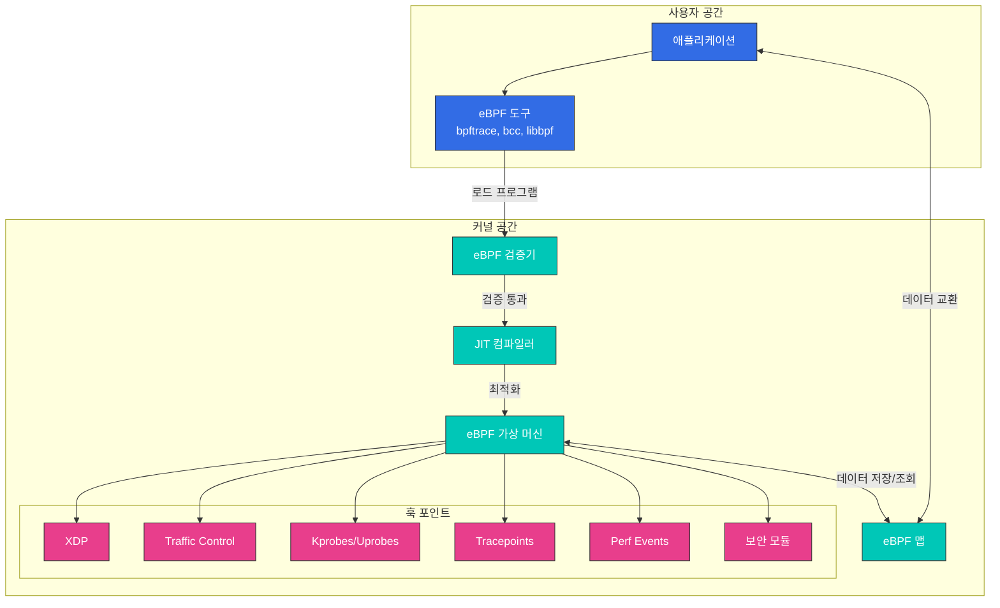

# eBPF 기술 심층 분석

> **지원 버전**: Linux 커널 4.19+  
> **마지막 업데이트**: 2023년 7월 20일

## 실습 환경 설정

이 문서의 예제를 따라하기 위해서는 다음과 같은 도구와 환경이 필요합니다:

### 필수 도구
- Linux 커널 4.19 이상 (5.10+ 권장)
- bpftool, libbpf-dev, clang, llvm
- bcc (BPF Compiler Collection)

### 환경 설정

```bash
# Ubuntu/Debian 시스템에서 필요한 패키지 설치
sudo apt-get update
sudo apt-get install -y build-essential clang llvm libelf-dev libbpf-dev bpftool linux-tools-common linux-tools-generic

# BCC 설치
sudo apt-get install -y bpfcc-tools python3-bpfcc

# 커널 버전 확인
uname -r

# eBPF 기능 지원 확인
bpftool feature
```

## eBPF 기술 소개 및 역사

eBPF(extended Berkeley Packet Filter)는 Linux 커널 내에서 안전하게 프로그램을 실행할 수 있는 혁신적인 기술입니다. 원래 네트워크 패킷 필터링을 위해 설계되었지만, 현재는 추적, 모니터링, 네트워킹, 보안 등 다양한 용도로 확장되었습니다.

### eBPF의 역사적 발전:

- **1992**: Steven McCanne와 Van Jacobson이 원래 BPF(Berkeley Packet Filter) 개발
- **2013**: Alexei Starovoitov가 eBPF(extended BPF) 제안
- **2014**: Linux 커널 3.15에 초기 eBPF 기능 도입
- **2016**: Linux 커널 4.4에서 XDP(eXpress Data Path) 도입
- **2017**: Cilium 프로젝트 시작, eBPF를 컨테이너 네트워킹에 활용
- **2018**: Linux 커널 4.18에서 BTF(BPF Type Format) 도입
- **2020**: eBPF 기반 프로젝트의 폭발적 증가

### eBPF vs 전통적인 커널 모듈:

| 특성 | eBPF | 커널 모듈 |
|------|------|----------|
| 안전성 | 검증기를 통한 안전 보장 | 커널 패닉 가능성 |
| 배포 | 런타임에 동적 로드 | 커널 재컴파일 필요 |
| 업그레이드 | 커널 재부팅 없이 가능 | 종종 재부팅 필요 |
| 성능 | JIT 컴파일로 최적화 | 네이티브 성능 |
| 개발 복잡성 | 제한된 환경, 특수 도구 필요 | 완전한 커널 API 접근 |

## 커널 내 eBPF 작동 방식

> **핵심 개념**: eBPF는 Linux 커널 내에서 샌드박스 가상 머신으로 작동하며, 커널 코드를 수정하지 않고도 커널 동작을 확장할 수 있습니다.

eBPF는 Linux 커널 내에서 샌드박스 가상 머신으로 작동합니다. 이 가상 머신은 eBPF 바이트코드를 실행하며, 이 바이트코드는 커널 내 다양한 이벤트에 연결될 수 있습니다.

### eBPF 아키텍처



### eBPF 프로그램 라이프사이클:

1. **개발**: C 또는 Rust와 같은 고수준 언어로 프로그램 작성
2. **컴파일**: LLVM을 사용하여 eBPF 바이트코드로 컴파일
3. **로드**: `bpf()` 시스템 콜을 통해 커널에 프로그램 로드
4. **검증**: 커널 내 검증기가 프로그램의 안전성 확인
5. **JIT 컴파일**: 바이트코드를 네이티브 머신 코드로 변환
6. **연결**: 특정 커널 이벤트(훅)에 프로그램 연결
7. **실행**: 이벤트 발생 시 프로그램 실행
8. **맵 상호작용**: 데이터 저장 및 사용자 공간과 통신

### eBPF 프로그램 유형:

- **XDP (eXpress Data Path)**: 네트워크 드라이버 수준에서 패킷 처리
- **TC (Traffic Control)**: 네트워크 스택의 트래픽 제어 계층에서 패킷 처리
- **소켓 필터**: 소켓 수준에서 패킷 필터링
- **kprobe/uprobe**: 커널/사용자 공간 함수 추적
- **tracepoint**: 커널 내 정적 추적점
- **perf_event**: 성능 모니터링 이벤트
- **cgroup**: 컨테이너 리소스 제어

### 간단한 eBPF 프로그램 예제

```c
// hello_world.c
#include <linux/bpf.h>
#include <bpf/bpf_helpers.h>

SEC("tracepoint/syscalls/sys_enter_execve")
int hello_execve(void *ctx) {
    char msg[] = "Hello, eBPF!";
    bpf_trace_printk(msg, sizeof(msg));
    return 0;
}

char LICENSE[] SEC("license") = "GPL";
```

컴파일 및 실행:
```bash
# 컴파일
clang -O2 -target bpf -c hello_world.c -o hello_world.o

# 로드 및 실행
bpftool prog load hello_world.o /sys/fs/bpf/hello_world

# 출력 확인
cat /sys/kernel/debug/tracing/trace_pipe
```
- **LSM (Linux Security Module)**: 보안 정책 적용

### eBPF 맵:

eBPF 맵은 eBPF 프로그램과 사용자 공간 애플리케이션 간의 데이터 공유를 위한 키-값 저장소입니다.

주요 맵 유형:
- **해시 맵**: 일반적인 키-값 저장소
- **배열 맵**: 인덱스 기반 저장소
- **LRU 맵**: 최근 사용 항목 추적
- **링 버퍼**: 이벤트 로깅
- **스택 트레이스 맵**: 스택 트레이스 저장
- **소켓 맵**: 소켓 참조 저장
- **디바이스 맵**: 네트워크 디바이스 참조 저장
- **프로그램 배열 맵**: 다른 eBPF 프로그램 참조 저장

## Cilium에서의 eBPF 활용

Cilium은 eBPF를 활용하여 컨테이너 네트워킹, 로드 밸런싱, 네트워크 정책 및 가시성을 구현합니다.

### Cilium의 eBPF 데이터 경로:

1. **패킷 수신**: XDP 또는 TC 훅에서 패킷 인터셉트
2. **신원 확인**: 패킷의 출발지/목적지 엔드포인트 식별
3. **정책 적용**: 네트워크 정책 규칙 확인
4. **연결 추적**: 연결 상태 추적 및 관리
5. **NAT 및 로드 밸런싱**: 필요한 경우 주소 변환 및 로드 밸런싱
6. **패킷 전달**: 대상 엔드포인트로 패킷 전달

### Cilium의 주요 eBPF 프로그램:

- **bpf_lxc.c**: 엔드포인트 간 통신 처리
- **bpf_overlay.c**: 오버레이 네트워크 처리
- **bpf_host.c**: 호스트 네트워킹 처리
- **bpf_xdp.c**: XDP 기반 패킷 처리
- **bpf_sock.c**: 소켓 수준 로드 밸런싱
- **bpf_lb.c**: 서비스 로드 밸런싱
- **bpf_network.c**: 네트워크 정책 적용

### Cilium의 eBPF 맵:

- **endpoints_map**: 엔드포인트 정보 저장
- **connection_map**: 연결 추적 정보
- **policy_map**: 네트워크 정책 규칙
- **lb_map**: 로드 밸런싱 서비스 정보
- **tunnel_map**: 오버레이 네트워크 정보
- **metrics_map**: 성능 메트릭 수집

## 실습: eBPF 프로그램 개발 및 디버깅

### 간단한 eBPF 프로그램 작성:

```c
// hello_ebpf.c
#include <linux/bpf.h>
#include <bpf/bpf_helpers.h>

SEC("tracepoint/syscalls/sys_enter_execve")
int hello_execve(void *ctx) {
    char msg[] = "Hello, eBPF!";
    bpf_trace_printk(msg, sizeof(msg));
    return 0;
}

char LICENSE[] SEC("license") = "GPL";
```

### 컴파일 및 로드:

```bash
# 컴파일
clang -O2 -target bpf -c hello_ebpf.c -o hello_ebpf.o

# 로드 및 실행
bpftool prog load hello_ebpf.o /sys/fs/bpf/hello_execve

# 출력 확인
cat /sys/kernel/debug/tracing/trace_pipe
```

### Cilium eBPF 디버깅:

```bash
# Cilium eBPF 맵 확인
cilium bpf maps list

# 특정 맵 내용 확인
cilium bpf maps get cilium_policy_00001

# 엔드포인트 정보 확인
cilium endpoint list

# 특정 엔드포인트의 eBPF 프로그램 확인
cilium bpf endpoint list -e 1234
```

[메인 페이지로 돌아가기](README.md)
