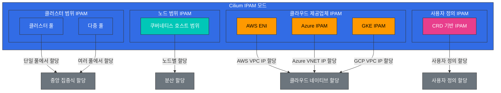

# IPAM 및 네트워크 정책

> **지원 버전**: Cilium 1.13, 1.14  
> **마지막 업데이트**: 2023년 7월 20일

## 실습 환경 설정

이 문서의 예제를 따라하기 위해서는 다음과 같은 도구와 환경이 필요합니다:

### 필수 도구
- kubectl v1.26 이상
- 작동하는 Kubernetes 클러스터 (EKS, minikube, kind 등)
- Cilium CLI

### IPAM 및 네트워크 정책 실습 설정

```bash
# Cilium 상태 확인
cilium status --wait

# 현재 IPAM 구성 확인
kubectl -n kube-system get configmap cilium-config -o yaml | grep -E 'ipam|allocator'

# 네트워크 정책 테스트를 위한 네임스페이스 생성
kubectl create namespace policy-test

# 테스트 애플리케이션 배포
kubectl -n policy-test apply -f https://raw.githubusercontent.com/cilium/cilium/v1.14/examples/minikube/http-sw-app.yaml
```

## IP 주소 관리(IPAM) 전략

> **핵심 개념**: IPAM(IP Address Management)은 IP 주소의 할당, 추적 및 관리를 담당하는 시스템입니다.

IPAM은 IP 주소의 할당, 추적 및 관리를 담당하는 시스템입니다. Cilium은 다양한 IPAM 모드를 지원하여 다양한 환경과 요구 사항에 맞게 유연하게 구성할 수 있습니다.

### Cilium IPAM 아키텍처



### Cilium IPAM 모드:

1. **클러스터 풀(Cluster Pool)**:
   - 기본 IPAM 모드
   - 클러스터 전체에서 중앙 집중식으로 IP 주소 할당
   - 단일 또는 여러 IP 풀 구성 가능
   - 간단하고 사용하기 쉬움

2. **쿠버네티스 호스트 범위(Kubernetes Host Scope)**:
   - 각 노드에 IP 주소 범위 할당
   - 노드는 자체 범위 내에서 IP 주소 할당
   - 중앙 조정 필요 없음
   - 노드 간 IP 충돌 방지

3. **CRD 기반 IPAM**:
   - CiliumIPPool 커스텀 리소스를 통한 IP 풀 정의
   - 특정 네임스페이스 또는 포드에 IP 풀 할당
   - 세분화된 IP 주소 관리
   - 동적 IP 풀 관리

4. **AWS ENI(Elastic Network Interface)**:
   - AWS VPC ENI 통합
   - 포드에 네이티브 VPC IP 주소 할당
   - 오버레이 네트워크 없이 VPC 네이티브 네트워킹
   - AWS 환경에 최적화

5. **Azure IPAM**:
   - Azure VNET 통합
   - 포드에 네이티브 VNET IP 주소 할당
   - Azure 환경에 최적화

### IPAM 구성 요소:

- **IP 풀**: 할당 가능한 IP 주소 범위
- **IP 할당**: 엔드포인트에 IP 주소 할당
- **IP 릴리스**: 사용하지 않는 IP 주소 회수
- **IP 충돌 감지**: IP 주소 충돌 방지
- **IP 예약**: 특정 용도로 IP 주소 예약

### IPAM 고려 사항:

- **주소 공간 크기**: 필요한 IP 주소 수
- **네트워크 분할**: 서브넷 및 CIDR 블록 설계
- **확장성**: 향후 성장 고려

### IPAM 구성 예제

클러스터 풀 IPAM 구성:
```yaml
apiVersion: v1
kind: ConfigMap
metadata:
  name: cilium-config
  namespace: kube-system
data:
  ipam: "cluster-pool"
  cluster-pool-ipv4-cidr: "10.0.0.0/16"
  cluster-pool-ipv4-mask-size: "24"
  enable-ipv4: "true"
  enable-ipv6: "false"
```

AWS ENI IPAM 구성:
```yaml
apiVersion: v1
kind: ConfigMap
metadata:
  name: cilium-config
  namespace: kube-system
data:
  ipam: "eni"
  enable-ipv4: "true"
  enable-ipv6: "false"
  eni-tags: "{\"cluster\": \"eks-cluster\"}"
  ec2-api-endpoint: "ec2.us-west-2.amazonaws.com"
```
- **클라우드 통합**: 클라우드 제공업체 네트워킹과의 통합
- **IPv4 vs IPv6**: 단일 또는 이중 스택 구성

## Kubernetes와 Cilium IPAM 통합

Cilium은 Kubernetes와 긴밀하게 통합되어 포드 및 서비스에 IP 주소를 할당하고 관리합니다.

### Kubernetes IPAM 통합 흐름:

1. **포드 생성**: Kubernetes가 포드 생성 요청
2. **CNI 호출**: kubelet이 Cilium CNI 플러그인 호출
3. **IP 할당 요청**: Cilium이 IPAM 모듈에 IP 주소 요청
4. **IP 할당**: IPAM이 사용 가능한 IP 주소 할당
5. **네트워크 설정**: Cilium이 포드의 네트워크 네임스페이스 구성
6. **상태 저장**: IP 할당 정보 저장
7. **포드 시작**: 네트워크가 구성된 포드 시작

### Cilium 클러스터 풀 구성:

```yaml
# cilium-config.yaml
apiVersion: v1
kind: ConfigMap
metadata:
  name: cilium-config
  namespace: kube-system
data:
  # 클러스터 풀 IPAM 모드
  ipam: "cluster-pool"
  
  # IPv4 CIDR 범위
  cluster-pool-ipv4-cidr: "10.0.0.0/8"
  cluster-pool-ipv4-mask-size: "24"
  
  # IPv6 CIDR 범위 (선택 사항)
  cluster-pool-ipv6-cidr: "fd00::/104"
  cluster-pool-ipv6-mask-size: "120"
  
  # 이중 스택 활성화
  enable-ipv4: "true"
  enable-ipv6: "true"
```

### CRD 기반 IPAM 예제:

```yaml
# cilium-ippool.yaml
apiVersion: "cilium.io/v2alpha1"
kind: CiliumIPPool
metadata:
  name: "production-pool"
spec:
  ipv4:
    cidr: "10.10.0.0/16"
    blockSize: 27  # 32 IP 주소 블록
  selector:
    matchLabels:
      environment: production
```

### AWS ENI IPAM 구성:

```yaml
# cilium-aws-config.yaml
apiVersion: v1
kind: ConfigMap
metadata:
  name: cilium-config
  namespace: kube-system
data:
  # AWS ENI IPAM 모드
  ipam: "eni"
  
  # AWS ENI 구성
  enable-endpoint-routes: "true"
  auto-create-cilium-node-resource: "true"
  
  # ENI 태그 (선택 사항)
  eni-tags: "{\"team\": \"platform\"}"
  
  # 프리픽스 위임 (선택 사항)
  enable-prefix-delegation: "true"
  eni-prefix-delegation-enabled: "true"
```

## IPAM 모드 심층 분석

### 1. 클러스터 스코프(Cluster Scope) - 기본 모드

클러스터 스코프 IPAM은 Cilium의 기본 IPAM 모드로, 클러스터 전체에서 중앙 집중식으로 IP 주소를 할당합니다.

**주요 특징**:
- 중앙 집중식 IP 주소 할당
- 클러스터 전체에서 IP 주소 고유성 보장
- 단일 또는 여러 IP 풀 구성 가능
- 간단하고 사용하기 쉬움

**작동 방식**:
1. Cilium 에이전트는 클러스터 전체 IP 풀에서 IP 주소를 할당합니다.
2. 할당된 IP 주소는 Kubernetes CRD에 저장됩니다.
3. IP 주소 할당 정보는 클러스터 내 모든 노드에서 공유됩니다.

### 2. Kubernetes 호스트 스코프(Kubernetes Host Scope)

Kubernetes 호스트 스코프 IPAM은 각 노드에 IP 주소 범위를 할당하고, 노드는 자체 범위 내에서 IP 주소를 할당합니다.

**주요 특징**:
- 노드별 IP 주소 범위 할당
- 중앙 조정 필요 없음
- 노드 간 IP 충돌 방지
- 향상된 확장성

**작동 방식**:
1. Kubernetes는 각 노드에 PodCIDR을 할당합니다.
2. Cilium은 노드의 PodCIDR에서 IP 주소를 할당합니다.
3. 각 노드는 자체 IP 주소 범위를 독립적으로 관리합니다.

### 3. 멀티 풀(Multi-Pool) - 베타

멀티 풀 IPAM은 여러 IP 풀을 정의하고 특정 워크로드에 특정 풀을 할당할 수 있는 기능을 제공합니다.

**주요 특징**:
- 여러 IP 풀 정의 및 관리
- 네임스페이스, 포드 또는 노드별 IP 풀 할당
- 세분화된 IP 주소 관리
- 다양한 네트워크 요구 사항 지원

**작동 방식**:
1. CiliumIPPool CRD를 사용하여 여러 IP 풀을 정의합니다.
2. 선택기를 사용하여 특정 워크로드에 특정 풀을 할당합니다.
3. Cilium은 정의된 규칙에 따라 적절한 풀에서 IP 주소를 할당합니다.

### 4. Azure IPAM

Azure IPAM은 Azure VNET과 통합하여 포드에 네이티브 VNET IP 주소를 할당합니다.

**주요 특징**:
- Azure VNET 네이티브 IP 주소 할당
- Azure 네트워크 보안 그룹 통합
- Azure 네트워킹 최적화

### 5. Azure 위임 IPAM(Azure Delegated IPAM)

Azure 위임 IPAM은 Azure CNI에 IP 주소 관리를 위임하는 모드입니다.

**주요 특징**:
- Azure CNI와의 통합
- Azure에서 관리하는 IP 주소 할당
- Azure 네트워킹 기능 활용

### 6. CRD 기반 IPAM

CRD 기반 IPAM은 Kubernetes CRD를 사용하여 IP 주소 할당을 관리합니다.

**주요 특징**:
- Kubernetes CRD를 통한 IP 주소 관리
- 선언적 IP 주소 할당
- Kubernetes 네이티브 워크플로우 통합

**작동 방식**:
1. CiliumNode CRD에 IP 주소 풀 정보를 저장합니다.
2. Cilium 에이전트는 CRD에서 IP 주소 할당 정보를 읽습니다.
3. IP 주소 할당 상태는 CRD에 업데이트됩니다.

## 네트워크 정책 설계 및 구현

Cilium 네트워크 정책은 L3-L7 계층에서 마이크로서비스 간 통신을 제어하는 강력한 메커니즘을 제공합니다. 이러한 정책은 Kubernetes NetworkPolicy API를 확장하여 더 세분화된 제어를 제공합니다.

### 네트워크 정책 기본 개념:

- **엔드포인트 선택기**: 정책이 적용되는 엔드포인트 정의
- **인그레스 규칙**: 들어오는 트래픽 제어
- **이그레스 규칙**: 나가는 트래픽 제어
- **L3/L4 정책**: IP 주소 및 포트 기반 필터링
- **L7 정책**: 애플리케이션 계층 프로토콜 인식 필터링

### L3/L4 네트워크 정책 예제:

```yaml
# l3-l4-policy.yaml
apiVersion: "cilium.io/v2"
kind: CiliumNetworkPolicy
metadata:
  name: "l3-l4-policy"
spec:
  endpointSelector:
    matchLabels:
      app: backend
  ingress:
  - fromEndpoints:
    - matchLabels:
        app: frontend
    toPorts:
    - ports:
      - port: "8080"
        protocol: TCP
  egress:
  - toEndpoints:
    - matchLabels:
        app: database
    toPorts:
    - ports:
      - port: "3306"
        protocol: TCP
```

### L7 HTTP 정책 예제:

```yaml
# l7-http-policy.yaml
apiVersion: "cilium.io/v2"
kind: CiliumNetworkPolicy
metadata:
  name: "l7-http-policy"
spec:
  endpointSelector:
    matchLabels:
      app: backend
  ingress:
  - fromEndpoints:
    - matchLabels:
        app: frontend
    toPorts:
    - ports:
      - port: "8080"
        protocol: TCP
      rules:
        http:
        - method: "GET"
          path: "/api/v1/users"
        - method: "POST"
          path: "/api/v1/users"
          headers:
          - "Content-Type: application/json"
```

### L7 Kafka 정책 예제:

```yaml
# l7-kafka-policy.yaml
apiVersion: "cilium.io/v2"
kind: CiliumNetworkPolicy
metadata:
  name: "l7-kafka-policy"
spec:
  endpointSelector:
    matchLabels:
      app: kafka-broker
  ingress:
  - fromEndpoints:
    - matchLabels:
        app: kafka-client
    toPorts:
    - ports:
      - port: "9092"
        protocol: TCP
      rules:
        kafka:
        - apiKey: "Produce"
          topic: "allowed-topic-1"
        - apiKey: "Fetch"
          topic: "allowed-topic-1"
        - apiKey: "CreateTopics"
          topic: "allowed-topic-.*"
          apiVersions: ["0", "1"]
```

### DNS 기반 정책 예제:

```yaml
# dns-policy.yaml
apiVersion: "cilium.io/v2"
kind: CiliumNetworkPolicy
metadata:
  name: "dns-policy"
spec:
  endpointSelector:
    matchLabels:
      app: client
  egress:
  - toEndpoints:
    - matchLabels:
        "k8s:io.kubernetes.pod.namespace": kube-system
        "k8s:k8s-app": kube-dns
    toPorts:
    - ports:
      - port: "53"
        protocol: UDP
      - port: "53"
        protocol: TCP
  - toFQDNs:
    - matchName: "api.example.com"
    - matchPattern: "*.googleapis.com"
    toPorts:
    - ports:
      - port: "443"
        protocol: TCP
```

### 네트워크 정책 모범 사례:

1. **기본 거부 정책 적용**:
   - 명시적으로 허용되지 않은 모든 트래픽 차단
   - 최소 권한 원칙 적용

2. **점진적 접근 방식**:
   - 관찰 모드로 시작하여 영향 평가
   - 점진적으로 정책 적용 및 강화

3. **레이블 기반 선택기 사용**:
   - IP 주소 대신 레이블 기반 선택기 사용
   - 동적 환경에서 유연성 제공

4. **정책 계층화**:
   - 기본 정책과 특정 정책 조합
   - 관심사 분리 및 유지 관리 용이성

5. **정책 테스트 및 검증**:
   - 정책 적용 전 테스트
   - 지속적인 정책 검증 및 모니터링

## 멀티 클러스터 시나리오

Cilium은 여러 Kubernetes 클러스터 간의 네트워킹 및 보안을 위한 강력한 기능을 제공합니다. 이를 통해 클러스터 간 서비스 통신, 네트워크 정책 적용 및 로드 밸런싱이 가능합니다.

### 멀티 클러스터 연결 모델:

1. **글로벌 서비스**:
   - 여러 클러스터에 걸쳐 서비스 노출
   - 클러스터 간 로드 밸런싱
   - 자동 장애 조치 및 고가용성

2. **클러스터 메시**:
   - 클러스터 간 직접 연결
   - 클러스터 간 네트워크 정책
   - 통합 관찰 가능성

3. **원격 노드**:
   - 원격 클러스터의 노드를 로컬로 표시
   - 클러스터 간 투명한 통신
   - 단일 네트워크 네임스페이스 시뮬레이션

### Cilium Cluster Mesh 아키텍처:

```
+-------------------+        +-------------------+
| 클러스터 A        |        | 클러스터 B        |
|                   |        |                   |
| +---------------+ |        | +---------------+ |
| | 서비스 A      | |        | | 서비스 B      | |
| | (글로벌)      | |        | | (글로벌)      | |
| +-------+-------+ |        | +-------+-------+ |
|         |         |        |         |         |
|     +---v---+     |        |     +---v---+     |
|     | eBPF  |     |        |     | eBPF  |     |
|     +---+---+     |        |     +---+---+     |
|         |         |        |         |         |
| +-------v-------+ |        | +-------v-------+ |
| | Cilium        | |<------>| | Cilium        | |
| | Clustermesh   | |        | | Clustermesh   | |
| +---------------+ |        | +---------------+ |
|                   |        |                   |
+-------------------+        +-------------------+
```

### Cilium Cluster Mesh 설정:

```bash
# 클러스터 A에서 Cluster Mesh 활성화
cilium clustermesh enable --context cluster-a

# 클러스터 B에서 Cluster Mesh 활성화
cilium clustermesh enable --context cluster-b

# 클러스터 연결
cilium clustermesh connect --context cluster-a --destination-context cluster-b

# 상태 확인
cilium clustermesh status --context cluster-a
```

### 글로벌 서비스 정의:

```yaml
# global-service.yaml
apiVersion: v1
kind: Service
metadata:
  name: global-service
  annotations:
    io.cilium/global-service: "true"
spec:
  selector:
    app: global-app
  ports:
  - port: 80
    targetPort: 8080
  type: ClusterIP
```

### 클러스터 간 네트워크 정책:

```yaml
# cross-cluster-policy.yaml
apiVersion: "cilium.io/v2"
kind: CiliumNetworkPolicy
metadata:
  name: "cross-cluster-policy"
spec:
  endpointSelector:
    matchLabels:
      app: backend
  ingress:
  - fromEndpoints:
    - matchLabels:
        app: frontend
        io.kubernetes.pod.namespace: frontend-ns
        io.cilium.k8s.policy.cluster: cluster-a
    toPorts:
    - ports:
      - port: "8080"
        protocol: TCP
```

[메인 페이지로 돌아가기](README.md)
