# 네트워킹 개념 심층 분석

이 문서는 Cilium을 이해하는 데 필요한 핵심 네트워킹 개념에 대한 심층적인 설명을 제공합니다. 컨테이너 네트워킹, 오버레이 네트워크, 라우팅 프로토콜 등 Cilium의 기반이 되는 기술적 개념을 탐구합니다.

## 목차

1. [OSI 모델 및 TCP/IP 스택](#osi-모델-및-tcpip-스택)
2. [컨테이너 네트워킹 기초](#컨테이너-네트워킹-기초)
3. [오버레이 네트워크](#오버레이-네트워크)
4. [네트워크 주소 변환(NAT)](#네트워크-주소-변환nat)
5. [라우팅 프로토콜](#라우팅-프로토콜)
6. [DNS 및 서비스 디스커버리](#dns-및-서비스-디스커버리)
7. [로드 밸런싱 개념](#로드-밸런싱-개념)
8. [네트워크 보안 기초](#네트워크-보안-기초)

## OSI 모델 및 TCP/IP 스택

OSI(Open Systems Interconnection) 모델은 네트워크 통신을 7개의 추상 계층으로 분류한 개념적 프레임워크입니다. 각 계층은 특정 네트워킹 기능을 담당하며, 이를 통해 복잡한 네트워킹 프로세스를 이해하기 쉽게 분해할 수 있습니다.

### OSI 7계층 모델

1. **물리 계층(Physical Layer)**
   - 비트 스트림을 전기 신호, 광 신호 또는 무선 신호로 변환
   - 케이블, 스위치, 허브 등의 물리적 장치 포함
   - 데이터 단위: 비트(Bit)

2. **데이터 링크 계층(Data Link Layer)**
   - 물리적 네트워크 상의 노드 간 데이터 전송 담당
   - MAC(Media Access Control) 주소를 사용한 장치 식별
   - 오류 감지 및 수정
   - 데이터 단위: 프레임(Frame)
   - 이더넷, Wi-Fi 프로토콜이 이 계층에서 작동

3. **네트워크 계층(Network Layer)**
   - 서로 다른 네트워크 간의 패킷 라우팅 담당
   - 논리적 주소 지정(IP 주소)
   - 경로 결정 및 패킷 전달
   - 데이터 단위: 패킷(Packet)
   - IP(Internet Protocol)가 이 계층의 핵심 프로토콜

4. **전송 계층(Transport Layer)**
   - 종단 간(end-to-end) 통신 제어
   - 데이터 분할 및 재조립
   - 흐름 제어 및 오류 복구
   - 데이터 단위: 세그먼트(Segment)
   - TCP(Transmission Control Protocol)와 UDP(User Datagram Protocol)가 이 계층의 주요 프로토콜

5. **세션 계층(Session Layer)**
   - 통신 세션 설정, 유지 및 종료
   - 동기화 및 대화 제어
   - 체크포인트 설정 및 복구

6. **표현 계층(Presentation Layer)**
   - 데이터 형식 변환 및 암호화
   - 문자 인코딩, 데이터 압축, 암호화 처리
   - MIME, SSL/TLS 등이 이 계층에서 작동

7. **응용 계층(Application Layer)**
   - 사용자와 직접 상호작용하는 네트워크 애플리케이션 제공
   - 이메일, 웹 브라우징, 파일 전송 등의 서비스
   - HTTP, SMTP, FTP, DNS 등의 프로토콜이 이 계층에서 작동

### TCP/IP 스택

TCP/IP 스택은 인터넷의 기반이 되는 프로토콜 집합으로, OSI 모델을 4개의 계층으로 단순화한 모델입니다.

1. **네트워크 인터페이스 계층(Network Interface Layer)**
   - OSI 모델의 물리 계층과 데이터 링크 계층에 해당
   - 물리적 네트워크 매체와의 인터페이스 담당
   - 이더넷, Wi-Fi 등의 프로토콜 포함

2. **인터넷 계층(Internet Layer)**
   - OSI 모델의 네트워크 계층에 해당
   - IP(Internet Protocol)를 사용한 패킷 라우팅
   - ICMP(Internet Control Message Protocol), ARP(Address Resolution Protocol) 등 포함

3. **전송 계층(Transport Layer)**
   - OSI 모델의 전송 계층과 동일
   - TCP와 UDP 프로토콜 포함
   - 연결 지향(TCP) 및 비연결 지향(UDP) 통신 제공

4. **응용 계층(Application Layer)**
   - OSI 모델의 세션, 표현, 응용 계층을 통합
   - HTTP, SMTP, FTP, DNS 등의 프로토콜 포함
   - 사용자 애플리케이션과 네트워크 간의 인터페이스 제공

### Cilium과 계층별 기능

Cilium은 다양한 네트워크 계층에서 기능을 제공합니다:

- **L2(데이터 링크 계층)**: MAC 주소 기반 필터링, ARP 스푸핑 방지
- **L3(네트워크 계층)**: IP 주소 기반 라우팅 및 필터링, IPAM
- **L4(전송 계층)**: 포트 기반 필터링, 로드 밸런싱, 연결 추적
- **L7(응용 계층)**: HTTP, gRPC, Kafka 등의 프로토콜 인식 필터링 및 로드 밸런싱

## 컨테이너 네트워킹 기초

컨테이너 네트워킹은 컨테이너화된 애플리케이션이 서로 통신하고 외부 세계와 통신할 수 있게 해주는 메커니즘입니다. Kubernetes와 같은 컨테이너 오케스트레이션 플랫폼에서는 다양한 네트워킹 모델과 솔루션이 사용됩니다.

### 컨테이너 네트워크 인터페이스(CNI)

CNI(Container Network Interface)는 컨테이너 런타임과 네트워크 플러그인 간의 표준 인터페이스를 정의합니다. 이를 통해 다양한 네트워킹 솔루션을 컨테이너 플랫폼에 통합할 수 있습니다.

#### CNI의 주요 구성 요소:

1. **플러그인**: 네트워크 인터페이스 생성 및 구성을 담당하는 실행 파일
2. **구성 파일**: 플러그인의 동작을 정의하는 JSON 형식의 파일
3. **IPAM(IP Address Management)**: IP 주소 할당 및 관리를 담당하는 모듈

#### CNI 플러그인의 주요 책임:

- 컨테이너 네트워크 네임스페이스에 인터페이스 추가/제거
- IP 주소 할당 및 해제
- 라우팅 테이블 구성
- 네트워크 정책 적용

### 컨테이너 네트워킹 모델

컨테이너 네트워킹에는 여러 모델이 있으며, 각각 다른 사용 사례와 요구 사항에 적합합니다.

#### 1. 브리지 네트워킹

- 호스트에 가상 브리지를 생성하여 컨테이너를 연결
- 각 컨테이너는 가상 이더넷(veth) 쌍을 통해 브리지에 연결
- 동일한 호스트의 컨테이너 간 통신이 효율적
- Docker의 기본 네트워킹 모드

```mermaid
graph TD
    subgraph "Container A"
        A[Container A<br>IP: 172.17.0.2]
        vethA[veth0]
    end
    
    subgraph "Container B"
        B[Container B<br>IP: 172.17.0.3]
        vethB[veth1]
    end
    
    bridge[docker0<br>Bridge (172.17.0.1/24)]
    host[Host Network<br>eth0, 192.168.1.10]
    
    vethA --> bridge
    vethB --> bridge
    bridge --> host
```

#### 2. 호스트 네트워킹

- 컨테이너가 호스트의 네트워크 네임스페이스를 직접 사용
- 별도의 네트워크 격리 없음
- 최상의 네트워크 성능 제공
- 포트 충돌 가능성 있음

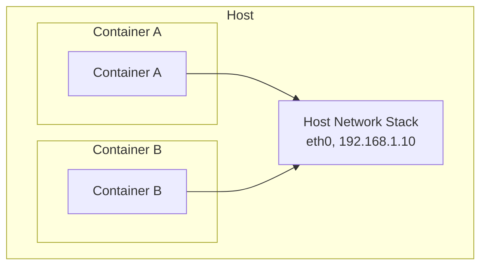

#### 3. 오버레이 네트워킹

- 여러 호스트에 걸쳐 있는 컨테이너 간의 통신 지원
- VXLAN, GENEVE 등의 캡슐화 프로토콜 사용
- 대규모 클러스터에 적합
- Cilium, Calico, Flannel 등이 이 모델 지원

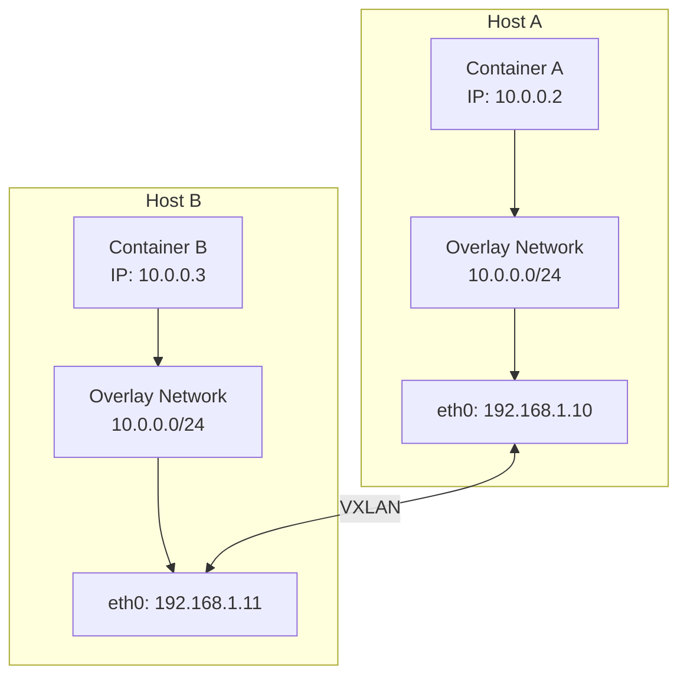

#### 4. 언더레이 네트워킹(직접 라우팅)

- 물리적 네트워크 인프라를 직접 활용
- 캡슐화 오버헤드 없음
- 네트워크 인프라에 대한 제어가 필요
- BGP와 같은 라우팅 프로토콜과 통합 가능

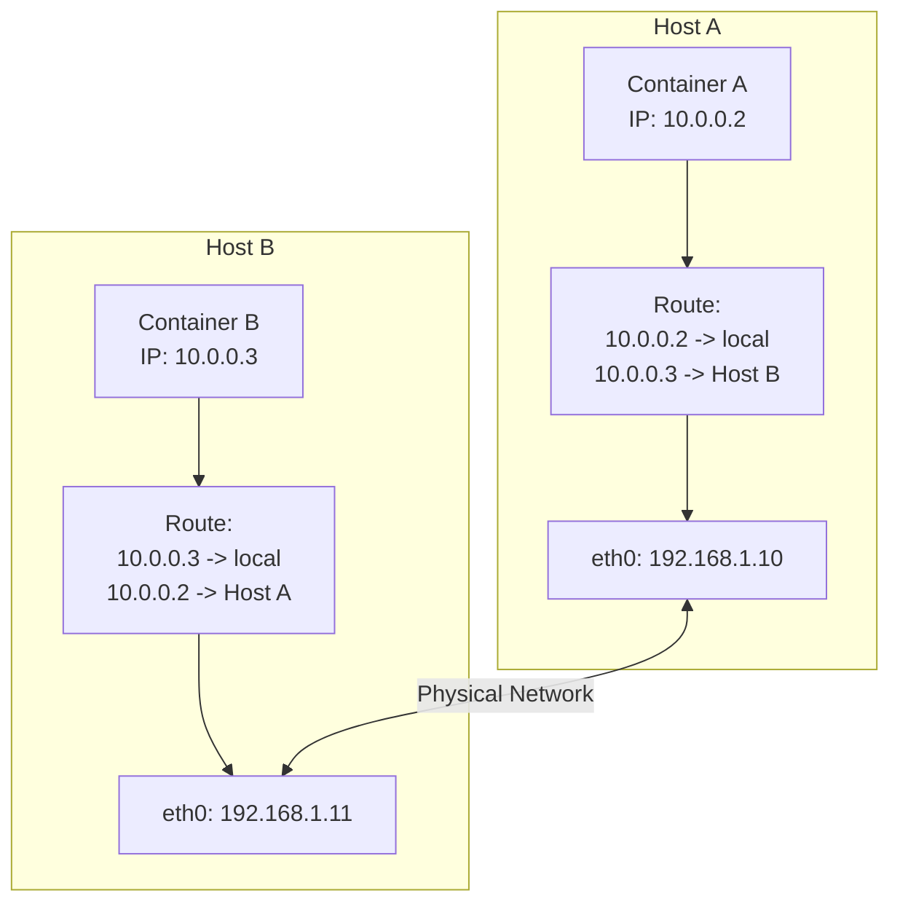

### Kubernetes 네트워킹 모델

Kubernetes는 모든 포드가 NAT 없이 서로 통신할 수 있어야 한다는 기본 요구 사항을 가지고 있습니다. 이를 위해 다음과 같은 네트워킹 모델을 정의합니다:

1. **포드 간 통신**: 모든 포드는 서로 NAT 없이 통신할 수 있어야 함
2. **노드-포드 통신**: 노드는 모든 포드와 NAT 없이 통신할 수 있어야 함
3. **포드-외부 통신**: 포드는 외부 네트워크와 통신할 수 있어야 함(일반적으로 NAT 사용)

#### Kubernetes 네트워크 구성 요소:

1. **포드 네트워크**: 클러스터 내 모든 포드를 연결하는 네트워크
2. **서비스 네트워크**: 포드 집합에 대한 안정적인 엔드포인트 제공
3. **클러스터 DNS**: 서비스 디스커버리를 위한 DNS 서비스
4. **인그레스/이그레스**: 클러스터 외부와의 통신 관리

### Cilium의 컨테이너 네트워킹 접근 방식

Cilium은 eBPF를 활용하여 고성능, 확장 가능한 컨테이너 네트워킹 솔루션을 제공합니다:

1. **eBPF 기반 데이터 경로**: 커널 내에서 직접 패킷 처리
2. **다양한 네트워킹 모드 지원**: 오버레이(VXLAN, Geneve) 및 언더레이(직접 라우팅)
3. **고급 로드 밸런싱**: kube-proxy 대체 기능
4. **네트워크 정책**: L3-L7 수준의 세분화된 정책
5. **통합 IPAM**: 다양한 IP 주소 할당 전략 지원

## 오버레이 네트워크

오버레이 네트워크는 기존 네트워크 인프라 위에 가상 네트워크 계층을 구축하는 기술입니다. 이 기술은 물리적 네트워크 토폴로지와 독립적으로 가상 네트워크 토폴로지를 생성할 수 있게 해줍니다. 컨테이너 환경에서는 여러 호스트에 걸쳐 있는 컨테이너 간의 통신을 가능하게 하는 데 널리 사용됩니다.

### 오버레이 네트워크의 작동 원리

오버레이 네트워크는 캡슐화(Encapsulation) 기술을 사용하여 작동합니다. 원본 패킷은 다른 패킷 내에 캡슐화되어 물리적 네트워크를 통해 전송됩니다.

1. **패킷 캡슐화**: 원본 패킷(내부 패킷)이 새로운 헤더와 때로는 새로운 트레일러로 감싸집니다.
2. **터널링**: 캡슐화된 패킷은 물리적 네트워크를 통해 목적지 호스트로 전송됩니다.
3. **패킷 디캡슐화**: 목적지 호스트에서 외부 헤더가 제거되고 원본 패킷이 추출됩니다.
4. **패킷 전달**: 원본 패킷은 목적지 컨테이너로 전달됩니다.

### 주요 오버레이 네트워크 프로토콜

#### VXLAN(Virtual Extensible LAN)

VXLAN은 컨테이너 네트워킹에서 가장 널리 사용되는 오버레이 프로토콜 중 하나입니다.

- **VXLAN 터널 엔드포인트(VTEP)**: 패킷의 캡슐화 및 디캡슐화를 담당
- **VXLAN 네트워크 식별자(VNI)**: 최대 16,777,216개의 가상 네트워크 지원
- **UDP 캡슐화**: VXLAN 패킷은 UDP 포트 4789를 통해 전송
- **MAC-in-UDP 캡슐화**: 원본 L2 프레임을 UDP 패킷으로 캡슐화

VXLAN 패킷 구조:
```mermaid
graph TD
    outerEth[Outer Ethernet]
    outerIP[Outer IP]
    outerUDP[Outer UDP]
    vxlanHeader[VXLAN Header<br>VNI(VXLAN Network Identifier)]
    origEth[Original Ethernet]
    origIP[Original IP]
    origTCP[Original TCP/UDP]
    payload[Payload]
    
    outerEth --> outerIP
    outerIP --> outerUDP
    outerUDP --> vxlanHeader
    vxlanHeader --> origEth
    origEth --> origIP
    origIP --> origTCP
    origTCP --> payload
    
    style vxlanHeader fill:#f9f,stroke:#333,stroke-width:2px
```

#### GENEVE(Generic Network Virtualization Encapsulation)

GENEVE는 VXLAN의 제한을 극복하기 위해 설계된 보다 유연한 오버레이 프로토콜입니다.

- **확장 가능한 옵션 헤더**: 다양한 메타데이터 지원
- **프로토콜 독립적**: 다양한 가상화 기술과 함께 사용 가능
- **UDP 캡슐화**: UDP 포트 6081을 통해 전송
- **유연한 터널링**: 다양한 네트워크 가상화 요구 사항 지원

#### IPsec

IPsec은 IP 패킷 수준에서 보안 서비스를 제공하는 프로토콜 스위트입니다.

- **인증 및 암호화**: 데이터 무결성 및 기밀성 보장
- **전송 모드 및 터널 모드**: 다양한 배포 시나리오 지원
- **보안 연결(SA)**: 통신 당사자 간의 보안 매개변수 정의
- **인터넷 키 교환(IKE)**: 보안 키 관리 자동화

### 오버레이 네트워크의 장단점

#### 장점:

- **유연성**: 물리적 네트워크 토폴로지와 독립적으로 가상 네트워크 구성 가능
- **확장성**: 대규모 네트워크 세그먼트 및 다수의 엔드포인트 지원
- **격리**: 서로 다른 테넌트 또는 애플리케이션 간의 네트워크 격리 제공
- **호환성**: 기존 네트워크 인프라와 함께 작동 가능

#### 단점:

- **오버헤드**: 캡슐화로 인한 패킷 크기 증가 및 처리 오버헤드
- **MTU 고려 사항**: 캡슐화로 인한 최대 전송 단위(MTU) 감소
- **복잡성**: 문제 해결 및 디버깅이 더 복잡해질 수 있음
- **지연 시간**: 캡슐화 및 디캡슐화 과정에서 약간의 지연 시간 추가

### Cilium에서의 오버레이 네트워크

Cilium은 VXLAN 및 Geneve와 같은 오버레이 프로토콜을 지원하며, eBPF를 활용하여 효율적인 패킷 처리를 제공합니다.

- **eBPF 기반 VXLAN 처리**: 커널 내에서 직접 패킷 캡슐화 및 디캡슐화
- **효율적인 라우팅**: 최적화된 경로를 통한 패킷 전달
- **암호화 옵션**: IPsec 또는 WireGuard를 통한 암호화된 오버레이
- **직접 라우팅과의 하이브리드**: 필요에 따라 오버레이와 직접 라우팅 조합 가능

#### Cilium VXLAN 구성 예제:

```yaml
apiVersion: v1
kind: ConfigMap
metadata:
  name: cilium-config
  namespace: kube-system
data:
  tunnel: "vxlan"
  enable-ipv4: "true"
  enable-ipv6: "false"
  ipv4-range: "10.0.0.0/16"
  ipv4-tunnel-endpoint-selector: "kubernetes.io/hostname"
```
## 네트워크 주소 변환(NAT)

네트워크 주소 변환(Network Address Translation, NAT)은 IP 패킷의 소스 또는 목적지 주소를 수정하는 프로세스입니다. NAT는 주로 사설 네트워크의 장치가 공용 인터넷과 통신할 수 있도록 하거나, 네트워크 주소 공간이 겹치는 두 네트워크 간의 통신을 가능하게 하는 데 사용됩니다.

### NAT의 주요 유형

#### 1. 소스 NAT(SNAT)

소스 NAT는 패킷의 소스 IP 주소를 수정합니다. 일반적으로 사설 네트워크의 장치가 인터넷에 액세스할 때 사용됩니다.

- **작동 방식**: 내부 호스트의 사설 IP 주소를 공용 IP 주소로 변환
- **사용 사례**: 인터넷 액세스, 아웃바운드 연결
- **추적**: NAT 테이블에 연결 상태 저장

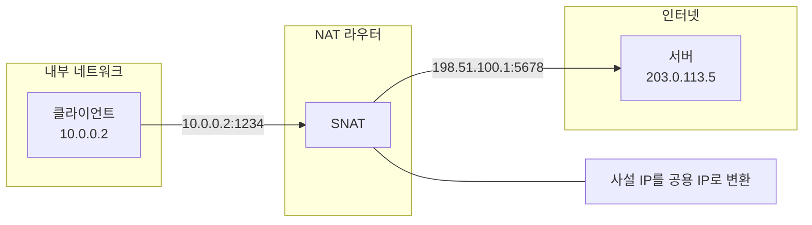

#### 2. 목적지 NAT(DNAT)

목적지 NAT는 패킷의 목적지 IP 주소를 수정합니다. 일반적으로 공용 인터넷에서 사설 네트워크의 서비스에 액세스할 때 사용됩니다.

- **작동 방식**: 공용 IP 주소를 내부 호스트의 사설 IP 주소로 변환
- **사용 사례**: 포트 포워딩, 로드 밸런싱, 인바운드 연결
- **구성**: 특정 포트 또는 포트 범위에 대한 매핑 정의

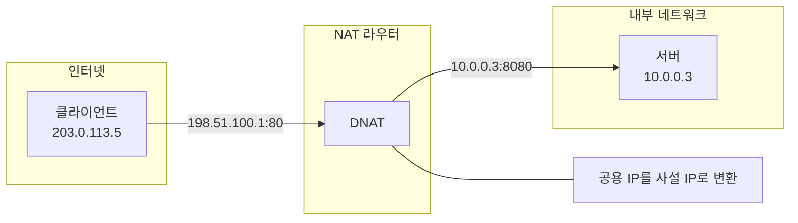

#### 3. 포트 주소 변환(PAT)

PAT는 IP 주소와 포트 번호를 모두 수정합니다. 이를 통해 여러 내부 호스트가 단일 공용 IP 주소를 공유할 수 있습니다.

- **작동 방식**: 내부 호스트의 IP:포트 조합을 단일 공용 IP의 다른 포트로 변환
- **사용 사례**: IP 주소 보존, 다수의 내부 호스트 지원
- **제한 사항**: 사용 가능한 포트 수에 의해 제한됨(약 65,000개)

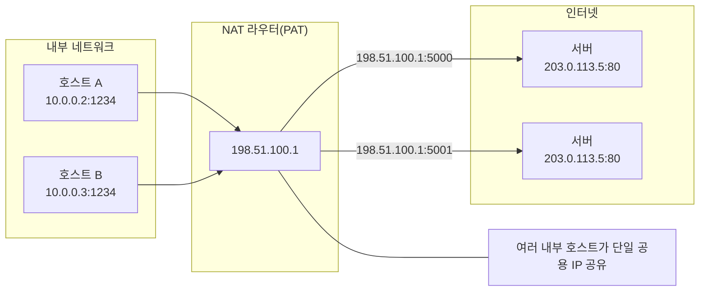

#### 4. 양방향 NAT(Bi-directional NAT)

양방향 NAT는 소스 및 목적지 주소를 모두 수정합니다. 이는 네트워크 주소 공간이 겹치는 두 네트워크 간의 통신을 가능하게 합니다.

- **작동 방식**: 양방향으로 주소 변환
- **사용 사례**: 네트워크 병합, 주소 공간 충돌 해결
- **복잡성**: 구성 및 유지 관리가 더 복잡함

### NAT의 장단점

#### 장점:

- **IP 주소 보존**: 제한된 수의 공용 IP 주소로 다수의 내부 호스트 지원
- **보안 향상**: 내부 네트워크 토폴로지 숨김
- **네트워크 격리**: 겹치는 주소 공간을 가진 네트워크 연결 가능
- **유연한 네트워크 설계**: 내부 네트워크 재구성 없이 ISP 변경 가능

#### 단점:

- **연결 추적 오버헤드**: 상태 테이블 유지 관리에 리소스 필요
- **특정 프로토콜 문제**: 일부 프로토콜은 NAT와 호환되지 않을 수 있음
- **엔드-투-엔드 연결성 손실**: 직접 피어-투-피어 통신 어려움
- **복잡한 문제 해결**: NAT 관련 문제 디버깅이 복잡할 수 있음

### Kubernetes 및 Cilium에서의 NAT

#### Kubernetes에서의 NAT

Kubernetes는 다양한 시나리오에서 NAT를 사용합니다:

1. **클러스터 외부 통신**: 포드가 클러스터 외부와 통신할 때 SNAT 사용
2. **서비스 구현**: 클러스터 IP 서비스는 DNAT를 사용하여 트래픽을 포드로 리디렉션
3. **NodePort 서비스**: 노드 IP:포트에서 포드로의 DNAT
4. **LoadBalancer 서비스**: 외부 로드 밸런서 IP에서 포드로의 DNAT

#### Cilium에서의 NAT

Cilium은 eBPF를 활용하여 효율적인 NAT 구현을 제공합니다:

1. **eBPF 기반 NAT**: 커널 내에서 직접 NAT 수행
2. **고성능 연결 추적**: 최적화된 BPF 맵을 사용한 연결 상태 추적
3. **NAT 정책**: 세분화된 NAT 규칙 정의 가능
4. **마스커레이딩**: 포드에서 클러스터 외부로의 통신을 위한 자동 SNAT

#### Cilium NAT 구성 예제:

```yaml
apiVersion: v1
kind: ConfigMap
metadata:
  name: cilium-config
  namespace: kube-system
data:
  # 클러스터 외부 통신을 위한 마스커레이딩 활성화
  enable-ipv4-masquerade: "true"
  
  # eBPF 기반 마스커레이딩 사용
  enable-bpf-masquerade: "true"
  
  # NAT 맵 크기 설정
  bpf-nat-global-max: "262144"
  
  # 특정 CIDR에 대한 마스커레이딩 제외
  ipv4-masquerade-exclude-cidr: "10.0.0.0/8,172.16.0.0/12,192.168.0.0/16"
```
## 라우팅 프로토콜

라우팅 프로토콜은 네트워크에서 패킷이 소스에서 목적지로 이동하는 최적의 경로를 결정하는 규칙과 절차를 정의합니다. 이러한 프로토콜은 네트워크 토폴로지 변화에 적응하고, 트래픽을 효율적으로 전달하며, 네트워크 장애를 우회하는 데 중요한 역할을 합니다.

### 라우팅 프로토콜의 분류

#### 1. 내부 게이트웨이 프로토콜(IGP)

내부 게이트웨이 프로토콜은 단일 자율 시스템(AS) 내에서 라우팅 정보를 교환하는 데 사용됩니다.

##### 거리 벡터 프로토콜

- **RIP(Routing Information Protocol)**
  - 홉 카운트를 메트릭으로 사용
  - 최대 15홉 제한
  - 간단한 구현, 작은 네트워크에 적합
  - 30초마다 전체 라우팅 테이블 업데이트

- **EIGRP(Enhanced Interior Gateway Routing Protocol)**
  - 대역폭, 지연, 부하, 신뢰성을 고려한 복합 메트릭
  - 부분 업데이트만 전송
  - 빠른 수렴
  - Cisco 독점 프로토콜(이전)

##### 링크 상태 프로토콜

- **OSPF(Open Shortest Path First)**
  - 다익스트라 알고리즘을 사용한 최단 경로 계산
  - 영역 기반 계층 구조
  - 빠른 수렴
  - 대규모 네트워크 지원
  - 링크 상태 광고(LSA)를 통한 토폴로지 정보 교환

- **IS-IS(Intermediate System to Intermediate System)**
  - OSPF와 유사한 링크 상태 프로토콜
  - 대규모 서비스 제공업체 네트워크에서 널리 사용
  - 다중 네트워크 계층 지원
  - 효율적인 라우팅 업데이트

#### 2. 외부 게이트웨이 프로토콜(EGP)

외부 게이트웨이 프로토콜은 서로 다른 자율 시스템 간에 라우팅 정보를 교환하는 데 사용됩니다.

- **BGP(Border Gateway Protocol)**
  - 인터넷의 핵심 라우팅 프로토콜
  - 경로 벡터 프로토콜
  - 정책 기반 라우팅 결정
  - TCP를 통한 안정적인 세션
  - 경로 속성(AS 경로, 로컬 선호도 등)을 통한 경로 선택
  - iBGP(내부 BGP) 및 eBGP(외부 BGP) 변형

### 컨테이너 네트워킹에서의 라우팅 프로토콜

컨테이너 환경에서는 전통적인 라우팅 프로토콜과 함께 컨테이너 특화 라우팅 메커니즘이 사용됩니다.

#### 1. BGP를 활용한 컨테이너 네트워킹

BGP는 컨테이너 네트워킹에서 다음과 같은 이유로 인기를 얻고 있습니다:

- **직접 라우팅**: 오버레이 오버헤드 없이 포드 IP를 직접 라우팅
- **확장성**: 대규모 클러스터 및 멀티 클러스터 환경 지원
- **기존 네트워크 통합**: 데이터 센터 네트워크 인프라와의 통합
- **고가용성**: 다중 경로 및 빠른 장애 조치 지원

#### 2. 컨테이너 네트워크 라우팅 메커니즘

- **호스트 기반 라우팅**: 각 노드가 자체 포드 CIDR에 대한 라우팅 정보 광고
- **중앙 집중식 라우팅**: 컨트롤러가 라우팅 결정을 중앙에서 관리
- **분산 라우팅**: 노드 간 직접 라우팅 정보 교환
- **정책 기반 라우팅**: 트래픽 특성에 따른 라우팅 결정

### Cilium에서의 라우팅

Cilium은 eBPF를 활용하여 효율적인 라우팅을 구현하며, 다양한 라우팅 모드를 지원합니다.

#### 1. 직접 라우팅(Native Routing)

직접 라우팅 모드에서 Cilium은 오버레이 캡슐화 없이 포드 IP를 직접 라우팅합니다.

- **작동 방식**: 각 노드는 자신의 포드 CIDR에 대한 라우팅 정보를 광고
- **장점**: 캡슐화 오버헤드 없음, 최적의 성능
- **요구 사항**: 노드 간 라우팅 가능한 네트워크
- **사용 사례**: 성능이 중요한 워크로드, 단일 서브넷 클러스터

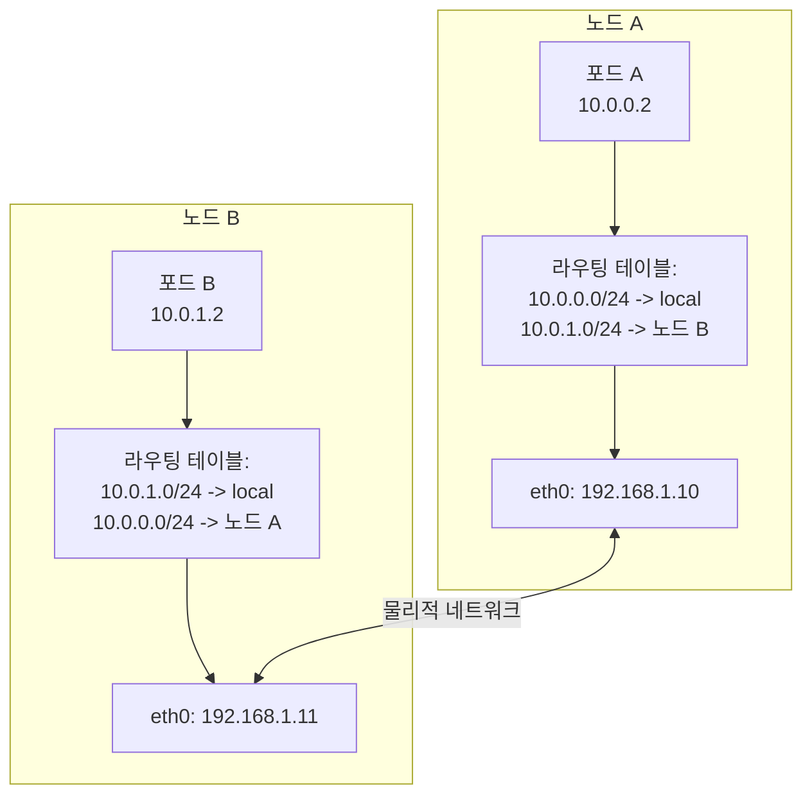

#### 2. BGP 라우팅

Cilium은 BGP 라우팅을 지원하여 포드 IP를 물리적 네트워크 인프라와 통합할 수 있습니다.

- **작동 방식**: Cilium은 BGP 피어링을 통해 포드 CIDR을 광고
- **장점**: 기존 네트워크 인프라와의 통합, 고가용성
- **구성 요소**: BGP 피어링, 경로 필터링, 커뮤니티 속성
- **사용 사례**: 데이터 센터 네트워크와의 통합, 멀티 클러스터 환경

#### 3. 오버레이 라우팅

Cilium은 VXLAN 또는 Geneve와 같은 오버레이 프로토콜을 사용하여 노드 간 포드 트래픽을 라우팅할 수 있습니다.

- **작동 방식**: 포드 패킷을 캡슐화하여 노드 간 전송
- **장점**: 네트워크 인프라 요구 사항 최소화, 유연한 배포
- **사용 사례**: 클라우드 환경, 복잡한 네트워크 토폴로지

#### 4. 하이브리드 라우팅

Cilium은 직접 라우팅과 오버레이 라우팅을 조합한 하이브리드 접근 방식을 지원합니다.

- **작동 방식**: 가능한 경우 직접 라우팅 사용, 그렇지 않은 경우 오버레이 사용
- **장점**: 성능과 유연성의 균형
- **사용 사례**: 혼합 네트워크 환경, 클라우드 및 온프레미스 배포

### Cilium 라우팅 구성 예제

#### 직접 라우팅 구성:

```yaml
apiVersion: v1
kind: ConfigMap
metadata:
  name: cilium-config
  namespace: kube-system
data:
  tunnel: "disabled"
  enable-auto-direct-node-routes: "true"
  ipv4-native-routing-cidr: "10.0.0.0/16"
```

#### BGP 라우팅 구성:

```yaml
apiVersion: v1
kind: ConfigMap
metadata:
  name: cilium-config
  namespace: kube-system
data:
  tunnel: "disabled"
  enable-bgp: "true"
  bgp-announce-pod-cidr: "true"
  bgp-config-path: "/var/lib/cilium/bgp/config.yaml"
```

#### 오버레이 라우팅 구성:

```yaml
apiVersion: v1
kind: ConfigMap
metadata:
  name: cilium-config
  namespace: kube-system
data:
  tunnel: "vxlan"
  enable-ipv4: "true"
  ipv4-range: "10.0.0.0/16"
```
## DNS 및 서비스 디스커버리

DNS(Domain Name System)와 서비스 디스커버리는 현대적인 네트워크 애플리케이션, 특히 동적 컨테이너 환경에서 핵심적인 역할을 합니다. 이러한 메커니즘은 서비스 위치를 추상화하고, 애플리케이션이 네트워크 토폴로지 변화에 적응할 수 있게 해줍니다.

### DNS(Domain Name System)

DNS는 사람이 읽을 수 있는 도메인 이름을 IP 주소로 변환하는 분산 시스템입니다.

#### DNS 작동 원리

1. **계층적 네임스페이스**: 도메인 이름은 점으로 구분된 계층 구조로 구성됨(예: www.example.com)
2. **분산 데이터베이스**: 전 세계에 분산된 DNS 서버 네트워크
3. **반복적 및 재귀적 쿼리**: 클라이언트 요청을 처리하는 두 가지 주요 방법
4. **캐싱**: 성능 향상을 위한 임시 결과 저장

#### DNS 레코드 유형

- **A 레코드**: 도메인 이름을 IPv4 주소에 매핑
- **AAAA 레코드**: 도메인 이름을 IPv6 주소에 매핑
- **CNAME 레코드**: 도메인 이름의 별칭(canonical name)
- **MX 레코드**: 메일 서버 지정
- **SRV 레코드**: 특정 서비스를 제공하는 서버 지정
- **TXT 레코드**: 텍스트 정보 저장(주로 검증 및 정책에 사용)
- **PTR 레코드**: IP 주소를 도메인 이름으로 역방향 매핑(역방향 DNS)

#### DNS 해석 과정

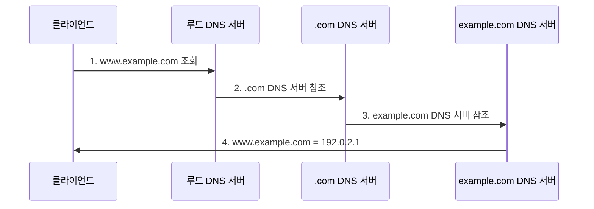

### 컨테이너 환경에서의 서비스 디스커버리

서비스 디스커버리는 네트워크에서 사용 가능한 서비스를 자동으로 감지하고 위치를 파악하는 프로세스입니다. 컨테이너 환경에서는 동적으로 생성되고 제거되는 서비스를 효과적으로 관리하기 위해 특히 중요합니다.

#### 서비스 디스커버리 접근 방식

1. **DNS 기반 서비스 디스커버리**
   - 서비스 등록 시 DNS 레코드 생성
   - 클라이언트는 표준 DNS 조회를 통해 서비스 발견
   - 간단하고 널리 지원됨
   - 예: Kubernetes DNS, CoreDNS

2. **키-값 저장소 기반 서비스 디스커버리**
   - 중앙 집중식 키-값 저장소에 서비스 정보 저장
   - 클라이언트는 저장소를 쿼리하여 서비스 발견
   - 풍부한 메타데이터 지원
   - 예: etcd, Consul, ZooKeeper

3. **API 기반 서비스 디스커버리**
   - 전용 API를 통해 서비스 정보 제공
   - 클라이언트는 API를 호출하여 서비스 발견
   - 복잡한 쿼리 및 필터링 지원
   - 예: Kubernetes API 서버

4. **메시 기반 서비스 디스커버리**
   - 서비스 메시 인프라가 서비스 디스커버리 처리
   - 클라이언트 측 로드 밸런싱 및 라우팅 지원
   - 고급 트래픽 관리 기능
   - 예: Istio, Linkerd

### Kubernetes에서의 DNS 및 서비스 디스커버리

Kubernetes는 클러스터 내 서비스 디스커버리를 위한 내장 메커니즘을 제공합니다.

#### Kubernetes 서비스

Kubernetes 서비스는 포드 집합에 대한 안정적인 엔드포인트를 제공합니다:

- **ClusterIP**: 클러스터 내부에서만 액세스 가능한 가상 IP
- **NodePort**: 모든 노드의 특정 포트를 통해 액세스 가능
- **LoadBalancer**: 외부 로드 밸런서를 통해 액세스 가능
- **ExternalName**: 외부 서비스에 대한 DNS 별칭

#### Kubernetes DNS

Kubernetes는 클러스터 내 DNS 서비스(일반적으로 CoreDNS)를 실행하여 서비스 디스커버리를 지원합니다:

- **서비스 DNS**: `<service-name>.<namespace>.svc.cluster.local`
- **포드 DNS**: `<pod-ip>.<namespace>.pod.cluster.local`
- **헤드리스 서비스**: 서비스 이름이 모든 포드 IP의 DNS 레코드로 확인됨

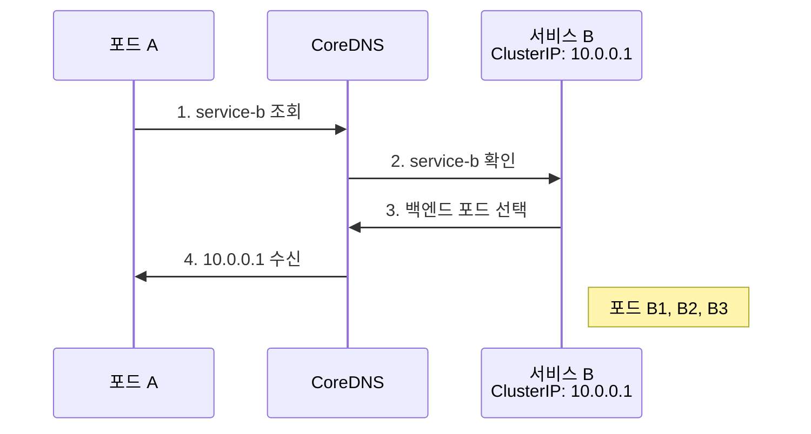

#### Kubernetes 서비스 디스커버리 메커니즘

1. **환경 변수**: 각 포드에는 활성 서비스에 대한 환경 변수가 주입됨
2. **DNS**: 클러스터 DNS를 통한 서비스 이름 확인
3. **API 서버**: Kubernetes API를 직접 쿼리하여 서비스 정보 검색
4. **엔드포인트 객체**: 서비스 백엔드 포드의 IP 및 포트 정보 제공

### Cilium에서의 DNS 및 서비스 디스커버리

Cilium은 Kubernetes의 서비스 디스커버리 메커니즘과 통합되며, 추가적인 기능을 제공합니다.

#### Cilium의 DNS 기반 정책

Cilium은 DNS 이름을 기반으로 네트워크 정책을 정의할 수 있습니다:

- **DNS 이름 기반 필터링**: 특정 도메인 이름에 대한 액세스 제어
- **와일드카드 지원**: `*.example.com`과 같은 패턴 매칭
- **FQDN 정책**: 정규화된 도메인 이름(FQDN)에 기반한 정책

```yaml
apiVersion: "cilium.io/v2"
kind: CiliumNetworkPolicy
metadata:
  name: "dns-policy"
spec:
  endpointSelector:
    matchLabels:
      app: myapp
  egress:
  - toFQDNs:
    - matchName: "api.example.com"
    - matchPattern: "*.api.example.com"
```

#### Cilium의 서비스 디스커버리 향상

Cilium은 Kubernetes 서비스 디스커버리를 향상시키는 여러 기능을 제공합니다:

1. **eBPF 기반 서비스 구현**:
   - kube-proxy 대체
   - 커널 내 직접 서비스 로드 밸런싱
   - 향상된 성능 및 기능

2. **글로벌 서비스**:
   - 여러 클러스터에 걸친 서비스 디스커버리
   - 클러스터 간 로드 밸런싱
   - 통합된 서비스 네임스페이스

3. **서비스 어피니티**:
   - 세션 어피니티 지원
   - 소스 IP 기반 일관된 백엔드 선택
   - 상태 유지 연결 지원

4. **헬스 체크 통합**:
   - 백엔드 상태 모니터링
   - 비정상 백엔드 자동 제거
   - 빠른 장애 감지 및 복구

#### Cilium 서비스 구성 예제:

```yaml
apiVersion: v1
kind: ConfigMap
metadata:
  name: cilium-config
  namespace: kube-system
data:
  # kube-proxy 대체 활성화
  enable-k8s-services: "true"
  kube-proxy-replacement: "strict"
  
  # DNS 정책 지원 활성화
  enable-fqdn-filter: "true"
  
  # 서비스 어피니티 구성
  enable-session-affinity: "true"
  
  # 글로벌 서비스 활성화
  enable-global-services: "true"
```
## 로드 밸런싱 개념

로드 밸런싱은 네트워크 트래픽을 여러 서버나 백엔드 서비스에 분산하여 리소스 활용을 최적화하고, 처리량을 증가시키며, 지연 시간을 줄이고, 고가용성을 보장하는 기술입니다. 컨테이너 환경에서는 동적으로 변화하는 백엔드 인스턴스 간에 트래픽을 효과적으로 분산하는 것이 특히 중요합니다.

### 로드 밸런싱 유형

#### 1. L4(전송 계층) 로드 밸런싱

L4 로드 밸런싱은 IP 주소와 포트 번호와 같은 전송 계층 정보를 기반으로 트래픽을 분산합니다.

- **작동 방식**: TCP/UDP 헤더 정보를 기반으로 라우팅 결정
- **장점**: 빠른 처리, 낮은 오버헤드, 암호화된 트래픽 처리 가능
- **단점**: 애플리케이션 계층 정보에 기반한 고급 라우팅 불가
- **사용 사례**: TCP/UDP 기반 서비스, 고성능 요구 사항

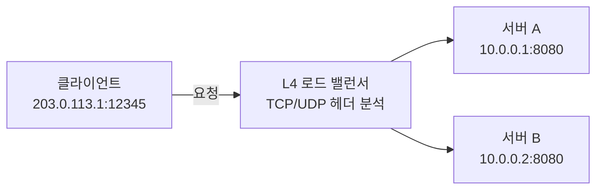

#### 2. L7(애플리케이션 계층) 로드 밸런싱

L7 로드 밸런싱은 HTTP 헤더, URL, 쿠키 등과 같은 애플리케이션 계층 정보를 기반으로 트래픽을 분산합니다.

- **작동 방식**: HTTP/HTTPS 요청 내용을 검사하여 라우팅 결정
- **장점**: 콘텐츠 기반 라우팅, 고급 트래픽 관리, 보안 기능
- **단점**: 더 높은 처리 오버헤드, 암호화된 트래픽의 경우 SSL 종료 필요
- **사용 사례**: 웹 애플리케이션, 마이크로서비스, API 게이트웨이

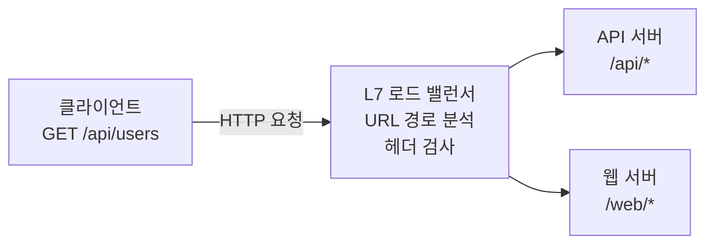

### 로드 밸런싱 알고리즘

로드 밸런싱 알고리즘은 트래픽을 백엔드 서버에 분산하는 방법을 결정합니다.

#### 1. 라운드 로빈(Round Robin)

- **작동 방식**: 순차적으로 각 백엔드 서버에 요청 분배
- **장점**: 간단한 구현, 균등한 분배
- **단점**: 서버 용량 차이나 현재 부하를 고려하지 않음
- **변형**: 가중치 라운드 로빈(서버 용량에 따른 가중치 적용)

#### 2. 최소 연결(Least Connections)

- **작동 방식**: 활성 연결이 가장 적은 서버로 새 요청 전달
- **장점**: 서버 부하 고려, 긴 연결 처리에 효과적
- **단점**: 연결 수가 항상 부하를 정확히 반영하지는 않음
- **변형**: 가중치 최소 연결(서버 용량에 따른 가중치 적용)

#### 3. IP 해시(IP Hash)

- **작동 방식**: 클라이언트 IP 주소를 해싱하여 일관된 백엔드 서버 선택
- **장점**: 세션 지속성 제공, 동일 클라이언트는 동일 서버로 라우팅
- **단점**: 불균등한 분배 가능성, 특정 서버에 과부하 발생 가능
- **변형**: 소스-목적지 IP 해시(소스 및 목적지 IP 모두 고려)

#### 4. 최소 응답 시간(Least Response Time)

- **작동 방식**: 응답 시간이 가장 짧은 서버로 요청 전달
- **장점**: 성능 및 가용성 고려, 지연 시간에 민감한 애플리케이션에 적합
- **단점**: 응답 시간 측정 오버헤드, 네트워크 변동성에 영향 받음
- **변형**: 가중치 응답 시간(서버 용량과 응답 시간 모두 고려)

#### 5. 임의 선택(Random)

- **작동 방식**: 무작위로 백엔드 서버 선택
- **장점**: 간단한 구현, 특별한 상태 추적 불필요
- **단점**: 불균등한 분배 가능성
- **변형**: 가중치 임의 선택(서버 용량에 따른 확률 조정)

### 로드 밸런서 배포 모델

#### 1. 하드웨어 로드 밸런서

- **특징**: 전용 물리적 장비
- **장점**: 고성능, 안정성, 전용 하드웨어 가속
- **단점**: 비용, 확장성 제한, 유연성 부족
- **예**: F5 BIG-IP, Citrix ADC, A10 Networks

#### 2. 소프트웨어 로드 밸런서

- **특징**: 범용 서버에서 실행되는 소프트웨어
- **장점**: 유연성, 비용 효율성, 프로그래밍 가능
- **단점**: 하드웨어 로드 밸런서보다 낮은 성능(일반적으로)
- **예**: NGINX, HAProxy, Envoy

#### 3. 클라우드 로드 밸런서

- **특징**: 클라우드 제공업체가 관리하는 서비스
- **장점**: 관리 오버헤드 감소, 자동 확장, 고가용성
- **단점**: 제공업체 종속성, 제한된 커스터마이징
- **예**: AWS ELB/ALB/NLB, Google Cloud Load Balancing, Azure Load Balancer

#### 4. 컨테이너 네이티브 로드 밸런서

- **특징**: 컨테이너 환경에 최적화된 로드 밸런싱
- **장점**: 컨테이너 오케스트레이션과의 통합, 동적 서비스 디스커버리
- **단점**: 컨테이너 환경에 특화됨
- **예**: Kubernetes 서비스, Istio, Cilium

### Kubernetes에서의 로드 밸런싱

Kubernetes는 여러 수준의 로드 밸런싱을 제공합니다:

#### 1. 서비스 로드 밸런싱

- **ClusterIP**: 클러스터 내부 로드 밸런싱
- **NodePort**: 노드 포트를 통한 외부 액세스
- **LoadBalancer**: 외부 로드 밸런서 프로비저닝
- **ExternalName**: 외부 서비스에 대한 DNS 별칭

#### 2. Ingress 컨트롤러

- L7 로드 밸런싱 및 라우팅 제공
- URL 기반 라우팅, SSL 종료, 인증
- 다양한 구현: NGINX, Traefik, HAProxy, Istio

#### 3. 서비스 메시

- 마이크로서비스 간 고급 트래픽 관리
- 세분화된 라우팅, 트래픽 분할, 장애 주입
- 예: Istio, Linkerd, Consul Connect

### Cilium에서의 로드 밸런싱

Cilium은 eBPF를 활용하여 효율적인 로드 밸런싱을 구현합니다:

#### 1. eBPF 기반 로드 밸런싱

- **kube-proxy 대체**: 커널 내에서 직접 서비스 로드 밸런싱
- **성능 향상**: 네트워크 스택 바이패스로 지연 시간 감소
- **확장성**: 대규모 서비스 및 엔드포인트 지원
- **연결 추적 최적화**: 효율적인 상태 관리

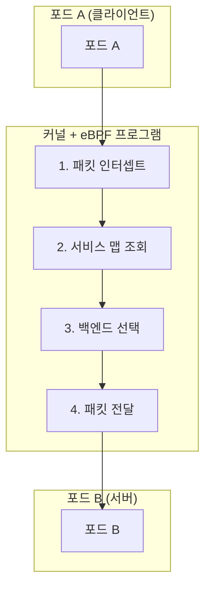

#### 2. 로드 밸런싱 알고리즘

Cilium은 다양한 로드 밸런싱 알고리즘을 지원합니다:

- **라운드 로빈**: 기본 알고리즘, 균등한 분배
- **마스터레이트**: 소스 IP 기반 일관된 백엔드 선택
- **세션 어피니티**: 클라이언트 IP 기반 지속적 연결
- **마스터레이트 타임아웃**: 지정된 시간 후 재조정

#### 3. L7 로드 밸런싱

Cilium은 L7(애플리케이션 계층) 로드 밸런싱도 지원합니다:

- **HTTP 헤더 기반 라우팅**: 특정 헤더 값에 따른 라우팅
- **URL 경로 기반 라우팅**: URL 패턴에 따른 트래픽 분배
- **gRPC 라우팅**: gRPC 메서드 및 메타데이터 기반 라우팅
- **Kafka 라우팅**: Kafka 토픽 및 메시지 키 기반 라우팅

#### 4. 글로벌 서비스 로드 밸런싱

Cilium은 여러 클러스터에 걸친 로드 밸런싱을 지원합니다:

- **클러스터 간 로드 밸런싱**: 여러 클러스터의 백엔드 간 트래픽 분산
- **위치 인식 라우팅**: 지연 시간 및 위치를 고려한 백엔드 선택
- **장애 조치**: 클러스터 장애 시 자동 장애 조치

#### Cilium 로드 밸런싱 구성 예제:

```yaml
apiVersion: v1
kind: ConfigMap
metadata:
  name: cilium-config
  namespace: kube-system
data:
  # kube-proxy 대체 활성화
  kube-proxy-replacement: "strict"
  
  # 로드 밸런싱 알고리즘 구성
  load-balancing-algorithm: "maglev"
  maglev-hash-seed: "Cilium"
  maglev-table-size: "16381"
  
  # 세션 어피니티 구성
  enable-session-affinity: "true"
  
  # L7 로드 밸런싱 활성화
  enable-l7-proxy: "true"
```
## 네트워크 보안 기초

네트워크 보안은 네트워크 인프라, 애플리케이션 및 데이터를 무단 액세스, 오용, 장애 또는 수정으로부터 보호하는 관행입니다. 컨테이너 환경에서는 동적이고 분산된 특성으로 인해 네트워크 보안이 더욱 중요합니다.

### 네트워크 보안의 핵심 개념

#### 1. 심층 방어(Defense in Depth)

심층 방어는 여러 보안 계층을 구현하여 단일 보안 메커니즘의 실패가 전체 시스템 보안 침해로 이어지지 않도록 하는 접근 방식입니다.

- **다중 보안 계층**: 네트워크, 호스트, 애플리케이션, 데이터 수준의 보호
- **중복 제어**: 다양한 보안 메커니즘의 조합
- **실패 격리**: 한 계층의 실패가 다른 계층에 영향을 미치지 않음
- **위협 탐지 및 대응**: 각 계층에서의 모니터링 및 대응

#### 2. 최소 권한 원칙

최소 권한 원칙은 사용자, 프로세스 또는 애플리케이션에 작업 수행에 필요한 최소한의 권한만 부여하는 보안 관행입니다.

- **세분화된 액세스 제어**: 필요한 리소스에만 액세스 제한
- **권한 분리**: 다양한 기능에 대한 권한 분리
- **기본 거부**: 명시적으로 허용되지 않은 모든 액세스 거부
- **정기적인 검토**: 권한의 정기적인 감사 및 조정

#### 3. 네트워크 세분화

네트워크 세분화는 네트워크를 더 작은 세그먼트 또는 영역으로 분할하여 보안을 강화하고 위협의 측면 이동을 제한하는 기술입니다.

- **보안 영역**: 유사한 보안 요구 사항을 가진 시스템 그룹화
- **마이크로세분화**: 워크로드 수준의 세분화된 제어
- **경계 보호**: 영역 간 트래픽 제어 및 모니터링
- **위협 격리**: 침해의 영향 범위 제한

#### 4. 암호화

암호화는 권한이 없는 당사자가 읽을 수 없도록 데이터를 변환하는 프로세스입니다.

- **전송 중 암호화**: 네트워크를 통해 이동하는 데이터 보호(예: TLS/SSL)
- **저장 중 암호화**: 디스크 또는 데이터베이스에 저장된 데이터 보호
- **엔드-투-엔드 암호화**: 전체 통신 경로에 걸쳐 데이터 보호
- **키 관리**: 암호화 키의 안전한 생성, 저장 및 교체

### 컨테이너 네트워킹 보안 위협

컨테이너 환경은 고유한 보안 과제를 제시합니다:

#### 1. 네트워크 기반 공격

- **DDoS(분산 서비스 거부) 공격**: 서비스 가용성을 방해하기 위한 대량의 트래픽
- **포트 스캐닝**: 열린 포트 및 취약점 탐색
- **ARP 스푸핑**: 네트워크 트래픽을 가로채기 위한 주소 확인 프로토콜 조작
- **DNS 포이즈닝**: DNS 조회를 악의적인 대상으로 리디렉션

#### 2. 애플리케이션 계층 공격

- **SQL 인젝션**: 악의적인 SQL 코드 삽입
- **XSS(크로스 사이트 스크립팅)**: 클라이언트 측 스크립트 삽입
- **CSRF(크로스 사이트 요청 위조)**: 인증된 사용자를 통한 악의적인 작업 수행
- **명령 인젝션**: 시스템 명령 실행을 위한 악의적인 입력

#### 3. 컨테이너 특화 위협

- **이미지 취약점**: 취약한 구성 요소가 포함된 컨테이너 이미지
- **권한 에스컬레이션**: 컨테이너에서 호스트로의 권한 상승
- **측면 이동**: 한 컨테이너에서 다른 컨테이너로의 무단 액세스
- **볼륨 마운트 악용**: 민감한 호스트 경로에 대한 액세스

### 네트워크 보안 제어

#### 1. 방화벽

방화벽은 정의된 보안 규칙에 따라 네트워크 트래픽을 필터링하는 네트워크 보안 시스템입니다.

- **패킷 필터링**: IP 주소, 포트, 프로토콜 기반 필터링
- **상태 검사**: 연결 상태를 추적하여 컨텍스트 기반 결정
- **애플리케이션 계층 필터링**: 애플리케이션 프로토콜 이해 및 검사
- **차세대 방화벽(NGFW)**: 고급 위협 탐지 및 방지 기능

#### 2. 침입 탐지 및 방지 시스템(IDS/IPS)

IDS/IPS는 네트워크 트래픽을 모니터링하고 악의적인 활동을 탐지하거나 차단하는 시스템입니다.

- **시그니처 기반 탐지**: 알려진 공격 패턴 매칭
- **이상 탐지**: 정상 동작에서 벗어난 활동 식별
- **행동 모니터링**: 의심스러운 활동 패턴 분석
- **자동 대응**: 탐지된 위협에 대한 실시간 대응

#### 3. 네트워크 정책

네트워크 정책은 네트워크 내에서 허용되는 통신을 정의하는 규칙 집합입니다.

- **인그레스 제어**: 들어오는 트래픽 제한
- **이그레스 제어**: 나가는 트래픽 제한
- **세분화된 정책**: 워크로드 수준의 통신 제어
- **레이블 기반 정책**: 동적 환경에서의 유연한 정책 적용

#### 4. 암호화 프로토콜

암호화 프로토콜은 네트워크를 통한 안전한 통신을 제공합니다.

- **TLS/SSL**: 웹 트래픽 및 API 통신 보호
- **IPsec**: 네트워크 계층 암호화
- **WireGuard**: 현대적이고 효율적인 VPN 프로토콜
- **mTLS(상호 TLS)**: 클라이언트와 서버 모두의 인증

### Kubernetes에서의 네트워크 보안

Kubernetes는 컨테이너화된 애플리케이션의 네트워크 보안을 위한 여러 메커니즘을 제공합니다:

#### 1. 네트워크 정책

Kubernetes 네트워크 정책은 포드 간의 통신을 제어하는 사양입니다.

- **포드 선택기**: 레이블을 기반으로 정책이 적용되는 포드 선택
- **인그레스 규칙**: 들어오는 트래픽 제어
- **이그레스 규칙**: 나가는 트래픽 제어
- **CIDR 기반 규칙**: IP 범위 기반 필터링

```yaml
apiVersion: networking.k8s.io/v1
kind: NetworkPolicy
metadata:
  name: api-allow
spec:
  podSelector:
    matchLabels:
      app: api
  ingress:
  - from:
    - podSelector:
        matchLabels:
          app: frontend
    ports:
    - protocol: TCP
      port: 8080
  egress:
  - to:
    - podSelector:
        matchLabels:
          app: database
    ports:
    - protocol: TCP
      port: 5432
```

#### 2. 서비스 메시 보안

서비스 메시는 마이크로서비스 간의 통신을 관리하고 보호하는 인프라 계층입니다.

- **mTLS**: 서비스 간 암호화된 통신
- **인증 및 권한 부여**: 서비스 ID 확인 및 액세스 제어
- **트래픽 정책**: 세분화된 라우팅 및 액세스 제어
- **관찰 가능성**: 서비스 간 통신에 대한 가시성

#### 3. 보안 컨텍스트

보안 컨텍스트는 포드 및 컨테이너의 권한 및 액세스 제어 설정을 정의합니다.

- **권한 제한**: 루트가 아닌 사용자로 실행
- **기능 제한**: 필요한 Linux 기능만 허용
- **읽기 전용 파일 시스템**: 변경 불가능한 컨테이너 파일 시스템
- **seccomp 및 AppArmor**: 시스템 호출 및 애플리케이션 동작 제한

### Cilium의 네트워크 보안 기능

Cilium은 eBPF를 활용하여 강력한 네트워크 보안 기능을 제공합니다:

#### 1. 신원 기반 보안

Cilium은 IP 주소 대신 워크로드 ID를 기반으로 보안 정책을 적용합니다.

- **레이블 기반 정책**: 동적 환경에서의 일관된 보안
- **서비스 계정 기반 정책**: Kubernetes 서비스 계정을 기반으로 한 액세스 제어
- **DNS 기반 정책**: FQDN을 기반으로 한 이그레스 제어
- **API 인식 보안**: HTTP 메서드 및 경로 기반 필터링

#### 2. 투명한 암호화

Cilium은 애플리케이션 수정 없이 네트워크 트래픽을 암호화할 수 있습니다.

- **IPsec**: 노드 간 트래픽에 대한 네트워크 계층 암호화
- **WireGuard**: 현대적이고 효율적인 암호화 프로토콜
- **투명한 통합**: 애플리케이션 변경 없이 암호화 적용
- **키 교체**: 자동화된 암호화 키 관리

#### 3. 위협 탐지 및 가시성

Cilium은 네트워크 활동에 대한 심층적인 가시성과 위협 탐지 기능을 제공합니다.

- **Hubble**: 네트워크 흐름 모니터링 및 분석
- **흐름 로그**: 포드 간 통신에 대한 상세한 로그
- **이상 탐지**: 비정상적인 네트워크 패턴 식별
- **보안 이벤트 알림**: 정책 위반 및 공격 시도 알림

#### 4. L3-L7 정책 시행

Cilium은 네트워크 계층부터 애플리케이션 계층까지 포괄적인 정책 시행을 제공합니다.

- **L3/L4 정책**: IP 및 포트 기반 필터링
- **L7 HTTP 필터링**: URL, 메서드, 헤더 기반 제어
- **L7 gRPC 필터링**: gRPC 메서드 및 메타데이터 기반 제어
- **L7 Kafka 필터링**: Kafka 토픽 및 메시지 기반 제어

#### Cilium 네트워크 보안 구성 예제:

```yaml
apiVersion: "cilium.io/v2"
kind: CiliumNetworkPolicy
metadata:
  name: "secure-api"
spec:
  endpointSelector:
    matchLabels:
      app: api
  ingress:
  - fromEndpoints:
    - matchLabels:
        app: frontend
    toPorts:
    - ports:
      - port: "8080"
        protocol: TCP
      rules:
        http:
        - method: "GET"
          path: "/api/v1/products"
  egress:
  - toEndpoints:
    - matchLabels:
        app: database
    toPorts:
    - ports:
      - port: "5432"
        protocol: TCP
  - toFQDNs:
    - matchName: "api.external-service.com"
    toPorts:
    - ports:
      - port: "443"
        protocol: TCP
```

### 네트워크 보안 모범 사례

#### 1. 기본 거부 정책

- 명시적으로 허용된 트래픽만 허용하는 기본 거부 정책 구현
- 필요한 통신 경로만 열어두기
- 정기적인 정책 검토 및 불필요한 규칙 제거
- 정책 변경에 대한 감사 추적 유지

#### 2. 심층 방어 접근 방식

- 여러 보안 계층 구현
- 네트워크, 호스트, 애플리케이션 수준의 보호 조합
- 다양한 보안 메커니즘의 중복 제어
- 단일 실패 지점 제거

#### 3. 최소 권한 네트워킹

- 필요한 최소한의 네트워크 액세스만 허용
- 서비스별 세분화된 정책 정의
- 불필요한 포트 및 프로토콜 차단
- 정기적인 액세스 검토 및 조정

#### 4. 지속적인 모니터링 및 감사

- 네트워크 트래픽 및 정책 위반 모니터링
- 이상 징후 및 잠재적 위협 탐지
- 보안 이벤트에 대한 알림 및 대응
- 정기적인 보안 감사 및 취약점 평가
