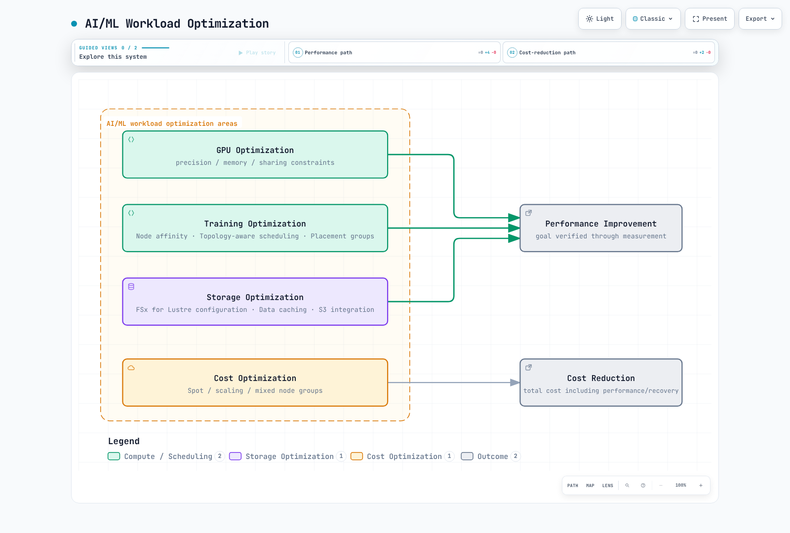
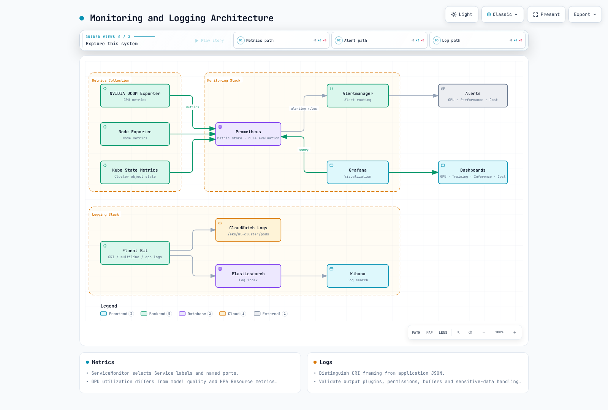

# AI/ML 工作负载

> **审查基线**: GPU Operator 26.7.0 / NVIDIA device plugin 0.20.0 / FSx CSI 1.10.0
> **最后更新**: September 12, 2026

Kubernetes 是运行 AI/ML 工作负载的强大平台。本章将学习如何在 EKS 上运行 AI/ML 工作负载并了解最佳实践。

## AI/ML 工作负载的特征

AI/ML 工作负载与典型应用程序工作负载相比具有不同的特征：


[🔍 查看交互式图表](https://www.atomai.click/kubernetes-docs/archmaps/en-ai-ml-01-ai-ml-workloads-0.html)

1. **资源密集型**：需要大量计算资源，包括 GPU、高性能 CPU 和大容量内存。
2. **数据密集型**：需要快速访问大型数据集。
3. **分布式处理**：大规模模型训练需要跨多个节点进行分布式处理。
4. **工作负载多样性**：包括训练、推理和数据预处理等多种类型的工作负载。

## AI/ML 设计的区别

根据所选框架、镜像、设备和 Kubernetes 版本验证支持情况：

### 1. 大语言模型 (LLM) 部署

大语言模型 (LLM) 是近期 AI 领域最突出的技术之一。在 Kubernetes 上高效部署 LLM 的关键考虑事项：

- **模型分片**：将大型模型分布到多个 GPU 上
- **精度选择**：区分 FP16/BF16 计算与 INT8/INT4 量化，并验证准确性/设备支持
- **推理优化**：使用 vLLM、TensorRT、ONNX Runtime 等提高推理性能
- **扩缩容策略**：通过水平扩缩容提高吞吐量

### 2. AI 编排框架

用于在 Kubernetes 上管理 AI/ML 工作负载的专用编排框架：

- **Kubeflow**：机器学习工作流的综合平台
- **Ray on Kubernetes**：分布式计算框架
- **KServe**：通过 Knative/Standard 及其他路径进行推理管理
- **Seldon Core**：模型服务和监控

### 3. GPU 共享和优化

用于高效利用 GPU 资源的技术：

- **MIG (Multi-Instance GPU)**：对 NVIDIA A100/H100 GPU 进行分区
- **共享方法**：MPS 和 time-slicing 在隔离性/支持方面彼此不同，也不同于 MIG
- **动态分配**：按需动态分配 GPU 资源
- **GPU Operator**：自动化 Kubernetes 中的 GPU 管理

### 4. MLOps 和 GitOps 集成

将 DevOps 原则应用于 AI/ML 生命周期管理：

- **模型版本控制**：与 Git 集成的模型版本管理
- **CI/CD 管道**：自动化模型训练和部署
- **A/B 测试和金丝雀发布**：实验性比较与逐步发布具有不同目标/指标
- **监控和反馈循环**：模型性能监控和再训练

### 5. 向量数据库集成

用于嵌入和语义搜索的向量数据库集成：

- **Pinecone**：托管式向量搜索
- **Milvus**：开源向量数据库
- **Faiss**：Facebook AI 的高效相似性搜索库
- **OpenSearch**：具备向量搜索功能的搜索引擎

批量推理和在线推理具有不同的延迟/吞吐量目标。

## EKS 中的 AI/ML 基础设施配置


[🔍 查看交互式图表](https://www.atomai.click/kubernetes-docs/archmaps/en-ai-ml-01-ai-ml-workloads-1.html)

### 节点类型选择

这些是容量示例，并非完整的当前目录或排名。请检查区域可用性、配额、CPU 架构、GPU 内存和软件兼容性：

1. **GPU 实例**：
   - p4d.24xlarge: 8x NVIDIA A100 GPU, 320GB GPU 内存
   - p3.16xlarge: 8x NVIDIA V100 GPU, 128GB GPU 内存
   - g5.xlarge~g5.48xlarge: NVIDIA A10G GPU，最多 8 个 GPU
   - g4dn.12xlarge: 4 个 T4 GPU；g4dn.16xlarge: 1 个 T4 GPU — 实例大小和 GPU 数量并非单调增加

2. **CPU 优化实例**：
   - c6i.32xlarge: 128 vCPU, 256GB 内存
   - c7g.16xlarge: 64 vCPU (AWS Graviton3), 128GB 内存

3. **内存优化实例**：
   - r6i.32xlarge: 128 vCPU, 1024GB 内存
   - x2gd.16xlarge: 64 vCPU, 1024GB 内存

4. **Inferentia 实例**：
   - inf1.24xlarge: 16 个 AWS Inferentia 芯片, 96 vCPU, 192GB 内存

5. **Trainium 实例**：
   - trn1.32xlarge: 16 个 AWS Trainium 芯片, 128 vCPU, 512GB 内存

### 存储配置

AI/ML 工作负载需要高性能存储：

1. **Amazon EBS**：
   - gp3：默认的通用 SSD 存储
   - io2：高性能 SSD 存储
   - st1：吞吐量优化的 HDD 存储

2. **Amazon EFS**：
   - 当多个节点需要访问共享数据时很有用
   - 性能模式：建议使用 General Purpose；上一代 Max I/O 与 Elastic 吞吐量不兼容
   - 吞吐量模式：Elastic、Provisioned 和 Bursting — 比较工作负载需求、定价和限制

3. **Amazon FSx for Lustre**：
   - 高性能并行文件系统
   - 提供对大型数据集的快速访问
   - 通过 S3 集成简化数据导入和导出

4. **Amazon S3**：
   - 存储大型数据集
   - 存储训练数据和模型构件

### 网络配置

用于分布式训练的网络配置：

1. **集群置放组**：
   - 最小化节点之间的延迟
   - 将节点置于同一可用区内

2. **增强型网络**：
   - Elastic Network Adapter (ENA)
   - ENA Express
   - Elastic Fabric Adapter (EFA)

3. **VPC CNI 配置**：
   - 大规模 Pod 部署的 IP 地址管理
   - 次要 IP 地址范围配置

## AI/ML 工作负载部署


[🔍 查看交互式图表](https://www.atomai.click/kubernetes-docs/archmaps/en-ai-ml-01-ai-ml-workloads-2.html)

<span id="nvidia-gpu-operator-and-device-allocation"></span>

### NVIDIA GPU Operator 和设备分配

EKS AL2023 NVIDIA AMI 已包含驱动程序和 Container Toolkit，因此请通过 GPU Operator 禁用其安装。它们不包含 device plugin/DRA driver，后者需要配置。Bottlerocket NVIDIA AMI 包含 device plugin。避免安装重复的管理方。

此命令在本地**渲染**已审查的 Operator chart。部署前请检查 ClusterPolicy/RBAC 和实际安装要求。

```bash
# AL2023 NVIDIA AMI profile: host driver/toolkit are already installed.
helm repo add nvidia https://helm.ngc.nvidia.com/nvidia
helm repo update nvidia
helm template gpu-operator nvidia/gpu-operator \
  --version v26.7.0 --namespace gpu-operator \
  --set driver.enabled=false --set toolkit.enabled=false \
  > gpu-operator.rendered.yaml
```

NVIDIA 扩展资源是 `nvidia.com/gpu`。整数 limits 表示相等的 request；如果二者都指定，则必须匹配。`0.5` 不是有效的 GPU 分配。此 CUDA 12.8 镜像仅作说明；部署前请验证主机驱动程序/架构兼容性并固定镜像 digest。本次审查未执行 GPU 操作。

```yaml
apiVersion: v1
kind: Pod
metadata:
  name: gpu-allocation-check
spec:
  restartPolicy: Never
  containers:
    - name: check
      image: nvidia/cuda:12.8.1-base-ubuntu22.04
      command: ["nvidia-smi", "-L"]
      resources:
        requests:
          cpu: "100m"
          memory: 128Mi
        limits:
          memory: 256Mi
          nvidia.com/gpu: 1
```

<span id="kubeflow-and-distributed-training"></span>

### Kubeflow 和分布式训练

请使用固定版本的 [26.03.1 安装指南](kubeflow/01-architecture-installation.md) 来配置依赖项、身份和存储，而不是使用 master 分支的一行安装方式。服务项目是 KServe；KFServing 是其历史名称。

分布式执行可使用 [Trainer](kubeflow/05-training-operator.md)、旧版 TFJob/PyTorchJob 或独立的 MPI Operator。根据已安装的 CRD/版本，区分 MPI Operator API 与旧版 Training Operator。Job controller 创建 Pod；MPI launcher 或 torchrun 启动进程。

单个 Pod 无法满足 torchrun --nnodes=2，虚构的 Pod DNS 名称也无法提供 rendezvous。请提供实际的训练代码/镜像、worker 数量、Service/DNS、rank/backend、数据分片以及 checkpoint/timeout/retry 行为。Gang scheduling 需要独立的策略/scheduler 支持。


[🔍 交互式图表](https://www.atomai.click/kubernetes-docs/archmaps/en-ai-ml-01-ai-ml-workloads-3.html)

对于基于 EFA 的 NCCL，路径为 AWS OFI NCCL plugin → libfabric → EFA。MPI 可以启动进程，而不是 NCCL 的强制传输层。请分别验证 ENA/EFA、GPUDirect、安全组、AMI 和库。仅使用 Multus/SR-IOV 或设备 hostPath 挂载并不能在 EKS 上配置 EFA/GPUDirect。

### 模型服务

检查 [KServe](kubeflow/06-kserve.md) Knative/Standard 模式、runtime/model format、URI 访问、协议和 GPU 设备配置。仅请求 GPU 并不会启用 GPU 推理。Triton 还需要模型仓库、backend 配置和 readiness 验证。

TorchServe 宣布不再进行积极维护，也没有计划中的安全修复，因此它不是新部署的受维护默认选择。不要通过未经身份验证的 LoadBalancer 同时公开 inference、management 和 metrics 端口。请配置经过身份验证的 ingress 和适当的内部 management 访问。


[🔍 交互式图表](https://www.atomai.click/kubernetes-docs/archmaps/en-ai-ml-01-ai-ml-workloads-4.html)

## AI/ML 工作负载优化



[🔍 查看交互式图表](https://www.atomai.click/kubernetes-docs/archmaps/en-ai-ml-01-ai-ml-workloads-5.html)

### GPU 共享和内存

Time-slicing 暴露共享 GPU 访问，但不提供内存/故障隔离或按比例的性能保证。MPS 使用独立的 control daemon；已审查的 plugin 文档将支持标为实验性，并排除启用 MIG 的设备。RuntimeClass 加上特权 MPS Pod 并不能配置节点范围的共享。

这是独立的 device-plugin 配置。如果 GPU Operator 管理该 plugin，请改用该管理方的配置路径。

```yaml
# device-plugin-sharing.yaml: NVIDIA device plugin configuration, not a Pod.
version: v1
sharing:
  timeSlicing:
    renameByDefault: true
    failRequestsGreaterThanOne: true
    resources:
      - name: nvidia.com/gpu
        replicas: 2
```

```bash
# Alternative to an operator-owned plugin; do not install a second owner.
helm repo add nvdp https://nvidia.github.io/k8s-device-plugin
helm repo update nvdp
helm template nvdp nvdp/nvidia-device-plugin \
  --version 0.20.0 --namespace nvidia-device-plugin \
  --set config.default=shared \
  --set-file config.map.shared=device-plugin-sharing.yaml \
  > device-plugin.rendered.yaml
```

这会暴露 nvidia.com/gpu.shared；Pod 请求 1 个该资源单位（整数 1）。replicas=2 并不保证获得一半的 GPU 内存。请在真实 GPU 硬件上验证所选节点、分配和争用。

<span id="placement-and-topology"></span>

### 放置和拓扑

区域/region 注释不会控制 Pod 放置。请根据实际节点标签使用 nodeSelector/affinity；anti-affinity/spread selector 也必须匹配 Pod 标签。请将以下实际 AZ 替换进去。同一 AZ 放置、跨节点分散和 gang admission 是不同的约束。

```yaml
apiVersion: v1
kind: Pod
metadata:
  name: placement-check
  labels:
    app: placement-check
spec:
  restartPolicy: Never
  nodeSelector:
    topology.kubernetes.io/zone: us-west-2a
  affinity:
    podAntiAffinity:
      preferredDuringSchedulingIgnoredDuringExecution:
        - weight: 100
          podAffinityTerm:
            labelSelector:
              matchLabels:
                app: placement-check
            topologyKey: kubernetes.io/hostname
  containers:
    - name: check
      image: python:3.12-slim
      command: ["python", "-c", "print('placement check')"]
      resources:
        requests:
          cpu: "100m"
          memory: 64Mi
        limits:
          cpu: "1"
          memory: 128Mi
```

<span id="storage-and-caching"></span>

### 存储和缓存

静态 FSx CSI 供应将**现有文件系统**连接到 PV/PVC。请将文件系统 ID、DNS、挂载名称、容量和 namespace 替换为实际值。Retain 会避免自动删除文件系统；费用仍会持续，直到另行清理。

```yaml
apiVersion: v1
kind: PersistentVolume
metadata:
  name: ml-fsx-existing
spec:
  capacity:
    storage: 1200Gi
  volumeMode: Filesystem
  accessModes: [ReadWriteMany]
  storageClassName: ""
  persistentVolumeReclaimPolicy: Retain
  mountOptions: [flock]
  csi:
    driver: fsx.csi.aws.com
    volumeHandle: fs-0123456789abcdef0
    volumeAttributes:
      dnsname: fs-0123456789abcdef0.fsx.us-west-2.amazonaws.com
      mountname: replace-with-actual-mount-name
---
apiVersion: v1
kind: PersistentVolumeClaim
metadata:
  name: ml-dataset
  namespace: ml-workloads
spec:
  accessModes: [ReadWriteMany]
  storageClassName: ""
  volumeName: ml-fsx-existing
  resources:
    requests:
      storage: 1200Gi
```

动态供应从 StorageClass/PVC 创建文件系统。不要将静态 volumeHandle/DNS 设置放入 StorageClass，也不要混入未定义的 fsx.aws.k8s.io/Lustre 资源。请使用 [driver 的动态示例](https://github.com/kubernetes-sigs/aws-fsx-csi-driver/tree/v1.10.0/examples/kubernetes/dynamic_provisioning)，并检查特定部署类型的吞吐量/备份规则；SCRATCH_2 不能使用仅适用于 persistent 的选项。

仅使用 Alluxio worker DaemonSet 并不是完整的缓存部署。请设计 master/worker 角色、路径、内存、网络、一致性和保留策略。在实际挂载的 PVC 上对独立测试路径进行基准测试；针对未挂载的 /data 执行 FIO 并不能测量 FSx 性能。

## 监控和日志



[🔍 查看交互式图表](https://www.atomai.click/kubernetes-docs/archmaps/en-ai-ml-01-ai-ml-workloads-6.html)

<span id="prometheus-and-grafana"></span>

### Prometheus 和 Grafana

DCGM Exporter 提供 GPU 指标，这与 device-plugin 的可分配容量不同。避免使用另一个 DaemonSet 重复部署由 Operator 管理的 exporter。containerd 设置不需要 Docker-socket 挂载。

ServiceMonitor 选择的是 **Service 标签和命名端口**，而非直接选择 Pod 标签。请将这些值与已安装的 exporter Service 匹配，并确保 Prometheus 也会选择 ServiceMonitor namespace/标签。

```yaml
apiVersion: monitoring.coreos.com/v1
kind: ServiceMonitor
metadata:
  name: gpu-metrics
  namespace: monitoring
spec:
  namespaceSelector:
    matchNames: [gpu-operator]
  selector:
    matchLabels:
      app: nvidia-dcgm-exporter
  endpoints:
    - port: gpu-metrics
      interval: 15s
```

监测 GPU 利用率/内存/错误以及应用程序请求、错误和延迟直方图。准确性需要带有真实标签的评估路径；增加副本不会提高模型质量。将旧的 Grafana graph/flot JSON 替换为当前 time-series/gauge 格式和实际 datasource UID，然后验证导入。

### 日志收集

containerd CRI 日志帧和应用程序 JSON 是不同层次。请配置 Fluent Bit CRI/multiline 解析、路径、位置数据库/轮转以及 Kubernetes 元数据 RBAC。不要复制已移除的 Elasticsearch/OpenSearch 文档类型或未定义的 parser 名称。CloudWatch/output 集成需要镜像 plugin、工作负载 IAM 和网络访问。管理敏感模型负载和 retry-buffer 增长。请参阅[可观测性指南](../observability/README.md)中选择的收集路径。

## 成本优化

<span id="spot-and-node-provisioning"></span>

### Spot 和节点供应

Spot 中断/容量短缺需要外部 checkpoint、retry/idempotency 和恢复时间验证。请使用 [Karpenter 指南](../autoscaling/02-karpenter.md)中的当前 NodePool/EC2NodeClass 配置，包括镜像/AMI 修订版、taint/toleration、limits 和中断处理。混合 CPU/GPU node group 与 EKS Hybrid Nodes 产品不同。

<span id="hpa-and-metrics"></span>

### HPA 和指标

对于由 metrics-server 提供的 CPU/内存，请使用 HPA Resource 指标。nvidia.com/gpu 分配不是 GPU 利用率 Resource 指标。GPU/请求信号需要 exporter 和 custom/external metrics adapter。

此示例使用 adapter 按 namespace/Pod 暴露的 RPS。目标 Deployment 和 adapter 需要单独安装；100 RPS 是一个说明性目标，应通过测量进行校准。应指定一个扩缩容管理方，而不是让多个 HPA/KEDA controller 控制同一副本数。

```yaml
apiVersion: autoscaling/v2
kind: HorizontalPodAutoscaler
metadata:
  name: inference-hpa
  namespace: ml-workloads
spec:
  scaleTargetRef:
    apiVersion: apps/v1
    kind: Deployment
    name: inference-service
  minReplicas: 1
  maxReplicas: 10
  metrics:
    - type: Pods
      pods:
        metric:
          name: inference_requests_per_second
        target:
          type: AverageValue
          averageValue: "100"
```

不正确的聚合/标签分组可能会阻止 adapter 返回按 Pod 划分的值。直方图百分位数或模型准确性并不自动适合作为成比例的 HPA 信号。请同时测量负载/队列/延迟/利用率和实际吞吐量。减少 Pod 后，EC2 费用会持续到节点终止；仅靠一天中的时间并不会降低 On-Demand 费率。

<span id="data-and-model-access"></span>

### 数据和模型访问

Kubernetes RBAC 管理 API 访问；S3/KMS 权限使用工作负载 IAM。请使用对象存储、加密和基于文件的凭证，而非大型模型 Secret 或环境变量中的解密密钥。Secret base64 不是加密。同一个 peer 中的 NetworkPolicy namespaceSelector 和 podSelector 是 AND；单独的条目是 OR。也请允许实际的 DNS/存储/指标方向。

## 验证和参考资料

本章根据官方 GPU Operator/device-plugin Helm 渲染以及 manifest/配置审查进行了修正。未执行实际的 GPU、FSx 创建/挂载、分布式训练、服务或自动扩缩容。请在目标环境中验证组件版本和节点要求。

- [EKS 加速 AMI](https://docs.aws.amazon.com/eks/latest/userguide/ml-eks-optimized-ami.html)
- [Kubernetes GPU 调度](https://kubernetes.io/docs/tasks/manage-gpus/scheduling-gpus/)
- [NVIDIA device plugin 0.20.0](https://github.com/NVIDIA/k8s-device-plugin/tree/v0.20.0)
- [FSx CSI 1.10.0](https://github.com/kubernetes-sigs/aws-fsx-csi-driver/tree/v1.10.0)
- [EFS 性能模式](https://docs.aws.amazon.com/efs/latest/ug/performance.html)
- [Kubernetes HPA](https://kubernetes.io/docs/tasks/run-application/horizontal-pod-autoscale/)

## 测验

要测试您在本章中所学的内容，请尝试[主题测验](../quizzes/ai-ml/03-ai-ml-workloads-quiz.md)。
