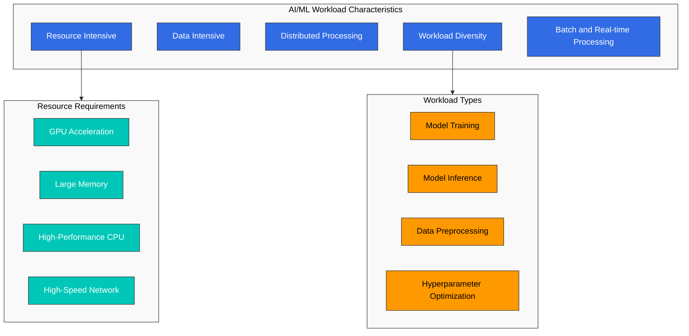
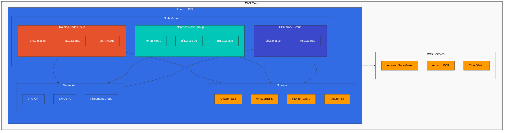
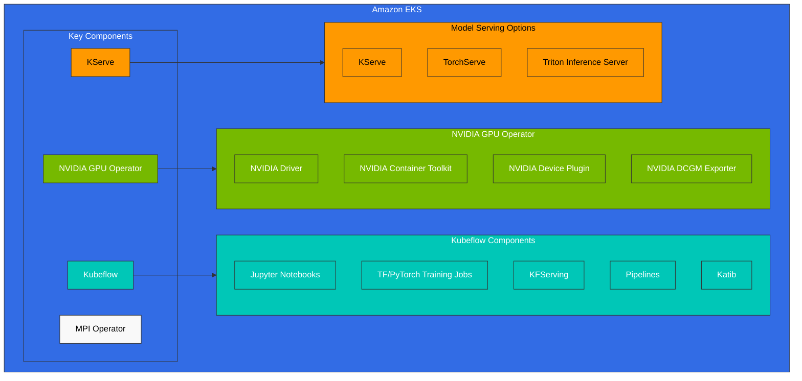
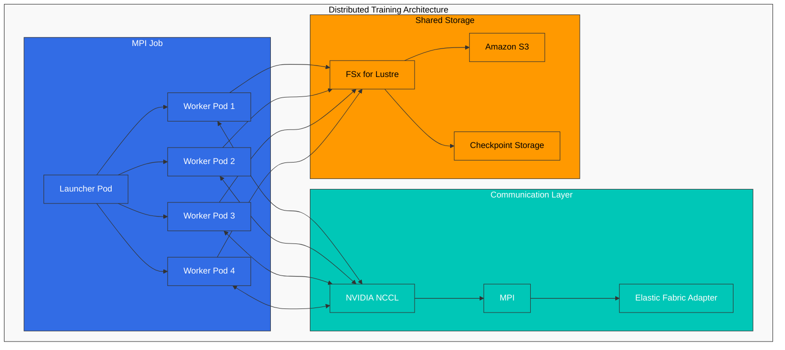
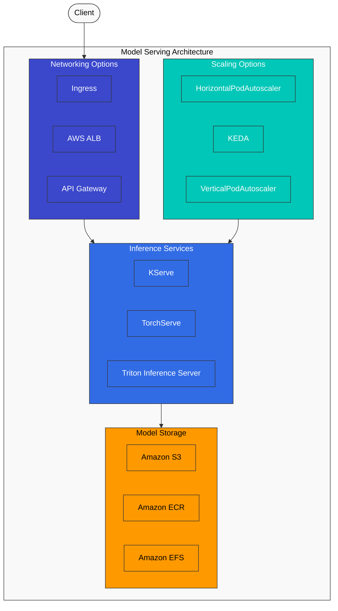
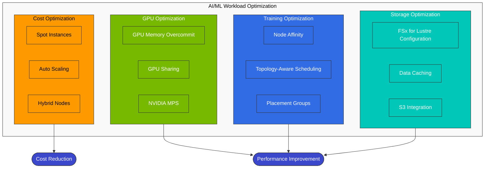
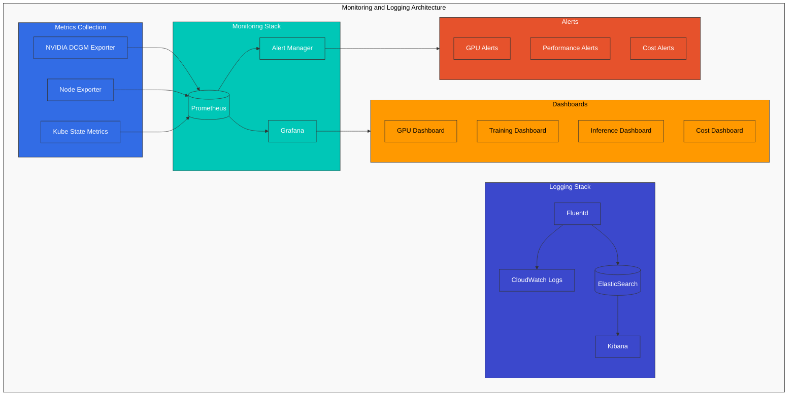

# AI/ML 工作负载

> **支持的版本**: Kubernetes 1.31, 1.32, 1.33
> **最后更新**: February 23, 2026

Kubernetes 是运行 AI/ML 工作负载的强大平台。在本章中，我们将学习如何在 EKS 上运行 AI/ML 工作负载，并探索最佳实践。

## AI/ML 工作负载的特征

与典型应用程序工作负载相比，AI/ML 工作负载具有不同的特征：



1. **资源密集型**：需要大量计算资源，包括 GPU、高性能 CPU 和大容量内存。
2. **数据密集型**：需要快速访问大规模数据集。
3. **分布式处理**：对于大规模模型训练，需要跨多个 Node（节点）进行分布式处理。
4. **工作负载多样性**：包括训练、推理和数据预处理等多种类型的工作负载。

## 最新 AI/ML 趋势 (2025)

在 Kubernetes 上运行 AI/ML 工作负载的最新趋势包括：

### 1. 大语言模型 (LLM) 部署

大语言模型 (LLM) 是近期 AI 领域最突出的技术之一。在 Kubernetes 上高效部署 LLM 的关键考虑事项：

- **模型分片**：将大型模型分布到多个 GPU 上
- **量化**：通过降低模型精度（INT8、FP16 等）来减少内存使用量
- **推理优化**：使用 vLLM、TensorRT、ONNX Runtime 等提升推理性能
- **扩展策略**：通过水平扩展提升吞吐量

### 2. AI 编排框架

用于在 Kubernetes 上管理 AI/ML 工作负载的专用编排框架：

- **Kubeflow**：用于机器学习工作流的综合平台
- **Ray on Kubernetes**：分布式计算框架
- **KServe**：Serverless 推理服务
- **Seldon Core**：模型服务与监控

### 3. GPU 共享与优化

用于高效利用 GPU 资源的技术：

- **MIG (Multi-Instance GPU)**：NVIDIA A100/H100 GPU 的分区
- **Time-Sharing Scheduling**：NVIDIA MPS、GPU 时间切片
- **Dynamic Allocation**：按需动态分配 GPU 资源
- **GPU Operator**：在 Kubernetes 中自动化 GPU 管理

### 4. MLOps 与 GitOps 集成

将 DevOps 原则应用于 AI/ML 生命周期管理：

- **Model Version Control**：与 Git 集成的模型版本管理
- **CI/CD Pipelines**：自动化模型训练与部署
- **A/B Testing**：新模型版本的渐进式发布
- **Monitoring and Feedback Loops**：模型性能监控与重新训练

### 5. 向量数据库集成

用于 embeddings 和语义搜索的向量数据库集成：

- **Pinecone**：托管式向量搜索
- **Milvus**：开源向量数据库
- **Faiss**：Facebook AI 的高效相似度搜索库
- **OpenSearch**：具备向量搜索功能的搜索引擎
5. **批处理和实时处理**：需要同时支持批处理和实时推理。

## EKS 中的 AI/ML 基础设施配置



### Node 类型选择

适用于 AI/ML 工作负载的 EC2 实例类型包括：

1. **GPU 实例**：
   - p4d.24xlarge: 8x NVIDIA A100 GPU，320GB GPU 内存
   - p3.16xlarge: 8x NVIDIA V100 GPU，128GB GPU 内存
   - g5.xlarge~g5.48xlarge: NVIDIA A10G GPU，最多 8 个 GPU
   - g4dn.xlarge~g4dn.16xlarge: NVIDIA T4 GPU，最多 4 个 GPU

2. **CPU 优化型实例**：
   - c6i.32xlarge: 128 vCPU，256GB 内存
   - c7g.16xlarge: 64 vCPU (AWS Graviton3)，128GB 内存

3. **内存优化型实例**：
   - r6i.32xlarge: 128 vCPU，1024GB 内存
   - x2gd.16xlarge: 64 vCPU，1024GB 内存

4. **Inferentia 实例**：
   - inf1.24xlarge: 16 个 AWS Inferentia 芯片，96 vCPU，192GB 内存

5. **Trainium 实例**：
   - trn1.32xlarge: 16 个 AWS Trainium 芯片，128 vCPU，512GB 内存

### 存储配置

AI/ML 工作负载需要高性能存储：

1. **Amazon EBS**：
   - gp3: 默认通用型 SSD 存储
   - io2: 高性能 SSD 存储
   - st1: 吞吐量优化型 HDD 存储

2. **Amazon EFS**：
   - 当多个 Node 需要访问共享数据时非常有用
   - 性能模式：General purpose 或 Max I/O
   - 吞吐量模式：Bursting 或 Provisioned throughput

3. **Amazon FSx for Lustre**：
   - 高性能并行文件系统
   - 提供对大型数据集的快速访问
   - 通过 S3 集成简化数据导入和导出

4. **Amazon S3**：
   - 存储大型数据集
   - 存储训练数据和模型产物

### 网络配置

用于分布式训练的网络配置：

1. **Cluster Placement Groups**：
   - 最大限度降低 Node 之间的延迟
   - 将 Node 放置在同一个可用区内

2. **Enhanced Networking**：
   - Elastic Network Adapter (ENA)
   - ENA Express
   - Elastic Fabric Adapter (EFA)

3. **VPC CNI 配置**：
   - 用于大规模 Pod 部署的 IP 地址管理
   - 辅助 IP 地址范围配置

## AI/ML 工作负载部署



### NVIDIA GPU Operator

NVIDIA GPU Operator 是用于在 Kubernetes 集群中管理 NVIDIA GPU 的工具：

```bash
# Installation using Helm
helm repo add nvidia https://helm.ngc.nvidia.com/nvidia
helm repo update

helm install --wait --generate-name \
  -n gpu-operator --create-namespace \
  nvidia/gpu-operator
```

GPU Operator 会部署以下组件：

1. **NVIDIA Driver**：自动安装 GPU 驱动
2. **NVIDIA Container Toolkit**：使容器能够使用 GPU
3. **NVIDIA Device Plugin**：向 Kubernetes 暴露 GPU 资源
4. **NVIDIA DCGM Exporter**：提供 GPU 监控指标

### Kubeflow

Kubeflow 是用于在 Kubernetes 上运行 ML 工作流的平台：

```bash
# Kubeflow installation
kustomize build https://github.com/kubeflow/manifests/tree/master/example | kubectl apply -f -
```

Kubeflow 提供以下组件：

1. **Jupyter Notebooks**：交互式开发环境
2. **TensorFlow/PyTorch Training Jobs**：运行分布式训练任务
3. **KFServing**：模型服务
4. **Pipelines**：端到端 ML 工作流
5. **Katib**：超参数调优

### 分布式训练

用于分布式训练的 Kubernetes 资源：



1. **MPI Operator**：

```yaml
apiVersion: kubeflow.org/v1
kind: MPIJob
metadata:
  name: tensorflow-benchmarks
spec:
  slotsPerWorker: 8
  cleanPodPolicy: Running
  mpiReplicaSpecs:
    Launcher:
      replicas: 1
      template:
        spec:
          containers:
          - image: mpioperator/tensorflow-benchmarks:latest
            name: tensorflow-benchmarks
            command:
            - mpirun
            - --allow-run-as-root
            - -np
            - "16"
            - -bind-to
            - none
            - -map-by
            - slot
            - -x
            - NCCL_DEBUG=INFO
            - python
            - scripts/tf_cnn_benchmarks/tf_cnn_benchmarks.py
            - --model=resnet50
            - --batch_size=64
            - --variable_update=horovod
    Worker:
      replicas: 2
      template:
        spec:
          containers:
          - image: mpioperator/tensorflow-benchmarks:latest
            name: tensorflow-benchmarks
            resources:
              limits:
                nvidia.com/gpu: 8
```

2. **PyTorch Elastic**：

```yaml
apiVersion: batch/v1
kind: Job
metadata:
  name: pytorch-elastic-job
spec:
  completions: 1
  parallelism: 1
  template:
    spec:
      containers:
      - name: pytorch-elastic
        image: pytorch/pytorch:1.9.0-cuda10.2-cudnn7-runtime
        command:
        - torchrun
        - --nnodes=2
        - --nproc_per_node=8
        - --rdzv_id=job1
        - --rdzv_backend=c10d
        - --rdzv_endpoint=$(MASTER_ADDR):$(MASTER_PORT)
        - train.py
        env:
        - name: MASTER_ADDR
          value: pytorch-elastic-job-0
        - name: MASTER_PORT
          value: "29500"
        resources:
          limits:
            nvidia.com/gpu: 8
      restartPolicy: Never
```

### 模型服务

模型服务的选项：



1. **KServe**：

```yaml
apiVersion: serving.kserve.io/v1beta1
kind: InferenceService
metadata:
  name: bert-model
spec:
  predictor:
    model:
      modelFormat:
        name: pytorch
      storageUri: s3://my-bucket/bert-model
      resources:
        limits:
          nvidia.com/gpu: 1
```

2. **TorchServe**：

```yaml
apiVersion: apps/v1
kind: Deployment
metadata:
  name: torchserve
spec:
  replicas: 3
  selector:
    matchLabels:
      app: torchserve
  template:
    metadata:
      labels:
        app: torchserve
    spec:
      containers:
      - name: torchserve
        image: pytorch/torchserve:latest
        ports:
        - containerPort: 8080
        - containerPort: 8081
        volumeMounts:
        - name: model-store
          mountPath: /home/model-server/model-store
        resources:
          limits:
            nvidia.com/gpu: 1
      volumes:
      - name: model-store
        persistentVolumeClaim:
          claimName: model-store-pvc
---
apiVersion: v1
kind: Service
metadata:
  name: torchserve
spec:
  selector:
    app: torchserve
  ports:
  - port: 8080
    targetPort: 8080
    name: inference
  - port: 8081
    targetPort: 8081
    name: management
  type: LoadBalancer
```

3. **Triton Inference Server**：

```yaml
apiVersion: apps/v1
kind: Deployment
metadata:
  name: triton-server
spec:
  replicas: 3
  selector:
    matchLabels:
      app: triton-server
  template:
    metadata:
      labels:
        app: triton-server
    spec:
      containers:
      - name: triton-server
        image: nvcr.io/nvidia/tritonserver:21.08-py3
        command:
        - tritonserver
        - --model-repository=/models
        ports:
        - containerPort: 8000
        - containerPort: 8001
        - containerPort: 8002
        volumeMounts:
        - name: model-repository
          mountPath: /models
        resources:
          limits:
            nvidia.com/gpu: 1
      volumes:
      - name: model-repository
        persistentVolumeClaim:
          claimName: model-repository-pvc
---
apiVersion: v1
kind: Service
metadata:
  name: triton-server
spec:
  selector:
    app: triton-server
  ports:
  - port: 8000
    targetPort: 8000
    name: http
  - port: 8001
    targetPort: 8001
    name: grpc
  - port: 8002
    targetPort: 8002
    name: metrics
  type: LoadBalancer
```

## AI/ML 工作负载优化



### GPU 内存优化

1. **GPU Memory Overcommit**：

```yaml
apiVersion: node.k8s.io/v1
kind: RuntimeClass
metadata:
  name: nvidia-mps
handler: nvidia-container-runtime
---
apiVersion: v1
kind: Pod
metadata:
  name: cuda-mps
spec:
  runtimeClassName: nvidia-mps
  containers:
  - name: cuda-mps
    image: nvidia/cuda:11.6.0-base-ubuntu20.04
    command: ["nvidia-cuda-mps-control", "-d"]
    securityContext:
      privileged: true
    resources:
      limits:
        nvidia.com/gpu: 1
```

2. **GPU Sharing**：

```yaml
apiVersion: v1
kind: Pod
metadata:
  name: gpu-pod-1
spec:
  containers:
  - name: gpu-container
    image: nvidia/cuda:11.6.0-base-ubuntu20.04
    resources:
      limits:
        nvidia.com/gpu: 0.5
```

### 分布式训练优化

1. **Node Affinity**：

```yaml
apiVersion: v1
kind: Pod
metadata:
  name: gpu-pod
spec:
  affinity:
    nodeAffinity:
      requiredDuringSchedulingIgnoredDuringExecution:
        nodeSelectorTerms:
        - matchExpressions:
          - key: node.kubernetes.io/instance-type
            operator: In
            values:
            - p3.16xlarge
    podAntiAffinity:
      requiredDuringSchedulingIgnoredDuringExecution:
      - labelSelector:
          matchExpressions:
          - key: app
            operator: In
            values:
            - gpu-intensive
        topologyKey: kubernetes.io/hostname
  containers:
  - name: gpu-container
    image: nvidia/cuda:11.6.0-base-ubuntu20.04
    resources:
      limits:
        nvidia.com/gpu: 8
```

2. **Topology-Aware Scheduling**：

```yaml
apiVersion: v1
kind: Pod
metadata:
  name: gpu-pod
  annotations:
    topology.kubernetes.io/region: us-west-2
    topology.kubernetes.io/zone: us-west-2a
spec:
  containers:
  - name: gpu-container
    image: nvidia/cuda:11.6.0-base-ubuntu20.04
    resources:
      limits:
        nvidia.com/gpu: 8
```

### 存储优化

1. **FSx for Lustre Configuration**：

```yaml
apiVersion: fsx.aws.k8s.io/v1beta1
kind: Lustre
metadata:
  name: lustre-fs
spec:
  deploymentType: SCRATCH_2
  storageCapacity: 1200
  subnetIds:
    - subnet-0123456789abcdef0
  securityGroupIds:
    - sg-0123456789abcdef0
  perUnitStorageThroughput: 200
---
apiVersion: storage.k8s.io/v1
kind: StorageClass
metadata:
  name: fsx-lustre
provisioner: fsx.csi.aws.com
parameters:
  fileSystemId: fs-0123456789abcdef0
  mountName: lustre-fs
---
apiVersion: v1
kind: PersistentVolumeClaim
metadata:
  name: lustre-pvc
spec:
  accessModes:
    - ReadWriteMany
  storageClassName: fsx-lustre
  resources:
    requests:
      storage: 1200Gi
```

2. **Data Caching**：

```yaml
apiVersion: apps/v1
kind: DaemonSet
metadata:
  name: alluxio-worker
spec:
  selector:
    matchLabels:
      app: alluxio-worker
  template:
    metadata:
      labels:
        app: alluxio-worker
    spec:
      containers:
      - name: alluxio-worker
        image: alluxio/alluxio:2.7.3
        resources:
          limits:
            memory: 8Gi
        volumeMounts:
        - name: alluxio-domain
          mountPath: /opt/domain
      volumes:
      - name: alluxio-domain
        hostPath:
          path: /mnt/alluxio
          type: DirectoryOrCreate
```

## 监控与日志记录



### Prometheus 和 Grafana

```yaml
apiVersion: monitoring.coreos.com/v1
kind: ServiceMonitor
metadata:
  name: gpu-metrics
  namespace: monitoring
spec:
  selector:
    matchLabels:
      app: dcgm-exporter
  endpoints:
  - port: metrics
    interval: 15s
---
apiVersion: v1
kind: ConfigMap
metadata:
  name: gpu-dashboard
  namespace: monitoring
  labels:
    grafana_dashboard: "1"
data:
  gpu-dashboard.json: |
    {
      "annotations": {
        "list": [
          {
            "builtIn": 1,
            "datasource": "-- Grafana --",
            "enable": true,
            "hide": true,
            "iconColor": "rgba(0, 211, 255, 1)",
            "name": "Annotations & Alerts",
            "type": "dashboard"
          }
        ]
      },
      "editable": true,
      "gnetId": null,
      "graphTooltip": 0,
      "id": 1,
      "links": [],
      "panels": [
        {
          "aliasColors": {},
          "bars": false,
          "dashLength": 10,
          "dashes": false,
          "datasource": null,
          "fieldConfig": {
            "defaults": {
              "custom": {}
            },
            "overrides": []
          },
          "fill": 1,
          "fillGradient": 0,
          "gridPos": {
            "h": 8,
            "w": 12,
            "x": 0,
            "y": 0
          },
          "hiddenSeries": false,
          "id": 2,
          "legend": {
            "avg": false,
            "current": false,
            "max": false,
            "min": false,
            "show": true,
            "total": false,
            "values": false
          },
          "lines": true,
          "linewidth": 1,
          "nullPointMode": "null",
          "options": {
            "alertThreshold": true
          },
          "percentage": false,
          "pluginVersion": "7.2.0",
          "pointradius": 2,
          "points": false,
          "renderer": "flot",
          "seriesOverrides": [],
          "spaceLength": 10,
          "stack": false,
          "steppedLine": false,
          "targets": [
            {
              "expr": "DCGM_FI_DEV_GPU_UTIL",
              "interval": "",
              "legendFormat": "GPU {{gpu}}",
              "refId": "A"
            }
          ],
          "thresholds": [],
          "timeFrom": null,
          "timeRegions": [],
          "timeShift": null,
          "title": "GPU Utilization",
          "tooltip": {
            "shared": true,
            "sort": 0,
            "value_type": "individual"
          },
          "type": "graph",
          "xaxis": {
            "buckets": null,
            "mode": "time",
            "name": null,
            "show": true,
            "values": []
          },
          "yaxes": [
            {
              "format": "percent",
              "label": null,
              "logBase": 1,
              "max": null,
              "min": null,
              "show": true
            },
            {
              "format": "short",
              "label": null,
              "logBase": 1,
              "max": null,
              "min": null,
              "show": true
            }
          ],
          "yaxis": {
            "align": false,
            "alignLevel": null
          }
        }
      ],
      "schemaVersion": 26,
      "style": "dark",
      "tags": [],
      "templating": {
        "list": []
      },
      "time": {
        "from": "now-6h",
        "to": "now"
      },
      "timepicker": {},
      "timezone": "",
      "title": "GPU Dashboard",
      "uid": "gpu-dashboard",
      "version": 1
    }
```

### 日志收集

```yaml
apiVersion: v1
kind: ConfigMap
metadata:
  name: fluentd-config
  namespace: logging
data:
  fluent.conf: |
    <source>
      @type tail
      path /var/log/containers/*.log
      pos_file /var/log/fluentd-containers.log.pos
      tag kubernetes.*
      read_from_head true
      <parse>
        @type json
        time_format %Y-%m-%dT%H:%M:%S.%NZ
      </parse>
    </source>

    <filter kubernetes.**>
      @type kubernetes_metadata
      @id filter_kube_metadata
    </filter>

    <match kubernetes.var.log.containers.**>
      @type cloudwatch_logs
      log_group_name /eks/ml-cluster/pods
      log_stream_name_key $.kubernetes.pod_name
      remove_log_stream_name_key true
      auto_create_stream true
      region us-west-2
    </match>
```

## 成本优化

### 利用 Spot Instances

```yaml
apiVersion: karpenter.sh/v1
kind: NodePool
metadata:
  name: gpu-spot
spec:
  template:
    spec:
      requirements:
      - key: node.kubernetes.io/instance-type
        operator: In
        values:
        - g4dn.xlarge
        - g4dn.2xlarge
        - g4dn.4xlarge
      - key: karpenter.sh/capacity-type
        operator: In
        values:
        - spot
      - key: kubernetes.io/arch
        operator: In
        values:
        - amd64
      nodeClassRef:
        name: gpu-spot-class
  limits:
    nvidia.com/gpu: 10
  disruption:
    consolidationPolicy: WhenEmpty
    consolidateAfter: 30s
---
apiVersion: karpenter.k8s.aws/v1
kind: EC2NodeClass
metadata:
  name: gpu-spot-class
spec:
  subnetSelector:
    karpenter.sh/discovery: gpu-cluster
  securityGroupSelector:
    karpenter.sh/discovery: gpu-cluster
```

### Auto Scaling

```yaml
apiVersion: autoscaling/v2
kind: HorizontalPodAutoscaler
metadata:
  name: inference-service
spec:
  scaleTargetRef:
    apiVersion: apps/v1
    kind: Deployment
    name: inference-service
  minReplicas: 1
  maxReplicas: 10
  metrics:
  - type: Resource
    resource:
      name: cpu
      target:
        type: Utilization
        averageUtilization: 70
  - type: Resource
    resource:
      name: nvidia.com/gpu
      target:
        type: Utilization
        averageUtilization: 80
  - type: Pods
    pods:
      metric:
        name: inference_requests_per_second
      target:
        type: AverageValue
        averageValue: 100
```

### 利用 Hybrid Nodes

```yaml
apiVersion: v1
kind: Pod
metadata:
  name: training-pod
spec:
  nodeSelector:
    node.kubernetes.io/instance-type: p3.16xlarge
  containers:
  - name: training-container
    image: tensorflow/tensorflow:latest-gpu
    resources:
      limits:
        nvidia.com/gpu: 8
---
apiVersion: v1
kind: Pod
metadata:
  name: inference-pod
spec:
  nodeSelector:
    node.kubernetes.io/instance-type: g4dn.xlarge
  containers:
  - name: inference-container
    image: tensorflow/tensorflow:latest-gpu
    resources:
      limits:
        nvidia.com/gpu: 1
```

## 结论

在 EKS 上运行 AI/ML 工作负载可提供强大的基础设施、灵活的扩展能力以及多种优化选项。选择合适的 Node 类型、存储配置和网络设置，利用 Kubeflow 等工具管理 ML 工作流，并优化 GPU 内存和分布式训练非常重要。此外，你还可以通过监控和日志记录跟踪工作负载性能，并通过利用 Spot instances 和 auto scaling 优化成本。

## 参考资料

- [AI on EKS](https://awslabs.github.io/ai-on-eks/) - 用于在 EKS 上部署 AI/ML 工作负载的 AWS 指南和示例

## 测验

要测试你在本章中学到的内容，请尝试完成[主题测验](../quizzes/ai-ml/03-ai-ml-workloads-quiz.md)。
