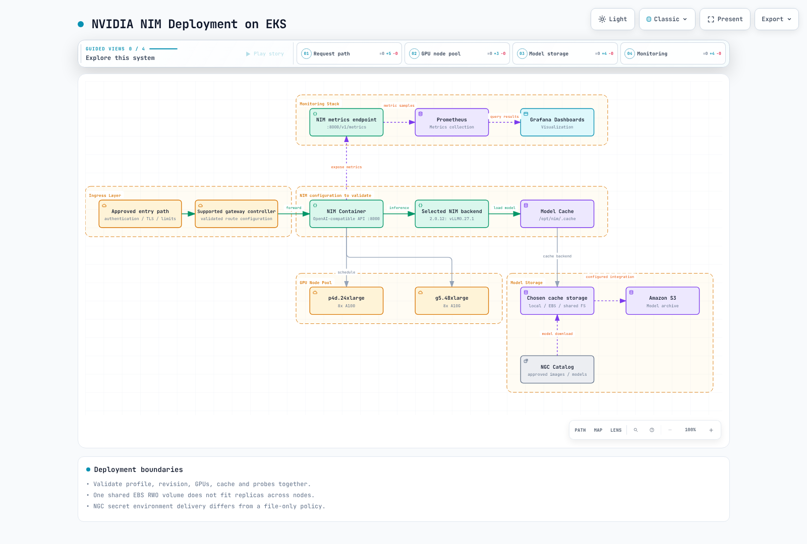
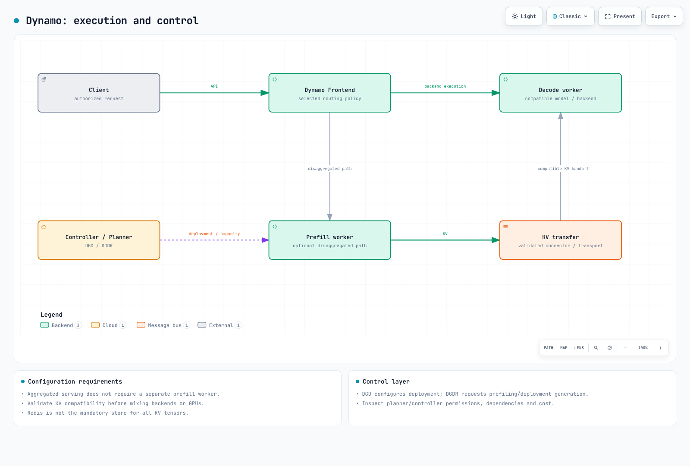

# LLM 服务的推理框架

> **最后更新**: September 12, 2026
> **范围**: 官方发布版本、API、chart 和本地检查；不执行 GPU/Neuron 模型。

分别选择推理引擎、分布式执行层、Kubernetes 控制器和提供商网关。“OpenAI-compatible”并不代表端点、字段、流式传输、工具调用或身份验证完全相同。

## 推理框架概览


[查看交互式图表](https://www.atomai.click/kubernetes-docs/archmaps/en-ai-ml-04-inference-frameworks-0.html)

| 组件 | 检查的基准版本 | 选择检查项 |
| --- | --- | --- |
| NIM LLM/VLM | 2.0.12 文档；独立的 3.0 产品 | 模型、配置文件、硬件、支持协议和后端 |
| Dynamo | 1.4.2 | 聚合式/解耦式服务、KV 传输、规划器和控制器 |
| AIBrix | 0.7.0 | Envoy Gateway、适配器/控制器和自动扩缩容 |
| SGLang | 0.5.19 | 模型、语法后端、设备和测量的工作负载 |
| vLLM / Ray Serve | vLLM 0.29.0 / Ray 2.58.0 / KubeRay 1.7.0 | 分别验证的镜像/模型/控制器组合 |
| TGI | 3.3.7；维护模式 | 现有系统维护和迁移规划 |
| Ollama | 0.34.0 | 本地 API 访问、模型存储和准备工作 |
| LiteLLM | 1.100.1 | 提供商适配、身份验证、回退和成本监测 |
| Neuron | SDK 2.32.0；Helm 1.10.0 | 特定实例的插件/编译器/驱动程序兼容性 |

避免使用通用的“是/否”功能矩阵。Dynamo 规划以及 vLLM/SGLang 解耦、CPU 和 GGUF 支持取决于发布版本、后端和硬件。适配器加载和模型别名不是租户身份验证边界。

## NVIDIA NIM

一并检查容器、模型配置文件、GPU 兼容性和支持协议。NIM Operator 3.1.2 与 LLM/VLM 2.0.12 容器相互独立。检查的 2.0.12 版本文档使用 vLLM 0.27.1；NIM 并不总是使用 TensorRT-LLM。不要将基于 Dynamo 的 3.0 产品视为与 2.0 相同的部署路径。



[查看交互式图表](https://www.atomai.click/kubernetes-docs/archmaps/en-ai-ml-04-inference-frameworks-1.html)

### 部署准备和配置文件

使用 [GPU 指南](01-ai-ml-workloads.md)了解 AMI、驱动程序/工具包和设备插件要求。始终启用驱动程序安装可能会与提供商 AMI 冲突。检查 Karpenter NodePool/EC2NodeClass、实际可调度的 CPU/RAM/GPU 资源和设备数量。八 GPU Pod 无法放入单 GPU 或四 GPU 节点，自定义 AMI 需要显式的 EKS 引导配置。

使用容器配置文件列表中受支持的配置文件 ID/名称设置 NIM_MODEL_PROFILE。不要假定旧版 NIM_MANIFEST_PROFILE 或虚构的 vllm-bf16-tp8 字符串有效。将镜像摘要、模型修订版本、配置文件、驱动程序和实际验证结果一同记录。

NGC 镜像拉取凭证和运行时模型下载凭证承担不同角色。文档中的 NGC_API_KEY 环境变量路径不满足仅允许文件凭证的策略。使用已批准的预备模型路径或经验证的凭证适配器；绝不要将实际密钥放在 shell 参数或源代码中。内部 Service 本身并不对推理请求进行身份验证。

避免在不同节点上的副本之间共享一个 EBS RWO PVC。选择每副本存储/本地缓存或适当的共享文件系统，并测试下载失败、存储性能、启动探针和滚动发布。模型并非总是嵌入镜像中，缓存也不会自动与 FSx/S3 同步。

### 指标和 GenAI-Perf

检查的 NIM 2.0.12 文档公开 `/v1/metrics`，其中透传原生 vLLM 后端指标。检查实际名称、单位和标签，而不是复制虚构的 nim_* 名称或 `/metrics`。Grafana ConfigMap 需要相应的数据源/sidecar 和 Prometheus 抓取。不要在毫秒面板中原样显示秒数。

为 TTFT、ITL、端到端延迟、成功吞吐量和排队定义特定于工作负载的 SLO。在 token 间隔均匀的情况下，近似值为 `TTFT + (output tokens - 1) × ITL`，另加独立的网络/后处理开销。500ms 或 GPU80% 等目标不是通用的健康标准。

GenAI-Perf 0.0.16 使用 profile 子命令以及 synthetic-input-tokens-mean/output-tokens-mean 选项。以下命令会对预备的内部端点施加负载，本次审计未执行该命令。请先准备 perf_analyzer、tokenizer 和其他分发依赖项。

```bash
genai-perf profile   --endpoint-type chat   --service-kind openai   --url http://127.0.0.1:8000   --model approved-model-alias   --concurrency 2   --synthetic-input-tokens-mean 128   --output-tokens-mean 64   --num-prompts 20   --profile-export-file profile_export.json
```

不要假定 analyze 仅处理 JSON 后处理：扫描设置可能会执行额外的性能分析。保留原始请求、失败记录、tokenizer、预热、并发度以及模型/后端修订版本。GPU 利用率需要实际的指标收集。

## NVIDIA Dynamo

官方 1.4.2 Kubernetes 路径使用 Dynamo platform、DynamoGraphDeployment (DGD) 和 DynamoGraphDeploymentRequest (DGDR)。它并非由先前虚构的 dynamo-router/dynamo-worker 镜像、KV_CACHE_HOST 和任意路由器 YAML 实现。DGDR 请求性能分析和 DGD 创建；它不是只读检查。



[查看交互式图表](https://www.atomai.click/kubernetes-docs/archmaps/en-ai-ml-04-inference-frameworks-2.html)

### 实际的 DGD 结构

此**经过 schema 检查的配置**基于官方 1.4.2 v1beta1 的聚合式示例，为公共模型调整了有界执行设置。它需要平台/控制器、命名空间、GPU、模型访问和网络。部署前请固定模型/镜像摘要并验证实际硬件；本次审计未执行模型。

```yaml
apiVersion: nvidia.com/v1beta1
kind: DynamoGraphDeployment
metadata:
  name: vllm-agg
  namespace: dynamo-system
spec:
  components:
  - name: Frontend
    podTemplate:
      spec:
        containers:
        - image: nvcr.io/nvidia/ai-dynamo/vllm-runtime:1.4.2
          name: main
          resources:
            requests:
              cpu: 250m
              memory: 512Mi
            limits:
              cpu: '1'
              memory: 2Gi
    replicas: 1
    type: frontend
  - name: VllmDecodeWorker
    podTemplate:
      spec:
        containers:
        - args:
          - --model
          - Qwen/Qwen3-0.6B
          - --max-model-len
          - '2048'
          - --max-num-seqs
          - '8'
          command:
          - python3
          - -m
          - dynamo.vllm
          image: nvcr.io/nvidia/ai-dynamo/vllm-runtime:1.4.2
          name: main
          resources:
            limits:
              nvidia.com/gpu: '1'
              cpu: '4'
              memory: 12Gi
            requests:
              ephemeral-storage: 2Gi
              cpu: '2'
              memory: 4Gi
          workingDir: /workspace/examples/backends/vllm
    replicas: 1
    type: worker
```

解耦要求兼容的 prefill/decode 角色、KV 连接器/格式、模型修订版本和网络。后端或 GPU 的任意混合并不会自动互操作。KV 感知路由平衡本地性和负载；固定的 0.7/0.3 公式并非通用实现。Redis 并不是所有 Dynamo 部署的强制性 KV tensor 存储。

检查的平台 chart 的集群范围 operator 通过 crd-apply init container 管理 CRD。upgradeCRD=false 选择外部管理；它并不会消除 CRD 要求。检查规划器、发现机制、NATS/etcd、Grove/KAI 和其他特定于发布版本的设置。Chart 渲染不会验证 CRD 应用、授权或实时发现。

## AIBrix

Version0.7.0 使用 Envoy Gateway、gateway plugin、controller-manager 和 metadata services。KubeRay 对于基于 Ray 的功能是可选的。先前的独立 aibrix-registry server 和 /v1/lora/register API 不是检查的0.7.0 安装路径。

### ModelAdapter 和 PodAutoscaler

实际的 ModelAdapter 字段包括 baseModel、podSelector 和 artifactURL。省略 replicas 会在所有匹配的 Pod 上加载适配器；1 选择一个 Pod；其他值会被拒绝。将示例 bucket/revision 和基础模型替换为批准的值。分别验证控制器下载权限、运行时兼容性、适配器容量/生命周期和租户授权。

```yaml
apiVersion: model.aibrix.ai/v1alpha1
kind: ModelAdapter
metadata:
  name: support-lora
  namespace: ai-inference
spec:
  baseModel: approved-base-model
  podSelector:
    matchLabels:
      model.aibrix.ai/name: approved-base-model
  artifactURL: s3://REPLACE_WITH_APPROVED_BUCKET/adapters/support/REVISION/
  replicas: 1
```

PodAutoscaler0.7.0 使用 metricsSources 和 HPA/KPA/APA 策略，而不是任意 autoscaler ConfigMap。此 CPU 示例需要 metrics-server、工作负载 CPU requests 和控制器。它不验证基于 GPU 队列的扩缩容。避免同一目标存在相互竞争的扩缩容器所有者。

```yaml
apiVersion: autoscaling.aibrix.ai/v1alpha1
kind: PodAutoscaler
metadata:
  name: model-cpu
  namespace: ai-inference
spec:
  scaleTargetRef:
    apiVersion: apps/v1
    kind: Deployment
    name: prepared-model-server
  minReplicas: 1
  maxReplicas: 3
  scalingStrategy: HPA
  metricsSources:
  - metricSourceType: resource
    targetMetric: cpu
    targetValue: '70'
```

## Ray Serve 集成

使用经过审计的 [Ray Serve](ray/04-ray-serve.md) 和 [KubeRay](ray/02-kuberay-operator.md) API。KubeRay 协调、Ray worker 自动扩缩容和 Serve 副本自动扩缩容承担不同角色。不要将 RayCluster 作为普通 Deployment HPA 扩缩容目标，也不要猜测生成的集群/Serve Service 名称和 selector。

代码和依赖项必须到达执行 worker，而不仅仅是 head。user_config 不会自动更改构造函数参数；请实现适当的 reconfigure 路径。兼容的 API 需要实际的 chat template、流式传输、取消、finish reasons、usage 和错误。拼接角色字符串并忽略 stream=true 是不够的。已移除旧的 Ray2.9/operator1.1 示例以及无条件的 trust_remote_code=True。

## SGLang

Version0.5.19 的 RadixAttention 会为公共前缀复用 KV；任意重叠的中间子字符串不能作为可互换的缓存前缀。模型、KV 格式和访问策略必须匹配。当前语法后端包括默认的 XGrammar 和备选的 Outlines/Llguidance。“由于压缩 FSM，始终快 10 倍”并不是普遍结论。


[查看交互式图表](https://www.atomai.click/kubernetes-docs/archmaps/en-ai-ml-04-inference-frameworks-3.html)

### 结构化请求示例

此客户端假定已批准的网关支持 SGLang 的 json_schema 请求形状。它检查正常完成和输出形状。验证使用具有合成响应和失败案例的本地 HTTP fixture；它不测量模型准确性。JSON 有效性并不能证明事实正确性或工具授权。

```python
from pathlib import Path
import json
from urllib.request import Request, urlopen

# Existing private gateway and a scoped credential mounted as a file.
base_url = "https://inference.example.internal/v1"
credential = Path("/run/secrets/inference/token").read_text().strip()
payload = {
    "model": "approved-model-alias",
    "messages": [{"role": "user", "content": "Return the city Seoul and country Korea."}],
    "temperature": 0,
    "max_tokens": 128,
    "response_format": {
        "type": "json_schema",
        "json_schema": {
            "name": "location",
            "schema": {
                "type": "object",
                "properties": {"city": {"type": "string"}, "country": {"type": "string"}},
                "required": ["city", "country"],
                "additionalProperties": False,
            },
        },
    },
}
request = Request(
    base_url + "/chat/completions",
    data=json.dumps(payload).encode(),
    headers={"Content-Type": "application/json", "Authorization": "Bearer " + credential},
    method="POST",
)
with urlopen(request, timeout=30) as response:
    result = json.load(response)
choice = result["choices"][0]
if choice["finish_reason"] != "stop":
    raise RuntimeError("Generation did not complete normally")
location = json.loads(choice["message"]["content"])
if set(location) != {"city", "country"} or not all(isinstance(v, str) for v in location.values()):
    raise ValueError("Unexpected output shape")
print(location)
```

SGLang 的 function/system/user/assistant/gen DSL API 在此版本中仍然存在。声明函数并不会运行推理：请连接已准备的 RuntimeEndpoint/backend 并执行它。安装时验证 Torch、FlashInfer 和硬件兼容性。本次审计未安装完整 GPU SDK 或将 DSL 连接到模型。

## Hugging Face TGI

官方仓库声明为**维护模式**；检查的最新版本为3.3.7（December19,2025）。它接受小型修复、文档和维护，并建议新引擎采用 vLLM/SGLang 等。它不再是新项目的通用默认推荐。迁移现有部署时，请验证模型、模板、流式传输、指标和 SLO 兼容性。

添加 --quantize=awq 不会自动从普通模型生成 AWQ 权重。请使用以该格式准备的受支持模型。浮动 tag、缺少受限模型凭证和过短的 liveness deadline 会损害可复现性和成功启动。

## Ollama

在0.34.0 中，拉取模型和提供服务是独立操作。带有 sleep10 的 postStart hook 不保证就绪。预置批准的模型，或使用带有 health checks、有界重试和失败处理的独立准备流程。记录可变模型 tag 和存储权限。

本地 Ollama API 不提供用户身份验证；在暴露前应在其前方设置授权和路径控制。仅绑定到 Pod localhost 的服务器无法通过其 Service 访问。OLLAMA_HOST 改变监听范围，而不是身份验证。分别限定模型管理和推理端点的范围。

Modelfile 定义基础模型、系统提示和生成设置；它不会训练模型或构建 Kubernetes 镜像。请按模型大小、设备和后端验证 CPU/GPU 支持，而不是假定支持大规模多租户。

## LiteLLM

请使用 [Agentic AI 指南](03-agentic-ai-platform.md)中经过审计的1.100.1 Router 配置。提供商网关与推理引擎属于不同层。将别名命名为 gpt-4-equivalent 并不能证明质量等效。回退必须首先满足允许的提供商和数据外发策略。

将实际配置文件接入 proxy 命令，并按需配置客户端凭证、DB/Redis 和 callbacks。虚拟密钥或 ClusterIP 不是身份验证；drop_params=true 可能会移除有意义的请求条件。区分请求、成功、失败、重试和缓存成本。

## AWS Neuron 和 Inferentia2

区分芯片、NeuronCores 和主机 RAM/HBM。每个 Inferentia2 芯片都有两个 NeuronCore-v2 核心和32GiB HBM。

| 实例 | 芯片 | NeuronCores-v2 | 设备 HBM (GiB) | 主机 RAM (GiB) | vCPU |
| --- | --- | --- | --- | --- | --- |
| inf2.xlarge | 1 | 2 | 32 | 16 | 4 |
| inf2.8xlarge | 1 | 2 | 32 | 128 | 32 |
| inf2.24xlarge | 6 | 12 | 192 | 384 | 96 |
| inf2.48xlarge | 12 | 24 | 384 | 768 | 192 |

### 设备分配和插件路径

aws.amazon.com/neuron 分配**整个设备**；aws.amazon.com/neuroncore 分配**核心**。先前的 inf2.xlarge 示例在只有一个设备、四个 vCPU 和16Gi RAM 的节点上请求 neuron:2、八个 CPU 和24Gi RAM；它无法调度。NEURON_RT_VISIBLE_CORES 选择运行时范围，并不创建未分配的设备。针对所选发布版本，检查其与 NUM_CORES 和逻辑核心策略的优先级。

检查的官方 Helm1.10.0 包含 device-plugin、scheduler 和 node-problem-detector 选项。安装前检查渲染的 DaemonSet、hostPath、RBAC 和恢复行为。此命令仅生成本地输出。

```bash
helm template neuron-audit oci://public.ecr.aws/neuron/neuron-helm-chart   --version 1.10.0 --namespace kube-system --include-crds > neuron-rendered.yaml
```

SDK2.32.0 记录了两条独立路径：**适用于 Inf2/Trn1/Trn2、搭配 vLLM0.16 的 NxD Inference plugin0.5.x**，以及**仅适用于 Trn2/Trn3 的新 vLLM Neuron beta0.24.0.1.1.0**。详细的 NxD 指南仍显示0.5.0/SDK2.29，而概览显示0.5.3；请验证所选插件 tag、DLC 和精确依赖项。在 Inf2 上安装最新 beta，或向旧版2.18 DLC 添加 pip install，都不是兼容性验证。

Neuron 编译需要受支持的模型实现、形状/批次/序列 bucket、TP、编译器/SDK、硬件和缓存构件。对具有未使用 tp_degree dictionary 的通用 Transformers 模型调用 torch_neuronx.trace，并不能实现分布式 causal-LM 服务。编译器输出文件和 tokenizer 目录是不同的构件。本次审计未执行编译器或 Neuron 实例。

## 性能、成本和运维

已移除无来源的 A100 排名表和固定40–70% 节省声明。比较相同的模型/修订版本/精度、输入/输出 token 分布、并发度、成功率、SLO、预热和有日期的价格。每天一百万个请求持续30天是3000万个请求：假设的每月48,000 美元即每1,000个请求1.60 美元。先前的0.80 数值在算术上是错误的；此示例不是当前 AWS 定价。

更换引擎时，对实际 payload、模板、流式传输、usage 和失败行为进行回归测试。区分分片模型组和独立副本，并检查 StatefulSet 有序就绪是否阻塞相互等待的 worker。单独使用 StatefulSet 不会配置 TP/PP、rendezvous 或 NCCL。

使用模型大小、重启/下载并发度、授权和成本比较本地缓存、EBS、EFS 和 FSx。EFS 并非总是比 FSx 慢，历史 gp3 限制也不是当前保证。参阅 [GPU/存储示例](01-ai-ml-workloads.md)。

运维前，在实际环境中测试身份验证、TLS、管理路径、探针、放置、配额、单一扩缩容器所有者、指标单位、固定模型修订版本、缓存生命周期、发布/回滚和中断恢复。

## 验证范围

检查涵盖官方 chart/CRD、实际 SDK/CLI 源码、本地 HTTP 请求/失败 fixture、Markdown 和图像。未执行 GPU/Neuron 模型、吞吐量/成本测量、云部署或模型下载。Schema/chart 成功不代表准入、授权、模型兼容性或生产就绪。

## 参考资料

- [NIM 2.0 发布说明](https://docs.nvidia.com/nim/large-language-models/2.0.12/about-nim-llm/release-notes.html)
- [NIM 配置](https://docs.nvidia.com/nim/large-language-models/2.0.12/reference/environment-variables.html)
- [NIM 可观测性](https://docs.nvidia.com/nim/large-language-models/2.0.12/reference/logging-and-observability.html)
- [Dynamo 1.4.2](https://github.com/ai-dynamo/dynamo/tree/v1.4.2)
- [AIBrix 0.7.0](https://github.com/aibrix/aibrix/tree/v0.7.0)
- [SGLang 0.5.19 结构化输出](https://github.com/sgl-project/sglang/blob/v0.5.19/docs/docs/advanced_features/structured_outputs.mdx)
- [TGI 维护通知](https://github.com/huggingface/text-generation-inference)
- [Ollama 0.34.0](https://github.com/ollama/ollama/tree/v0.34.0)
- [GenAI-Perf 0.0.16](https://pypi.org/project/genai-perf/0.0.16/)
- [Neuron SDK 2.32.0 推理路径](https://github.com/aws-neuron/aws-neuron-sdk/blob/v2.32.0/libraries/vllm-neuron/neuron-inference-overview.rst)
- [Inf2 架构](https://awsdocs-neuron.readthedocs-hosted.com/en/latest/about-neuron/arch/neuron-hardware/inf2-arch.html)
- [Neuron Kubernetes 组件](https://github.com/aws-neuron/neuron-helm-charts)

## 测验

[推理框架测验](../quizzes/ai-ml/04-inference-frameworks-quiz.md)
