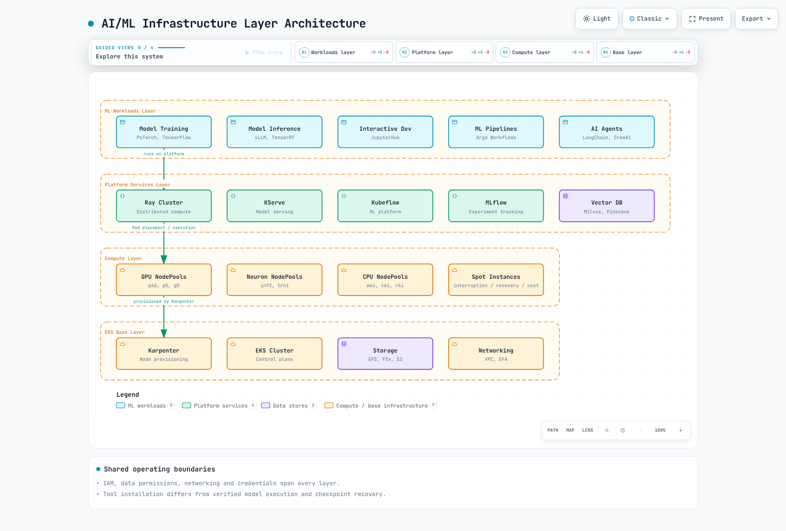
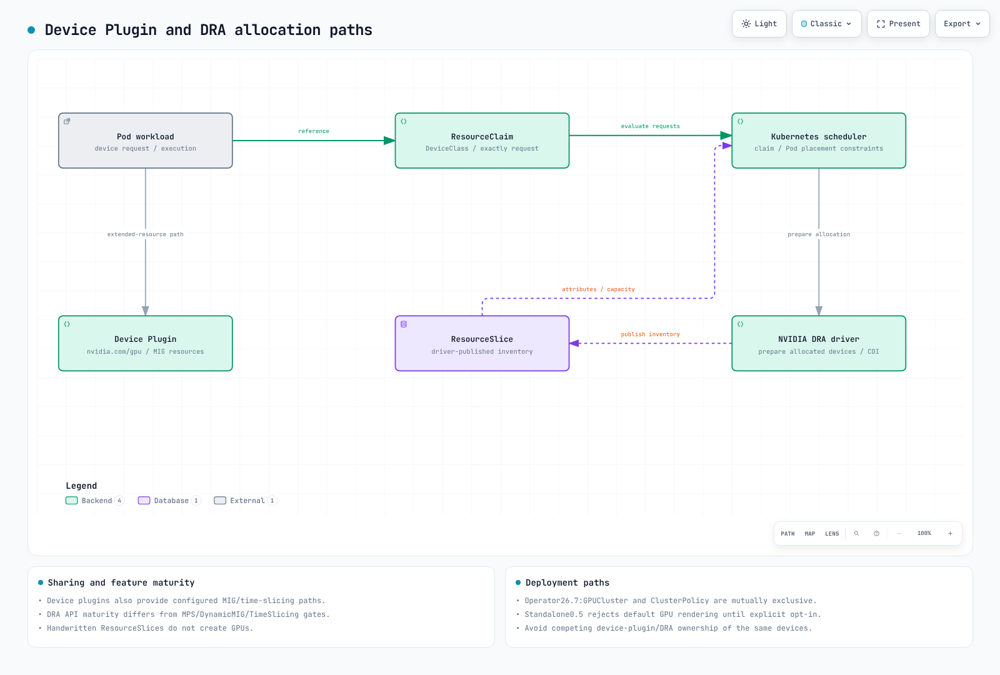

# EKS 上的 AI 基础设施

> **最后更新**: September12,2026
> **基线版本**: GPU Operator26.7.0 / NVIDIA DRA0.5.0 / Argo Workflows4.1.3 / JupyterHub chart4.4.2 / Mountpoint CSI2.8.0

AI 基础设施结合了笔记本、流水线、分布式运行时、设备/节点、存储/网络和授权。仅列出工具或成功的 Helm release 并不能建立平台安全性、可用性或模型执行能力。

## 层级与职责



[查看交互式图表](https://www.atomai.click/kubernetes-docs/archmaps/en-ai-ml-06-ai-infrastructure-0.html)

工作负载负责模型/数据/执行代码；平台负责工作流、运行时和注册表；计算负责真实设备、Pod 和节点容量。IAM、网络和存储身份跨越这些层级。启用 Spot 的 NodePool 既不保证容量，也不保证恢复能力或节省成本。

## JARK 技术栈

JARK 结合 JupyterHub、Argo Workflows、Ray 和 Karpenter。它是一种集成模式，而不是一个自动连接的产品。应明确连接笔记本授权、工作流提交、Ray 作业、Kubernetes 调度和节点预置。


[查看交互式图表](https://www.atomai.click/kubernetes-docs/archmaps/en-ai-ml-06-ai-infrastructure-1.html)

### JupyterHub 身份验证和笔记本配置文件

Chart4.4.2 声明 appVersion5.5.2，这与最新检查的 PyPI Hub6.0.0 不同。本地 API 检查使用 Hub6.0.0/OAuthenticator17.4.0/KubeSpawner7.1.0；请在运行中的 chart 镜像内验证实际的软件包组合。

Cognito 是一种 OIDC provider 选项。匹配回调 URL、token/userInfo 端点、scope 和稳定的用户名 claim，并配置明确的允许策略。MFA/企业联邦必须在 provider 中配置；GenericOAuthenticator 不会自动启用它们。

此 Hub 配置假定已有一个 Secret volume 挂载到 /run/secrets/oidc。不要将真实 secret 放入 ConfigMap、源代码和环境变量中。将此 Python 文件接入 Hub 的实际配置路径，并为你的环境替换 URI/已批准的 sub 值。

```python
from pathlib import Path

c.JupyterHub.authenticator_class = "oauthenticator.generic.GenericOAuthenticator"
c.GenericOAuthenticator.client_id = "prepared-client-id"
c.GenericOAuthenticator.client_secret = Path("/run/secrets/oidc/client-secret").read_text().strip()
c.GenericOAuthenticator.oauth_callback_url = "https://jupyter.example.com/hub/oauth_callback"
c.GenericOAuthenticator.authorize_url = "https://prepared-domain.auth.us-west-2.amazoncognito.com/oauth2/authorize"
c.GenericOAuthenticator.token_url = "https://prepared-domain.auth.us-west-2.amazoncognito.com/oauth2/token"
c.GenericOAuthenticator.userdata_url = "https://prepared-domain.auth.us-west-2.amazoncognito.com/oauth2/userInfo"
c.GenericOAuthenticator.scope = ["openid", "profile", "email"]
c.GenericOAuthenticator.username_claim = "sub"
c.GenericOAuthenticator.allow_all = False
c.GenericOAuthenticator.allow_existing_users = False
c.GenericOAuthenticator.allowed_users = {"replace-with-approved-cognito-sub"}
```

该示例设置 allow_all=False、显式 allowed_users 和 allow_existing_users=False。本地检查允许一个已批准的身份，并拒绝未批准/先前的用户。未执行实际的 OAuth 登录/token 交换。

请区分笔记本 CPU/RAM 保证与限制，并匹配实际的 GPU 镜像、标签、toleration 和 driver。不要假设旧版 jupyter/*:gpu tag 提供 CUDA。PVC 必须与消费它的 Pod 共享 namespace；jupyterhub Pod 不能仅通过名称引用 ml-platform PVC。检查每用户 access point、UID/GID、quota 和共享模型的写入权限。EFS storage_capacity 不是物理容量限制。

### Argo Workflows 数据流

先前的工作流引用了缺失的 template、artifact 和 script。这个**小型数据流 fixture**有六个阶段。它通过环境变量和 JSON 传递参数，而不是将值注入 Python 源代码。它在两个系数之间选择；它不是真实的图像分类训练、Ray cluster 或外部 registry 流水线。

Argo4.1.3 离线 lint 和全部六个 Python script body 均已在本地验证。请为 prepared-workflow-runner 准备最小权限，并在运行前分别配置镜像 digest、quota 和 artifact 存储。

```yaml
apiVersion: argoproj.io/v1alpha1
kind: Workflow
metadata:
  generateName: toy-dataflow-
  namespace: argo
spec:
  entrypoint: pipeline
  serviceAccountName: prepared-workflow-runner
  parallelism: 1
  activeDeadlineSeconds: 600
  arguments:
    parameters:
    - name: data
      value: '[[1,2],[2,4],[3,6],[4,8]]'
  templates:
  - name: pipeline
    dag:
      tasks:
      - name: validate
        template: validate
        arguments:
          parameters:
          - name: data
            value: '{{workflow.parameters.data}}'
      - name: prepare
        template: prepare
        arguments:
          parameters:
          - name: data
            value: '{{tasks.validate.outputs.result}}'
        dependencies:
        - validate
      - name: tune
        template: tune
        arguments:
          parameters:
          - name: data
            value: '{{tasks.prepare.outputs.result}}'
        dependencies:
        - prepare
      - name: train
        template: train
        arguments:
          parameters:
          - name: scale
            value: '{{tasks.tune.outputs.result}}'
        dependencies:
        - tune
      - name: evaluate
        template: evaluate
        arguments:
          parameters:
          - name: model
            value: '{{tasks.train.outputs.result}}'
          - name: data
            value: '{{tasks.prepare.outputs.result}}'
        dependencies:
        - train
      - name: register
        template: register
        arguments:
          parameters:
          - name: model
            value: '{{tasks.train.outputs.result}}'
        dependencies:
        - evaluate
        when: '{{tasks.evaluate.outputs.result}} == 0'
  - name: validate
    inputs:
      parameters:
      - name: data
    script:
      image: python:3.12.14-slim-trixie
      command:
      - python
      env:
      - name: DATA
        value: '{{inputs.parameters.data}}'
      resources:
        requests:
          cpu: 100m
          memory: 64Mi
        limits:
          cpu: 500m
          memory: 128Mi
      source: 'import json, os

        rows = json.loads(os.environ["DATA"])

        assert rows and all(len(row) == 2 for row in rows)

        assert all(isinstance(v, (int, float)) for row in rows for v in row)

        print(json.dumps(rows))

        '
  - name: prepare
    inputs:
      parameters:
      - name: data
    script:
      image: python:3.12.14-slim-trixie
      command:
      - python
      env:
      - name: DATA
        value: '{{inputs.parameters.data}}'
      resources:
        requests:
          cpu: 100m
          memory: 64Mi
        limits:
          cpu: 500m
          memory: 128Mi
      source: 'import json, os

        rows = json.loads(os.environ["DATA"])

        print(json.dumps({"train": rows[:2], "test": rows[2:]}))

        '
  - name: tune
    inputs:
      parameters:
      - name: data
    script:
      image: python:3.12.14-slim-trixie
      command:
      - python
      env:
      - name: DATA
        value: '{{inputs.parameters.data}}'
      resources:
        requests:
          cpu: 100m
          memory: 64Mi
        limits:
          cpu: 500m
          memory: 128Mi
      source: 'import json, os

        data = json.loads(os.environ["DATA"])

        candidates = [1.0, 2.0]

        loss = lambda scale: sum((scale*x-y)**2 for x,y in data["train"]) / len(data["train"])

        print(min(candidates, key=loss))

        '
  - name: train
    inputs:
      parameters:
      - name: scale
    script:
      image: python:3.12.14-slim-trixie
      command:
      - python
      env:
      - name: SCALE
        value: '{{inputs.parameters.scale}}'
      resources:
        requests:
          cpu: 100m
          memory: 64Mi
        limits:
          cpu: 500m
          memory: 128Mi
      source: 'import json, os

        print(json.dumps({"scale": float(os.environ["SCALE"]), "fixture": True}))

        '
  - name: evaluate
    inputs:
      parameters:
      - name: model
      - name: data
    script:
      image: python:3.12.14-slim-trixie
      command:
      - python
      env:
      - name: MODEL
        value: '{{inputs.parameters.model}}'
      - name: DATA
        value: '{{inputs.parameters.data}}'
      resources:
        requests:
          cpu: 100m
          memory: 64Mi
        limits:
          cpu: 500m
          memory: 128Mi
      source: 'import json, os

        model = json.loads(os.environ["MODEL"])

        held_out = json.loads(os.environ["DATA"])["test"]

        print(sum((model["scale"]*x-y)**2 for x,y in held_out) / len(held_out))

        '
  - name: register
    inputs:
      parameters:
      - name: model
    script:
      image: python:3.12.14-slim-trixie
      command:
      - python
      env:
      - name: MODEL
        value: '{{inputs.parameters.model}}'
      resources:
        requests:
          cpu: 100m
          memory: 64Mi
        limits:
          cpu: 500m
          memory: 128Mi
      source: 'import json, os

        model = json.loads(os.environ["MODEL"])

        print(json.dumps({"candidate": model, "note": "fixture output only; no registry write"}))

        '
```

fixture MSE0 来自四个合成样本，而不是真实的模型质量测量。生产工作流需要训练/测试分离、数据/模型修订、失败/重试/幂等性规则以及实际的 artifact 交接。artifactRepositoryRef 不会安装 boto3，也不会授予应用程序下载权限。

### Ray 和 Karpenter

使用 [Ray 指南](ray/README.md)中经过审计的 Ray2.58/KubeRay1.7 路径。GCS 表示 Global Control Service；调度会与 raylet 交互。如果 head 声明 CPU，则可能运行工作负载。避免在 CPU/GPU/Neuron worker 间使用未经验证的 Ray/Python 组合；Neuron 镜像还需要 Ray 和兼容的 framework。

Ray autoscaling 表达 worker-Pod 需求，Kubernetes scheduler 放置 Pod，Karpenter 提供受支持的节点容量。Ray worker 不会直接调用 Karpenter API。使内存/GPU 产品标签与真实节点匹配；不要用80GB 标签选择40GB p4d A100。

不要在 AL2023 NVIDIA AMI 上重复安装 driver，也不要覆盖整个 containerd 配置。Karpenter limit 不是绝对的准入/成本上限，consolidation 也不会直接使用 DCGM20% 利用率阈值。检查 request、调度可行性、价格和中断约束。

## DRA API 和支持边界

DRA 通过 DeviceClass、ResourceSlice 和 ResourceClaim/Template 表示设备属性、请求和分配。driver 发布 slice；scheduler/driver component 分配并准备 claim。手写的 ResourceSlice 不会创建真实 GPU。Kubernetes API 成熟度与 NVIDIA-driver 功能成熟度是相互独立的。



[查看交互式图表](https://www.atomai.click/kubernetes-docs/archmaps/en-ai-ml-06-ai-infrastructure-2.html)

### 当前 Claim 示例

检查的 Kubernetes1.36.2 resource.k8s.io/v1 schema 使用 requests.exactly。NVIDIA driver0.5 前提条件将 GPU 分配(1.34.2+)与 ComputeDomains(1.32+)区分开来。验证 EKS 实际提供的 API 以及 patch/platform 版本。“1.31+ 上的全部 DRA 功能”并不准确。

此**schema 示例**定义了一个 GPU claim 和一个清单命令 Pod。请分别准备 ml-workloads namespace、gpu.nvidia.com DeviceClass、driver/CDI、节点和权限。本审计未执行 GPU。

```yaml
apiVersion: resource.k8s.io/v1
kind: ResourceClaimTemplate
metadata:
  namespace: ml-workloads
  name: single-gpu
spec:
  spec:
    devices:
      requests:
      - name: gpu
        exactly:
          deviceClassName: gpu.nvidia.com
          count: 1
---
apiVersion: v1
kind: Pod
metadata:
  name: gpu-inventory-demo
  namespace: ml-workloads
spec:
  restartPolicy: Never
  automountServiceAccountToken: false
  containers:
  - name: inspect
    image: ubuntu:24.04
    command:
    - nvidia-smi
    - -L
    resources:
      claims:
      - name: gpu
      requests:
        cpu: 100m
        memory: 64Mi
      limits:
        cpu: 500m
        memory: 128Mi
  resourceClaims:
  - name: gpu
    resourceClaimTemplateName: single-gpu
  tolerations:
  - key: nvidia.com/gpu
    operator: Exists
    effect: NoSchedule
```

CEL 必须使用实际发布的类型化属性/domain 结构。之前的 device.topology.node==device.topology.node 既不表达同节点放置，也不匹配 API。matchAttribute 需要实际的限定属性。常规的单 Pod GPU claim 不会自动跨 NVL72 rack 分配72个 GPU。

### NVIDIA0.5 和 GPU Operator26.7

0.5 README 仍将 GPU 分配描述为 experimental/default-disabled，这与 installation/chart 和 Operator26.7 文档冲突。实际的 standalone chart 默认设置 resources.gpus.enabled=true，但为避免 device-plugin 冲突，若没有显式 opt-in，便会**拒绝渲染**。不要将默认安装描述为静默禁用 GPU 后成功。

Operator26.7 managed path 使用名为 gpu-cluster 的 GPUCluster singleton，它与 ClusterPolicy 互斥。其 preinstalled-driver path 设置 clusterPolicy.deployCR=false、gpuCluster.deployCR=true 和 driver.enabled=false。GPUCluster 不会替代所有 driver/toolkit 准备工作；请提供 driver/CDI 前提条件。不要安装重复的 standalone DRA release。本地渲染模拟了一个被提供服务的 DeviceClass API；它并未启用真实集群功能。

区分 full-GPU/existing-MIG 和 ComputeDomain 支持与 alpha DynamicMIG、MPS 和 TimeSlicingSettings。检查的0.5 feature-gate code 将后三者声明为 false/Alpha。一些文档中的 GA 标签也与源代码中的 Beta 标签不同；请将确切 release 的支持矩阵、代码和配置一并记录。单独使用 GPU Operator25.3 并不能建立对所有功能的支持。

device plugin 也支持 existing MIG、time-slicing 和 experimental MPS 路径；GPU 共享并非 DRA 独有。3g.20gb 指的是一个 instance profile，而不是三个20GB instance。MIG/独占分配不会自动隔离 host、driver、privilege 或所有 side channel；MPS/time-slicing 不是安全边界。

### 多节点 NVLink 和 ComputeDomains

GB200 是 Grace Blackwell，而不是 Grace Hopper。ComputeDomains 在 Pod/节点之间协调 MNNVL/IMEX 资源。请区分 rack、EC2 instance、Kubernetes node 和 Pod，并验证实际的 clique/fabric/device/driver 支持。虚构的 nvswitchEnabled/graceHopperMode 字段或 scheduling gate 不会配置拓扑。没有 controller 来移除的 scheduling gate 会让 Pod 保持等待。

## Agent 平台和 MCP

请在 [Agentic AI 指南](03-agentic-ai-platform.md)中使用当前的 Kagent/LangGraph/Langfuse/Milvus API。GitLab 是可选的源代码/CI 平台；privileged runner 和 public ingress 并非基线要求。分离 job identity、网络、secret 和 image-build 权限，并验证 provider credential 的交付。

MCP 定义了如工具列出/调用等 protocol operation；它不是标准的 Kubernetes auto-discovery controller 或 gateway distribution。之前的 ghcr.io/anthropics/mcp-gateway:latest 镜像和 mcp.anthropic.com/tool label/config 属于未经验证的实现，已被移除。请选择实际的 server/gateway release，并验证 transport、authentication、authorization、timeout 和 tool input schema。一个 URL 环境变量并未实现这些 operation。

为 Milvus 请求 GPU 资源不会启用 GPU indexing。匹配 embedding dimension/model revision、index parameter、删除/更新生命周期和 tenant filter。不要将 Langfuse2.x Deployment 作为当前4.x 平台安装；请检查 backend dependency、file credential、instrumentation API 和敏感数据保留。

## 存储和网络

验证 EFS access-point IAM/UID/GID、目录权限和同 namespace PVC 消费。IAM mount option 本身不会配置 controller/mount-identity credential。

使用受支持的 FSx CSI parameter 和容量单位。不要为 PERSISTENT_2 复制虚构的 s3ImportPath/s3ExportPath 设置或无效的10Ti 容量。在[存储指南](01-ai-ml-workloads.md)中区分现有/静态与新预置的 filesystem、DRA 和 backup compatibility。

Mountpoint CSI2.8.0 支持现有 S3 bucket 的**静态 PV**。StorageClass/PVC-only 动态 bucket 示例已移除。Mountpoint 并非完全 POSIX；检查 rename、random-write、locking 和 checkpoint 行为。2.8 support table 移除了 AL2/Ubuntu22.04，并指示安装应使用 EKS add-on 或官方 chart，而非 repository branch。

不要将 interface count 乘以已经是汇总值的 instance bandwidth。之前的 p4d“4×400Gbps”和 trn1n“16×1600Gbps”数据不正确。有关同 AZ 放置、真实 interface、driver/libfabric/NCCL、device/Pod 分配和 security group，请使用[训练网络指南](05-model-training.md)。RAID0 和 efa-enabled tag 不会启用 EFA。

Subnet 只是隔离的一部分。通过实际 SG/IAM resource 配置工作负载 ingress/egress 和 EFA self-reference 要求。存储在 ConfigMap 中的 Terraform 样式 YAML 不会应用 network rule。避免默认允许来自整个 VPC CIDR 的访问。

## GPU 可观测性和告警

DCGM Exporter4.6.0-4.8.3 将 XID_ERRORS 定义为最后一个错误**代码 gauge**。increase(XID_ERRORS) 不是错误计数，并且可能将31→13的代码变化误读为重置。请观察当前代码，或单独启用 XID_ERRORS_TOTAL counter。并非每个 XID 都表示硬件故障。

FB_USED/FB_FREE 是 MiB gauge；下方比率的范围为0–1。高保留 VRAM 不一定是 OOM：应一并检查分配失败、工作负载行为、模型缓存和可用内存。固定的85C/20% 阈值并非通用的故障/回收标准。在对 PCIe throughput 或 NVLink bandwidth gauge 应用 rate() 前，请检查实际 metric type/unit。

这些规则假设每个 Prometheus 对应一个 cluster。对于合并的 cluster，请在聚合/join 中包含 cluster label。检查实际的 node/UUID/MIG label 以及 kube-state-metrics resource-label normalization。

```yaml
groups:
- name: gpu-observations
  rules:
  - record: gpu:framebuffer_used_ratio
    expr: DCGM_FI_DEV_FB_USED / (DCGM_FI_DEV_FB_USED + DCGM_FI_DEV_FB_FREE)
  - alert: GPUReportedXIDCode
    expr: DCGM_FI_DEV_XID_ERRORS > 0
    for: 1m
    labels:
      severity: warning
    annotations:
      summary: "Inspect the reported XID code and workload context"
  - record: namespace:pending_gpu_requesting_pods:count
    expr: |
      count by (namespace) (
        max by (namespace, pod) (kube_pod_status_phase{phase="Pending"} == 1)
        and on (namespace, pod)
        max by (namespace, pod) (kube_pod_container_resource_requests{resource="nvidia_com_gpu"} > 0)
      )
```

pending rule 统计请求 GPU 的等待 Pod；它并不能证明 GPU 短缺导致了等待。多个请求 GPU 的 container 按每个 Pod 仅计一次。检查 event、PVC、affinity、taint、quota、claim 和 image pull。不要假定每个告警上都存在 node label。

为 DCGM、Ray 和 Karpenter 配置实际的 Prometheus rule selection 以及正确的 Service/port scraping。Grafana file provisioning 不同于 HTTP dashboard wrapper；单独的 label 不会连接 datasource。Neuron monitor output 和 exporter endpoint 需要单独准备。

## 验证范围

已审查所有原始指南/quiz 说明文字和58个独特 code block。检查涵盖 DRA/Pod schema、官方 Helm、OAuthenticator allow policy、Argo 离线 lint/script body 和 Prometheus fixture。未执行实际的 OAuth/cluster/GPU/DRA allocation、model、S3 mount 或 MCP server；未创建 cloud resource 或付费调用。

## 参考资料

- [GPU Operator26.7 DRA 安装](https://docs.nvidia.com/datacenter/cloud-native/gpu-operator/26.7/dra-intro-install.html)
- [NVIDIA DRA0.5 源代码](https://github.com/kubernetes-sigs/dra-driver-nvidia-gpu/tree/v0.5.0)
- [DRA0.5 前提条件](https://github.com/kubernetes-sigs/dra-driver-nvidia-gpu/blob/v0.5.0/site/content/docs/prerequisites.md)
- [DRA0.5 feature gate](https://github.com/kubernetes-sigs/dra-driver-nvidia-gpu/blob/v0.5.0/pkg/featuregates/featuregates.go)
- [OAuthenticator17.4](https://github.com/jupyterhub/oauthenticator/tree/17.4.0)
- [JupyterHub chart4.4.2](https://github.com/jupyterhub/zero-to-jupyterhub-k8s/releases/tag/4.4.2)
- [Argo Workflows4.1.3](https://github.com/argoproj/argo-workflows/tree/v4.1.3)
- [Mountpoint CSI2.8.0](https://github.com/awslabs/mountpoint-s3-csi-driver/tree/v2.8.0)
- [DCGM Exporter counter 定义](https://github.com/NVIDIA/dcgm-exporter/blob/4.6.0-4.8.3/etc/default-counters.csv)
- [MCP tools 规范](https://modelcontextprotocol.io/specification/2025-11-25/server/tools)

## 测验

[AI 基础设施测验](../quizzes/ai-ml/06-ai-infrastructure-quiz.md)
