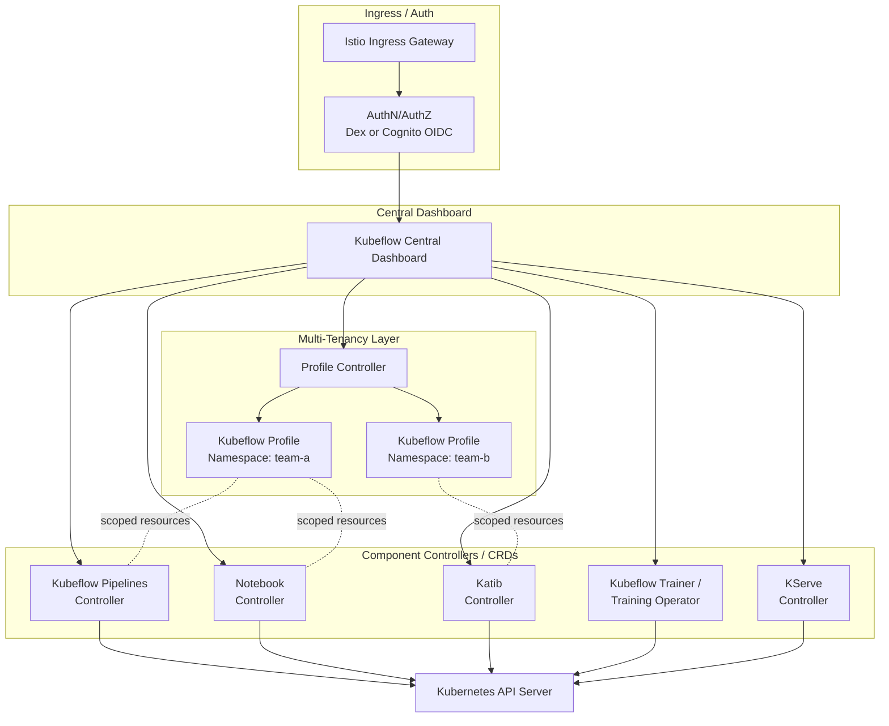

# 第 1 部分：EKS 上的 Kubeflow 架构与安装

> **支持的版本**：Kubeflow Community Distribution 26.03（Kubeflow Pipelines 2.16.0、Katib 0.19.0）、Kubernetes 1.34+
> **最后更新**：August 19, 2026

## 实验环境设置

要跟随本文档中的示例操作，您需要以下工具和环境：

### 必需工具

* kubectl v1.34 或更高版本
* 正常运行的 Amazon EKS 集群
* 用于基于 manifest 部署的 kustomize（随较新版本的 kubectl 附带，或单独安装）
* Terraform（如果您计划改用基于 Terraform 的部署路径）
* 与 Kubernetes ServiceAccount 关联的 IAM role（IRSA 或 EKS Pod Identity），供需要访问 S3 或 RDS 的 Pod 使用
* Amazon Cognito user pool（如果您计划使用 Cognito 而非内置 Dex 进行集群认证）

## 什么是 Kubeflow？

Kubeflow 是一个原生运行于 Kubernetes 上的开源机器学习平台。它并非单一工具，而是一个发行版：将一组独立开发的组件整合在一次安装和一个 Central Dashboard 中：

- **Kubeflow Pipelines** — 将多步骤 ML 工作流编排为由容器化步骤组成的有向无环图（DAG）。
- **Notebooks** — 将 Jupyter（及其他）notebook server 作为 Kubernetes Pod 进行配置，并限定在用户的 namespace 内。
- **Katib** — 以 Kubernetes 原生 Job 运行超参数调优和神经架构搜索。
- **Kubeflow Trainer** — 调度分布式训练 Job（本系列同时涵盖旧版 Training Operator 及其 v2 后继版本）。
- **KServe** — 将已训练模型作为可扩缩推理 endpoint 提供服务，包括通过 dashboard 中的专用 web app。

其价值主张在于，所有这些组件都构建于相同的 Kubernetes API、相同的 RBAC 和 namespace 模型以及相同的底层计算资源之上——因此，已在运营 Kubernetes 的平台团队无需为 ML 专用工作负载再搭建第二套技术栈。

### CNCF 毕业 — August 17, 2026

在 August 17, 2026，[Cloud Native Computing Foundation 宣布](https://www.cncf.io/announcements/2026/08/17/cncf-announces-kubeflows-graduation-solidifying-the-standard-for-cloud-native-ai-operations/)，**Kubeflow 已毕业**——这是 CNCF 的最高成熟度等级，授予那些已证明拥有广泛生产环境采用、健康的多供应商贡献者基础和完善治理的项目。Kubeflow 于 2023 年以孵化项目身份加入 CNCF（它于 2017 年起源于 Google）；达到毕业标准要求其通过独立第三方安全审计，并为项目治理建立正式的指导委员会。对于正在评估 Kubeflow 的平台团队而言，毕业是一个重要信号：它不再被视为早期押注，而是被 CNCF 认为足够稳定、可用于受监管生产 AI 工作负载的项目。

## 发布模型与当前版本

**Kubeflow Community Distribution**——由 Kubeflow 项目自身维护的参考发行版，与 AWS 通过 `kubeflow-manifests` 打包的供应商发行版不同——采用**日历版本控制**（`YY.MM.patch`），每年大约发布两个基础版本。截至本文撰写时，基础版本为 **26.03**，其中包含：

| 组件 | 26.03 中的版本 |
| --- | --- |
| Kubeflow Pipelines | 2.16.0 |
| KServe web app | 0.16.1 |
| Training Operator（旧版 v1） | 1.9.2 |
| Kubeflow Trainer（v2） | v2.1.0 |
| Katib | 0.19.0 |
| Notebooks | 接近发布 v2 版本 |

后续补丁版本 **26.03.1** 进一步升级了其中多个组件（Kubeflow Pipelines 2.16.1、KServe web app v0.18.0、Kubeflow Trainer v2.2.0，以及 Notebooks 的 v2 `workspaces` 进入 beta）——应始终查看 [Kubeflow Community Distribution releases](https://github.com/kubeflow/community-distribution/releases) 以获取当前补丁级别，而不要假定 26.03 本身仍是最新版本。

现在值得特别指出一个细节：**Kubeflow Trainer v2**——围绕新的 `TrainJob`、`ClusterTrainingRuntime` 和 `TrainingRuntime` custom resource 构建——是该项目指定用于替代 26.03 中以 1.9.2 发布的旧版 Training Operator（v1）的后继版本。二者在这一过渡时期并存。本系列的第 5 部分会深入介绍 Trainer v2 的 API 和迁移路径；对于本篇以安装为重点的内容，只需了解发行版的 Training Operator 版本号并不能完整说明您实际将针对哪种训练 API 编写 Job。

## 组件架构

Kubeflow 的架构以共享的 Kubernetes API server 为中心，各组件作为一组 controller 和 CRD 与其通信；基于 Istio 的多租户层提供 namespace 隔离，而 Central Dashboard 则提供统一的 UI 入口。

以下几点值得特别说明：

- **Profile 是租户边界。**“Kubeflow Profile”是一个 Kubernetes namespace，加上一组 RBAC binding、resource quota 和 Istio `AuthorizationPolicy` 对象；所有这些都由 Profile Controller 根据单个 `Profile` custom resource 进行协调。每位用户或每个团队通常拥有一个 profile，而其他所有组件（Notebooks、Pipelines run、Katib experiment）都会在发起请求的用户的 profile namespace 内创建资源。
- **Istio 是隔离机制。**Kubeflow 依赖 Istio 的 sidecar proxy 和 `AuthorizationPolicy` 资源来确保发往某个 profile namespace 的请求不会由另一 profile 中的 workload 提供服务——这使得多租户成为可能，而无需每个组件重复实现自己的授权逻辑。
- **组件是独立的 controller。**Pipelines、Notebooks、Katib、Trainer 和 KServe 各自都是针对同一 Kubernetes API server 进行协调的独立 controller 和 CRD 集合。这就是为何 Kubeflow 发布版本被称为“发行版”——项目为每个组件锁定兼容版本并一起发布，但每个组件都有独立版本，在原则上也可以单独运行。

## EKS 上的安装方式

Kubeflow 上游 manifest 假定部署较为自包含：使用 Dex 进行认证、使用集群内 MySQL StatefulSet 存储 Pipelines/Katib 元数据，以及使用 MinIO 存储 Pipelines artifact。这些默认设置都不太适合生产 EKS 部署，因此 AWS 维护了 **`awslabs/kubeflow-manifests`**，这是一个发行版 overlay，用托管 AWS 服务替换 Kubeflow 内置的自托管依赖项：

| Kubeflow 默认项 | AWS 原生替代项 |
| --- | --- |
| Dex（静态或由 LDAP 支持的 OIDC） | 作为 OIDC provider 的 Amazon Cognito user pool |
| 用于 Pipelines/Katib 元数据的集群内 MySQL | Amazon RDS（兼容 MySQL） |
| 用于 Pipelines artifact 存储的 MinIO | Amazon S3 |

`awslabs/kubeflow-manifests` 记录了两条并行部署路径，用于将这些替代项整合在一起：

1. **基于 Manifest（`kustomize`）**——一组构建在上游 Kubeflow manifest 之上的 kustomize overlay，通过 `kubectl apply -k` 直接应用于预先存在（或新建）的 RDS instance、S3 bucket 和 Cognito user pool。
2. **基于 Terraform**——Terraform module 会配置配套 AWS 基础设施（RDS、S3、Cognito、IAM role），然后在同一次 apply 中驱动基于 kustomize 的 manifest 安装，因此 AWS 端与 Kubernetes 端会一同部署，而不是成为两个彼此脱节的步骤。

选择哪一种主要取决于您其余基础设施已采用的配置方式：在其他地方使用 Terraform 管理 EKS add-on 和配套 AWS 资源的团队，通常会为保持一致性而偏好 Terraform 路径；偏好更手动、可检查的安装方式，或已通过其他 IaC 工具配置 RDS/S3/Cognito 的团队，通常会从纯 kustomize 指南开始。

## IAM 访问模式：IRSA、KFPv2 与向 Pod Identity 的转变

为 Kubeflow Pipelines Pod 授予其 S3 artifact bucket 的访问权限，是任何 EKS 安装中最先出现的 IAM 决策；与其一带而过，不如了解其背景：

- **IRSA 一直是标准机制**，用于将 IAM role 绑定到 Kubernetes ServiceAccount，使 Pipelines Pod 无需长期静态凭证即可读写 S3——这是 `kubeflow-manifests` 为 RDS/S3 部署路径所记录的常见最小权限、按 Pod 范围限定的方法。
- **特别是 KFPv2 对 IRSA 的支持在历史上一直滞后。**较早的 `kubeflow-manifests` 指南指出，IRSA 支持 KFPv1 pipeline，但尚不支持 KFPv2；并建议在过渡期间，KFPv2 部署使用带有静态凭证的专用 IAM user 作为变通方案，同时将 KFPv2 的 IRSA 支持标记为即将推出。
- **对于 EKS 上新的 IAM 到 Pod 绑定，EKS Pod Identity 是总体发展方向。**这是 AWS 一直在引导客户采用的、用于向 Pod 授予 AWS 权限的较新且更简单的机制；它广泛适用于 EKS workload，而不仅是 Kubeflow。截至您阅读本文时，`kubeflow-manifests` 的 Pipelines 指南是否已完全纳入对 KFPv2 的 Pod Identity 支持，值得直接根据当前的 `awslabs/kubeflow-manifests` 文档确认，而不要基于某种假设来构建安装方案。这是 AWS 发行版中快速变化的领域；与其根据旧文档猜测，这类细节最好实时验证。

实际结论是：不要对您的特定 Pipelines 版本当前需要哪种机制（IRSA、IAM user 变通方案或 Pod Identity）做出硬编码假设——请在配置 IAM 资源前查看当前的组件指南。

## 为什么要在 EKS 上运行 Kubeflow，而非使用托管替代方案

Amazon SageMaker（及类似的完全托管 ML 平台）几乎消除了本文所涉及的全部运维工作——无需应用 manifest、无需升级 controller、无需研究 Istio mesh。这是一个合理且往往正确的选择，特别适合尚不具备 Kubernetes 运维能力的团队。

当您的环境已符合以下若干条件时，EKS 上的 Kubeflow 才值得承担其复杂性：

- **您已在 EKS 上运行混合工作负载。**如果数据处理、应用服务和 ML 训练都需要共享集群的 node pool、Karpenter autoscaling 和可观测性技术栈，将 ML 平台作为另一组 Kubernetes controller 运行，可避免维护第二个并行的运维模型。
- **您需要可移植性或希望避免平台锁定。**Kubeflow 的 pipeline、训练 Job 和 serving manifest 都是 Kubernetes 原生构件；同一份 YAML 经过或多或少的调整后，可在任何兼容的 Kubernetes 集群上运行，这对于多云或本地部署加云端的策略十分重要。
- **您希望精细控制训练/serving 技术栈。**当您拥有底层 controller 时，更容易适配自定义训练 runtime、特定 accelerator 调度行为，或托管服务未以您所需方式暴露的 serving framework。

这种权衡是真实存在的：您的团队需要承担 manifest 和 CRD 升级管理、Istio 运维知识，以及上述 IAM/networking 配置工作。正如本文档站点中其他数据和 ML 工具的“为什么要在 EKS 上运行此工具”部分一样，这并不是在论证 Kubeflow 必然优于 SageMaker——而是在说明哪些条件下额外的运维成本值得承担。

## 后续步骤

本系列的第 2 部分将深入介绍 Kubeflow Pipelines：pipeline 编写、KFP SDK，以及 EKS 上的 artifact/metadata 存储模式。

[返回主页](./README.md)

## 测验

要测试您在本章所学的内容，请尝试完成 [主题测验](../../quizzes/ai-ml/kubeflow/01-architecture-installation-quiz.md)。
