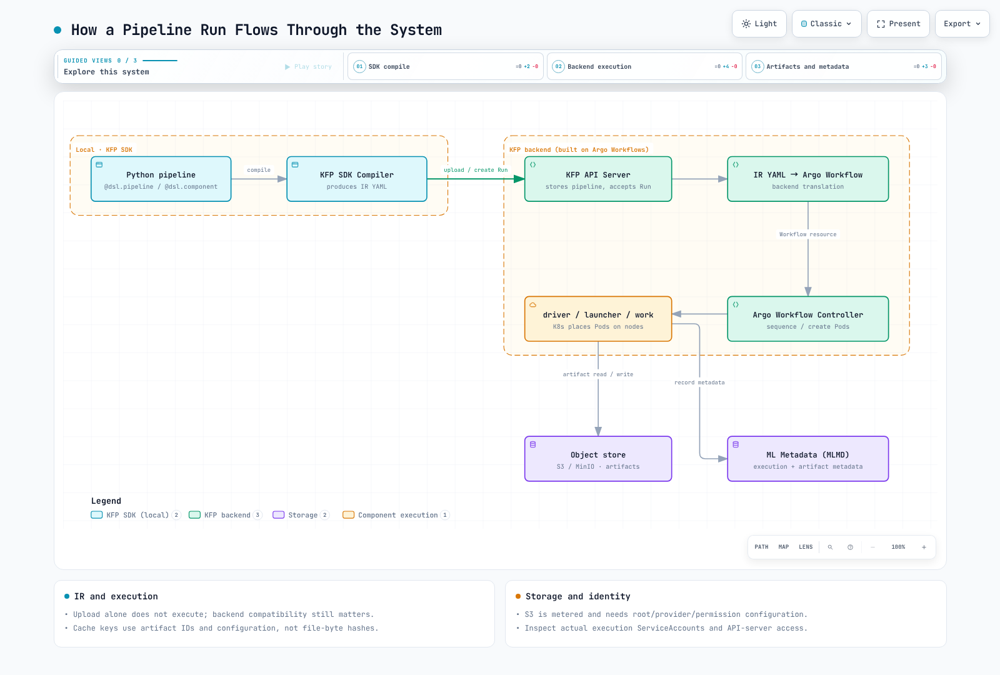

# 第 2 部分：Kubeflow Pipelines

> **支持的版本**：Kubeflow Pipelines 2.16.1, Kubeflow Community Distribution 26.03.1
> **最后更新**：September 12, 2026

## 实验环境设置

本地编译需要 Python 和 `kfp==2.16.1`；本章使用 Python 3.12 进行了检查。编译不会连接集群。远程执行需要兼容的 KFP 后端、经过身份验证的客户端和命名空间权限。对于 S3，实际执行的 ServiceAccount 和访问制品的组件还需要工作负载身份。

## Kubeflow Pipelines 是什么

KFP 使用类型化参数/制品连接组件并跟踪 Run。这里使用的开源 KFP 2.16.1 后端会将 IR 转换为 Argo Workflows。Argo 管理工作流顺序和 Pod 创建；Kubernetes 调度器将 Pods 放置到节点上。缓存任务、导入器和嵌套 DAG 意味着每个逻辑任务并不对应一次单独的用户容器执行。

## KFP v2 架构：IR YAML 和后端执行

Community Distribution 26.03.1 捆绑了 KFP 2.16.1。旧版 v1 默认编译路径会生成 Argo Workflow YAML；v2 `Compiler().compile(...)` 会生成基于 PipelineSpec 的 IR YAML。上传/存储 Pipeline 与创建 Run 是独立的操作。仅上传不会执行它。

IR 避免直接编写 Argo 对象，但并不保证可以不受限制地移植到每个后端。IR/SDK 版本、支持的功能、Kubernetes 平台扩展、身份验证和存储必须与目标匹配。`kfp` 包还提供客户端 API 和 Python 组件执行支持；它的作用不止于编译。

## 核心概念

| 概念 | 作用和范围 |
| --- | --- |
| Pipeline | 使用 `@dsl.pipeline` 编写的图；上传的定义/版本与执行相互独立 |
| Component / Task | 可复用的组件定义和图调用；轻量级 Python 是与容器/导入器/图并列的一种形式 |
| Run / Experiment | 带有输入的执行和一组相关 Run；不同于 Katib 的 Experiment CRD |
| Parameter | 字符串、数字和小型结构化输入/输出值 |
| Artifact | 具有 URI、类型和元数据的 Dataset/Model/Metrics 风格对象；不一定是单个文件 |
| MLMD | 已注册的执行、制品和关系；不会自动记录每个外部副作用或文件完整性 |

元数据记录与制品字节相互独立。当可复现性和内容验证很重要时，请记录代码/镜像/数据修订版本和哈希值。

## Pipeline Run 如何在系统中流转



[🔍 查看交互式图表](https://www.atomai.click/kubernetes-docs/archmaps/en-ai-ml-kubeflow-02-pipelines-0.html)

编译在本地进行。创建 Run 后，API server、Argo、KFP driver/launcher 和用户容器会协同工作。launcher/runtime 处理制品路径、传输和元数据。Kubernetes 节点放置仍与 Argo 的工作流排序相互独立。

## EKS 特定的制品存储

经过审查的发行版默认安装包含 MinIO，但并非每个 KFP 安装或制品 URI 都使用它。请检查 Pipeline 根目录、导入的 URI 和提供商配置。诸如 Metrics 之类面向元数据的制品不一定是指标文件。

对于 S3，请使用[当前对象存储指南](https://www.kubeflow.org/docs/components/pipelines/operator-guides/configure-object-store/)配置 `pipeline_root`、提供商和凭证链。S3 会产生存储、请求和传输费用；它并不是免费的默认制品服务。

不要假定 `pipeline-runner` 在每个环境中都是执行 ServiceAccount。请检查 Run 选择的账户和实际 Pods，以及 API server/launcher 所需的访问权限。当前指南中记录了 IRSA。Pod Identity 需要验证 SDK、agent、关联和运行时支持；本章未执行 AWS 集成。[第 1 部分](01-architecture-installation.md)说明了这些边界以及旧版 AWS 发行版的安装限制。

## 一个简单的两步 Pipeline

以下示例使用 KFP v2 SDK 的装饰器演示了一个最小的 `data-prep -> train` Pipeline，其中类型化的 `Dataset` 制品从第一个组件传递到第二个组件：

```python
from kfp import dsl, compiler
from kfp.dsl import Dataset, Model, Output, Input

@dsl.component(base_image="python:3.12-slim", packages_to_install=["pandas==2.3.3"])
def prepare_data(output_dataset: Output[Dataset]):
    import pandas as pd

    # In a real pipeline this would read from S3 or another source
    df = pd.DataFrame({"feature": [1, 2, 3, 4], "label": [0, 1, 0, 1]})
    df.to_csv(output_dataset.path, index=False)

@dsl.component(base_image="python:3.12-slim", packages_to_install=["scikit-learn==1.7.2", "pandas==2.3.3"])
def train_model(input_dataset: Input[Dataset], output_model: Output[Model]):
    import pandas as pd
    from sklearn.linear_model import LogisticRegression
    import pickle

    df = pd.read_csv(input_dataset.path)
    clf = LogisticRegression().fit(df[["feature"]], df["label"])
    with open(output_model.path, "wb") as f:
        pickle.dump(clf, f)

@dsl.pipeline(name="data-prep-train-pipeline")
def data_prep_train_pipeline():
    prep_task = prepare_data()
    train_task = train_model(input_dataset=prep_task.outputs["output_dataset"])

compiler.Compiler().compile(
    pipeline_func=data_prep_train_pipeline,
    package_path="data_prep_train_pipeline.yaml",
)
```

`Output[Dataset]` 到 `Input[Dataset]` 的连接会记录图依赖关系和制品类型。实际的 `.path` 准备和传输会在运行时发生。编译不会验证存储或训练。

这些是轻量级 Python 组件。`@dsl.component` 会提取函数代码；它不会自动构建镜像。`packages_to_install` 会在执行时于基础镜像中安装依赖项。之前的示例遗漏了 prepare_data 的 pandas；现在两个组件都声明了其依赖项，并且其函数体已在本地检查。对于生产环境，请将依赖项预先构建到容器中，固定其摘要，并单独测试该容器。此处的 Python 镜像标签和传递依赖项并不是完全锁定的构建。

仅加载由本练习生成的可信 pickle。加载外部 pickle 可能执行任意代码。这个微型模型演示 API，并不是模型质量验证结果。

## 缓存行为

在 2.16.1 中，键包括输入参数值、输入制品**名称/ID**、输出规范、容器镜像字符串、命令/参数以及 PVC 名称。缓存查找的范围限定为 Pipeline 名称和命名空间。它不会在每次查找时读取并哈希输入制品的文件字节。

因此，在同一制品 ID、镜像标签或外部数据库/API 状态背后修改文件，可能会使键保持不变。现有的缓存元数据也不能确保已删除的输出对象在下游仍可读取。请将数据版本/哈希作为显式参数传递，并考虑为可变的外部状态或副作用禁用缓存。

```python
# Inside the pipeline function, disable caching for this task.
prep_task.set_caching_options(enable_caching=False)
```

经过身份验证的客户端的 `create_run_from_pipeline_package(..., enable_caching=False)` 会覆盖该 Run 的任务缓存；`None` 会保留已编译的任务设置。CLI 默认值和 `KFP_DISABLE_EXECUTION_CACHING_BY_DEFAULT` 也可以更改编译默认值；请在导入 KFP 之前设置该环境变量。

## 验证和来源

IR 使用 Python 3.12 / KFP 2.16.1 编译，并检查了依赖项、类型和缓存设置。函数体使用 pandas 2.3.3 / scikit-learn 1.7.2 在本地 CPU 上执行。Docker、Argo、集群缓存复用、S3 和 Pod Identity 执行尚未测试。

- [2.16.1 缓存键实现](https://github.com/kubeflow/pipelines/blob/2.16.1/backend/src/v2/cacheutils/cache.go)
- [2.16.1 缓存查找和复用](https://github.com/kubeflow/pipelines/blob/2.16.1/backend/src/v2/driver/cache.go)
- [官方缓存指南](https://www.kubeflow.org/docs/components/pipelines/user-guides/core-functions/caching/)
- [轻量级 Python 组件](https://www.kubeflow.org/docs/components/pipelines/user-guides/components/lightweight-python-components/)

## 后续步骤

完成 Pipeline 的编写、编译和运行后，下一个问题通常是这些 Pipeline 组件背后的交互式开发工作最初在哪里进行。[第 3 部分：Kubeflow Notebooks](./03-notebooks.md)介绍团队用来编写和迭代最终打包进 Pipeline 组件代码的每用户 notebook 环境；并且在本系列稍后的内容中，[第 6 部分：KServe — Kubernetes 上的模型服务](./06-kserve.md)介绍如何服务这些 Pipeline 最终生成的模型。

[返回主页](./README.md)

## 测验

为测试你在本章学到的内容，请尝试[主题测验](../../quizzes/ai-ml/kubeflow/02-pipelines-quiz.md)。
