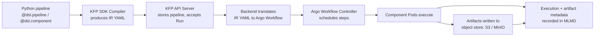

# 第 2 部分：Kubeflow Pipelines

> **支持的版本**：Kubeflow Pipelines 2.16.0、Kubeflow Community Distribution 26.03
> **最后更新**：August 19, 2026

## 实验环境设置

要跟随本文档中的示例操作，您需要以下工具和环境：

### 所需工具

* 本地安装 Python 3.10+ 和 `kfp` SDK（`pip install kfp`），用于编译 pipeline
* kubectl v1.34 或更高版本，并配置为指向已安装 Kubeflow Pipelines 的集群（参见第 1 部分）
* 如果您计划将 KFP 的 artifact store 指向 S3，则需要授予 S3 访问权限的 IRSA role 或 EKS Pod Identity association（参见下文“EKS 专用 Artifact Storage”）

## Kubeflow Pipelines 是什么

Kubeflow Pipelines (KFP) 是 Kubeflow 平台中用于构建、运行和跟踪 ML pipeline 的工作流编排引擎——ML pipeline 是由容器化步骤组成的 DAG，每个步骤都有类型化的输入和输出。您使用 KFP SDK 在 Python 中编写 pipeline，将其编译后提交给 KFP backend；后者会将每个步骤调度为 Pod，并跟踪运行状态和 artifact。

在底层，KFP 的 backend 基于 [Argo Workflows](https://argoproj.github.io/workflows/) 构建：编译后的 pipeline 到达 KFP API server 后，会被转换为 Argo `Workflow` resource，实际创建 Pod 并安排其执行顺序的是 Argo 的 controller。KFP 提供了 Argo 本身不具备的层——用于编写的 Python SDK、用于浏览运行和 artifact 的 UI、Experiment/Run 跟踪模型，以及用于 lineage 的 ML Metadata (MLMD) store。

## KFP v2 架构：使用 IR YAML 而非直接使用 Argo YAML

Kubeflow Pipelines 2.16.0 是 Kubeflow Community Distribution 26.03 版本中捆绑的版本。它基于 KFP v2 SDK 和 backend 构建；与旧版 v1 SDK 相比，它改变了 Python pipeline 定义转换为可运行工作流的方式：

* **v1 SDK**：`dsl-compile` 会将 Python pipeline function 直接编译为 Argo `Workflow` YAML manifest。编译产物专用于 Argo——如果您需要不同的 backend，就需要使用不同的 compiler。
* **v2 SDK**：pipeline 会编译为 **Intermediate Representation (IR) YAML**——与 backend 无关的 `PipelineSpec`，用于描述 DAG、component、类型化 artifact 和 parameter。随后 KFP backend 会在提交时将该 IR 转换为 Argo `Workflow`。

实际好处是，它提供了一个稳定且有文档说明的 pipeline spec，不会绑定到 Argo 的 object model。这也意味着，您从 `kfp.compiler.Compiler().compile(...)` 获取的 artifact——IR YAML——是您交给任何兼容 KFP 的 backend 的内容，也是 KFP API server 在该 pipeline 的每次运行时存储和重新提交的内容，而不是一次性的 Argo manifest。

## 核心概念

* **Pipeline** —— 使用 `@dsl.pipeline` decorator 在 Python 中编写、并编译为 IR YAML 的 component DAG。
* **Component** —— 一个具有类型化输入和输出的容器化步骤。使用 `@dsl.component` 编写后，component 会编译为自己的 container spec；在运行时，它会成为一个 Pod（或 Pod 内的一个步骤，具体取决于 executor configuration）。
* **Run** —— 使用一组特定 input parameter 执行一次 pipeline（或单个 component）。
* **Experiment** —— 相关 Run 的命名分组，用于组织和比较结果（例如，同一 pipeline 的不同 hyperparameter run）。
* **Artifact** —— 在 component 之间流动的类型化输出，由 object store 中的文件支持。KFP v2 将 artifact 设为一等类型——`Dataset`、`Model`、`Metrics`、`ClassificationMetrics`、`HTML`、`Markdown`——因此 component 的 signature 不仅说明其会生成输出，还说明输出的类型。
* **ML Metadata (MLMD) store** —— 用于记录每次 component execution、其输入/输出及其涉及 artifact 的 backing store（大多数 KFP 安装中是由 MySQL 支持的 service）。这使 KFP UI 能够显示 artifact lineage——跨 Run，将训练出的 model 回溯到生成它的确切 dataset 和代码。

## Pipeline Run 如何在系统中流转



KFP SDK 的职责止于生成 IR YAML；从 API server 开始的所有工作都是 backend 的责任。正是这种分离使“backend-agnostic spec”的说法变得具体——SDK 不知道也不关心底层由 Argo Workflows 进行调度。

## EKS 专用 Artifact Storage

KFP 随附一个集群内 MinIO deployment 作为默认 artifact store：除非重新配置，否则 component 生成的每个 artifact（`Dataset`、训练后的 `Model`、metrics file）都会被写入 MinIO bucket，而非真正的 S3 bucket。对于自包含演示而言这没有问题，但在 EKS 上，这意味着您需要运行和运维一个额外的 stateful service，而它重复了 S3 已免费提供的功能——持久性、从集群外部访问，以及基于 IAM 的 access control。

`awslabs/kubeflow-manifests` 项目记录了将 KFP 的 artifact store 指向 S3 而非集群内 MinIO 的模式——重新配置 pipeline root 和 artifact object-store credential，使 component 直接读取和写入 S3 bucket。这也是 [第 1 部分](./01-architecture-installation.md) 中介绍的身份机制直接相关的地方。KFP pipeline Pod（尤其是 `pipeline-runner` ServiceAccount）所使用的任何 ServiceAccount，都需要具有该 S3 bucket 权限的 IRSA role 或 EKS Pod Identity association，因为写入/读取 artifact 时发出的 object-store call 会直接前往 AWS，而非集群内 MinIO endpoint。第 1 部分深入介绍了 IRSA/Pod Identity setup 的机制；本节仅指出该身份在 pipeline lifecycle 中何处会被使用。

## 一个简单的两步 Pipeline

以下示例演示了一个使用 KFP v2 SDK decorator 的最小 `data-prep -> train` pipeline，其中类型化的 `Dataset` artifact 从第一个 component 传递到第二个：

```python
from kfp import dsl, compiler
from kfp.dsl import Dataset, Model, Output, Input

@dsl.component(base_image="python:3.11-slim")
def prepare_data(output_dataset: Output[Dataset]):
    import pandas as pd

    # In a real pipeline this would read from S3 or another source
    df = pd.DataFrame({"feature": [1, 2, 3, 4], "label": [0, 1, 0, 1]})
    df.to_csv(output_dataset.path, index=False)

@dsl.component(base_image="python:3.11-slim", packages_to_install=["scikit-learn", "pandas"])
def train_model(input_dataset: Input[Dataset], output_model: Output[Model]):
    import pandas as pd
    from sklearn.linear_model import LogisticRegression
    import pickle

    df = pd.read_csv(input_dataset.path)
    clf = LogisticRegression().fit(df[["feature"]], df["label"])
    with open(output_model.path, "wb") as f:
        pickle.dump(clf, f)

@dsl.pipeline(name="data-prep-train-pipeline")
def data_prep_train_pipeline():
    prep_task = prepare_data()
    train_task = train_model(input_dataset=prep_task.outputs["output_dataset"])

compiler.Compiler().compile(
    pipeline_func=data_prep_train_pipeline,
    package_path="data_prep_train_pipeline.yaml",
)
```

关于此示例，有几点值得注意：

* `output_dataset: Output[Dataset]` 和 `input_dataset: Input[Dataset]` 是 KFP v2 声明类型化 artifact parameter 的方式——SDK 负责将 `prep_task.outputs["output_dataset"]` 连接到 `train_model` 的输入，包括为每个 component 提供其写入/读取所需的 storage path。
* 每个 `@dsl.component` 都会编译为各自的 container image build context（或者复用通过 `packages_to_install` 安装给定 Python package 的 `base_image`），因此 `prepare_data` 和 `train_model` 会作为独立 Pod 运行，仅通过声明的 artifact 相连。
* `compiler.Compiler().compile(...)` 会生成上文所述的 IR YAML——这是将上传至 KFP UI 或通过 KFP Python client 提交以创建 Run 的文件。

## 缓存行为

KFP 通过对 component 的输入（parameter value、input artifact content，以及 component 自身定义）进行哈希来缓存其 execution。如果后续 Run 提交的 component 的 input hash 与先前成功 execution 相匹配，KFP 会跳过重新运行并复用缓存的输出——因此，在仅修复 `train_model` 步骤后重新运行 pipeline 时，如果 `prepare_data` 的输入和代码没有变化，就不会浪费时间重新运行它。

这对于迭代式开发很方便，但可能会悄然掩盖您实际想要的 rerun（例如，某个 component 依赖已更改但未反映在其声明输入中的 external state）。可以禁用缓存：

* 按 component 禁用：在 pipeline function 内的 task 上调用 `set_caching_options(enable_caching=False)`，例如 `prep_task.set_caching_options(enable_caching=False)`。
* 按 Run 禁用：针对整个 pipeline submission 禁用缓存，而非逐个 component 禁用——KFP UI 的“Run”对话框会在提交时提供用于此目的的 caching toggle。

## 后续步骤

在完成 pipeline 的编写、编译和运行后，下一个问题通常是这些 pipeline component 背后的交互式开发工作究竟在何处进行。[第 3 部分：Kubeflow Notebooks](./03-notebooks.md) 介绍了团队用于编写和迭代最终打包为 pipeline component 的代码的每用户 notebook environment——而在本系列后续内容中，[第 6 部分：KServe — Kubernetes 上的 Model Serving](./06-kserve.md) 介绍了服务这些 pipeline 最终生成的 model。

[返回主页](./README.md)

## 测验

要测试您在本章中学到的内容，请尝试[主题测验](../../quizzes/ai-ml/kubeflow/02-pipelines-quiz.md)。
