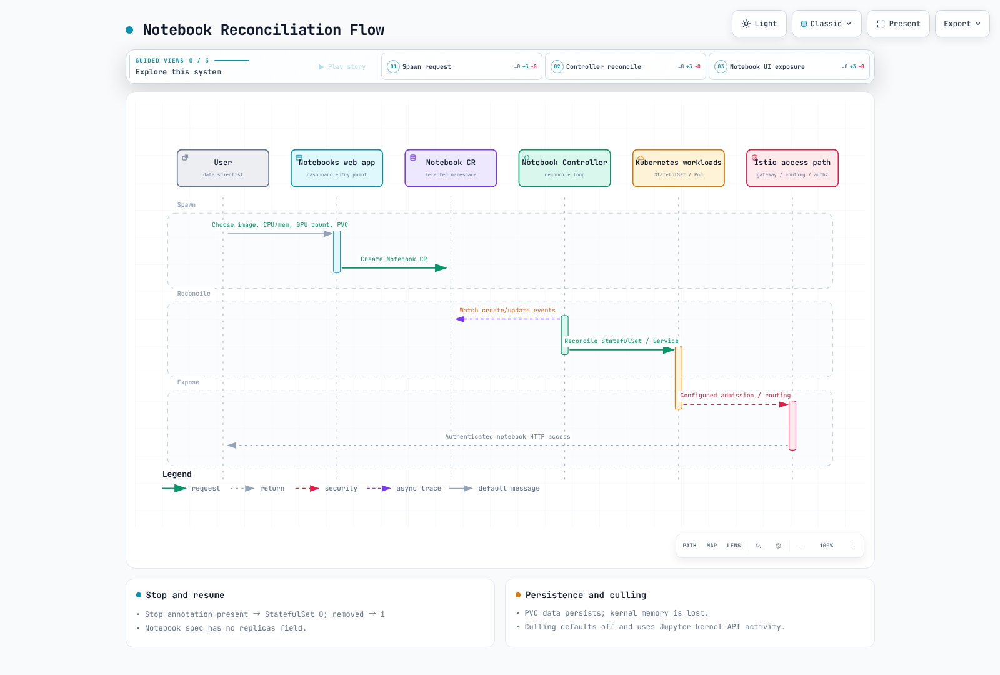

# 第 3 部分：Kubeflow Notebooks

> **支持的版本**：Kubeflow Notebooks 1.11.0；Community Distribution 26.03.1
> **最后更新**：September 12, 2026

## 实验环境设置

需要一个兼容的 Kubernetes 集群、Notebooks 1.11.0 控制器/Web 应用、命名空间权限、存储以及经过身份验证的访问路径。关于发行版兼容性，请参阅[第 1 部分](01-architecture-installation.md)。GPU 工作负载需要受支持的驱动/设备插件以及合适的节点容量；Karpenter 只是一种容量置备器，并不是 notebook 的前置条件。

## Kubeflow Notebooks 是什么

Notebooks Web 应用会使用镜像/资源/卷设置创建一个 `Notebook`。它的控制器管理一个 StatefulSet、一个 Service，并在已配置时管理 Istio VirtualService。StatefulSet 控制器创建 Pods，由 Kubernetes 进行调度。Dashboard 是 Web 应用的入口点，既不是 Pod 的创建者，也不是通用流量代理。

命名空间级的 Notebook 资源包含一个 PodSpec，也可以通过 GitOps 或 Kubernetes API 进行管理。直接编辑其托管的 StatefulSet 可能会被 reconciliation（协调）撤销。

## 版本背景：Notebooks v1 与 Workspaces

本章审阅的是发行版 26.03.1 中的 **Notebooks v1.11.0** 及其 `Notebook` API。Workspaces 是使用 `Workspace` 和 `WorkspaceKind` 的独立 v2 设计；它并不是可以直接替换的 CRD。

26.03.1 的发布说明将 Workspaces 描述为 beta，而打了标签的 controller/backend/frontend manifests 引用的是 **v2.0.0-alpha.3** 镜像。请区分发布措辞与实际部署的镜像标签。本次审阅并未确认 v2 已 GA，也未确认 v1 的支持终止日期。在采用之前，请核实实际的发布版本、API 和迁移支持情况。

## 多租户模型：Profiles 与相互独立的隔离策略

完整的 Kubeflow UI 会在所选的 Profile 命名空间中创建 notebook。一个 Profile 可以由团队成员共享，而 Notebook CRD 本身并不要求每个命名空间都拥有一个 Profile。独立安装与完整平台的访问模型也有所不同。

Profile 的所有权/成员关系、RBAC 和 Istio AuthorizationPolicy 只提供访问控制的一部分。它们既不会撤销无关的 RBAC 授权，也不会自动阻止所有 Pod 流量、存储访问或 AWS 访问。请分别评估 NetworkPolicy 的实施、Pod 权限、卷权限、工作负载 IAM 和应用层授权。

### 持久化存储

默认 UI 通常会在 `/home/jovyan` 挂载一个工作区 PVC。**只有存储在该卷上的数据**才能在 Pod 被替换后保留。安装到 `/opt/conda`、系统目录或容器可写层中的软件包，以及内存中的内核状态，都不会被该 PVC 保留。位于 home 目录中的用户软件包可能会保留，但可能与新镜像不兼容。

请检查 PVC/卷的生命周期、备份和回收策略。EBS 的 ReadWriteOnce 意味着从一个**节点**进行读写挂载，而不是由一个 Pod 独占使用。强制单 Pod 使用需要额外的支持，例如 CSI ReadWriteOncePod。EBS 存在可用区/挂载方面的约束；共享的 EFS 存储需要 POSIX 权限和并发访问设计。

### 空闲回收（Idle Culling）

本次审阅的 v1.11.0 默认值为 `ENABLE_CULLING=false`、`CULL_IDLE_TIME=1440` 和 `IDLENESS_CHECK_PERIOD=1`；时间单位为分钟。仅完成安装并不会启用 culling。

Culler 使用 Jupyter 的 `/api/kernels` 和最近活动时间。它无法全面检测浏览器关闭，也无法检测 shell 进程中的 GPU 工作。不要假定 RStudio/code-server 会暴露相同的 API。请求失败或内核列表为空时，最近活动的值保持不变，因此一个陈旧的值仍可能导致停止。在启用之前，请使用实际的镜像和访问策略验证检测行为。

Culling 会添加一个停止注解，将 StatefulSet 副本数降为零，但不会删除 PVCs。释放 Pod 的资源请求并不必然会终止 EC2 节点：其他工作负载、PDBs 以及 Karpenter 的策略/预算同样重要。在节点终止之前，实例费用可能会继续产生。

## Notebook 协调流程



[🔍 查看交互式图表](https://www.atomai.click/kubernetes-docs/archmaps/en-ai-ml-kubeflow-03-notebooks-0.html)

Notebook v1.11.0 没有 `spec.replicas` 字段。当 `kubeflow-resource-stopped` **存在**时，控制器生成零个 StatefulSet 副本；不存在时生成一个。即使值为 `"false"` 也会将其停止。恢复时应删除该注解，而不是修改它的值。

```bash
# Stop the selected notebook: active kernels/processes terminate.
kubectl annotate notebook -n team-a analysis \
  kubeflow-resource-stopped="2026-09-12T00:00:00Z" --overwrite
# Resume by removing the annotation.
kubectl annotate notebook -n team-a analysis kubeflow-resource-stopped-
```

其中的时间戳用于说明注解的格式。请替换为实际的命名空间/notebook，并在运行这些命令之前保存工作内容。Istio sidecar 注入由配置好的 admission webhooks 执行，而不是由 Notebook 控制器直接完成。

## EKS 上 notebook 的 GPU 调度

GPU 请求使用标准扩展资源，例如 `resources.limits["nvidia.com/gpu"]`。设备插件、驱动、节点容量、taints/tolerations 和亲和性设置必须彼此匹配。仅声明 GPU 资源并不能确保出现合适的节点。

Karpenter 可以为符合条件的 Pending Pods 和匹配的 NodePools 进行置备，但受 EC2 容量、配额、限制、网络和引导是否成功的影响。停止 notebook 与 EC2 缩容是相互独立的操作。关于放置和中断条件，请参阅 [Karpenter](../../autoscaling/02-karpenter.md)。

## 自定义 notebook 镜像

本次审阅的 spawner 将 `allowCustomImage` 默认设为 `true`。对于能够直接调用 Notebook API 的用户，仅靠 UI 下拉列表的限制无法强制约束镜像选择。请同时通过 RBAC 和 admission 施加必要的约束。

镜像必须满足服务器端口、`/notebook/<namespace>/<name>/` 前缀或重写配置、UID/GID、可写的 home 目录、探针以及运行时依赖等要求。Jupyter Docker Stacks 镜像并不会自动包含所有 Kubeflow 约定或 SDK。请构建固定版本的依赖项，从 ECR 或其他镜像仓库引用镜像摘要，并验证 CPU 架构和 GPU 驱动的兼容性。

相同的标签并不保证字节相同。即使摘要相同，当 PVC 中的用户软件包/设置、启动脚本或运行时安装存在差异时，环境也不会完全一致。

## 验证和来源

26.03.1 的 notebook-controller overlay 使用 Kustomize 在本地渲染。检查了 v1.11.0 的 CRD、停止处理、culling 和 spawner 配置。实际的 notebook、GPU 执行、PVC 恢复、空闲检测和 EKS 置备尚未运行。

- [v1.11.0 Notebook 控制器](https://github.com/kubeflow/notebooks/blob/v1.11.0/components/notebook-controller/controllers/notebook_controller.go)
- [v1.11.0 culling 实现](https://github.com/kubeflow/notebooks/blob/v1.11.0/components/notebook-controller/controllers/culling_controller.go)
- [v1.11.0 spawner 默认值](https://github.com/kubeflow/notebooks/blob/v1.11.0/components/crud-web-apps/jupyter/manifests/base/configs/spawner_ui_config.yaml)
- [26.03.1 Workspaces 镜像标签](https://github.com/kubeflow/community-distribution/blob/26.03.1/applications/workspaces/upstream/controller/base/manager/kustomization.yaml)

## 后续步骤

继续学习[第 4 部分：Katib](04-katib.md)中的实验和超参数调优。

[返回主页](./README.md)

## 测验

为测试你在本章学到的内容，请尝试[主题测验](../../quizzes/ai-ml/kubeflow/03-notebooks-quiz.md)。
