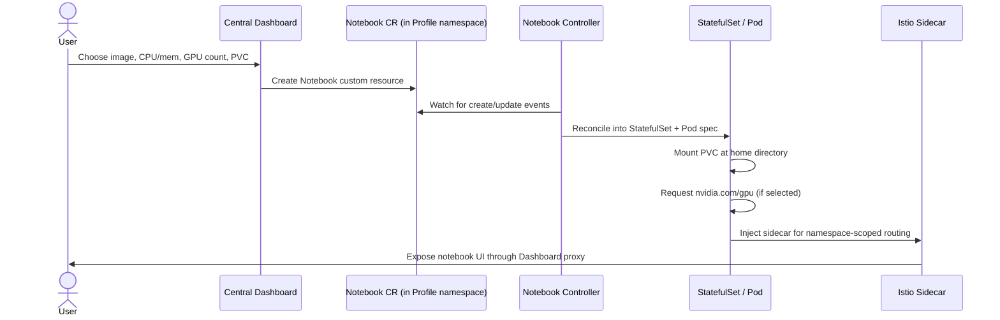

# 第 3 部分：Kubeflow Notebooks

> **支持的版本**：Kubeflow Community Distribution 26.03，Kubernetes 1.34+
> **最后更新**：August 19, 2026

## 实验环境设置

要跟随本文档中的示例操作，您需要以下工具和环境：

### 必备工具

* kubectl v1.34 或更高版本，且指向已安装 Kubeflow 的集群（参见第 1 部分）
* 可访问 Kubeflow Central Dashboard 中的用户 Profile（namespace），以创建 notebook server
* 如果计划创建由 GPU 支持的 notebook，则需要通过 [Karpenter](../../autoscaling/02-karpenter.md) 配置支持 GPU 的 `NodePool`/`EC2NodeClass` 对
* 如果计划构建并引用自定义 notebook image，则需要拥有 container registry（例如 Amazon ECR）的推送权限

## 什么是 Kubeflow Notebooks？

Kubeflow Notebooks 让 data scientist 无需自行编写 Deployment manifest 或 Dockerfile，即可将配置完整的交互式开发环境——JupyterLab、RStudio 或 code-server（浏览器中的 VS Code）——作为在集群内运行的 Pod 启动。Controller 会监视描述所需 notebook（image、CPU/memory/GPU 请求和 storage）的 custom resource，将其协调为常规 Kubernetes object；Istio 的按 namespace 路由则通过 Kubeflow 其余部分使用的同一 Central Dashboard 公开生成的 server。

相较于作为共享的 JupyterHub Deployment 或一次性的 `kubectl run` 来运行 notebook，采用这种方式的意义在于每位用户的环境都完全参与集群的常规运营模型。它由同一个 scheduler 调度，因此会像其他 workload 一样与 GPU node pool 竞争资源并从中受益。它受到相同的 namespace 范围 RBAC 和 network policy 约束。此外，还可通过 platform team 已用于管理其他所有资源的同一套 `kubectl`/GitOps tooling 对其进行暂停、调整大小或销毁。

## 版本背景：Notebooks v1 与即将到来的 v2

截至 Kubeflow Community Distribution 26.03，Kubeflow Notebooks 仍采用其长期使用的 **v1** 设计——`Notebook` custom resource 是对 Kubernetes `StatefulSet`/Pod spec 相当轻量的封装，通过 Central Dashboard 的 notebook UI 创建。这正是本文档其余部分详细介绍的架构，也是您如今部署 26.03 时将会遇到的架构。

该项目正**积极推进 v2 release**，围绕两个新的 custom resource——`Workspace` 和 `WorkspaceKind`——构建；它们将“notebook 环境的形态”（由管理员定义并进行版本管理的 `WorkspaceKind` template）与“某个给定用户正在运行哪一种环境”（引用某个 kind 的 `Workspace`）分离。截至 26.03 base distribution，v2（`Workspaces`）已发布用于测试的 alpha manifests；26.03.1 patch 将其提升至 **beta**，但它**尚未达到 general availability**。一旦 v2 可用于 production，预计 v1 `Notebook` CRD 将转为仅维护状态。应将 v2 视为值得提前规划的前瞻性背景信息——在将 production platform design 确定为任一 API 之前，请查阅 [Kubeflow Notebooks 文档](https://www.kubeflow.org/docs/components/notebooks/) 以了解当前的 GA 状态。

## 多租户模型：以 Profile 作为 Notebook 边界

每位 Kubeflow Notebooks 用户都在一个 **Profile** 内操作——这与 Kubeflow 其余部分所使用的每用户一个 namespace 的结构相同（第 1 部分已介绍）。创建 Profile 会提供：

* 为该用户（或 team）提供专用 Kubernetes namespace。
* 通过 Profile Controller 创建 RBAC binding，将用户权限限定在其自身 namespace 内。
* 创建 Istio `AuthorizationPolicy`，限制哪些 identity 可以访问该 namespace 内的 service（包括 notebook Pod），因此默认情况下，一个用户的 notebook 无法被访问，也无法访问其他用户的 workload。

notebook server 始终在 Profile namespace 中创建，绝不会在共享 namespace 中创建。这使得 platform team 能够提供 self-service notebook 创建能力，同时避免所有用户的 Pod 彼此可达——隔离边界与用于 pipeline run、KServe endpoint 以及集群中所有其他按用户划分资源的边界相同。

### 持久化存储

Central Dashboard 的 spawner 允许用户将一个或多个 PersistentVolumeClaim 挂载到 notebook Pod，通常挂载在 notebook server 的 home directory（例如，遵循 upstream Jupyter Docker Stacks 约定的 Jupyter-based image 使用 `/home/jovyan`）。由于 claim 而非 Pod 才是持久对象，用户的文件、已安装 package 以及 Jupyter configuration 能够在 Pod restart、node replacement 或有意停止/启动 notebook 本身的周期后继续保留。在 EKS 上，此 PVC 通常由 Amazon EBS CSI driver 提供支持，以实现单 Pod 的 ReadWriteOnce 访问；当 team 希望在多个 notebook 或 pipeline Pod 间共享同一工作目录以进行读写时，则通过其 CSI driver 使用 Amazon EFS。

### 空闲清理

运行中的 notebook Pod 会一直占用其所请求的 CPU、memory，以及成本最高的 GPU allocation，无论是否有人正在使用它。为此，Kubeflow Notebooks 提供了清理机制，可停止（而非删除）在配置时间段内保持空闲的 notebook。清理会释放空闲 notebook 占用的 node capacity——这对由 GPU 支持的 notebook 最为重要，因为用户离开后，空闲 server 否则可能持续数小时占用昂贵的 GPU instance。底层 PVC 不受清理影响，因此下一次启动时，被清理 notebook 的环境和文件会与用户离开时完全一致。

## Notebook 协调流程

Controller 的 reconciliation loop 与 Kubernetes 其他地方使用的模式相同：它并不会在每次 dashboard interaction 时直接创建 Pod，而是持续将实际 `StatefulSet` 向 `Notebook` custom resource 当前声明的目标状态进行协调。例如，由 dashboard 驱动的 stop 会将 custom resource 的 desired state 更新为零个 replica，而非发出命令式的 Pod delete；因此，决定 notebook Pod 是否应运行的 single source of truth 是 Controller，而不是 dashboard UI。

## EKS 上的 Notebook GPU 调度

需要 accelerator access 的 notebook Pod 请求资源的方式与集群中的其他 Pod 相同：`Notebook` custom resource 中 spawner 的 GPU field 会转换为底层 Pod spec 中的 `resources.limits."nvidia.com/gpu"` 条目，而运行在 GPU node 上的 NVIDIA device plugin 会将 `nvidia.com/gpu` 作为可分配资源发布给 scheduler。

这意味着 notebook GPU scheduling 并非独立于集群其余 GPU capacity 的子系统——它会与支持 training job、KServe endpoint 以及其他 GPU workload 的同一批 GPU-capable node pool 竞争资源，并由它们提供服务。在 EKS 上，此 capacity 通常通过 Karpenter 动态 provision：当 notebook Pod 的 `nvidia.com/gpu` 请求无法由现有 capacity 满足时，它可以扩容 GPU `NodePool`；一旦 notebook 被清理或停止，则可以再次缩容。[Karpenter 自动扩缩容](../../autoscaling/02-karpenter.md) 中深入介绍了配置 GPU-aware Karpenter NodePool、instance-type selection 以及 accelerator node 的 taint/toleration 的机制。这里需要记住的 notebook 专属细节很简单：空闲的 GPU notebook 是 GPU node pool 无法缩容至零的最常见原因之一——这正是上述清理行为旨在防止的问题。

## 自定义 Notebook Image

Kubeflow spawner 随附的 stock notebook image 覆盖了通用的 JupyterLab/RStudio/code-server 基线，但大多数在 production 中运行 notebook 的 team 都会构建并引用自己的 custom image，以便每位 data scientist 都从完全相同、可复现的环境开始，而不是在运行中的 container 内手动使用 `pip install` 安装 dependency。

常见模式如下：

1. **从 upstream Kubeflow（或 Jupyter Docker Stacks）base image 开始**，其中已包含 notebook server、Kubeflow SDK integration 以及 spawner 所预期的 UID/working-directory convention。
2. **叠加 team 实际所需的 dependency**——固定的一组 Python/R package、内部 library、GPU framework version（与目标 node pool 上的 CUDA driver 匹配），以及 team 标准化使用的所有无需 credential 的 tooling。
3. **构建并将 image 推送到 cluster 可以拉取的 registry**——在 EKS 上通常为 Amazon ECR，并像其他 production image 一样应用 image scanning 和 lifecycle policy。
4. **从 spawner 引用 image。**Central Dashboard 的 spawner UI 在其 image field 中接受任意 image reference（前提是符合管理员配置的 allow-list），因此从 end user 的角度看，custom image 的行为与 stock image 完全相同——只是多了一个可选项。

通过与其他 application image 相同的 CI pipeline 对这些 image 进行 versioning 和 rebuild，便可使整个 team 的 notebook environment 保持可复现：选择相同 image tag 的两位 data scientist 会获得 byte-identical 的 package set，而不是每位用户的 kernel 随时间因手动安装而逐渐偏离。

## 后续步骤

本文档介绍了 Kubeflow Notebooks 的功能、用于隔离每位用户 notebook 的基于 Profile 的 multi-tenancy model、persistent storage 和 idle culling、notebook Controller 的 reconciliation flow、EKS 上的 GPU scheduling，以及为获得可复现 environment 而构建 custom notebook image 的实践。第 4 部分将继续介绍 Katib 和 hyperparameter tuning，并以此处引入的同一 Profile 和 custom-resource pattern 为基础。

[返回主页](./README.md)

## 测验

要检验您在本章中学到的内容，请尝试 [主题测验](../../quizzes/ai-ml/kubeflow/03-notebooks-quiz.md)。
