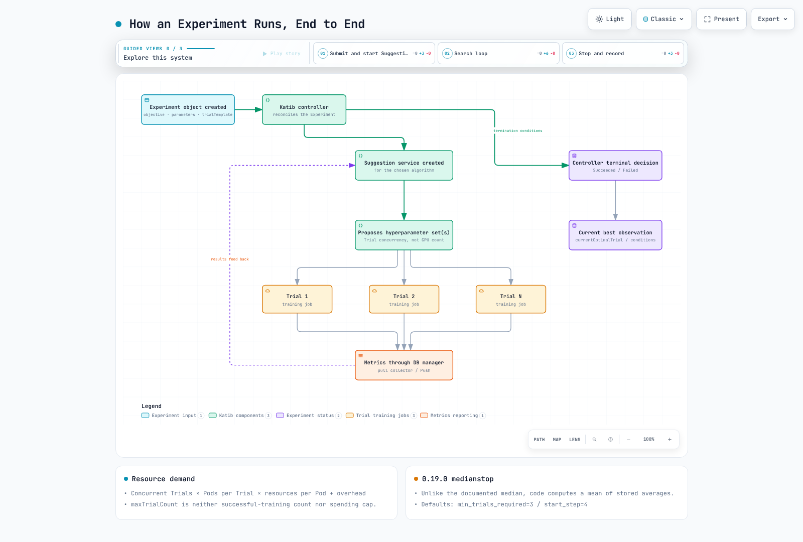

# 第 4 部分：Katib — 超参数调优和 AutoML

> **支持的版本**：Katib 0.19.0、Kubeflow Community Distribution 26.03.1
> **最后更新**：September 12, 2026

## 实验环境设置

使用 Katib 0.19.0 controllers、DB manager/storage、所需的 Suggestion images 以及 namespace 权限来创建 Experiments。区分完整平台的 Profile 访问权限与独立安装。GPU 容量为可选项；Karpenter 是其中一种 provisioner。

## Katib 是什么

Katib 支持超参数优化（HPO）和神经架构搜索（NAS）。一个 `Experiment` 定义 objective/search space/algorithm/Trial template；`Suggestion` 及其 algorithm service 提出候选项；一个 `Trial` 管理一次候选项执行。先前结果如何影响建议取决于算法。

这些是由 CRDs 定义的**自定义资源对象**，而不是每次运行都要安装的新 CRD 定义。Trial controller 创建配置的 job resource；该 job 的 controller 和 Kubernetes 负责 Pod 创建及节点调度。0.19.0 的默认 trialResources 包含 `TrainJob.v1alpha1.trainer.kubeflow.org`、Kubernetes Job 和旧版 training-job kinds。实际的 Trainer API/runtime、权限、成功/失败条件以及 collector 目标 Pods/containers 必须匹配；兼容性并非自动实现。

使用 `kubectl get experiments.kubeflow.org` 和 `kubectl get trials.kubeflow.org` 检查状态。这些与 KFP 中名称相似的 Experiment API 不同。

## 搜索算法

算法名称必须与已安装的 KatibConfig 条目和 Suggestion images 匹配。0.19.0 的默认配置包括：

| 名称 | 策略和约束 |
| --- | --- |
| `random` | 对配置的空间/分布进行采样；并非每个参数都必然均匀采样 |
| `grid` | 有限的组合；目标、失败或 Trial 限制可能阻止穷尽执行 |
| `bayesianoptimization`, `tpe`, `multivariate-tpe` | 不同的基于模型的候选策略；不保证使用更少的 Trials 或找到最优值 |
| `hyperband` | 资源预算和连续减半；训练代码必须遵守预算参数 |
| `cmaes`, `sobol` | 分别为协方差自适应进化和低差异采样，并非同一种算法 |
| `pbt` | 具有 checkpoint 共享要求的基于种群的训练；不同于 CMA-ES |
| `enas`, `darts` | 具有各自 templates/dependencies 的架构搜索算法 |

PBT 指南要求使用 RWX volume 和 `resumePolicy: FromVolume`。更改算法名称并不会使任意训练代码兼容。

## Experiment 的结构

| 字段 | 含义 |
| --- | --- |
| `objective` | 指标名称、最大化/最小化以及可选目标值 |
| `parameters` | double/int/discrete/categorical 空间、范围/列表/分布 |
| `algorithm` | 已安装的 Suggestion 算法及其设置 |
| `trialTemplate` | trialParameters 替换和 job spec、主 container/Pod 选择、成功/失败条件 |
| `parallelTrialCount` | 并发处理的 Trials，而非 Pod/GPU/EC2 数量 |
| `maxTrialCount` | 基于完成数量的停止条件，而非成功训练数量或不可变的生命周期成本上限 |
| `maxFailedTrialCount` | 包括失败和指标不可用 Trials 在内的失败阈值 |
| `metricsCollectorSpec` / `earlyStopping` | 指标报告和独立的早停配置 |

达成目标、完成数量达到上限或建议耗尽都可以成功结束；失败阈值或 Suggestion 错误可能导致 Experiment 失败。完成状态会统计 succeeded、failed、killed、early-stopped 和 metrics-unavailable Trials。恢复策略和 spec 更改也会影响生命周期，因此不要将 maxTrialCount 视为不可变的生命周期创建或支出限制。

`Succeeded` 是 control-loop 结果，而非模型质量认证。`status.currentOptimalTrial` 描述收集到的最佳观测值；缺少指标可能导致没有可用的最佳模型。

## 早停和 0.19.0 medianstop 实现

早停可以终止正在运行的 Trial。官方指南要求使用 `StdOut`/`File` collectors 和带时间戳的日志。不要假设每个 collector 或任意训练循环都具有等效支持。默认值为 `min_trials_required=3` 和 `start_step=4`。

**请区分文档中的规则与此版本的实现。** 官方指南描述的是已完成 Trial 运行平均值的中位数。然而在 v0.19.0 中，`get_median_value` 会存储每个成功 Trial 前 start_step 个观测值的平均值，并返回这些存储平均值的**算术平均值**。在本地以 `[1, 2, 100]` 执行未修改的函数，得到的结果约为 34.333，而非统计中位数 2。算法名称并不保证此版本会进行中位数计算。

Hyperband 的预算分配和 early-stopping service 是独立的配置/执行路径。请验证丢弃有前景候选项的风险，以及指标格式、报告频率和预算参数的影响。

## Experiment 如何端到端运行

[🔍 查看交互式图表](https://www.atomai.click/kubernetes-docs/archmaps/en-ai-ml-kubeflow-04-katib-0.html)

Experiment controller 通过 Suggestion resources 请求候选项并创建 Trial objects。Trial 和 training-job controllers 驱动执行，指标则通过 DB manager 报告。算法会根据其实现消耗结果。检查终止条件和剩余的子 jobs；最优超参数本身并不是可部署的模型 artifact。

## 指标收集

| 模式 | 配置和约束 |
| --- | --- |
| `StdOut` | 默认 pull 模式；从主 container 的日志格式中提取指标 |
| `File` | TEXT 或以行为分隔的 JSON；配置路径和过滤器 |
| `TensorFlowEvent` | Event-file directory，包括兼容的 TensorBoard writers |
| `Custom` | 用户提供的 collector 实现；任意 HTTP scraping 并非内置默认功能 |
| `Push` | 训练代码调用 SDK `report_metrics()` 向 DB manager 报告；并不总是需要 collector sidecar |

Pull injection 需要 namespace label `katib.kubeflow.org/metrics-collector-injection: enabled`、可用的 webhook 以及正确的目标 Pod/container 选择。分布式训练需要明确的报告 rank 策略。验证指标名称、数值格式、时间戳、连接性和策略。成功的训练 job 并不保证已收集指标。

## EKS 上的容量和成本

需求大致为 **并发 Trials × 每个 Trial 的 Pods × 每个 Pod 的资源**，再加上 collector/Suggestion/database 开销。如果每个 Trial 有两个 Pods，且每个 Pod 请求四个 GPUs，则 parallelTrialCount 为 8 时可能请求 64 个 GPUs，而非 8 个。

对于 Pending Pods，请检查 events、调度约束、quotas、NodePool/EC2 容量、drivers 和 bootstrap 状态。Karpenter 并不总能提供容量，更高的并发度也不保证总运行时间更短。早停可以释放 Pod 资源，而保留节点的 EC2 费用仍会持续产生。

请一并配置总 Trial 条件、并发度、job retries/分布式规模、deadlines 和数据保留策略。在扩大 GPU 规模之前，先使用小型 CPU workload 验证指标收集和终止行为。

## 验证和来源

已检查 v0.19.0 配置、controller/API、collector 路径和 medianstop 源码。使用预加载的成功 Trial 历史记录并阻止网络调用，在本地执行了未修改的 medianstop 函数。未运行 Experiment 或 GPU workload。

- [0.19.0 默认 KatibConfig](https://github.com/kubeflow/katib/blob/v0.19.0/manifests/v1beta1/installs/katib-standalone/katib-config.yaml)
- [Experiment 状态决策](https://github.com/kubeflow/katib/blob/v0.19.0/pkg/controller.v1beta1/experiment/util/status_util.go)
- [medianstop 实现](https://github.com/kubeflow/katib/blob/v0.19.0/pkg/earlystopping/v1beta1/medianstop/service.py)
- [指标 collector 指南](https://www.kubeflow.org/docs/components/katib/user-guides/metrics-collector/)
- [早停指南](https://www.kubeflow.org/docs/components/katib/user-guides/early-stopping/)

## 后续步骤

在[第 5 部分：Trainer](05-training-operator.md)中继续学习分布式训练 APIs 和 runtimes。

[返回主页](./README.md)

## 测验

要检验本章所学内容，请尝试[主题测验](../../quizzes/ai-ml/kubeflow/04-katib-quiz.md)。
