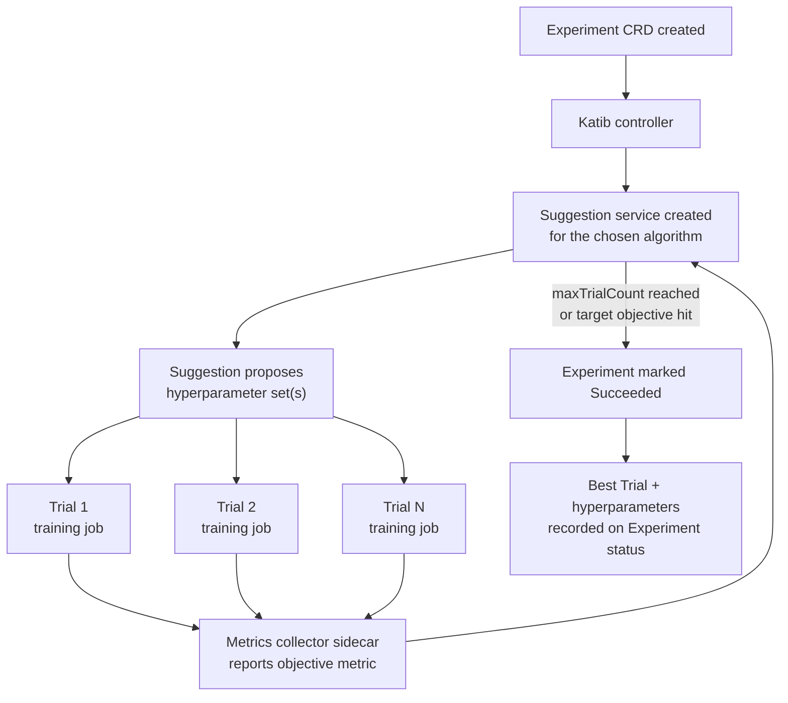

# 第 4 部分：Katib — 超参数调优与 AutoML

> **支持的版本**：Katib 0.19.0、Kubeflow Community Distribution 26.03
> **最后更新**：August 19, 2026

## 实验环境设置

要跟随本文档中的示例操作，您需要以下工具和环境：

### 必需工具

* kubectl v1.34 或更高版本，并指向已安装 Kubeflow 的集群（参见第 1 部分）
* 可访问 Kubeflow Central Dashboard 中的用户 Profile（namespace），以提交 Experiment
* 如果计划运行由 GPU 支持的 Trial，则需要通过 [Karpenter](../../autoscaling/02-karpenter.md) 配置支持 GPU 的 `NodePool`/`EC2NodeClass` 对
* 可从 `trialTemplate` 引用的可用训练作业模板（例如，第 5 部分中的 `TrainJob`/`ClusterTrainingRuntime` 对，或普通 Kubernetes `Job`）

## Katib 是什么

本系列的前几部分介绍了 Kubeflow notebook 和 pipeline 层。本文介绍 **Katib**，即 Kubeflow 的 Kubernetes 原生超参数调优和 AutoML 组件。Katib 将“我应使用什么学习率、batch size 和网络深度？”变成由集群调度的声明式搜索，而不再是手动的编辑、运行和检查循环；它通过组合普通 Kubernetes 对象——Custom Resources、pod 和 service——实现这一点，而不是在集群一侧附加一个定制调度器。

Katib 通过并行运行许多训练作业来自动化超参数优化（HPO）和神经架构搜索，每个作业使用不同的超参数组合，并根据结果决定接下来要尝试哪些组合。它围绕三个相互协作的组成部分构建：

* **Experiment** — 描述一次调优运行的 CRD：要优化的目标、超参数的搜索空间、要使用的搜索算法，以及描述如何运行一个训练作业的模板。
* **Trial** — 由 Katib controller 创建的 CRD，表示使用一个特定超参数组合进行的一次训练运行。`maxTrialCount: 50` 的 Experiment 在其生命周期内最多会生成 50 个 Trial。
* **Suggestion** — 实现搜索算法的 service（同样由 CRD 支持）。它接收已完成和进行中的 Trial 的结果，并提出接下来要尝试的超参数集。

这种关系具有层级性：一个 Experiment 拥有多个 Trial，而每个 Trial 拥有实际的训练作业（Kubernetes `Job`，或与 Kubeflow Trainer 集成时使用的 `TrainJob` 等训练作业资源——参见第 5 部分），Kubernetes 会像调度和运行其他任何工作负载一样调度和运行它。由于所有内容都是 CRD，`kubectl get experiments`、`kubectl get trials` 以及对其中任何一个执行 `kubectl describe` 的行为，与对 Deployment 或 Job 执行时完全相同——不需要单独的 CLI 或 UI 来检查状态；不过 Katib UI（Kubeflow Central Dashboard 的一部分）提供了 Trial 进度和指标曲线的可视化视图。

## 搜索算法

Katib 提供了一组可插拔的搜索算法，并通过 Suggestion service 公开。每种算法都用不同的策略，以及探索成本和搜索效率之间不同的权衡，回答同一个问题——“根据目前的结果，下一个 Trial 应尝试什么？”

| 算法 | 适用场景 | 概念行为 |
|---|---|---|
| **随机搜索** | 成本低廉的基线，或非常大/理解不足的搜索空间 | 从定义的空间中独立且均匀地随机采样超参数组合。不记忆过去的 Trial。 |
| **网格搜索** | 可负担穷举覆盖的小型、低维搜索空间 | 枚举为每个超参数提供的离散值的每种组合。保证完全覆盖，但会随参数数量呈组合式扩展。 |
| **贝叶斯优化** | 单个 Trial 的成本很重要且有依据的采样能带来收益的高训练成本模型 | 构建超参数如何映射到目标指标的概率模型，并使用该模型选择最可能改善当前最佳结果的下一个点。对于许多工作负载，相比随机搜索可用更少的 Trial 收敛，但代价是 Suggestion 之间存在一定的串行依赖。 |
| **Hyperband** | “它在早期看起来是否有前景？”是廉价且信息量丰富的信号的工作负载（例如，几个 epoch 后的 loss 曲线） | 使用少量资源预算运行许多配置，积极淘汰表现最差的配置，并将释放的预算重新分配给保留者以进行更长时间的运行。以早期剪枝换取每个配置的详尽信息。 |
| **CMA-ES 和其他高级策略** | 连续的高维搜索空间，或受益于基于种群的搜索的工作负载（例如，基于种群的训练） | 在连续多代中演化候选配置的种群或分布，根据哪些候选者表现良好来调整采样分布。从概念上说，它比简单采样更接近进化/优化算法。 |

要选择哪种算法取决于每个 Trial 的成本，以及搜索空间具有多少结构。随机搜索是建立基线的合理默认选择；当训练单个 Trial 的成本足够高，以至于减少 Trial 总数有实际影响时，贝叶斯优化和 Hyperband 是更常见的选择。

## Experiment 的结构

Experiment 的 spec 有三个部分，对于理解调优运行的行为最为重要：

* **`objective`** — 指定要优化的指标（例如 `accuracy` 或 `loss`）和目标（`maximize` 或 `minimize`），以及一个可选的目标值；若达到该值，可将 Experiment 作为“足够好”而提前停止。
* **`parameters`** — 搜索空间：每个超参数一个条目，每个条目包含名称、类型，以及连续范围（最小值/最大值，适用于学习率之类的参数）或离散值列表（适用于 optimizer 选择或分类架构标志之类的参数）。
* **`trialTemplate`** — 描述如何构建每个 Trial 的实际训练作业：它是底层作业 spec 的模板，其中的占位符会替换为 Suggestion service 为该 Trial 提议的特定超参数值。在当前 Kubeflow 部署中，此模板通常指向由 **Kubeflow Trainer** 管理的训练作业资源（第 5 部分将深入介绍）——Katib 在这里的工作是决定注入*哪些值*，而不是重新实现分布式训练作业的运行方式。

另外两个 Experiment 级字段决定搜索的执行方式，而不是搜索的内容：

* **`parallelTrialCount`** — 可同时运行的 Trial 数量。
* **`maxTrialCount`** — Experiment 在停止前其整个生命周期内运行的 Trial 总数（无论是否达到目标值）。

## 提前停止

并非每个 Trial 都需要运行到完成才能知道它不会获胜。Katib 支持 **提前停止**：当 Trial 在训练过程中明显表现不佳时，会在耗尽其全部资源分配之前终止。一个常用方法是 **中位数停止规则**：在训练中的给定时间点，将 Trial 的中间目标值与其他 Trial 在同一时间点的中间值的中位数进行比较；如果它明显落后，便停止该 Trial，而不是让它运行到完成后才获得一个已经不太可能具备竞争力的结果。

提前停止和 Hyperband 等算法解决的是相关问题——避免将计算资源浪费在没有进展的训练上——但它们在不同层面上运作：Hyperband 是一种*搜索策略*，预先决定为每个配置提供多少预算；而提前停止是对已在运行的 Trial 的*运行时检查*，依据其相对于同类 Trial 的进展情况应用。

## Experiment 如何端到端运行

该循环的工作方式如下：Katib controller 协调 Experiment，并为所请求的算法启动 Suggestion service。Suggestion service 提出一个或多个超参数组合，数量受 `parallelTrialCount` 限制。对于每个提案，controller 都会创建一个 Trial CRD 及其底层训练作业。随着 Trial 报告结果，这些结果会反馈给 Suggestion service，以便为下一轮提案提供依据。循环持续进行，直到达到 `maxTrialCount` 或满足目标的目标值。在整个过程中，Experiment 的状态会持续更新为截至目前观察到的表现最佳的 Trial。Experiment 完成后，该最佳 Trial 的超参数和指标值将被记录为最终结果。

## 指标收集

训练作业本身并不知道它属于 Katib Experiment，因此 Katib 需要一种方法从每个 Trial 的 pod 中提取目标指标。这通过注入到 Trial pod 中、与训练 container 并列的 **metrics-collector sidecar** 实现。sidecar 的工作是观察训练 container 的输出——通常是跟踪 stdout/log 文件中可识别的指标模式，或抓取训练代码暴露的 metrics endpoint——并将解析出的目标指标值报告回 Katib 的 metrics store。

这种 sidecar 模式使训练代码本身基本保持 Katib 无关：一个已以可解析格式输出每个 epoch 的 accuracy 或 loss 的训练脚本，无需重写即可与 Katib 集成——collector 会完成提取。它还意味着收集策略的选择（日志解析与 endpoint 抓取）会影响 Katib 观察中间进展的可靠性和频率，进而影响提前停止和 Hyperband 风格的算法能否有效利用该进展。

## 在 EKS 上运行 Katib Experiment：资源压力

Katib 的并发控制参数会直接影响集群容量；相较于固定且过度配置的本地集群，这在 EKS 上更值得关注：

* **`parallelTrialCount` 会倍增资源需求。** 每个并发 Trial 都是一个完整训练作业——若单个 Trial 请求 GPU，`parallelTrialCount` 为 8 意味着集群会同时接收 8 个 GPU 请求，而不是 8 个随时间分散的请求。如果 `parallelTrialCount` 设置较高，看似规模适中的 Experiment（`maxTrialCount: 100`）仍可能产生短暂而急剧的需求峰值。
* **集群自动扩缩容必须跟上节奏。** 在 EKS 上，这种压力通常通过 [Karpenter](../../autoscaling/02-karpenter.md) 预配新的 GPU 支持节点来吸收，以响应突增的处于 Pending 状态的 Trial pod。由于 GPU instance type 的预配前置时间通常比通用 instance 更长，较高的 `parallelTrialCount` 可能导致早期 Trial 在等待节点而非实际训练——在认为 Suggestion 算法本身很慢之前，值得先查看 Trial pod event。
* **应共同调优 `parallelTrialCount` 和 `maxTrialCount`，而不是分别进行。** 与使用高 `parallelTrialCount` 更快完成同样数量的 Trial 相比，较低 `parallelTrialCount` 和更长时间运行的 Experiment 往往对共享集群容量更友好——合适的平衡取决于集群是专用于调优运行，还是与其他工作负载共享。
* **提前停止可直接减少浪费的支出。** 由于每个提前终止的 Trial 会更早释放其 GPU 分配，中位数停止规则（参见上文“提前停止”）不仅是搜索效率优化手段——在 EKS 上，它也是直接影响调优运行在收敛到一组良好超参数之前累积多少 GPU 小时成本的杠杆。

## 后续步骤

Katib 将超参数搜索转变为 Kubernetes 原生控制循环：Experiment 描述目标和搜索空间，Suggestion service 使用可插拔搜索算法提出超参数组合，Trial 将这些组合以普通训练作业的形式运行，而 metrics-collector sidecar 会报告结果，以便搜索收敛到最佳配置。在 EKS 上，实际的关键在于协调 `parallelTrialCount`/`maxTrialCount` 与自动扩缩容容量——尤其是对于由 GPU 支持的 Trial——从而使调优运行的并发量不会超过集群实际预配节点的速度。

第 5 部分介绍 **Kubeflow Trainer**，这是 Katib 的 `trialTemplate` 通常委托来实际运行每个 Trial 的分布式训练作业的组件。

[返回主页面](./README.md)

## 测验

要测试您在本章学到的内容，请尝试 [主题测验](../../quizzes/ai-ml/kubeflow/04-katib-quiz.md)。
