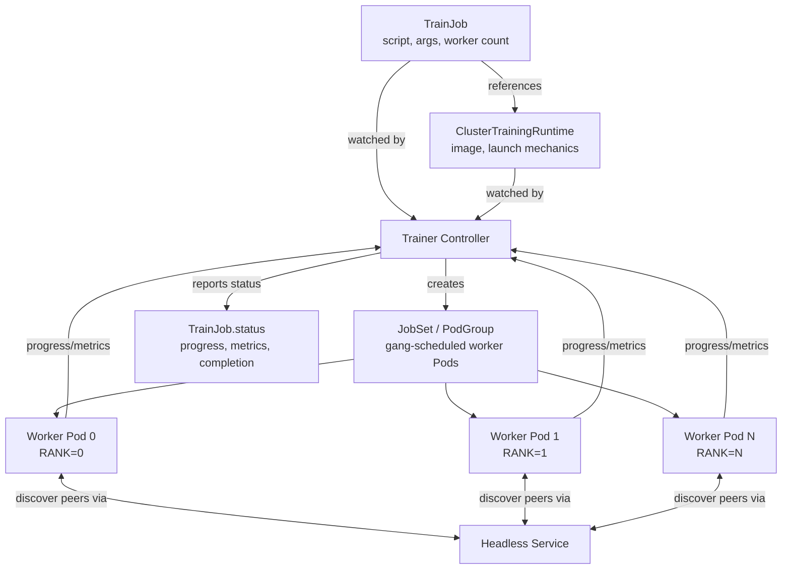

# 第 5 部分：Kubeflow Trainer 与分布式训练

> **支持的版本**：Kubeflow Trainer v2.1（随 26.03 捆绑）至 v2.3，旧版 Training Operator 1.9.2（随 Kubeflow Community Distribution 26.03 捆绑）
> **最后更新**：August 19, 2026

## 实验环境设置

要跟随本文档中的示例操作，您需要以下工具和环境：

### 必需工具

* kubectl v1.34 或更高版本
* 一个可正常工作的 Amazon EKS 集群，并配有支持 GPU 的节点池（请参阅下方引用的 [Karpenter](../../autoscaling/02-karpenter.md) 和 GPU 节点调度资料——本文档不再重新推导该设置）
* 通过 Community Distribution 安装的 Kubeflow，或独立安装的 Kubeflow Trainer

## 从特定框架的 Operator 到统一 API

Kubernetes 上的分布式训练在 Kubeflow 项目中经历了真正的架构转变，而这是在接触任何 YAML 之前最需要理解的内容。

### 原始 Training Operator (v1)

Kubeflow 在 2021 年整合的 Training Operator 采用了**特定框架的 CRD** 方法。每个受支持的 ML 框架都有自己的 Custom Resource Definition，并且各自的 controller 实现该框架特有的分布式训练语义：

* **`PyTorchJob`** — controller 理解 PyTorch 的分布式启动约定，会向每个 worker Pod 注入 `MASTER_ADDR`、`RANK` 和 `WORLD_SIZE` 等环境变量，使 `torch.distributed` 能够形成进程组。
* **`TFJob`** — controller 则会构建 `TF_CONFIG` 环境变量（描述集群任务角色的 JSON blob——chief、worker、parameter server），这是 TensorFlow 的分布式策略所期望的内容。
* **`MPIJob`** — controller 负责跨 Pod 启动 MPI job，并协调一个 `mpirun` 风格的 launcher 与一组 worker Pod 协同工作。

除了这三种框架外，v1 Training Operator 还为少数其他框架提供了 CRD。每个 CRD 都将不同框架关于“worker 如何相互发现并就其角色达成一致”的理念直接编码到独立 controller 中，因此添加新框架意味着要编写全新的 controller，而不是复用现有的基础设施。

### 向 Kubeflow Trainer v2 的转变

Kubeflow Trainer v2 以围绕两个概念构建的单一统一 API 取代了每个框架一个 CRD 的模式：

* **`TrainJob`** — 描述*运行什么*：训练脚本/entrypoint、参数、资源数量（例如 worker 数量），以及对负责执行它的 runtime 的引用。这是 ML 从业者为单次训练运行创建的对象。
* **`TrainingRuntime` / `ClusterTrainingRuntime`** — 描述*如何运行*：可复用、特定框架的执行模板，涵盖容器镜像、分布式启动机制（worker 如何相互发现、使用哪些 env var 或 launcher 进程）以及默认资源规格。平台团队只需一次性定义少量这样的 runtime——例如 PyTorch DDP runtime、MPI runtime——而许多不同的 `TrainJob` 会在多次训练运行中引用同一个 runtime。

这反映了 Kubernetes 其他地方也能见到的一种模式：将可复用的“模板”资源与使用它的“实例”分离，其理念类似于一个 `StorageClass` 是许多 `PersistentVolumeClaim` 所引用的可复用模板。实际收益在于，平台团队可以在一个地方拥有并版本化棘手的分布式启动机制（runtime），而提交 job 的 ML 从业者只需提供脚本并按名称请求一个 runtime——他们不需要知道或关心 rank 分配或地址发现实际上如何在底层发生。

根据其[发布说明](https://github.com/kubeflow/trainer/releases)，**Kubeflow Trainer v2.2**（约于 2026 年 3 月发布，也是从 Kubeflow Community Distribution 的 26.03.1 补丁版本开始捆绑的版本——26.03 本身提供 v2.1.0）在此基础上增加了：

* 一流的 **JAX** 和 **XGBoost** 训练 runtime，以及现有的 PyTorch 支持——因此这些框架的分布式训练现在也通过相同的 `TrainJob`/runtime 拆分进行，而不是使用定制的 CRD。
* 增强的**可观测性**：训练进度和 metrics 可以从训练脚本本身传播到 `TrainJob` 的 status 中，而不必要求操作人员翻查日志或单独的 metrics backend 来了解一次运行的进展。
* **Flux Framework 集成**，将 HPC 风格的 job launcher 引入 Trainer 生态系统以处理 MPI 风格的 workload——它适用于紧耦合、带有 HPC 特征的分布式 job；与更简单的 `mpirun` 启动方式相比，这类 job 可受益于 Flux 的调度和进程启动模型。

### 迁移是真实的，但尚未完成

重要的是，不要夸大生态系统实际所处的阶段：截至该版本，**Kubeflow Community Distribution 26.03** 仍捆绑了**旧版 Training Operator 1.9.2**——即 v1 的特定框架 CRD Operator。Kubeflow Trainer v2 和旧版 Training Operator 目前在生态系统中共存，将某个团队的 job 从 `PyTorchJob`/`TFJob`/`MPIJob` manifest 迁移到 `TrainJob` + runtime，是许多团队尚处于中途的**活跃、持续中的转变**——并非可以假定在某个集群中已经完成的全面切换。

如果您正在计划实际迁移，请不要将本文档当作迁移指南——权威的逐字段参考是 kubeflow.org 上的 **“Migrating to Kubeflow Trainer v2”**：[kubeflow.org](https://www.kubeflow.org/docs/components/trainer/operator-guides/migration/)。该指南涵盖了每个 v1 CRD 字段如何具体映射到 `TrainJob` 和默认 runtime；在此完整重述超出了本文档的范围。

另请注意已在运行 Trainer v2 的用户：**Trainer v2.3.0**（于 2026 年 8 月发布）在 v2.2 之后发布，其中包含对本文档所述 runtime CRD 的破坏性变更——Runtime Finalizer 被移除，且 CRD 被移至 Helm chart 的 template 目录——其[发布说明](https://github.com/kubeflow/trainer/releases)明确指出，运行 v2.0/v2.1/v2.2 的集群必须先升级到 v2.3，才能进一步升级。在升级已运行 Trainer v2 的集群前，请直接核对该指南。

## TrainJob 的概念结构

从概念层面来看（不虚构本文档尚未验证的精确字段名），一个用于 PyTorch 分布式数据并行 (DDP) 运行的 `TrainJob`，其职责大致划分如下：

* 一个 **`ClusterTrainingRuntime`**，由平台团队一次性创建，其中捆绑了：训练容器镜像（或基础镜像要求）、作为默认值的 worker replica 数量，以及用于 PyTorch DDP 的分布式启动机制（worker 如何发现 rendezvous 地址并就 rank/world size 达成一致）。
* 一个 **`TrainJob`**，为每次训练运行创建；它按名称引用该 `ClusterTrainingRuntime`，并提供运行特定的部分：要执行的实际训练脚本或 command、任何脚本参数（learning rate、dataset path、epoch 等），以及本次运行所需的 worker 数量。

`TrainJob` 有意设计为“轻量”对象——关于*如何*进行分布式协调的大部分复杂性存在于 runtime 中，而不是每个单独的 job manifest 中。这正是 runtime 能够在多次训练运行中复用的原因，也是通常由平台团队而非每位 data scientist 拥有并强化 runtime 定义的原因。

## Kubernetes 上的分布式训练机制

无论使用哪个框架的 runtime，Kubernetes 上的多 worker 分布式训练通常都通过同一组基础原语进行协调：

* worker Pod 前方的**无头 Service**，这样每个 worker 都能获得其他 worker 稳定且可解析的 DNS 名称，而不用依赖在重新调度时可能变化的 Pod IP。
* **注入的环境变量**（或等效的 config file/init 步骤），用于告知每个 worker 其 rank、worker 总数，以及充当 rendezvous/coordinator 的 worker 地址——这正是 `MASTER_ADDR`/`RANK`/`WORLD_SIZE` 在 PyTorch 中的作用，以及 `TF_CONFIG` 在 TensorFlow 中的作用；在 Trainer v2 中被 runtime 抽象泛化。
* **Gang scheduling 注意事项**：分布式训练 job 通常需要在训练开始前让*所有* worker 都被调度并运行——一个 job 只调度了一半 worker、无限期等待其余 worker，不仅浪费 GPU 容量，还可能发生 deadlock。因此，分布式训练 controller 通常依赖于（或集成）gang-scheduling 原语——将一个 job 的 Pod 组成一个组，使 scheduler 将它们视为全有或全无的单元——而不是 Kubernetes 默认逐个独立调度 Pod 的行为。

特别是在 EKS 上，这会直接与 GPU 节点池的供应和扩缩容方式交互。一个需要 8 个 GPU worker 的分布式 job，需要同时有 8 个支持 GPU 的节点（或 slot）可用——而不是随着 autoscaler 逐步提供时一次得到一个。GPU 节点池的容量规划与扩缩容机制（Karpenter NodePool、instance type 选择、GPU binpacking）已在本站的 autoscaling 和 GPU 调度资料中介绍，本文不再重新推导。需要带入本文档的要点是，gang-scheduling 要求和 GPU 节点池弹性需要一同设计，因为无论其 `TrainJob`/runtime 配置多么正确，无法同时调度所有 worker 的训练 job 都会停滞。

## 交叉参考：Katib 和 TrainJob

本系列第 4 部分介绍了 Kubeflow 的超参数调优组件 Katib。实验中的每个 Katib Trial 都需要一个底层训练 job 来实际运行一种超参数组合——而在基于 Trainer v2 的设置中，该底层 job 通常是 Katib 为每个 Trial 模板化生成的一个 `TrainJob`，每个 Trial 选定的超参数值会作为脚本参数注入。上述 runtime/job 拆分同样适用于此：Katib 不需要了解任何分布式启动机制——它只需针对平台团队已定义的 runtime，为每个 Trial 生成一个 `TrainJob`，并读取回传的 metrics 以决定下一步的搜索方向。

## 后续步骤

在完成从特定框架 CRD 向统一 `TrainJob`/runtime 模型转变的介绍后，[第 6 部分：KServe — Kubernetes 上的模型服务](./06-kserve.md)将讲解模型针对 `TrainJob` 的训练完成后会发生什么：为 inference 提供服务。

[返回主页](./README.md)

## 测验

要检验您在本章所学内容，请尝试[主题测验](../../quizzes/ai-ml/kubeflow/05-training-operator-quiz.md)。
