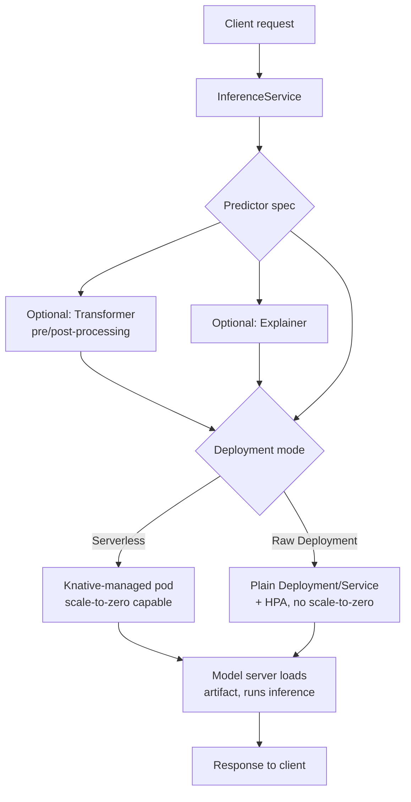

# 第 6 部分：KServe — Kubernetes 上的模型服务

> **支持的版本**: KServe（Kubeflow Community Distribution 26.03 中捆绑的 web app v0.16.1）
> **最后更新**: August 19, 2026

## 实验环境设置

要跟随本文档中的示例操作，您需要以下工具和环境：

### 必需工具

* kubectl v1.34 或更高版本，以及一个可正常运行的 EKS 集群
* 已安装 Kubeflow（第 1 部分），并且可在 Central Dashboard 中看到 KServe web app
* 如果计划服务由 GPU 支持的模型，需要配备 GPU 的 `NodePool`/`EC2NodeClass` 对：[Karpenter](../../autoscaling/02-karpenter.md)
* 如果计划使用 KServe 的 Serverless 部署模式，集群中需要安装 Knative Serving

## 什么是 KServe，它与 Kubeflow 有何关系？

第 1 至第 5 部分介绍了 Kubeflow 的整体架构、Pipelines、Notebooks、Katib 和 Kubeflow Trainer——即在 EKS 上完成模型*训练*所需的一切。本最后一部分将介绍训练之后的环节：通过 **KServe** 将该模型作为可扩展、生产级的推理端点提供服务。

KServe 最初并不是一个独立项目。它起源于 Kubeflow 内部，当时名为 **KFServing**，负责将训练好的模型变为正在运行的推理端点。随着项目日益成熟，它被拆分到自身的顶级独立代码仓库，并更名为 **KServe**——它不再只是 Kubeflow 的子组件，在完全没有 Kubeflow 的任何 Kubernetes 集群上都可以安装和运行。

与此同时，Kubeflow 仍将 KServe 捆绑为其默认的模型服务层：Central Dashboard 的模型服务 web app 是 KServe CRD 之上的轻量 UI，而 Kubeflow Community Distribution 会将该 web app 的特定版本与发行版的其他组件一同固定下来。

这一拆分出于一个实际原因而十分重要：**KServe controller/CRD 版本与 Kubeflow web-app UI 版本并非同一个版本号，它们也不会同步演进。** KServe 具有自己独立的发布节奏，由自身的维护者和路线图驱动，独立于 Kubeflow Community Distribution 使用日历版本的发布周期（本文版本行中的 `26.03` 指的是发行版，而不是 KServe 本身）。Kubeflow Community Distribution 26.03 版本捆绑的 KServe web application 是 **v0.16.1**——但该编号描述的是 Dashboard 集成，并不一定是给定集群正在运行的底层 KServe controller 和 CRD 的版本。平台团队可以——并且经常会——独立于与其通信的 Kubeflow web app 升级 KServe controller。当您排查 `InferenceService` 时，应直接检查集群中安装的 controller/CRD 版本（例如通过 KServe controller manager 的镜像标签），而不要假定它与 Kubeflow Dashboard 中显示的任何版本相匹配。

无论安装的是哪个版本，KServe 提供的核心抽象都是 **`InferenceService`** 自定义资源——一个描述模型、如何为其提供服务以及应如何扩缩容的 Kubernetes 对象。

## InferenceService 构成：Predictor、Transformer、Explainer

一个 `InferenceService` 最多由三个逻辑组件构成，其中只有一个是必需的：

* **Predictor**（必需）——模型服务器本身。该组件实际加载模型工件并响应推理请求。KServe 为常见框架提供内置 Predictor 支持——典型示例包括 SKLearn、XGBoost、PyTorch（通过 TorchServe）和 NVIDIA Triton Inference Server——因此，这些框架的 Predictor spec 可以指向模型工件位置，无需编写任何服务代码即可获得可运行的服务器。对于内置服务器以外的场景，Predictor 也可以运行自行实现 KServe 推理协议的**自定义容器**。
* **Transformer**（可选）——位于 Predictor 前方的预处理/后处理步骤。Transformer 通常在请求到达模型前处理输入特征工程，和/或将模型的原始输出重塑为下游消费者预期的格式。将其与 Predictor 分离，能够使模型服务器本身保持通用，并可在不同客户端契约之间复用。
* **Explainer**（可选）——一个生成模型解释的组件（例如特征重要性或反事实解释），与普通预测一起或代替普通预测提供；当使用该模型的应用需要证明模型输出的合理性而非仅接收结果时，这很有用。

只有 Predictor 是强制要求的；许多生产 `InferenceService` 对象仅由 Predictor 构成，只有在用例明确需要预处理/后处理或可解释性时才会添加 Transformer 或 Explainer。

## 部署模式：Serverless 与 Raw Deployment

KServe 对集群中 `InferenceService` 的 Pod 实际创建和管理方式支持两种不同的部署模式。在 EKS 上运行 KServe 时，在二者之间进行选择是最关键的决策之一。

### Serverless 模式（基于 Knative）

在 Serverless 模式中，KServe 将 Pod 生命周期管理委托给 **Knative Serving**。Knative 位于 `InferenceService` 与底层 Deployment 之间，监控请求流量并对 Predictor（以及所有 Transformer/Explainer）Pod 进行扩容和缩容——在完全没有流量时甚至可缩减至**零个 Pod**。这是 Serverless 模式的核心特性：接收间歇性请求的模型在空闲时无需持续运行 Pod，因此也无需持续运行 GPU。

其权衡是**冷启动延迟**。当针对当前已缩容为零的模型有请求到达时，Knative 必须调度一个新 Pod、等待容器启动，并等待模型服务器将模型工件加载到内存中，随后才能响应第一个请求。对于运行在 GPU 支持实例上的大型模型，这种冷启动可能相当显著——模型工件下载和 GPU driver/runtime 初始化都会在 Pod 准备好提供服务前增加实际耗时。

### Raw Deployment 模式

在 Raw Deployment 模式中，KServe 直接管理普通 Kubernetes **Deployment**、**Service** 以及（可选的）**HorizontalPodAutoscaler**——完全不依赖 Knative。该模式在运维上更简单（集群中少了一个需要安装、升级和理解的系统），并且完全避免了 Knative 的冷启动行为，因为它永远不会缩容到 Deployment 配置的最小副本数以下。代价是 Raw Deployment 模式**不支持缩容至零**：无论是否有流量，至少都会持续运行最小数量的 Predictor Pod（以及其中的 GPU，如有）。

### 如何选择

| 考量因素 | Serverless (Knative) | Raw Deployment |
| --- | --- | --- |
| 缩容至零 | 是 | 否 |
| 从零扩容时的冷启动延迟 | 存在，对于大型/GPU 模型可能很明显 | 不适用 |
| 额外的集群依赖 | 需要安装 Knative Serving | 无 |
| 最适合的场景 | 空闲 GPU 成本重要的突发、间歇性或低流量推理工作负载 | 必须始终有可用热 Pod 的延迟敏感型或稳定流量工作负载 |

实用的经验法则是：如果模型在请求之间闲置的 GPU 成本确实是预算问题，且工作负载能够容忍偶尔的冷启动延迟，那么 Serverless 模式的缩容至零值得引入额外的 Knative 依赖。如果工作负载要求每个请求都保持稳定的低延迟，或者流量已经足够稳定以至于 Pod 几乎不会空闲，那么 Raw Deployment 模式的简单性和热 Pod 保证通常是更好的选择。

## 自动扩缩容：Knative Concurrency/RPS 与 HPA

两种部署模式不仅在能否缩容至零方面有所不同——在工作负载实际运行时，它们使用的自动扩缩容机制也根本不同。

* **Serverless 模式**使用 **Knative 自身的 autoscaler**，它基于请求级别的信号对 Pod 进行扩缩容——通常是**并发数**（一个 Pod 同时处理的请求数）或**每秒请求数（RPS）**——而非资源利用率。这通常更直接地契合推理工作负载：缓慢的模型往往会在 CPU 饱和之前就因并发请求而饱和，并且基于请求级别信号进行扩缩容，相比基于 CPU 的信号能更快地响应突发流量。
* **Raw Deployment 模式**依赖标准 Kubernetes **HorizontalPodAutoscaler**，按 CPU/内存利用率或自定义指标（例如通过 metrics adapter 提供的 GPU 利用率指标）扩缩容——这与集群中其他 Kubernetes Deployment 所使用的自动扩缩容模型相同。

没有哪一种机制在所有场景下都“更好”——正确的选择与上述“部署模式：Serverless 与 Raw Deployment”中的同一部署模式决策一致。基于并发数/RPS 的扩缩容适合请求级背压才是真正瓶颈的突发推理流量；基于 HPA 的扩缩容适合 CPU/GPU 利用率已经是可靠负载代理指标，且团队不希望仅为获取请求级信号而引入 Knative 的工作负载。

## 用于渐进式模型更新的 Canary 发布

安全推出新模型版本——先在一部分真实流量上验证，再完全提交——是模型服务的核心关注点，KServe 为此提供了内置机制。`InferenceService` 可以更新为指向新的模型 revision，KServe 会根据配置的百分比在之前的（稳定）revision 与新的（canary）revision 之间分配实时流量。随后，随着信心增强，流量可以逐步更多地转移到新 revision；或者，如果新版本表现异常，只需恢复流量分配即可回滚到之前的 revision。

这与本文档站点其他位置介绍的基于 Istio 和 Argo Rollouts 的流量拆分模式不同（参见 [Istio 流量管理](../../service-mesh/istio/traffic-management/04-traffic-splitting.md) 和 [Argo Rollouts](../../service-mesh/istio/advanced/08-argo-rollouts.md) 材料）——KServe 的 canary 发布专门在 `InferenceService` revision 级别运作，内置于 KServe control plane 本身，而不是通过 service mesh 的流量拆分原语或通用渐进式交付 controller 来实现。已经针对所有其他工作负载的 canary 发布标准化使用 Istio 或 Argo Rollouts 的平台团队，应意识到 KServe 自身的机制是一条独立的、特定于模型服务的路径——它不是替代要求，而是在所讨论的工作负载专门是 `InferenceService` 时值得了解的另一种工具。

## EKS 上的 GPU 推理

在 GPU 上提供模型服务的方式与任何 Kubernetes Pod 相同：Predictor spec 通过容器针对 GPU device plugin 所公布资源（例如 NVIDIA GPU 资源类型）的资源 requests/limits 来请求 GPU 资源。KServe 面向 PyTorch 和 Triton 等框架的内置 Predictor 服务器开箱即具备 GPU 感知能力，因此一旦 Predictor spec 请求 GPU，底层模型服务器便会使用它进行推理，无需进一步的 KServe 特定配置。

该请求的节点预置层面正是 [Karpenter 的 GPU node pools](../../autoscaling/02-karpenter.md) 直接相关之处，如本网站的自动扩缩容材料所述。请求现有节点无法满足的 GPU 资源的 `InferenceService` Predictor Pod，会触发 Karpenter 预置匹配的 GPU 支持 EC2 实例。当 Pod 不再需要该容量时，Karpenter 的整合行为可以对其进行合理调整或回收——这在 Serverless 模式中尤其相关，因为 Predictor 缩容至零意味着支撑它的 GPU 节点将成为整合候选，而不是无限期地保持预留。KServe 自身的扩缩容决策（参见上文“自动扩缩容：Knative Concurrency/RPS 与 HPA”）与 Karpenter 对其的节点级响应之间的交互，遵循本文档中 EKS 上其他自动扩缩容工作负载所使用的相同通用双层自动扩缩容模式：一个控制循环决定需要多少 Pod，另一个独立的控制循环决定运行它们需要多少节点。

## 后续步骤

KServe 通过单个 `InferenceService` 资源将训练好的模型变为 Kubernetes 原生的推理端点，该资源围绕必需的 Predictor 以及可选的 Transformer/Explainer 组件构建。最重要的运维决策是 Serverless（由 Knative 支持、可缩容至零、基于并发数/RPS 自动扩缩容、存在冷启动风险）与 Raw Deployment（普通 Deployment/HPA、始终保持热状态、无 Knative 依赖）之间的选择——该决策应由给定模型流量模式下闲置 GPU 成本还是稳定低延迟更重要来驱动。内置的 canary 发布让 KServe 拥有自身特定于模型的渐进式交付路径，不同于平台其他部分使用的 Istio/Argo Rollouts 机制；而 GPU 支持的 Predictor 可直接结合 Karpenter 的 GPU node pools，在 EKS 上提供合理调整的推理容量。

至此，EKS 上的六部分 Kubeflow 系列全部完成：架构与安装（第 1 部分）、Pipelines（第 2 部分）、Notebooks（第 3 部分）、Katib（第 4 部分）、Kubeflow Trainer（第 5 部分），以及本部分使用 KServe 的模型服务层。

---

[返回主页](./README.md)

## 测验

要测试您在本章中学到的内容，请尝试 [主题测验](../../quizzes/ai-ml/kubeflow/06-kserve-quiz.md)。
