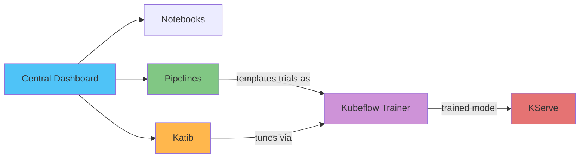

# Kubeflow on EKS 深入解析

> **支持的版本**: Kubeflow Community Distribution 26.03
> **最后更新**: August 19, 2026

## 概述

Kubeflow 是一个面向 Kubernetes 的开源机器学习平台。它以一组 Kubernetes 原生 controllers 和 CRDs 的形式，而非单一的单体应用程序，整合了团队端到端运行 ML workloads 所需的组件——pipeline 编排、notebook、超参数调优、分布式训练和模型服务。2026 年 8 月 17 日，CNCF 宣布 Kubeflow 毕业（它于 2023 年作为孵化项目加入），此前已完成独立安全审计并成立正式指导委员会——这有力地表明该项目已具备生产成熟度。

## 组件地图

| 组件 | 解决的问题 | CRD / 核心概念 | 深入解析 |
|-----------|--------------------|---------------------|-----------|
| **Central Dashboard & Profiles** | 多租户访问、按用户隔离 namespace | Profile (namespace) | [第 1 部分](01-architecture-installation.md) |
| **Kubeflow Pipelines** | 将多步骤 ML workflows 编排为 DAG | `Pipeline`, `Run`, `Experiment` | [第 2 部分](02-pipelines.md) |
| **Kubeflow Notebooks** | 托管的、按用户划分的 Jupyter/RStudio/VS Code 环境 | `Notebook` | [第 3 部分](03-notebooks.md) |
| **Katib** | 超参数调优和 AutoML | `Experiment`, `Trial`, `Suggestion` | [第 4 部分](04-katib.md) |
| **Kubeflow Trainer** | 跨框架的分布式模型训练 | `TrainJob`, `ClusterTrainingRuntime` | [第 5 部分](05-training-operator.md) |
| **KServe** | 模型服务和推理 | `InferenceService` | [第 6 部分](06-kserve.md) |

## 为什么在 EKS 上运行

Kubeflow 的组件设计为可在任何符合规范的 Kubernetes cluster 上运行，这意味着本文档站点已涵盖的 EKS 运维实践——由 Karpenter 驱动的自动扩缩容（包括 GPU node pools）、用于访问 AWS service 的 IRSA/Pod Identity、EBS/S3 storage integration，以及使用 Prometheus/Grafana 的可观测性——可直接应用于 ML workloads，无需构建独立的 ML 专用平台。与完全托管的替代方案（例如 Amazon SageMaker）相比，其权衡与 [EKS 上的数据](../../data-on-eks/README.md) 中所述相同：以更多运维责任（Operator 升级、storage/identity wiring）换取整个 cluster 上所有 workloads 共享的单一部署/可观测性模型，并能够独立运行 Kubeflow 的任一组件，而无需一次性采用整个平台。

## 当前已涵盖内容

1. [第 1 部分：Kubeflow 在 EKS 上的架构和安装](01-architecture-installation.md) — 组件架构、CNCF 毕业背景、通过 EKS 上的 `awslabs/kubeflow-manifests` 安装
2. [第 2 部分：Kubeflow Pipelines](02-pipelines.md) — KFP SDK v2、基于 IR 的 pipeline 编译、由 S3 支持的 artifact storage
3. [第 3 部分：Kubeflow Notebooks](03-notebooks.md) — 按用户划分的 notebook servers、基于 Profile 的多租户、GPU 调度
4. [第 4 部分：Katib — 超参数调优和 AutoML](04-katib.md) — Experiment/Trial/Suggestion 模型、搜索算法、提前停止
5. [第 5 部分：Kubeflow Trainer 和分布式训练](05-training-operator.md) — 从 v1 Training Operator 到 Kubeflow Trainer v2 的迁移、TrainJob/TrainingRuntime
6. [第 6 部分：KServe — Kubernetes 上的模型服务](06-kserve.md) — InferenceService、Serverless 与 Raw Deployment 模式、金丝雀发布
