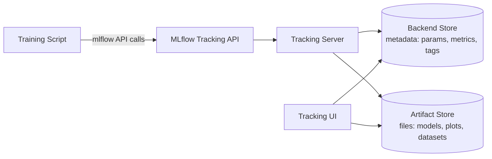

# 第 1 部分：MLflow Tracking

> **支持的版本**：MLflow 3.15.1
> **最后更新**：August 19, 2026

## 实验环境设置

若要跟随本文档中的示例操作，您需要以下工具和环境：

### 必需工具

* Python 3.10 或更高版本
* `pip install mlflow`（本文档假定使用 MLflow 3.x；如果希望与示例完全一致，请安装固定的特定版本，例如 `mlflow==3.15.1`）
* 访问正在运行的 MLflow tracking server，或使用 `mlflow server` 在本地运行一个服务器来执行这些示例——[第 3 部分：EKS 部署](./03-eks-deployment.md) 介绍了如何在 EKS 上搭建生产环境的 tracking server
* 可以添加几行日志记录代码的训练脚本或 notebook（任何 scikit-learn、PyTorch 或类似示例均可）

## 什么是 MLflow Tracking？

MLflow Tracking 是 MLflow 中用于记录和查询机器学习训练运行信息的部分。它将用于记录数据的 Python（以及 REST）API 与用于浏览数据的 UI 相结合。记录的内容分为几类：参数（一次运行的输入，例如学习率或 batch size）、指标（训练期间或之后测量的输出，例如 accuracy 或 loss）、工件（一次运行生成的任意文件，例如图表、数据集或序列化模型），以及——从 MLflow 3 开始——模型本身，它们作为一等实体被追踪，而不再只是普通文件。

所有这些内容都通过一个 **tracking server** 记录；它实际上是在一个 API 背后协同工作的两个存储：用于保存结构化元数据的 backend store，以及用于保存大型二进制文件的 artifact store。本文档的其余部分介绍了日常使用 Tracking 所需的概念；当您部署自己的 tracking server 时，backend store/artifact store 的划分会变得更重要，因此第 3 部分会更深入地回顾它。

## 核心概念：Experiments 和 Runs

一个 **Experiment** 是 Runs 的命名集合——通常每个项目或每个正在迭代的模型对应一个 Experiment。一个 **Run** 是训练代码的一次单独执行：一次训练模型、评估模型，或以其他方式产生值得记录内容的调用。每个 Run 都会捕获自己的参数、指标、标签和工件，因此您可以在同一个 Experiment 内相互比较 Runs，以确定哪种配置的表现最佳。

最简 tracking 调用如下：

```python
import mlflow

with mlflow.start_run():
    mlflow.log_param("learning_rate", 0.01)
    mlflow.log_metric("accuracy", 0.92)
    mlflow.log_artifact("confusion_matrix.png")
```

`with mlflow.start_run()` 上下文管理器会打开一个 Run，将代码块内的每个日志记录调用关联到该 Run，并在退出代码块时自动关闭它。

### 自动日志记录

手动为每个关注的值调用 `log_param` 和 `log_metric` 很快就会变得繁琐。MLflow 的 **自动日志记录** 功能会为常见的 ML 库添加插桩，以便在训练期间自动捕获参数、指标和工件，而无需修改训练代码。只需一次调用即可启用：

```python
mlflow.autolog()
```

这会为当前进程中使用的任意受支持框架启用自动日志记录。MLflow 还提供了框架特定的自动日志记录函数——例如，一个用于 scikit-learn，另一个用于 PyTorch——适用于您只想为某个库而非 MLflow 能检测到的所有库启用自动日志记录的情况。自动日志记录是常规训练 Runs 的良好默认选择；当您需要捕获自动日志记录无法识别的值时，手动日志记录仍然很有用，例如自定义评估指标或特定领域的工件。

## MLflow 3 的转变：模型作为一等实体

如果您使用过 MLflow 1.x 或 2.x，模型追踪的工作方式与现在不同。在早期以 Run 为中心的模型中，记录的模型只是 **嵌套在 Run 下的另一个工件**——您需要在活动的 `mlflow.start_run()` 块中调用 `mlflow.sklearn.log_model(...)`，模型文件会与图表和数据集一起存放在该 Run 的工件目录中。要找到一个模型，您首先必须找到生成它的 Run。

MLflow 3 通过引入独立的一等实体 **`LoggedModel`** 改变了这一点，该实体与生成它的 Run 分离。因此带来了几个结果：

* 您可以直接调用 `mlflow.sklearn.log_model(...)`，无需活动的 `mlflow.start_run()` 上下文——模型无需嵌套在 Run 下即可被追踪。
* tracking UI 提供了专门的 **Logged Models** 视图，与 Experiments/Runs 视图区分开；您可以在其中直接浏览和比较模型，而不是在 Runs 中查找生成所关注模型的那个 Run。
* 由于模型不再只是某个 Run 下的文件，MLflow 3 可以追踪它与相关 Runs、traces、prompts 和评估指标之间更丰富的血缘关系——一个模型可以关联到训练它的 Run、评估它的 Runs，以及通过 serving 它生成的任何 traces，而不再永久绑定到单次训练执行。

这使模型版本控制和比较摆脱了对任何单个训练 Run 的依赖；当您在许多 Runs 中迭代同一个模型，或完全在传统训练循环之外生成模型时，这一点尤为重要（例如，使用自定义逻辑封装现有 LLM）。

## GenAI 和 LLM 可观测性：Tracing

MLflow 最初的范围是经典 ML 实验追踪：训练 Runs 的参数、指标和工件。MLflow 3 将同一 tracking 系统扩展为覆盖 **GenAI 和 agent 可观测性** 的核心功能，而非单独的工具。实现此功能的机制是 **tracing**。

Tracing 会将 LLM 或 agent 调用的内部步骤捕获为 **spans** 树——每个 span 代表一个步骤，例如检索调用、工具调用或对底层模型的调用——同时记录每个步骤的 token 用量和成本。MLflow 为流行的 LLM 和 agent 框架（包括 LangChain）提供自动插桩，并为 PydanticAI 和 smolagents 等框架提供较新的自动 tracing 集成，因此在许多情况下，启用 tracing 几乎不需要或完全不需要修改应用程序代码。Traces 可在用于查看 Experiments 和 Runs 的同一 tracking UI 中查看，并且——体现 MLflow 3 所追踪的血缘关系——可以链接回生成它们的模型、prompt 或评估 Run。

实际意义在于，同时进行经典 ML 训练和 LLM/agent 开发的团队可以将一个 MLflow Tracking 部署用于两者，而不必为 GenAI 方面搭建单独的可观测性工具。

## Backend Store 与 Artifact Store

tracking server 将其存储的内容分为两类，并由两种不同类型的存储提供支持：

* **Backend store**：结构化元数据——参数、指标、标签，以及描述 Experiments、Runs 和（在 MLflow 3 中）记录模型的记录。对于超出快速本地实验的任何团队规模，这需要真正的关系型数据库，例如 PostgreSQL 或 MySQL，而非默认的本地文件存储。
* **Artifact store**：大型二进制对象——模型文件、图表、数据集以及 Run 生成的任何其他文件。它通常是对象存储，例如兼容 S3 的 bucket，而非数据库。

这种划分很重要，因为两种存储具有不同的持久性、扩展性和访问模式要求：数据库非常适合大量小型结构化写入和查询，而对象存储非常适合存储和检索大型文件。[第 3 部分：EKS 部署](./03-eks-deployment.md) 深入介绍了您在 EKS 上运行自己的 tracking server 时所涉及的基础设施选择——目前只需了解这两种存储存在并服务于不同用途即可。



训练脚本绝不会直接与任一存储交互——它始终通过 Tracking API，而 tracking server 使用该 API 将元数据写入路由到 backend store，并将文件写入路由到 artifact store。UI 从两个存储中读取数据以呈现 Experiments、Runs、记录的模型和 traces。

## 后续步骤

本文档介绍了 MLflow Tracking 记录的内容、Experiments 和 Runs 如何组织这些数据、MLflow 3 的 `LoggedModel` 实体如何改变相较于早期嵌套于 Run 的模型的模型追踪，以及 tracing 如何将同一系统扩展至 GenAI 和 agent 可观测性。[第 2 部分：Model Registry](./02-model-registry.md) 介绍了当一个 Run 生成了值得保留的模型后会发生什么：注册模型、对其进行版本控制，以及使用诸如 `champion` 的 alias 将它推向生产环境。[第 3 部分：EKS 部署](./03-eks-deployment.md) 介绍了如何在 EKS 上运行自己的 tracking server，包括上述介绍的 backend store 和 artifact store 选择。

[返回主页](./README.md)

## 测验

要检验您在本章学到的内容，请尝试[主题测验](../../quizzes/ai-ml/mlflow/01-tracking-quiz.md)。
