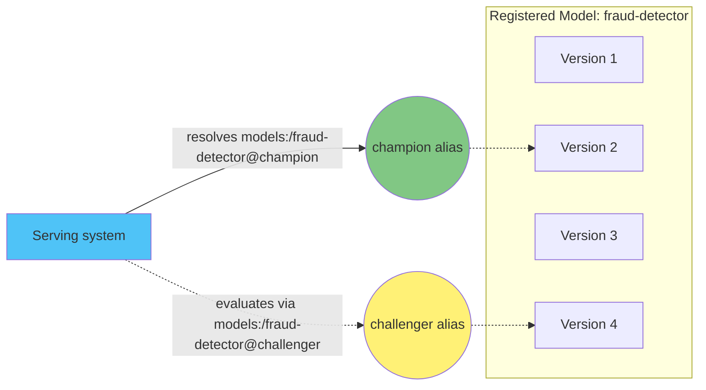

# 第 2 部分：MLflow 模型注册表

> **支持的版本**：MLflow 3.15.1
> **最后更新**：August 19, 2026

## 实验环境设置

要跟随本文档中的示例操作，您需要以下工具和环境：

### 所需工具和资源
- Python 3.10 或更高版本
- `pip install mlflow`
- 可访问具有注册表访问权限的正在运行的 MLflow Tracking Server（有关如何搭建，请参阅[第 1 部分：MLflow Tracking](01-tracking.md)；有关集群托管的 Server，请参阅[第 3 部分：在 EKS 上部署 MLflow](03-eks-deployment.md)）

## 什么是模型注册表

[第 1 部分](01-tracking.md)介绍了 Tracking：针对 Runs 和 Experiments 记录参数、指标、工件和 `LoggedModel` 实体。Run 是一次训练尝试的记录。它并不适合作为“我们交付的模型”的标识，因为 Run 的身份与其发生的时间和方式相关，而不是与其业务含义相关。

模型注册表通过引入**已注册模型（Registered Models）**解决了这个问题：它们是由模型版本组成的具有名称和版本控制的集合，为模型提供独立于任一单独训练运行或实验的稳定身份。团队无需询问“哪个 Run 产生了当前处于生产环境的模型”，而可以询问“`fraud-detector` 现在是什么”，无论之后运行了多少实验，都能得到一致的答案。

注册表用于管理模型从开发到生产的生命周期：注册、审查、晋升以及最终退役，全部通过一个持久名称进行跟踪。

## 核心概念

### 已注册模型

已注册模型是一个名称，例如 `fraud-detector`。它是注册表中的顶级实体。在模型的整个生命周期内，附加到模型的所有版本、别名、标签和描述都会累积在这一个名称下。

### 模型版本

模型版本是以已注册模型名称（`fraud-detector` 版本 1、版本 2 等）注册的不可变编号版本。每个版本只创建一次，之后永不更改；新的训练结果会成为一个新版本，而不是对旧版本的编辑。

每个模型版本都指向其来源的底层 `LoggedModel`（或产生它的 Run）。这将注册表重新连接到 Tracking：版本是指向 Run 历史中特定时间点的指针，而不是已经偏离其来源的副本。

### 别名

别名是指向特定模型版本的可变命名指针，例如 `champion` 或 `challenger`。与版本号不同，别名可以移动：今天 `champion` 可能指向版本 4，成功评估后，团队可以将其重新指向版本 7，而无需改动任何使用该别名的内容。

别名是目前在注册表中表示模型角色或生命周期阶段的主要机制。服务系统或下游作业可以一次性编写为解析 `models:/fraud-detector@champion`，它始终会加载当前持有该别名的版本；当底层版本变化时，无需修改代码。

### 旧版阶段模型（仅供参考）

较旧的 MLflow 部署使用不同的机制：每个模型版本都带有一个**阶段（stage）**，即 `Staging`、`Production` 或 `Archived` 之一；推进模型意味着转换其阶段。该模型已被别名与标签的组合取代，它们更加灵活，因为一个版本可以拥有多个别名（或没有别名），并且别名名称不受固定生命周期标签集合的限制。新工作应使用别名和标签，而非阶段。遇到使用阶段转换的旧版 MLflow 部署的读者，看到的正是这种旧版方法。

## 注册模型

模型版本可通过两种方式之一创建，两者都基于第 1 部分涵盖的内容。

**记录后注册。** 训练 Run 将模型作为工件（或根据第 1 部分作为 `LoggedModel`）记录后，可以通过调用 `mlflow.register_model(model_uri, name)` 单独注册，其中 `model_uri` 指向已记录的模型，`name` 是要在其下注册模型的已注册模型。当注册模型的决定与训练步骤本身分离时，这种方式非常适合——例如，一个审查步骤只注册满足评估阈值的模型。

**记录时注册。** 或者，特定 flavor 的 `log_model` 调用上的 `registered_model_name` 参数（例如 `mlflow.sklearn.log_model(..., registered_model_name="fraud-detector")`）会在记录模型的同一调用中，将模型注册为新的模型版本。当给定训练脚本的每次运行都应自动产生候选版本时，这种方式非常适合。

任一路径都会在指定的已注册模型下创建新的不可变模型版本。两条路径都不会移动别名——这是下文所述的一项独立且有意的操作。

## 治理与交接工作流

注册表的主要组织价值在于，它是两项不同关注点之间的交接点：生成候选模型，以及决定哪个候选模型足够可信、可以提供服务。

典型工作流如下：

1. 数据科学团队训练模型，并使用上述任一注册路径，将每个有前景的结果注册为共享已注册模型名称下的新模型版本。
2. 评估或审批流程——可在 CI/CD 中自动执行、手动执行，或两者兼有——根据测试数据、公平性检查或业务指标审查候选版本。
3. 只有版本通过这些关卡后，才会有某个操作将 `champion` 别名移动为指向它；通常通过自动化流水线中的客户端 API（`set_registered_model_alias`）完成，而非手动操作。
4. 本部分不涵盖的服务基础设施会一次性编写为解析 `models:/fraud-detector@champion`，且永远无需硬编码版本号。当 `champion` 移动时，下一次解析会直接获取新版本。

这种分离意味着生成候选模型的人员或系统永远无需直接控制生产环境中提供服务的内容，而使用模型的系统也永远无需手动跟踪版本号。`challenger` 别名通常与 `champion` 一同使用，用于标记正在评估以便晋升的版本，而不会干扰当前正在提供服务的内容。

## 谱系与可复现性

由于每个模型版本都保留了指向产生它的 Run 的链接（并通过该 Run 链接到第 1 部分中的参数、代码和数据集引用），团队始终可以回答这样的审计问题：“哪段确切的代码和哪些数据生成了当前作为 `champion` 提供服务的模型？”链路为：别名、模型版本、Run、该 Run 记录的参数和工件。

模型版本还支持自己的标签和描述，独立于底层 Run 的标签。这对于记录注册表特有的上下文非常有用——例如，谁批准了某个版本的晋升，或证明移动别名合理的评估报告链接——而不会将该信息混入训练 Run 自己的元数据中。

## 后续步骤

第 2 部分介绍了注册表本身：已注册模型、模型版本、作为当前生命周期机制的别名，以及注册如何重新连接到[第 1 部分：MLflow Tracking](01-tracking.md)。将已注册模型加载到实际推理端点是另一个关注点，不在本系列的范围内——[第 3 部分：在 EKS 上部署 MLflow](03-eks-deployment.md)则介绍了设置 Tracking 和模型注册表都依赖的 Tracking Server 与后备存储。

[返回主页面](./README.md)

## 测验

通过[模型注册表测验](../../quizzes/ai-ml/mlflow/02-model-registry-quiz.md)测试您的理解。
