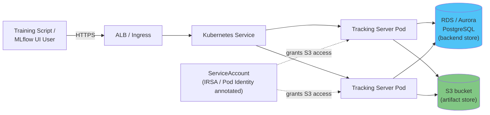

# 第 3 部分：在 EKS 上部署 MLflow

> **支持的版本**：MLflow 3.15.1、Kubernetes 1.34+
> **最后更新**：August 19, 2026

## 实验环境设置

要跟随本文档中的示例操作，您需要以下工具和环境：

### 必需工具

* kubectl v1.34 或更高版本，并指向一个正常运行的 Amazon EKS 集群
* Helm v3（如果您选择使用社区 Helm chart 的安装路径）
* 用于 backend store 的现有 Amazon RDS 或 Aurora PostgreSQL 实例（或能够预置一个实例）
* 用于 artifact store 的 S3 bucket
* 一个 IRSA role 或 EKS Pod Identity association，用于授予 tracking server 对该 S3 bucket 的访问权限

## 为什么要在 EKS 上运行 MLflow 的 Tracking Server

这里的权衡遵循本文档站点中介绍的其他自托管 ML 基础设施相同的模式。已经运行 EKS 的团队可以将用于 MLflow 的 deployment manifests、observability stack 和 IAM 模式（IRSA 或 Pod Identity）复用于集群中的其他所有工作负载，而不必学习一种独立的运维模式。作为交换，该团队需要自行运维 tracking server process，以及其 backend store 和 artifact store，而不是将训练代码指向托管替代方案——例如 Databricks 托管的 MLflow 或 SageMaker 兼容 MLflow 的 tracking 功能。两种选择都并非在所有情况下正确；这取决于团队是希望在现有的 Kubernetes 运维体系中再增加一个 Service，还是完全少运维一个 Service。

## 架构

EKS 上的生产级 MLflow deployment 包含三个组成部分，一旦真实团队共享 tracking server，它们缺一不可。

**MLflow Tracking Server。** 这是一个运行 `mlflow server` 的 container，同时公开 client SDK（`mlflow.log_metric`、`mlflow.log_artifact` 等）使用的 REST API，以及供用户浏览 experiments 和 runs 的 Web UI。它在设计上是无状态的——所有持久状态都存储在 backend store 和 artifact store 中——因此非常适合部署在 Kubernetes Deployment 中，并由一个 Service 和一个 Ingress（通常由 AWS Load Balancer Controller 预置 ALB）提供前端访问。

**Backend store。** MLflow 的默认 backend store 是本地 SQLite 文件，这对于笔记本电脑上的单个实验人员足够，但只要多个 process 需要并发写入就会失效——SQLite 根本不支持共享团队 tracking server 所需级别的并发访问。在 AWS 上，标准替代方案是真正的关系型 database：Amazon RDS for PostgreSQL，或者如果您希望 database 随 tracking 负载扩缩容而不是预先确定规格，则使用 Aurora Serverless v2。backend store 保存 MLflow 的全部结构化 metadata——experiments、runs、parameters、metrics、registered models、model versions 和 aliases（请参见[第 2 部分](02-model-registry.md)）——即所有适合使用 SQL 查询的内容。

**Artifact store。** Backend store 的行记录很小；MLflow 与其一同记录的内容通常并非如此。序列化模型、图表、datasets 和其他大型二进制对象会存储到独立的 artifact store 中，而不是 database。在 AWS 上，这就是 Amazon S3：tracking server 会在配置为默认 artifact root 的 S3 URI 下写入和读取 artifacts；根据 server 的配置，clients 可通过 tracking server 的 proxy 获取 artifacts，也可以直接访问 S3。



## 安装方式

有两条实用途径可以让上述组件在集群中运行。

**编写自己的 manifests。** 为 `mlflow server` container 创建一个 Deployment，在其前方创建一个 Service，并创建一个 Ingress（或一个 `LoadBalancer` 类型的 Service）将其暴露到外部；将 backend store connection string 和 S3 artifact root 作为 environment variables 或 command-line flags 传递给 container。这样可以完全控制每个细节，但代价是需要自己维护 YAML。

**使用社区 Helm chart。** `community-charts/helm-charts` 项目维护了一个专门用于此用例的 MLflow chart：

```bash
helm repo add community-charts https://community-charts.github.io/helm-charts
helm repo update
helm search repo community-charts/mlflow
```

该 chart 在概念层面公开了上述组件的配置：将 backend store 指向外部 database connection 而不是 SQLite，将 artifact store 指向 S3 bucket，以及通常的 Kubernetes 相关配置，例如 replica count、resource requests 和 Ingress settings。部署前请查阅该 chart 自身的文档，以确认确切的 `values.yaml` keys 和当前默认值，因为这些内容可能会在不同 chart versions 之间发生变化。

无论采用哪种方式，最终运行时架构都相同：一个或多个无状态 tracking server Pods、一个所有 Pods 都指向的 database，以及一个所有 Pods 都指向的 S3 bucket。

## 对 Artifact Store 的 IAM 访问

tracking server Pod 需要 AWS permissions 才能读取和写入 S3 artifact bucket 中的对象——例如限定到该 bucket prefix 的 `s3:PutObject` 和 `s3:GetObject`。在 EKS 上，将 IAM role 绑定到 Kubernetes ServiceAccount 的长期机制是 IRSA（IAM Roles for Service Accounts）；它会使用 `eks.amazonaws.com/role-arn` 注解 ServiceAccount，使使用它的 pods 获得该 role 的临时 credentials。EKS Pod Identity 是一种较新的机制，可将 IAM roles 绑定到 pods，并且无论工作负载为何，它日益成为在 EKS 上创建新的 IAM-to-pod bindings 时推荐的默认选择。这两种机制都能让静态 AWS credentials 不出现在 tracking server 的环境和配置中：对于新的 MLflow deployment，Pod Identity 是更现代的起点；对于已经将 IRSA 标准化的 clusters 或 teams，IRSA 仍然是有效选择。

## 运维说明

**运行多个 replicas。** 由于由 Postgres 支持的 tracking server 是无状态的——所有共享状态都存在 database 和 S3 中，而非 Pod 中——因此可以安全地在 Service 和 Ingress 后方运行多个 replicas 以实现可用性。这与基于 SQLite 的单 process 默认配置有显著区别：后者根本无法安全地横向扩展，因为 SQLite 无法容忍 concurrent writers。

**配置 health probes。** 与任何长期运行的 Kubernetes service 一样，应针对 tracking server 的 health endpoint 配置 readiness 和 liveness probes，以便 Service 仅将流量路由到确实能够处理 requests 的 Pods，并让卡住的 Pod 自动重启。请根据正在运行的 MLflow version 确认可用的确切 health-check path，而不要想当然地使用某个路径，因为它可能因 release 而异。

**根据写入模式调整 database 规格。** 每个记录的 parameter、metric 和 metric step 都会向 backend store 写入数据，因此以高频率记录 metrics 的 training jobs（例如每个 step 而不是每个 epoch）会给 database 带来实际负载。尤其值得考虑 Aurora Serverless v2，因为它能够吸收训练运行中突发的 tracking 负载，而无需让 database 全年都按峰值负载配置规格。

## 后续步骤

至此，三部分的 MLflow 系列结束：[第 1 部分](01-tracking.md)介绍了记录 experiments 和 runs，[第 2 部分](02-model-registry.md)介绍了如何在 Model Registry 中赋予训练模型稳定、带版本的标识，而本部分介绍了在 EKS 上运行 tracking server、backend store 和 artifact store。一旦模型具有 registered version 或 alias，许多团队自然会继续将该特定版本加载到 serving system 中——KServe、自定义 FastAPI 或 Flask wrapper、SageMaker，或完全不同的其他方案。该 serving layer 本身是一个广泛主题，不在本系列的范围内。

[返回主页](./README.md)

## 测验

要测试您在本章中所学的内容，请尝试[主题测验](../../quizzes/ai-ml/mlflow/03-eks-deployment-quiz.md)。
