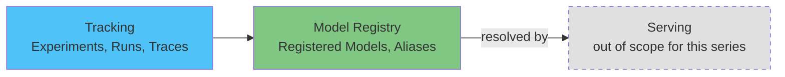

# EKS 上的 MLflow 深度解析

> **支持的版本**: MLflow 3.15.1
> **最后更新**: August 19, 2026

## 概述

MLflow 是一个用于管理机器学习生命周期的开源平台——包括实验跟踪、模型打包与版本控制，以及（自 MLflow 3 起）GenAI/LLM 可观测性——通过一个任何训练脚本或 agent 都可以经由简单 API 记录数据的跟踪服务器实现。不同于捆绑一整套 Kubernetes 原生控制器平台的 Kubeflow，MLflow 是一项单独的服务（一个跟踪服务器及其后端/制品存储），团队通常将其与 Kubeflow、自定义训练配置一起运行，或完全独立运行。

## 组件图

| 概念 | 它解决的问题 | 深度解析 |
|---------|--------------------|-----------|
| **跟踪** | 记录和查询实验参数、指标、制品、模型及 GenAI 追踪信息 | [第 1 部分](01-tracking.md) |
| **模型注册表** | 为模型提供独立于任何单次训练运行的稳定、版本化身份 | [第 2 部分](02-model-registry.md) |
| **EKS 部署** | 在 EKS 上运行跟踪服务器、后端存储和制品存储 | [第 3 部分](03-eks-deployment.md) |

## 为什么在 EKS 上运行此服务

这里的权衡与本文档站点其他数据/ML 章节所述相同：已经运行 EKS 的团队可以将相同的部署、IAM（IRSA/Pod Identity）和可观测性模式用于 MLflow 的跟踪服务器，就像用于集群中的其他所有工作负载一样；相应地，需要直接运维跟踪服务器、其后端数据库和制品存储，而非使用托管替代方案。

## 当前涵盖内容

1. [第 1 部分：MLflow 跟踪](01-tracking.md) — 实验、运行、自动记录、MLflow 3 的 `LoggedModel` 转变，以及 GenAI 追踪
2. [第 2 部分：MLflow 模型注册表](02-model-registry.md) — Registered Models、Model Versions、别名和血缘
3. [第 3 部分：在 EKS 上部署 MLflow](03-eks-deployment.md) — 跟踪服务器、PostgreSQL 后端存储、S3 制品存储和 IAM 访问
