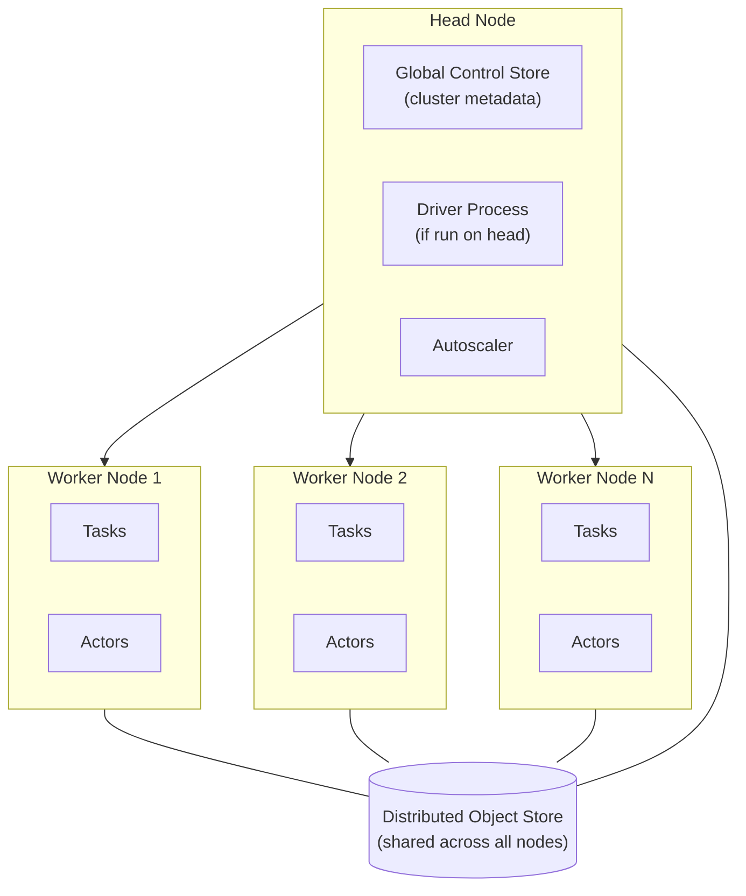

# 第 1 部分：Ray 架构

> **支持的版本**: Ray 2.57.0
> **最后更新**: August 20, 2026

## 实验环境设置

若要跟随本文档中的示例操作，你需要以下工具和环境：

### 必需工具

* Python 3.10 或更高版本
* `pip install ray[default]`（`default` extra 会引入后续示例所用的 dashboard 和 cluster-launcher 依赖项；普通的 `pip install ray` 只会安装本文档所示的核心 API）
* 一台具有几个可用 CPU 核心的本地计算机或 VM 足以运行以下示例 — 第 1 部分不需要集群

## 什么是 Ray？

Ray 是一个用于扩展 Python 工作负载的开源分布式计算框架。它不像仅用于训练或仅用于服务的工具那样，是为某一种特定工作负载构建的框架。相反，Ray 提供了一小组通用原语，让你只需进行相对较少的重写，就能将普通 Python 代码运行在许多 CPU 核心或多台机器上。

这些原语足够通用，能够覆盖广泛的使用场景：并行化临时的一批函数调用、运行分布式模型训练、在许多试验中进行超参数搜索，或在可扩展的推理端点后提供模型服务。Ray 的高级库 — Ray Train、Ray Tune 和 Ray Serve，下面会简要介绍，并在本系列后续部分深入讲解 — 都构建在相同的底层原语之上，而不是彼此无关的独立工具。这一共享基础是 Ray 与由各自拥有执行模型、恰好被打包在一起的单点工具生态系统之间的关键架构差异。

## 核心原语

Ray 的编程模型基于三种原语：任务、actor 和对象存储。

### 任务

**任务**是由 Ray 在远程运行，而非在调用进程中运行的无状态函数。通过向普通 Python 函数应用 `@ray.remote` 装饰器，可以将其转换为任务。调用已装饰的函数会立即返回一个 future（`ObjectRef`），而不会阻塞到函数完成；Ray 会在集群资源池中的某个 worker 上调度实际执行。由于任务在调用之间不携带状态，Ray 可以自由地在任何有可用容量的 worker 上运行任意给定调用，这正是任务易于横向扩展的原因。

任务非常适合易于并行化的工作：将同一个函数应用于许多独立输入、运行许多独立模拟，或预处理许多数据分片。由于每次任务调用都是独立且无状态的，Ray 可以在整个集群中调度大量任务，而无需跟踪一次调用与下一次调用之间的任何关系。

### Actors

**actor** 是任务的有状态对应项。向 Python 类应用 `@ray.remote` 会将其转换为 actor：Ray 会在某个 worker 上实例化该类，并将该实例作为长期运行的远程进程保持存活，而不是进行一次调用后返回并消失。随后，对 actor handle 的方法调用会被路由到同一个存活实例，因此存储在实例上的状态 — 模型权重、计数器、开放连接 — 会在调用之间保持不变。

每当你需要在调用之间保留状态时，actor 都是正确的原语：累积计数器、保留在内存中而非为每个请求重新加载的已加载模型，或逐步推进的有状态模拟。任务和 actor 是互补而非竞争的选择 — 典型的 Ray 应用程序会混合使用两者，对无状态的并行工作使用任务，并在需要持久状态的地方使用 actor。

### 对象存储

**对象存储**是一个分布式共享内存存储，用于保存任务和 actor 彼此传递的对象 — 函数参数、返回值，以及显式放入其中的任何其他内容。集群中的每个节点都会运行自己的本地对象存储，Ray 会根据需要协调它们之间的数据移动，从而让一个 worker 上运行的任务能够读取另一个 worker 生成的对象。

对象存储对于大型对象尤其重要：大型 NumPy 数组、数据集分片或模型权重。Ray 不必将此类对象序列化并复制到每个需要它的进程中，而是可以在一个节点的共享内存中保留一份副本，让多个本地进程读取它，而不在每个进程自身的内存中重复存储。这使得 Ray 能够在任务和 actor 之间高效移动大型数据，而不是在每次调用时都付出序列化和复制的成本。

## 集群架构：Head Node 和 Worker Node

Ray 集群由一个 **head node（头节点）** 和任意数量的 **worker node（工作节点）** 组成。每个节点 — 无论是 head 还是 worker — 都运行 Ray 进程，并向集群的共享资源池贡献 CPU、GPU 和内存。

除了 worker 所做的工作外，head node 还承担一些额外职责：

* **Global Control Store (GCS)**：集群的元数据存储，用于跟踪哪些 actor 和对象存在及其所在位置，以及调度和故障恢复所依赖的其他集群状态。
* **Driver process**：如果你在 head node 上运行顶层 Ray 脚本或交互式会话，执行该脚本的 driver 位于此处，并将任务和 actor 调用提交到集群中。
* **Autoscaler**：当集群的待处理工作负载需要更多资源时请求额外 worker node，以及在不再需要时移除空闲 worker 的进程。

Worker node 用于运行任务和 actor，并将其 CPU、GPU 和内存添加到整个集群使用的资源池中。Ray 调度模型的一个关键特性由此而来：Ray 根据集群的合并资源池调度任务和 actor，而不是孤立地针对任一节点的资源进行调度。请求两个 CPU 的任务可以落到集群中任何有两个空闲 CPU 的节点上 — 调度器不会像你可能手动将工作放置到特定机器上那样预先选择一个节点。

每个节点都参与分布式对象存储，因此一个 worker node 上的任务生成的对象可由另一个 worker node 上运行的任务或 actor 读取，Ray 会处理它们之间的数据移动。

## 构建于相同基础之上的高级库

Ray 提供了多个面向特定 ML 工作负载的高级库，它们都构建在上述任务、actor 和对象存储之上，而非引入各自独立的执行模型：

* **Ray Train** 可在许多 worker 之间分布模型训练，本系列的[第 3 部分：Ray Train 和 Ray Tune](./03-ray-train-tune.md)对此进行了介绍。
* **Ray Tune** 可并行地在许多试验中执行超参数搜索，也将在第 3 部分中介绍。
* **Ray Serve** 可在可扩展的服务层后部署模型，本系列的[第 4 部分：Ray Serve](./04-ray-serve.md)对此进行了介绍。

这一共享基础值得明确指出：Ray 并非将为某一种工作负载类型各自重新实现调度、容错和数据移动的独立工具打包在一起，而是在其核心原语中一次性实现这些关注点，并让每个高级库复用它们。分布式训练和超参数调优在底层都是作为 Ray actor 或任务运行的 worker，并通过与普通 `@ray.remote` 函数相同的对象存储交换数据。

截至本文撰写时，Ray 2.57.0 是最新的稳定版本。Ray 3.0 开发线是值得了解的未来背景，但尚未发布，因此本文档不依赖于其任何特定功能。

## 这对 Kubernetes 为什么重要

Ray 有自己的集群概念 — head node、worker node，以及扩展或缩减 worker 队列的 autoscaler — 这与 Kubernetes 自己的调度和自动扩缩容属于不同层次。在 Kubernetes 上运行 Ray 意味着需要将 Ray 集群的形态（一个 head、一定数量的 worker，每个都具有特定资源需求）转换为 Kubernetes 调度器能够实际理解并放置到 EKS 节点上的 Kubernetes 对象，例如 Pod 和 Deployment。这种转换正是本系列接下来[第 2 部分：KubeRay Operator](./02-kuberay-operator.md)所涵盖的问题。

## 后续步骤

本文档介绍了 Ray 是什么、它的三种核心原语（任务、actor 和对象存储），以及 Ray 集群的 head node 和 worker node 如何协作，在共享资源池中调度工作。[第 2 部分：KubeRay Operator](./02-kuberay-operator.md)介绍 KubeRay operator 如何将此 Ray 集群模型映射到 EKS 上的原生 Kubernetes 资源。[第 3 部分：Ray Train 和 Ray Tune](./03-ray-train-tune.md)和[第 4 部分：Ray Serve](./04-ray-serve.md)则分别在这里介绍的原语基础上构建训练和服务工作负载。

[返回主页面](./README.md)

## 测验

若要测试你在本章中学到的内容，请尝试[主题测验](../../quizzes/ai-ml/ray/01-architecture-quiz.md)。
