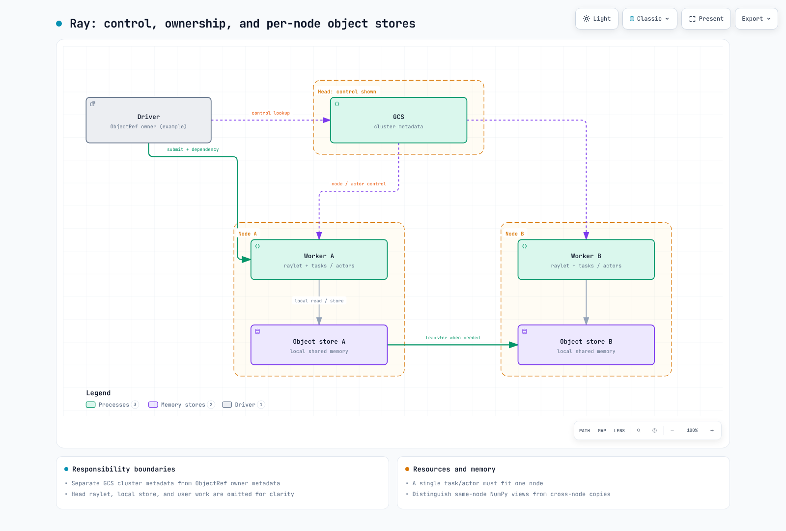

# 第 1 部分：Ray 架构

> **审查基线**：Ray 2.58.0 · 2026-09-12

## 实验环境设置

本地示例使用 Python 3.12、`ray==2.58.0` 和 `numpy==2.2.6` 进行了验证。其中的任务、actor 和 ObjectRef 检查不需要 GPU、训练模型或 Kubernetes。启用 dashboard 等功能时，请单独检查相关的额外依赖项。

该示例显式配置了两个逻辑 CPU 和一个 80 MiB 的对象存储，然后关闭 Ray。Ray 资源设置并不是操作系统对总 CPU/RAM 的限制；控制进程和 worker 进程还需要额外的内存。

## 什么是 Ray？

Ray Core 提供远程函数（任务）、有状态远程实例（actor）、ObjectRef 和每节点对象存储。Train、Tune 和 Serve 构建于这一基础之上。共享 Core 并不能消除它们自身的控制器、重试、检查点或框架通信逻辑。

## 核心原语

### 任务

应用 `@ray.remote` 后，通过 **`f.remote(...)`** 提交。将其作为普通的 `f(...)` 调用是错误的。单返回值示例会产生一个 `ObjectRef`，可使用 `ray.get()` 读取。

以无状态方式调用任务并不能保证它是没有副作用的纯函数。文件/数据库修改需要针对重试制定幂等性策略。worker 可以被复用；偶然存续的模块全局缓存不同于显式状态管理。

Ray 会跟踪依赖关系。将上游 ObjectRef 作为顶层参数传递给另一个任务，会创建对该值就绪的依赖。任务不一定彼此独立。

### Actor

`Actor.remote()` 会创建远程实例的句柄；`handle.method.remote()` 会向其提交方法。该实例内存中的计数器、连接或模型可以在多次调用间复用。

这不是自动的持久化存储。在 2.58.0 中，`max_restarts` 默认为 0。配置重启会重新运行构造函数；它不会自动恢复应用程序状态。请分别设计检查点和恢复机制，并区分同步、async 和 threaded actor 的并发性/顺序。

### 对象存储

远程值是不可变的，可以存储或复制到节点本地对象存储中。对一个值的引用并不会让每个节点共享同一块物理内存区域。跨节点访问可能涉及传输和序列化开销。

**同一节点上的 NumPy 数组** 可以通过只读共享内存视图读取。修改前请复制它们。这并不意味着所有 Python 对象、跨节点传输或 GPU tensor/模型权重都具有零拷贝行为。小值和大值也可能使用不同的传输路径。

## 小型本地示例

此示例检查 API 行为，而不是训练性能或基准测试。

```python
import ray
import numpy as np

try:
    ray.init(address="local", num_cpus=2, include_dashboard=False,
             object_store_memory=80 * 1024 * 1024)

    @ray.remote(num_cpus=1)
    def twice(value):
        return value * 2

    first = twice.remote(2)
    second = twice.remote(first)  # ObjectRef dependency
    assert ray.get(second, timeout=15) == 8

    @ray.remote(num_cpus=1)
    class Counter:
        def __init__(self):
            self.value = 0
        def increment(self):
            self.value += 1
            return self.value

    counter = Counter.remote()
    assert ray.get([counter.increment.remote(),
                    counter.increment.remote()], timeout=15) == [1, 2]
    ref = ray.put(np.arange(256_000, dtype=np.int64))
    array = ray.get(ref, timeout=15)
    assert not array.flags.writeable
finally:
    ray.shutdown()
```

小型单节点练习并不能证明多节点故障恢复、GPU 内存共享或网络性能。

## 集群架构：Head Node 和 Worker Node

head 运行包括 **Global Control Service (GCS)** 在内的集群控制组件。Raylet、worker 进程和本地对象存储参与 head 与 worker 上的执行和数据移动。head 可以声明零个逻辑 CPU 来限制用户任务调度；它不必提供与 worker 相同的计算资源。

driver 执行顶层应用程序。它不一定运行在 head 上；调度位置取决于提交方式。autoscaler 也是一个已配置的部署组件，并不意味着每次本地 `ray.init()` 都会自动配置更多 worker。

GCS 管理 actor、节点和 placement group 等集群元数据。**不要将其描述为所有对象元数据的集中式所有者。** 创建原始 ObjectRef 的进程是对象所有者，并且可能不同于计算该值的 worker。

### 资源调度

Ray 在选择候选节点时会考虑集群状态，但**每个任务/actor 都必须能容纳在一个可行节点上**。两个各有一个空闲 CPU 的节点无法共同执行一个需要两个 CPU 的任务。可行性、可用性、数据局部性以及 placement/label/affinity 约束都很重要。

逻辑 CPU/GPU 资源用于指导准入和调度。`num_cpus=1` 并不会强制进程中的每个 OS thread 都运行在一个物理核心上。请分别配置容器 requests/limits 和库线程数。



[交互式图表](https://www.atomai.click/kubernetes-docs/archmaps/en-ai-ml-ray-01-architecture-0.html)

## 故障恢复和高级库

默认情况下，GCS 在内存中运行；head 故障后的恢复需要额外配置持久化后端。2.58.0 文档将受支持的外部 Redis 与嵌入式 RocksDB **alpha** 区分开来。恢复 GCS 元数据并不会恢复每个 actor 的应用程序状态或对象值。

对象恢复取决于所有权、lineage 以及重试/重建资格。不要将 `ray.put()` 值等同于可重新计算的任务输出，也不要将对象溢写等同于长期备份。

Train、Tune 和 Serve 会复用 Core，同时添加训练检查点、trial 调度和 serving controller 等策略。框架 collectives 和其他训练通信不能全部描述为通过单一对象存储路径的流量。

## 为什么这在 Kubernetes 上很重要

KubeRay 会将 RayCluster、RayJob 和 RayService 等 CR 协调为 Ray Pod 和相关资源。Ray 任务/actor 调度、Kubernetes Pod 调度，以及 Karpenter 等工具实际配置 EC2，属于不同层面。KubeRay 并不是会自动为应用程序选择 Train、Tune 或 Serve 的调度器。

## 主要来源

- [Ray 2.58.0 发布版](https://github.com/ray-project/ray/releases/tag/ray-2.58.0)
- [对象](https://docs.ray.io/en/releases-2.58.0/ray-core/objects.html)
- [序列化和 NumPy 零拷贝](https://docs.ray.io/en/releases-2.58.0/ray-core/objects/serialization.html)
- [调度](https://docs.ray.io/en/releases-2.58.0/ray-core/scheduling/index.html)
- [逻辑资源](https://docs.ray.io/en/releases-2.58.0/ray-core/scheduling/resources.html)
- [Actor 故障容错](https://docs.ray.io/en/releases-2.58.0/ray-core/fault_tolerance/actors.html)
- [对象故障容错](https://docs.ray.io/en/releases-2.58.0/ray-core/fault_tolerance/objects.html)
- [GCS 故障容错](https://docs.ray.io/en/releases-2.58.0/ray-core/fault_tolerance/gcs.html)

[下一篇：KubeRay](02-kuberay-operator.md) · [主页](README.md) · [测验](../../quizzes/ai-ml/ray/01-architecture-quiz.md)
