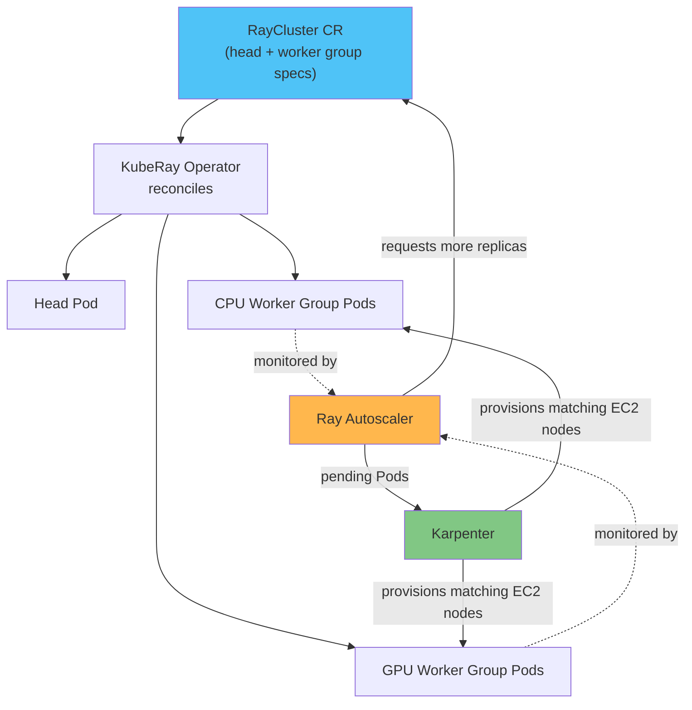

# 第 2 部分：KubeRay Operator

> **支持的版本**: KubeRay v1.6.1, Ray 2.57.0
> **最后更新**: August 20, 2026

## 实验环境设置

要跟随本文档中的示例操作，您需要以下工具和环境：

### 必需工具

* kubectl v1.34 或更高版本，已连接到一个可用的 Amazon EKS 集群
* Helm v3
* 如果您计划测试 GPU worker group，则需要通过 Karpenter 配置的、具备 GPU 能力的 `NodePool`/`EC2NodeClass` 组合

## KubeRay 的作用

[第 1 部分](01-architecture.md)介绍了一个 Ray 集群由一个 head node 和一个或多个 worker node 组构成。这种形态是 Ray 原生概念，而不是 Kubernetes 概念，因此需要某种机制将其转换为 Kubernetes 所理解的实际 Pod、Service 及其他对象。这个机制就是 KubeRay。

KubeRay 是一个 Kubernetes operator，它将 Ray 集群作为原生 Kubernetes custom resource 进行管理。operator 用户无需为 head node 和每个 worker group 手动编写 Deployment、StatefulSet 和 Service，而是在 YAML manifest 中声明所需的 Ray 集群形态；KubeRay 的 controller 会持续将集群的实时状态与该声明的 spec 进行协调。这正是“Ray on Kubernetes”具有声明式特性的原因：所需状态存在于 custom resource 中，而 operator 负责创建、更新和删除底层 Pod，使其与该状态匹配。

本文档面向 **KubeRay v1.6.1**——请查看 [KubeRay releases page](https://github.com/ray-project/kuberay/releases) 获取当前版本，因为 KubeRay 有独立于本文档的发布节奏。KubeRay v1.6 增加了对 Ray authentication token mode 的完整支持（用于保护对运行中集群 dashboard 和 client port 的访问），并将 RayJob 切换为更轻量的默认 submitter image，从而提升了相对于此前默认配置的 RayJob 启动性能。更早的 v1.5 版本已经为 RayService 增加了增量式滚动升级，目标是在零停机更新的同时，比整个集群完整 blue-green 替换拥有更低的资源开销——但在依赖该功能前，请查看当前 release notes，因为随着项目成熟，此类功能可能会从需要显式启用、受 feature gate 控制的状态转变为默认启用。

## 核心 CRD

KubeRay 通过三个 Custom Resource Definition 提供其大部分功能，每个 CRD 面向一种在 Kubernetes 上运行 Ray 的不同方式（KubeRay Helm chart 还会为较新的、仍在演进的能力安装 CRD——在认定这三个 CRD 已涵盖全部功能之前，请查看当前 release notes 了解完整列表）。

**RayCluster** 是基础资源：一个原始 Ray 集群，由一个 head Pod 和一个或多个 worker group 组成。每个 worker group 是一组同质的 worker Pod——例如，用于通用 Ray task 的 CPU worker group，以及用于模型训练或 inference 的独立 GPU worker group。KubeRay operator 持续将实际 Pod 与 RayCluster spec 进行协调，并在 spec（或下文介绍的 autoscaler）改变某个组所需 replica 数量时，创建或移除 worker Pod。

**RayJob** 向 Ray 集群提交 batch job，并且可以选择管理该集群的完整生命周期：创建 RayCluster、在其上运行提交的 job，以及在 job 完成后拆除集群。它非常适合一次性或定时的 batch workload，因为它避免了为两次运行之间处于闲置状态的集群持续付费。

**RayService** 面向生产环境的模型服务。它管理一个 RayCluster 及其上部署的 Ray Serve application，并能够对底层集群和 application 执行旨在实现零停机的滚动升级——在生产环境中依赖该功能前，请查看当前 release notes，确认该升级路径的成熟度及任何前置条件。



## 双层自动扩缩：Ray Autoscaler 和 Karpenter

在 EKS 上运行 Ray 意味着需要处理两个独立的自动扩缩控制循环，本文档站点也针对 Flink 和 Katib 等其他自动扩缩 workload 介绍了这一模式。每个循环回答不同的问题，二者都无法回答对方的问题。

**Ray autoscaler** 作为 Ray 集群自身的一部分运行，并由 KubeRay 协调。它监控 Ray 自身的调度状态——无法部署到当前 worker 上的 pending task 和 actor——并决定需要多少 Ray worker Pod。它通过调整相关 RayCluster worker group 的 replica 数量来落实这一决定，进而指示 KubeRay operator 创建（或移除）worker Pod。autoscaler 还具有 `idleTimeoutSeconds` 设置，默认值为 60 秒；它定义了 worker Pod 在没有 task、actor 或被引用 object 的情况下，必须保持空闲多久才会被 autoscaler 缩容。

**Karpenter**（或者在未使用 Karpenter 的集群上使用 Kubernetes Cluster Autoscaler）在下一层，即 Kubernetes node 层面运行。它不了解 Ray task 或 actor；它只对因没有 node 可容纳而处于 pending 状态的 Pod 作出响应，并配置大小与这些 pending Pod 相匹配的新 EC2 node。

综合来看：Ray autoscaler 决定集群需要*多少 Ray worker Pod*，而 Karpenter 决定实际运行它们需要*多少 EC2 node*。一个控制循环负责 Pod 数量，另一个控制循环负责 node 数量，它们只通过 pending Pod 的常规 Kubernetes 调度状态间接通信。有关该循环中 node 配置一侧的更深入说明，请参阅本仓库的 [Karpenter 文档](../../autoscaling/02-karpenter.md)。

## GPU 调度

GPU worker group 的 Pod spec 是该组 Ray worker 能看到多少 GPU 的唯一事实来源。当 worker group 的 container spec 设置 GPU resource limit——例如 `nvidia.com/gpu: 1`——KubeRay 会读取该 limit，并将其作为生成的 worker Pod 上的 GPU capacity 通告给 Ray scheduler 和 Ray autoscaler。KubeRay 还会自动配置该 worker 上 Ray process 的 `--num-gpus` flag，使其与 Pod spec 的 GPU limit 相匹配，因此无需再手动维护另一处 GPU 数量。

这意味着，GPU 感知调度和 GPU 感知自动扩缩都源自同一份 Kubernetes 原生声明。只有在确实存在 GPU 绑定的 pending task 时，Ray autoscaler 才会请求更多 GPU worker replica；Karpenter 则使用 [Karpenter](../../autoscaling/02-karpenter.md) 中所述的 node pool 和 node class 配置来配置满足这些 Pod 需求的、由 GPU 支持的 EC2 node——本文档不再重复推导该机制。

## 安装 Operator

安装 KubeRay 的标准方法是使用官方 Helm chart，该 chart 发布自 `ray-project/kuberay-helm` repository：

```bash
helm repo add kuberay https://ray-project.github.io/kuberay-helm/
helm repo update
helm install kuberay-operator kuberay/kuberay-operator --version 1.6.1
```

这会将 operator 的 controller 及其 CRD（包括上述 RayCluster、RayJob 和 RayService）安装到集群中。operator Pod 运行后，会在整个集群中（或根据安装 flag 在某个 namespace 中）监控这些对象，并开始协调它们。

## 后续步骤

本部分介绍了 KubeRay 是什么、其核心 CRD，以及其双层自动扩缩模型如何与 Karpenter 分工。下一部分将从集群机制转向运行在 KubeRay 管理集群之上的 Ray ML library：请参阅[第 3 部分：Ray Train 和 Ray Tune](03-ray-train-tune.md)。

[返回主页](./README.md)

## 测验

要检验您在本章所学的内容，请尝试完成[主题测验](../../quizzes/ai-ml/ray/02-kuberay-operator-quiz.md)。
