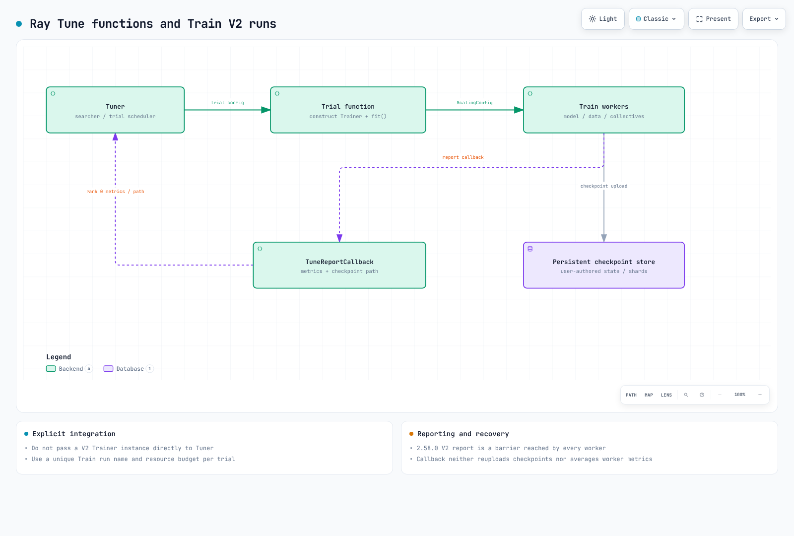

# 第 3 部分：Ray Train 和 Ray Tune

> **审查基线**：Ray 2.58.0 · 2026-09-12

## 实验环境设置

验证使用了 Python 3.12 和 `ray[train,tune]==2.58.0`。这些额外组件会安装 Ray 的 Train/Tune 依赖项；**PyTorch 等框架需单独安装**。请根据实际工作负载检查 PyTorch、CUDA 和驱动程序的配对。

此处的检查涵盖配置、回调/检查点 API 以及一个小型 CPU 标量 Tune 示例。它们不是 PyTorch 训练、GPU、分布式梯度或 EKS 自动扩缩测试。

## Ray Train V2 和训练代码职责

在 2.58.0 中，当未设置 `RAY_TRAIN_V2_ENABLED` 时，V2 为默认版本。`ray.train.torch.TorchTrainer` 导入会相应地选择其 V2 实现。当环境变量选择较旧实现时，不要假定其契约完全相同。

Trainer 协调 worker 和底层分布式进程组。它不会自动编写模型、优化器、损失/数据循环、数据分区或状态保存/恢复逻辑。对于 PyTorch，请使用 `prepare_model` 和 `prepare_data_loader` 等适当的辅助函数来完成设备/DDP/sampler 设置，然后验证数据重复、梯度同步和评估。框架集合通信不能全部描述为 Ray 对象存储传输。

## ScalingConfig 和资源需求

`ScalingConfig` 指定 worker 数量以及每个 worker 的逻辑 CPU/GPU 资源。也支持弹性配置，因此请检查实际模式及其数据/恢复要求。在 2.58.0 V2 中，设置旧版 `trainer_resources` 会引发弃用错误。请区分 V2 controller、训练 worker 和 Tune trial-driver 资源。

在框架进程初始化之前，放置组和 worker bundle 需要具备足够的容量。这既不能替代 Kubernetes 调度，也不能保证每个 Pod 都能原子调度。GPU 不足可能导致等待、超时或失败；Ray/KubeRay 边界、配额、镜像就绪情况以及 EC2 可用性也很重要。

## 检查点和报告

`Checkpoint.from_directory()` 会根据你准备的文件构建一个检查点引用。它不会自动捕获模型、优化器、RNG、调度器或数据集位置。请显式保存所需状态，然后在 worker 内加载 `train.get_checkpoint()` 返回的检查点。

**2.58.0 V2 的 `train.report` 调用是一个屏障，每个 worker 必须达到相同的调用次数。** 即使只有 rank 0 保存文件，其他 rank 也要以 `checkpoint=None` 参与。某些 worker 跳过报告可能导致训练停滞。指标不会在 worker 间自动求平均；请在训练代码中计算所需聚合值。

检查点上传默认采用同步模式。若使用异步上传或验证，请检查完成状态、临时文件生命周期以及特定功能限制。当多个 worker 保存分片时，避免文件名冲突。

对于多个节点，请将 `train.RunConfig(storage_path=...)` 设置为所有 worker 都可访问的持久存储。本地 Pod 目录无法保证在节点/Pod 删除后仍能恢复。S3 路径仍需要 IAM、网络和保留配置。

### 故障类别和重试

2.58.0 V2 的 `FailureConfig` 默认值为：训练 worker 错误的 `max_failures=0`、controller 错误的 `controller_failure_limit=-1`，以及抢占的 `max_preemption_failures=-1`。**仅设置 `max_failures=0` 并不会禁用所有重试类别。** 请将每个限制与 RayJob/运维截止时间一并配置。重试无法从缺失或不完整的检查点恢复进度。

## Ray Tune：搜索器和调度器

Tune 管理 trial 配置和执行。搜索器选择参数候选项；trial 调度器使用中间指标来停止、暂停或继续 trial。网格/随机搜索不一定会根据先前指标调整其下一个候选项。

请一并审查 `max_concurrent_trials`、trial 资源、放置组和集群容量。避免 trial driver 占用嵌套 Train worker 所需的全部资源。仅 CPU/GPU 总数相加并不能保证每个 worker bundle 都能够被放置。

## 小型 Tune 示例

这会运行**两个标量目标 trial**，而非模型训练。实际检查收集了两个结果，并选择 `x=3`，得分为 0。

```python
from pathlib import Path
import ray
from ray import tune

def objective(config):
    for step in range(2):
        tune.report({"score": -(config["x"] - 3) ** 2, "step": step})

try:
    ray.init(address="local", num_cpus=2, include_dashboard=False,
             object_store_memory=80 * 1024 * 1024)
    tuner = tune.Tuner(
        tune.with_resources(objective, {"cpu": 1}),
        param_space={"x": tune.grid_search([1, 3])},
        tune_config=tune.TuneConfig(
            metric="score", mode="max", max_concurrent_trials=1),
        run_config=tune.RunConfig(
            storage_path=str(Path(".tune-demo").resolve()),
            name="scalar-example", verbose=0),
    )
    results = tuner.fit()
    assert len(results) == 2 and not results.errors
    best = results.get_best_result()
    assert best.config["x"] == 3 and best.metrics["score"] == 0
finally:
    ray.shutdown()
```

Ray 逻辑资源和对象存储大小并非整个进程的 OS 限制。在复用结果目录前，请确定你是要开始新运行还是进行恢复。

## 当前的 Train/Tune 集成

**不要将直接向 `Tuner` 传递 V2 Trainer 实例描述为当前推荐路径。** 原生检查对 V2 DataParallelTrainer 实例引发了 `TuneError`。请区分较旧 BaseTrainer 的兼容性/弃用处理与 V2。

当前文档化的模式使用**函数 trainable**，它会构建框架 Trainer 并调用 `.fit()`。通过 `train_loop_config` 传递 trial 参数，并为每个 trial 使用唯一的 Train 运行名称和存储路径。

要转发中间指标和检查点路径，请通过 Train `RunConfig(callbacks=[...])` 附加 `ray.tune.integration.ray_train.TuneReportCallback`。请在 Tune 会话内构建它。2.58.0 实现会转发第一个 worker 的指标字典，而不会求平均。它将现有检查点路径添加到指标中，而不是再次上传检查点。

对 Tuner 使用 `tune.RunConfig`，对 Trainer 使用 `train.RunConfig`。请将它们的故障、存储和回调设置分开。此集成需要显式连接和资源规划。



[交互式图表](https://www.atomai.click/kubernetes-docs/archmaps/en-ai-ml-ray-03-ray-train-tune-0.html)

## EKS 运维检查

请分别检查 Ray 资源/放置需求、KubeRay worker-group 边界、Kubernetes Pod 放置以及物理节点供应。即使有可用容量，镜像拉取、数据集访问、框架初始化/通信和检查点权限也可能延迟启动。

自动扩缩不会即时提供 GPU，也不会自动给出成本/完成时间的界限。请协调 trial 并发数、worker、最大副本数、重试类别和运维截止时间。在删除 RayJob 或集群前，验证结果/检查点是否保留。

## 主要来源

- [Train 概览](https://docs.ray.io/en/releases-2.58.0/train/overview.html)
- [Train + Tune](https://docs.ray.io/en/releases-2.58.0/train/user-guides/hyperparameter-optimization.html)
- [检查点](https://docs.ray.io/en/releases-2.58.0/train/user-guides/checkpoints.html)
- [持久存储](https://docs.ray.io/en/releases-2.58.0/train/user-guides/persistent-storage.html)
- [故障/抢占](https://docs.ray.io/en/releases-2.58.0/train/user-guides/fault-tolerance.html)
- [PyTorch 准备](https://docs.ray.io/en/releases-2.58.0/train/getting-started-pytorch.html)
- [2.58.0 report 实现](https://github.com/ray-project/ray/blob/ray-2.58.0/python/ray/train/v2/api/train_fn_utils.py)

[下一篇：Ray Serve](04-ray-serve.md) · [主页](README.md) · [测验](../../quizzes/ai-ml/ray/03-ray-train-tune-quiz.md)
