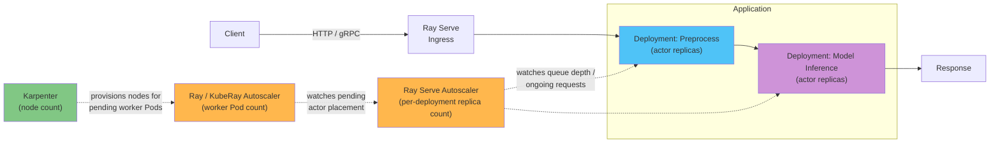

# 第 4 部分：Ray Serve

> **支持的版本**：Ray 2.57.0
> **最后更新**：August 20, 2026

## 实验环境设置

要跟随本文档中的示例，您需要以下工具和环境：

### 必需工具

* Python 3.10+
* 用于常规 Ray Serve 部署，请执行 `pip install "ray[serve]"`；如果您计划学习下面的 Ray Serve LLM 部分，请改为执行 `pip install "ray[llm]"`——它会引入 `ray[serve]` 不包含的 vLLM 和相关依赖项
* 如果您计划测试 RayService 路径，则需要 kubectl v1.34 或更高版本，并将其指向正常工作的 Amazon EKS 集群
* 如果您计划提供 GPU 支持的模型，则需要通过 Karpenter 配置一个支持 GPU 的 `NodePool`/`EC2NodeClass` 对

## Ray Serve 是什么

[第 1 部分](01-architecture.md)介绍了 actor，它是 Ray 用于有状态、可寻址 Python 对象的基本构件，这些对象会在调用之间将状态保留在内存中。Ray Serve 是直接构建在这一基本构件上的模型服务库：一个 Serve Deployment 由一个 Ray actor 或一组 actor 副本实现，Ray Serve 会将传入的 HTTP 或 gRPC 请求路由到这些副本。只要将模型加载到副本内存中一次，它随后便可以响应许多请求而无需重新加载，这正是 actor 的设计模式。

单个 Deployment 只需在 Ray Serve 的请求路由器后添加更多 actor 副本，即可实现水平扩缩容，与 Ray 中任何由 actor 支持的服务的扩缩容方式相同。更值得关注的是，Ray Serve 允许将多个 Deployment 组合为一个服务管道，称为 application。常见示例是两步管道：一个 Deployment 负责预处理（tokenization、图像调整大小、特征提取），并将其输出交给第二个执行实际模型推理的 Deployment。该管道中的每个 Deployment 都可以独立扩缩容、版本化和配置资源，因为其底层仍然只是一组 actor 副本。

## Ray Serve LLM

大语言模型服务具有足够独特的模式——连续批处理、token 流式传输、兼容 OpenAI 的请求格式——因此 Ray 为其提供了一套专用构件：`ray.serve.llm` 模块。与其手动组装一个自行管理 vLLM engine 实例的 Deployment，`ray.serve.llm` 提供了专为 LLM 服务设计的更高级构件，它们构建于上述 Ray Serve 通用 Deployment 模型之上。

`ray.serve.llm` 将 vLLM 记录为其支持的推理 engine，其兼容 OpenAI 的 API 旨在与 vLLM 自身兼容 OpenAI 的 server 紧密匹配，因此大多数可用于普通 `vllm serve` 调用的 `engine_kwargs` 也可以沿用。在实践中，这意味着相同的生产级 Ray Serve 功能——autoscaling、多模型服务以及 Ray 常用的分布式 actor placement——同样适用于 LLM 服务；而 LLM 特有的配置工作（加载和配置 vLLM engine、公开兼容 OpenAI 的 endpoint）则由 `ray.serve.llm` 处理，而无需您手动构建。在依赖特定字段名之前，请查阅当前的 `docs.ray.io/en/latest/serve/llm/` 文档以了解准确的配置范围，因为这是 Ray Serve 中演进较为活跃的领域之一。

## 对 Serve Deployment 进行自动扩缩容

Ray Serve Deployment 拥有自己的 autoscaling 层，与[第 2 部分](02-kuberay-operator.md)所介绍的集群级 autoscaling 相互独立。Ray/KubeRay autoscaler 决定一个 RayCluster 需要多少 worker Pod，而 Ray Serve 的 autoscaler 在更上层回答了一个范围更窄的问题：根据它实际观察到的请求负载，*这个特定 Deployment* 现在需要多少 actor 副本？Ray Serve 会将每个副本正在处理的请求数——包括排队和传输中的请求——与目标值进行比较，并在配置的最小和最大副本数范围内上调或下调副本数量，使实际负载保持接近该目标值。

这为运行在 EKS 上的 Serve application 提供了本文档站点现已熟悉的三级 autoscaling 图景：

1. **Ray Serve 的 autoscaler** 根据请求负载决定一个 Deployment 需要多少 actor 副本。
2. **Ray/KubeRay autoscaler**（在[第 2 部分](02-kuberay-operator.md)中介绍）根据待处理的 actor placement 决定底层 RayCluster 需要多少 Ray worker Pod——包括 Ray Serve autoscaler 刚刚请求的副本。
3. **Karpenter** 决定实际运行这些 worker Pod 所需的 EC2 node 数量，其机制与 [Karpenter](../../autoscaling/02-karpenter.md) 中所述相同。

每一层只能看到其正下方的一层。Ray Serve 的 autoscaler 并不知道新副本会落在现有 node 上还是触发新 node；它只会请求更多副本。该请求是否会变成新的 EC2 node——以及需要多长时间——是更下一层 Karpenter 的问题。

## GPU 推理

需要 GPU 的模型推理 Deployment 会像其他任何 Ray workload 一样请求 GPU：通过 Ray 常规的每 actor 资源请求，即[第 3 部分](03-ray-train-tune.md)中介绍的 Ray Train 和 Ray Tune worker 所使用的同一机制。Ray Serve 会将该 Deployment 的 actor 副本调度到能够满足所请求 GPU 数量的 worker 上；而且——如[第 2 部分](02-kuberay-operator.md)所述——worker group 的 Pod spec 才是最初向 Ray scheduler 声明 GPU 容量的部分。

这也是 Ray Serve 的 autoscaling 与 Karpenter 的 node provisioning 前置时间以与本站其他 GPU workload 完全相同的方式相互作用的地方：当 Ray Serve autoscaler 决定一个推理 Deployment 需要另一个副本、且现有 GPU worker Pod 都没有可用空间时，该副本请求会变成待处理的 Pod，Karpenter 必须配置新的 GPU 支持 EC2 node，副本才能真正开始提供流量服务。积极扩缩 GPU 副本数量的服务 application 应考虑该配置前置时间；请参阅 [Karpenter](../../autoscaling/02-karpenter.md)，以更深入了解 GPU instance type 的 node provisioning 延迟机制。

## 生产环境中的 RayService

在 Kubernetes 之外单独运行 Serve application 适合本地开发，但 EKS 上的生产部署使用[第 2 部分](02-kuberay-operator.md)介绍的 `RayService` CRD。RayService 会将底层 RayCluster 及其上部署的 Serve application 作为一个整体进行管理，并且它专门支持推出新的 application 版本或变更后的 RayCluster spec，同时旨在避免丢弃传输中的请求；请查看当前的 KubeRay release notes，以了解此升级路径的成熟度和前提条件。本文档不会再次解释 RayService 的 CRD 机制；请参阅第 2 部分。

在实践中，这意味着本文档前面描述的 Deployment 拓扑——由一个或多个 Deployment 组成的 application，且每个 Deployment 均可对其 actor 副本数进行 autoscaling——正是 `RayService` object 在真实 EKS 集群上管理其生命周期的对象；而 Ray/KubeRay 和 Karpenter autoscaling 层则会在其底层继续运行，其方式与任何其他 RayCluster 完全相同。

## 后续步骤

至此，四部分组成的 Ray 系列已结束。[第 1 部分](01-architecture.md)介绍了 Ray 的核心基本构件——task、actor 和 object store。[第 2 部分](02-kuberay-operator.md)介绍了如何通过 KubeRay 的 `RayCluster`、`RayJob` 和 `RayService` CRD 在 Kubernetes 上以声明方式运行 Ray 集群，以及 Ray/KubeRay 与 Karpenter 之间的 autoscaling 分工。[第 3 部分](03-ray-train-tune.md)介绍了在该集群之上进行分布式训练和 hyperparameter tuning。本部分通过 Ray Serve 完成了整个闭环：基于第 1 部分 actor 基本构件的 Deployment，被组合为 application，依据自身请求负载指标进行 autoscaling，并且——在生产环境中——通过第 2 部分的 RayService CRD 实现端到端管理。

[返回主页](./README.md)

## 测验

要检验您在本章中学到的内容，请尝试完成[主题测验](../../quizzes/ai-ml/ray/04-ray-serve-quiz.md)。
