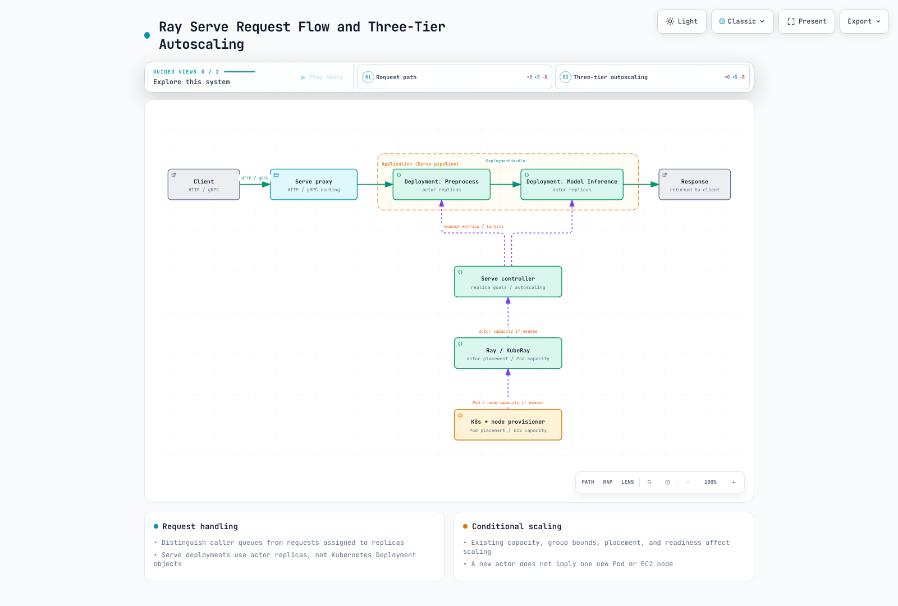

# 第 4 部分：Ray Serve

> **审查基线**：Ray 2.58.0 · KubeRay 1.7.0 · 2026-09-12

## 环境与验证范围

已使用 Python 3.12 和 `ray[serve]==2.58.0` 检查了一个小型 CPU 响应示例。在此环境中，尽管额外安装未提供 Jinja2，HAProxy 模块仍导入了 Jinja2；显式添加 `Jinja2==3.1.6` 修复了导入问题。其他环境可能已通过其他依赖项包含它。

`ray[llm]` extra 会添加 vLLM 等大型推理依赖项。这里未安装它，且未运行模型权重、GPU 或 EKS 工作负载。以下验证涵盖 Serve 配置、HTTP 响应和 DeploymentHandle 调用。

## Deployment、Application 与请求路径

一个 Serve **Deployment** 管理 actor 副本；它不同于 Kubernetes Deployment。多个副本 actor 可以容纳在一个 Ray Pod 中，因此副本数量与 Pod 数量不可互换。

一个 **Application** 包含一个或多个 deployment 和一个 ingress deployment。DeploymentHandle 可以连接预处理与推理，而无需让每个内部调用都经过 HTTP，也无需为每个 deployment 创建 Kubernetes Service。

Controller 管理 Serve 控制状态和 actor 生命周期。Proxy 接收 HTTP/gRPC 流量并将其转发至 deployment。2.58.0 的默认 proxy 位置是**承载副本的节点上的 `EveryNode`**。可以显式选择 `HeadOnly` 和 `Disabled`。较旧架构页面中的仅 head 节点默认值不应覆盖当前 API 契约。

应区分 proxy/handle 上的调用方队列与分配给副本的进行中请求。审查 Application 中的同步/异步 handler、阻塞工作、超时和取消行为。

## 小型本地 HTTP/Handle 示例

此示例验证响应 API，而非模型推理。实际检查使用了一个可用的私有 loopback 端口，并确认 HTTP 200 以及 `double(4) == 8`。

```python
import requests
import ray
from ray import serve

try:
    ray.init(address="local", num_cpus=2, include_dashboard=False,
             object_store_memory=80 * 1024 * 1024)
    serve.start(proxy_location="HeadOnly",
                http_options={"host": "127.0.0.1", "port": 18080})

    @serve.deployment(num_replicas=1,
                      ray_actor_options={"num_cpus": 1},
                      max_ongoing_requests=2, max_queued_requests=4)
    class Echo:
        async def __call__(self, request):
            return {"echo": request.query_params.get("value", "")}
        def double(self, value):
            return value * 2

    handle = serve.run(Echo.bind(), name="echo", route_prefix="/echo")
    response = requests.get("http://127.0.0.1:18080/echo",
                            params={"value": "fixture"}, timeout=15)
    assert response.status_code == 200
    assert response.json() == {"echo": "fixture"}
    assert handle.double.remote(4).result(timeout_s=15) == 8
finally:
    serve.shutdown()
    ray.shutdown()
```

请在端口 18080 可用的独立练习进程中运行。Ray 逻辑资源和 object store 大小并非整个进程的 OS 内存/CPU 限制。`serve.shutdown()` 会停止已连接的 Serve 实例；请勿将此示例的清理操作用于共享的生产集群。

## 副本、Autoscaling 与 Backpressure

区分以下已验证的 2.58.0 默认值：

| 配置 | 值或含义 |
|---|---|
| 默认 deployment | 一个副本，未配置 autoscaling |
| `num_replicas="auto"` | 应用最小值 1、最大值 100、目标进行中请求数 2 |
| 直接使用 `AutoscalingConfig()` | 最小值 1，**最大值 1**；省略最大值会限制扩容 |
| `max_ongoing_requests` | 发送至副本但尚未获得响应的请求；默认值为 5 |
| `max_queued_requests` | **每个调用方**（proxy/handle）上的队列上限；默认值为 -1，即无限制 |
| 扩缩容延迟 | 默认扩容 30 秒/缩容 600 秒；并非实际就绪延迟 |

Autoscaling 目标会观察请求负载；它不同于最大进行中请求数和全局队列上限。超过队列限制时，handle 可能引发 BackPressureError，或默认返回 HTTP 503。Backpressure 配置可以自定义 HTTP 响应。

请一并调整最小值/最大值、测量窗口/延迟、冷启动、模型加载、batching 和实际处理时间。使用 `min_replicas=0` 缩容至零并不会消除重启延迟。期望的副本数量并不能保证所有副本都已就绪。

## EKS 上的控制层

1. Serve 根据请求负载和策略调整 deployment 副本目标。
2. Ray 放置 actor/bundle；启用的 Ray autoscaling 和 KubeRay 可以调整 worker Pod 容量。
3. Kubernetes 放置 Pod，并在需要时由 Karpenter 等 provisioner 提供节点容量。

**一个 pending actor 不会自动变成一个 Pending Pod 或一个 EC2 节点。**现有 Ray Pod 可能获得空闲容量，或者 group 上限、放置和 quota 可能阻止进展。请在每一层检查需求和就绪状态。



[交互式图表](https://www.atomai.click/kubernetes-docs/archmaps/en-ai-ml-ray-04-ray-serve-0.html)

## GPU 推理与 Ray Serve LLM

普通 GPU 副本使用 `ray_actor_options` 等 Ray 资源设置。请对齐设备、driver、Pod limit 以及 Ray 的 structured-resource/rayStartParams 优先级。如[第 2 部分](02-kuberay-operator.md)所述，Pod limit 并不总是唯一配置的值。

`LLMConfig` 和 `build_openai_app` 等 API 提供了独立的 LLM 配置层。2.58.0 文档和软件包显示支持 **vLLM 和 SGLang backend**。已验证的 `ray[llm]` 依赖包括 `vllm[audio]==0.26.0` 和 NIXL 软件包；这并不意味着同时安装了所有 SGLang 依赖。

请区分 `model_loading_config`、`deployment_config`、`engine_kwargs` 和 `server_cls`。检查 engine 特定字段和支持的组合，而不要假设每个 `vllm serve` CLI 选项都能原样迁移。不同 backend 的 tensor-parallel 选项名称和 worker 放置方式可能不同。部分 API 仍处于 beta 阶段，较旧的 LLMServer/LLMRouter 路径带有弃用通知。

请分别验证模型访问、revision、权重下载、engine/CUDA/driver 兼容性、KV cache 以及 tensor/pipeline-parallel 资源。与 OpenAI 兼容的请求格式并不能确保已建立 authentication、安全性或相同的功能覆盖范围。CPU Echo 检查不能证明 LLM 性能或兼容性。

## RayService 与运维更新

RayService 是在 EKS 上对 Serve Application 和 RayCluster 进行声明式生命周期管理的一种选择，并非每个生产 deployment 的通用必需条件。请区分 Application 配置变更和集群变更，以及 `NewCluster` 和基于 Gateway 的增量升级策略。

KubeRay 1.7 已启用的增量 feature gate 仍需要 Gateway API/实现、备用容量、就绪状态和 draining 条件。请针对 shutdown 边界测试 streaming 和长时间运行的请求。不要将每次升级都描述为保证零请求丢失。

HTTP 选项等集群范围的启动设置存在动态更新限制。Deployment 变更可以是轻量级重新配置，也可以是 actor 替换。重启/替换的副本会付出模型初始化和状态恢复的成本。

## 访问控制与限制

请分别限制 API/dashboard/client 入口、模型 artifact 访问和 Application 用户访问。Ray 集群 token 和 ClusterIP 不会自动为每个 Serve endpoint 实现 authentication/authorization。审查敏感输入、响应、prompt 和日志，并配置队列、超时和资源边界。

此处的检查涵盖原生配置/decorator 以及一个微型单节点 HTTP/Handle Application。未执行 autoscaling 负载测试、GPU/LLM 运行、多节点故障转移和 RayService rollout。

## 主要来源

- [Serve 2.58.0](https://docs.ray.io/en/releases-2.58.0/serve/index.html)
- [Autoscaling](https://docs.ray.io/en/releases-2.58.0/serve/autoscaling-guide.html)
- [Serve LLM](https://docs.ray.io/en/releases-2.58.0/serve/llm/index.html)
- [Serve API 和 proxy 默认值](https://github.com/ray-project/ray/blob/ray-2.58.0/python/ray/serve/api.py)
- [Serve 配置](https://github.com/ray-project/ray/blob/ray-2.58.0/python/ray/serve/config.py)
- [副本/队列配置](https://github.com/ray-project/ray/blob/ray-2.58.0/python/ray/serve/_private/config.py)
- [KubeRay 1.7](https://github.com/ray-project/kuberay/releases/tag/v1.7.0)

[主页](README.md) · [测验](../../quizzes/ai-ml/ray/04-ray-serve-quiz.md)
