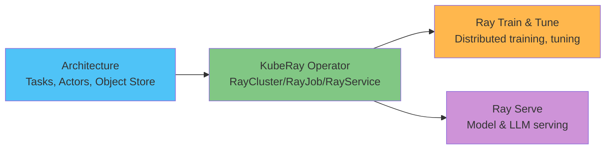

# EKS 上的 Ray 深度解析

> **支持的版本**：Ray 2.57.0, KubeRay v1.6.1
> **最后更新**：August 20, 2026

## 概述

Ray 是一个开源分布式计算框架，用于扩展 Python 工作负载——从临时并行任务到分布式训练、超参数调优和模型服务——它围绕一组精简的核心原语（任务、actor 和共享对象存储）构建，而非为每种工作负载类型提供单独的工具。在 Kubernetes 上，KubeRay operator 会将 Ray 集群的 head/worker-node 结构转换为原生 Kubernetes 资源，使 Ray 集群能够以声明式方式定义，并让 EKS 具备与其运行其他工作负载时相同的部署和自动扩缩容模式。

## 组件映射

| 概念 | 解决的问题 | 深度解析 |
|---------|--------------------|-----------|
| **架构** | 任务、actor 和其他所有组件所依赖的对象存储 | [Part 1](01-architecture.md) |
| **KubeRay Operator** | 将 Ray 集群作为原生 Kubernetes 资源（`RayCluster`/`RayJob`/`RayService`）运行 | [Part 2](02-kuberay-operator.md) |
| **Ray Train & Tune** | 分布式模型训练和超参数搜索 | [Part 3](03-ray-train-tune.md) |
| **Ray Serve** | 模型服务，包括专用于 LLM 服务的构建模块 | [Part 4](04-ray-serve.md) |

## 为什么要在 EKS 上运行此工作负载

这种权衡与本文档站点其他数据/ML 部分所述的相同：已在运行 EKS 的团队可以将用于 Ray 工作负载的节点池自动扩缩容（通过 Karpenter）、IAM 和可观测性模式，与集群中其他所有工作负载复用；相应地，需要直接运维 KubeRay operator 及其 RayCluster/RayJob/RayService 资源，而不是使用托管替代方案。

## 当前涵盖内容

1. [Part 1: Ray 架构](01-architecture.md) — 任务、actor、对象存储，以及 head/worker 集群模型
2. [Part 2: KubeRay Operator](02-kuberay-operator.md) — RayCluster、RayJob、RayService，以及与 Karpenter 配合的双层自动扩缩容模式
3. [Part 3: Ray Train 和 Ray Tune](03-ray-train-tune.md) — 分布式训练和超参数调优
4. [Part 4: Ray Serve](04-ray-serve.md) — 模型服务、Ray Serve LLM，以及基于 RayService 的生产部署
