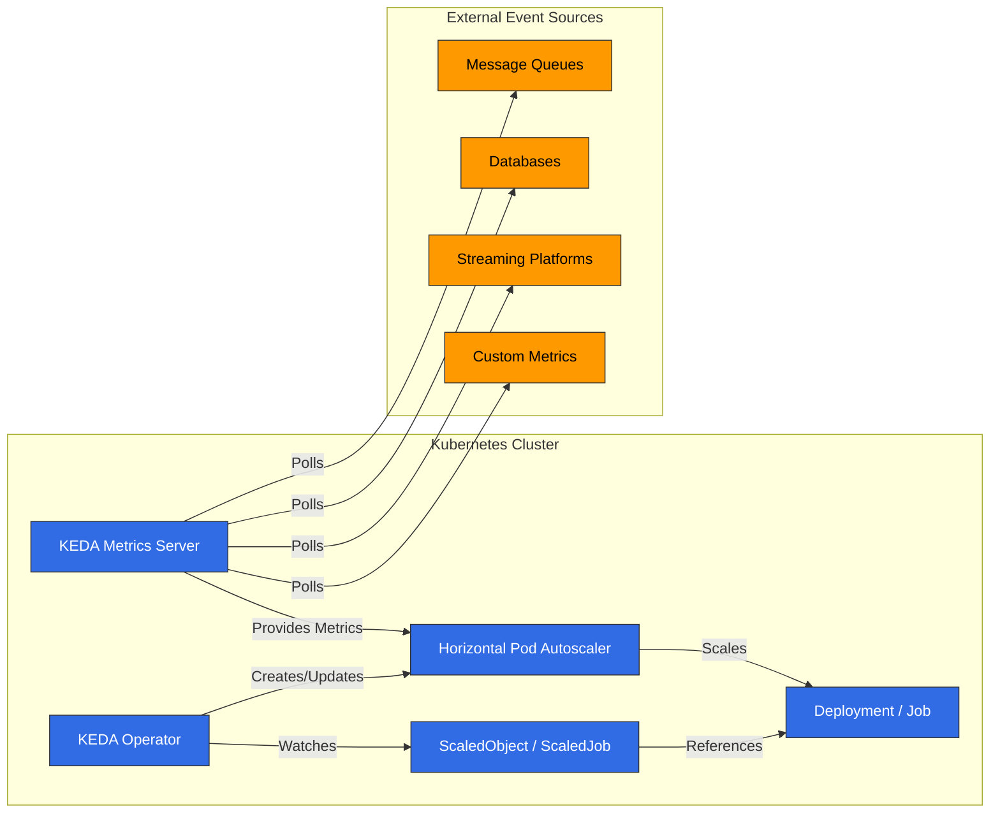

# KEDA (Kubernetes Event-driven Autoscaling)

## 目录
- [简介](#introduction)
- [架构](#architecture)
- [安装与配置](#installation-and-configuration)
- [Scalers](#scalers)
- [自定义指标扩缩容](#custom-metric-scaling)
- [Twitter 指标扩缩容](#twitter-metric-scaling)
- [Google Calendar 扩缩容](#google-calendar-scaling)
- [Istio 指标扩缩容](#istio-metric-scaling)
- [基于 Cron 的扩缩容](#cron-based-scaling)
- [与 Amazon EKS 集成](#integration-with-amazon-eks)
- [最佳实践](#best-practices)
- [故障排除](#troubleshooting)
- [结论](#conclusion)

## 简介

KEDA (Kubernetes Event-driven Autoscaling) 是一个开源项目，可为 Kubernetes 应用实现事件驱动的自动扩缩容。KEDA 扩展了 Kubernetes 原生的 Horizontal Pod Autoscaler (HPA)，使工作负载能够基于 CPU 和内存使用率以外的各种事件源和指标进行扩缩容。

### KEDA 的主要优势

1. **事件驱动扩缩容**：基于各种事件源（消息队列、数据库、流等）进行扩缩容
2. **零扩缩容**：在没有活动时缩容到 0 个副本以节省成本
3. **多样化 Scaler 支持**：内置 50 多个 scalers，并支持自定义 scaler
4. **Kubernetes Native**：与现有 Kubernetes HPA 集成
5. **Cloud Neutral**：可在任何 Kubernetes 环境中运行
6. **简单的部署模型**：通过单个 operator 即可轻松部署

### 与现有扩缩容方法的比较

| 功能 | KEDA | Kubernetes HPA | Cloud Provider Autoscaler |
|---------|------|----------------|---------------------------|
| 指标来源 | 50+ scalers | CPU、Memory、Custom metrics | 有限指标 |
| 零扩缩容 | ✅ | ❌ | 部分支持 |
| 事件驱动 | ✅ | ❌ | 部分支持 |
| Cloud Neutral | ✅ | ✅ | ❌ |
| 部署复杂度 | 低 | 非常低 | 中 |
| Custom Metrics | 简单 | 复杂 | 有限 |

## 架构

KEDA 基于 Kubernetes operator 模式，监控外部指标源并自动管理 Kubernetes HPA。




### 主要组件

1. **KEDA Operator**：监视 ScaledObject 和 ScaledJob 资源并管理 HPA
2. **KEDA Metrics Server**：从外部指标源收集指标，并将其暴露给 Kubernetes API
3. **ScaledObject**：定义 Deployment、StatefulSet 等的扩缩容配置
4. **ScaledJob**：定义 Kubernetes Job 的扩缩容配置
5. **Triggers/Scalers**：为各种事件源实现扩缩容逻辑

### 工作原理

1. 用户创建 ScaledObject 或 ScaledJob，用于定义扩缩容目标和触发器
2. KEDA Operator 检测到该资源后创建对应的 HPA
3. KEDA Metrics Server 轮询外部指标源以收集指标
4. HPA 根据 metrics server 提供的指标对工作负载进行扩缩容
5. 当没有活动时，KEDA 会缩容到 0 个副本（这是 HPA 无法做到的）

## 安装与配置

### 先决条件

- Kubernetes cluster（v1.16 或更高版本）
- 已配置 kubectl
- Helm（可选）

### 安装方法

#### 1. 使用 Helm 安装

```bash
# Add Helm repository
helm repo add kedacore https://kedacore.github.io/charts

# Update Helm repository
helm repo update

# Install KEDA
helm install keda kedacore/keda --namespace keda --create-namespace
```

#### 2. 使用 YAML Manifests 安装

```bash
# Download latest KEDA release
kubectl apply -f https://github.com/kedacore/keda/releases/download/v2.10.1/keda-2.10.1.yaml
```

#### 3. 验证安装

```bash
kubectl get pods -n keda
```

预期输出：
```
NAME                                      READY   STATUS    RESTARTS   AGE
keda-operator-5c6d85d76c-vr4fj            1/1     Running   0          1m
keda-operator-metrics-apiserver-65f8f8d4d8-9mzrk   1/1     Running   0          1m
```

### 基本配置

KEDA 默认只需最少配置即可工作，但你可以根据需要调整各种设置。

#### 使用 Helm Values File 进行自定义配置

```yaml
# values.yaml
operator:
  replicaCount: 2
  resources:
    limits:
      cpu: 100m
      memory: 128Mi
    requests:
      cpu: 50m
      memory: 64Mi

metricsServer:
  replicaCount: 2
  resources:
    limits:
      cpu: 100m
      memory: 128Mi
    requests:
      cpu: 50m
      memory: 64Mi

logging:
  operator:
    level: info
  metricServer:
    level: info
```

```bash
helm install keda kedacore/keda --namespace keda --create-namespace -f values.yaml
```

## Scalers

KEDA 为各种事件源提供 scalers。每个 scaler 都会从特定事件源收集指标，并基于这些指标对工作负载进行扩缩容。

### 主要 Scalers

KEDA 支持 50 多个 scalers，主要包括：

1. **Message Queues**：
   - Apache Kafka
   - RabbitMQ
   - AWS SQS
   - Azure Service Bus
   - Google Cloud Pub/Sub

2. **Databases**：
   - MySQL
   - PostgreSQL
   - MongoDB
   - Redis

3. **Streaming Platforms**：
   - Apache Kafka
   - AWS Kinesis
   - Azure Event Hubs

4. **Cloud Services**：
   - AWS CloudWatch
   - Azure Monitor
   - Google Cloud Monitoring

5. **其他**：
   - Prometheus
   - InfluxDB
   - Cron
   - CPU/Memory

### 基本 ScaledObject 示例

```yaml
apiVersion: keda.sh/v1alpha1
kind: ScaledObject
metadata:
  name: rabbitmq-scaledobject
  namespace: default
spec:
  scaleTargetRef:
    apiVersion: apps/v1
    kind: Deployment
    name: rabbitmq-consumer
  pollingInterval: 15
  cooldownPeriod: 30
  minReplicaCount: 0
  maxReplicaCount: 30
  triggers:
  - type: rabbitmq
    metadata:
      protocol: amqp
      queueName: hello
      host: rabbitmq
      queueLength: "5"
```

### 基本 ScaledJob 示例

```yaml
apiVersion: keda.sh/v1alpha1
kind: ScaledJob
metadata:
  name: rabbitmq-scaledjob
  namespace: default
spec:
  jobTargetRef:
    template:
      spec:
        containers:
        - name: rabbitmq-worker
          image: rabbitmq-worker:latest
          imagePullPolicy: Always
  pollingInterval: 15
  maxReplicaCount: 30
  successfulJobsHistoryLimit: 5
  failedJobsHistoryLimit: 5
  triggers:
  - type: rabbitmq
    metadata:
      protocol: amqp
      queueName: hello
      host: rabbitmq
      queueLength: "5"
```
## 自定义指标扩缩容

除了各种内置 scalers 之外，KEDA 还提供了基于自定义指标进行扩缩容的灵活性。这使你可以实现符合业务需求的独特扩缩容逻辑。

### 使用 External Metrics API

你可以使用 Prometheus 等外部指标源实现基于自定义指标的扩缩容：

```yaml
apiVersion: keda.sh/v1alpha1
kind: ScaledObject
metadata:
  name: custom-metrics-scaler
  namespace: default
spec:
  scaleTargetRef:
    apiVersion: apps/v1
    kind: Deployment
    name: my-app
  minReplicaCount: 1
  maxReplicaCount: 10
  triggers:
  - type: prometheus
    metadata:
      serverAddress: http://prometheus-server.monitoring.svc.cluster.local
      metricName: custom_metric_total
      threshold: "100"
      query: sum(custom_metric_total{namespace="default",pod=~"my-app-.*"})
```

### 使用 HTTP Scaler

你可以从 HTTP endpoint 获取指标用于扩缩容：

```yaml
apiVersion: keda.sh/v1alpha1
kind: ScaledObject
metadata:
  name: http-scaler
  namespace: default
spec:
  scaleTargetRef:
    apiVersion: apps/v1
    kind: Deployment
    name: my-app
  minReplicaCount: 1
  maxReplicaCount: 10
  triggers:
  - type: metrics-api
    metadata:
      targetValue: "100"
      url: "http://api.example.com/metrics"
      valueLocation: "value"
      method: "GET"
```

### 开发自定义 Scalers

你可以开发自己的 scaler 并将其与 KEDA 集成。这需要开发一个实现 External Metrics API 的服务：

1. Metrics Server 实现：

```go
package main

import (
    "net/http"
    "encoding/json"

    "k8s.io/apimachinery/pkg/api/resource"
    metav1 "k8s.io/apimachinery/pkg/apis/meta/v1"
    "k8s.io/metrics/pkg/apis/external_metrics"
)

func metricsHandler(w http.ResponseWriter, r *http.Request) {
    // Calculate metric value with custom logic
    metricValue := calculateMetricValue()

    metric := external_metrics.ExternalMetricValue{
        TypeMeta: metav1.TypeMeta{
            Kind:       "ExternalMetricValue",
            APIVersion: "external.metrics.k8s.io/v1beta1",
        },
        MetricName: "custom_metric",
        Value:      *resource.NewQuantity(metricValue, resource.DecimalSI),
        Timestamp:  metav1.Now(),
    }

    metricList := external_metrics.ExternalMetricValueList{
        Items: []external_metrics.ExternalMetricValue{metric},
    }

    json.NewEncoder(w).Encode(metricList)
}

func main() {
    http.HandleFunc("/metrics", metricsHandler)
    http.ListenAndServe(":8080", nil)
}
```

2. 与 KEDA 集成：

```yaml
apiVersion: keda.sh/v1alpha1
kind: ScaledObject
metadata:
  name: custom-scaler
  namespace: default
spec:
  scaleTargetRef:
    apiVersion: apps/v1
    kind: Deployment
    name: my-app
  minReplicaCount: 1
  maxReplicaCount: 10
  triggers:
  - type: metrics-api
    metadata:
      targetValue: "100"
      url: "http://custom-metrics-server:8080/metrics"
      valueLocation: "items.0.value"
```

## Twitter 指标扩缩容

此示例展示如何使用 Twitter API，根据特定 hashtag 或关键词的提及频率对应用进行扩缩容。

### 先决条件

- Twitter API keys 和 access tokens
- 用于收集并暴露指标的服务

### 实施步骤

1. 实现 Twitter Metrics Collector Service：

```python
import os
import time
import tweepy
from flask import Flask, jsonify

app = Flask(__name__)

# Twitter API credentials
consumer_key = os.environ.get("TWITTER_CONSUMER_KEY")
consumer_secret = os.environ.get("TWITTER_CONSUMER_SECRET")
access_token = os.environ.get("TWITTER_ACCESS_TOKEN")
access_token_secret = os.environ.get("TWITTER_ACCESS_TOKEN_SECRET")

# Tweepy authentication
auth = tweepy.OAuthHandler(consumer_key, consumer_secret)
auth.set_access_token(access_token, access_token_secret)
api = tweepy.API(auth)

# Metrics storage
metrics = {
    "tweet_count": 0,
    "last_updated": 0
}

# Background tweet collection
def collect_tweets():
    while True:
        try:
            # Search for specific hashtag
            tweets = api.search_tweets(q="#kubernetes", count=100)
            metrics["tweet_count"] = len(tweets)
            metrics["last_updated"] = time.time()
        except Exception as e:
            print(f"Error collecting tweets: {e}")

        # Update every 15 minutes (considering Twitter API limits)
        time.sleep(900)

# Metrics endpoint
@app.route("/metrics", methods=["GET"])
def get_metrics():
    return jsonify({
        "tweet_count": metrics["tweet_count"]
    })

if __name__ == "__main__":
    import threading
    # Start background tweet collection
    thread = threading.Thread(target=collect_tweets)
    thread.daemon = True
    thread.start()

    # Start API server
    app.run(host="0.0.0.0", port=8080)
```

2. 部署 Metrics Collector Service：

```yaml
apiVersion: apps/v1
kind: Deployment
metadata:
  name: twitter-metrics-collector
  namespace: default
spec:
  replicas: 1
  selector:
    matchLabels:
      app: twitter-metrics-collector
  template:
    metadata:
      labels:
        app: twitter-metrics-collector
    spec:
      containers:
      - name: collector
        image: twitter-metrics-collector:latest
        ports:
        - containerPort: 8080
        env:
        - name: TWITTER_CONSUMER_KEY
          valueFrom:
            secretKeyRef:
              name: twitter-api-secrets
              key: consumer-key
        - name: TWITTER_CONSUMER_SECRET
          valueFrom:
            secretKeyRef:
              name: twitter-api-secrets
              key: consumer-secret
        - name: TWITTER_ACCESS_TOKEN
          valueFrom:
            secretKeyRef:
              name: twitter-api-secrets
              key: access-token
        - name: TWITTER_ACCESS_TOKEN_SECRET
          valueFrom:
            secretKeyRef:
              name: twitter-api-secrets
              key: access-token-secret
---
apiVersion: v1
kind: Service
metadata:
  name: twitter-metrics-collector
  namespace: default
spec:
  selector:
    app: twitter-metrics-collector
  ports:
  - port: 80
    targetPort: 8080
```

3. 配置 KEDA ScaledObject：

```yaml
apiVersion: keda.sh/v1alpha1
kind: ScaledObject
metadata:
  name: twitter-scaler
  namespace: default
spec:
  scaleTargetRef:
    apiVersion: apps/v1
    kind: Deployment
    name: twitter-processor
  minReplicaCount: 1
  maxReplicaCount: 20
  pollingInterval: 15
  cooldownPeriod: 30
  triggers:
  - type: metrics-api
    metadata:
      targetValue: "10"
      url: "http://twitter-metrics-collector/metrics"
      valueLocation: "tweet_count"
```

## Google Calendar 扩缩容

此示例展示如何使用 Google Calendar API，基于计划事件对应用进行扩缩容。

### 先决条件

- Google Calendar API credentials
- 用于收集并暴露指标的服务

### 实施步骤

1. 实现 Google Calendar Metrics Collector Service：

```python
import os
import time
import datetime
from flask import Flask, jsonify
from google.oauth2 import service_account
from googleapiclient.discovery import build

app = Flask(__name__)

# Google Calendar API credentials
SCOPES = ['https://www.googleapis.com/auth/calendar.readonly']
SERVICE_ACCOUNT_FILE = '/etc/secrets/service-account.json'
CALENDAR_ID = os.environ.get("CALENDAR_ID")

# Metrics storage
metrics = {
    "upcoming_events": 0,
    "last_updated": 0
}

# Create Google Calendar API client
def create_calendar_client():
    credentials = service_account.Credentials.from_service_account_file(
        SERVICE_ACCOUNT_FILE, scopes=SCOPES)
    return build('calendar', 'v3', credentials=credentials)

# Background event collection
def collect_events():
    while True:
        try:
            service = create_calendar_client()

            # Current time
            now = datetime.datetime.utcnow()
            # 1 hour later
            one_hour_later = now + datetime.timedelta(hours=1)

            # Query events within the next hour
            events_result = service.events().list(
                calendarId=CALENDAR_ID,
                timeMin=now.isoformat() + 'Z',
                timeMax=one_hour_later.isoformat() + 'Z',
                singleEvents=True,
                orderBy='startTime'
            ).execute()

            events = events_result.get('items', [])
            metrics["upcoming_events"] = len(events)
            metrics["last_updated"] = time.time()
        except Exception as e:
            print(f"Error collecting events: {e}")

        # Update every 5 minutes
        time.sleep(300)

# Metrics endpoint
@app.route("/metrics", methods=["GET"])
def get_metrics():
    return jsonify({
        "upcoming_events": metrics["upcoming_events"]
    })

if __name__ == "__main__":
    import threading
    # Start background event collection
    thread = threading.Thread(target=collect_events)
    thread.daemon = True
    thread.start()

    # Start API server
    app.run(host="0.0.0.0", port=8080)
```

2. 部署 Metrics Collector Service：

```yaml
apiVersion: v1
kind: Secret
metadata:
  name: google-calendar-secrets
  namespace: default
type: Opaque
data:
  service-account.json: <BASE64_ENCODED_SERVICE_ACCOUNT_JSON>
---
apiVersion: apps/v1
kind: Deployment
metadata:
  name: calendar-metrics-collector
  namespace: default
spec:
  replicas: 1
  selector:
    matchLabels:
      app: calendar-metrics-collector
  template:
    metadata:
      labels:
        app: calendar-metrics-collector
    spec:
      containers:
      - name: collector
        image: calendar-metrics-collector:latest
        ports:
        - containerPort: 8080
        env:
        - name: CALENDAR_ID
          value: "primary"
        volumeMounts:
        - name: google-calendar-credentials
          mountPath: "/etc/secrets"
          readOnly: true
      volumes:
      - name: google-calendar-credentials
        secret:
          secretName: google-calendar-secrets
---
apiVersion: v1
kind: Service
metadata:
  name: calendar-metrics-collector
  namespace: default
spec:
  selector:
    app: calendar-metrics-collector
  ports:
  - port: 80
    targetPort: 8080
```

3. 配置 KEDA ScaledObject：

```yaml
apiVersion: keda.sh/v1alpha1
kind: ScaledObject
metadata:
  name: calendar-scaler
  namespace: default
spec:
  scaleTargetRef:
    apiVersion: apps/v1
    kind: Deployment
    name: calendar-processor
  minReplicaCount: 1
  maxReplicaCount: 10
  pollingInterval: 15
  cooldownPeriod: 30
  triggers:
  - type: metrics-api
    metadata:
      targetValue: "1"
      url: "http://calendar-metrics-collector/metrics"
      valueLocation: "upcoming_events"
```
## Istio 指标扩缩容

此示例展示如何基于从 Istio service mesh 收集的指标对应用进行扩缩容。我们将了解如何基于每秒请求数 (RPS) 进行扩缩容。

### 先决条件

- 已安装 Istio service mesh
- 已安装 Prometheus 并与 Istio 集成

### 实施步骤

1. 设置 Istio Service Mesh：

```bash
# Install Istio
istioctl install --set profile=default -y

# Enable Istio sidecar injection on namespace
kubectl label namespace default istio-injection=enabled
```

2. 部署示例应用：

```yaml
apiVersion: apps/v1
kind: Deployment
metadata:
  name: sample-app
  namespace: default
spec:
  replicas: 1
  selector:
    matchLabels:
      app: sample-app
  template:
    metadata:
      labels:
        app: sample-app
    spec:
      containers:
      - name: sample-app
        image: nginx:latest
        ports:
        - containerPort: 80
---
apiVersion: v1
kind: Service
metadata:
  name: sample-app
  namespace: default
spec:
  selector:
    app: sample-app
  ports:
  - port: 80
    targetPort: 80
---
apiVersion: networking.istio.io/v1alpha3
kind: VirtualService
metadata:
  name: sample-app
  namespace: default
spec:
  hosts:
  - "*"
  gateways:
  - istio-system/ingressgateway
  http:
  - route:
    - destination:
        host: sample-app
        port:
          number: 80
```

3. 配置 KEDA ScaledObject：

```yaml
apiVersion: keda.sh/v1alpha1
kind: ScaledObject
metadata:
  name: istio-scaler
  namespace: default
spec:
  scaleTargetRef:
    apiVersion: apps/v1
    kind: Deployment
    name: sample-app
  minReplicaCount: 1
  maxReplicaCount: 10
  pollingInterval: 15
  cooldownPeriod: 30
  triggers:
  - type: prometheus
    metadata:
      serverAddress: http://prometheus.istio-system:9090
      metricName: istio_requests_per_second
      threshold: "10"
      query: sum(rate(istio_requests_total{destination_service="sample-app.default.svc.cluster.local"}[1m]))
```

此配置会根据从 Istio 收集的每秒请求数来扩缩 `sample-app` deployment。当每秒请求数超过 10 时，KEDA 会增加副本；当请求数量下降时，它会减少副本。

### 高级配置

在更复杂的场景中，你可以根据特定路径或 HTTP 方法的请求数量进行扩缩容：

```yaml
apiVersion: keda.sh/v1alpha1
kind: ScaledObject
metadata:
  name: istio-path-scaler
  namespace: default
spec:
  scaleTargetRef:
    apiVersion: apps/v1
    kind: Deployment
    name: sample-app
  minReplicaCount: 1
  maxReplicaCount: 10
  pollingInterval: 15
  cooldownPeriod: 30
  triggers:
  - type: prometheus
    metadata:
      serverAddress: http://prometheus.istio-system:9090
      metricName: istio_requests_per_second_path
      threshold: "5"
      query: sum(rate(istio_requests_total{destination_service="sample-app.default.svc.cluster.local",request_path="/api/v1/products"}[1m]))
```

你还可以基于错误率或延迟等其他 Istio 指标进行扩缩容：

```yaml
# Error rate based scaling
apiVersion: keda.sh/v1alpha1
kind: ScaledObject
metadata:
  name: istio-error-scaler
  namespace: default
spec:
  scaleTargetRef:
    apiVersion: apps/v1
    kind: Deployment
    name: sample-app
  minReplicaCount: 1
  maxReplicaCount: 10
  pollingInterval: 15
  cooldownPeriod: 30
  triggers:
  - type: prometheus
    metadata:
      serverAddress: http://prometheus.istio-system:9090
      metricName: istio_error_rate
      threshold: "0.05"
      query: sum(rate(istio_requests_total{destination_service="sample-app.default.svc.cluster.local",response_code=~"5.*"}[1m])) / sum(rate(istio_requests_total{destination_service="sample-app.default.svc.cluster.local"}[1m]))
```

## 基于 Cron 的扩缩容

KEDA 支持使用 Cron expressions 进行基于时间的扩缩容。这使你可以根据可预测的流量模式或计划提前扩容应用。

### 基本 Cron Scaler

```yaml
apiVersion: keda.sh/v1alpha1
kind: ScaledObject
metadata:
  name: cron-scaler
  namespace: default
spec:
  scaleTargetRef:
    apiVersion: apps/v1
    kind: Deployment
    name: sample-app
  minReplicaCount: 0
  maxReplicaCount: 10
  pollingInterval: 15
  cooldownPeriod: 30
  triggers:
  - type: cron
    metadata:
      timezone: Asia/Seoul
      start: 30 * * * *
      end: 45 * * * *
      desiredReplicas: "5"
```

此配置会在每小时 30 分时将 `sample-app` deployment 扩容到 5 个副本，并在 45 分时缩容。

### 多时区扩缩容

你可以使用多个 Cron triggers，在不同时间配置不同的扩缩容行为：

```yaml
apiVersion: keda.sh/v1alpha1
kind: ScaledObject
metadata:
  name: multi-cron-scaler
  namespace: default
spec:
  scaleTargetRef:
    apiVersion: apps/v1
    kind: Deployment
    name: sample-app
  minReplicaCount: 1
  maxReplicaCount: 10
  pollingInterval: 15
  cooldownPeriod: 30
  triggers:
  # High replica count during business hours
  - type: cron
    metadata:
      timezone: Asia/Seoul
      start: 0 9 * * 1-5
      end: 0 18 * * 1-5
      desiredReplicas: "5"
  # Low replica count during nights and weekends
  - type: cron
    metadata:
      timezone: Asia/Seoul
      start: 0 18 * * 1-5
      end: 0 9 * * 1-5
      desiredReplicas: "2"
  # Low replica count on weekends
  - type: cron
    metadata:
      timezone: Asia/Seoul
      start: 0 0 * * 0,6
      end: 0 0 * * 1
      desiredReplicas: "2"
```

### 将 Cron 与其他 Scalers 结合使用

你可以将 Cron scalers 与其他 scalers 结合使用，以设置基线扩缩容行为，并根据实际负载进一步扩缩容：

```yaml
apiVersion: keda.sh/v1alpha1
kind: ScaledObject
metadata:
  name: combined-scaler
  namespace: default
spec:
  scaleTargetRef:
    apiVersion: apps/v1
    kind: Deployment
    name: sample-app
  minReplicaCount: 1
  maxReplicaCount: 20
  pollingInterval: 15
  cooldownPeriod: 30
  triggers:
  # Set baseline replica count during business hours
  - type: cron
    metadata:
      timezone: Asia/Seoul
      start: 0 9 * * 1-5
      end: 0 18 * * 1-5
      desiredReplicas: "5"
  # Additional scaling based on actual load
  - type: prometheus
    metadata:
      serverAddress: http://prometheus.monitoring.svc.cluster.local:9090
      metricName: http_requests_per_second
      threshold: "10"
      query: sum(rate(http_requests_total{app="sample-app"}[1m]))
```

## 与 Amazon EKS 集成

KEDA 可与 Amazon EKS 无缝集成，提供基于 AWS 服务的扩缩容。

### 在 EKS 上安装 KEDA

```bash
# Installation using Helm
helm repo add kedacore https://kedacore.github.io/charts
helm repo update
helm install keda kedacore/keda --namespace keda --create-namespace
```

### 基于 AWS 服务的扩缩容

#### 基于 SQS Queue 的扩缩容

```yaml
apiVersion: keda.sh/v1alpha1
kind: TriggerAuthentication
metadata:
  name: aws-credentials
  namespace: default
spec:
  podIdentity:
    provider: aws-eks
---
apiVersion: keda.sh/v1alpha1
kind: ScaledObject
metadata:
  name: aws-sqs-scaler
  namespace: default
spec:
  scaleTargetRef:
    apiVersion: apps/v1
    kind: Deployment
    name: sqs-consumer
  minReplicaCount: 0
  maxReplicaCount: 10
  pollingInterval: 15
  cooldownPeriod: 30
  triggers:
  - type: aws-sqs-queue
    metadata:
      queueURL: https://sqs.us-west-2.amazonaws.com/123456789012/my-queue
      queueLength: "5"
      awsRegion: "us-west-2"
    authenticationRef:
      name: aws-credentials
```

#### 基于 CloudWatch Metric 的扩缩容

```yaml
apiVersion: keda.sh/v1alpha1
kind: TriggerAuthentication
metadata:
  name: aws-credentials
  namespace: default
spec:
  podIdentity:
    provider: aws-eks
---
apiVersion: keda.sh/v1alpha1
kind: ScaledObject
metadata:
  name: aws-cloudwatch-scaler
  namespace: default
spec:
  scaleTargetRef:
    apiVersion: apps/v1
    kind: Deployment
    name: cloudwatch-app
  minReplicaCount: 1
  maxReplicaCount: 10
  pollingInterval: 15
  cooldownPeriod: 30
  triggers:
  - type: aws-cloudwatch
    metadata:
      namespace: "AWS/SQS"
      dimensionName: "QueueName"
      dimensionValue: "my-queue"
      metricName: "ApproximateNumberOfMessages"
      targetValue: "5"
      minMetricValue: "0"
      awsRegion: "us-west-2"
    authenticationRef:
      name: aws-credentials
```

### IRSA (IAM Roles for Service Accounts) 集成

在 EKS 上使用 KEDA 时，你可以利用 IRSA 管理 AWS 服务权限：

```bash
# IRSA setup
eksctl create iamserviceaccount \
  --name keda-operator \
  --namespace keda \
  --cluster my-cluster \
  --attach-policy-arn arn:aws:iam::aws:policy/AmazonSQSReadOnlyAccess \
  --attach-policy-arn arn:aws:iam::aws:policy/CloudWatchReadOnlyAccess \
  --approve
```

```yaml
# Helm values file
serviceAccount:
  annotations:
    eks.amazonaws.com/role-arn: arn:aws:iam::123456789012:role/keda-operator-role
```

## 最佳实践

### 性能优化

1. **设置适当的轮询间隔**：设置与工作负载特征相匹配的轮询间隔
2. **优化冷却周期**：防止不必要的扩缩容振荡
3. **设置 Resource Requests 和 Limits**：为 KEDA 组件分配适当资源
4. **编写高效查询**：优化指标查询

```yaml
apiVersion: keda.sh/v1alpha1
kind: ScaledObject
metadata:
  name: optimized-scaler
spec:
  pollingInterval: 30  # Poll every 30 seconds (default: 30)
  cooldownPeriod: 300  # 5-minute cooldown period (default: 300)
  # Other configuration...
```

### 提高可靠性

1. **使用多个 Triggers**：基于多个指标源进行扩缩容
2. **设置适当的最小和最大副本数**：设置与工作负载需求匹配的范围
3. **故障处理策略**：为指标源故障准备响应计划
4. **设置监控和告警**：监控 KEDA 运行状态

```yaml
apiVersion: keda.sh/v1alpha1
kind: ScaledObject
metadata:
  name: reliable-scaler
spec:
  minReplicaCount: 2  # Maintain minimum 2 replicas
  maxReplicaCount: 20  # Limit to maximum 20 replicas
  fallback:
    failureThreshold: 3  # Apply fallback behavior after 3 failures
    replicas: 5  # Set to 5 replicas on metric source failure
  # Other configuration...
```

### 安全加固

1. **应用最小权限原则**：仅授予必要权限
2. **Secret Management**：安全地管理敏感信息
3. **应用 Network Policies**：限制对 KEDA 组件的访问
4. **配置 RBAC**：设置适当的基于角色的访问控制

```yaml
apiVersion: keda.sh/v1alpha1
kind: TriggerAuthentication
metadata:
  name: secure-auth
spec:
  secretTargetRef:
  - parameter: connectionString
    name: db-secret
    key: connection-string
---
apiVersion: networking.k8s.io/v1
kind: NetworkPolicy
metadata:
  name: keda-network-policy
  namespace: keda
spec:
  podSelector:
    matchLabels:
      app.kubernetes.io/name: keda-operator
  ingress:
  - from:
    - namespaceSelector:
        matchLabels:
          kubernetes.io/metadata.name: kube-system
  egress:
  - {}
```

## 故障排除

### 常见问题

#### 1. 扩缩容不工作

**症状**：即使指标超过阈值，Pods 也不会扩缩容

**解决方案**：
- 检查 KEDA logs
- 验证与指标源的连接
- 验证身份验证配置

```bash
# Check KEDA operator logs
kubectl logs -n keda -l app=keda-operator

# Check KEDA metrics server logs
kubectl logs -n keda -l app=keda-metrics-apiserver

# Check ScaledObject status
kubectl get scaledobject -n <namespace> <name> -o yaml
```

#### 2. 零扩缩容问题

**症状**：没有活动时不会缩容到 0

**解决方案**：
- 检查 minReplicaCount 设置
- 验证指标值
- 检查 HPA 状态

```bash
# Check HPA status
kubectl get hpa -n <namespace>

# Check metric values directly
kubectl get --raw "/apis/external.metrics.k8s.io/v1beta1/namespaces/<namespace>/<metric-name>" | jq
```

#### 3. 身份验证问题

**症状**：无法连接到指标源

**解决方案**：
- 验证 TriggerAuthentication 配置
- 检查 secrets 或环境变量
- 验证权限

```bash
# Check TriggerAuthentication
kubectl get triggerauthentication -n <namespace> <name> -o yaml

# Check secrets
kubectl get secret -n <namespace> <name> -o yaml
```

### 调试工具

```bash
# Check KEDA version
kubectl get deployment -n keda keda-operator -o jsonpath="{.spec.template.spec.containers[0].image}"

# Check ScaledObject status
kubectl describe scaledobject -n <namespace> <name>

# Check HPA status
kubectl describe hpa -n <namespace> <name>

# Check metric values
kubectl get --raw "/apis/external.metrics.k8s.io/v1beta1/namespaces/<namespace>/<metric-name>"

# Check KEDA logs
kubectl logs -n keda -l app=keda-operator --tail=100
```

## 结论

KEDA (Kubernetes Event-driven Autoscaling) 是一个强大的工具，可在 Kubernetes 环境中提供事件驱动的自动扩缩容。它扩展了基础的 Kubernetes HPA，使工作负载能够基于各种事件源和指标进行扩缩容。

本文档介绍了 KEDA 的基本概念、安装方法、各种 scaler 用法、自定义指标扩缩容、与 Twitter 和 Google Calendar 等外部服务的集成、基于 Istio 指标的扩缩容、基于 Cron 的扩缩容、与 Amazon EKS 的集成、最佳实践以及故障排除。

使用 KEDA，你可以更高效地扩缩应用，优化资源使用并降低成本。它特别适合用于实现事件驱动架构和 serverless 模式。

### 后续步骤

- 使用 KEDA 实现 serverless 架构
- 探索与各种事件源的集成
- 开发自定义 scalers
- 在多 cluster 环境中利用 KEDA
- 将 KEDA 与其他 cloud-native 工具集成

## 参考资料

- [KEDA 官方文档](https://keda.sh/docs/)
- [KEDA GitHub Repository](https://github.com/kedacore/keda)
- [KEDA Scaler List](https://keda.sh/docs/latest/scalers/)
- [KEDA Operator Hub](https://operatorhub.io/operator/keda)
- [AWS EKS Workshop - KEDA](https://www.eksworkshop.com/advanced/autoscaling/keda/)

## 测验

要测试你在本章中学到的内容，请尝试完成[主题测验](../quizzes/autoscaling/05-keda-quiz.md)。
