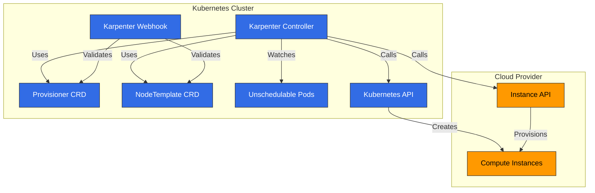
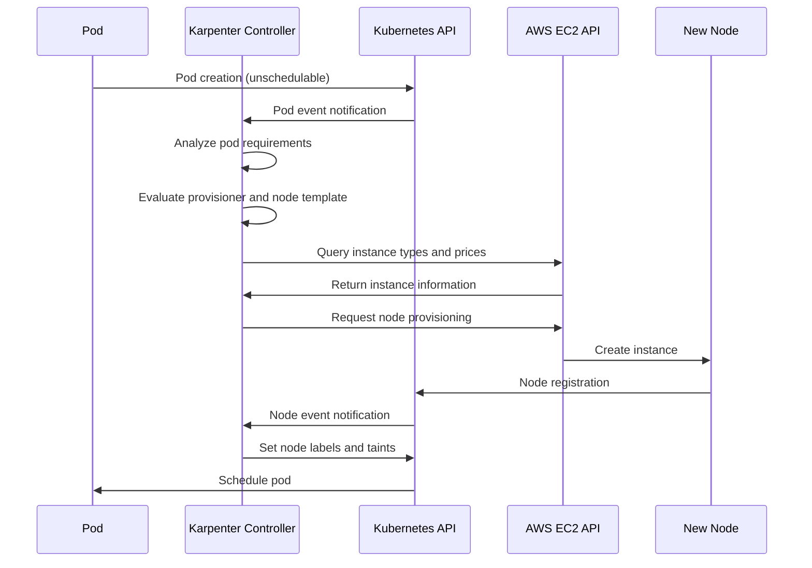
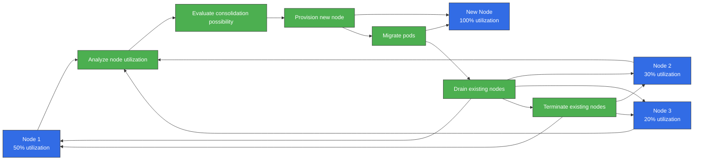
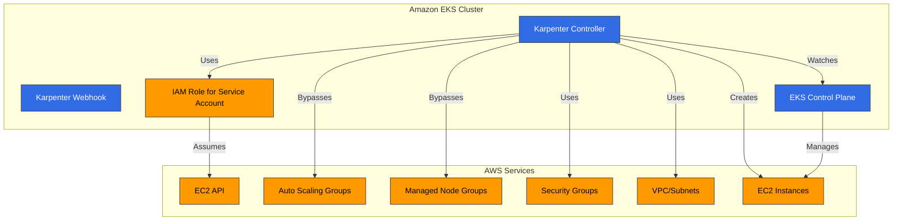

# Karpenter

> **支持的版本**：Karpenter 1.6 - 1.14, Kubernetes 1.29+（截至 v1.14）
> **最后更新**：July 11, 2026

## 目录
- [介绍](#introduction)
- [架构](#architecture)
- [安装与配置](#installation-and-configuration)
- [Provisioner](#provisioner)
- [Node Templates](#node-templates)
- [中断处理](#interruption-handling)
- [集成](#integration)
- [与 Amazon EKS 集成](#integration-with-amazon-eks)
- [最佳实践](#best-practices)
- [故障排查](#troubleshooting)
- [结论](#conclusion)

## 介绍

Karpenter 是一个开源 cluster autoscaler，可为 Kubernetes 集群自动执行 Node（节点）配置。Karpenter 会根据 workload 需求动态配置合适的计算资源，从而确保应用程序可用性并优化集群效率。

### Karpenter 的主要优势

1. **快速扩缩容**：根据 workload 需求在数秒内完成 Node 配置
2. **成本优化**：为 workload 选择最合适的实例类型
3. **简单配置**：通过声明式 API 轻松配置
4. **以 Workload 为中心的设计**：基于 Pod（容器组）需求配置 Node
5. **云集成**：利用 cloud provider 能力
6. **高效 Bin Packing**：优化资源利用率
7. **灵活的 Node 管理**：Node 生命周期管理和集成式中断处理

### 与现有 Autoscaler 的比较

| 功能 | Karpenter | Cluster Autoscaler | Cloud Provider Managed Node Groups |
|---------|-----------|-------------------|---------------------------|
| 扩缩容速度 | 非常快（秒级） | 中等（分钟级） | 慢（分钟级） |
| 实例类型选择 | 动态 | 基于 Node group | 基于 Node group |
| Bin Packing 效率 | 高 | 中 | 低 |
| 配置复杂度 | 低 | 中 | 低 |
| 云集成 | 原生 | 有限 | 原生 |
| Node Group 管理 | 不需要 | 需要 | 需要 |
| 中断处理 | 已集成 | 有限 | 有限 |

> **注意**：如果你没有使用 Karpenter，而是继续使用传统的 EKS Managed Node Groups 和 Cluster Autoscaler，那么 EC2 Auto Scaling Warm Pools（自 2026 年 4 月起可用）可以让你保留已预初始化的实例作为备用，从而实现无冷启动的 scale-out。你可以选择 Stopped 状态（成本较低）或 Running 状态（转换更快），它会自动与 Cluster Autoscaler 集成——但这是 Managed Node Group 的功能，并不是 Karpenter 使用的功能。

## 架构

Karpenter 作为 Kubernetes controller 运行，检测无法调度的 Pod 并配置合适的 Node。



### Karpenter 工作流

下图展示了 Karpenter 在 EKS 集群中的工作方式：



### 关键组件

1. **Karpenter Controller**：检测无法调度的 Pod 并管理 Node 配置
2. **Karpenter Webhook**：验证 Karpenter 资源
3. **Provisioner CRD**：定义 Node 配置策略
4. **NodeTemplate CRD**：定义要配置的 Node 的配置
5. **Cloud Provider Integration**：与 cloud provider API 集成以管理计算资源

### 工作原理

1. Karpenter Controller 检测无法调度的 Pod
2. 分析 Pod 需求（资源、node selectors、tolerations 等）
3. 根据 provisioner 和 node template 配置确定合适的 Node 类型
4. 调用 cloud provider API 来配置 Node
5. Node 加入集群后调度 Pod
6. 当不再需要 Node 时，通过集成式中断处理移除 Node

## 安装与配置

### 先决条件

- Kubernetes 集群（v1.19 或更高版本）
- 已配置 kubectl
- Cloud provider 凭证和权限
- Helm（可选）

### 在 AWS EKS 上安装

#### 1. IAM Role 和 Policy 设置

```bash
# IRSA setup using eksctl
eksctl create iamserviceaccount \
  --cluster=my-cluster \
  --name=karpenter \
  --namespace=karpenter \
  --attach-policy-arn=arn:aws:iam::aws:policy/AmazonEKSClusterPolicy \
  --attach-policy-arn=arn:aws:iam::aws:policy/AmazonEC2ContainerRegistryReadOnly \
  --approve

# Create instance profile
aws iam create-instance-profile --instance-profile-name KarpenterNodeInstanceProfile

# Create node role
aws iam create-role --role-name KarpenterNodeRole --assume-role-policy-document file://node-trust-policy.json

# Attach policies to node role
aws iam attach-role-policy --role-name KarpenterNodeRole --policy-arn arn:aws:iam::aws:policy/AmazonEKSWorkerNodePolicy
aws iam attach-role-policy --role-name KarpenterNodeRole --policy-arn arn:aws:iam::aws:policy/AmazonEKS_CNI_Policy
aws iam attach-role-policy --role-name KarpenterNodeRole --policy-arn arn:aws:iam::aws:policy/AmazonEC2ContainerRegistryReadOnly
aws iam attach-role-policy --role-name KarpenterNodeRole --policy-arn arn:aws:iam::aws:policy/AmazonSSMManagedInstanceCore

# Add role to instance profile
aws iam add-role-to-instance-profile --instance-profile-name KarpenterNodeInstanceProfile --role-name KarpenterNodeRole
```

#### 2. 使用 Helm 安装

```bash
# Add Helm repository
helm repo add karpenter https://charts.karpenter.sh
helm repo update

# Install Karpenter
helm install karpenter karpenter/karpenter \
  --namespace karpenter \
  --create-namespace \
  --set serviceAccount.annotations."eks\.amazonaws\.com/role-arn"=arn:aws:iam::${ACCOUNT_ID}:role/KarpenterControllerRole \
  --set clusterName=${CLUSTER_NAME} \
  --set clusterEndpoint=${CLUSTER_ENDPOINT} \
  --set aws.defaultInstanceProfile=KarpenterNodeInstanceProfile
```

#### 3. 验证安装

```bash
kubectl get pods -n karpenter
```

预期输出：
```
NAME                         READY   STATUS    RESTARTS   AGE
karpenter-6f4f46d855-5lqx7   1/1     Running   0          1m
```

### 基本 Provisioner 配置

```yaml
apiVersion: karpenter.sh/v1
kind: NodePool
metadata:
  name: default
spec:
  disruption:
    consolidationPolicy: WhenEmpty
    consolidateAfter: 30s
  limits:
    cpu: 1000
    memory: 1000Gi
  template:
    spec:
      requirements:
        - key: karpenter.sh/capacity-type
          operator: In
          values: ["on-demand"]
        - key: kubernetes.io/arch
          operator: In
          values: ["amd64"]
        - key: node.kubernetes.io/instance-type
          operator: In
          values: ["m5.large", "m5.xlarge", "m5.2xlarge"]
      nodeClassRef:
        group: karpenter.k8s.aws
        kind: EC2NodeClass
        name: default
---
apiVersion: karpenter.k8s.aws/v1
kind: EC2NodeClass
metadata:
  name: default
spec:
  subnetSelectorTerms:
    - tags:
        karpenter.sh/discovery: "true"
  securityGroupSelectorTerms:
    - tags:
        karpenter.sh/discovery: "true"
  tags:
    karpenter.sh/discovery: "true"
  blockDeviceMappings:
    - deviceName: /dev/xvda
      ebs:
        volumeSize: 100Gi
        volumeType: gp3
        deleteOnTermination: true
```

## NodePool

NodePool 是一个 Kubernetes custom resource，定义 Karpenter 如何配置 Node。它取代了之前的 Provisioner。

### 基本 NodePool 配置

```yaml
apiVersion: karpenter.sh/v1
kind: NodePool
metadata:
  name: default
spec:
  # Node requirements
  template:
    spec:
      requirements:
        - key: karpenter.sh/capacity-type
          operator: In
          values: ["on-demand"]
        - key: kubernetes.io/arch
          operator: In
          values: ["amd64"]
        - key: node.kubernetes.io/instance-type
          operator: In
          values: ["m5.large", "m5.xlarge", "m5.2xlarge"]

  # Resource limits
  limits:
    cpu: 1000
    memory: 1000Gi

  # Node class reference
  template:
    spec:
      nodeClassRef:
        group: karpenter.k8s.aws
        kind: EC2NodeClass
        name: default

  # Node expiration settings
  disruption:
    consolidationPolicy: WhenEmpty
    consolidateAfter: 30s
    expireAfter: 720h  # 30 days

  # Taints and labels
  template:
    spec:
      taints:
        - key: example.com/special-taint
          value: "true"
          effect: NoSchedule
      labels:
        environment: production
        app: web

  # Startup template
  template:
    spec:
      startupTaints:
        - key: node.kubernetes.io/not-ready
          effect: NoSchedule
```

### Requirements 配置

Requirements 定义 Karpenter 将配置的 Node 特征：

```yaml
template:
  spec:
    requirements:
      # Capacity type (on-demand or spot)
      - key: karpenter.sh/capacity-type
        operator: In
        values: ["on-demand", "spot"]

      # Architecture
      - key: kubernetes.io/arch
        operator: In
        values: ["amd64", "arm64"]

      # Instance types
      - key: node.kubernetes.io/instance-type
        operator: In
        values: ["m5.large", "m5.xlarge", "c5.large"]

      # Availability zones
      - key: topology.kubernetes.io/zone
        operator: In
        values: ["us-west-2a", "us-west-2b", "us-west-2c"]

      # Operating system
      - key: kubernetes.io/os
        operator: In
        values: ["linux"]
```

### Limits 配置

Limits 定义 Karpenter 可以配置的最大资源量：

```yaml
limits:
  cpu: 1000
  memory: 1000Gi
  nvidia.com/gpu: 10
```

### Dynamic Resource Allocation (DRA) 支持 (v1.13)

从 Karpenter v1.13（2026 年 6 月发布）开始，Karpenter 支持基于 Kubernetes Dynamic Resource Allocation (DRA) 的设备分配跟踪。Karpenter 现在可以识别基于 claim 的资源，例如 GPUs 和专用 accelerator，并将它们纳入配置决策；这不仅能为 `nvidia.com/gpu` 等 extended resources 实现准确扩缩容，也能支持使用 DRA `ResourceClaim`/`DeviceClass` 对象的 AI/HPC workload。基于 DRA 的跟踪需要 Kubernetes 1.29 或更高版本。

### Node Expiration 配置

Node expiration 设置定义 Karpenter 何时移除 Node：

```yaml
disruption:
  # Consolidate (remove) when node is empty
  consolidationPolicy: WhenEmpty

  # Time until consolidation (removal) after node becomes empty
  consolidateAfter: 30s

  # Maximum time before removing node after creation
  expireAfter: 720h  # 30 days
```

### 通过 NodeReadinessController 自动忽略 Initialization Taints (v1.13)

NodeReadinessController 在 Karpenter v1.13 中引入，会自动忽略与 readiness 相关的 taints（例如 Node 初始化期间应用的 taints），以减少不必要的调度阻塞。这缓解了此前需要通过 `startupTaints` 手动处理的初始化延迟问题，在新 Node 启动并进入 Ready 状态期间提升调度稳定性和配置可靠性。

### 2026 年 7 月更新：v1.14 发布

Karpenter v1.14 于 2026 年 7 月 11 日发布，带来了：

- **CapacityBuffers API 支持**：以声明方式预留 headroom capacity，以吸收突然的 scale-out 峰值
- **Preview instance type 支持**：尚未全面可用的实例类型现在也可以被选择用于配置
- **Nitro Enclaves 支持**：可以在 launch template 中设置 `EnclaveOptions.Enabled`，适用于 confidential-computing workload
- Bug 修复：统计 secondary ENIs 上的 primary IP，确保 Zonal Shift cache 已 hydrate，将 AWS SDK client timeout 接入 operator config，等等

详情请参阅 [v1.14.0 release notes](https://github.com/aws/karpenter-provider-aws/releases/tag/v1.14.0)。

## Node Classes

Node classes 定义 Karpenter 配置的 Node 配置。在 AWS 上，它使用 EC2NodeClass CRD。

### AWS EC2NodeClass 配置

```yaml
apiVersion: karpenter.k8s.aws/v1
kind: EC2NodeClass
metadata:
  name: default
spec:
  # Subnet selection
  subnetSelectorTerms:
    - tags:
        karpenter.sh/discovery: "true"

  # Security group selection
  securityGroupSelectorTerms:
    - tags:
        karpenter.sh/discovery: "true"

  # Instance tags
  tags:
    karpenter.sh/discovery: "true"
    environment: production

  # Block device mappings
  blockDeviceMappings:
    - deviceName: /dev/xvda
      ebs:
        volumeSize: 100Gi
        volumeType: gp3
        deleteOnTermination: true
        encrypted: true

  # Detailed instance configuration
  role: KarpenterNodeRole
  amiFamily: AL2
  userData: |
    #!/bin/bash
    echo "Hello from Karpenter node!"

  # Metadata options
  metadataOptions:
    httpEndpoint: enabled
    httpProtocolIPv6: disabled
    httpPutResponseHopLimit: 2
    httpTokens: required
```

### Subnet 和 Security Group 选择

Subnets 和 security groups 可以使用 label selectors 选择：

```yaml
# Subnet selection
subnetSelector:
  karpenter.sh/discovery: "true"
  Name: "private-*"

# Security group selection
securityGroupSelector:
  karpenter.sh/discovery: "true"
  aws:eks:cluster-name: "my-cluster"
```

### AMI 配置

Karpenter 支持多种 AMI families：

```yaml
# Amazon Linux 2
amiFamily: AL2

# Bottlerocket
amiFamily: Bottlerocket

# Ubuntu
amiFamily: Ubuntu

# Custom AMI
amiSelector:
  aws:ec2:image:id: "ami-0123456789abcdef0"
```

### Block Device 配置

你可以为 Node 定义存储配置：

```yaml
blockDeviceMappings:
  # Root volume
  - deviceName: /dev/xvda
    ebs:
      volumeSize: 100Gi
      volumeType: gp3
      iops: 3000
      throughput: 125
      deleteOnTermination: true
      encrypted: true
      kmsKeyID: "arn:aws:kms:us-west-2:111122223333:key/1234abcd-12ab-34cd-56ef-1234567890ab"

  # Additional volume
  - deviceName: /dev/xvdb
    ebs:
      volumeSize: 500Gi
      volumeType: gp3
      deleteOnTermination: true
```

### User Data 配置

你可以定义在 Node 启动时运行的 user data scripts：

```yaml
userData: |
  #!/bin/bash
  echo "Hello from Karpenter node!"

  # System configuration
  sysctl -w vm.max_map_count=262144

  # Package installation
  yum update -y
  yum install -y amazon-cloudwatch-agent

  # Start CloudWatch agent
  systemctl enable amazon-cloudwatch-agent
  systemctl start amazon-cloudwatch-agent
```

### Node Consolidation 流程

下图展示了 Karpenter 的 Node consolidation 流程。该功能对于优化集群效率和降低成本非常重要：



## 中断处理

Karpenter 会自动处理 Node 中断以确保 workload 可用性。

### 集成式中断处理

Karpenter 处理以下中断事件：

1. **Spot Instance Interruptions**：处理 AWS Spot instance 中断通知
2. **Node Expiration**：基于 TTL 的 Node 替换
3. **Scale Down**：在不再需要 Node 时移除它们
4. **Node Consolidation**：整合为更高效的 Node 配置

### 中断处理配置

```yaml
apiVersion: karpenter.sh/v1
kind: NodePool
metadata:
  name: default
spec:
  # Other configuration...

  # Node expiration settings
  disruption:
    consolidationPolicy: WhenEmpty
    consolidateAfter: 30s
    expireAfter: 720h  # 30 days
```

### Draining 配置

Karpenter 在移除 Node 前会安全地 drain Pod：

```yaml
apiVersion: v1
kind: ConfigMap
metadata:
  name: karpenter-global-settings
  namespace: karpenter
data:
  aws:
    enablePodENI: "true"
  batchMaxDuration: "10s"
  batchIdleDuration: "1s"
  featureGates:
    driftEnabled: "true"
  nodePool:
    disruptionBudget:
      maxUnavailablePercentage: "30"
    disruption:
      consolidationPolicy: WhenEmpty
      consolidateAfter: 30s
      expireAfter: 720h
```

### PDB (PodDisruptionBudget) 集成

Karpenter 会遵循 PDB，以确保应用程序可用性：

```yaml
apiVersion: policy/v1
kind: PodDisruptionBudget
metadata:
  name: app-pdb
spec:
  minAvailable: 2
  selector:
    matchLabels:
      app: my-app
```

## 集成

Karpenter 可与各种 Kubernetes 和云服务集成。

### Kubernetes 集成

#### 1. Pod Topology Spread Constraints

Karpenter 在配置 Node 时会考虑 Pod Topology Spread Constraints：

```yaml
apiVersion: apps/v1
kind: Deployment
metadata:
  name: web-server
spec:
  replicas: 10
  template:
    spec:
      topologySpreadConstraints:
        - maxSkew: 1
          topologyKey: topology.kubernetes.io/zone
          whenUnsatisfiable: DoNotSchedule
          labelSelector:
            matchLabels:
              app: web-server
```

#### 2. Pod Affinity/Anti-Affinity

Karpenter 会考虑 Pod Affinity 和 Anti-Affinity 规则：

```yaml
apiVersion: apps/v1
kind: Deployment
metadata:
  name: web-server
spec:
  replicas: 10
  template:
    spec:
      affinity:
        podAntiAffinity:
          requiredDuringSchedulingIgnoredDuringExecution:
            - labelSelector:
                matchExpressions:
                  - key: app
                    operator: In
                    values:
                      - web-server
              topologyKey: "kubernetes.io/hostname"
```

#### 3. Taints 和 Tolerations

Karpenter 在配置 Node 时会考虑 taints 和 tolerations：

```yaml
apiVersion: karpenter.sh/v1alpha5
kind: Provisioner
metadata:
  name: gpu
spec:
  requirements:
    - key: node.kubernetes.io/instance-type
      operator: In
      values: ["g4dn.xlarge", "g4dn.2xlarge"]
  taints:
    - key: nvidia.com/gpu
      value: "true"
      effect: NoSchedule
---
apiVersion: apps/v1
kind: Deployment
metadata:
  name: gpu-app
spec:
  replicas: 3
  template:
    spec:
      tolerations:
        - key: nvidia.com/gpu
          operator: Exists
          effect: NoSchedule
      nodeSelector:
        karpenter.sh/provisioner-name: gpu
```

### AWS 集成

#### 1. EC2 Spot Instances

Karpenter 支持 EC2 Spot instances 以优化成本：

```yaml
apiVersion: karpenter.sh/v1alpha5
kind: Provisioner
metadata:
  name: spot
spec:
  requirements:
    - key: karpenter.sh/capacity-type
      operator: In
      values: ["spot"]
  providerRef:
    name: spot
---
apiVersion: karpenter.k8s.aws/v1alpha1
kind: AWSNodeTemplate
metadata:
  name: spot
spec:
  subnetSelector:
    karpenter.sh/discovery: "true"
  securityGroupSelector:
    karpenter.sh/discovery: "true"
```

#### 2. EC2 Instance Profiles

Karpenter 使用 EC2 instance profiles 向 Node 授予 IAM 权限：

```yaml
apiVersion: karpenter.k8s.aws/v1alpha1
kind: AWSNodeTemplate
metadata:
  name: default
spec:
  instanceProfile: KarpenterNodeInstanceProfile
```

#### 3. Launch Templates

Karpenter 支持 EC2 launch templates：

```yaml
apiVersion: karpenter.k8s.aws/v1alpha1
kind: AWSNodeTemplate
metadata:
  name: custom-launch-template
spec:
  launchTemplate:
    name: my-launch-template
    version: "1"
```
## 与 Amazon EKS 集成

Karpenter 与 Amazon EKS 无缝集成，提供集群 autoscaling。



### EKS 集群准备

#### 1. 集群 Tag 设置

设置 tags，以便 Karpenter 可以识别集群资源：

```bash
# Set cluster name
CLUSTER_NAME="my-cluster"

# VPC tag setup
aws ec2 create-tags \
  --resources $(aws eks describe-cluster \
    --name ${CLUSTER_NAME} \
    --query "cluster.resourcesVpcConfig.vpcId" \
    --output text) \
  --tags Key=karpenter.sh/discovery,Value=${CLUSTER_NAME}

# Subnet tag setup
for SUBNET in $(aws eks describe-cluster \
  --name ${CLUSTER_NAME} \
  --query "cluster.resourcesVpcConfig.subnetIds[]" \
  --output text); do
  aws ec2 create-tags \
    --resources ${SUBNET} \
    --tags Key=karpenter.sh/discovery,Value=${CLUSTER_NAME}
done

# Security group tag setup
aws ec2 create-tags \
  --resources $(aws eks describe-cluster \
    --name ${CLUSTER_NAME} \
    --query "cluster.resourcesVpcConfig.clusterSecurityGroupId" \
    --output text) \
  --tags Key=karpenter.sh/discovery,Value=${CLUSTER_NAME}
```

#### 2. IAM Role 设置

设置 Karpenter controller 和 Node 所需的 IAM roles：

```bash
# Create controller role
cat <<EOF > controller-trust-policy.json
{
  "Version": "2012-10-17",
  "Statement": [
    {
      "Effect": "Allow",
      "Principal": {
        "Federated": "arn:aws:iam::${ACCOUNT_ID}:oidc-provider/${OIDC_PROVIDER}"
      },
      "Action": "sts:AssumeRoleWithWebIdentity",
      "Condition": {
        "StringEquals": {
          "${OIDC_PROVIDER}:sub": "system:serviceaccount:karpenter:karpenter",
          "${OIDC_PROVIDER}:aud": "sts.amazonaws.com"
        }
      }
    }
  ]
}
EOF

aws iam create-role \
  --role-name KarpenterControllerRole-${CLUSTER_NAME} \
  --assume-role-policy-document file://controller-trust-policy.json

# Create controller policy
cat <<EOF > controller-policy.json
{
  "Version": "2012-10-17",
  "Statement": [
    {
      "Effect": "Allow",
      "Action": [
        "ec2:CreateLaunchTemplate",
        "ec2:CreateFleet",
        "ec2:RunInstances",
        "ec2:CreateTags",
        "ec2:TerminateInstances",
        "ec2:DescribeLaunchTemplates",
        "ec2:DescribeInstances",
        "ec2:DescribeSecurityGroups",
        "ec2:DescribeSubnets",
        "ec2:DescribeInstanceTypes",
        "ec2:DescribeInstanceTypeOfferings",
        "ec2:DescribeAvailabilityZones",
        "ec2:DescribeSpotPriceHistory",
        "pricing:GetProducts",
        "ssm:GetParameter"
      ],
      "Resource": "*"
    },
    {
      "Effect": "Allow",
      "Action": "iam:PassRole",
      "Resources": "arn:aws:iam::${ACCOUNT_ID}:role/KarpenterNodeRole-${CLUSTER_NAME}",
      "Condition": {
        "StringEquals": {
          "iam:PassedToService": "ec2.amazonaws.com"
        }
      }
    }
  ]
}
EOF

aws iam put-role-policy \
  --role-name KarpenterControllerRole-${CLUSTER_NAME} \
  --policy-name KarpenterControllerPolicy-${CLUSTER_NAME} \
  --policy-document file://controller-policy.json
```

### 在 EKS 集群上安装 Karpenter

```bash
# Installation using Helm
helm install karpenter karpenter/karpenter \
  --namespace karpenter \
  --create-namespace \
  --set serviceAccount.annotations."eks\.amazonaws\.com/role-arn"=arn:aws:iam::${ACCOUNT_ID}:role/KarpenterControllerRole-${CLUSTER_NAME} \
  --set clusterName=${CLUSTER_NAME} \
  --set clusterEndpoint=$(aws eks describe-cluster --name ${CLUSTER_NAME} --query "cluster.endpoint" --output text) \
  --set aws.defaultInstanceProfile=KarpenterNodeInstanceProfile-${CLUSTER_NAME}
```

### 与 EKS Managed Node Groups 一起使用

Karpenter 可以与 EKS Managed Node Groups 一起使用：

```yaml
# Provisioner for EKS Managed Node Groups
apiVersion: karpenter.sh/v1alpha5
kind: Provisioner
metadata:
  name: managed-ng
spec:
  requirements:
    - key: karpenter.sh/capacity-type
      operator: In
      values: ["on-demand"]
    - key: node.kubernetes.io/instance-type
      operator: In
      values: ["m5.large", "m5.xlarge"]
  labels:
    managed-by: karpenter
  taints:
    - key: managed-by
      value: karpenter
      effect: NoSchedule
  providerRef:
    name: managed-ng
  ttlSecondsAfterEmpty: 30
---
apiVersion: karpenter.k8s.aws/v1alpha1
kind: AWSNodeTemplate
metadata:
  name: managed-ng
spec:
  subnetSelector:
    karpenter.sh/discovery: "${CLUSTER_NAME}"
  securityGroupSelector:
    karpenter.sh/discovery: "${CLUSTER_NAME}"
  tags:
    karpenter.sh/discovery: "${CLUSTER_NAME}"
```

### 与 EKS Fargate 一起使用

Karpenter 可以与 EKS Fargate 一起使用来配置混合集群：

```yaml
# Create Fargate profile
aws eks create-fargate-profile \
  --cluster-name ${CLUSTER_NAME} \
  --fargate-profile-name fp-default \
  --pod-execution-role-arn arn:aws:iam::${ACCOUNT_ID}:role/AmazonEKSFargatePodExecutionRole \
  --selectors namespace=default,namespace=kube-system

# Karpenter NodePool configuration
apiVersion: karpenter.sh/v1
kind: NodePool
metadata:
  name: ec2
spec:
  template:
    spec:
      requirements:
        - key: karpenter.sh/capacity-type
          operator: In
          values: ["on-demand"]
      nodeClassRef:
        group: karpenter.k8s.aws
        kind: EC2NodeClass
        name: ec2
  disruption:
    consolidationPolicy: WhenEmpty
    consolidateAfter: 30s
---
apiVersion: karpenter.k8s.aws/v1
kind: EC2NodeClass
metadata:
  name: ec2
spec:
  subnetSelectorTerms:
    - tags:
        karpenter.sh/discovery: "${CLUSTER_NAME}"
  securityGroupSelectorTerms:
    - tags:
        karpenter.sh/discovery: "${CLUSTER_NAME}"
```

### AZ 故障响应：Amazon ARC Zonal Shift 集成（2026 年 5 月）

Karpenter 支持来自 Amazon ARC (Application Recovery Controller) 的 Zonal Shift。当某个 Availability Zone (AZ) 发生故障时，Karpenter 会自动停止在该 AZ 中配置新 Node，并改为将 workload 调度到健康的 AZ。Zonal Autoshift 也受支持；它会由 AWS 自动检测 AZ 健康状况并处理流量转移和恢复。

检测到故障时，Karpenter 还会自动暂停 voluntary disruption（consolidation、drift handling 等），以避免在 outage 期间进行不必要的 Node 替换而进一步 destabilize 集群。此功能直接使用你现有的 EKS ARC 资源——不需要 custom resources——并通过 `ENABLE_ZONAL_SHIFT` 选项启用。

### EKS 成本优化

你可以使用 Karpenter 优化 EKS 集群成本：

```mermaid
flowchart TD
    %% Node definitions
    CA[Cluster Autoscaler]
    KA[Karpenter]

    %% Cost optimization strategies
    CA1[Node group-based scaling]
    CA2[Same instance types]
    CA3[Slow scaling speed]
    CA4[Limited bin packing]

    KA1[Workload-based scaling]
    KA2[Diverse instance types]
    KA3[Fast scaling speed]
    KA4[Efficient bin packing]
    KA5[Node consolidation]
    KA6[Spot instance utilization]

    %% Results
    CAR[Cost savings: Medium]
    KAR[Cost savings: High]

    %% Connection definitions
    CA --> CA1 & CA2 & CA3 & CA4
    CA1 & CA2 & CA3 & CA4 --> CAR

    KA --> KA1 & KA2 & KA3 & KA4 & KA5 & KA6
    KA1 & KA2 & KA3 & KA4 & KA5 & KA6 --> KAR

    %% Style definitions
    classDef k8sComponent fill:#326CE5,stroke:#333,stroke-width:1px,color:white;
    classDef awsService fill:#FF9900,stroke:#333,stroke-width:1px,color:black;
    classDef userApp fill:#00C7B7,stroke:#333,stroke-width:1px,color:white;
    classDef dataStore fill:#3B48CC,stroke:#333,stroke-width:1px,color:white;
    classDef prometheus fill:#E6522C,stroke:#333,stroke-width:1px,color:white;
    classDef victoriaMetrics fill:#4285F4,stroke:#333,stroke-width:1px,color:white;
    classDef grafana fill:#F8B52A,stroke:#333,stroke-width:1px,color:black;
    classDef alerting fill:#EB6E85,stroke:#333,stroke-width:1px,color:white;
    classDef strategy fill:#4CAF50,stroke:#333,stroke-width:1px,color:white;
    classDef result fill:#E91E63,stroke:#333,stroke-width:1px,color:white;
    classDef default fill:#f9f9f9,stroke:#333,stroke-width:1px,color:black;

    %% Class application
    class CA,KA k8sComponent
    class CA1,CA2,CA3,CA4,KA1,KA2,KA3,KA4,KA5,KA6 strategy
    class CAR,KAR result
```



#### 1. 使用 Spot Instances

```yaml
apiVersion: karpenter.sh/v1alpha5
kind: Provisioner
metadata:
  name: spot
spec:
  requirements:
    - key: karpenter.sh/capacity-type
      operator: In
      values: ["spot"]
    - key: kubernetes.io/arch
      operator: In
      values: ["amd64", "arm64"]
  providerRef:
    name: spot
  ttlSecondsAfterEmpty: 30
---
apiVersion: karpenter.k8s.aws/v1alpha1
kind: AWSNodeTemplate
metadata:
  name: spot
spec:
  subnetSelector:
    karpenter.sh/discovery: "${CLUSTER_NAME}"
  securityGroupSelector:
    karpenter.sh/discovery: "${CLUSTER_NAME}"
```

#### 2. 使用多样化实例类型

```yaml
apiVersion: karpenter.sh/v1alpha5
kind: Provisioner
metadata:
  name: flexible
spec:
  requirements:
    - key: karpenter.sh/capacity-type
      operator: In
      values: ["on-demand", "spot"]
    - key: kubernetes.io/arch
      operator: In
      values: ["amd64", "arm64"]
    - key: node.kubernetes.io/instance-type
      operator: In
      values: [
        "m5.large", "m5.xlarge", "m5.2xlarge",
        "m6g.large", "m6g.xlarge", "m6g.2xlarge",
        "c5.large", "c5.xlarge", "c5.2xlarge",
        "c6g.large", "c6g.xlarge", "c6g.2xlarge",
        "r5.large", "r5.xlarge", "r5.2xlarge",
        "r6g.large", "r6g.xlarge", "r6g.2xlarge"
      ]
  providerRef:
    name: flexible
  ttlSecondsAfterEmpty: 30
```

#### 3. 启用 Node Consolidation

```yaml
apiVersion: karpenter.sh/v1alpha5
kind: Provisioner
metadata:
  name: default
spec:
  consolidation:
    enabled: true
  # Other configuration...
```

## 最佳实践

```mermaid
flowchart TD
    %% Key areas
    P[Performance Optimization]
    C[Cost Optimization]
    A[Availability Improvement]
    S[Security Hardening]

    %% Performance optimization strategies
    P1[Select appropriate instance types]
    P2[Allow diverse instance types]
    P3[Set appropriate TTL]
    P4[Enable node consolidation]

    %% Cost optimization strategies
    C1[Utilize Spot instances]
    C2[Select appropriate instance sizes]
    C3[Utilize zero scaling]
    C4[Set node expiration]

    %% Availability improvement strategies
    A1[Use multiple availability zones]
    A2[Mix on-demand/Spot instances]
    A3[Set appropriate PDBs]
    A4[Optimize interruption handling]

    %% Security hardening strategies
    S1[IAM role least privilege]
    S2[Security group restrictions]
    S3[Encrypted EBS volumes]
    S4[Require IMDSv2]

    %% Connection definitions
    P --> P1 & P2 & P3 & P4
    C --> C1 & C2 & C3 & C4
    A --> A1 & A2 & A3 & A4
    S --> S1 & S2 & S3 & S4

    %% Style definitions
    classDef k8sComponent fill:#326CE5,stroke:#333,stroke-width:1px,color:white;
    classDef awsService fill:#FF9900,stroke:#333,stroke-width:1px,color:black;
    classDef userApp fill:#00C7B7,stroke:#333,stroke-width:1px,color:white;
    classDef dataStore fill:#3B48CC,stroke:#333,stroke-width:1px,color:white;
    classDef prometheus fill:#E6522C,stroke:#333,stroke-width:1px,color:white;
    classDef victoriaMetrics fill:#4285F4,stroke:#333,stroke-width:1px,color:white;
    classDef grafana fill:#F8B52A,stroke:#333,stroke-width:1px,color:black;
    classDef alerting fill:#EB6E85,stroke:#333,stroke-width:1px,color:white;
    classDef category fill:#9C27B0,stroke:#333,stroke-width:1px,color:white;
    classDef performance fill:#4CAF50,stroke:#333,stroke-width:1px,color:white;
    classDef cost fill:#FF9800,stroke:#333,stroke-width:1px,color:white;
    classDef availability fill:#2196F3,stroke:#333,stroke-width:1px,color:white;
    classDef security fill:#F44336,stroke:#333,stroke-width:1px,color:white;
    classDef default fill:#f9f9f9,stroke:#333,stroke-width:1px,color:black;

    %% Class application
    class P,C,A,S category
    class P1,P2,P3,P4 performance
    class C1,C2,C3,C4 cost
    class A1,A2,A3,A4 availability
    class S1,S2,S3,S4 security
```



### 性能优化

1. **选择合适的实例类型**：选择适合你的 workload 的实例类型
2. **允许多样化实例类型**：允许使用多种实例类型，以提升可用性并优化成本
3. **设置合适的 TTL**：设置与你的 workload 模式匹配的 TTL
4. **启用 Node Consolidation**：启用 Node consolidation 以优化资源利用率

```yaml
apiVersion: karpenter.sh/v1
kind: NodePool
metadata:
  name: optimized
spec:
  # Allow diverse instance types
  template:
    spec:
      requirements:
        - key: node.kubernetes.io/instance-type
          operator: In
          values: [
            "m5.large", "m5.xlarge", "m5.2xlarge",
            "c5.large", "c5.xlarge", "c5.2xlarge",
            "r5.large", "r5.xlarge", "r5.2xlarge"
          ]
      nodeClassRef:
        group: karpenter.k8s.aws
        kind: EC2NodeClass
        name: optimized

  # Set appropriate TTL
  disruption:
    consolidationPolicy: WhenEmpty
    consolidateAfter: 30s
    expireAfter: 720h  # 30 days
```

### 成本优化

1. **利用 Spot Instances**：使用 Spot instances 节省成本
2. **选择合适的实例大小**：选择适合你的 workload 的实例大小
3. **利用 Zero Scaling**：在没有活动时将 Node 数量减少到 0
4. **设置 Node Expiration**：通过定期替换 Node 来利用最新实例类型

```yaml
apiVersion: karpenter.sh/v1
kind: NodePool
metadata:
  name: cost-optimized
spec:
  # Use Spot instances
  template:
    spec:
      requirements:
        - key: karpenter.sh/capacity-type
          operator: In
          values: ["spot"]
      nodeClassRef:
        group: karpenter.k8s.aws
        kind: EC2NodeClass
        name: cost-optimized

  # Zero scaling and node expiration settings
  disruption:
    consolidationPolicy: WhenEmpty
    consolidateAfter: 30s
    expireAfter: 168h  # 7 days
```

### 可用性提升

1. **使用多个 Availability Zones**：跨多个 availability zones 部署 Node
2. **混合使用 On-demand 和 Spot Instances**：平衡可用性和成本
3. **设置合适的 PDBs**：确保应用程序可用性
4. **优化中断处理**：确保 Node 中断期间 workload 可用性

```yaml
apiVersion: karpenter.sh/v1
kind: NodePool
metadata:
  name: high-availability
spec:
  # Use multiple availability zones
  template:
    spec:
      requirements:
        - key: topology.kubernetes.io/zone
          operator: In
          values: ["us-west-2a", "us-west-2b", "us-west-2c"]
        - key: karpenter.sh/capacity-type
          operator: In
          values: ["on-demand", "spot"]
      nodeClassRef:
        name: high-availability

  # Optimize interruption handling
  disruption:
    consolidationPolicy: WhenEmpty
    consolidateAfter: 60s
  ttlSecondsUntilExpired: 2592000  # 30 days

  # Node consolidation settings
  consolidation:
    enabled: true
```

## 故障排查

### 常见问题

#### 1. Node 配置失败

**症状**：Pod 保持 Pending 状态，且未配置 Node

**解决方案**：
- 检查 Karpenter 日志
- 验证 IAM 权限
- 检查 provisioner 配置

```bash
# Check Karpenter logs
kubectl logs -n karpenter -l app.kubernetes.io/name=karpenter -c controller

# Check provisioner status
kubectl describe provisioner <name>

# Check pod events
kubectl describe pod <name>
```

#### 2. Node 移除问题

**症状**：Node 未按预期移除

**解决方案**：
- 检查 TTL 设置
- 验证 Node consolidation 设置
- 检查 Pod draining 状态

```bash
# Check node status
kubectl describe node <name>

# Check node labels
kubectl get node <name> --show-labels

# Check Karpenter logs
kubectl logs -n karpenter -l app.kubernetes.io/name=karpenter -c controller | grep "node termination"
```

#### 3. 实例类型选择问题

**症状**：配置了非预期的实例类型

**解决方案**：
- 检查 provisioner requirements
- 验证 Pod resource requests
- 检查 availability zone 约束

```bash
# Check provisioner requirements
kubectl get provisioner <name> -o yaml

# Check pod resource requests
kubectl describe pod <name>

# Check node information
kubectl describe node <name>
```

### 调试工具

```bash
# Check Karpenter version
kubectl get deployment -n karpenter karpenter -o jsonpath="{.spec.template.spec.containers[0].image}"

# Check Karpenter logs
kubectl logs -n karpenter -l app.kubernetes.io/name=karpenter -c controller

# Check provisioner list
kubectl get provisioners

# Check node template list
kubectl get awsnodetemplates

# Check events
kubectl get events --sort-by='.lastTimestamp'

# Enable debug logs
kubectl patch configmap -n karpenter karpenter-global-settings --type merge -p '{"data":{"logLevel":"debug"}}'
```

## 结论

Karpenter 是一个强大的 autoscaler，可为 Kubernetes 集群自动执行 Node 配置。它会根据 workload 需求动态配置合适的计算资源，从而确保应用程序可用性并优化集群效率。

本文档介绍了 Karpenter 的基本概念、安装方法、provisioner 和 node template 配置、中断处理、各种集成、与 Amazon EKS 的集成、最佳实践以及故障排查。

使用 Karpenter，你可以简化集群管理、优化资源利用率并降低成本。尤其是在 Amazon EKS 等云托管 Kubernetes 环境中，你可以最大化 Karpenter 的收益。

### 后续步骤

- 使用 Karpenter 实施成本优化策略
- 为各种 workload 类型配置 provisioners
- 设计混合集群架构
- 将 Karpenter 与其他 Kubernetes 工具集成
- 开发高级 Node 生命周期管理策略

## 参考资料

- [Karpenter Official Documentation](https://karpenter.sh/)
- [Karpenter GitHub Repository](https://github.com/aws/karpenter)
- [Amazon EKS Workshop - Karpenter](https://www.eksworkshop.com/docs/autoscaling/compute/karpenter/)
- [AWS Blog - Karpenter](https://aws.amazon.com/blogs/containers/introducing-karpenter-an-open-source-high-performance-kubernetes-cluster-autoscaler/)
- [Karpenter Best Practices](https://aws.github.io/aws-eks-best-practices/karpenter/)
- [Karpenter GitHub Releases](https://github.com/aws/karpenter-provider-aws/releases)
- [AWS What's New - Karpenter ARC Zonal Shift Support](https://aws.amazon.com/about-aws/whats-new/2026/05/karpenter-arc-zonal-shift/)
- [AWS What's New - Amazon EKS Managed Node Group Warm Pool Support](https://aws.amazon.com/about-aws/whats-new/2026/04/amazon-eks-managed-node-groups-ec2-warm-pools/)

## 测验

要测试你在本章中学到的内容，请尝试 [topic quiz](../quizzes/autoscaling/06-karpenter-quiz.md)。
