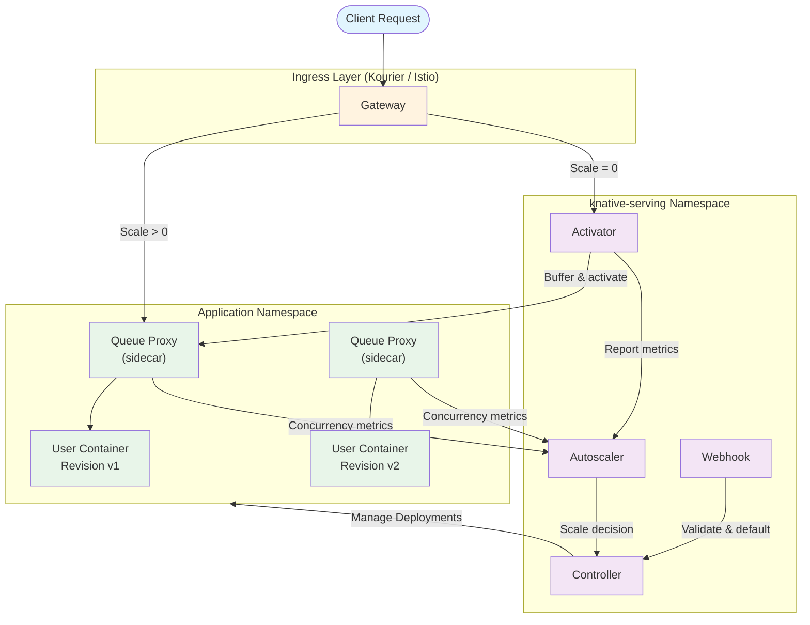
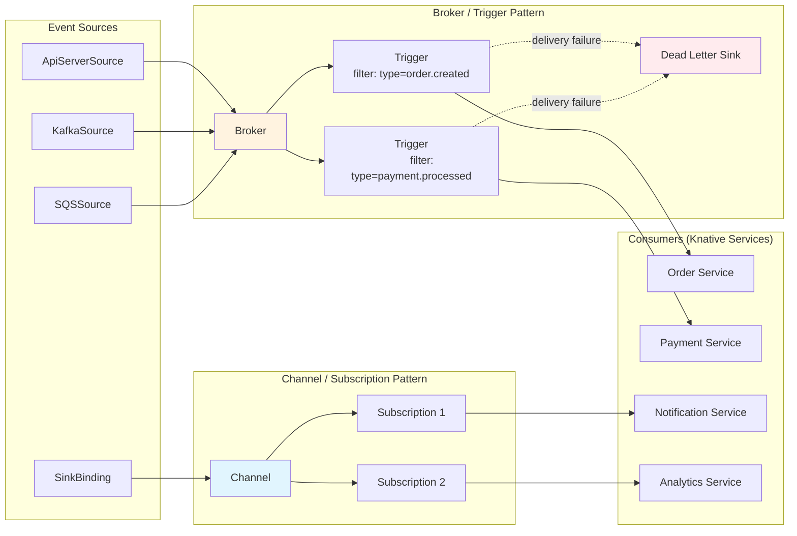
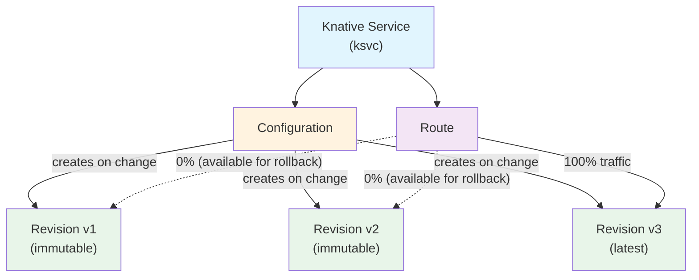
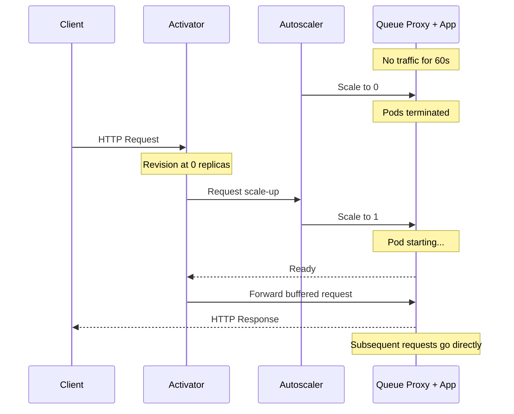
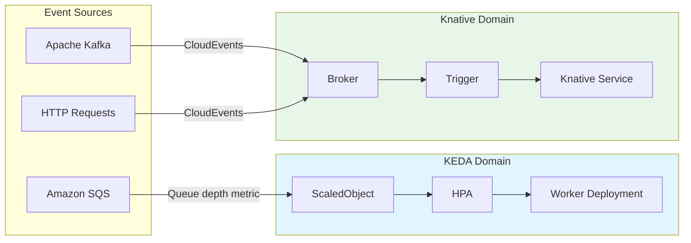

# Knative

> **Supported Versions**: Knative v1.16+, Kourier v1.16+
> **最后更新**: June 2025

## 目录

- [概述和学习目标](#overview-and-learning-objectives)
- [Knative 架构](#knative-architecture)
- [EKS 安装和配置](#eks-installation-and-configuration)
- [Knative Serving 深入解析](#knative-serving-deep-dive)
- [Knative Eventing 深入解析](#knative-eventing-deep-dive)
- [KEDA 与 Knative 对比](#keda-vs-knative-comparison)
- [生产环境运维](#production-operations)
- [最佳实践](#best-practices)
- [参考资料](#references)

---

## 概述和学习目标

### 什么是 Knative？

Knative 是一个 **CNCF Graduated** 项目，它扩展了 Kubernetes，提供一组用于构建、部署和管理现代 serverless 工作负载的中间件组件。Knative 并不是替换 Kubernetes 原语，而是构建在它们之上，提供更高层抽象来简化常见模式，例如基于请求的自动扩缩容、事件交付和流量管理。

Knative 由两个可独立安装的组件组成：

- **Knative Serving** -- 管理 serverless 工作负载的生命周期。它自动化 Deployment、扩缩容（包括 scale-to-zero）、Revision 跟踪和流量路由。
- **Knative Eventing** -- 提供按照 CloudEvents 规范生产、路由和消费事件的基础设施。它将事件生产者与消费者解耦，从而支持松耦合的事件驱动架构。

### Kubernetes 上的 Serverless

传统 Kubernetes Deployments 要求运维人员预先配置副本数、HPA 阈值和资源预算。Knative 转移了这项负担：

1. 工作负载会根据传入请求并发数或 RPS，自动从零扩展到多个副本。
2. Revisions 捕获每次部署的不可变快照，从而支持即时回滚和渐进式流量切换。
3. Event sources 和 triggers 允许无需轮询或自定义胶水代码即可构建响应式架构。

其结果是一个既保留 Kubernetes 全部能力（调度、RBAC、网络、存储），又提供接近完全托管 serverless 平台的开发者体验的平台。

### Knative Serving vs Eventing

| 方面 | Knative Serving | Knative Eventing |
|--------|----------------|-----------------|
| 主要用途 | 基于请求的工作负载生命周期 | 事件路由和交付 |
| 扩缩容触发器 | HTTP 请求并发 / RPS | 事件量（通过 Broker/Trigger） |
| Scale-to-zero | 是（内置） | 取决于消费者（基于 Serving 的消费者可以） |
| 核心资源 | Service, Configuration, Revision, Route | Broker, Trigger, Channel, Subscription, Source |
| 典型使用场景 | APIs, web apps, microservices | 异步流水线、webhooks、CDC streams |

### Knative vs AWS Lambda and AWS Fargate

| 功能 | Knative on EKS | AWS Lambda | AWS Fargate |
|---------|---------------|------------|-------------|
| 运行时环境 | 任意 OCI container | Lambda runtimes 或 container images | 任意 OCI container |
| 最大执行时间 | 无硬性限制 | 15 分钟 | 无硬性限制 |
| Scale-to-zero | 是 | 是 | 否（最少 tasks） |
| 冷启动控制 | 可配置（minScale, initialScale） | 有限（SnapStart, provisioned concurrency） | N/A |
| 自定义网络 | 完整 VPC / CNI 控制 | 需要 VPC attachment | VPC native |
| GPU 支持 | 是（通过 node selectors） | 否 | 否 |
| Event sources | CloudEvents, Kafka, SQS, custom | 原生 AWS event sources | N/A（pull-based） |
| Vendor lock-in | 低（CNCF standard, portable） | 高（AWS proprietary） | 中（ECS/Fargate API） |
| Kubernetes-native | 是 | 否 | 部分支持（EKS on Fargate） |
| Observability | Prometheus, OpenTelemetry, any k8s tooling | CloudWatch, X-Ray | CloudWatch, X-Ray |
| 成本模型 | 消耗的 Cluster resources | 按 invocation + duration | 按 vCPU/memory-second |

### 学习目标

阅读本文档后，你将能够：

1. 解释 Knative 的架构，以及 Serving 和 Eventing 如何互补。
2. 在 Amazon EKS 上安装并配置带有 Kourier、DNS 和 TLS 的 Knative。
3. 使用精细粒度、基于并发的自动扩缩容部署 serverless 工作负载。
4. 使用 Revisions 和 Routes 实现流量拆分策略（canary、blue-green）。
5. 使用 Brokers、Triggers 和 CloudEvents 构建事件驱动流水线。
6. 比较 KEDA 和 Knative，并决定何时使用其中之一（或同时使用两者）。
7. 在生产环境中通过监控、高可用性和垃圾回收策略运维 Knative。

---

## Knative 架构

### Serving 架构

Knative Serving 在 `knative-serving` namespace 内部署五个关键组件。它们共同管理 serverless 工作负载的完整生命周期，从接收初始请求，到扩展应用程序并路由流量。



**组件职责：**

| 组件 | 角色 |
|-----------|------|
| **Activator** | 当 Revision 扩缩为零时接收请求。它缓冲请求、触发扩容，并在 pods 就绪后代理已缓冲的请求。当系统处于 "burst capacity" 模式时，它还充当负载均衡器。 |
| **Autoscaler** | 从 Queue Proxy sidecars 收集并发和 RPS metrics。使用 Knative Pod Autoscaler (KPA) 算法计算期望副本数，或委托给 Kubernetes HPA。将扩缩容决策传达给 Controller。 |
| **Queue Proxy** | 作为 sidecar 注入到每个 Knative pod。执行 `containerConcurrency` 限制，向 Autoscaler 报告实时并发，执行健康检查，并在缩容期间处理优雅关闭。 |
| **Controller** | 将 Knative CRDs（Service, Configuration, Revision, Route）协调为底层 Kubernetes resources（Deployments, Services, Ingress objects）。管理 revision 创建和垃圾回收。 |
| **Webhook** | 在准入时验证 Knative resource specifications 并设置默认值。确保无效配置在到达 Controller 前被拒绝。 |

### Eventing 架构

Knative Eventing 提供了一种声明式方式，将 event sources 绑定到消费者。它支持两种交付模式：**Broker/Trigger**（基于内容的路由）和 **Channel/Subscription**（直接 pub-sub）。



**Eventing 核心概念：**

| 概念 | 描述 |
|---------|-------------|
| **Event Source** | 生成或导入事件的资源。Knative 提供内置 sources（ApiServerSource, PingSource），社区维护用于 Kafka、AWS SQS、GitHub 等的 sources。 |
| **Broker** | 接收事件并将其扇出到匹配 Triggers 的事件网格。由 in-memory channel（默认）或 Kafka 支持以实现持久性。 |
| **Trigger** | 附加到 Broker 的过滤器。每个 Trigger 按 CloudEvent attributes（type, source, extensions）选择事件，并将匹配项路由到 subscriber。 |
| **Channel** | 持久或 in-memory 事件传输。与 Brokers 不同，Channels 不过滤 -- 每个 Subscription 都会接收每个事件。 |
| **Subscription** | 将 Channel 连接到 subscriber，并可选连接到 reply destination。 |
| **Dead Letter Sink** | 在耗尽 retry policies 后仍无法交付的事件的后备目的地。 |
| **CloudEvents** | 所有 Knative Eventing 组件使用的 CNCF 标准信封格式（v1.0）。提供跨 sources 和 consumers 的互操作性。 |

---

## EKS 安装和配置

### 先决条件

- 运行 Kubernetes 1.28 或更高版本的 EKS cluster。
- 已配置具有 cluster admin 访问权限的 `kubectl`。
- （可选）用于基于 Helm 安装的 `helm` v3.12+。

### Step 1: 安装 Knative Operator

Knative Operator 管理 Knative Serving 和 Eventing 组件的安装与生命周期。使用 Operator 可简化版本升级和配置管理。

```bash
# Install the Knative Operator v1.16
kubectl apply -f https://github.com/knative/operator/releases/download/knative-v1.16.0/operator.yaml

# Verify the Operator is running
kubectl get deployment knative-operator -n default
```

### Step 2: 通过 Operator 安装 Knative Serving

创建一个 `KnativeServing` custom resource 来部署 Serving 组件：

```yaml
apiVersion: operator.knative.dev/v1beta1
kind: KnativeServing
metadata:
  name: knative-serving
  namespace: knative-serving
spec:
  version: "1.16.0"
  ingress:
    kourier:
      enabled: true
  config:
    network:
      ingress-class: kourier.ingress.networking.knative.dev
    autoscaler:
      # KPA is the default; set to "hpa" to use Kubernetes HPA
      class: kpa.autoscaling.knative.dev
      # Target 70% average concurrency per pod
      target-utilization-percentage: "70"
    defaults:
      # All new Revisions default to these values
      revision-timeout-seconds: "300"
      container-concurrency: "0"
    deployment:
      # Queue proxy resource requests
      queue-sidecar-cpu-request: "25m"
      queue-sidecar-memory-request: "50Mi"
```

```bash
# Create the namespace and apply
kubectl create namespace knative-serving
kubectl apply -f knative-serving.yaml

# Wait for all Serving pods to become ready
kubectl wait --for=condition=Ready pods --all -n knative-serving --timeout=300s
```

### Step 3: 安装 Kourier（轻量级 Ingress）

Kourier 是 EKS 上 Knative 推荐的轻量级 ingress。它比 Istio 更简单，并且资源占用更小。

如果你按照上文通过带有 `kourier` 部分的 Operator 安装了 Serving，Kourier 会自动安装。对于手动安装：

```bash
# Install Kourier
kubectl apply -f https://github.com/knative/net-kourier/releases/download/knative-v1.16.0/kourier.yaml

# Patch the config-network ConfigMap to use Kourier
kubectl patch configmap/config-network \
  --namespace knative-serving \
  --type merge \
  --patch '{"data":{"ingress-class":"kourier.ingress.networking.knative.dev"}}'

# Verify Kourier is running
kubectl get pods -n kourier-system
kubectl get svc kourier -n kourier-system
```

在 EKS 上，Kourier service 以 `LoadBalancer` 暴露，默认会预置一个 AWS Network Load Balancer (NLB)。若要改用 Application Load Balancer (ALB)，请相应地为 service 添加 annotation：

```yaml
apiVersion: v1
kind: Service
metadata:
  name: kourier
  namespace: kourier-system
  annotations:
    service.beta.kubernetes.io/aws-load-balancer-type: "external"
    service.beta.kubernetes.io/aws-load-balancer-nlb-target-type: "ip"
    service.beta.kubernetes.io/aws-load-balancer-scheme: "internet-facing"
spec:
  type: LoadBalancer
```

### Step 4: DNS 配置

Knative 为每个 Service 生成形如 `<service>.<namespace>.<domain>` 的 URLs。你必须配置 DNS，使这些 URLs 解析到 Ingress gateway。

#### Option A: Magic DNS (sslip.io) -- 仅开发环境

Magic DNS 使用 `sslip.io` 自动将任何 hostname 解析到嵌入的 IP 地址。这仅适用于开发和测试。

```bash
# Configure Knative to use sslip.io
kubectl apply -f https://github.com/knative/serving/releases/download/knative-v1.16.0/serving-default-domain.yaml

# Verify: a service "my-app" in namespace "default" would get the URL:
# http://my-app.default.<EXTERNAL-IP>.sslip.io
```

#### Option B: 使用 Amazon Route 53 的真实 DNS -- 生产环境

对于生产环境，请使用 Route 53 配置真实域名：

```bash
# 1. Get the Kourier external IP / hostname
KOURIER_LB=$(kubectl get svc kourier -n kourier-system \
  -o jsonpath='{.status.loadBalancer.ingress[0].hostname}')

# 2. Create a wildcard CNAME record in Route 53
#    *.knative.example.com -> $KOURIER_LB
aws route53 change-resource-record-sets \
  --hosted-zone-id Z0123456789ABCDEFGHIJ \
  --change-batch '{
    "Changes": [{
      "Action": "UPSERT",
      "ResourceRecordSet": {
        "Name": "*.knative.example.com",
        "Type": "CNAME",
        "TTL": 300,
        "ResourceRecords": [{"Value": "'$KOURIER_LB'"}]
      }
    }]
  }'

# 3. Configure Knative to use this domain
kubectl patch configmap/config-domain \
  --namespace knative-serving \
  --type merge \
  --patch '{"data":{"knative.example.com":""}}'
```

### Step 5: 使用 cert-manager 配置 TLS

集成 cert-manager，为 Knative Services 自动预置和续期 TLS certificates。

```bash
# Install the Knative cert-manager integration
kubectl apply -f https://github.com/knative/net-certmanager/releases/download/knative-v1.16.0/release.yaml
```

配置 Knative 自动请求 certificates：

```yaml
apiVersion: v1
kind: ConfigMap
metadata:
  name: config-network
  namespace: knative-serving
data:
  ingress-class: kourier.ingress.networking.knative.dev
  auto-tls: "Enabled"
  http-protocol: "Redirected"
---
apiVersion: v1
kind: ConfigMap
metadata:
  name: config-certmanager
  namespace: knative-serving
data:
  issuerRef: |
    kind: ClusterIssuer
    name: letsencrypt-prod
```

创建 ClusterIssuer（假设 cert-manager 已安装）：

```yaml
apiVersion: cert-manager.io/v1
kind: ClusterIssuer
metadata:
  name: letsencrypt-prod
spec:
  acme:
    server: https://acme-v02.api.letsencrypt.org/directory
    email: platform-team@example.com
    privateKeySecretRef:
      name: letsencrypt-prod-key
    solvers:
      - dns01:
          route53:
            region: us-west-2
            hostedZoneID: Z0123456789ABCDEFGHIJ
```

### Step 6: HPA vs KPA Autoscaler 选择

Knative 支持两种 autoscaler 实现。选择会显著影响扩缩容行为。

| 功能 | KPA (Knative Pod Autoscaler) | HPA (Kubernetes HPA) |
|---------|------------------------------|----------------------|
| Scale-to-zero | 是 | 否 |
| Metrics | Concurrency, RPS | CPU, Memory, Custom metrics |
| 扩缩容速度 | 快（panic/stable windows） | 标准 HPA intervals |
| 配置 | Knative annotations | 标准 HPA spec |
| 最适合 | HTTP workloads, latency-sensitive | CPU/memory-bound workloads |

在 cluster 范围配置默认 autoscaler class：

```yaml
# In config-autoscaler ConfigMap
apiVersion: v1
kind: ConfigMap
metadata:
  name: config-autoscaler
  namespace: knative-serving
data:
  # "kpa.autoscaling.knative.dev" or "hpa.autoscaling.knative.dev"
  class: "kpa.autoscaling.knative.dev"

  # KPA-specific settings
  stable-window: "60s"
  panic-window-percentage: "10"
  panic-threshold-percentage: "200"
  scale-to-zero-grace-period: "30s"
  scale-to-zero-pod-retention-period: "0s"

  # Target defaults
  target-burst-capacity: "200"
  requests-per-second-target-default: "200"
  container-concurrency-target-default: "100"
```

使用 annotations 针对每个 Revision 覆盖：

```yaml
metadata:
  annotations:
    autoscaling.knative.dev/class: "hpa.autoscaling.knative.dev"
    autoscaling.knative.dev/metric: "cpu"
    autoscaling.knative.dev/target: "70"
```

### Step 7: 安装 Knative Eventing

```yaml
apiVersion: operator.knative.dev/v1beta1
kind: KnativeEventing
metadata:
  name: knative-eventing
  namespace: knative-eventing
spec:
  version: "1.16.0"
  config:
    default-ch-webhook:
      default-ch-config: |
        clusterDefault:
          apiVersion: messaging.knative.dev/v1
          kind: InMemoryChannel
```

```bash
kubectl create namespace knative-eventing
kubectl apply -f knative-eventing.yaml
kubectl wait --for=condition=Ready pods --all -n knative-eventing --timeout=300s
```

---

## Knative Serving 深入解析

### 资源模型

Knative Serving 引入了四个主要 custom resources，它们协同工作以管理 serverless 工作负载的完整生命周期。



| 资源 | 描述 |
|----------|-------------|
| **Service** (`ksvc`) | 顶层资源。通过拥有一个 Configuration 和一个 Route 来管理整个生命周期。大多数用户只与 Services 交互。 |
| **Configuration** | 描述工作负载的期望状态（container image、environment variables、resource limits）。每次更新 Configuration 都会创建一个新的 Revision。 |
| **Revision** | Configuration 的不可变时间点快照。Revisions 会自动命名（例如 `my-app-00001`）。旧 Revisions 会保留用于流量拆分和回滚。 |
| **Route** | 将网络流量映射到一个或多个 Revisions。支持 canary deployments、blue-green releases 和基于百分比的流量拆分。 |

### 完整 Knative Service YAML

以下示例部署一个生产级 Knative Service，包含显式 autoscaling、resource limits、health checks 和 scaling boundaries：

```yaml
apiVersion: serving.knative.dev/v1
kind: Service
metadata:
  name: order-api
  namespace: production
  labels:
    app.kubernetes.io/name: order-api
    app.kubernetes.io/part-of: ecommerce
    app.kubernetes.io/managed-by: knative
spec:
  template:
    metadata:
      annotations:
        # Autoscaling configuration
        autoscaling.knative.dev/class: "kpa.autoscaling.knative.dev"
        autoscaling.knative.dev/metric: "concurrency"
        autoscaling.knative.dev/target: "100"
        autoscaling.knative.dev/target-utilization-percentage: "70"
        autoscaling.knative.dev/min-scale: "2"
        autoscaling.knative.dev/max-scale: "50"
        autoscaling.knative.dev/initial-scale: "3"
        autoscaling.knative.dev/scale-down-delay: "15m"
        autoscaling.knative.dev/window: "60s"
    spec:
      containerConcurrency: 0
      timeoutSeconds: 300
      containers:
        - image: 123456789012.dkr.ecr.us-west-2.amazonaws.com/order-api:v1.2.3
          ports:
            - containerPort: 8080
              protocol: TCP
          env:
            - name: DB_HOST
              valueFrom:
                secretKeyRef:
                  name: db-credentials
                  key: host
            - name: LOG_LEVEL
              value: "info"
          resources:
            requests:
              cpu: "250m"
              memory: "512Mi"
            limits:
              cpu: "1000m"
              memory: "1Gi"
          readinessProbe:
            httpGet:
              path: /healthz
              port: 8080
            initialDelaySeconds: 5
            periodSeconds: 10
          livenessProbe:
            httpGet:
              path: /healthz
              port: 8080
            initialDelaySeconds: 15
            periodSeconds: 20
      serviceAccountName: order-api-sa
```

### Traffic Splitting: Canary Deployments

流量拆分允许你在 Revisions 之间逐步切换流量。这是 canary 和 blue-green 部署策略的基础。

#### Canary Deployment

将少量流量路由到新的 Revision，并随时间逐步增加：

```yaml
apiVersion: serving.knative.dev/v1
kind: Service
metadata:
  name: order-api
  namespace: production
spec:
  template:
    metadata:
      # The new Revision is created from this template
      annotations:
        autoscaling.knative.dev/min-scale: "2"
    spec:
      containers:
        - image: 123456789012.dkr.ecr.us-west-2.amazonaws.com/order-api:v1.3.0
          ports:
            - containerPort: 8080
  traffic:
    # 90% to the current stable Revision
    - revisionName: order-api-00005
      percent: 90
    # 10% canary to the latest Revision
    - latestRevision: true
      percent: 10
      tag: canary
```

逐步增加 canary 流量：

```bash
# Increase canary to 50%
kubectl patch ksvc order-api -n production --type merge --patch '
spec:
  traffic:
    - revisionName: order-api-00005
      percent: 50
    - latestRevision: true
      percent: 50
      tag: canary
'

# Promote canary to 100%
kubectl patch ksvc order-api -n production --type merge --patch '
spec:
  traffic:
    - latestRevision: true
      percent: 100
'
```

每个带 tag 的流量目标都有自己的 URL：`https://canary-order-api.production.knative.example.com`。这允许直接测试 canary Revision。

#### Blue-Green Deployment

在 blue-green 策略中，两个 Revisions 都以完整容量运行，并且流量会原子切换：

```yaml
apiVersion: serving.knative.dev/v1
kind: Service
metadata:
  name: order-api
  namespace: production
spec:
  template:
    spec:
      containers:
        - image: 123456789012.dkr.ecr.us-west-2.amazonaws.com/order-api:v2.0.0
          ports:
            - containerPort: 8080
  traffic:
    # Blue (current) receives 100% of production traffic
    - revisionName: order-api-00005
      percent: 100
      tag: blue
    # Green (new) is deployed but receives 0% traffic; accessible via tag URL
    - latestRevision: true
      percent: 0
      tag: green
```

通过 `https://green-order-api.production.knative.example.com` 验证 green 环境后，切换流量：

```bash
# Instant switch to green
kubectl patch ksvc order-api -n production --type merge --patch '
spec:
  traffic:
    - revisionName: order-api-00005
      percent: 0
      tag: blue
    - latestRevision: true
      percent: 100
      tag: green
'
```

### Scale-to-Zero 行为

Scale-to-zero 是 Knative Serving 的定义性特性。当一个 Revision 没有接收流量时，其 pods 会在可配置的 grace period 后终止。当新请求到达时，Activator 会缓冲请求、触发扩容，并在 pod 就绪后代理该请求。



控制 scale-to-zero 的关键参数：

| Annotation / Config | 默认值 | 描述 |
|---------------------|---------|-------------|
| `scale-to-zero-grace-period` (global) | 30s | Revision 中最后一个 pod 变为空闲后，系统在移除它之前等待的时间。 |
| `scale-to-zero-pod-retention-period` (global) | 0s | 即使已空闲，在最后一次请求后仍保留 pod 的最短时间。 |
| `autoscaling.knative.dev/scale-to-zero-pod-retention-period` (per-Revision) | inherited | 对全局保留周期的按 Revision 覆盖。 |
| `enable-scale-to-zero` (global) | true | 主开关。设置为 false 可在整个 cluster 范围禁用 scale-to-zero。 |

### 基于并发的扩缩容

Knative 的 KPA 基于观测到的并发（in-flight requests）或每秒请求数（RPS）进行扩缩容。该算法维护两个窗口：

- **Stable window**（默认 60s）：该周期内的平均并发驱动 steady-state 扩缩容决策。
- **Panic window**（默认 6s，即 stable 的 10%）：如果此窗口中的平均并发超过 panic 阈值（默认 target 的 200%），系统会激进扩容。

**关键 annotations：**

| Annotation | 示例 | 描述 |
|------------|---------|-------------|
| `autoscaling.knative.dev/metric` | `"concurrency"` or `"rps"` | 用于扩缩容的 metric。 |
| `autoscaling.knative.dev/target` | `"100"` | metric 的目标值（例如每个 pod 100 个并发请求）。 |
| `autoscaling.knative.dev/target-utilization-percentage` | `"70"` | Autoscaler 目标是将平均 utilization 保持在 target 的这个百分比。有效 target = target * utilization / 100。 |
| `spec.containerConcurrency` | `0` (unlimited) | 每个 container 的并发请求硬限制。Queue Proxy 会强制执行此限制并对超额请求排队。设置为 0 表示无限制。值为 1 可启用单线程处理。 |

**扩缩容公式：**

```
desiredReplicas = ceil( observedConcurrency / (target * targetUtilization / 100) )
```

例如，当 `target=100`、`targetUtilization=70%`，并且观测到 350 个并发请求时：

```
desiredReplicas = ceil(350 / (100 * 0.70)) = ceil(350 / 70) = ceil(5.0) = 5
```

### 冷启动优化

冷启动 -- 从零扩容时的延迟惩罚 -- 是一个常见问题。Knative 提供多种机制来缓解：

| 策略 | 配置 | 权衡 |
|----------|---------------|-----------|
| **minScale** | `autoscaling.knative.dev/min-scale: "2"` | 保持最少数量的 pods 运行。消除冷启动，但产生基线成本。 |
| **initialScale** | `autoscaling.knative.dev/initial-scale: "3"` | 新 Revision 首次部署时创建的 pods 数量。不会阻止之后 scale-to-zero。 |
| **scale-down-delay** | `autoscaling.knative.dev/scale-down-delay: "15m"` | 延迟缩容决策。适用于 bursty workloads，以避免频繁冷启动。 |
| **Container image caching** | 使用 EKS node-level image caching 或 pre-pull DaemonSets | 减少冷启动期间的 container 拉取时间。 |
| **Lightweight base images** | 使用 distroless 或基于 Alpine 的 images | 减少 image 大小和拉取时间。 |
| **Application warmup** | 实现等待 caches/connections 的 readiness probes | 确保 pod 只有在能够以全速处理流量后才报告 ready。 |

```yaml
# Example: latency-sensitive service with cold start mitigation
apiVersion: serving.knative.dev/v1
kind: Service
metadata:
  name: latency-critical-api
  namespace: production
spec:
  template:
    metadata:
      annotations:
        autoscaling.knative.dev/min-scale: "3"
        autoscaling.knative.dev/initial-scale: "5"
        autoscaling.knative.dev/scale-down-delay: "10m"
        autoscaling.knative.dev/target: "50"
        autoscaling.knative.dev/window: "30s"
    spec:
      containerConcurrency: 100
      containers:
        - image: 123456789012.dkr.ecr.us-west-2.amazonaws.com/api:v1.0.0
          ports:
            - containerPort: 8080
          readinessProbe:
            httpGet:
              path: /ready
              port: 8080
            initialDelaySeconds: 3
            periodSeconds: 5
```

### 私有和公开 Services

默认情况下，Knative Services 会通过 ingress gateway 对外暴露。你可以让一个 Service 仅在 cluster 内部可用：

```yaml
apiVersion: serving.knative.dev/v1
kind: Service
metadata:
  name: internal-processor
  namespace: production
  labels:
    networking.knative.dev/visibility: cluster-local
spec:
  template:
    spec:
      containers:
        - image: 123456789012.dkr.ecr.us-west-2.amazonaws.com/processor:v1.0.0
```

`cluster-local` label 会让 Knative 生成内部 URL（例如 `http://internal-processor.production.svc.cluster.local`），而不是可公开路由的 URL。这对于不应从 cluster 外部访问的内部 microservices 很有用。

你也可以在整个 cluster 范围设置默认可见性：

```yaml
# config-network ConfigMap
data:
  default-external-scheme: "https"
  visibility: "cluster-local"  # All services are private by default
```

---

## Knative Eventing 深入解析

### Event Sources

Event Sources 是将外部系统连接到 eventing mesh 的 Knative resources。每个 Source 都会向配置的 sink（Broker、Channel，或直接到 Knative Service）发送 CloudEvents。

#### ApiServerSource

监听 Kubernetes API server 的 resource events，并将它们作为 CloudEvents 转发：

```yaml
apiVersion: sources.knative.dev/v1
kind: ApiServerSource
metadata:
  name: pod-event-source
  namespace: production
spec:
  serviceAccountName: event-watcher-sa
  mode: Resource
  resources:
    - apiVersion: v1
      kind: Pod
    - apiVersion: apps/v1
      kind: Deployment
  sink:
    ref:
      apiVersion: eventing.knative.dev/v1
      kind: Broker
      name: default
```

#### SinkBinding

向任意 Kubernetes 工作负载注入 environment variables（特别是 `K_SINK`），使其无需硬编码目标即可向 sink 发送事件：

```yaml
apiVersion: sources.knative.dev/v1
kind: SinkBinding
metadata:
  name: order-producer-binding
  namespace: production
spec:
  subject:
    apiVersion: apps/v1
    kind: Deployment
    name: order-producer
  sink:
    ref:
      apiVersion: eventing.knative.dev/v1
      kind: Broker
      name: default
  ceOverrides:
    extensions:
      source: order-system
```

你的应用程序读取 `K_SINK` 并向其 POST CloudEvents：

```python
import os, requests, json
from datetime import datetime

sink_url = os.environ["K_SINK"]

event = {
    "specversion": "1.0",
    "type": "com.example.order.created",
    "source": "/orders/api",
    "id": "order-12345",
    "time": datetime.utcnow().isoformat() + "Z",
    "datacontenttype": "application/json",
    "data": {"orderId": "12345", "amount": 99.99}
}

headers = {
    "Content-Type": "application/cloudevents+json",
    "ce-specversion": event["specversion"],
    "ce-type": event["type"],
    "ce-source": event["source"],
    "ce-id": event["id"],
}

requests.post(sink_url, json=event["data"], headers=headers)
```

#### KafkaSource

从 Apache Kafka topics 消费消息，并将它们作为 CloudEvents 交付：

```yaml
apiVersion: sources.knative.dev/v1beta1
kind: KafkaSource
metadata:
  name: payment-events
  namespace: production
spec:
  consumerGroup: knative-payment-consumer
  bootstrapServers:
    - kafka-bootstrap.kafka.svc.cluster.local:9092
  topics:
    - payment-events
  sink:
    ref:
      apiVersion: eventing.knative.dev/v1
      kind: Broker
      name: default
  # Optional: configure SASL/TLS for MSK
  net:
    sasl:
      enable: true
      type:
        secretKeyRef:
          name: kafka-credentials
          key: sasl-type
      user:
        secretKeyRef:
          name: kafka-credentials
          key: username
      password:
        secretKeyRef:
          name: kafka-credentials
          key: password
    tls:
      enable: true
```

#### SQSSource (AWS)

从 Amazon SQS queues 消费消息。这需要 AWS event source controller：

```bash
# Install AWS event sources
kubectl apply -f https://github.com/triggermesh/aws-event-sources/releases/latest/download/aws-event-sources.yaml
```

```yaml
apiVersion: sources.triggermesh.io/v1alpha1
kind: AWSSQSSource
metadata:
  name: order-queue-source
  namespace: production
spec:
  arn: arn:aws:sqs:us-west-2:123456789012:order-events
  receiveOptions:
    visibilityTimeout: 60s
  auth:
    credentials:
      accessKeyID:
        valueFromSecret:
          name: aws-credentials
          key: access-key-id
      secretAccessKey:
        valueFromSecret:
          name: aws-credentials
          key: secret-access-key
  sink:
    ref:
      apiVersion: eventing.knative.dev/v1
      kind: Broker
      name: default
```

在 EKS 生产环境中，优先使用 IAM Roles for Service Accounts (IRSA)，而不是静态凭证。

### Broker/Trigger Pattern

Broker/Trigger 模式提供基于内容的事件路由。Broker 充当事件中心；Triggers 按 CloudEvent attributes 过滤事件并将其路由到 subscribers。

#### 完整 Broker/Trigger 示例

```yaml
# 1. Create the Broker
apiVersion: eventing.knative.dev/v1
kind: Broker
metadata:
  name: default
  namespace: production
  annotations:
    eventing.knative.dev/broker.class: MTChannelBasedBroker
spec:
  config:
    apiVersion: v1
    kind: ConfigMap
    name: config-br-default-channel
    namespace: knative-eventing
  delivery:
    retry: 5
    backoffPolicy: exponential
    backoffDelay: "PT2S"
    deadLetterSink:
      ref:
        apiVersion: serving.knative.dev/v1
        kind: Service
        name: dead-letter-handler
---
# 2. Trigger for order.created events -> Order Service
apiVersion: eventing.knative.dev/v1
kind: Trigger
metadata:
  name: order-created-trigger
  namespace: production
spec:
  broker: default
  filter:
    attributes:
      type: com.example.order.created
      source: /orders/api
  subscriber:
    ref:
      apiVersion: serving.knative.dev/v1
      kind: Service
      name: order-processor
---
# 3. Trigger for payment.processed events -> Payment Service
apiVersion: eventing.knative.dev/v1
kind: Trigger
metadata:
  name: payment-processed-trigger
  namespace: production
spec:
  broker: default
  filter:
    attributes:
      type: com.example.payment.processed
  subscriber:
    ref:
      apiVersion: serving.knative.dev/v1
      kind: Service
      name: payment-reconciler
  delivery:
    retry: 10
    backoffPolicy: exponential
    backoffDelay: "PT5S"
    deadLetterSink:
      ref:
        apiVersion: serving.knative.dev/v1
        kind: Service
        name: payment-dead-letter
---
# 4. Trigger for all events -> Analytics (no filter = catch-all)
apiVersion: eventing.knative.dev/v1
kind: Trigger
metadata:
  name: analytics-trigger
  namespace: production
spec:
  broker: default
  subscriber:
    ref:
      apiVersion: serving.knative.dev/v1
      kind: Service
      name: analytics-collector
```

### CloudEvents 标准

所有 Knative Eventing 组件都使用 [CloudEvents](https://cloudevents.io/) 规范（v1.0）通信。CloudEvents 定义了带有必需和可选 attributes 的通用信封：

| Attribute | Required | Example | Description |
|-----------|----------|---------|-------------|
| `specversion` | 是 | `"1.0"` | CloudEvents specification 版本。 |
| `type` | 是 | `"com.example.order.created"` | Event type。由 Triggers 用于路由。 |
| `source` | 是 | `"/orders/api"` | Event origin。与 type 组合用于过滤。 |
| `id` | 是 | `"evt-abc123"` | 用于去重的唯一 event identifier。 |
| `time` | 否 | `"2025-06-15T10:30:00Z"` | 事件发生的 timestamp。 |
| `datacontenttype` | 否 | `"application/json"` | `data` attribute 的 content type。 |
| `subject` | 否 | `"order-12345"` | source 上下文中的事件 subject。 |
| `data` | 否 | `{"orderId": "12345"}` | Event payload。 |

### Channel/Subscription Pattern

Channel/Subscription 模式提供不基于内容过滤的直接 pub-sub。Channel 上的每个 Subscription 都会接收每个事件。

```yaml
# 1. Create a Channel backed by Kafka for durability
apiVersion: messaging.knative.dev/v1beta1
kind: KafkaChannel
metadata:
  name: audit-events
  namespace: production
spec:
  numPartitions: 6
  replicationFactor: 3
  retentionDuration: PT168H  # 7 days
---
# 2. Subscription: forward to audit logging service
apiVersion: messaging.knative.dev/v1
kind: Subscription
metadata:
  name: audit-log-subscription
  namespace: production
spec:
  channel:
    apiVersion: messaging.knative.dev/v1beta1
    kind: KafkaChannel
    name: audit-events
  subscriber:
    ref:
      apiVersion: serving.knative.dev/v1
      kind: Service
      name: audit-logger
  reply:
    ref:
      apiVersion: serving.knative.dev/v1
      kind: Service
      name: audit-response-handler
---
# 3. Subscription: forward to compliance service
apiVersion: messaging.knative.dev/v1
kind: Subscription
metadata:
  name: compliance-subscription
  namespace: production
spec:
  channel:
    apiVersion: messaging.knative.dev/v1beta1
    kind: KafkaChannel
    name: audit-events
  subscriber:
    ref:
      apiVersion: serving.knative.dev/v1
      kind: Service
      name: compliance-checker
  delivery:
    deadLetterSink:
      ref:
        apiVersion: serving.knative.dev/v1
        kind: Service
        name: dead-letter-handler
    retry: 3
    backoffPolicy: linear
    backoffDelay: "PT10S"
```

### Dead Letter Sink

当事件交付在耗尽所有 retries 后仍失败时，该事件会转发到 Dead Letter Sink (DLS)。DLS 通常是一个 Knative Service，用于持久化失败事件以便后续分析或重放。

```yaml
apiVersion: serving.knative.dev/v1
kind: Service
metadata:
  name: dead-letter-handler
  namespace: production
spec:
  template:
    metadata:
      annotations:
        autoscaling.knative.dev/min-scale: "1"
    spec:
      containers:
        - image: 123456789012.dkr.ecr.us-west-2.amazonaws.com/dead-letter:v1.0.0
          env:
            - name: S3_BUCKET
              value: "failed-events-production"
            - name: AWS_REGION
              value: "us-west-2"
```

在 Broker 级别配置 DLS（应用于所有 Triggers），或在单个 Trigger/Subscription 级别配置以实现细粒度控制。

### Event Filtering

Triggers 支持按 CloudEvent attributes 和 extensions 进行过滤。

#### Attribute Filtering

```yaml
spec:
  filter:
    attributes:
      type: com.example.order.created
      source: /orders/api
```

此 Trigger 仅在 `type` 和 `source` 都匹配时触发（逻辑 AND）。

#### Extension Filtering

你可以按 producers 设置的自定义 CloudEvent extensions 进行过滤：

```yaml
spec:
  filter:
    attributes:
      type: com.example.order.created
      myextension: priority-high
```

#### 用于 OR 逻辑的多个 Triggers

由于单个 Trigger filter 仅支持 AND，若要实现 OR 逻辑，请在同一个 subscriber 上使用多个 Triggers：

```yaml
# Trigger 1: react to order.created
apiVersion: eventing.knative.dev/v1
kind: Trigger
metadata:
  name: order-created
spec:
  broker: default
  filter:
    attributes:
      type: com.example.order.created
  subscriber:
    ref:
      apiVersion: serving.knative.dev/v1
      kind: Service
      name: notification-service
---
# Trigger 2: also react to order.cancelled
apiVersion: eventing.knative.dev/v1
kind: Trigger
metadata:
  name: order-cancelled
spec:
  broker: default
  filter:
    attributes:
      type: com.example.order.cancelled
  subscriber:
    ref:
      apiVersion: serving.knative.dev/v1
      kind: Service
      name: notification-service
```

---

## KEDA 与 Knative 对比

KEDA 和 Knative 都能在 Kubernetes 上实现事件驱动扩缩容，但它们工作在不同抽象层级，并承担互补角色。

### 扩缩容模型差异

| 方面 | KEDA | Knative |
|--------|------|---------|
| **抽象层级** | 使用自定义 metric sources 扩展 HPA | 完整 serverless 平台（deployment, routing, scaling） |
| **扩缩容机制** | 创建/管理 HPA resources | 自定义 KPA controller 或 HPA delegation |
| **主要 metric** | External metrics（queue depth, DB rows, custom） | HTTP concurrency / RPS |
| **工作负载类型** | 任意 Deployment, StatefulSet, Job | Knative Service（管理自己的 Deployment） |
| **CRDs** | ScaledObject, ScaledJob, TriggerAuthentication | Service, Configuration, Revision, Route |
| **内置路由** | 否 | 是（traffic splitting, revisions, canary） |
| **内置 eventing** | 否（仅关注扩缩容） | 是（Broker/Trigger, Channel/Subscription） |

### Scale-to-Zero 行为差异

| 行为 | KEDA | Knative (KPA) |
|----------|------|---------------|
| Scale-to-zero 触发器 | Metric 值降至 0 或低于阈值 | 在可配置 grace period 内没有 HTTP requests |
| 激活机制 | 当 metric > 0 时，KEDA Operator 将 replicas 从 0 设置为 `minReplicaCount` | Activator 缓冲 HTTP requests 并触发扩容 |
| 请求缓冲 | 否（不感知 HTTP） | 是（Activator 在冷启动期间缓冲） |
| Cool-down period | ScaledObject 上的 `cooldownPeriod` | `scale-to-zero-grace-period` + `stable-window` |
| Jobs 的 scale-to-zero | 是（ScaledJob） | 否（Serving 只处理长时间运行的 processes） |

### 事件驱动架构中的角色



### 何时使用 KEDA vs Knative

| 使用场景 | 推荐 | 原因 |
|----------|-------------|--------|
| 根据 SQS queue depth 扩展 workers | **KEDA** | KEDA 有原生 SQS scaler；不需要 HTTP routing。 |
| 部署带自动扩缩容和流量拆分的 HTTP APIs | **Knative** | Serving 提供 revision management、traffic splitting 和 HTTP-aware autoscaling。 |
| 根据 Prometheus metrics 扩缩容 | **KEDA** | KEDA 的 Prometheus scaler 成熟且经过充分测试。 |
| 带 CloudEvents 的事件驱动 microservices | **Knative** | Eventing 提供 Broker/Trigger、dead letter handling 和 CloudEvents support。 |
| 扩展 CronJobs 或 batch workloads | **KEDA** | ScaledJob 专为此设计。Knative Serving 用于长时间运行的 processes。 |
| 根据 CPU/memory 进行带 scale-to-zero 的扩缩容 | **KEDA** | Knative 的 KPA 关注 concurrency/RPS，而不是 CPU/memory。 |
| 面向开发者的 serverless 平台 | **Knative** | 更高层抽象；开发者可使用 `kn service create` 部署。 |

### 结合使用 KEDA 和 Knative

KEDA 和 Knative 并不互斥。常见架构使用：

- **Knative Serving** 用于面向 HTTP 的 services（APIs、web applications），并采用基于并发的 autoscaling。
- **KEDA** 用于后台 workers（queue consumers、batch processors），并采用基于 external metrics 的 autoscaling。
- **Knative Eventing** 用于在 services 之间路由事件，包括通过 SinkBinding 连接 KEDA 扩缩容的 workers。

```yaml
# Knative Service: receives HTTP events from Broker
apiVersion: serving.knative.dev/v1
kind: Service
metadata:
  name: event-enricher
spec:
  template:
    spec:
      containers:
        - image: event-enricher:v1
---
# KEDA ScaledObject: scales a Deployment based on SQS queue depth
apiVersion: keda.sh/v1alpha1
kind: ScaledObject
metadata:
  name: sqs-worker-scaler
spec:
  scaleTargetRef:
    name: sqs-worker
  minReplicaCount: 0
  maxReplicaCount: 100
  triggers:
    - type: aws-sqs-queue
      metadata:
        queueURL: https://sqs.us-west-2.amazonaws.com/123456789012/enriched-events
        queueLength: "5"
        awsRegion: us-west-2
      authenticationRef:
        name: keda-aws-credentials
```

---

## 生产环境运维

### Resource Limits 和 QoS

在生产环境中，始终为应用程序 container 和 Queue Proxy sidecar 设置 resource requests 和 limits。这确保 pods 获得 `Guaranteed` 或 `Burstable` QoS class，防止 OOM kills 和 noisy-neighbor 问题。

```yaml
# Global Queue Proxy resources (config-deployment ConfigMap)
apiVersion: v1
kind: ConfigMap
metadata:
  name: config-deployment
  namespace: knative-serving
data:
  queue-sidecar-cpu-request: "50m"
  queue-sidecar-cpu-limit: "500m"
  queue-sidecar-memory-request: "100Mi"
  queue-sidecar-memory-limit: "256Mi"
  # Enforce resource limits on all revisions
  queue-sidecar-token-audiences: ""
```

### Revision 垃圾回收

随着时间推移，旧 Revisions 会累积。配置垃圾回收以限制保留的 Revisions 数量：

```yaml
# config-gc ConfigMap
apiVersion: v1
kind: ConfigMap
metadata:
  name: config-gc
  namespace: knative-serving
data:
  # Minimum number of non-active Revisions to retain
  min-non-active-revisions: "2"
  # Maximum number of non-active Revisions to retain
  max-non-active-revisions: "10"
  # Duration to retain non-active Revisions (Go duration format)
  retain-since-create-time: "48h"
  retain-since-last-active-time: "24h"
  # Minimum staleness before a Revision is eligible for GC
  min-stale-revision-create-delay: "24h"
```

### 高可用配置

对于生产工作负载，请为 Knative Serving 组件配置高可用性：

```yaml
apiVersion: operator.knative.dev/v1beta1
kind: KnativeServing
metadata:
  name: knative-serving
  namespace: knative-serving
spec:
  version: "1.16.0"
  high-availability:
    replicas: 3
  ingress:
    kourier:
      enabled: true
  workloads:
    - name: activator
      replicas: 3
      resources:
        requests:
          cpu: "300m"
          memory: "256Mi"
        limits:
          cpu: "1000m"
          memory: "512Mi"
    - name: controller
      replicas: 2
    - name: webhook
      replicas: 2
```

此外，为 Knative system components 配置 Pod Disruption Budgets：

```yaml
apiVersion: policy/v1
kind: PodDisruptionBudget
metadata:
  name: activator-pdb
  namespace: knative-serving
spec:
  minAvailable: 2
  selector:
    matchLabels:
      app: activator
---
apiVersion: policy/v1
kind: PodDisruptionBudget
metadata:
  name: controller-pdb
  namespace: knative-serving
spec:
  minAvailable: 1
  selector:
    matchLabels:
      app: controller
```

使用 topology constraints 将 system pods 分布到多个 Availability Zones：

```yaml
apiVersion: apps/v1
kind: Deployment
metadata:
  name: activator
  namespace: knative-serving
spec:
  template:
    spec:
      topologySpreadConstraints:
        - maxSkew: 1
          topologyKey: topology.kubernetes.io/zone
          whenUnsatisfiable: DoNotSchedule
          labelSelector:
            matchLabels:
              app: activator
```

### 使用 Prometheus 监控

Knative Serving 和 Eventing 暴露 Prometheus metrics。配置 ServiceMonitor（用于 Prometheus Operator）或 scrape config 来收集它们。

```yaml
# ServiceMonitor for Knative Serving components
apiVersion: monitoring.coreos.com/v1
kind: ServiceMonitor
metadata:
  name: knative-serving
  namespace: monitoring
  labels:
    release: prometheus
spec:
  namespaceSelector:
    matchNames:
      - knative-serving
  selector:
    matchLabels:
      app.kubernetes.io/part-of: knative
  endpoints:
    - port: metrics
      interval: 15s
      path: /metrics
---
# ServiceMonitor for application-level metrics (Queue Proxy)
apiVersion: monitoring.coreos.com/v1
kind: ServiceMonitor
metadata:
  name: knative-revisions
  namespace: monitoring
  labels:
    release: prometheus
spec:
  namespaceSelector:
    any: true
  selector:
    matchLabels:
      serving.knative.dev/service: ""
  endpoints:
    - port: http-usermetric
      interval: 10s
      path: /metrics
    - port: http-queueadm
      interval: 10s
      path: /metrics
```

**需要监控的关键 metrics：**

| Metric | Component | Description |
|--------|-----------|-------------|
| `revision_app_request_count` | Queue Proxy | 每个 Revision 的总请求数。 |
| `revision_app_request_latencies` | Queue Proxy | 请求延迟直方图。 |
| `revision_request_concurrency` | Queue Proxy | 每个 pod 当前 in-flight request 数量。 |
| `activator_request_count` | Activator | Activator 处理的请求（表示冷启动）。 |
| `autoscaler_desired_pods` | Autoscaler | 每个 Revision 的期望副本数。 |
| `autoscaler_actual_pods` | Autoscaler | 当前实际副本数。 |
| `autoscaler_panic_mode` | Autoscaler | Autoscaler 是否处于 panic mode（1 = yes）。 |
| `controller_reconcile_count` | Controller | 按 resource type 和 result 统计的 reconciliation 次数。 |
| `broker_event_count` | Eventing | 每个 Broker 处理的事件。 |
| `trigger_filter_event_count` | Eventing | 通过/未通过 Trigger filter 的事件。 |

### Grafana Dashboard

导入或创建一个 Grafana dashboard，用于可视化上述 Knative metrics。下面是一个基本 Knative overview dashboard 的 JSON model：

```json
{
  "dashboard": {
    "title": "Knative Overview",
    "panels": [
      {
        "title": "Request Rate by Revision",
        "type": "graph",
        "targets": [
          {
            "expr": "sum(rate(revision_app_request_count[5m])) by (revision_name)",
            "legendFormat": "{{revision_name}}"
          }
        ]
      },
      {
        "title": "Request Latency P99",
        "type": "graph",
        "targets": [
          {
            "expr": "histogram_quantile(0.99, sum(rate(revision_app_request_latencies_bucket[5m])) by (le, revision_name))",
            "legendFormat": "{{revision_name}}"
          }
        ]
      },
      {
        "title": "Concurrency per Pod",
        "type": "graph",
        "targets": [
          {
            "expr": "avg(revision_request_concurrency) by (revision_name)",
            "legendFormat": "{{revision_name}}"
          }
        ]
      },
      {
        "title": "Desired vs Actual Pods",
        "type": "graph",
        "targets": [
          {
            "expr": "autoscaler_desired_pods",
            "legendFormat": "desired - {{revision_name}}"
          },
          {
            "expr": "autoscaler_actual_pods",
            "legendFormat": "actual - {{revision_name}}"
          }
        ]
      },
      {
        "title": "Activator Requests (Cold Starts)",
        "type": "graph",
        "targets": [
          {
            "expr": "sum(rate(activator_request_count[5m])) by (revision_name)",
            "legendFormat": "{{revision_name}}"
          }
        ]
      },
      {
        "title": "Autoscaler Panic Mode",
        "type": "stat",
        "targets": [
          {
            "expr": "autoscaler_panic_mode",
            "legendFormat": "{{revision_name}}"
          }
        ]
      }
    ]
  }
}
```

### 故障排查

#### 冷启动延迟过高

**症状：** 空闲期后的第一个请求需要数秒。

**诊断：**

```bash
# Check if the Revision is scaled to zero
kubectl get ksvc order-api -n production -o jsonpath='{.status.conditions}' | jq .

# Check Activator logs for buffering duration
kubectl logs -l app=activator -n knative-serving --tail=50

# Check pod startup time
kubectl get pods -l serving.knative.dev/service=order-api -n production \
  -o jsonpath='{range .items[*]}{.metadata.name}{"\t"}{.status.conditions}{"\n"}{end}'
```

**解决方案：**
1. 设置 `autoscaling.knative.dev/min-scale: "1"`，保持至少一个 pod 预热。
2. 减小 container image 大小。
3. 使用短间隔的 readiness probes。
4. 使用 DaemonSet 预拉取 images。

#### 扩缩容过慢或振荡

**症状：** Pod 数量跟不上负载，或反复扩容和缩容。

**诊断：**

```bash
# Check Autoscaler metrics
kubectl logs -l app=autoscaler -n knative-serving --tail=100

# View current scale decisions
kubectl get podautoscaler -n production
kubectl describe podautoscaler order-api-00001 -n production
```

**解决方案：**
1. 缩短 `stable-window` 以获得更快响应（例如 `30s`）。
2. 提高 `target-utilization-percentage`，以便在扩容前留出更多余量。
3. 调整 `panic-window-percentage` 和 `panic-threshold-percentage` 以处理突发流量。
4. 如果使用 HPA class，请增大 `--horizontal-pod-autoscaler-sync-period`。

#### 事件未被交付

**症状：** 事件已产生，但 Triggers 未触发。

**诊断：**

```bash
# Verify Broker is ready
kubectl get broker default -n production -o yaml

# Check Trigger status
kubectl get triggers -n production
kubectl describe trigger order-created-trigger -n production

# Inspect Eventing controller logs
kubectl logs -l app=eventing-controller -n knative-eventing --tail=100

# Check dead letter sink for failed events
kubectl logs -l serving.knative.dev/service=dead-letter-handler -n production --tail=50
```

**解决方案：**
1. 验证 Trigger filter attributes 与 CloudEvent attributes 完全匹配（区分大小写）。
2. 检查 subscriber Service 是否 ready 且可达。
3. 确保 Broker 的 backing channel 健康。
4. 确认 RBAC 允许 event source 的 ServiceAccount 向 Broker 发送事件。

#### DNS 解析失败

**症状：** Knative Service URLs 返回 `NXDOMAIN` 或连接超时。

**诊断：**

```bash
# Verify Kourier service has an external address
kubectl get svc kourier -n kourier-system

# Check config-domain
kubectl get cm config-domain -n knative-serving -o yaml

# Test DNS resolution
nslookup order-api.production.knative.example.com

# Check the Knative Service URL
kubectl get ksvc order-api -n production -o jsonpath='{.status.url}'
```

**解决方案：**
1. 对于 sslip.io：确保外部 IP 可达，并且安全组未阻塞 80/443 端口。
2. 对于 Route 53：验证 wildcard CNAME record 解析到 Kourier load balancer。
3. 检查 `config-domain` 是否有正确的 domain 条目。

---

## 最佳实践

### Service 设计模式

1. **每个 Knative Service 一个 container。** Knative Services 设计为单个 application container 加 Queue Proxy sidecar。除非绝对必要，否则避免 multi-container pods（Knative 确实支持它们，但扩缩容模型假设只有一个 primary container）。

2. **有意识地使用 `containerConcurrency`。** 对于线程安全且能处理大量并发请求的应用程序，将其设置为 `0`（unlimited）。对于单线程 processors（例如单个 GPU 上的 ML inference），如果并发请求会降低性能，则将其设置为 `1`。

3. **分离读写路径。** 将读多的 APIs 和写多的 processors 部署为具有不同扩缩容配置的独立 Knative Services。读 services 可以有较高的 `target`（100+ concurrency），而写 services 可能需要较低的 `target`（10-20），以避免压垮数据库。

4. **为 Revisions 打 tag 以便回滚。** 始终为最后一个已知良好的 Revision 打 tag，以便可以即时回滚：

```bash
kn service update order-api --tag order-api-00005=stable --tag @latest=canary
```

5. **将私有 services 用于内部通信。** 对不应面向互联网的 services 应用 `networking.knative.dev/visibility: cluster-local`。这会减少攻击面，并避免不必要的 load balancer 成本。

### 事件驱动 Microservices 模式

1. **使用 Brokers 进行多消费者路由。** 当多个 services 需要响应同一种事件类型时，使用一个带有多个 Triggers 的 Broker，而不是复制 event source。

2. **始终配置 Dead Letter Sinks。** 无法交付的事件绝不应被静默丢弃。在 Broker 级别配置 DLS 作为安全网，并在关键路径的单个 Trigger 级别配置 DLS。

3. **采用 CloudEvents 命名约定。** 使用 reverse-DNS notation 定义 event types：`com.<company>.<domain>.<action>`（例如 `com.example.order.created`）。这可避免命名冲突，并使 Trigger filters 更清晰。

4. **幂等消费者。** 由于事件可能会被交付多次（at-least-once semantics），请将 consumers 设计为幂等。使用 CloudEvent `id` attribute 进行去重。

5. **使用 Kafka-backed Channels 实现持久性。** 默认 InMemoryChannel 会在 pod 重启时丢失事件。对于生产环境，请安装 KafkaChannel 并将其配置为默认：

```yaml
# config-br-default-channel ConfigMap
data:
  channel-template-spec: |
    apiVersion: messaging.knative.dev/v1beta1
    kind: KafkaChannel
    spec:
      numPartitions: 6
      replicationFactor: 3
```

### 使用 Scale-to-Zero 优化成本

1. **为非关键 services 启用 scale-to-zero。** Development、staging 和低流量生产 services 应在空闲时 scale to zero。对于流量零散的环境，这可以减少 60-80% 的计算成本。

2. **对 bursty workloads 使用 `scale-down-delay`。** 如果流量以突发形式到来，并由短空闲期分隔，设置缩容延迟（例如 5-15 分钟）可避免反复冷启动，而无需无限期保持 pods 运行。

3. **结合 Karpenter 提高 node-level 效率。** 当 Knative 将 pods 缩为零时，释放的容量允许 Karpenter 合并或终止利用率不足的 nodes：

| 层级 | 工具 | 动作 |
|-------|------|--------|
| Application (Pods) | Knative Serving | 空闲时将 pods 缩为零 |
| Infrastructure (Nodes) | Karpenter | 合并并终止空 nodes |
| Cost visibility | AWS Cost Explorer / Kubecost | 跟踪 scale-to-zero 带来的节省 |

4. **仅在需要时设置 `minScale`。** 将 `minScale > 0` 保留给 latency-critical 路径。其他所有情况都让 pods scale to zero。

### Knative 与 GPU 工作负载

Knative 可以通过将 pods 调度到 GPU nodes 来服务 GPU-accelerated workloads（例如 ML inference）。关键注意事项：

```yaml
apiVersion: serving.knative.dev/v1
kind: Service
metadata:
  name: llm-inference
  namespace: ai
spec:
  template:
    metadata:
      annotations:
        autoscaling.knative.dev/class: "kpa.autoscaling.knative.dev"
        autoscaling.knative.dev/metric: "concurrency"
        autoscaling.knative.dev/target: "1"
        autoscaling.knative.dev/min-scale: "1"
        autoscaling.knative.dev/max-scale: "4"
    spec:
      # Single-request processing for GPU workloads
      containerConcurrency: 1
      timeoutSeconds: 600
      containers:
        - image: 123456789012.dkr.ecr.us-west-2.amazonaws.com/llm-server:v1
          ports:
            - containerPort: 8080
          resources:
            requests:
              cpu: "4"
              memory: "16Gi"
              nvidia.com/gpu: "1"
            limits:
              cpu: "8"
              memory: "32Gi"
              nvidia.com/gpu: "1"
      nodeSelector:
        node.kubernetes.io/instance-type: g5.xlarge
      tolerations:
        - key: nvidia.com/gpu
          operator: Exists
          effect: NoSchedule
```

**GPU-specific tips:**
- 如果模型无法批处理并发请求，请设置 `containerConcurrency: 1`。如果 serving framework 支持 dynamic batching（例如 vLLM、Triton Inference Server），则可以提高该值。
- 设置 `min-scale: 1` 或更高以避免冷启动，因为 GPU container images 很大且模型加载较慢。
- 使用带 GPU NodePools 的 Karpenter，在 Knative 扩容时动态预置 GPU nodes。
- 使用 DCGM Exporter 和 NVIDIA GPU Operator metrics 监控 GPU utilization。

---

## 参考资料

### 官方文档

- [Knative 官方文档](https://knative.dev/docs/)
- [Knative GitHub 组织](https://github.com/knative)
- [Knative Serving API 参考](https://knative.dev/docs/reference/api/serving-api/)
- [Knative Eventing API 参考](https://knative.dev/docs/reference/api/eventing-api/)
- [Kourier GitHub 仓库](https://github.com/knative-extensions/net-kourier)
- [CloudEvents 规范](https://cloudevents.io/)
- [CNCF Knative 项目页面](https://www.cncf.io/projects/knative/)

### AWS 和 EKS 资源

- [AWS Blog: Serverless Containers with Knative and EKS](https://aws.amazon.com/blogs/containers/)
- [EKS Best Practices Guide](https://aws.github.io/aws-eks-best-practices/)
- [Amazon Route 53 Developer Guide](https://docs.aws.amazon.com/Route53/latest/DeveloperGuide/)
- [cert-manager on EKS](https://cert-manager.io/docs/installation/compatibility/)

### 相关内部文档

- [KEDA -- Kubernetes Event-driven Autoscaling](./01-keda.md)
- [Karpenter -- Cluster Autoscaler](./02-karpenter.md)
- [EKS Cost Optimization](../eks/07-eks-cost-optimization.md)

---

**上一页：** [Karpenter](./02-karpenter.md) | **下一页：** 无
