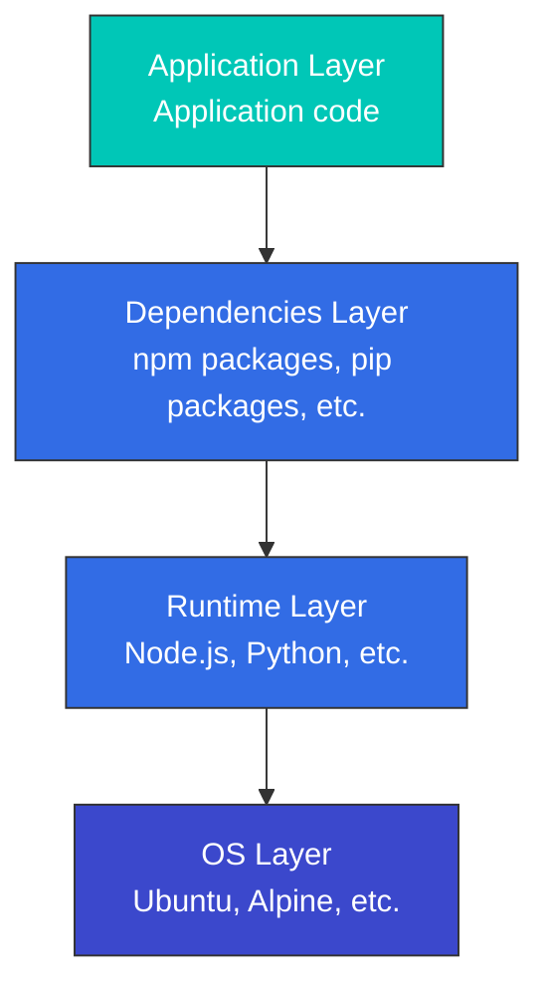

# 容器技术

> **支持的版本**：Docker 20.10+, containerd 1.6+, CRI-O 1.24+ **最后更新**：February 11, 2026

容器是一种将应用程序及其依赖项打包在一起的技术，使其能够在各种环境中一致运行。本文档说明容器的基本概念、工作原理，以及它们与 Kubernetes 的关系。

## 目录

* [什么是容器？](03-container-technology.md#what-is-a-container)
* [容器与虚拟机](03-container-technology.md#container-vs-virtual-machine)
* [容器的技术基础](03-container-technology.md#technical-foundation-of-containers)
* [Container Runtime](03-container-technology.md#container-runtime)
* [容器镜像](03-container-technology.md#container-images)
* [Dockerfile](03-container-technology.md#dockerfile)
* [容器网络](03-container-technology.md#container-networking)
* [容器存储](03-container-technology.md#container-storage)
* [容器安全](03-container-technology.md#container-security)
* [容器生命周期管理](03-container-technology.md#container-lifecycle-management)
* [容器编排](03-container-technology.md#container-orchestration)
* [AWS 上的容器](03-container-technology.md#containers-on-aws)

## 什么是容器？

容器是一个标准化的软件单元，包含运行应用程序所需的一切（代码、运行时、系统工具、系统库、设置）。容器在隔离环境中运行，同时共享主机操作系统的内核。

### 容器的关键特性

1. **可移植性**：在开发、测试和生产环境中提供一致的执行环境
2. **轻量级**：比虚拟机使用更少的资源
3. **隔离性**：与其他容器和主机系统隔离的执行环境
4. **快速启动和停止**：毫秒级的快速启动时间
5. **可扩展性**：易于复制以实现水平扩展
6. **版本控制**：通过镜像版本管理应用程序生命周期

### 容器技术的历史

* **2000 年代初**：Linux VServer 和 OpenVZ 等早期容器技术出现
* **2007**：cgroups (Control Groups) 集成到 Linux 内核
* **2008**：LXC (Linux Containers) 项目启动
* **2013**：Docker 发布，使容器技术普及
* **2015**：Open Container Initiative (OCI) 成立，推动容器标准化
* **2017**：containerd 捐赠给 CNCF 项目

## 容器与虚拟机

### 虚拟机架构 vs 容器架构

### 关键差异

| 特性                | 容器                             | 虚拟机                                                    |
| ------------------- | -------------------------------- | --------------------------------------------------------- |
| 大小                | 通常为几十 MB                    | 通常为数 GB                                               |
| 启动时间            | 几秒或更短                       | 几分钟                                                    |
| 隔离级别            | 进程级隔离                       | 硬件级隔离                                                |
| 操作系统            | 共享主机 OS 内核                 | 每个 VM 都需要完整 OS                                     |
| 性能                | 接近原生                         | 有一定开销                                                |
| 安全性              | 相对较低（共享内核）             | 相对较高（完全隔离）                                      |
| 资源效率            | 高                               | 中等                                                      |
| 使用场景            | 微服务、CI/CD、开发/测试         | 旧版应用、多样化 OS 需求、高安全性需求                    |

## 容器的技术基础

容器使用多个 Linux 内核功能实现。这些技术已在 01-linux-basics.md 中详细介绍；这里重点说明它们与容器的关系。

### 通过 Namespaces 实现隔离

容器使用 Linux namespaces 隔离进程。每个容器都有自己的一组 namespaces，从而提供独立的执行环境。

```bash
# Check container namespaces
docker inspect <container-id> | grep -A 10 "Pid"
ls -la /proc/<pid>/ns/

# Check processes inside container (isolated PID namespace)
docker exec <container-id> ps aux

# Check same process from host (actual PID)
ps aux | grep <process-name>
```

**容器使用的 Namespaces**：

* **PID**：容器拥有自己的进程树（从 PID 1 开始）
* **Network**：独立的网络栈（IP 地址、路由表、端口）
* **Mount**：独立的文件系统视图
* **UTS**：独立的主机名
* **IPC**：独立的进程间通信空间
* **User**：独立的用户 ID 映射（可选）

### 通过 cgroups 限制资源

容器使用 cgroups 限制和监控资源使用情况。

```bash
# Run container with CPU limit
docker run --cpus=0.5 --memory=512m nginx

# Check container resource usage
docker stats <container-id>

# Check container cgroup settings
docker inspect <container-id> | grep -A 20 "Cgroup"

# Check container cgroup from host
cat /sys/fs/cgroup/system.slice/docker-<container-id>.scope/cpu.max
cat /sys/fs/cgroup/system.slice/docker-<container-id>.scope/memory.max
```

**容器使用的 cgroup 资源控制**：

* **CPU**：CPU 时间限制和 CPU 核心分配
* **Memory**：内存使用限制和 OOM 行为控制
* **Block I/O**：磁盘 I/O 带宽限制
* **Network**：网络带宽限制（与 tc 结合使用）
* **PIDs**：容器内的进程数量限制

### 通过 OverlayFS 管理层

容器镜像使用 OverlayFS 高效管理多个层。

```bash
# Check image layers
docker history <image-name>

# Check container file system layers
docker inspect <container-id> | grep -A 10 "GraphDriver"

# Check OverlayFS mount information
mount | grep overlay
```

**OverlayFS 结构**：

* **LowerDir**：只读镜像层（下层 → 上层）
* **UpperDir**：读/写容器层
* **WorkDir**：OverlayFS 工作目录
* **MergedDir**：统一视图（容器看到的文件系统）

### 实验：理解容器技术基础

```bash
# 1. Run a simple container
docker run -d --name test-container nginx

# 2. Get container PID
CONTAINER_PID=$(docker inspect -f '{{.State.Pid}}' test-container)
echo "Container PID: $CONTAINER_PID"

# 3. Check container namespaces
ls -la /proc/$CONTAINER_PID/ns/

# 4. Check container cgroup
cat /proc/$CONTAINER_PID/cgroup

# 5. Check container file system layers
docker inspect test-container | jq '.[0].GraphDriver'

# 6. Cleanup
docker stop test-container
docker rm test-container
```

## Container Runtime

Container Runtime 是管理容器生命周期的软件。它运行容器镜像，限制容器资源使用，并配置网络和存储。

### Container Runtime 层次结构

1. **低级 Runtime（OCI 兼容）**
   * **runc**：Docker 的默认 runtime，OCI 标准实现
   * **crun**：用 C 编写的轻量级 OCI runtime
   * **kata-containers**：使用硬件虚拟化的增强安全 runtime
   * **gVisor**：在用户空间模拟内核功能的安全 runtime
2. **高级 Runtime**
   * **containerd**：从 Docker 分离出来的行业标准 container runtime
   * **CRI-O**：专为 Kubernetes 设计的轻量级 runtime
   * **Docker Engine**：使用最广泛的容器平台

### Kubernetes Container Runtime Interface (CRI)

Kubernetes 通过 CRI (Container Runtime Interface) 与各种 container runtime 集成。CRI 在 Kubernetes 和 container runtime 之间提供标准化接口。

## 容器镜像

容器镜像是包含应用程序及其依赖项的不可变模板。镜像由多个层组成，每个层代表文件系统变更。

### 镜像层

容器镜像由多个层堆叠而成。每个层表示对前一层的更改。这种分层方法使镜像共享和缓存更加高效。



### 镜像 Registry

容器镜像存储并共享在 registries 中。主要 registry 包括：

* **Docker Hub**：最大的公共 registry
* **Amazon ECR**：AWS 容器 registry 服务
* **Google Container Registry**：Google Cloud registry
* **Azure Container Registry**：Microsoft Azure registry
* **GitHub Container Registry**：GitHub 容器 registry
* **Harbor**：开源企业级 registry

### 镜像 Tags 和 Digests

* **Tag**：用于标识镜像特定版本的人类可读名称（例如 `nginx:1.21.0`）
* **Digest**：镜像内容的 SHA256 哈希，是镜像的唯一标识符（例如 `nginx@sha256:2834dc507516af02784808c5f48b7cbe38b8ed5d0f4837f16e78d00deb7e7767`）

## Dockerfile

Dockerfile 是包含构建容器镜像指令的文本文件。每条指令都会向镜像添加一个新层。

### 关键 Dockerfile 指令

```dockerfile
# Specify base image
FROM node:14-alpine

# Set working directory
WORKDIR /app

# Set environment variables
ENV NODE_ENV=production

# Copy files
COPY package*.json ./
COPY . .

# Run commands
RUN npm install --production

# Expose port
EXPOSE 3000

# Define volume
VOLUME /app/data

# Command to run when container starts
CMD ["node", "server.js"]
```

### 多阶段构建

多阶段构建使用多个构建阶段来减小最终镜像大小。

```dockerfile
# Build stage
FROM node:14 AS build
WORKDIR /app
COPY package*.json ./
COPY . .
RUN npm install
RUN npm run build

# Production stage
FROM nginx:alpine
COPY --from=build /app/dist /usr/share/nginx/html
EXPOSE 80
CMD ["nginx", "-g", "daemon off;"]
```

### 镜像优化技术

1. **选择合适的基础镜像**：使用 Alpine 等轻量级镜像
2. **使用多阶段构建**：排除构建工具和中间文件
3. **最小化层数**：合并 RUN、COPY 和其他命令
4. **排除不必要的文件**：使用 .dockerignore 文件
5. **利用缓存**：将经常变化的层放在后面

## 容器网络

容器网络支持容器之间以及容器与外部世界之间的通信。

### 网络驱动程序

Docker 提供多种网络驱动程序：

1. **bridge**：默认网络驱动程序，同一主机上的容器之间通信
2. **host**：直接使用主机网络，无隔离
3. **overlay**：跨多台主机的容器通信
4. **macvlan**：为容器分配 MAC 地址，使其表现为物理网络设备
5. **none**：禁用所有网络

### 端口映射

将容器内部端口映射到主机端口，以便外部访问。

```bash
# Map host port 8080 to container port 80
docker run -p 8080:80 nginx
```

### 容器到容器通信

1. **同一网络**：同一网络上的容器可以通过容器名称通信
2. **Links**：旧版方法，在容器之间建立直接链接
3. **外部网络**：通过主机端口进行通信

## 容器存储

容器默认是无状态的，但有多种选项可用于持久化数据存储。

### 存储类型

1. **临时存储**：容器内部文件系统，容器删除时数据丢失
2. **Volumes**：由 Docker 管理的主机文件系统区域
3. **Bind mounts**：将特定主机路径挂载到容器
4. **tmpfs mounts**：仅在内存中存储数据，在需要高 I/O 性能时使用

### Volume 使用示例

```bash
# Create volume
docker volume create my-vol

# Run container using volume
docker run -v my-vol:/app/data nginx

# Use bind mount
docker run -v /host/path:/container/path nginx

# Read-only mount
docker run -v /host/path:/container/path:ro nginx
```

### 数据共享模式

1. **Volume 共享**：多个容器使用同一个 volume
2. **数据 volume 容器**：创建只包含数据的容器，然后进行共享
3. **外部存储集成**：使用 AWS EBS、NFS 等外部存储系统

## 容器安全

必须在多个层面考虑容器安全，包括镜像、container runtime 和主机系统。

### 镜像安全

1. **漏洞扫描**：使用 Trivy、Clair 等工具扫描镜像漏洞
2. **可信基础镜像**：使用官方或经过验证的镜像
3. **最小权限原则**：仅包含必要的软件包和权限
4. **镜像签名**：使用 Docker Content Trust 或 Cosign 对镜像进行签名和验证

### Runtime 安全

1. **权限限制**：以非 root 用户运行容器
2. **Capabilities 限制**：仅授予必要的 Linux capabilities
3. **seccomp profiles**：限制系统调用
4. **AppArmor/SELinux**：应用强制访问控制
5. **只读文件系统**：尽可能以只读方式挂载文件系统

### 安全最佳实践

1. **定期更新**：定期更新容器镜像和主机系统
2. **网络隔离**：使用适当的网络策略限制容器通信
3. **Secret 管理**：使用 Docker Secrets 或外部 secret 管理工具，而不是环境变量
4. **资源限制**：限制 CPU、内存和其他资源使用
5. **监控和日志记录**：监控容器活动并集中管理日志

## 容器生命周期管理

理解完整的容器生命周期对于有效的容器运维至关重要。

### 容器状态

容器可以有多种状态：

* **Created**：容器已创建但尚未启动
* **Running**：容器正在运行
* **Paused**：容器中的所有进程都已暂停
* **Restarting**：容器正在重启
* **Exited**：容器已终止
* **Dead**：容器 daemon 尝试移除但失败

```bash
# Check container status
docker ps -a

# Detailed status of specific container
docker inspect <container-id> | jq '.[0].State'

# Container state transitions
docker create nginx  # Created state
docker start <container-id>  # Transition to Running state
docker pause <container-id>  # Transition to Paused state
docker unpause <container-id>  # Return to Running state
docker stop <container-id>  # Transition to Exited state
docker rm <container-id>  # Remove container
```

### 创建和运行容器

```bash
# Create container only (don't start)
docker create --name my-nginx nginx

# Start container
docker start my-nginx

# Create and start container (all at once)
docker run --name my-nginx2 -d nginx

# Run in interactive mode
docker run -it ubuntu bash

# Run in background
docker run -d nginx

# Auto-remove when container exits
docker run --rm nginx

# Run with environment variables
docker run -e "DB_HOST=localhost" -e "DB_PORT=5432" myapp

# Run with port mapping
docker run -p 8080:80 nginx

# Run with volume mount
docker run -v /host/path:/container/path nginx
```

### 控制容器

```bash
# List running containers
docker ps

# List all containers (including stopped)
docker ps -a

# Stop container (SIGTERM then SIGKILL)
docker stop <container-id>

# Force kill container (SIGKILL)
docker kill <container-id>

# Restart container
docker restart <container-id>

# Pause container
docker pause <container-id>

# Resume container
docker unpause <container-id>

# Execute command in running container
docker exec -it <container-id> bash
docker exec <container-id> ls -la /app

# Copy files from/to container
docker cp <container-id>:/path/to/file /local/path
docker cp /local/path <container-id>:/path/to/file
```

### 容器日志记录和监控

```bash
# View container logs
docker logs <container-id>

# Stream real-time logs
docker logs -f <container-id>

# Last N log lines
docker logs --tail 100 <container-id>

# Output logs with timestamps
docker logs -t <container-id>

# Logs since specific time
docker logs --since "2025-11-24T10:00:00" <container-id>

# Check container resource usage
docker stats <container-id>

# All container resource usage
docker stats

# Check container processes
docker top <container-id>

# Container detailed information
docker inspect <container-id>
```

### 清理容器

```bash
# Remove all stopped containers
docker container prune

# Remove all unused resources (containers, images, networks, volumes)
docker system prune

# Remove all resources including volumes
docker system prune --volumes

# Check disk usage
docker system df

# Remove image
docker rmi <image-id>

# Remove unused images
docker image prune

# Remove volume
docker volume rm <volume-name>

# Remove unused volumes
docker volume prune

# Remove network
docker network rm <network-name>

# Remove unused networks
docker network prune
```

### Health Checks

监控容器健康状态以实现自动恢复。

```dockerfile
FROM nginx:alpine

# Define health check in Dockerfile
HEALTHCHECK --interval=30s --timeout=3s --start-period=5s --retries=3 \
  CMD wget --quiet --tries=1 --spider http://localhost/ || exit 1
```

```bash
# Define health check at runtime
docker run -d \
  --health-cmd="curl -f http://localhost/ || exit 1" \
  --health-interval=30s \
  --health-timeout=3s \
  --health-retries=3 \
  nginx

# Check health check status
docker inspect <container-id> | jq '.[0].State.Health'
```

### Restart Policies

配置容器在退出时自动重启。

```bash
# Restart policy options
# - no: Don't restart (default)
# - on-failure: Restart only on failure
# - always: Always restart
# - unless-stopped: Always restart unless explicitly stopped

# Restart on failure (max 3 times)
docker run -d --restart=on-failure:3 nginx

# Always restart
docker run -d --restart=always nginx

# Restart unless explicitly stopped
docker run -d --restart=unless-stopped nginx

# Change restart policy of existing container
docker update --restart=always <container-id>
```

### 调试容器

```bash
# Explore container internal file system
docker exec -it <container-id> bash

# Check container environment variables
docker exec <container-id> env

# Check container network information
docker exec <container-id> ip addr
docker exec <container-id> netstat -tuln

# Check container processes
docker exec <container-id> ps aux

# Monitor container events
docker events

# Filter specific container events
docker events --filter container=<container-id>

# Check container changes (compared to image)
docker diff <container-id>
```

## 容器编排

容器编排是管理和协调多个容器的过程。关键功能包括部署管理、扩展、网络和服务发现。

### 主要编排工具

1. **Kubernetes**：使用最广泛的容器编排平台
2. **Docker Swarm**：Docker 内置的编排工具，配置简单
3. **Amazon ECS**：AWS 容器编排服务
4. **HashiCorp Nomad**：同时支持容器和非容器工作负载

### 编排的关键功能

1. **自动化部署和回滚**：通过声明式配置管理应用程序部署
2. **服务发现和负载均衡**：容器通信和负载分配
3. **自动扩展**：根据负载调整容器数量
4. **自愈**：自动重启失败的容器
5. **配置管理**：应用程序配置和 secret 管理
6. **存储编排**：持久化存储管理
7. **批处理执行**：一次性任务和 cron job 执行

## AWS 上的容器

AWS 为容器工作负载提供多种服务。

### Amazon ECS (Elastic Container Service)

AWS 自有的容器编排服务，可以在 EC2 实例或 AWS Fargate 上运行容器。

**关键功能**：

* 与 AWS 服务紧密集成
* Serverless 容器执行（Fargate）
* 简单的配置和管理
* 自动扩展和负载均衡

### Amazon EKS (Elastic Kubernetes Service)

AWS 托管的 Kubernetes 服务，允许使用标准 Kubernetes APIs 在 AWS 基础设施上运行 Kubernetes。

**关键功能**：

* 托管 Kubernetes control plane
* 跨多个可用区的高可用性
* 与 AWS 服务集成
* 支持 EC2 和 Fargate

### AWS Fargate

Serverless 容器执行环境，允许在无需管理服务器的情况下运行容器。

**关键功能**：

* 无需服务器管理
* 按容器计费
* 与 ECS 和 EKS 集成
* 安全隔离

### Amazon ECR (Elastic Container Registry)

AWS 托管的容器镜像 registry 服务。

**关键功能**：

* 镜像漏洞扫描
* 与 IAM 集成
* 镜像生命周期管理
* 高可用性和可扩展性

## 术语表

| 术语                  | 描述                                                                                                                          |
| --------------------- | ----------------------------------------------------------------------------------------------------------------------------- |
| **Container**         | 将应用程序及其依赖项打包在一起的标准化软件单元，可在任何地方一致运行。                                                       |
| **Image**             | 用于创建容器的只读模板，包含应用程序代码、库、依赖项、工具和其他文件。                                                       |
| **Dockerfile**        | 包含构建容器镜像指令的文本文件。                                                                                              |
| **Registry**          | 存储和分发容器镜像的仓库。（例如 Docker Hub、Amazon ECR）                                                                      |
| **Container Runtime** | 运行容器的软件。（例如 Docker、containerd、CRI-O）                                                                             |
| **Namespace**         | 一项 Linux 内核功能，用于隔离进程，使其无法看到系统的其他部分。                                                               |
| **cgroups**           | 一项 Linux 内核功能，用于限制和监控进程组的资源使用情况（CPU、内存等）。                                                       |
| **Layer**             | 容器镜像由多个层组成，每个层对应一条 Dockerfile 指令。                                                                         |
| **Volume**            | 用于持久化存储容器数据的机制。                                                                                                |
| **Orchestration**     | 自动化多个容器的部署、管理、扩展和网络配置的过程。                                                                            |
| **ECS**               | Amazon Elastic Container Service，AWS 的容器编排服务。                                                                         |
| **ECR**               | Amazon Elastic Container Registry，AWS 的容器镜像 registry 服务。                                                              |
| **Fargate**           | AWS 的 serverless 容器执行环境，无需基础设施管理即可运行容器。                                                                |

## 结论

容器技术彻底改变了应用程序的开发和部署方式。它提供可移植性、一致性和效率，提高开发人员生产力并降低运维复杂性。结合 Kubernetes 等编排工具，可以有效管理大规模分布式应用程序。

理解容器的基本概念和运行方式，对于开发和运维现代 cloud-native 应用程序至关重要。这些知识构成了有效使用 Kubernetes 的基础。

## 测验

要测试你在本章学到的内容，请完成[容器技术测验](../quizzes/basics/03-container-technology-quiz.md)。

## 参考资料

* [Docker 官方文档](https://docs.docker.com/)
* [OCI (Open Container Initiative)](https://opencontainers.org/)
* [containerd 项目](https://containerd.io/)
* [CNCF Container Runtime 概览](https://www.cncf.io/blog/2019/06/27/an-introduction-to-container-runtimes/)
* [AWS 容器服务](https://aws.amazon.com/containers/)
