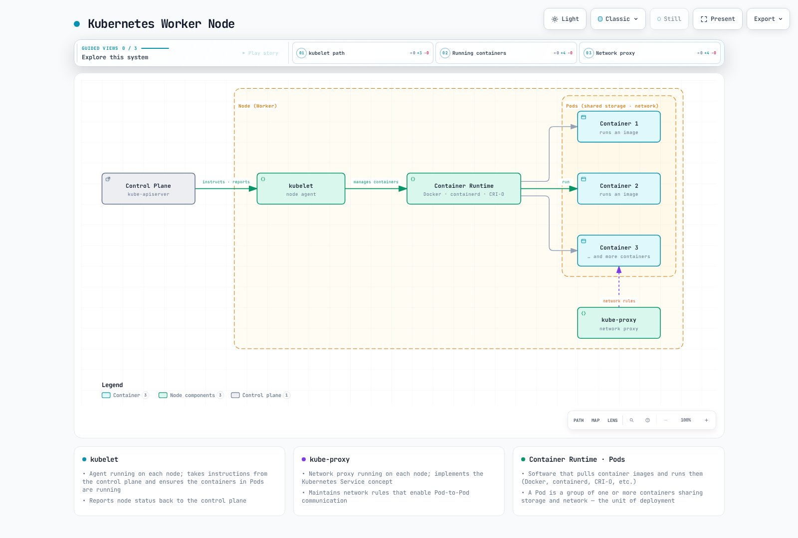
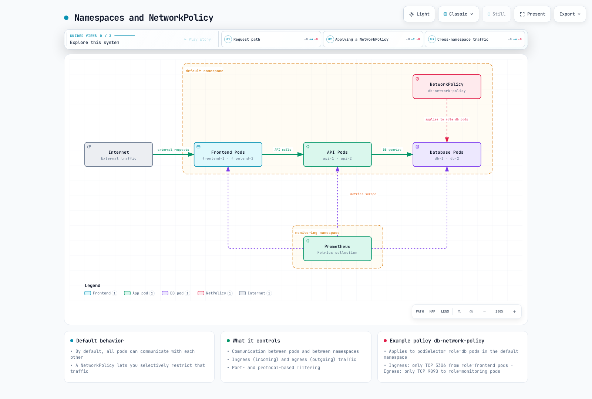

# Kubernetes 简介

> **支持的版本**：Kubernetes 1.31、1.32、1.33 **最后更新**：February 11, 2026

Kubernetes (K8s) 是一个开源的容器编排平台，可自动部署、扩缩和管理容器化应用程序。本文档介绍 Kubernetes 的基本概念、架构、主要组件和功能。

## 实验环境设置

要跟随本文档中的示例操作，您需要以下工具和环境：

### 必需工具

* **kubectl**：用于与 Kubernetes 集群交互的命令行工具
* **Container Runtime**：Docker、containerd、CRI-O 等
* **minikube** 或 **kind**：本地 Kubernetes 集群（用于开发和学习）

### 安装方法

**kubectl 安装**：

```bash
# macOS
brew install kubectl

# Linux
curl -LO "https://dl.k8s.io/release/$(curl -L -s https://dl.k8s.io/release/stable.txt)/bin/linux/amd64/kubectl"
chmod +x kubectl
sudo mv kubectl /usr/local/bin/

# Windows (PowerShell)
curl -LO "https://dl.k8s.io/release/v1.28.0/bin/windows/amd64/kubectl.exe"
```

**minikube 安装**：

```bash
# macOS
brew install minikube

# Linux
curl -LO https://storage.googleapis.com/minikube/releases/latest/minikube-linux-amd64
chmod +x minikube-linux-amd64
sudo mv minikube-linux-amd64 /usr/local/bin/minikube

# Windows (PowerShell)
New-Item -Path 'c:\' -Name 'minikube' -ItemType Directory
Invoke-WebRequest -OutFile 'c:\minikube\minikube.exe' -Uri 'https://github.com/kubernetes/minikube/releases/latest/download/minikube-windows-amd64.exe'
```

### 启动本地集群

```bash
minikube start
```

## 目录

* [什么是 Kubernetes？](04-kubernetes-introduction.md#what-is-kubernetes)
* [Kubernetes 的历史](04-kubernetes-introduction.md#history-of-kubernetes)
* [Kubernetes 架构](04-kubernetes-introduction.md#kubernetes-architecture)
* [Kubernetes 主要组件](04-kubernetes-introduction.md#kubernetes-main-components)
* [Kubernetes 基本对象](04-kubernetes-introduction.md#kubernetes-basic-objects)
* [Kubernetes 工作负载资源](04-kubernetes-introduction.md#kubernetes-workload-resources)
* [Kubernetes 服务和网络](04-kubernetes-introduction.md#kubernetes-services-and-networking)
* [Kubernetes 存储](04-kubernetes-introduction.md#kubernetes-storage)
* [Kubernetes 配置和安全](04-kubernetes-introduction.md#kubernetes-configuration-and-security)
* [Kubernetes 与 Amazon EKS](04-kubernetes-introduction.md#kubernetes-vs-amazon-eks)
* [开始使用 Kubernetes](04-kubernetes-introduction.md#getting-started-with-kubernetes)

## 什么是 Kubernetes？

Kubernetes 在希腊语中意为“舵手”或“飞行员”，是一个可自动部署、扩缩和运行容器化应用程序的开源系统。它的灵感来自 Google 内部的 Borg 系统，并于 2014 年开源发布。

### Kubernetes 的主要功能

1. **服务发现和负载均衡**：将容器暴露到外部并分配流量
2. **存储编排**：自动挂载本地或云端存储系统
3. **自动滚动发布和回滚**：逐步变更应用程序状态，并在发生问题时恢复到先前状态
4. **自动装箱**：根据资源需求将容器放置到节点上
5. **自愈**：重启失败的容器并替换无响应的容器
6. **Secret 和配置管理**：存储敏感信息并更新配置
7. **水平扩缩**：通过简单的命令或 UI 扩缩应用程序
8. **批处理执行**：管理批处理和 CI 工作负载

### Kubernetes 解决的问题

* **容器编排**：高效管理数百或数千个容器
* **高可用性**：确保应用程序不间断运行
* **可扩展性**：根据流量增长自动扩缩
* **灾难恢复**：故障时自动恢复
* **资源效率**：高效利用硬件资源
* **声明式配置**：以代码方式管理基础设施
* **多云和混合云**：跨多种环境进行一致的部署和管理

## Kubernetes 的历史

### 背景

* **2003-2013**：Google 在内部使用名为 Borg 的容器编排系统
* **2014 年 6 月**：Google 将 Kubernetes 作为开源项目发布
* **2015 年 7 月**：Kubernetes 1.0 发布并捐赠给 Cloud Native Computing Foundation (CNCF)
* **2016-2017**：主要云服务提供商推出托管 Kubernetes 服务
* **2018 年及以后**：成为容器编排事实上的标准

### 名称的由来

Kubernetes (κυβερνήτης) 在希腊语中意为“舵手”或“飞行员”。这象征着它引导容器化应用程序的作用。由于“K”和“s”之间有 8 个字符，因此使用缩写 K8s。

### Logo 的含义

Kubernetes Logo 描绘了一个带有 7 根辐条的舵轮（船舵），象征 Kubernetes 在引导容器化应用程序方向方面的作用。

## Kubernetes 架构

Kubernetes 采用主节点-工作节点架构。主节点（Control Plane）管理集群，工作节点运行实际的应用程序工作负载。

### Control Plane（主节点）组件


[🔍 查看交互式图表](https://www.atomai.click/kubernetes-docs/archmaps/en-basics-04-kubernetes-introduction-0.html)

1. **kube-apiserver**：暴露 Kubernetes API 的 Control Plane 前端
2. **etcd**：用于存储所有集群数据的一致且高可用的键值存储
3. **kube-scheduler**：将 Pod 分配到节点的组件
4. **kube-controller-manager**：运行 Controller 进程的组件
   * Node Controller：节点故障时的通知和响应
   * Replication Controller：维持正确数量的 Pod 副本
   * Endpoints Controller：连接 Service 和 Pod
   * Service Account & Token Controller：为新的 Namespace 创建默认账户和 API 访问令牌
5. **cloud-controller-manager**：包含云特定控制逻辑的组件
   * Node Controller：通过云服务提供商检查节点是否已被删除
   * Route Controller：在云基础设施中设置路由
   * Service Controller：创建、更新、删除云服务提供商的负载均衡器
   * Volume Controller：创建、附加、挂载 Volume

### Node 组件



[🔍 查看交互式图表](https://www.atomai.click/kubernetes-docs/archmaps/en-basics-04-kubernetes-introduction-1.html)

1. **kubelet**：运行在每个节点上的 Agent，确保 Pod 中的容器处于运行状态
2. **kube-proxy**：运行在每个节点上的网络代理，实现 Kubernetes Service 概念
3. **Container Runtime**：负责运行容器的软件（Docker、containerd、CRI-O 等）

### 完整架构


[🔍 查看交互式图表](https://www.atomai.click/kubernetes-docs/archmaps/en-basics-04-kubernetes-introduction-2.html)

## Kubernetes 主要组件

### API Server (kube-apiserver)

API server 是暴露 Kubernetes API 的 Control Plane 前端。所有内部和外部请求都通过 API server 处理。

**主要功能**：

* 提供 REST API
* 身份验证和授权
* 请求验证
* 与 etcd 通信
* 可水平扩展

### etcd

etcd 是一个一致且高可用的键值存储，用于存储所有集群数据。

**主要特性**：

* 分布式系统
* 强一致性
* 高可用性
* 安全的数据存储
* 用于监控变更的 Watch 功能

### Scheduler (kube-scheduler)

Scheduler 是一个 Control Plane 组件，负责选择运行新创建 Pod 的节点。

**调度过程**：

1. **过滤**：识别能够运行 Pod 的节点
2. **评分**：为合适的节点分配分数
3. **绑定**：将 Pod 分配给最佳节点

**考虑因素**：

* 资源需求（CPU、内存）
* 硬件/软件/策略限制
* 亲和性/反亲和性规范
* 数据本地性
* 工作负载干扰

### Controller Manager (kube-controller-manager)

Controller Manager 是一个运行多个 Controller 进程的 Control Plane 组件。

**主要 Controller**：

* **Node Controller**：监控并响应节点状态
* **Replication Controller**：维持 Pod 副本数量
* **Endpoints Controller**：连接 Service 和 Pod
* **Service Account & Token Controller**：为 Namespace 创建默认账户和 API 令牌
* **Job Controller**：管理一次性任务
* **CronJob Controller**：管理计划任务
* **DaemonSet Controller**：确保特定 Pod 在所有节点上运行
* **StatefulSet Controller**：管理有状态应用程序
* **PV Controller**：管理 Persistent Volume

### Cloud Controller Manager (cloud-controller-manager)

Cloud Controller Manager 是一个包含云特定控制逻辑的 Control Plane 组件。

**主要 Controller**：

* **Node Controller**：通过云服务提供商 API 检查节点状态
* **Route Controller**：在云环境中设置路由
* **Service Controller**：创建、更新、删除云负载均衡器
* **Volume Controller**：创建、附加、挂载云存储 Volume

### kubelet

kubelet 是运行在每个节点上的 Agent，确保 Pod 中的容器处于运行状态。

**主要功能**：

* 根据 PodSpec 运行容器
* 报告容器状态
* 执行容器健康检查
* 管理容器生命周期
* 报告节点状态

### kube-proxy

kube-proxy 是运行在每个节点上的网络代理，实现 Kubernetes Service 概念。

**主要功能**：

* 维护 Service IP 和端口的网络规则
* 转发连接
* 实现负载均衡

**运行模式**：

* **userspace mode**：在用户空间运行代理（旧版）
* **iptables mode**：使用 Linux iptables 实现 NAT（默认）
* **IPVS mode**：使用 Linux 内核的 IP Virtual Server（高性能）

## Kubernetes 基本对象

Kubernetes 对象是表示集群状态的持久化实体。这些对象描述集群中运行的应用程序、可用资源、策略等。

### Pod

Pod 是 Kubernetes 中最小的可部署单元，表示一个或多个容器组成的组。Pod 中的容器共享存储和网络，并且始终一起调度到同一个节点上。

**主要特性**：

* 具有唯一的 IP 地址
* 共享网络命名空间（相同的 IP 和端口空间）
* 共享 IPC 命名空间
* 共享主机名
* 容器之间可通过 localhost 通信

**Pod 示例**：

```yaml
apiVersion: v1
kind: Pod
metadata:
  name: nginx-pod
  labels:
    app: nginx
spec:
  containers:
  - name: nginx
    image: nginx:1.21
    ports:
    - containerPort: 80
  - name: log-sidecar
    image: busybox
    command: ["/bin/sh", "-c", "tail -f /var/log/nginx/access.log"]
    volumeMounts:
    - name: logs
      mountPath: /var/log/nginx
  volumes:
  - name: logs
    emptyDir: {}
```

### Namespace

Namespace 提供了一种在单个集群内隔离资源组的方式。当多个团队或项目共享同一个集群时，这很有用。

**默认 Namespace**：

* **default**：默认 Namespace
* **kube-system**：用于 Kubernetes 系统创建对象的 Namespace
* **kube-public**：包含所有用户均可读取的对象的 Namespace
* **kube-node-lease**：用于节点心跳的 Namespace

**Namespace 示例**：

```yaml
apiVersion: v1
kind: Namespace
metadata:
  name: development
```

### Labels 和 Selectors

Labels 是附加到对象的键值对，用于标识和选择对象。Selectors 提供基于 Labels 筛选对象的方式。

**Labels 示例**：

```yaml
metadata:
  labels:
    app: nginx
    environment: production
    tier: frontend
```

**Selector 类型**：

* **基于等值**：`=`、`!=`
* **基于集合**：`in`、`notin`、`exists`

**Selector 示例**：

```yaml
selector:
  matchLabels:
    app: nginx
  matchExpressions:
    - {key: tier, operator: In, values: [frontend, middleware]}
    - {key: environment, operator: NotIn, values: [dev]}
```

### Annotations

Annotations 是用于存储对象非标识性元数据的键值对。Annotations 可用于存储由工具或库使用的信息。

**Annotations 示例**：

```yaml
metadata:
  annotations:
    kubernetes.io/created-by: "admin"
    example.com/last-modified: "2023-07-01T12:00:00Z"
    prometheus.io/scrape: "true"
    prometheus.io/port: "9090"
```

### Node

Node 是 Kubernetes 集群中运行 Pod 的工作机器。Node 可以是物理机或虚拟机。

**Node 状态**：

* **Addresses**：主机名、Internal IP、External IP
* **Conditions**：Ready、DiskPressure、MemoryPressure、PIDPressure、NetworkUnavailable
* **Capacity**：CPU、内存、最大 Pod 数量
* **Info**：内核版本、Container Runtime 版本、kubelet 版本

**Node 示例**：

```yaml
apiVersion: v1
kind: Node
metadata:
  name: worker-1
  labels:
    kubernetes.io/hostname: worker-1
    node-role.kubernetes.io/worker: ""
    topology.kubernetes.io/zone: us-east-1a
spec:
  # ...
status:
  capacity:
    cpu: "4"
    memory: 8Gi
    pods: "110"
  conditions:
    - type: Ready
      status: "True"
  # ...
```

## Kubernetes 工作负载资源

工作负载资源是用于管理和运行 Pod 的对象。这些资源管理 Pod 的创建、扩缩、更新和终止。

### ReplicaSet

ReplicaSet 确保指定数量的 Pod 副本始终处于运行状态。如果 Pod 发生故障或被删除，ReplicaSet 会自动创建替代 Pod。

**主要功能**：

* 维持指定数量的 Pod 副本
* 定义 Pod 模板
* 通过 Selectors 标识 Pod

**ReplicaSet 示例**：

```yaml
apiVersion: apps/v1
kind: ReplicaSet
metadata:
  name: nginx-replicaset
  labels:
    app: nginx
spec:
  replicas: 3
  selector:
    matchLabels:
      app: nginx
  template:
    metadata:
      labels:
        app: nginx
    spec:
      containers:
      - name: nginx
        image: nginx:1.21
        ports:
        - containerPort: 80
```

### Deployment

Deployment 在 ReplicaSet 之上进一步抽象，为应用程序提供声明式更新。Deployment 提供滚动更新、回滚和扩缩等功能。

**主要功能**：

* 声明式应用程序更新
* 滚动更新和回滚
* Deployment 历史记录管理
* 扩缩

**Deployment 示例**：

```yaml
apiVersion: apps/v1
kind: Deployment
metadata:
  name: nginx-deployment
  labels:
    app: nginx
spec:
  replicas: 3
  selector:
    matchLabels:
      app: nginx
  strategy:
    type: RollingUpdate
    rollingUpdate:
      maxSurge: 1
      maxUnavailable: 0
  template:
    metadata:
      labels:
        app: nginx
    spec:
      containers:
      - name: nginx
        image: nginx:1.21
        ports:
        - containerPort: 80
        resources:
          requests:
            cpu: 100m
            memory: 128Mi
          limits:
            cpu: 200m
            memory: 256Mi
        livenessProbe:
          httpGet:
            path: /
            port: 80
          initialDelaySeconds: 30
          periodSeconds: 10
```

### StatefulSet

StatefulSet 是适用于需要维护状态的应用程序的工作负载资源。它为每个 Pod 分配唯一标识符，并提供稳定的网络标识符和持久化存储。

**主要功能**：

* 稳定且唯一的网络标识符
* 稳定且持久的存储
* 按顺序部署和扩缩
* 按顺序更新

**StatefulSet 示例**：

```yaml
apiVersion: apps/v1
kind: StatefulSet
metadata:
  name: mysql
spec:
  selector:
    matchLabels:
      app: mysql
  serviceName: mysql
  replicas: 3
  template:
    metadata:
      labels:
        app: mysql
    spec:
      containers:
      - name: mysql
        image: mysql:8.0
        env:
        - name: MYSQL_ROOT_PASSWORD
          valueFrom:
            secretKeyRef:
              name: mysql-secret
              key: password
        ports:
        - containerPort: 3306
          name: mysql
        volumeMounts:
        - name: data
          mountPath: /var/lib/mysql
  volumeClaimTemplates:
  - metadata:
      name: data
    spec:
      accessModes: ["ReadWriteOnce"]
      storageClassName: "standard"
      resources:
        requests:
          storage: 10Gi
```

### DaemonSet

DaemonSet 确保每个节点（或特定节点）上都运行一个 Pod 副本。向集群添加节点时，会自动添加 Pod；移除节点时，也会移除 Pod。

**主要使用场景**：

* 日志收集器（Fluentd、Logstash）
* 监控 Agent（Prometheus Node Exporter）
* 网络插件（Calico、Cilium）
* 存储守护进程（Ceph）

**DaemonSet 示例**：

```yaml
apiVersion: apps/v1
kind: DaemonSet
metadata:
  name: fluentd
  namespace: kube-system
spec:
  selector:
    matchLabels:
      name: fluentd
  template:
    metadata:
      labels:
        name: fluentd
    spec:
      tolerations:
      - key: node-role.kubernetes.io/master
        effect: NoSchedule
      containers:
      - name: fluentd
        image: fluentd:v1.14
        resources:
          limits:
            memory: 200Mi
          requests:
            cpu: 100m
            memory: 100Mi
        volumeMounts:
        - name: varlog
          mountPath: /var/log
      volumes:
      - name: varlog
        hostPath:
          path: /var/log
```

### Job

Job 创建一个或多个 Pod，并持续执行，直到指定数量的 Pod 成功终止。适用于批处理任务。

**主要功能**：

* 一次性任务执行
* 并行任务执行
* 保证任务完成
* 失败时重试

**Job 示例**：

```yaml
apiVersion: batch/v1
kind: Job
metadata:
  name: pi-calculator
spec:
  completions: 5
  parallelism: 2
  backoffLimit: 3
  template:
    spec:
      containers:
      - name: pi
        image: perl
        command: ["perl", "-Mbignum=bpi", "-wle", "print bpi(2000)"]
      restartPolicy: Never
```

### CronJob

CronJob 根据指定的计划定期运行 Job。其工作方式与 Linux cron 作业类似。

**主要功能**：

* 根据计划执行任务
* 支持 Cron 表达式
* 并发策略设置
* 历史记录限制

**CronJob 示例**：

```yaml
apiVersion: batch/v1
kind: CronJob
metadata:
  name: database-backup
spec:
  schedule: "0 2 * * *"  # Run at 02:00 daily
  concurrencyPolicy: Forbid
  successfulJobsHistoryLimit: 3
  failedJobsHistoryLimit: 1
  jobTemplate:
    spec:
      template:
        spec:
          containers:
          - name: backup
            image: database-backup:v1
            env:
            - name: DB_HOST
              value: "db.example.com"
          restartPolicy: OnFailure
```

## Kubernetes 服务和网络

Kubernetes 网络模型基于这样的前提：所有 Pod 都具有唯一的 IP 地址，并且无需特殊配置即可相互通信。Service 为一组 Pod 提供稳定的端点。

### Service

Service 为一组 Pod 提供单一端点和负载均衡。由于 Pod 会动态创建和删除，Service 可在这些变化中提供稳定的网络地址。

**Service 类型**：

* **ClusterIP**：只能在集群内访问的 Service（默认）
* **NodePort**：通过每个节点的 IP 和特定端口从外部访问
* **LoadBalancer**：使用云服务提供商的负载均衡器从外部访问
* **ExternalName**：为外部 Service 创建 CNAME 记录


[🔍 查看交互式图表](https://www.atomai.click/kubernetes-docs/archmaps/en-basics-04-kubernetes-introduction-3.html)

**Service 示例**：

```yaml
apiVersion: v1
kind: Service
metadata:
  name: nginx-service
spec:
  selector:
    app: nginx
  ports:
  - port: 80
    targetPort: 80
  type: ClusterIP
```

**NodePort Service 示例**：

```yaml
apiVersion: v1
kind: Service
metadata:
  name: nginx-nodeport
spec:
  selector:
    app: nginx
  ports:
  - port: 80
    targetPort: 80
    nodePort: 30080
  type: NodePort
```

**LoadBalancer Service 示例**：

```yaml
apiVersion: v1
kind: Service
metadata:
  name: nginx-lb
  annotations:
    service.beta.kubernetes.io/aws-load-balancer-type: "nlb"
spec:
  selector:
    app: nginx
  ports:
  - port: 80
    targetPort: 80
  type: LoadBalancer
```

### Ingress

Ingress 是一个 API 对象，用于管理从集群外部到内部 Service 的 HTTP 和 HTTPS 路由。Ingress 提供负载均衡、SSL 终止、基于名称的虚拟主机等功能。

**Ingress Controller**：

* **NGINX Ingress Controller**：基于 NGINX 的 Ingress Controller
* **AWS ALB Ingress Controller**：基于 AWS Application Load Balancer 的 Ingress Controller
* **Traefik**：云原生边缘路由器
* **Istio Ingress**：基于服务网格的 Ingress

**Ingress 示例**：

```yaml
apiVersion: networking.k8s.io/v1
kind: Ingress
metadata:
  name: example-ingress
  annotations:
    nginx.ingress.kubernetes.io/rewrite-target: /
spec:
  ingressClassName: nginx
  rules:
  - host: example.com
    http:
      paths:
      - path: /app1
        pathType: Prefix
        backend:
          service:
            name: app1-service
            port:
              number: 80
      - path: /app2
        pathType: Prefix
        backend:
          service:
            name: app2-service
            port:
              number: 80
  tls:
  - hosts:
    - example.com
    secretName: example-tls
```

### NetworkPolicy

NetworkPolicy 提供了一种控制 Pod 之间通信的方式。默认情况下，所有 Pod 都可以相互通信，但您可以使用网络策略限制通信。&#x20;



[🔍 查看交互式图表](https://www.atomai.click/kubernetes-docs/archmaps/en-basics-04-kubernetes-introduction-4.html)

**主要功能**：

* 控制 Pod 之间的通信
* 控制 Namespace 之间的通信
* 控制入口（传入）和出口（传出）流量
* 基于端口和协议的筛选

**NetworkPolicy 示例**：

```yaml
apiVersion: networking.k8s.io/v1
kind: NetworkPolicy
metadata:
  name: db-network-policy
  namespace: default
spec:
  podSelector:
    matchLabels:
      role: db
  policyTypes:
  - Ingress
  - Egress
  ingress:
  - from:
    - podSelector:
        matchLabels:
          role: frontend
    ports:
    - protocol: TCP
      port: 3306
  egress:
  - to:
    - podSelector:
        matchLabels:
          role: monitoring
    ports:
    - protocol: TCP
      port: 9090
```

### DNS

Kubernetes 在集群内提供 DNS 服务以支持服务发现。默认使用 CoreDNS。

**DNS 名称格式**：

* **Service**：`<service-name>.<namespace>.svc.cluster.local`
* **Pod**：`<pod-IP-address-dots-replaced>.pod.cluster.local`

**DNS 配置示例**：

```yaml
apiVersion: v1
kind: ConfigMap
metadata:
  name: coredns
  namespace: kube-system
data:
  Corefile: |
    .:53 {
        errors
        health
        kubernetes cluster.local in-addr.arpa ip6.arpa {
          pods insecure
          upstream
          fallthrough in-addr.arpa ip6.arpa
        }
        prometheus :9153
        forward . /etc/resolv.conf
        cache 30
        loop
        reload
        loadbalance
    }
```

### Service Mesh

服务网格是一种用于管理微服务之间通信的基础设施层。服务网格提供流量管理、安全性和可观测性。

**主要服务网格**：

* **Istio**：使用最广泛的服务网格
* **Linkerd**：轻量级服务网格
* **AWS App Mesh**：AWS 托管的服务网格

**Istio VirtualService 示例**：

```yaml
apiVersion: networking.istio.io/v1alpha3
kind: VirtualService
metadata:
  name: reviews-route
spec:
  hosts:
  - reviews
  http:
  - match:
    - headers:
        end-user:
          exact: jason
    route:
    - destination:
        host: reviews
        subset: v2
  - route:
    - destination:
        host: reviews
        subset: v1
```

## Kubernetes 存储

Kubernetes 为容器化应用程序提供多种存储选项。即使 Pod 被重启或重新调度，它也提供持久化数据的方法。


[🔍 查看交互式图表](https://www.atomai.click/kubernetes-docs/archmaps/en-basics-04-kubernetes-introduction-5.html)

### Volume

Volume 是可挂载到 Pod 中容器的目录，可在 Pod 生命周期内持久保存数据。Volume 还用于在 Pod 中的容器之间共享数据。

**主要 Volume 类型**：

* **emptyDir**：以空目录开始，Pod 删除时一并删除
* **hostPath**：将宿主节点的文件系统挂载到 Pod
* **configMap**：将 ConfigMap 作为 Volume 挂载
* **secret**：将 Secret 作为 Volume 挂载
* **persistentVolumeClaim**：将 Persistent Volume 挂载到 Pod

**emptyDir Volume 示例**：

```yaml
apiVersion: v1
kind: Pod
metadata:
  name: test-pd
spec:
  containers:
  - name: test-container
    image: nginx
    volumeMounts:
    - mountPath: /cache
      name: cache-volume
  volumes:
  - name: cache-volume
    emptyDir: {}
```

### PersistentVolume (PV)

PersistentVolume 是表示集群中存储资源的 API 对象。它独立于 Pod 存在，并由集群管理员预置。

**访问模式**：

* **ReadWriteOnce (RWO)**：可由单个节点以读写方式挂载
* **ReadOnlyMany (ROX)**：可由多个节点以只读方式挂载
* **ReadWriteMany (RWX)**：可由多个节点以读写方式挂载

**PersistentVolume 示例**：

```yaml
apiVersion: v1
kind: PersistentVolume
metadata:
  name: pv-example
spec:
  capacity:
    storage: 10Gi
  accessModes:
    - ReadWriteOnce
  persistentVolumeReclaimPolicy: Retain
  storageClassName: standard
  awsElasticBlockStore:
    volumeID: vol-0123456789abcdef0
    fsType: ext4
```

### PersistentVolumeClaim (PVC)

PersistentVolumeClaim 是表示用户存储请求的 API 对象。Pod 通过 PVC 访问 PV。

**PersistentVolumeClaim 示例**：

```yaml
apiVersion: v1
kind: PersistentVolumeClaim
metadata:
  name: pvc-example
spec:
  accessModes:
    - ReadWriteOnce
  resources:
    requests:
      storage: 5Gi
  storageClassName: standard
```

**使用 PVC 的 Pod 示例**：

```yaml
apiVersion: v1
kind: Pod
metadata:
  name: mypod
spec:
  containers:
    - name: myfrontend
      image: nginx
      volumeMounts:
      - mountPath: "/var/www/html"
        name: mypd
  volumes:
    - name: mypd
      persistentVolumeClaim:
        claimName: pvc-example
```

### StorageClass

StorageClass 描述由管理员提供的存储“类别”。可提供不同的服务质量级别、备份策略或由集群管理员确定的任意策略。

**StorageClass 示例**：

```yaml
apiVersion: storage.k8s.io/v1
kind: StorageClass
metadata:
  name: standard
provisioner: kubernetes.io/aws-ebs
parameters:
  type: gp3
  fsType: ext4
reclaimPolicy: Delete
allowVolumeExpansion: true
```

### 动态预置

动态预置是一项功能：当使用 StorageClass 请求 PVC 时，会自动创建 PV。

**动态预置示例**：

```yaml
apiVersion: v1
kind: PersistentVolumeClaim
metadata:
  name: dynamic-pvc
spec:
  accessModes:
    - ReadWriteOnce
  resources:
    requests:
      storage: 10Gi
  storageClassName: standard  # Storage class for dynamic provisioning
```

### CSI (Container Storage Interface)

CSI 在 Kubernetes 与存储系统之间提供标准接口。这使得存储提供商能够在不修改 Kubernetes 代码的情况下开发自己的存储驱动程序。

**主要 CSI 驱动程序**：

* **AWS EBS CSI Driver**：Amazon EBS Volume 管理
* **AWS EFS CSI Driver**：Amazon EFS 文件系统管理
* **AWS FSx for Lustre CSI Driver**：FSx for Lustre 文件系统管理
* **GCE PD CSI Driver**：Google Compute Engine 持久磁盘管理
* **Azure Disk CSI Driver**：Azure 磁盘管理

**CSI Driver 部署示例**：

```yaml
apiVersion: storage.k8s.io/v1
kind: StorageClass
metadata:
  name: ebs-sc
provisioner: ebs.csi.aws.com
parameters:
  type: gp3
  fsType: ext4
  encrypted: "true"
volumeBindingMode: WaitForFirstConsumer
```

## Kubernetes 配置和安全

Kubernetes 提供多种对象和机制，用于管理应用程序配置和安全性。

### ConfigMap

ConfigMap 是将配置数据存储为键值对的 API 对象。Pod 可将 ConfigMap 数据用作环境变量、命令行参数或配置文件。

**ConfigMap 示例**：

```yaml
apiVersion: v1
kind: ConfigMap
metadata:
  name: app-config
data:
  app.properties: |
    app.name=MyApp
    app.version=1.0.0
    app.environment=production
  log-level: INFO
  max-connections: "100"
```

**使用 ConfigMap 的 Pod 示例**：

```yaml
apiVersion: v1
kind: Pod
metadata:
  name: config-pod
spec:
  containers:
  - name: app
    image: myapp:1.0
    env:
    - name: LOG_LEVEL
      valueFrom:
        configMapKeyRef:
          name: app-config
          key: log-level
    volumeMounts:
    - name: config-volume
      mountPath: /etc/config
  volumes:
  - name: config-volume
    configMap:
      name: app-config
```

### Secret

Secret 是存储密码、令牌和密钥等敏感信息的 API 对象。它与 ConfigMap 类似，但专为敏感数据设计。

**Secret 类型**：

* **Opaque**：任意用户定义数据（默认）
* **kubernetes.io/service-account-token**：Service Account 令牌
* **kubernetes.io/dockercfg**：序列化的 \~/.dockercfg 文件
* **kubernetes.io/dockerconfigjson**：序列化的 \~/.docker/config.json 文件
* **kubernetes.io/basic-auth**：基本身份验证凭据
* **kubernetes.io/ssh-auth**：SSH 身份验证凭据
* **kubernetes.io/tls**：TLS 客户端或服务器的数据

**Secret 示例**：

```yaml
apiVersion: v1
kind: Secret
metadata:
  name: db-credentials
type: Opaque
data:
  username: YWRtaW4=  # base64 encoded "admin"
  password: cGFzc3dvcmQxMjM=  # base64 encoded "password123"
```

**使用 Secret 的 Pod 示例**：

```yaml
apiVersion: v1
kind: Pod
metadata:
  name: secret-pod
spec:
  containers:
  - name: db-client
    image: db-client:1.0
    env:
    - name: DB_USERNAME
      valueFrom:
        secretKeyRef:
          name: db-credentials
          key: username
    - name: DB_PASSWORD
      valueFrom:
        secretKeyRef:
          name: db-credentials
          key: password
```

### RBAC (基于角色的访问控制)

RBAC 是控制对 Kubernetes API 访问的机制。它使用 Role 和 RoleBinding 向用户或 Service Account 授予特定权限。

**主要 RBAC 对象**：

* **Role**：定义 Namespace 内的一组权限
* **ClusterRole**：定义集群范围内的一组权限
* **RoleBinding**：将 Role 绑定到用户、组或 Service Account
* **ClusterRoleBinding**：将 ClusterRole 绑定到用户、组或 Service Account

**Role 示例**：

```yaml
apiVersion: rbac.authorization.k8s.io/v1
kind: Role
metadata:
  namespace: default
  name: pod-reader
rules:
- apiGroups: [""]
  resources: ["pods"]
  verbs: ["get", "watch", "list"]
```

**RoleBinding 示例**：

```yaml
apiVersion: rbac.authorization.k8s.io/v1
kind: RoleBinding
metadata:
  name: read-pods
  namespace: default
subjects:
- kind: User
  name: jane
  apiGroup: rbac.authorization.k8s.io
roleRef:
  kind: Role
  name: pod-reader
  apiGroup: rbac.authorization.k8s.io
```

### ServiceAccount

ServiceAccount 为运行在 Pod 内的进程提供身份。Pod 使用 Service Account 与 Kubernetes API 通信。

**ServiceAccount 示例**：

```yaml
apiVersion: v1
kind: ServiceAccount
metadata:
  name: app-sa
  namespace: default
```

**使用 ServiceAccount 的 Pod 示例**：

```yaml
apiVersion: v1
kind: Pod
metadata:
  name: sa-pod
spec:
  serviceAccountName: app-sa
  containers:
  - name: app
    image: myapp:1.0
```

### NetworkPolicy

NetworkPolicy 提供了一种控制 Pod 之间通信的方式。默认情况下，所有 Pod 都可以相互通信，但您可以使用网络策略限制通信。

**NetworkPolicy 示例**：

```yaml
apiVersion: networking.k8s.io/v1
kind: NetworkPolicy
metadata:
  name: db-network-policy
  namespace: default
spec:
  podSelector:
    matchLabels:
      role: db
  policyTypes:
  - Ingress
  - Egress
  ingress:
  - from:
    - podSelector:
        matchLabels:
          role: frontend
    ports:
    - protocol: TCP
      port: 3306
  egress:
  - to:
    - podSelector:
        matchLabels:
          role: monitoring
    ports:
    - protocol: TCP
      port: 9090
```

### PodSecurityPolicy

PodSecurityPolicy 定义 Pod 创建和更新的安全相关条件。自 Kubernetes 1.21 起，它已被弃用，并由 Pod Security Standards 取代。

**Pod SecurityContext 示例**：

```yaml
apiVersion: v1
kind: Pod
metadata:
  name: security-context-pod
spec:
  securityContext:
    runAsUser: 1000
    runAsGroup: 3000
    fsGroup: 2000
  containers:
  - name: app
    image: myapp:1.0
    securityContext:
      allowPrivilegeEscalation: false
      capabilities:
        drop:
        - ALL
```

### Pod Security Standards

Pod Security Standards 提供三个策略级别，用于定义 Pod 的安全要求：

1. **Privileged**：无任何限制，允许所有功能
2. **Baseline**：防止已知的权限提升
3. **Restricted**：应用最佳实践的严格限制

**Pod Security Standards 应用示例**：

```yaml
apiVersion: v1
kind: Namespace
metadata:
  name: my-namespace
  labels:
    pod-security.kubernetes.io/enforce: restricted
    pod-security.kubernetes.io/audit: restricted
    pod-security.kubernetes.io/warn: restricted
```

## Kubernetes 与 Amazon EKS

Amazon EKS (Elastic Kubernetes Service) 是 AWS 提供的托管 Kubernetes 服务。EKS 提供 Kubernetes 的所有基本功能，同时增加 AWS 服务集成和管理便利性。

### 主要差异

| 特性           | 自管 Kubernetes                         | Amazon EKS                                                        |
| ------------------------ | ----------------------------------------------- | ----------------------------------------------------------------- |
| Control Plane 管理 | 用户直接管理                           | 由 AWS 托管                                                    |
| 高可用性        | 用户必须配置                             | 默认提供（跨多个可用区部署） |
| 升级                 | 用户直接执行                          | 由 AWS 管理（用户可以发起）                                |
| 安全补丁         | 用户直接应用                           | 由 AWS 自动应用                                      |
| 身份验证           | 需要配置多种选项              | 与 AWS IAM 集成                                           |
| 网络               | 需要选择和配置 CNI 插件 | 默认提供 Amazon VPC CNI                                |
| 负载均衡           | 需要手动配置                   | 集成 AWS Load Balancer Controller                          |
| 存储                  | 需要配置存储驱动程序           | 集成 EBS、EFS、FSx CSI Driver                              |
| 监控               | 需要手动设置                           | 集成 CloudWatch Container Insights                         |
| 成本                     | 仅基础设施成本                       | Control Plane 成本 + 基础设施成本                         |

### EKS 的附加功能

1. **AWS IAM 集成**：Kubernetes RBAC 和 AWS IAM 集成
2. **AWS Load Balancer Controller**：将 ALB 和 NLB 与 Kubernetes Service 和 Ingress 集成
3. **EKS Managed Node Groups**：Node 生命周期管理自动化
4. **Fargate Profiles**：无服务器 Kubernetes Pod 执行
5. **VPC CNI Plugin**：与 AWS VPC 网络集成
6. **CloudWatch Container Insights**：容器监控和日志记录
7. **AWS App Mesh**：服务网格集成
8. **AWS Distro for OpenTelemetry**：分布式追踪和监控
9. **EKS Console and CLI**：管理界面
10. **EKS Blueprints**：基于最佳实践的集群配置

### EKS 特定组件

1. **EKS Control Plane**：跨多个可用区的高可用性
2. **EKS Node AMI**：针对 Kubernetes 优化的 Amazon Linux 或 Ubuntu AMI
3. **EKS Managed Node Groups**：支持自动扩缩和更新
4. **EKS Fargate**：无服务器容器执行环境
5. **EKS Connector**：将外部 Kubernetes 集群连接到 AWS Console
6. **EKS Anywhere**：在本地环境中运行兼容 EKS 的集群
7. **EKS Distro**：AWS 管理的 Kubernetes 发行版

### AWS 服务集成

EKS 与以下 AWS 服务集成：

1. **Amazon VPC**：网络基础设施
2. **AWS IAM**：身份验证和授权
3. **Amazon ECR**：容器镜像仓库
4. **AWS Load Balancer**：应用程序流量分配
5. **Amazon EBS/EFS/FSx**：持久化存储
6. **AWS CloudWatch**：监控和日志记录
7. **AWS CloudTrail**：审计和合规性
8. **AWS KMS**：加密密钥管理
9. **AWS WAF**：Web 应用程序防火墙
10. **AWS Shield**：DDoS 防护
11. **AWS X-Ray**：分布式追踪
12. **AWS App Mesh**：服务网格
13. **AWS SageMaker**：机器学习工作负载
14. **AWS Bedrock**：生成式 AI 工作负载

## 开始使用 Kubernetes

有多种方式可以开始使用 Kubernetes。下面简要介绍如何在本地开发环境和 AWS EKS 上开始使用 Kubernetes。

### 本地开发环境

#### Minikube

Minikube 是一种可在本地计算机上运行单节点 Kubernetes 集群的工具。

**安装和启动**：

```bash
# Install
brew install minikube

# Start
minikube start

# Check status
minikube status

# Open dashboard
minikube dashboard
```

#### Kind (Kubernetes in Docker)

Kind 是一种使用 Docker 容器作为节点在本地运行 Kubernetes 集群的工具。

**安装和启动**：

```bash
# Install
brew install kind

# Create cluster
kind create cluster --name my-cluster

# Check cluster
kind get clusters
kubectl cluster-info --context kind-my-cluster
```

#### Docker Desktop

Docker Desktop 提供了一项可在 Mac 和 Windows 上轻松运行 Kubernetes 的功能。

**设置**：

1. 安装 Docker Desktop
2. Settings > Kubernetes > 勾选 “Enable Kubernetes”
3. 单击 “Apply & Restart”

### AWS EKS

#### 使用 eksctl 创建 EKS 集群

eksctl 是一个用于创建和管理 EKS 集群的简单 CLI 工具。

**安装和创建集群**：

```bash
# Install eksctl
brew tap weaveworks/tap
brew install weaveworks/tap/eksctl

# Configure AWS CLI
aws configure

# Create EKS cluster
eksctl create cluster \
  --name my-cluster \
  --region ap-northeast-2 \
  --nodegroup-name standard-workers \
  --node-type t3.medium \
  --nodes 3 \
  --nodes-min 1 \
  --nodes-max 4 \
  --managed

# Check cluster
kubectl get nodes
```

#### 使用 AWS Management Console 创建 EKS 集群

您也可以通过 AWS Management Console 创建 EKS 集群。

**步骤**：

1. 登录 AWS Management Console
2. 导航到 EKS 服务
3. 单击 “Create cluster”
4. 配置集群名称、IAM Role、VPC 和子网
5. 配置安全组
6. 配置日志记录选项
7. 创建集群
8. 添加 Node Group

### kubectl 安装和配置

kubectl 是用于与 Kubernetes 集群交互的命令行工具。

**安装**：

```bash
# macOS
brew install kubectl

# Linux
curl -LO "https://dl.k8s.io/release/$(curl -L -s https://dl.k8s.io/release/stable.txt)/bin/linux/amd64/kubectl"
chmod +x kubectl
sudo mv kubectl /usr/local/bin/

# Windows (PowerShell)
curl -LO "https://dl.k8s.io/release/v1.28.0/bin/windows/amd64/kubectl.exe"
```

**基本命令**：

```bash
# Check cluster info
kubectl cluster-info

# List nodes
kubectl get nodes

# Check pods in all namespaces
kubectl get pods --all-namespaces

# Create deployment
kubectl create deployment nginx --image=nginx

# Expose service
kubectl expose deployment nginx --port=80 --type=LoadBalancer

# Check logs
kubectl logs <pod-name>

# Execute command in pod container
kubectl exec -it <pod-name> -- /bin/bash
```

### 安装 Kubernetes Dashboard

Kubernetes Dashboard 提供用于管理集群的 Web UI。

**安装和访问**：

```bash
# Install dashboard
kubectl apply -f https://raw.githubusercontent.com/kubernetes/dashboard/v2.7.0/aio/deploy/recommended.yaml

# Create admin user
cat <<EOF | kubectl apply -f -
apiVersion: v1
kind: ServiceAccount
metadata:
  name: admin-user
  namespace: kubernetes-dashboard
---
apiVersion: rbac.authorization.k8s.io/v1
kind: ClusterRoleBinding
metadata:
  name: admin-user
roleRef:
  apiGroup: rbac.authorization.k8s.io
  kind: ClusterRole
  name: cluster-admin
subjects:
- kind: ServiceAccount
  name: admin-user
  namespace: kubernetes-dashboard
EOF

# Get token
kubectl -n kubernetes-dashboard create token admin-user

# Access dashboard
kubectl proxy
```

可通过 `http://localhost:8001/api/v1/namespaces/kubernetes-dashboard/services/https:kubernetes-dashboard:/proxy/` 访问 Dashboard。

## 结论

Kubernetes 是一个功能强大的平台，可自动部署、扩缩和管理容器化应用程序。本文档涵盖的主要内容总结如下：

### 核心架构

* **Control Plane**：集群的大脑（API Server、etcd、Scheduler、Controller Manager）
* **Worker Node**：运行实际应用程序的节点（kubelet、kube-proxy、Container Runtime）
* **声明式配置**：定义期望状态，Kubernetes 将当前状态与期望状态保持一致

### 主要对象和资源

* **基本对象**：Pod、Service、Volume、Namespace
* **工作负载资源**：Deployment、StatefulSet、DaemonSet、Job、CronJob
* **配置和安全**：ConfigMap、Secret、RBAC、ServiceAccount
* **网络**：Service、Ingress、NetworkPolicy
* **存储**：PersistentVolume、PersistentVolumeClaim、StorageClass

### 推荐学习路径

**第 1 步：构建本地环境**

* 使用 minikube 或 kind 创建本地集群
* 学习 kubectl 命令
* 使用基本对象（Pod、Deployment、Service）进行练习

**第 2 步：掌握核心概念**

* 理解并练习工作负载资源
* 使用 ConfigMap 和 Secret 进行配置管理
* 使用 Service 和 Ingress 配置网络
* 使用 PV 和 PVC 管理存储

**第 3 步：学习高级功能**

* RBAC 和安全策略
* 自动扩缩（HPA、VPA、Cluster Autoscaler）
* 监控和日志记录（Prometheus、Grafana）
* 服务网格（Istio、Linkerd）

**第 4 步：生产环境运维**

* 使用 Amazon EKS 或其他托管 Kubernetes
* CI/CD Pipeline 集成
* 灾难恢复和备份策略
* 成本优化和资源管理

### 后续步骤

* **EKS 深入学习**：EKS 特定功能（Fargate、VPC CNI、ALB Controller）
* **高级网络**：CNI 插件（Calico、Cilium）
* **可观测性**：指标、日志、追踪
* **GitOps**：ArgoCD、Flux
* **安全加固**：Pod Security Standards、Network Policies、OPA/Gatekeeper

Kubernetes 在持续演进，并已成为云原生应用程序开发和运维的核心要素。希望本文档能够帮助您开启 Kubernetes 之旅。

### 其他学习资源

* **官方文档**：[Kubernetes 官方文档](https://kubernetes.io/docs/) 提供最准确且最新的信息
* **交互式教程**：可在 [Kubernetes 教程](https://kubernetes.io/docs/tutorials/)进行动手练习
* **社区**：[Kubernetes Slack](https://slack.k8s.io/)、[Reddit r/kubernetes](https://reddit.com/r/kubernetes)
* **认证**：CKA（Certified Kubernetes Administrator）、CKAD（Certified Kubernetes Application Developer）
* **韩国社区**：Kubernetes Korea User Group、AWS Korea User Group

## 测验

要测试您在本章所学的内容，请参加 [Kubernetes 简介测验](../quizzes/basics/04-kubernetes-introduction-quiz.md)。

## 参考资料

* [Kubernetes 官方文档](https://kubernetes.io/docs/)
* [Amazon EKS 文档](https://docs.aws.amazon.com/eks/)
* [Kubernetes GitHub 仓库](https://github.com/kubernetes/kubernetes)
* [CNCF (Cloud Native Computing Foundation)](https://www.cncf.io/)
* [Kubernetes The Hard Way](https://github.com/kelseyhightower/kubernetes-the-hard-way)
* [Kubernetes Patterns](https://www.oreilly.com/library/view/kubernetes-patterns/9781492050278/)
