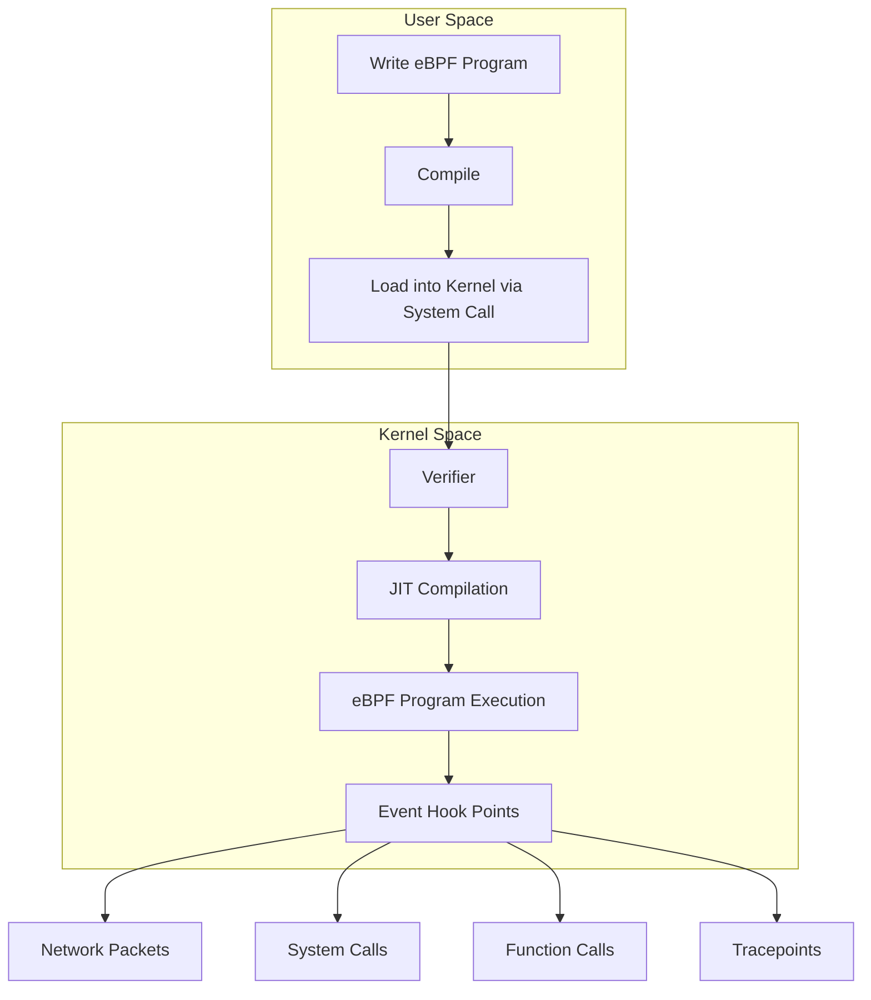
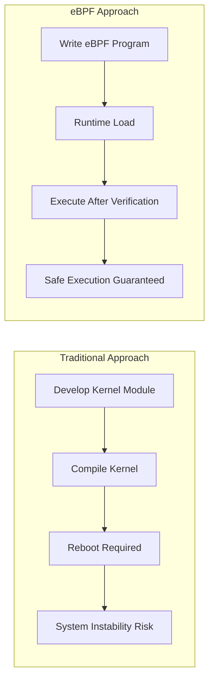
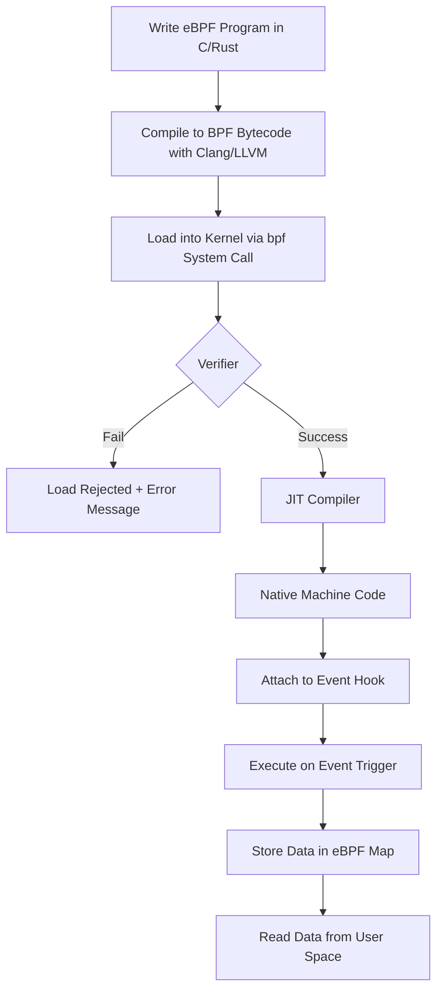
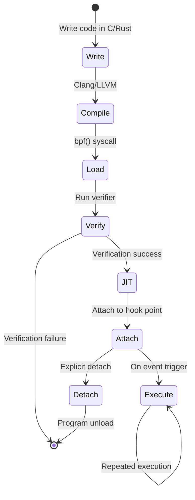
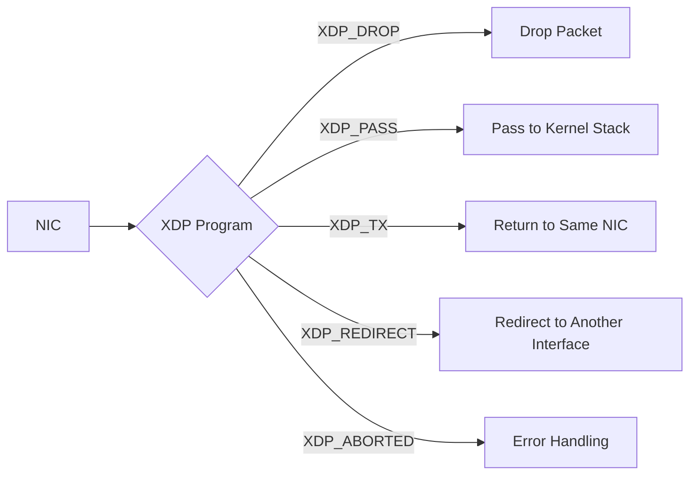
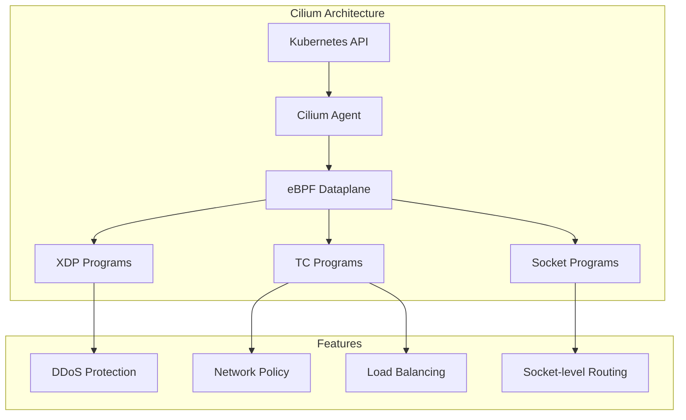
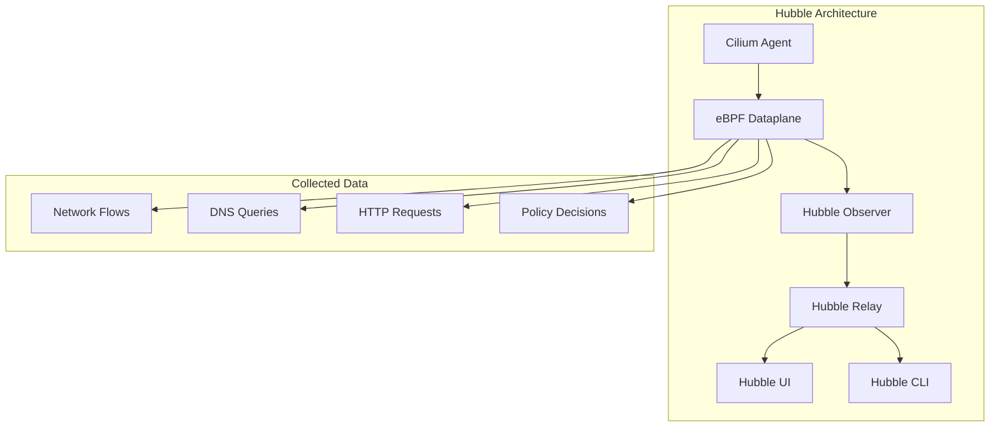
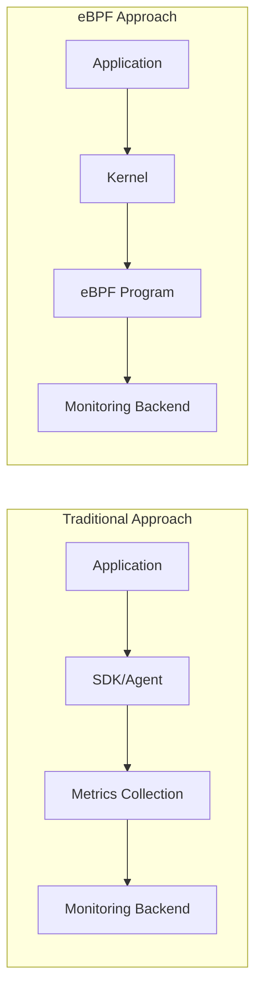
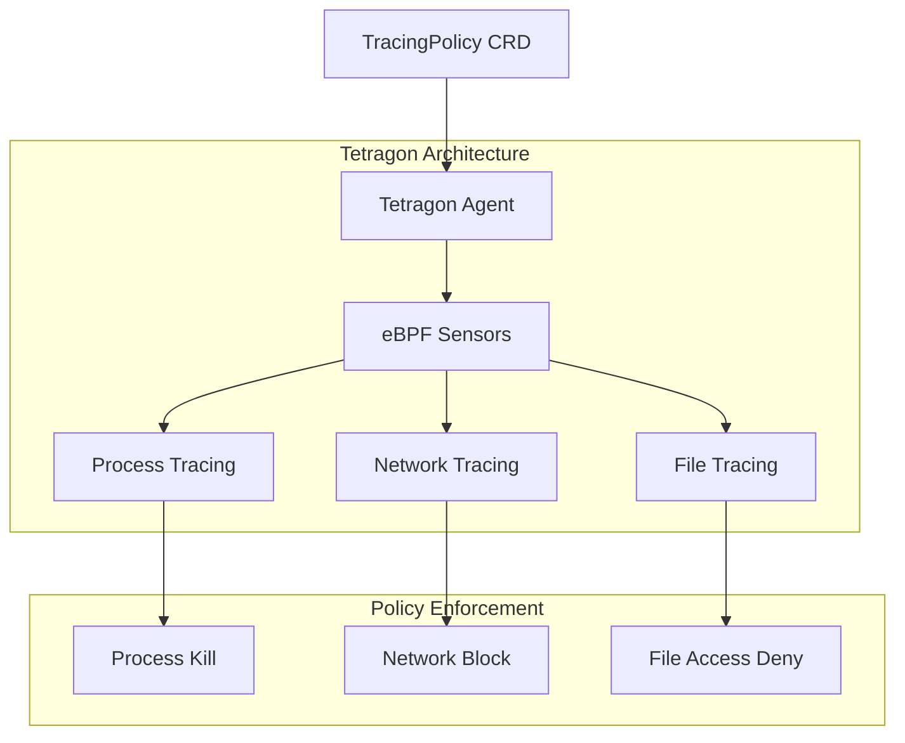

# eBPF 基础与 Kubernetes 应用

> **支持的版本**: Linux Kernel 4.18+, Kubernetes 1.25+
> **最后更新**: February 2025

eBPF 是一项革命性技术，允许沙箱化程序在 Linux kernel 中运行。本文档涵盖从 eBPF 基本概念到 Kubernetes 环境中实际应用的全部内容。

## 目录

* [1. eBPF 简介](#1-introduction-to-ebpf)
* [2. eBPF 架构](#2-ebpf-architecture)
* [3. eBPF 程序类型](#3-ebpf-program-types)
* [4. eBPF 开发工具](#4-ebpf-development-tools)
* [5. eBPF 与 Kubernetes 网络](#5-ebpf-and-kubernetes-networking)
* [6. 基于 eBPF 的可观测性](#6-ebpf-based-observability)
* [7. 基于 eBPF 的安全](#7-ebpf-based-security)
* [8. eBPF 实践示例](#8-practical-ebpf-examples)
* [9. eBPF 限制与注意事项](#9-ebpf-limitations-and-considerations)
* [10. 下一步](#10-next-steps)

## 实验环境设置

要跟随本文档中的示例进行操作，你需要以下环境。

### 先决条件
- Linux kernel 4.18 或更高版本（推荐 5.10+）
- bpftool, bcc-tools
- Kubernetes 集群（可选）

### 环境设置

```bash
# Install required packages on Ubuntu/Debian
sudo apt-get update
sudo apt-get install -y linux-tools-common linux-tools-generic bpfcc-tools

# Check kernel version
uname -r

# Verify eBPF feature support
sudo bpftool feature
```

---

## 1. eBPF 简介

### 1.1 什么是 eBPF？

**eBPF (extended Berkeley Packet Filter)** 是一种允许用户定义的程序在 Linux kernel 中安全运行的技术。它最初作为 BPF 设计用于网络数据包过滤，后来得到扩展，现在被用于网络、安全、追踪和性能分析等多个领域。

> **关键概念**: eBPF 允许你在不修改 kernel 源代码或加载 kernel module 的情况下扩展并观察 kernel 行为。



### 1.2 从传统 BPF 到 eBPF 的演进

**原始 BPF (1992)**:
- 由 UC Berkeley 开发
- 专用于网络数据包捕获和过滤
- 2 个 32 位寄存器
- 最大 4,096 条指令限制

**eBPF (2014~)**:
- 支持 64 位架构
- 11 个寄存器
- 通过 Maps 进行状态存储
- 支持多种 hook point
- 通过 JIT 编译获得原生性能

| 功能 | 传统 BPF | eBPF |
|---------|-----------------|------|
| 寄存器 | 2 (32-bit) | 11 (64-bit) |
| 指令数量 | 4,096 | 100 万+ |
| Map 支持 | 无 | 多种 map 类型 |
| 用例 | 数据包过滤 | 通用 kernel 编程 |
| 调用能力 | 无 | Helper functions, BPF-to-BPF 调用 |
| 状态存储 | 不可能 | 可通过 maps 实现 |

### 1.3 为什么 eBPF 具有革命性

eBPF 具有革命性的原因如下：

1. **无需修改 kernel 即可扩展功能**: 无需更改 kernel 源代码即可扩展 kernel 功能
2. **安全执行**: Verifier 保证程序安全
3. **高性能**: 通过 JIT 编译获得原生代码级性能
4. **动态加载**: 无需重启即可加载/卸载程序
5. **生产稳定性**: 安全执行，不会崩溃或进入无限循环



### 1.4 eBPF 与 Kernel Module 对比

| 方面 | eBPF | Kernel Module |
|--------|------|---------------|
| **安全性** | Verifier 保证安全 | 可能导致 kernel 崩溃 |
| **可移植性** | 通过 CO-RE 实现与 kernel 版本无关 | 每个 kernel 版本都需要重新编译 |
| **加载** | 动态加载/卸载 | 需要 insmod/rmmod |
| **权限** | CAP_BPF 或 CAP_SYS_ADMIN | 需要 Root 权限 |
| **调试** | 有限 | 可进行完整 kernel 调试 |
| **性能** | 通过 JIT 编译优化 | 原生性能 |
| **功能范围** | 仅限指定 hook point | 不受限制 |
| **开发难度** | 相对容易 | 需要高度专业知识 |

---

## 2. eBPF 架构

### 2.1 eBPF 执行流程



### 2.2 Verifier

Verifier 是 eBPF 的核心安全机制。它会在程序于 kernel 中运行之前验证以下内容：

**验证项**:
- 无无限循环（DAG 结构检查）
- 无越界内存访问
- 不使用未初始化变量
- Helper function 调用正确
- 保证程序终止

```c
// Example rejected by verifier
int bad_example(void *ctx) {
    int i;
    for (i = 0; i < 1000000; i++) {  // Potential infinite loop
        // ...
    }
    return 0;
}

// Example allowed by verifier
int good_example(void *ctx) {
    #pragma unroll
    for (int i = 0; i < 10; i++) {  // Unrolled at compile time
        // ...
    }
    return 0;
}
```

### 2.3 JIT Compiler

JIT (Just-In-Time) compiler 将 eBPF bytecode 转换为原生机器码：

```bash
# Check JIT compiler status
cat /proc/sys/net/core/bpf_jit_enable

# Enable JIT compiler (0: disabled, 1: enabled, 2: debug mode)
echo 1 | sudo tee /proc/sys/net/core/bpf_jit_enable
```

**JIT 编译优势**:
- 相比解释器提升 4-5 倍性能
- 作为原生 CPU 指令直接执行
- 应用架构特定优化

### 2.4 eBPF Maps

eBPF maps 是用于在 kernel 与 user space 之间共享数据并存储状态的数据结构。

**主要 Map 类型**:

| Map 类型 | 描述 | 用例 |
|----------|-------------|----------|
| `BPF_MAP_TYPE_HASH` | 哈希表 | 键值存储、连接追踪 |
| `BPF_MAP_TYPE_ARRAY` | 固定大小数组 | 基于索引访问、配置值 |
| `BPF_MAP_TYPE_PERF_EVENT_ARRAY` | 事件数组 | 向 user space 发送事件 |
| `BPF_MAP_TYPE_RINGBUF` | Ring buffer | 高性能事件流 |
| `BPF_MAP_TYPE_LRU_HASH` | LRU hash | 缓存、自动条目驱逐 |
| `BPF_MAP_TYPE_PERCPU_ARRAY` | Per-CPU array | 无锁统计信息收集 |
| `BPF_MAP_TYPE_LPM_TRIE` | LPM trie | IP 地址匹配、路由 |

```c
// Hash map definition example
struct {
    __uint(type, BPF_MAP_TYPE_HASH);
    __uint(max_entries, 1024);
    __type(key, __u32);      // Key: Process ID
    __type(value, __u64);    // Value: Counter
} packet_count SEC(".maps");
```

### 2.5 Helper Functions

eBPF 程序通过 kernel 提供的 helper functions 访问 kernel 函数。

**关键 Helper Functions**:

```c
// Map manipulation
void *bpf_map_lookup_elem(struct bpf_map *map, const void *key);
int bpf_map_update_elem(struct bpf_map *map, const void *key, const void *value, u64 flags);
int bpf_map_delete_elem(struct bpf_map *map, const void *key);

// Time-related
u64 bpf_ktime_get_ns(void);  // Current time in nanoseconds

// Packet manipulation
int bpf_skb_load_bytes(const struct sk_buff *skb, u32 offset, void *to, u32 len);
int bpf_xdp_adjust_head(struct xdp_md *xdp_md, int delta);

// Tracing
int bpf_probe_read(void *dst, u32 size, const void *src);
int bpf_trace_printk(const char *fmt, u32 fmt_size, ...);

// Process information
u64 bpf_get_current_pid_tgid(void);    // Get PID/TGID
u64 bpf_get_current_uid_gid(void);     // Get UID/GID
int bpf_get_current_comm(void *buf, u32 size);  // Process name
```

### 2.6 程序生命周期



---

## 3. eBPF 程序类型

### 3.1 XDP (eXpress Data Path)

XDP 是在网络驱动层处理数据包的最快方式。



**XDP 操作模式**:
| 模式 | 描述 | 性能 |
|------|-------------|-------------|
| Native XDP | 直接在 NIC driver 中运行 | 最高 |
| Offloaded XDP | 在 smart NIC 上运行 | 最高+ |
| Generic XDP | 软件仿真 | 用于测试 |

```c
// XDP program example: Drop traffic on specific port
SEC("xdp")
int xdp_drop_port(struct xdp_md *ctx) {
    void *data = (void *)(long)ctx->data;
    void *data_end = (void *)(long)ctx->data_end;

    struct ethhdr *eth = data;
    if ((void *)(eth + 1) > data_end)
        return XDP_PASS;

    if (eth->h_proto != htons(ETH_P_IP))
        return XDP_PASS;

    struct iphdr *ip = (void *)(eth + 1);
    if ((void *)(ip + 1) > data_end)
        return XDP_PASS;

    if (ip->protocol != IPPROTO_TCP)
        return XDP_PASS;

    struct tcphdr *tcp = (void *)ip + (ip->ihl * 4);
    if ((void *)(tcp + 1) > data_end)
        return XDP_PASS;

    // Drop port 8080 traffic
    if (tcp->dest == htons(8080))
        return XDP_DROP;

    return XDP_PASS;
}
```

### 3.2 TC (Traffic Control)

TC 程序运行在网络栈的 traffic control 层。

```bash
# TC program attachment example
tc qdisc add dev eth0 clsact
tc filter add dev eth0 ingress bpf da obj tc_prog.o sec classifier
tc filter add dev eth0 egress bpf da obj tc_prog.o sec classifier
```

**TC 与 XDP 对比**:
| 功能 | XDP | TC |
|---------|-----|-----|
| 执行位置 | Driver 层 | 网络栈 |
| 性能 | 最高 | 高 |
| SKB 访问 | 不可能 | 可能 |
| 方向 | 仅 Ingress | Ingress 和 egress 均支持 |
| 数据包修改 | 有限 | 灵活 |

### 3.3 Kprobes/Uprobes

Kprobes 和 Uprobes 动态追踪函数调用。

```c
// Kprobe example: Trace tcp_connect function
SEC("kprobe/tcp_connect")
int BPF_KPROBE(trace_tcp_connect, struct sock *sk) {
    u32 pid = bpf_get_current_pid_tgid() >> 32;

    // Get destination IP address
    u32 daddr = BPF_CORE_READ(sk, __sk_common.skc_daddr);
    u16 dport = BPF_CORE_READ(sk, __sk_common.skc_dport);

    bpf_printk("PID %d connecting to %pI4:%d\n", pid, &daddr, ntohs(dport));
    return 0;
}

// Uprobe example: Trace malloc function
SEC("uprobe/libc.so.6:malloc")
int BPF_UPROBE(trace_malloc, size_t size) {
    u32 pid = bpf_get_current_pid_tgid() >> 32;
    bpf_printk("PID %d malloc(%zu)\n", pid, size);
    return 0;
}
```

### 3.4 Tracepoints

Tracepoints 是 kernel 中预定义的静态 trace point。

```bash
# Check available tracepoints
sudo ls /sys/kernel/debug/tracing/events/

# Tracepoints in specific categories
sudo ls /sys/kernel/debug/tracing/events/sched/
sudo ls /sys/kernel/debug/tracing/events/syscalls/
```

```c
// Tracepoint example: Trace process execution
SEC("tracepoint/sched/sched_process_exec")
int handle_exec(struct trace_event_raw_sched_process_exec *ctx) {
    char comm[16];
    bpf_get_current_comm(&comm, sizeof(comm));

    u32 pid = bpf_get_current_pid_tgid() >> 32;
    bpf_printk("Process started: %s (PID: %d)\n", comm, pid);

    return 0;
}
```

### 3.5 LSM (Linux Security Module) BPF

LSM BPF 动态应用安全策略。

```c
// LSM BPF example: Restrict file opening
SEC("lsm/file_open")
int BPF_PROG(restrict_file_open, struct file *file, int ret) {
    if (ret != 0)
        return ret;

    char path[256];
    bpf_d_path(&file->f_path, path, sizeof(path));

    // Block access to /etc/shadow
    if (bpf_strncmp(path, 11, "/etc/shadow") == 0)
        return -EACCES;

    return 0;
}
```

### 3.6 Socket Filter

在 socket 层过滤数据包。

```c
// Socket Filter example
SEC("socket")
int socket_filter(struct __sk_buff *skb) {
    // Allow only IPv4 packets
    if (skb->protocol != htons(ETH_P_IP))
        return 0;  // Drop

    return skb->len;  // Return packet length (allow)
}
```

### 3.7 Cgroup Programs

控制容器资源和网络。

```c
// Cgroup socket program example: Block external connections
SEC("cgroup/connect4")
int restrict_connect(struct bpf_sock_addr *ctx) {
    // Block connections that are not to local network
    __u32 dst = ctx->user_ip4;

    // Allow only 10.0.0.0/8 range
    if ((dst & 0xFF) != 10)
        return 0;  // Deny connection

    return 1;  // Allow connection
}
```

---

## 4. eBPF 开发工具

### 4.1 bpftool

bpftool 是用于管理 eBPF 程序和 maps 的官方工具。

```bash
# List loaded eBPF programs
sudo bpftool prog list

# Program details
sudo bpftool prog show id <ID>

# Program dump (bytecode)
sudo bpftool prog dump xlated id <ID>

# JIT compiled code dump
sudo bpftool prog dump jited id <ID>

# Map list
sudo bpftool map list

# Query map contents
sudo bpftool map dump id <MAP_ID>

# Add value to map
sudo bpftool map update id <MAP_ID> key 0x01 0x00 0x00 0x00 value 0xFF 0x00 0x00 0x00

# Check kernel eBPF features
sudo bpftool feature

# BTF (BPF Type Format) information
sudo bpftool btf list
```

### 4.2 bpftrace

bpftrace 是一种 DTrace 风格的高级追踪语言。

```bash
# Installation
sudo apt-get install -y bpftrace

# System call count
sudo bpftrace -e 'tracepoint:raw_syscalls:sys_enter { @[comm] = count(); }'

# Read bytes per process
sudo bpftrace -e 'tracepoint:syscalls:sys_exit_read /args->ret > 0/ { @bytes[comm] = sum(args->ret); }'

# File open tracing
sudo bpftrace -e 'tracepoint:syscalls:sys_enter_openat { printf("%s opened %s\n", comm, str(args->filename)); }'

# TCP connection tracing
sudo bpftrace -e 'kprobe:tcp_connect { printf("%s -> %s\n", ntop(((struct sock *)arg0)->__sk_common.skc_rcv_saddr), ntop(((struct sock *)arg0)->__sk_common.skc_daddr)); }'

# Latency histogram
sudo bpftrace -e 'kprobe:vfs_read { @start[tid] = nsecs; } kretprobe:vfs_read /@start[tid]/ { @ns = hist(nsecs - @start[tid]); delete(@start[tid]); }'
```

**有用的 bpftrace One-liners**:

```bash
# Top CPU-consuming processes
sudo bpftrace -e 'profile:hz:99 { @[comm] = count(); }'

# Block I/O latency
sudo bpftrace -e 'tracepoint:block:block_rq_issue { @start[args->dev, args->sector] = nsecs; } tracepoint:block:block_rq_complete /@start[args->dev, args->sector]/ { @usecs = hist((nsecs - @start[args->dev, args->sector]) / 1000); delete(@start[args->dev, args->sector]); }'

# New process tracing
sudo bpftrace -e 'tracepoint:sched:sched_process_exec { printf("%-10d %-16s\n", pid, comm); }'

# Memory allocation tracing
sudo bpftrace -e 'tracepoint:kmem:kmalloc { @bytes = hist(args->bytes_alloc); }'
```

### 4.3 BCC (BPF Compiler Collection)

BCC 是一个允许通过 Python 和 Lua 编写 eBPF 程序的工具包。

```bash
# Installation
sudo apt-get install -y bpfcc-tools python3-bpfcc

# Included tools
ls /usr/share/bcc/tools/
```

**关键 BCC 工具**:

| 工具 | 描述 |
|------|-------------|
| `execsnoop` | 追踪新进程执行 |
| `opensnoop` | 追踪文件打开 |
| `biolatency` | Block I/O 延迟 |
| `tcpconnect` | 追踪 TCP 连接 |
| `tcpaccept` | 追踪 TCP 入站连接 |
| `tcpretrans` | 追踪 TCP 重传 |
| `runqlat` | CPU run queue 延迟 |
| `profile` | CPU 分析 |
| `funccount` | 函数调用计数 |
| `trace` | 通用函数追踪 |

```bash
# Usage examples
sudo /usr/share/bcc/tools/execsnoop    # Trace process execution
sudo /usr/share/bcc/tools/tcpconnect   # Trace TCP connections
sudo /usr/share/bcc/tools/biolatency   # Disk I/O latency
sudo /usr/share/bcc/tools/profile -F 99 10  # CPU profiling for 10 seconds
```

### 4.4 libbpf 与 CO-RE

libbpf 是用于加载 eBPF 程序的 C 库，并支持 CO-RE (Compile Once, Run Everywhere)。

**CO-RE 优势**:
- 在多种 kernel 版本上运行已编译的 eBPF 程序
- 使用 BTF (BPF Type Format) 进行结构体重定位
- 减少对 kernel header 的依赖

```c
// Example using CO-RE
#include "vmlinux.h"
#include <bpf/bpf_helpers.h>
#include <bpf/bpf_core_read.h>

SEC("kprobe/do_sys_open")
int BPF_KPROBE(do_sys_open, int dfd, const char *filename) {
    u32 pid = bpf_get_current_pid_tgid() >> 32;

    char fname[256];
    bpf_probe_read_user_str(fname, sizeof(fname), filename);

    bpf_printk("PID %d opened: %s\n", pid, fname);
    return 0;
}

char LICENSE[] SEC("license") = "GPL";
```

**BTF 生成与验证**:

```bash
# Check BTF support
ls /sys/kernel/btf/vmlinux

# Generate vmlinux.h (for CO-RE development)
bpftool btf dump file /sys/kernel/btf/vmlinux format c > vmlinux.h

# Check program BTF information
bpftool prog show id <ID> --pretty
```

---

## 5. eBPF 与 Kubernetes 网络

### 5.1 Cilium: 基于 eBPF 的 CNI

Cilium 是利用 eBPF 的最具代表性的 Kubernetes CNI (Container Network Interface)。



#### kube-proxy 替代

Cilium 可以使用 eBPF 完全替代 kube-proxy。

**传统 kube-proxy（iptables 模式）**:
```
Packet → Netfilter → iptables rule evaluation → DNAT → Routing
```

**Cilium eBPF 模式**:
```
Packet → eBPF map lookup → Direct routing
```

```bash
# Install Cilium (kube-proxy replacement mode)
helm install cilium cilium/cilium --version 1.14.0 \
  --namespace kube-system \
  --set kubeProxyReplacement=strict \
  --set k8sServiceHost=${API_SERVER_IP} \
  --set k8sServicePort=${API_SERVER_PORT}

# Remove kube-proxy
kubectl -n kube-system delete ds kube-proxy
kubectl -n kube-system delete cm kube-proxy
```

#### Network Policy

Cilium 使用 eBPF 应用 L3/L4/L7 network policies。

```yaml
# Cilium network policy example
apiVersion: cilium.io/v2
kind: CiliumNetworkPolicy
metadata:
  name: allow-http-only
spec:
  endpointSelector:
    matchLabels:
      app: web
  ingress:
    - fromEndpoints:
        - matchLabels:
            app: frontend
      toPorts:
        - ports:
            - port: "80"
              protocol: TCP
          rules:
            http:
              - method: GET
                path: "/api/.*"
```

#### Load Balancing

```yaml
# Cilium LoadBalancer service example
apiVersion: v1
kind: Service
metadata:
  name: my-service
  annotations:
    io.cilium/lb-ipam-ips: "192.168.1.100"
spec:
  type: LoadBalancer
  selector:
    app: my-app
  ports:
    - port: 80
      targetPort: 8080
```

### 5.2 Calico eBPF 模式

Calico 也支持 eBPF dataplane。

```bash
# Enable Calico eBPF mode
kubectl patch installation.operator.tigera.io default --type merge -p '{"spec":{"calicoNetwork":{"linuxDataplane":"BPF"}}}'
```

**Calico eBPF 模式功能**:
- 保留源 IP
- 支持 Direct Server Return (DSR)
- Host endpoint policies
- 加密的节点间通信

### 5.3 性能对比: iptables 与 eBPF

| 方面 | iptables | eBPF |
|--------|----------|------|
| **可扩展性** | O(n) - 与 Service 数量成正比 | O(1) - map lookup |
| **延迟** | 随规则数量增加而增加 | 恒定 |
| **CPU 使用率** | 高 | 低 |
| **更新** | 重写完整表 | 更新 map 条目 |
| **可观测性** | 有限 | Hubble 集成 |
| **内存** | 每条规则占用内存 | 优化的 map 结构 |

**基准测试结果**（基于 1000 个 Service）:

```
| Metric                  | iptables    | eBPF      | Improvement |
|------------------------|-------------|-----------|-------------|
| Connection setup time  | 2.5ms       | 0.3ms     | 8.3x        |
| CPU usage              | 15%         | 3%        | 5x          |
| Memory usage           | 256MB       | 32MB      | 8x          |
| Connections per second | 50,000      | 250,000   | 5x          |
```

```bash
# Check Cilium status
cilium status

# Check eBPF maps
cilium bpf lb list
cilium bpf ct list global

# Network policy status
cilium policy get
```

---

## 6. 基于 eBPF 的可观测性

eBPF 支持对系统和应用程序行为进行深入观察。与传统基于 agent 的监控不同，eBPF 在 kernel 层收集数据，以更低开销提供更丰富的信息。

### 6.1 Hubble: Cilium 网络可观测性

Hubble 是内置于 Cilium 的网络可观测性平台。



```bash
# Install Hubble
helm upgrade cilium cilium/cilium --version 1.14.0 \
  --namespace kube-system \
  --reuse-values \
  --set hubble.relay.enabled=true \
  --set hubble.ui.enabled=true

# Use Hubble CLI
hubble observe --pod my-pod
hubble observe --namespace default
hubble observe --protocol http
hubble observe --verdict DROPPED

# Observe traffic between specific services
hubble observe --from-pod default/frontend --to-pod default/backend

# Real-time network flow monitoring
hubble observe -f --type trace

# Generate service map
hubble observe --namespace default -o jsonpb | hubble relay --serviceMap
```

**访问 Hubble UI**:

```bash
# Port forwarding
kubectl port-forward -n kube-system svc/hubble-ui 12000:80

# Access http://localhost:12000 in browser
```

### 6.2 Pixie: 自动插桩可观测性

Pixie 使用 eBPF 在不修改应用程序代码的情况下自动收集遥测数据。

**Pixie 功能**:
- 自动协议解析（HTTP, gRPC, MySQL, PostgreSQL, Kafka 等）
- 自动生成 Service map
- Distributed tracing
- CPU profiling
- 动态日志

```bash
# Install Pixie
px deploy

# Pixie CLI query examples
# HTTP request latency
px script run px/http_data

# Traffic between services
px script run px/service_stats

# Slow request analysis
px script run px/slow_requests -- start_time=-5m latency_ns=100000000

# Pod resource usage
px script run px/pod_stats
```

**PxL (Pixie Query Language) 示例**:

```python
# Find slow HTTP requests
import px

df = px.DataFrame(table='http_events', start_time='-5m')
df = df[df.latency > 100000000]  # Over 100ms
df = df.groupby(['service', 'req_path']).agg(
    count=('latency', px.count),
    avg_latency=('latency', px.mean),
    p99_latency=('latency', px.quantiles, 0.99)
)
px.display(df)
```

### 6.3 Coroot: “No-Code” 监控

Coroot 使用 eBPF 在无需额外配置的情况下自动监控系统。

```bash
# Install Coroot with Helm
helm repo add coroot https://coroot.github.io/helm-charts
helm install coroot coroot/coroot -n coroot --create-namespace
```

**Coroot 功能**:
- 自动 Service 发现
- 自动生成依赖关系图
- SLO 监控
- 异常检测
- 根因分析

### 6.4 Kepler: 能耗监控

Kepler (Kubernetes-based Efficient Power Level Exporter) 使用 eBPF 监控容器能耗。

```bash
# Install Kepler
kubectl apply -f https://raw.githubusercontent.com/sustainable-computing-io/kepler/main/manifests/kubernetes/deployment.yaml

# Check Prometheus metrics
curl localhost:9103/metrics | grep kepler
```

**Kepler Metrics**:
- `kepler_container_joules_total`: 每个容器的能耗
- `kepler_container_gpu_joules_total`: GPU 能耗
- `kepler_node_core_joules_total`: Node CPU 能耗

### 6.5 传统 Agents 与 eBPF Instrumentation 对比

| 方面 | 传统 Agents | eBPF Instrumentation |
|--------|-------------------|---------------------|
| **开销** | 高 (5-15%) | 低 (<1%) |
| **代码修改** | 需要（SDK/library） | 不需要 |
| **覆盖范围** | 仅已插桩部分 | 整个系统 |
| **部署** | 每个应用程序 | 每个 Node |
| **权限** | 普通权限 | 需要 CAP_BPF |
| **数据深度** | 应用程序级别 | Kernel 级别 |
| **协议支持** | 需要显式支持 | 自动解析 |



---

## 7. 基于 eBPF 的安全

### 7.1 Tetragon: Runtime Security

Tetragon 是 Cilium 项目提供的基于 eBPF 的 runtime security 解决方案。



```bash
# Install Tetragon
helm repo add cilium https://helm.cilium.io
helm install tetragon cilium/tetragon -n kube-system

# Observe events
kubectl logs -n kube-system -l app.kubernetes.io/name=tetragon -c export-stdout -f | tetra getevents -o compact
```

**TracingPolicy 示例**:

```yaml
# Monitor sensitive file access
apiVersion: cilium.io/v1alpha1
kind: TracingPolicy
metadata:
  name: sensitive-file-access
spec:
  kprobes:
    - call: security_file_open
      syscall: false
      args:
        - index: 0
          type: file
      selectors:
        - matchArgs:
            - index: 0
              operator: Prefix
              values:
                - /etc/shadow
                - /etc/passwd
                - /etc/sudoers
          matchActions:
            - action: Sigkill  # Terminate process
```

```yaml
# Network connection control
apiVersion: cilium.io/v1alpha1
kind: TracingPolicy
metadata:
  name: restrict-outbound
spec:
  kprobes:
    - call: tcp_connect
      syscall: false
      args:
        - index: 0
          type: sock
      selectors:
        - matchArgs:
            - index: 0
              operator: NotEqual
              values:
                - "10.0.0.0/8"  # Internal network
          matchActions:
            - action: Sigkill
```

### 7.2 Falco: 基于 eBPF 的异常检测

Falco 是一个 CNCF 项目，使用 eBPF 检测运行时异常行为。

```bash
# Install Falco (eBPF driver)
helm repo add falcosecurity https://falcosecurity.github.io/charts
helm install falco falcosecurity/falco \
  --namespace falco --create-namespace \
  --set driver.kind=modern_ebpf
```

**Falco Rule 示例**:

```yaml
# Detect reading of /etc/shadow
- rule: Read sensitive file
  desc: Detect reading of sensitive files
  condition: >
    open_read and
    fd.name in (/etc/shadow, /etc/sudoers) and
    not proc.name in (systemd, sudo, login)
  output: >
    Sensitive file opened (file=%fd.name user=%user.name
    process=%proc.name container=%container.name)
  priority: WARNING

# Detect shell execution in container
- rule: Shell in container
  desc: Detect shell execution in container
  condition: >
    spawned_process and
    container and
    proc.name in (bash, sh, zsh, dash) and
    proc.pname != containerd-shim
  output: >
    Shell spawned in container (container=%container.name
    shell=%proc.name parent=%proc.pname)
  priority: NOTICE

# Detect privilege escalation
- rule: Privilege escalation
  desc: Detect privilege escalation attempts
  condition: >
    spawned_process and
    proc.name in (sudo, su, doas) and
    container
  output: >
    Privilege escalation attempt (user=%user.name
    command=%proc.cmdline container=%container.name)
  priority: WARNING
```

### 7.3 seccomp-bpf: 系统调用过滤

seccomp-bpf 使用 BPF 限制进程可以发起哪些系统调用。

```yaml
# Apply seccomp profile in Kubernetes Pod
apiVersion: v1
kind: Pod
metadata:
  name: secure-pod
spec:
  securityContext:
    seccompProfile:
      type: RuntimeDefault  # or Localhost
  containers:
    - name: app
      image: nginx
```

**自定义 seccomp Profile**:

```json
{
  "defaultAction": "SCMP_ACT_ERRNO",
  "architectures": ["SCMP_ARCH_X86_64"],
  "syscalls": [
    {
      "names": ["read", "write", "open", "close", "stat", "fstat", "mmap", "mprotect", "munmap", "brk", "rt_sigaction", "rt_sigprocmask", "ioctl", "access", "pipe", "select", "sched_yield", "mremap", "msync", "mincore", "madvise", "shmget", "shmat", "shmctl", "dup", "dup2", "pause", "nanosleep", "getitimer", "alarm", "setitimer", "getpid", "socket", "connect", "accept", "sendto", "recvfrom", "bind", "listen", "getsockname", "getpeername", "socketpair", "setsockopt", "getsockopt", "clone", "fork", "vfork", "execve", "exit", "wait4", "kill", "uname", "fcntl", "flock", "fsync", "fdatasync", "truncate", "ftruncate", "getdents", "getcwd", "chdir", "rename", "mkdir", "rmdir", "creat", "link", "unlink", "symlink", "readlink", "chmod", "fchmod", "chown", "fchown", "lchown", "umask", "gettimeofday", "getrlimit", "getrusage", "sysinfo", "times", "ptrace", "getuid", "syslog", "getgid", "setuid", "setgid", "geteuid", "getegid", "setpgid", "getppid", "getpgrp", "setsid", "setreuid", "setregid", "getgroups", "setgroups", "setresuid", "getresuid", "setresgid", "getresgid", "getpgid", "setfsuid", "setfsgid", "getsid", "capget", "capset", "rt_sigpending", "rt_sigtimedwait", "rt_sigqueueinfo", "rt_sigsuspend", "sigaltstack", "utime", "mknod", "personality", "ustat", "statfs", "fstatfs", "sysfs", "getpriority", "setpriority", "sched_setparam", "sched_getparam", "sched_setscheduler", "sched_getscheduler", "sched_get_priority_max", "sched_get_priority_min", "sched_rr_get_interval", "mlock", "munlock", "mlockall", "munlockall", "vhangup", "pivot_root", "prctl", "arch_prctl", "adjtimex", "setrlimit", "chroot", "sync", "acct", "settimeofday", "mount", "umount2", "swapon", "swapoff", "reboot", "sethostname", "setdomainname", "ioperm", "iopl", "create_module", "init_module", "delete_module", "get_kernel_syms", "query_module", "quotactl", "nfsservctl", "getpmsg", "putpmsg", "afs_syscall", "tuxcall", "security", "gettid", "readahead", "setxattr", "lsetxattr", "fsetxattr", "getxattr", "lgetxattr", "fgetxattr", "listxattr", "llistxattr", "flistxattr", "removexattr", "lremovexattr", "fremovexattr", "tkill", "time", "futex", "sched_setaffinity", "sched_getaffinity", "set_thread_area", "io_setup", "io_destroy", "io_getevents", "io_submit", "io_cancel", "get_thread_area", "lookup_dcookie", "epoll_create", "epoll_ctl_old", "epoll_wait_old", "remap_file_pages", "getdents64", "set_tid_address", "restart_syscall", "semtimedop", "fadvise64", "timer_create", "timer_settime", "timer_gettime", "timer_getoverrun", "timer_delete", "clock_settime", "clock_gettime", "clock_getres", "clock_nanosleep", "exit_group", "epoll_wait", "epoll_ctl", "tgkill", "utimes", "vserver", "mbind", "set_mempolicy", "get_mempolicy", "mq_open", "mq_unlink", "mq_timedsend", "mq_timedreceive", "mq_notify", "mq_getsetattr", "kexec_load", "waitid", "add_key", "request_key", "keyctl", "ioprio_set", "ioprio_get", "inotify_init", "inotify_add_watch", "inotify_rm_watch", "migrate_pages", "openat", "mkdirat", "mknodat", "fchownat", "futimesat", "newfstatat", "unlinkat", "renameat", "linkat", "symlinkat", "readlinkat", "fchmodat", "faccessat", "pselect6", "ppoll", "unshare", "set_robust_list", "get_robust_list", "splice", "tee", "sync_file_range", "vmsplice", "move_pages", "utimensat", "epoll_pwait", "signalfd", "timerfd_create", "eventfd", "fallocate", "timerfd_settime", "timerfd_gettime", "accept4", "signalfd4", "eventfd2", "epoll_create1", "dup3", "pipe2", "inotify_init1", "preadv", "pwritev", "rt_tgsigqueueinfo", "perf_event_open", "recvmmsg", "fanotify_init", "fanotify_mark", "prlimit64", "name_to_handle_at", "open_by_handle_at", "clock_adjtime", "syncfs", "sendmmsg", "setns", "getcpu", "process_vm_readv", "process_vm_writev", "kcmp", "finit_module", "sched_setattr", "sched_getattr", "renameat2", "seccomp", "getrandom", "memfd_create", "kexec_file_load", "bpf"],
      "action": "SCMP_ACT_ALLOW"
    }
  ]
}
```

### 7.4 LSM BPF: 动态安全策略

LSM BPF 将 Linux Security Module 与 eBPF 结合起来，动态应用安全策略。

```c
// LSM BPF example: Restrict executable files
SEC("lsm/bprm_check_security")
int BPF_PROG(restrict_exec, struct linux_binprm *bprm, int ret) {
    char filename[256];
    bpf_probe_read_kernel_str(filename, sizeof(filename), bprm->filename);

    // Block execution from /tmp
    if (bpf_strncmp(filename, 5, "/tmp/") == 0)
        return -EPERM;

    return 0;
}

// LSM BPF example: Restrict network sockets
SEC("lsm/socket_connect")
int BPF_PROG(restrict_connect, struct socket *sock, struct sockaddr *address, int addrlen, int ret) {
    if (ret != 0)
        return ret;

    struct sockaddr_in *addr = (struct sockaddr_in *)address;

    // Block connection to specific port
    if (ntohs(addr->sin_port) == 6666)
        return -EACCES;

    return 0;
}
```

---

## 8. eBPF 实践示例

### 8.1 使用 bpftrace 进行系统性能分析

**TCP 连接追踪**:

```bash
# TCP connection tracing
sudo bpftrace -e '
tracepoint:tcp:tcp_connect {
    printf("%s -> %s:%d\n",
        ntop(args->saddr),
        ntop(args->daddr),
        args->dport);
}'
```

**系统调用延迟分析**:

```bash
# Read system call latency histogram
sudo bpftrace -e '
tracepoint:syscalls:sys_enter_read { @start[tid] = nsecs; }
tracepoint:syscalls:sys_exit_read /@start[tid]/ {
    @latency = hist((nsecs - @start[tid]) / 1000);
    delete(@start[tid]);
}'
```

**磁盘 I/O 分析**:

```bash
# Block I/O request tracing
sudo bpftrace -e '
tracepoint:block:block_rq_issue {
    printf("%s %s %d\n",
        comm,
        args->rwbs,
        args->bytes / 1024);
}'

# I/O latency histogram
sudo bpftrace -e '
tracepoint:block:block_rq_issue { @start[args->dev, args->sector] = nsecs; }
tracepoint:block:block_rq_complete /@start[args->dev, args->sector]/ {
    @us = hist((nsecs - @start[args->dev, args->sector]) / 1000);
    delete(@start[args->dev, args->sector]);
}'
```

### 8.2 使用 Cilium Hubble 观察网络流

```bash
# Real-time network flow observation
hubble observe -f

# Specific namespace traffic
hubble observe --namespace production

# Filter HTTP traffic only
hubble observe --protocol http

# Analyze dropped packets
hubble observe --verdict DROPPED

# DNS query tracing
hubble observe --protocol dns

# Traffic between specific Pods
hubble observe --from-pod default/frontend --to-pod default/backend

# Detailed analysis with JSON output
hubble observe --namespace default -o json | jq '.flow.destination.pod_name'

# Flow statistics
hubble observe --namespace default -o jsonpb | \
  jq -r '.flow | "\(.source.pod_name // .source.identity) -> \(.destination.pod_name // .destination.identity)"' | \
  sort | uniq -c | sort -rn | head -20
```

### 8.3 使用 Tetragon 进行进程安全监控

```bash
# Real-time Tetragon event monitoring
kubectl logs -n kube-system -l app.kubernetes.io/name=tetragon -c export-stdout -f | \
  tetra getevents -o compact

# Filter process execution events only
kubectl logs -n kube-system -l app.kubernetes.io/name=tetragon -c export-stdout -f | \
  tetra getevents -o compact --process-filter

# Events from specific namespace
kubectl logs -n kube-system -l app.kubernetes.io/name=tetragon -c export-stdout -f | \
  tetra getevents -o json | jq 'select(.process_exec.process.pod.namespace == "default")'
```

**文件访问监控策略**:

```yaml
apiVersion: cilium.io/v1alpha1
kind: TracingPolicy
metadata:
  name: file-access-monitor
spec:
  kprobes:
    - call: security_file_open
      syscall: false
      return: false
      args:
        - index: 0
          type: file
      selectors:
        - matchArgs:
            - index: 0
              operator: Prefix
              values:
                - /etc/
                - /var/run/secrets/
          matchActions:
            - action: Post
```

### 8.4 使用 eBPF 进行延迟分析

**Service 响应时间测量**:

```bash
# HTTP request latency tracing (BCC)
sudo /usr/share/bcc/tools/funclatency 'c:read' -i 1

# TCP handshake latency
sudo bpftrace -e '
kprobe:tcp_v4_connect { @start[tid] = nsecs; }
kretprobe:tcp_v4_connect /@start[tid]/ {
    @connect_latency_us = hist((nsecs - @start[tid]) / 1000);
    delete(@start[tid]);
}'

# DNS lookup latency
sudo bpftrace -e '
tracepoint:net:net_dev_xmit /args->protocol == 0x0800/ {
    @dns_start[args->skbaddr] = nsecs;
}
tracepoint:net:netif_receive_skb /args->protocol == 0x0800 && @dns_start[args->skbaddr]/ {
    @dns_latency = hist((nsecs - @dns_start[args->skbaddr]) / 1000);
    delete(@dns_start[args->skbaddr]);
}'
```

**应用程序性能分析脚本**:

```bash
#!/bin/bash
# app-latency-analysis.bt

sudo bpftrace -e '
BEGIN {
    printf("Tracing application latency... Hit Ctrl-C to end.\n");
}

uprobe:/usr/lib/x86_64-linux-gnu/libc.so.6:malloc {
    @malloc_start[tid] = nsecs;
}

uretprobe:/usr/lib/x86_64-linux-gnu/libc.so.6:malloc /@malloc_start[tid]/ {
    @malloc_ns = hist(nsecs - @malloc_start[tid]);
    delete(@malloc_start[tid]);
}

kprobe:tcp_sendmsg {
    @send_start[tid] = nsecs;
}

kretprobe:tcp_sendmsg /@send_start[tid]/ {
    @tcp_send_ns = hist(nsecs - @send_start[tid]);
    delete(@send_start[tid]);
}

END {
    printf("\n=== Malloc Latency ===\n");
    print(@malloc_ns);
    printf("\n=== TCP Send Latency ===\n");
    print(@tcp_send_ns);
}
'
```

---

## 9. eBPF 限制与注意事项

### 9.1 技术限制

| 限制 | 值 | 描述 |
|------------|-------|-------------|
| **Stack size** | 512 bytes | 局部变量存储空间限制 |
| **最大指令数** | 100 万 | 程序复杂度限制 |
| **最大嵌套调用** | 8 层 | BPF-to-BPF 函数调用深度 |
| **Map 条目数量** | 因 map 类型而异 | 取决于内存限制 |
| **程序大小** | 因 map 类型而异 | JIT 编译后受限 |

**Stack Size 限制规避方法**:

```c
// Bad example: Exceeds stack size
int bad_function(void *ctx) {
    char buffer[1024];  // Exceeds stack size!
    return 0;
}

// Good example: Use map
struct {
    __uint(type, BPF_MAP_TYPE_PERCPU_ARRAY);
    __uint(max_entries, 1);
    __type(key, __u32);
    __type(value, char[1024]);
} buffer_map SEC(".maps");

int good_function(void *ctx) {
    __u32 key = 0;
    char *buffer = bpf_map_lookup_elem(&buffer_map, &key);
    if (!buffer)
        return 0;
    // Use buffer
    return 0;
}
```

### 9.2 循环限制

eBPF verifier 限制循环以保证程序终止。

```c
// Rejected by verifier: Unbounded loop
for (int i = 0; i < n; i++) {  // n is determined at runtime
    // ...
}

// Allowed by verifier: Bounded loop (kernel 5.3+)
#pragma clang loop unroll(disable)
for (int i = 0; i < 100 && i < n; i++) {  // Upper bound specified
    // ...
}

// Allowed by verifier: Compile-time unrolling
#pragma unroll
for (int i = 0; i < 10; i++) {
    // ...
}

// Using bpf_loop helper (kernel 5.17+)
static int callback(u32 index, void *ctx) {
    // Iteration work
    return 0;
}

int main_prog(void *ctx) {
    bpf_loop(1000, callback, NULL, 0);
    return 0;
}
```

### 9.3 Kernel 版本兼容性

| 功能 | 最低 Kernel 版本 |
|---------|----------------------|
| 基本 eBPF | 3.18 |
| XDP | 4.8 |
| BTF | 4.18 |
| CO-RE | 5.2 |
| BPF ring buffer | 5.8 |
| BPF loops | 5.3 |
| LSM BPF | 5.7 |
| bpf_loop helper | 5.17 |

```bash
# Check kernel version
uname -r

# Check eBPF feature support
sudo bpftool feature probe kernel

# Check BTF support
ls /sys/kernel/btf/vmlinux
```

### 9.4 调试挑战

调试 eBPF 程序与传统方法不同：

**调试方法**:

```c
// bpf_printk (for debugging, impacts performance)
bpf_printk("value = %d\n", value);

// Check debug messages
sudo cat /sys/kernel/debug/tracing/trace_pipe
```

```bash
# Check verifier log (on load failure)
sudo bpftool prog load my_prog.o /sys/fs/bpf/my_prog -d

# Check program statistics
sudo bpftool prog show id <ID> --json | jq '.run_time_ns, .run_cnt'

# Dump map contents
sudo bpftool map dump id <MAP_ID>
```

### 9.5 权限要求

| 权限 | 目的 |
|-----------|---------|
| `CAP_BPF` | 加载 eBPF 程序（kernel 5.8+） |
| `CAP_SYS_ADMIN` | 传统 eBPF 权限 |
| `CAP_PERFMON` | 附加到性能监控事件 |
| `CAP_NET_ADMIN` | 附加 XDP/TC 程序 |

```bash
# Check privileges
capsh --print

# Run program with specific privileges
sudo setcap cap_bpf,cap_perfmon+ep ./my_bpf_loader
```

**Kubernetes 中的权限配置**:

```yaml
apiVersion: v1
kind: Pod
metadata:
  name: ebpf-pod
spec:
  containers:
    - name: ebpf-container
      image: my-ebpf-app
      securityContext:
        capabilities:
          add:
            - BPF
            - PERFMON
            - NET_ADMIN
        privileged: false
      volumeMounts:
        - name: bpf-maps
          mountPath: /sys/fs/bpf
        - name: debug
          mountPath: /sys/kernel/debug
  volumes:
    - name: bpf-maps
      hostPath:
        path: /sys/fs/bpf
    - name: debug
      hostPath:
        path: /sys/kernel/debug
```

### 9.6 安全注意事项

虽然 eBPF 是强大的工具，但也存在安全风险：

- **信息泄露**: 可以访问敏感数据
- **DoS 攻击**: 可能导致性能下降
- **权限提升**: 配置错误时可能存在漏洞

**安全最佳实践**:

```bash
# Disable unprivileged eBPF
echo 0 | sudo tee /proc/sys/kernel/unprivileged_bpf_disabled

# BPF security lockdown
echo 1 | sudo tee /proc/sys/kernel/bpf_spec_v1
echo 2 | sudo tee /proc/sys/kernel/bpf_spec_v4
```

---

## 10. 下一步

### 10.1 相关测验

要验证你对本文档的理解，请尝试以下测验：

- [eBPF 基础测验](../quizzes/basics/05-ebpf-fundamentals-quiz.md)

### 10.2 进阶学习资源

**官方文档和资源**:
- [eBPF.io](https://ebpf.io) - 官方 eBPF 文档
- [Cilium Documentation](https://docs.cilium.io) - 官方 Cilium 文档
- [BPF Performance Tools](https://www.brendangregg.com/bpf-performance-tools-book.html) - Brendan Gregg 的 BPF 性能工具书

**动手环境**:
- [eBPF Tutorial](https://github.com/lizrice/learning-ebpf) - Liz Rice 的 eBPF 教程
- [BCC Tutorial](https://github.com/iovisor/bcc/blob/master/docs/tutorial.md) - 官方 BCC 教程
- [bpftrace Tutorial](https://github.com/iovisor/bpftrace/blob/master/docs/tutorial_one_liners.md) - bpftrace one-liner 教程

**社区**:
- [eBPF Summit](https://ebpf.io/summit/) - 年度 eBPF 大会
- [Cilium Slack](https://cilium.io/slack) - Cilium 社区

### 10.3 相关文档

有关与本文档相关的进阶内容，请参考以下内容：

| 主题 | 文档链接 | 描述 |
|-------|---------------|-------------|
| Cilium 简介 | [Cilium Overview](../networking/cilium/01-introduction.md) | 基于 eBPF 的 CNI 简介 |
| eBPF 深入解析 | [eBPF Technical Deep Dive](../networking/cilium/02-ebpf.md) | 进阶 eBPF 技术 |
| 网络 | [Cilium Networking](../networking/cilium/03-networking.md) | eBPF 网络实现 |
| 安全 | [Cilium Security](../networking/cilium/06-security-visibility.md) | 基于 eBPF 的安全 |
| Kubernetes 网络 | [Services and Networking](../core/03-services-networking.md) | 基础网络概念 |

### 10.4 动手清单

eBPF 学习动手清单：

```
[ ] Use bpftool to check loaded eBPF programs
[ ] Run system call tracing with bpftrace
[ ] Analyze network traffic with BCC tools
[ ] Install Cilium and observe network with Hubble
[ ] Monitor security events with Tetragon
[ ] Write and load a simple XDP program
```

---

## 总结

eBPF 是一项革命性技术，允许安全地扩展和观察 Linux kernel 行为。以下是本文档所涵盖关键内容的总结：

1. **eBPF 基本概念**: 在 kernel 中安全运行的沙箱化程序
2. **架构**: 由 verifier、JIT compiler、maps 和 helper functions 组成
3. **程序类型**: XDP, TC, Kprobes, Tracepoints, LSM BPF 等
4. **开发工具**: bpftool, bpftrace, BCC, libbpf
5. **Kubernetes 应用**: 使用 Cilium、Calico eBPF 模式实现高性能网络
6. **可观测性**: 通过 Hubble、Pixie、Coroot 进行深入系统观察
7. **安全**: 通过 Tetragon、Falco、seccomp-bpf 实现 runtime security
8. **限制**: 注意 stack size、loops、kernel 版本兼容性

eBPF 是引领 cloud-native 环境中网络、安全和可观测性未来的核心技术。
