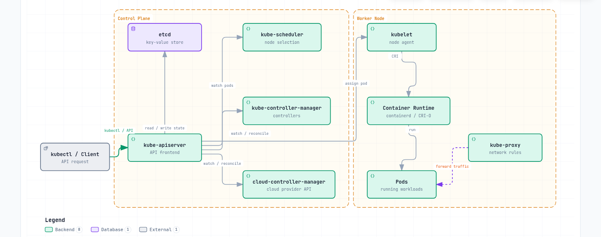

# 集群架构

> **支持的版本**: Kubernetes 1.32, 1.33, 1.34
> **最后更新**: August 31, 2026

## 实验环境设置

要实践本文档中的概念，您需要以下工具和环境：

### 所需工具
- kubectl v1.34 或更高版本
- 一个可正常运行的 Kubernetes 集群（EKS、minikube、kind 等）

### 本地开发环境设置

```bash
# Install minikube (for local development)
curl -LO https://storage.googleapis.com/minikube/releases/latest/minikube-linux-amd64
sudo install minikube-linux-amd64 /usr/local/bin/minikube

# Start cluster
minikube start

# Check cluster status
kubectl cluster-info

# Check control plane components
kubectl get pods -n kube-system
```

## 集群架构概览

> **核心概念**: Kubernetes 集群由控制平面和工作节点组成，每个部分均由执行特定职责的多个组件构成。

Kubernetes 集群由一组用于运行容器化应用程序的节点（虚拟机或物理机）组成。集群大致分为控制平面和工作节点。

### 集群架构图



[🔍 查看交互式图表](https://www.atomai.click/kubernetes-docs/archmaps/en-core-01-cluster-architecture-0.html)

**控制平面组件**:
- **kube-apiserver**: 提供 Kubernetes API 的前端
- **etcd**: 存储所有集群数据的键值存储
- **kube-scheduler**: 为新创建的 Pods 选择运行节点
- **kube-controller-manager**: 运行管理集群状态的 controllers
- **cloud-controller-manager**: 与云提供商 API 交互

**工作节点组件**:
- **kubelet**: 运行在每个节点上的 agent，管理容器执行
- **kube-proxy**: 维护网络规则并执行连接转发
- **Container Runtime**: 运行容器（containerd、CRI-O 等）

## 控制平面组件

控制平面充当 Kubernetes 集群的“中枢”，管理和控制集群的整体状态。控制平面组件通常运行在专用机器上，并且可以复制为多个实例以实现高可用性。

### 控制平面组件详情

| 组件 | 主要功能 | 通信目标 | 高可用性配置 |
|-----------|---------------|----------------------|--------------------------------|
| **kube-apiserver** | - 提供 Kubernetes API<br>- 身份验证和授权<br>- API 请求处理 | - 所有组件<br>- etcd | 通过多个实例进行水平扩展 |
| **etcd** | - 存储集群数据<br>- 分布式键值存储<br>- 确保一致性 | - kube-apiserver | 多节点集群 |
| **kube-scheduler** | - Pod 放置决策<br>- 评估节点资源<br>- 应用亲和性/反亲和性 | - kube-apiserver | 主备配置 |
| **kube-controller-manager** | - Node controller<br>- Replication controller<br>- Endpoint controller<br>- Service account controller | - kube-apiserver | 主备配置 |
| **cloud-controller-manager** | - 云提供商集成<br>- 节点生命周期<br>- 路由和负载均衡 | - kube-apiserver<br>- Cloud API | 主备配置 |

### 控制平面通信流程

1. 用户或 controller 向 kube-apiserver 发送请求
2. kube-apiserver 执行身份验证、授权和准入
3. kube-apiserver 从 etcd 读取数据并向 etcd 写入数据
4. controllers 和 scheduler 通过 kube-apiserver 监视集群状态
5. kubelet 向 kube-apiserver 报告节点状态

### kube-apiserver

kube-apiserver 是公开 Kubernetes API 的控制平面前端。所有内部和外部请求均通过该 API server 处理。

**主要功能**:
- 提供 REST API
- 身份验证和授权
- 请求验证和处理
- 与 etcd 通信
- 可水平扩展（可以扩展为多个实例）

**主要标志和配置选项**:
```bash
# Basic configuration example
kube-apiserver \
  --advertise-address=192.168.1.10 \
  --allow-privileged=true \
  --authorization-mode=Node,RBAC \
  --enable-admission-plugins=NodeRestriction \
  --enable-bootstrap-token-auth=true \
  --etcd-servers=https://127.0.0.1:2379 \
  --kubelet-client-certificate=/etc/kubernetes/pki/apiserver-kubelet-client.crt \
  --kubelet-client-key=/etc/kubernetes/pki/apiserver-kubelet-client.key \
  --service-account-key-file=/etc/kubernetes/pki/sa.pub \
  --service-cluster-ip-range=10.96.0.0/12 \
  --tls-cert-file=/etc/kubernetes/pki/apiserver.crt \
  --tls-private-key-file=/etc/kubernetes/pki/apiserver.key
```

**API Server 安全性**:
- 通过 TLS 证书进行安全通信
- 支持多种身份验证方法（X.509 证书、Service account tokens、OIDC、webhooks 等）
- 通过 RBAC（基于角色的访问控制）进行权限管理
- 通过 admission controllers 进行请求验证和修改

### etcd

etcd 是一个一致且高可用的键值存储，用于存储所有集群数据。它是 Kubernetes 的“事实来源”。

**主要特性**:
- 分布式系统
- 强一致性（使用 Raft 共识算法）
- 高可用性（可配置多个节点）
- 安全的数据存储
- 用于监控变更的 watch 功能

**etcd 集群配置**:
```bash
# etcd cluster configuration example (3 nodes)
etcd \
  --name etcd-1 \
  --initial-advertise-peer-urls https://192.168.1.11:2380 \
  --listen-peer-urls https://192.168.1.11:2380 \
  --listen-client-urls https://192.168.1.11:2379,https://127.0.0.1:2379 \
  --advertise-client-urls https://192.168.1.11:2379 \
  --initial-cluster-token etcd-cluster \
  --initial-cluster etcd-1=https://192.168.1.11:2380,etcd-2=https://192.168.1.12:2380,etcd-3=https://192.168.1.13:2380 \
  --initial-cluster-state new \
  --data-dir=/var/lib/etcd
```

**etcd 备份和恢复**:
```bash
# etcd backup
ETCDCTL_API=3 etcdctl snapshot save snapshot.db \
  --endpoints=https://127.0.0.1:2379 \
  --cacert=/etc/kubernetes/pki/etcd/ca.crt \
  --cert=/etc/kubernetes/pki/etcd/server.crt \
  --key=/etc/kubernetes/pki/etcd/server.key

# etcd recovery
ETCDCTL_API=3 etcdctl snapshot restore snapshot.db \
  --data-dir=/var/lib/etcd-restore \
  --name=etcd-1 \
  --initial-cluster=etcd-1=https://192.168.1.11:2380 \
  --initial-cluster-token=etcd-cluster \
  --initial-advertise-peer-urls=https://192.168.1.11:2380
```

**etcd 性能优化**:
- 磁盘 I/O 优化（推荐使用 SSD）
- 合理分配内存
- 定期压缩和碎片整理
- 根据集群规模配置适当数量的 etcd 节点（通常为 3 或 5 个）

#### 2026 年 7 月更新：etcd v3.7.0 发布

2026 年 7 月 8 日，SIG etcd 发布了 etcd v3.7.0。亮点包括：

- **RangeStream**: 以分块方式流式传输大型范围结果，而不是在内存中缓冲整个响应（一项长期期待的功能）
- **性能改进**: 优化仅键范围请求，租约更快速且可靠
- 移除了遗留 v2store 的最后残留部分，并完成了一次重要的 protobuf 重构
- 随附更新后的核心依赖项 bbolt v1.5.0 和 raft v3.7.0

有关详细信息，请参阅[官方公告](https://kubernetes.io/blog/2026/07/08/announcing-etcd-3.7/)和 [etcd v3.7 变更日志](https://github.com/etcd-io/etcd/blob/main/CHANGELOG/CHANGELOG-3.7.md)。

### kube-scheduler

kube-scheduler 是为新创建的 Pods 选择运行节点的控制平面组件。

**调度流程**:
1. **过滤**: 识别可运行 Pod 的节点
   - 资源需求（CPU、内存）
   - 节点选择器、节点亲和性
   - Taints 和 tolerations
   - Volume 限制

2. **评分**: 为合适的节点分配分数
   - 资源利用率
   - Pod 间亲和性/反亲和性
   - 数据本地性
   - 跨节点负载均衡

3. **绑定**: 将 Pod 分配给最优节点

**Scheduler 配置**:
```bash
# Basic configuration example
kube-scheduler \
  --kubeconfig=/etc/kubernetes/scheduler.conf \
  --leader-elect=true \
  --v=2
```

**Scheduler profiles 和 plugins**:
- 默认 scheduler profiles
- 自定义 scheduler profiles
- Scheduler 扩展点（filter、score、bind 等）
- 支持多个 scheduler

**调度策略**:
```yaml
# Scheduling policy example
apiVersion: kubescheduler.config.k8s.io/v1
kind: KubeSchedulerConfiguration
profiles:
- schedulerName: default-scheduler
  plugins:
    score:
      disabled:
      - name: NodeResourcesLeastAllocated
      enabled:
      - name: NodeResourcesMostAllocated
        weight: 1
```

### kube-controller-manager

kube-controller-manager 是运行多个 controller 进程的控制平面组件。每个 controller 管理集群的特定方面。

**主要 Controllers**:
- **Node Controller**: 监控并响应节点状态
- **Replication Controller**: 维护 Pod 副本数量
- **Endpoint Controller**: 连接 Services 和 Pods
- **Service Account & Token Controller**: 为 namespaces 创建默认账户和 API tokens
- **Job Controller**: 管理一次性任务
- **CronJob Controller**: 管理定时任务
- **DaemonSet Controller**: 确保特定 Pods 在所有节点上运行
- **StatefulSet Controller**: 管理有状态应用程序
- **PV Controller**: 管理 Persistent Volumes
- **Namespace Controller**: 管理 namespace 生命周期
- **Garbage Collector**: 清理孤立对象

**Controller Manager 配置**:
```bash
# Basic configuration example
kube-controller-manager \
  --kubeconfig=/etc/kubernetes/controller-manager.conf \
  --leader-elect=true \
  --use-service-account-credentials=true \
  --root-ca-file=/etc/kubernetes/pki/ca.crt \
  --service-account-private-key-file=/etc/kubernetes/pki/sa.key \
  --cluster-signing-cert-file=/etc/kubernetes/pki/ca.crt \
  --cluster-signing-key-file=/etc/kubernetes/pki/ca.key \
  --controllers=*,bootstrapsigner,tokencleaner
```

**Controller 操作**:
1. Controllers 通过 API server 持续监视集群状态
2. 检测当前状态与期望状态之间的差异
3. 执行操作以协调差异
4. 向 API server 报告状态变更

### cloud-controller-manager

cloud-controller-manager 是包含云特定控制逻辑的控制平面组件。这使 Kubernetes 核心能够与云提供商 API 分离。

**主要 Controllers**:
- **Node Controller**: 通过云提供商 API 检查节点状态
- **Route Controller**: 在云环境中配置路由
- **Service Controller**: 创建、更新和删除云负载均衡器
- **Volume Controller**: 创建、附加和挂载云存储 Volumes

**云提供商实现**:
- AWS Cloud Controller Manager
- Azure Cloud Controller Manager
- GCP Cloud Controller Manager
- OpenStack Cloud Controller Manager
- vSphere Cloud Controller Manager

**Cloud Controller Manager 配置**:
```bash
# AWS Cloud Controller Manager example
cloud-controller-manager \
  --cloud-provider=aws \
  --cloud-config=/etc/kubernetes/cloud-config \
  --kubeconfig=/etc/kubernetes/cloud-controller-manager.conf \
  --leader-elect=true
```

**Cloud Controller Manager 优势**:
- 将云提供商特定代码与 Kubernetes 核心分离
- 云提供商可以独立开发自己的功能
- 无需更改 Kubernetes 核心即可添加云功能

## 节点组件

节点是 Kubernetes 集群中运行容器化应用程序的工作机器。每个节点由控制平面管理，并由多个组件组成。

### kubelet

kubelet 是运行在每个节点上的 agent，负责管理 Pods 中的容器。kubelet 通过多种机制接收 PodSpecs，并确保容器根据这些 specs 健康运行。

**主要功能**:
- 根据 PodSpec 运行容器
- 监控并报告容器状态
- 管理容器生命周期
- 管理 Volume 挂载
- 报告节点状态
- 执行容器健康检查

**kubelet 配置**:
```bash
# Basic configuration example
kubelet \
  --kubeconfig=/etc/kubernetes/kubelet.conf \
  --config=/var/lib/kubelet/config.yaml \
  --container-runtime=remote \
  --container-runtime-endpoint=unix:///var/run/containerd/containerd.sock \
  --pod-infra-container-image=k8s.gcr.io/pause:3.6
```

**kubelet 配置文件示例**:
```yaml
# /var/lib/kubelet/config.yaml
apiVersion: kubelet.config.k8s.io/v1beta1
kind: KubeletConfiguration
address: 0.0.0.0
authentication:
  anonymous:
    enabled: false
  webhook:
    cacheTTL: 2m0s
    enabled: true
  x509:
    clientCAFile: /etc/kubernetes/pki/ca.crt
authorization:
  mode: Webhook
  webhook:
    cacheAuthorizedTTL: 5m0s
    cacheUnauthorizedTTL: 30s
cgroupDriver: systemd
clusterDomain: cluster.local
cpuManagerPolicy: none
evictionHard:
  memory.available: 100Mi
  nodefs.available: 10%
  nodefs.inodesFree: 5%
failSwapOn: true
healthzBindAddress: 127.0.0.1
healthzPort: 10248
```

**Static Pods**:
kubelet 可以运行由其直接管理、无需经过 API server 的 static Pods。这主要用于运行控制平面组件。

```yaml
# /etc/kubernetes/manifests/kube-apiserver.yaml
apiVersion: v1
kind: Pod
metadata:
  name: kube-apiserver
  namespace: kube-system
spec:
  containers:
  - name: kube-apiserver
    image: k8s.gcr.io/kube-apiserver:v1.24.0
    command:
    - kube-apiserver
    - --advertise-address=192.168.1.10
    # ... additional flags
```

### kube-proxy

kube-proxy 是运行在每个节点上的网络代理，用于实现 Kubernetes Service 概念。它维护节点上的网络规则并执行连接转发。

**主要功能**:
- 维护 Service IP 和端口的网络规则
- 连接转发
- 实现负载均衡
- 支持服务发现

**运行模式**:
1. **userspace mode**: 在用户空间运行代理（旧版）
2. **iptables mode**: 使用 Linux iptables 的 NAT 实现（默认）
3. **IPVS mode**: 使用 Linux 内核的 IP Virtual Server（高性能）

**kube-proxy 配置**:
```bash
# Basic configuration example
kube-proxy \
  --config=/var/lib/kube-proxy/config.conf \
  --hostname-override=node1
```

**kube-proxy 配置文件示例**:
```yaml
# /var/lib/kube-proxy/config.conf
apiVersion: kubeproxy.config.k8s.io/v1alpha1
kind: KubeProxyConfiguration
bindAddress: 0.0.0.0
clientConnection:
  acceptContentTypes: ""
  burst: 10
  contentType: application/vnd.kubernetes.protobuf
  kubeconfig: /var/lib/kube-proxy/kubeconfig.conf
  qps: 5
clusterCIDR: 10.244.0.0/16
configSyncPeriod: 15m0s
conntrack:
  maxPerCore: 32768
  min: 131072
  tcpCloseWaitTimeout: 1h0m0s
  tcpEstablishedTimeout: 24h0m0s
enableProfiling: false
healthzBindAddress: 0.0.0.0:10256
hostnameOverride: node1
iptables:
  masqueradeAll: false
  masqueradeBit: 14
  minSyncPeriod: 0s
  syncPeriod: 30s
ipvs:
  excludeCIDRs: null
  minSyncPeriod: 0s
  scheduler: ""
  syncPeriod: 30s
mode: "iptables"
```

**IPVS 与 iptables 模式比较**:

| 特性 | iptables 模式 | IPVS 模式 |
|----------------|---------------|-----------|
| 性能 | 服务较多时性能下降 | 大型集群中性能更佳 |
| 负载均衡算法 | 仅支持轮询 | 支持多种算法（rr、lc、dh、sh、sed、nq） |
| 实现方式 | 网络数据包过滤链 | 基于哈希表 |
| 内核要求 | 默认内核模块 | 需要 IPVS 内核模块 |

### Container Runtime

Container runtime 是运行容器的软件。Kubernetes 通过 Container Runtime Interface (CRI) 支持多种 container runtimes。

**主要 Container Runtimes**:
1. **containerd**: 轻量级 container runtime（目前使用最广泛）
2. **CRI-O**: 专为 Kubernetes 设计的轻量级 runtime
3. **Docker Engine**: 通过 Docker shim 支持（自 Kubernetes 1.24 起已弃用）

**Container Runtime 层结构**:


**containerd 配置示例**:
```toml
# /etc/containerd/config.toml
version = 2

[plugins]
  [plugins."io.containerd.grpc.v1.cri"]
    sandbox_image = "k8s.gcr.io/pause:3.6"
    [plugins."io.containerd.grpc.v1.cri".containerd]
      default_runtime_name = "runc"
      [plugins."io.containerd.grpc.v1.cri".containerd.runtimes]
        [plugins."io.containerd.grpc.v1.cri".containerd.runtimes.runc]
          runtime_type = "io.containerd.runc.v2"
          [plugins."io.containerd.grpc.v1.cri".containerd.runtimes.runc.options]
            SystemdCgroup = true
```

**CRI-O 配置示例**:
```toml
# /etc/crio/crio.conf
[crio]
root = "/var/lib/containers/storage"
runroot = "/var/run/containers/storage"
storage_driver = "overlay"
storage_option = ["overlay.mountopt=nodev"]

[crio.runtime]
default_runtime = "runc"
conmon = "/usr/bin/conmon"
conmon_cgroup = "pod"
cgroup_manager = "systemd"

[crio.image]
pause_image = "k8s.gcr.io/pause:3.6"
```

### Add-on 组件

Add-ons 是扩展 Kubernetes 集群功能的附加组件。一些重要的 add-ons 包括：

1. **CNI 网络插件**: 实现 Pod 网络
   - Calico、Cilium、Flannel、Weave Net 等

2. **DNS**: 在集群内提供 DNS 服务
   - CoreDNS（默认）

3. **Dashboard**: 提供基于 Web 的 UI
   - Kubernetes Dashboard

4. **Ingress Controller**: 管理 HTTP/HTTPS 路由
   - NGINX Ingress Controller、Traefik、HAProxy 等

5. **Metrics Server**: 收集资源使用指标
   - Metrics Server

6. **日志和监控**: 日志收集和监控
   - Prometheus、Grafana、Elasticsearch、Fluentd、Kibana 等

**CoreDNS 配置示例**:
```yaml
apiVersion: v1
kind: ConfigMap
metadata:
  name: coredns
  namespace: kube-system
data:
  Corefile: |
    .:53 {
        errors
        health {
            lameduck 5s
        }
        ready
        kubernetes cluster.local in-addr.arpa ip6.arpa {
            pods insecure
            fallthrough in-addr.arpa ip6.arpa
            ttl 30
        }
        prometheus :9153
        forward . /etc/resolv.conf {
            max_concurrent 1000
        }
        cache 30
        loop
        reload
        loadbalance
    }
```

**Calico CNI 配置示例**:
```yaml
apiVersion: v1
kind: ConfigMap
metadata:
  name: calico-config
  namespace: kube-system
data:
  calico_backend: "bird"
  cni_network_config: |-
    {
      "name": "k8s-pod-network",
      "cniVersion": "0.3.1",
      "plugins": [
        {
          "type": "calico",
          "log_level": "info",
          "datastore_type": "kubernetes",
          "nodename": "__KUBERNETES_NODE_NAME__",
          "mtu": __CNI_MTU__,
          "ipam": {
            "type": "calico-ipam"
          },
          "policy": {
            "type": "k8s"
          },
          "kubernetes": {
            "kubeconfig": "__KUBECONFIG_FILEPATH__"
          }
        },
        {
          "type": "portmap",
          "snat": true,
          "capabilities": {"portMappings": true}
        }
      ]
    }
```

## 集群通信路径

Kubernetes 集群内会发生各种组件之间的通信。了解这些通信路径对于集群设计、安全性和故障排除非常重要。

### 控制平面内部通信


控制平面组件之间的通信如下：

1. **kube-apiserver 和 etcd**: kube-apiserver 与 etcd 通信以存储和检索集群状态。
   - 协议: gRPC
   - 端口: 2379/TCP
   - 安全性: 基于 TLS 证书的身份验证

2. **kube-scheduler 和 kube-apiserver**: kube-scheduler 与 kube-apiserver 通信以进行 Pod 调度。
   - 协议: HTTPS
   - 端口: 6443/TCP (kube-apiserver)
   - 安全性: 基于 TLS 证书的身份验证

3. **kube-controller-manager 和 kube-apiserver**: Controllers 与 kube-apiserver 通信以监视和修改集群状态。
   - 协议: HTTPS
   - 端口: 6443/TCP (kube-apiserver)
   - 安全性: 基于 TLS 证书的身份验证

4. **cloud-controller-manager 和 kube-apiserver**: Cloud controller 与 kube-apiserver 通信以监视集群状态并管理云资源。
   - 协议: HTTPS
   - 端口: 6443/TCP (kube-apiserver)
   - 安全性: 基于 TLS 证书的身份验证

### 控制平面和节点通信


控制平面和节点之间的通信如下：

1. **kube-apiserver 和 kubelet**: kube-apiserver 与 kubelet 通信以交付 Pod specs 并收集节点状态。
   - 协议: HTTPS
   - 端口: 10250/TCP (kubelet)
   - 安全性: 基于 TLS 证书的身份验证

2. **kubelet 和 kube-apiserver**: kubelet 与 kube-apiserver 通信以进行节点注册、Pod 状态报告和事件传输。
   - 协议: HTTPS
   - 端口: 6443/TCP (kube-apiserver)
   - 安全性: 基于 TLS 证书的身份验证

3. **kube-proxy 和 kube-apiserver**: kube-proxy 与 kube-apiserver 通信以检索 Service 信息。
   - 协议: HTTPS
   - 端口: 6443/TCP (kube-apiserver)
   - 安全性: 基于 TLS 证书的身份验证

### 节点间通信


节点间通信如下：

1. **Pod 到 Pod 通信**: Pods 通过 CNI plugins 提供的网络彼此通信。
   - 协议: 取决于应用程序（TCP、UDP 等）
   - 端口: 取决于应用程序
   - 安全性: 可通过 network policies 控制

2. **跨节点 Pod 通信**: 不同节点上 Pods 之间的通信由 CNI plugin 处理。
   - 协议: 取决于应用程序（TCP、UDP 等）
   - 端口: 取决于应用程序
   - 安全性: 可通过 network policies 控制

### 外部通信


与外部实体的通信如下：

1. **客户端和 kube-apiserver**: 用户和外部系统通过 kube-apiserver 与集群交互。
   - 协议: HTTPS
   - 端口: 6443/TCP (kube-apiserver)
   - 安全性: TLS 证书、tokens、用户身份验证等

2. **外部流量和 Services**: 外部流量通过 NodePort、LoadBalancer Services 或 Ingress 访问集群内的应用程序。
   - 协议: HTTP、HTTPS、TCP、UDP 等
   - 端口: 取决于 Service 配置
   - 安全性: 取决于 ingress controller 和 Service 配置

### 通信安全

Kubernetes 集群内的通信安全性通过以下方法实现：

1. **TLS 证书**: 所有控制平面组件之间的通信均使用 TLS 证书加密。
2. **身份验证和授权**: 对 API server 的所有请求均经过身份验证和授权流程。
3. **Network Policies**: 可以通过 network policies 限制 Pod 到 Pod 通信。
4. **加密的 Secrets**: 存储在 etcd 中的 Secrets 可以加密。

**API Server 通信安全配置示例**:
```yaml
apiVersion: apiserver.config.k8s.io/v1
kind: EncryptionConfiguration
resources:
  - resources:
    - secrets
    providers:
    - aescbc:
        keys:
        - name: key1
          secret: <base64-encoded-key>
    - identity: {}
```

### 高可用集群配置

高可用性（HA）Kubernetes 集群旨在消除单点故障，并在不中断服务的情况下持续运行。

### 控制平面高可用性

控制平面的高可用性通过以下方法实现：

1. **多个控制平面节点**: 通常部署 3 或 5 个控制平面节点以实现冗余
2. **etcd 集群**: 部署由多个 etcd 实例组成的集群（通常为 3 或 5 个）
3. **Load Balancer**: 在 API servers 前部署 load balancer 以分发流量

**高可用控制平面架构**:


**etcd 集群配置**:


### 工作节点高可用性

工作节点的高可用性通过以下方法实现：

1. **多个工作节点**: 将工作负载分布到多个工作节点
2. **自动节点恢复**: 利用云提供商的自动恢复功能
3. **自动扩缩容**: 通过 cluster autoscaler 自动扩展节点
4. **多个可用区**: 跨多个可用区部署节点

**工作节点分布式部署**:


### 应用程序高可用性

应用程序的高可用性通过以下方法实现：

1. **ReplicaSet/Deployment**: 运行多个 Pod 副本
2. **Pod 分布规则**: 通过 Pod anti-affinity 将 Pods 分布到多个节点
3. **PodDisruptionBudget**: 确保在计划内中断期间的最低可用性
4. **Service 和负载均衡**: 将流量分布到多个 Pods

**Pod Anti-Affinity 示例**:
```yaml
apiVersion: apps/v1
kind: Deployment
metadata:
  name: web-server
spec:
  replicas: 3
  template:
    metadata:
      labels:
        app: web-server
    spec:
      affinity:
        podAntiAffinity:
          requiredDuringSchedulingIgnoredDuringExecution:
          - labelSelector:
              matchExpressions:
              - key: app
                operator: In
                values:
                - web-server
            topologyKey: "kubernetes.io/hostname"
      containers:
      - name: web-server
        image: nginx:1.21
```

**PodDisruptionBudget 示例**:
```yaml
apiVersion: policy/v1
kind: PodDisruptionBudget
metadata:
  name: web-server-pdb
spec:
  minAvailable: 2
  selector:
    matchLabels:
      app: web-server
```

### 灾难恢复策略

Kubernetes 集群的灾难恢复策略通过以下方法实现：

1. **etcd 备份和恢复**: 建立定期 etcd 数据备份和恢复程序
2. **多区域部署**: 跨多个区域部署集群
3. **集群联邦**: 以联邦方式管理多个集群
4. **持续备份**: 持续备份应用程序数据

**etcd 备份脚本示例**:
```bash
#!/bin/bash
ETCDCTL_API=3 etcdctl snapshot save /backup/etcd-snapshot-$(date +%Y%m%d-%H%M%S).db \
  --endpoints=https://127.0.0.1:2379 \
  --cacert=/etc/kubernetes/pki/etcd/ca.crt \
  --cert=/etc/kubernetes/pki/etcd/server.crt \
  --key=/etc/kubernetes/pki/etcd/server.key
```

**etcd 恢复脚本示例**:
```bash
#!/bin/bash
# Stop cluster
systemctl stop kubelet
docker stop $(docker ps -q)

# Recover etcd data
ETCDCTL_API=3 etcdctl snapshot restore /backup/etcd-snapshot.db \
  --data-dir=/var/lib/etcd-restore \
  --name=master \
  --initial-cluster=master=https://127.0.0.1:2380 \
  --initial-cluster-token=etcd-cluster \
  --initial-advertise-peer-urls=https://127.0.0.1:2380

# Replace etcd directory with recovered data
mv /var/lib/etcd /var/lib/etcd.old
mv /var/lib/etcd-restore /var/lib/etcd

# Restart cluster
systemctl start kubelet
```

## 集群网络

Kubernetes 网络支持 Pods、Services 和外部世界之间的通信。Kubernetes 网络模型假定每个 Pod 都有唯一的 IP 地址，并且可以在无需 NAT 的情况下相互通信。

### 网络模型

Kubernetes 网络模型具有以下要求：

1. **Pod 到 Pod 通信**: 所有 Pods 必须能够在无需 NAT 的情况下与所有其他 Pods 通信
2. **Node 到 Pod 通信**: Nodes 必须能够在无需 NAT 的情况下与所有 Pods 通信
3. **Pod 到外部通信**: Pods 必须能够与外部世界通信（通常使用 NAT）

### CNI (Container Network Interface)

CNI 是在 Kubernetes 中实现网络的标准接口。有多种 CNI plugins，每种都具有不同的功能和性能特征。

**主要 CNI Plugins**:

1. **Calico**: 基于 BGP 的网络，支持 network policies
   - 特性: 高性能、network policies、加密、eBPF 支持
   - 使用场景: 大型集群、注重安全的环境

2. **Cilium**: 基于 eBPF 的网络和安全
   - 特性: L3-L7 安全策略、高性能、可观测性
   - 使用场景: 微服务、注重安全的环境

3. **Flannel**: 简单的 overlay 网络
   - 特性: 设置简单、轻量级
   - 使用场景: 小型集群、开发环境

4. **Weave Net**: 多主机容器网络
   - 特性: 加密、network policies、多云
   - 使用场景: 混合云、多云

**CNI 配置示例 (Calico)**:
```yaml
apiVersion: v1
kind: ConfigMap
metadata:
  name: calico-config
  namespace: kube-system
data:
  calico_backend: "bird"
  cni_network_config: |-
    {
      "name": "k8s-pod-network",
      "cniVersion": "0.3.1",
      "plugins": [
        {
          "type": "calico",
          "log_level": "info",
          "datastore_type": "kubernetes",
          "nodename": "__KUBERNETES_NODE_NAME__",
          "mtu": __CNI_MTU__,
          "ipam": {
            "type": "calico-ipam"
          },
          "policy": {
            "type": "k8s"
          },
          "kubernetes": {
            "kubeconfig": "__KUBECONFIG_FILEPATH__"
          }
        },
        {
          "type": "portmap",
          "snat": true,
          "capabilities": {"portMappings": true}
        }
      ]
    }
```

### Service 网络

Kubernetes Services 为一组 Pods 提供稳定端点。Services 有多种类型，包括 ClusterIP、NodePort、LoadBalancer 和 ExternalName。

**Service 网络组件**:

1. **ClusterIP**: 仅可在集群内访问的虚拟 IP
2. **kube-proxy**: 将发往 Service IPs 的流量路由至 Pods
3. **CoreDNS**: 用于服务发现的 DNS 服务

**Service 网络流程**:
```
Client -> Service (ClusterIP) -> kube-proxy -> Pod
```

**Service 示例**:
```yaml
apiVersion: v1
kind: Service
metadata:
  name: my-service
spec:
  selector:
    app: my-app
  ports:
  - port: 80
    targetPort: 8080
  type: ClusterIP
```

### Ingress 网络

Ingress 管理从集群外部到内部 Services 的 HTTP 和 HTTPS 路由。Ingress controllers 实现 ingress resources。

**主要 Ingress Controllers**:
1. **NGINX Ingress Controller**: 基于 NGINX 的 ingress controller
2. **AWS ALB Ingress Controller**: 基于 AWS Application Load Balancer
3. **Traefik**: 云原生 edge router
4. **HAProxy Ingress**: 基于 HAProxy 的 ingress controller

**Ingress 网络流程**:
```
Client -> Ingress Controller -> Service -> Pod
```

**Ingress 示例**:
```yaml
apiVersion: networking.k8s.io/v1
kind: Ingress
metadata:
  name: my-ingress
  annotations:
    nginx.ingress.kubernetes.io/rewrite-target: /
spec:
  ingressClassName: nginx
  rules:
  - host: example.com
    http:
      paths:
      - path: /app
        pathType: Prefix
        backend:
          service:
            name: my-service
            port:
              number: 80
```

### Network Policies

Network policies 提供了控制 Pods 之间通信的方法。默认情况下，所有 Pods 可以相互通信，但 network policies 可以对此进行限制。

**Network Policy 示例**:
```yaml
apiVersion: networking.k8s.io/v1
kind: NetworkPolicy
metadata:
  name: db-network-policy
spec:
  podSelector:
    matchLabels:
      role: db
  policyTypes:
  - Ingress
  - Egress
  ingress:
  - from:
    - podSelector:
        matchLabels:
          role: frontend
    ports:
    - protocol: TCP
      port: 3306
  egress:
  - to:
    - podSelector:
        matchLabels:
          role: monitoring
    ports:
    - protocol: TCP
      port: 9090
```

### 网络故障排除

用于排查 Kubernetes 网络问题的常见工具和命令：

1. **ping、traceroute**: 基本网络连接测试
2. **tcpdump**: 网络数据包捕获和分析
3. **netstat、ss**: 检查网络连接状态
4. **nslookup、dig**: DNS 查找测试
5. **kubectl exec**: 在 Pods 内执行网络命令

**网络调试示例**:
```bash
# Test network connectivity within a pod
kubectl exec -it <pod-name> -- ping <target-ip>

# Test DNS lookup within a pod
kubectl exec -it <pod-name> -- nslookup <service-name>

# Capture network packets within a pod
kubectl exec -it <pod-name> -- tcpdump -i eth0 -n

# Check service endpoints
kubectl get endpoints <service-name>
```

## 集群存储

Kubernetes 存储为容器化应用程序提供数据持久性。Kubernetes 提供多种存储选项和抽象，帮助应用程序高效使用存储。

### 存储架构

Kubernetes 存储架构由以下组件组成：

1. **Volumes**: 可挂载到 Pods 内容器的目录
2. **Persistent Volumes (PV)**: 集群中的存储资源
3. **Persistent Volume Claims (PVC)**: 用户存储请求
4. **Storage Classes**: 定义存储的“类别”或类型
5. **CSI (Container Storage Interface)**: 与存储系统对接的标准接口

**存储架构流程**:


### Volume 类型

Kubernetes 支持多种类型的 Volumes：

1. **Ephemeral Volumes**:
   - **emptyDir**: 以空目录开始，并在 Pod 删除时删除
   - **configMap**: 将 ConfigMap 挂载为 Volume
   - **secret**: 将 Secret 挂载为 Volume
   - **downwardAPI**: 将 Pod 和 container 信息作为文件公开

2. **Persistent Volumes**:
   - **awsElasticBlockStore**: AWS EBS Volumes
   - **azureDisk**: Azure Disk
   - **gcePersistentDisk**: GCE Persistent Disk
   - **nfs**: NFS Volumes
   - **csi**: 通过 CSI drivers 的 Volumes

**Volume 示例**:
```yaml
apiVersion: v1
kind: Pod
metadata:
  name: test-pd
spec:
  containers:
  - name: test-container
    image: nginx
    volumeMounts:
    - mountPath: /test-pd
      name: test-volume
  volumes:
  - name: test-volume
    persistentVolumeClaim:
      claimName: test-pvc
```

### Persistent Volumes 和 Claims

Persistent Volumes (PV) 是集群中的存储资源，由管理员预置，或通过 storage classes 动态预置。Persistent Volume Claims (PVC) 是用户的存储请求。

**Persistent Volume 示例**:
```yaml
apiVersion: v1
kind: PersistentVolume
metadata:
  name: pv-example
spec:
  capacity:
    storage: 10Gi
  accessModes:
    - ReadWriteOnce
  persistentVolumeReclaimPolicy: Retain
  storageClassName: standard
  awsElasticBlockStore:
    volumeID: vol-0123456789abcdef0
    fsType: ext4
```

**Persistent Volume Claim 示例**:
```yaml
apiVersion: v1
kind: PersistentVolumeClaim
metadata:
  name: pvc-example
spec:
  accessModes:
    - ReadWriteOnce
  resources:
    requests:
      storage: 5Gi
  storageClassName: standard
```

### Storage Classes

Storage classes 描述管理员提供的存储“类别”。当请求 PVC 时，storage classes 允许动态预置 PVs。

**Storage Class 示例**:
```yaml
apiVersion: storage.k8s.io/v1
kind: StorageClass
metadata:
  name: standard
provisioner: kubernetes.io/aws-ebs
parameters:
  type: gp3
  fsType: ext4
reclaimPolicy: Delete
allowVolumeExpansion: true
```

### CSI (Container Storage Interface)

CSI 在 Kubernetes 和存储系统之间提供标准接口。通过 CSI，存储提供商无需修改 Kubernetes 代码即可开发自己的 storage drivers。

**CSI 架构**:


**CSI Driver 部署示例**:
```yaml
apiVersion: storage.k8s.io/v1
kind: StorageClass
metadata:
  name: ebs-sc
provisioner: ebs.csi.aws.com
parameters:
  type: gp3
  fsType: ext4
  encrypted: "true"
volumeBindingMode: WaitForFirstConsumer
```

### 存储最佳实践

使用 Kubernetes 存储的最佳实践：

1. **选择合适的存储类型**: 选择与工作负载特征相匹配的存储类型
2. **使用动态预置**: 利用 storage classes 进行动态预置
3. **选择合适的访问模式**: 选择与工作负载需求相匹配的访问模式
4. **设置资源请求和限制**: 请求适当的存储容量
5. **建立备份和恢复策略**: 为关键数据准备备份和恢复策略
6. **监控存储**: 监控存储使用情况和性能

## 集群可扩展性

Kubernetes 集群可扩展性是指集群处理不断增加的负载和需求的能力。可扩展性可以通过水平扩展（scale out）和垂直扩展（scale up）来实现。

### 集群规模限制

Kubernetes 集群具有以下规模限制：

1. **节点数量**: 每个集群最多 5,000 个节点
2. **Pod 数量**: 每个集群最多 150,000 个 Pods
3. **每个节点的 Pods**: 每个节点最多 110 个 Pods（默认）
4. **Service 数量**: 每个集群最多 10,000 个 Services
5. **每个 Pod 的 Containers**: 每个 Pod 最多 20 个 containers

这些限制可能因 Kubernetes 版本和集群配置而异。

### 水平扩展

水平扩展通过添加更多节点来增加集群容量。

**节点自动扩缩容**:
Kubernetes Cluster Autoscaler 根据工作负载需求自动调整节点数量。

```yaml
# AWS Auto Scaling Group tags example
tags:
  k8s.io/cluster-autoscaler/enabled: "true"
  k8s.io/cluster-autoscaler/my-cluster: "owned"
```

**Cluster Autoscaler 部署示例**:
```yaml
apiVersion: apps/v1
kind: Deployment
metadata:
  name: cluster-autoscaler
  namespace: kube-system
spec:
  replicas: 1
  selector:
    matchLabels:
      app: cluster-autoscaler
  template:
    metadata:
      labels:
        app: cluster-autoscaler
    spec:
      containers:
      - name: cluster-autoscaler
        image: k8s.gcr.io/autoscaling/cluster-autoscaler:v1.24.0
        command:
        - ./cluster-autoscaler
        - --cloud-provider=aws
        - --nodes=2:10:my-asg-group
        - --scale-down-unneeded-time=10m
```

**Karpenter**:
Karpenter 是 AWS 开发的一种新节点自动扩缩容工具，可提供更快速、更高效的节点预置。

```yaml
apiVersion: karpenter.sh/v1
kind: NodePool
metadata:
  name: default
spec:
  template:
    spec:
      requirements:
        - key: karpenter.sh/capacity-type
          operator: In
          values: ["spot", "on-demand"]
      nodeClassRef:
        name: default-class
  limits:
    cpu: 1000
    memory: 1000Gi
---
apiVersion: karpenter.k8s.aws/v1
kind: EC2NodeClass
metadata:
  name: default-class
spec:
  subnetSelector:
    karpenter.sh/discovery: my-cluster
  securityGroupSelector:
    karpenter.sh/discovery: my-cluster
```

### 垂直扩展

垂直扩展增加现有节点的资源（CPU、内存）。

**Vertical Pod Autoscaler (VPA)**:
VPA 自动调整 Pods 的 CPU 和内存请求。

```yaml
apiVersion: autoscaling.k8s.io/v1
kind: VerticalPodAutoscaler
metadata:
  name: my-app-vpa
spec:
  targetRef:
    apiVersion: "apps/v1"
    kind: Deployment
    name: my-app
  updatePolicy:
    updateMode: "Auto"
  resourcePolicy:
    containerPolicies:
    - containerName: '*'
      minAllowed:
        cpu: 100m
        memory: 50Mi
      maxAllowed:
        cpu: 1
        memory: 500Mi
```

### 应用程序扩展

应用程序级扩展通过调整 Pod 副本数量实现。

**Horizontal Pod Autoscaler (HPA)**:
HPA 根据 CPU 利用率或自定义指标自动调整 Pod 副本数量。

```yaml
apiVersion: autoscaling/v2
kind: HorizontalPodAutoscaler
metadata:
  name: my-app-hpa
spec:
  scaleTargetRef:
    apiVersion: apps/v1
    kind: Deployment
    name: my-app
  minReplicas: 2
  maxReplicas: 10
  metrics:
  - type: Resource
    resource:
      name: cpu
      target:
        type: Utilization
        averageUtilization: 80
```

**KEDA (Kubernetes Event-driven Autoscaling)**:
KEDA 提供事件驱动的自动扩缩容，可基于各种事件源进行扩缩容。

```yaml
apiVersion: keda.sh/v1alpha1
kind: ScaledObject
metadata:
  name: my-app-scaledobject
spec:
  scaleTargetRef:
    name: my-app
  minReplicaCount: 0
  maxReplicaCount: 10
  triggers:
  - type: kafka
    metadata:
      bootstrapServers: kafka.svc:9092
      consumerGroup: my-group
      topic: my-topic
      lagThreshold: "10"
```

### 可扩展性最佳实践

Kubernetes 集群可扩展性的最佳实践：

1. **设置资源请求和限制**: 为所有 Pods 设置适当的资源请求和限制
2. **Node Pool 策略**: 为不同的工作负载特征配置多个 node pools
3. **配置自动扩缩容**: 正确配置 Cluster Autoscaler、HPA、VPA
4. **高效 Pod 放置**: 利用 node affinity、Pod affinity/anti-affinity
5. **集群监控**: 持续监控资源使用情况和性能
6. **负载测试**: 定期进行负载测试以验证扩展策略

## 集群安全

Kubernetes 集群安全必须在多个层面实施，包括身份验证、授权、network policies、Pod security 等。

### 身份验证

用于验证访问 Kubernetes API server 的方法：

1. **X.509 Certificates**: 使用 TLS client certificates 进行身份验证
2. **Service Account Tokens**: 用于 Pods 内 API server 访问的 tokens
3. **OpenID Connect (OIDC)**: 通过外部 identity providers 进行身份验证
4. **Webhook Token Authentication**: 通过外部 authentication services 进行身份验证
5. **Authentication Proxy**: 通过 authentication proxies 进行身份验证

**kubeconfig 示例**:
```yaml
apiVersion: v1
kind: Config
clusters:
- name: my-cluster
  cluster:
    certificate-authority-data: <CA-DATA>
    server: https://api.my-cluster.example.com
users:
- name: admin
  user:
    client-certificate-data: <CERT-DATA>
    client-key-data: <KEY-DATA>
contexts:
- name: my-context
  context:
    cluster: my-cluster
    user: admin
current-context: my-context
```

### 授权

控制已通过身份验证的用户操作的方法：

1. **RBAC (Role-Based Access Control)**: 基于角色的访问控制
2. **ABAC (Attribute-Based Access Control)**: 基于属性的访问控制
3. **Node Authorization**: 节点专用授权
4. **Webhook Authorization**: 通过外部服务进行授权

**RBAC 示例**:
```yaml
# Role definition
apiVersion: rbac.authorization.k8s.io/v1
kind: Role
metadata:
  namespace: default
  name: pod-reader
rules:
- apiGroups: [""]
  resources: ["pods"]
  verbs: ["get", "watch", "list"]

# Role binding
apiVersion: rbac.authorization.k8s.io/v1
kind: RoleBinding
metadata:
  name: read-pods
  namespace: default
subjects:
- kind: User
  name: jane
  apiGroup: rbac.authorization.k8s.io
roleRef:
  kind: Role
  name: pod-reader
  apiGroup: rbac.authorization.k8s.io
```

### 网络安全

保护集群内网络流量的方法：

1. **Network Policies**: 控制 Pod 到 Pod 通信
2. **加密通信**: 通过 TLS 加密通信
3. **Service Mesh**: 通过 Istio、Linkerd 等实现高级网络安全

**Network Policy 示例**:
```yaml
apiVersion: networking.k8s.io/v1
kind: NetworkPolicy
metadata:
  name: default-deny-all
spec:
  podSelector: {}
  policyTypes:
  - Ingress
  - Egress
```

### Pod 安全

在 Pod 级别实施安全：

1. **Pod Security Context**: Pod 和 container 级别的安全设置
2. **Pod Security Standards**: 定义 Pod 安全要求
3. **seccomp Profiles**: 系统调用限制
4. **AppArmor/SELinux**: 强制访问控制

**Pod Security Context 示例**:
```yaml
apiVersion: v1
kind: Pod
metadata:
  name: security-context-pod
spec:
  securityContext:
    runAsUser: 1000
    runAsGroup: 3000
    fsGroup: 2000
  containers:
  - name: app
    image: myapp:1.0
    securityContext:
      allowPrivilegeEscalation: false
      capabilities:
        drop:
        - ALL
```

### Secret 管理

安全管理敏感信息的方法：

1. **Kubernetes Secrets**: 使用基本 Secret resources
2. **加密的 etcd**: 对存储在 etcd 中的 Secrets 进行加密
3. **外部 Secret 管理**: 利用 HashiCorp Vault、AWS Secrets Manager 等

**加密 etcd 配置示例**:
```yaml
apiVersion: apiserver.config.k8s.io/v1
kind: EncryptionConfiguration
resources:
  - resources:
    - secrets
    providers:
    - aescbc:
        keys:
        - name: key1
          secret: <base64-encoded-key>
    - identity: {}
```

### 安全最佳实践

Kubernetes 集群安全的最佳实践：

1. **最小权限原则**: 仅授予必要的最小权限
2. **定期更新**: 定期更新集群和组件
3. **网络隔离**: 通过 network policies 限制 Pod 到 Pod 通信
4. **镜像安全**: 仅使用受信任的镜像，并实施漏洞扫描
5. **审计日志**: 为集群活动启用 audit logs
6. **安全基准**: 遵循 CIS benchmarks 等安全标准

## 集群升级

Kubernetes 集群升级是应用新功能、安全补丁和 bug fixes 所必需的。必须仔细规划和执行升级。

### 2026 年 7 月更新：Kubernetes v1.37 进入 Beta

v1.37.0-beta.0 于 2026 年 7 月 20 日发布，使下一次 minor release v1.37 进入其发布周期的后期阶段。Code Freeze 按计划于 2026 年 7 月 22 日至 23 日生效，最终的 v1.37.0 release 计划于 2026 年 8 月 26 日发布。有关完整日程，请参阅 [v1.37 发布信息](https://www.kubernetes.dev/resources/release/)。

同一周（2026 年 7 月 22 日至 23 日），所有维护中的版本线均发布了 patch releases：[v1.36.3](https://github.com/kubernetes/kubernetes/releases/tag/v1.36.3)、[v1.35.7](https://github.com/kubernetes/kubernetes/releases/tag/v1.35.7) 和 [v1.34.10](https://github.com/kubernetes/kubernetes/releases/tag/v1.34.10)。与往常一样，建议应用您所用 minor version 的最新 patch。

### 2026 年 8 月更新：v1.37 抢先看

2026 年 7 月 31 日，release team 发布了 [Kubernetes v1.37 抢先看](https://kubernetes.io/blog/2026/07/31/kubernetes-v1-37-sneak-peek/)，概述了计划在最终 v1.37.0 release（仍计划于 2026 年 8 月 26 日发布）之前进行的弃用、移除和功能变更。Docs Freeze 于 2026 年 8 月 5 日至 6 日生效。同时，下一个周期的第一个 tag v1.38.0-alpha.0 于 2026 年 8 月 6 日切出。

### 2026 年 8 月更新：Patch Releases 和 v1.37.0-rc.1

2026 年 8 月 20 日，所有维护中的版本线均发布了 patch releases：[v1.36.4](https://github.com/kubernetes/kubernetes/releases/tag/v1.36.4)、[v1.35.8](https://github.com/kubernetes/kubernetes/releases/tag/v1.35.8) 和 [v1.34.11](https://github.com/kubernetes/kubernetes/releases/tag/v1.34.11)。与往常一样，建议应用您所用 minor version 的最新 patch。

同一天，v1.37 的第二个 release candidate [v1.37.0-rc.1](https://github.com/kubernetes/kubernetes/releases/tag/v1.37.0-rc.1) 也已打上 tag（rc.0 于 8 月 6 日切出），使最终 v1.37.0 release 按计划在 2026 年 8 月 26 日发布。

### 2026 年 8 月更新：Kubernetes v1.37 “Garhwal” 发布

[Kubernetes v1.37 “Garhwal”](https://kubernetes.io/blog/2026/08/26/kubernetes-v1-37-release/) 已按计划于 2026 年 8 月 26 日发布。该 release 包含 67 项 enhancements：16 项晋升为 Stable，23 项晋升为 Beta，其余作为 Alpha 进入。亮点包括：

- **Pod certificates 和 ClusterTrustBundles 晋升为 Stable**: PodCertificate 功能可为工作负载自动签发和轮换 X.509 certificates，作为 service account tokens 的替代方案；用于分发信任锚点的 ClusterTrustBundle resource 现已成为标准功能（[详细文章](https://kubernetes.io/blog/2026/08/28/kubernetes-v1-37-pod-certificates-and-cluster-trust-bundles/)）
- **Metrics API (metrics.k8s.io) 进入 GA**: `kubectl top` 和 HPA 使用的 resource metrics API 已晋升为稳定版本（[详细文章](https://kubernetes.io/blog/2026/08/27/kubernetes-v1-37-metrics-api-ga/)）
- 其他 **Stable** 功能包括：若干 DRA（Dynamic Resource Allocation）功能、具有韧性的 watchcache 初始化等；**Beta** 功能包括：HPA scale-to-zero、基于 manifest 的 admission control 配置等；**Alpha** 功能包括：Pod 级 checkpoint 和 restore 等
- **弃用项**: kube-dns、kube-proxy 的 `ipvs` mode 以及 `kubectl run --filename/-f` 已弃用，static Pods 不再可以引用 Secrets 或 ConfigMaps。对 cgroup v1 支持的移除也在持续推进。

在升级之前，请务必查看[官方 release notes](https://github.com/kubernetes/kubernetes/blob/master/CHANGELOG/CHANGELOG-1.37.md)中的弃用和移除项。

### 升级策略

Kubernetes 集群的升级策略：

1. **Blue/Green Upgrade**: 单独创建新版本集群并迁移工作负载
2. **In-Place Upgrade**: 直接升级现有集群
3. **Canary Upgrade**: 先只升级部分节点进行验证

### 升级顺序

Kubernetes 集群升级的典型顺序：

1. **控制平面升级**: kube-apiserver、kube-controller-manager、kube-scheduler、etcd
2. **DNS 和 CNI 升级**: CoreDNS、CNI plugins 和其他主要 add-ons
3. **工作节点升级**: 依次升级工作节点

**kubeadm 升级示例**:
```bash
# Control plane upgrade
kubeadm upgrade plan
kubeadm upgrade apply v1.24.0

# Worker node upgrade
kubectl drain <node-name> --ignore-daemonsets
# Upgrade kubelet and kubeadm on the node
apt-get update && apt-get install -y kubelet=1.24.0-00 kubeadm=1.24.0-00
kubeadm upgrade node
systemctl restart kubelet
kubectl uncordon <node-name>
```

### 升级注意事项

升级 Kubernetes 集群时的注意事项：

1. **API 变更**: 检查新版本中的 API 变更
2. **Feature Gates**: 检查新的 feature gates 和默认值变更
3. **依赖项**: 检查 CNI、CSI 等依赖组件的兼容性
4. **停机时间**: 规划升级期间的预期停机时间
5. **回滚计划**: 制定出现问题时的回滚计划

### 升级最佳实践

Kubernetes 集群升级的最佳实践：

1. **先在测试环境中测试**: 在生产升级之前于测试环境中验证
2. **逐步升级**: 一次升级一个 minor version
3. **备份**: 升级前备份 etcd 数据
4. **文档记录**: 记录升级程序和结果
5. **监控**: 在升级期间和之后监控集群状态
6. **升级窗口**: 在低流量时段执行升级

## Amazon EKS 集群架构

Amazon EKS (Elastic Kubernetes Service) 是 AWS 提供的托管 Kubernetes 服务。EKS 在提供所有基本 Kubernetes 功能的同时，增加了与 AWS 服务的集成和管理便利性。

### EKS 架构概览

EKS 集群由以下组件组成：

1. **EKS Control Plane**: 由 AWS 管理的 Kubernetes control plane
2. **EKS Nodes**: 由用户管理的工作节点（EC2 instances）
3. **EKS Managed Node Groups**: 由 AWS 管理的 node groups
4. **EKS Fargate Profiles**: 无服务器容器执行环境
5. **VPC and Subnets**: 用于集群网络的 VPC 和 subnets

**EKS 架构图**:


### EKS Control Plane

EKS control plane 由 AWS 管理，并在多个 availability zones 中提供高可用性。

**主要特性**:
1. **托管服务**: AWS 管理 control plane 维护和升级
2. **高可用性**: 跨多个 availability zones 部署
3. **自动扩缩容**: 根据负载自动扩缩容
4. **安全性**: 与 AWS security services 集成

### EKS 节点类型

EKS 支持多种类型的节点：

1. **Self-Managed Nodes**: 用户直接管理 EC2 instances
2. **Managed Node Groups**: AWS 管理 node lifecycle
3. **Fargate**: 无服务器容器执行环境
4. **Bottlerocket Nodes**: 针对容器工作负载优化的 OS

**Managed Node Group 示例**:
```yaml
apiVersion: eksctl.io/v1alpha5
kind: ClusterConfig
metadata:
  name: my-cluster
  region: ap-northeast-2
managedNodeGroups:
  - name: ng-1
    instanceType: m5.large
    desiredCapacity: 3
    minSize: 2
    maxSize: 5
    volumeSize: 80
    privateNetworking: true
    labels:
      role: worker
    tags:
      nodegroup-role: worker
    iam:
      withAddonPolicies:
        autoScaler: true
        albIngress: true
```

### EKS 网络

EKS 网络基于 Amazon VPC，并包括以下组件：

1. **VPC CNI Plugin**: 与 AWS VPC networking 集成
2. **Security Groups**: 节点和 Pod 级别的网络安全
3. **Load Balancer Integration**: 与 ELB、ALB、NLB 集成
4. **VPC Endpoints**: 与 AWS services 的私有通信

**VPC CNI 配置示例**:
```yaml
apiVersion: v1
kind: ConfigMap
metadata:
  name: amazon-vpc-cni
  namespace: kube-system
data:
  enable-network-policy: "true"
  enable-pod-eni: "true"
  warm-ip-target: "5"
  minimum-ip-target: "10"
```

### EKS 存储

EKS 与各种 AWS storage services 集成：

1. **EBS CSI Driver**: Amazon EBS Volume 管理
2. **EFS CSI Driver**: Amazon EFS file system 管理
3. **FSx for Lustre CSI Driver**: FSx for Lustre file system 管理
4. **S3**: Object storage

**EBS CSI Driver 示例**:
```yaml
apiVersion: storage.k8s.io/v1
kind: StorageClass
metadata:
  name: ebs-sc
provisioner: ebs.csi.aws.com
parameters:
  type: gp3
  encrypted: "true"
volumeBindingMode: WaitForFirstConsumer
```

### EKS 安全

EKS 与 AWS security services 集成，以提供强大的安全性：

1. **IAM Integration**: AWS IAM 和 Kubernetes RBAC 集成
2. **VPC Security**: VPC security groups 和 network ACLs
3. **AWS KMS**: 用于 Secret encryption 的 KMS 集成
4. **AWS WAF**: Web application firewall 集成
5. **AWS Shield**: DDoS 保护

**IAM Role Service Account 示例**:
```yaml
apiVersion: v1
kind: ServiceAccount
metadata:
  name: s3-reader
  namespace: default
  annotations:
    eks.amazonaws.com/role-arn: arn:aws:iam::123456789012:role/s3-reader-role
```

### EKS 监控和日志记录

EKS 与 AWS 监控和日志记录服务集成：

1. **CloudWatch Container Insights**: 容器监控
2. **CloudWatch Logs**: 日志收集和分析
3. **X-Ray**: 分布式跟踪
4. **Prometheus 和 Grafana**: 开源监控工具集成

**CloudWatch Container Insights 示例**:
```yaml
apiVersion: v1
kind: Namespace
metadata:
  name: amazon-cloudwatch
---
apiVersion: apps/v1
kind: DaemonSet
metadata:
  name: cloudwatch-agent
  namespace: amazon-cloudwatch
spec:
  selector:
    matchLabels:
      name: cloudwatch-agent
  template:
    metadata:
      labels:
        name: cloudwatch-agent
    spec:
      containers:
      - name: cloudwatch-agent
        image: amazon/cloudwatch-agent:1.247347.6b250880
        # ... additional configuration
```

### EKS 成本优化

优化 EKS 集群成本的方法：

1. **Spot Instances**: 使用成本效益高的 Spot instances
2. **Fargate**: 使用无服务器容器执行减少空闲资源成本
3. **自动扩缩容**: 通过 cluster autoscaler 优化资源
4. **Graviton Processors**: 使用基于 ARM 的 Graviton instances
5. **资源请求优化**: 设置适当的资源请求和限制

**Spot Instance Node Group 示例**:
```yaml
apiVersion: eksctl.io/v1alpha5
kind: ClusterConfig
metadata:
  name: my-cluster
  region: ap-northeast-2
managedNodeGroups:
  - name: spot-ng
    instanceTypes: ["m5.large", "m5a.large", "m5d.large", "m5ad.large"]
    spot: true
    desiredCapacity: 3
    minSize: 2
    maxSize: 10
```

## 了解更多

要深入了解本文档涵盖的集群架构，请参阅以下主题：

- [Kubernetes 简介](../basics/04-kubernetes-introduction.md) - Kubernetes 的基本概念和历史
- [Pods 和工作负载](./02-pods-and-workloads.md) - 管理在集群中运行的工作负载
- [Services 和网络](./03-services-networking.md) - 集群内的网络配置
- [调度、抢占和驱逐](./08-scheduling-preemption-eviction.md) - Pods 如何被放置到节点上
- [集群管理](./09-cluster-administration.md) - 集群运行和管理
- [EKS 简介](../eks/01-eks-introduction.md) - Amazon EKS 服务概览
- [EKS 集群创建](../eks/02-eks-cluster-creation-part1.md) - 如何创建 EKS 集群

### 实践和进阶学习

- [Kubernetes 官方教程](https://kubernetes.io/docs/tutorials/) - 通过实践学习
- [Kubernetes The Hard Way](https://github.com/kelseyhightower/kubernetes-the-hard-way) - 手动构建 Kubernetes 集群
- [Cilium 网络](../networking/cilium/01-introduction.md) - 高级网络和安全功能

## 结论

本文档中，我们研究了 Kubernetes 集群的架构、主要组件以及它们如何协同工作。我们还涵盖了集群网络、存储、可扩展性、安全性和升级等重要方面，以及 Amazon EKS 集群的架构。

了解 Kubernetes 集群架构是有效进行集群设计、部署和运行的基础。凭借这些知识，您可以构建稳定、可扩展且安全性增强的 Kubernetes 环境。

## 测验

要测试您在本章中学到的内容，请尝试 [集群架构测验](../quizzes/core/01-cluster-architecture-quiz.md)。

## 参考资料

- [Kubernetes 官方文档](https://kubernetes.io/docs/)
- [Amazon EKS 文档](https://docs.aws.amazon.com/eks/)
- [Kubernetes The Hard Way](https://github.com/kelseyhightower/kubernetes-the-hard-way)
- [Kubernetes Patterns](https://www.oreilly.com/library/view/kubernetes-patterns/9781492050278/)
- [Kubernetes Up & Running](https://www.oreilly.com/library/view/kubernetes-up-and/9781492046523/)
- [Kubernetes Best Practices](https://www.oreilly.com/library/view/kubernetes-best-practices/9781492056461/)
