# 集群架构

> **支持版本**: Kubernetes 1.32, 1.33, 1.34
> **最后更新**: July 11, 2026

## 实验环境设置

要练习本文档中的概念，你需要以下工具和环境：

### 必需工具
- kubectl v1.34 或更高版本
- 一个可用的 Kubernetes cluster（EKS、minikube、kind 等）

### 本地开发环境设置

```bash
# Install minikube (for local development)
curl -LO https://storage.googleapis.com/minikube/releases/latest/minikube-linux-amd64
sudo install minikube-linux-amd64 /usr/local/bin/minikube

# Start cluster
minikube start

# Check cluster status
kubectl cluster-info

# Check control plane components
kubectl get pods -n kube-system
```

## 集群架构概览

> **核心概念**: Kubernetes cluster 由 control plane（控制平面）和 worker nodes（工作节点）组成，每一部分都包含多个执行特定角色的组件。

Kubernetes cluster 由一组用于运行容器化应用程序的 nodes（虚拟机或物理机）组成。cluster 大致分为 control plane 和 worker nodes。

### 集群架构图

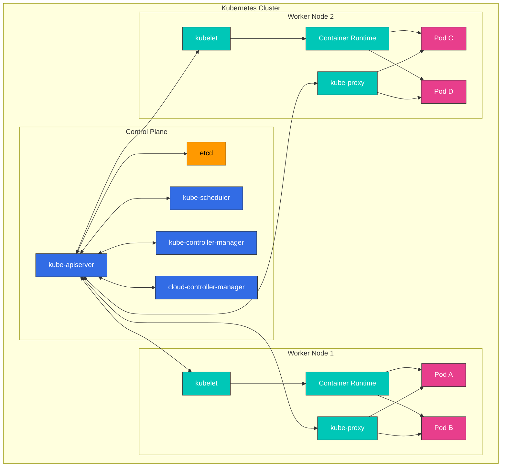

**Control Plane 组件**:
- **kube-apiserver**: 暴露 Kubernetes API 的前端
- **etcd**: 存储所有 cluster 数据的键值存储
- **kube-scheduler**: 选择用于运行新创建 pods 的 nodes
- **kube-controller-manager**: 运行管理 cluster 状态的 controllers
- **cloud-controller-manager**: 与 cloud provider APIs 交互

**Worker Node 组件**:
- **kubelet**: 运行在每个 node 上的 agent，管理容器执行
- **kube-proxy**: 维护网络规则并执行连接转发
- **Container Runtime**: 运行容器（containerd、CRI-O 等）

## Control Plane 组件

control plane 充当 Kubernetes cluster 的“大脑”，管理和控制 cluster 的整体状态。control plane 组件通常运行在专用机器上，并且可以复制为多个实例以实现高可用性。

### Control Plane 组件详情

| 组件 | 主要功能 | 通信目标 | 高可用性配置 |
|-----------|---------------|----------------------|--------------------------------|
| **kube-apiserver** | - 提供 Kubernetes API<br>- 认证和授权<br>- API 请求处理 | - 所有组件<br>- etcd | 多实例水平扩展 |
| **etcd** | - 存储 cluster 数据<br>- 分布式键值存储<br>- 确保一致性 | - kube-apiserver | 多 node cluster |
| **kube-scheduler** | - Pod 放置决策<br>- 评估 node 资源<br>- 应用亲和性/反亲和性 | - kube-apiserver | 主备配置 |
| **kube-controller-manager** | - Node controller<br>- Replication controller<br>- Endpoint controller<br>- Service account controller | - kube-apiserver | 主备配置 |
| **cloud-controller-manager** | - Cloud provider 集成<br>- Node 生命周期<br>- 路由和负载均衡 | - kube-apiserver<br>- Cloud API | 主备配置 |

### Control Plane 通信流程

1. 用户或 controller 向 kube-apiserver 发送请求
2. kube-apiserver 执行认证、授权和准入
3. kube-apiserver 从 etcd 读取数据或向 etcd 写入数据
4. Controllers 和 scheduler 通过 kube-apiserver 监听 cluster 状态
5. kubelet 向 kube-apiserver 报告 node 状态

### kube-apiserver

kube-apiserver 是暴露 Kubernetes API 的 control plane 前端。所有内部和外部请求都通过这个 API server 处理。

**主要功能**:
- 提供 REST API
- 认证和授权
- 请求验证和处理
- 与 etcd 通信
- 可水平扩展（可以扩展到多个实例）

**主要标志和配置选项**:
```bash
# Basic configuration example
kube-apiserver \
  --advertise-address=192.168.1.10 \
  --allow-privileged=true \
  --authorization-mode=Node,RBAC \
  --enable-admission-plugins=NodeRestriction \
  --enable-bootstrap-token-auth=true \
  --etcd-servers=https://127.0.0.1:2379 \
  --kubelet-client-certificate=/etc/kubernetes/pki/apiserver-kubelet-client.crt \
  --kubelet-client-key=/etc/kubernetes/pki/apiserver-kubelet-client.key \
  --service-account-key-file=/etc/kubernetes/pki/sa.pub \
  --service-cluster-ip-range=10.96.0.0/12 \
  --tls-cert-file=/etc/kubernetes/pki/apiserver.crt \
  --tls-private-key-file=/etc/kubernetes/pki/apiserver.key
```

**API Server 安全性**:
- 通过 TLS certificates 进行安全通信
- 支持多种认证方法（X.509 certificates、service account tokens、OIDC、webhooks 等）
- 通过 RBAC (Role-Based Access Control) 进行权限管理
- 通过 admission controllers 进行请求验证和修改

### etcd

etcd 是一个一致且高可用的键值存储，用于存储所有 cluster 数据。它充当 Kubernetes 的“事实来源”。

**关键特性**:
- 分布式系统
- 强一致性（使用 Raft 共识算法）
- 高可用性（可以配置多个 nodes）
- 安全的数据存储
- 用于监控变更的 watch 功能

**etcd Cluster 配置**:
```bash
# etcd cluster configuration example (3 nodes)
etcd \
  --name etcd-1 \
  --initial-advertise-peer-urls https://192.168.1.11:2380 \
  --listen-peer-urls https://192.168.1.11:2380 \
  --listen-client-urls https://192.168.1.11:2379,https://127.0.0.1:2379 \
  --advertise-client-urls https://192.168.1.11:2379 \
  --initial-cluster-token etcd-cluster \
  --initial-cluster etcd-1=https://192.168.1.11:2380,etcd-2=https://192.168.1.12:2380,etcd-3=https://192.168.1.13:2380 \
  --initial-cluster-state new \
  --data-dir=/var/lib/etcd
```

**etcd 备份和恢复**:
```bash
# etcd backup
ETCDCTL_API=3 etcdctl snapshot save snapshot.db \
  --endpoints=https://127.0.0.1:2379 \
  --cacert=/etc/kubernetes/pki/etcd/ca.crt \
  --cert=/etc/kubernetes/pki/etcd/server.crt \
  --key=/etc/kubernetes/pki/etcd/server.key

# etcd recovery
ETCDCTL_API=3 etcdctl snapshot restore snapshot.db \
  --data-dir=/var/lib/etcd-restore \
  --name=etcd-1 \
  --initial-cluster=etcd-1=https://192.168.1.11:2380 \
  --initial-cluster-token=etcd-cluster \
  --initial-advertise-peer-urls=https://192.168.1.11:2380
```

**etcd 性能优化**:
- 磁盘 I/O 优化（建议使用 SSD）
- 合理的内存分配
- 定期压缩和碎片整理
- 根据 cluster 规模选择合适数量的 etcd nodes（通常为 3 个或 5 个）

#### 2026 年 7 月更新：etcd v3.7.0 已发布

2026 年 7 月 8 日，SIG etcd 发布了 etcd v3.7.0。亮点包括：

- **RangeStream**: 以分块方式流式传输大型范围查询结果，而不是在内存中缓冲整个响应（这是一个长期被请求的功能）
- **性能改进**: 优化了仅返回 keys 的范围请求，leases 更快且更可靠
- 移除了旧版 v2store 的最后残留，并完成了一次重要的 protobuf 重构
- 随附更新后的核心依赖 bbolt v1.5.0 和 raft v3.7.0

详情请参阅[官方公告](https://kubernetes.io/blog/2026/07/08/announcing-etcd-3.7/)和 [etcd v3.7 changelog](https://github.com/etcd-io/etcd/blob/main/CHANGELOG/CHANGELOG-3.7.md)。

### kube-scheduler

kube-scheduler 是选择用于运行新创建 pods 的 nodes 的 control plane 组件。

**调度过程**:
1. **过滤**: 识别可以运行该 pod 的 nodes
   - 资源需求（CPU、内存）
   - Node selectors、node affinity
   - Taints 和 tolerations
   - Volume 约束

2. **评分**: 为合适的 nodes 分配分数
   - 资源利用率
   - Pod 间亲和性/反亲和性
   - 数据本地性
   - 跨 nodes 的负载均衡

3. **绑定**: 将 pod 分配给最优 node

**Scheduler 配置**:
```bash
# Basic configuration example
kube-scheduler \
  --kubeconfig=/etc/kubernetes/scheduler.conf \
  --leader-elect=true \
  --v=2
```

**Scheduler Profiles 和 Plugins**:
- 默认 scheduler profiles
- 自定义 scheduler profiles
- Scheduler 扩展点（filter、score、bind 等）
- 多 scheduler 支持

**调度策略**:
```yaml
# Scheduling policy example
apiVersion: kubescheduler.config.k8s.io/v1
kind: KubeSchedulerConfiguration
profiles:
- schedulerName: default-scheduler
  plugins:
    score:
      disabled:
      - name: NodeResourcesLeastAllocated
      enabled:
      - name: NodeResourcesMostAllocated
        weight: 1
```

### kube-controller-manager

kube-controller-manager 是运行多个 controller 进程的 control plane 组件。每个 controller 管理 cluster 的某个特定方面。

**主要 Controllers**:
- **Node Controller**: 监控并响应 node 状态
- **Replication Controller**: 维护 pod 副本数量
- **Endpoint Controller**: 连接 services 和 pods
- **Service Account & Token Controller**: 为 namespaces 创建默认账户和 API tokens
- **Job Controller**: 管理一次性任务
- **CronJob Controller**: 管理计划任务
- **DaemonSet Controller**: 确保特定 pods 在所有 nodes 上运行
- **StatefulSet Controller**: 管理有状态应用程序
- **PV Controller**: 管理 persistent volumes
- **Namespace Controller**: 管理 namespace 生命周期
- **Garbage Collector**: 清理孤立对象

**Controller Manager 配置**:
```bash
# Basic configuration example
kube-controller-manager \
  --kubeconfig=/etc/kubernetes/controller-manager.conf \
  --leader-elect=true \
  --use-service-account-credentials=true \
  --root-ca-file=/etc/kubernetes/pki/ca.crt \
  --service-account-private-key-file=/etc/kubernetes/pki/sa.key \
  --cluster-signing-cert-file=/etc/kubernetes/pki/ca.crt \
  --cluster-signing-key-file=/etc/kubernetes/pki/ca.key \
  --controllers=*,bootstrapsigner,tokencleaner
```

**Controller 运行方式**:
1. Controllers 通过 API server 持续监听 cluster 状态
2. 检测当前状态与期望状态之间的差异
3. 执行操作以协调差异
4. 向 API server 报告状态变更

### cloud-controller-manager

cloud-controller-manager 是包含云特定控制逻辑的 control plane 组件。这使 Kubernetes core 能够与 cloud provider APIs 分离。

**主要 Controllers**:
- **Node Controller**: 通过 cloud provider API 检查 node 状态
- **Route Controller**: 在 cloud environments 中配置路由
- **Service Controller**: 创建、更新和删除 cloud load balancers
- **Volume Controller**: 创建、附加和挂载 cloud storage volumes

**Cloud Provider 实现**:
- AWS Cloud Controller Manager
- Azure Cloud Controller Manager
- GCP Cloud Controller Manager
- OpenStack Cloud Controller Manager
- vSphere Cloud Controller Manager

**Cloud Controller Manager 配置**:
```bash
# AWS Cloud Controller Manager example
cloud-controller-manager \
  --cloud-provider=aws \
  --cloud-config=/etc/kubernetes/cloud-config \
  --kubeconfig=/etc/kubernetes/cloud-controller-manager.conf \
  --leader-elect=true
```

**Cloud Controller Manager 优势**:
- 将 cloud provider 特定代码与 Kubernetes core 分离
- Cloud providers 可以独立开发自己的功能
- 无需更改 Kubernetes core 即可添加 cloud 功能

## Node 组件

Nodes 是 Kubernetes cluster 中运行容器化应用程序的工作机器。每个 node 都由 control plane 管理，并由多个组件组成。

### kubelet

kubelet 是运行在每个 node 上的 agent，用于管理 pods 中的容器。kubelet 通过各种机制接收 PodSpecs，并确保容器按照这些 specs 健康运行。

**主要功能**:
- 根据 PodSpec 运行容器
- 监控并报告容器状态
- 管理容器生命周期
- 管理 volume 挂载
- 报告 node 状态
- 执行容器健康检查

**kubelet 配置**:
```bash
# Basic configuration example
kubelet \
  --kubeconfig=/etc/kubernetes/kubelet.conf \
  --config=/var/lib/kubelet/config.yaml \
  --container-runtime=remote \
  --container-runtime-endpoint=unix:///var/run/containerd/containerd.sock \
  --pod-infra-container-image=k8s.gcr.io/pause:3.6
```

**kubelet 配置文件示例**:
```yaml
# /var/lib/kubelet/config.yaml
apiVersion: kubelet.config.k8s.io/v1beta1
kind: KubeletConfiguration
address: 0.0.0.0
authentication:
  anonymous:
    enabled: false
  webhook:
    cacheTTL: 2m0s
    enabled: true
  x509:
    clientCAFile: /etc/kubernetes/pki/ca.crt
authorization:
  mode: Webhook
  webhook:
    cacheAuthorizedTTL: 5m0s
    cacheUnauthorizedTTL: 30s
cgroupDriver: systemd
clusterDomain: cluster.local
cpuManagerPolicy: none
evictionHard:
  memory.available: 100Mi
  nodefs.available: 10%
  nodefs.inodesFree: 5%
failSwapOn: true
healthzBindAddress: 127.0.0.1
healthzPort: 10248
```

**Static Pods**:
kubelet 可以运行由它直接管理、无需经过 API server 的 static pods。这主要用于运行 control plane 组件。

```yaml
# /etc/kubernetes/manifests/kube-apiserver.yaml
apiVersion: v1
kind: Pod
metadata:
  name: kube-apiserver
  namespace: kube-system
spec:
  containers:
  - name: kube-apiserver
    image: k8s.gcr.io/kube-apiserver:v1.24.0
    command:
    - kube-apiserver
    - --advertise-address=192.168.1.10
    # ... additional flags
```

### kube-proxy

kube-proxy 是运行在每个 node 上的网络 proxy，用于实现 Kubernetes Service 概念。它维护 nodes 上的网络规则并执行连接转发。

**主要功能**:
- 维护 service IPs 和端口的网络规则
- 连接转发
- 实现负载均衡
- 支持 service discovery

**运行模式**:
1. **userspace mode**: 在用户空间运行 proxy（旧版）
2. **iptables mode**: 使用 Linux iptables 的 NAT 实现（默认）
3. **IPVS mode**: 使用 Linux kernel 的 IP Virtual Server（高性能）

**kube-proxy 配置**:
```bash
# Basic configuration example
kube-proxy \
  --config=/var/lib/kube-proxy/config.conf \
  --hostname-override=node1
```

**kube-proxy 配置文件示例**:
```yaml
# /var/lib/kube-proxy/config.conf
apiVersion: kubeproxy.config.k8s.io/v1alpha1
kind: KubeProxyConfiguration
bindAddress: 0.0.0.0
clientConnection:
  acceptContentTypes: ""
  burst: 10
  contentType: application/vnd.kubernetes.protobuf
  kubeconfig: /var/lib/kube-proxy/kubeconfig.conf
  qps: 5
clusterCIDR: 10.244.0.0/16
configSyncPeriod: 15m0s
conntrack:
  maxPerCore: 32768
  min: 131072
  tcpCloseWaitTimeout: 1h0m0s
  tcpEstablishedTimeout: 24h0m0s
enableProfiling: false
healthzBindAddress: 0.0.0.0:10256
hostnameOverride: node1
iptables:
  masqueradeAll: false
  masqueradeBit: 14
  minSyncPeriod: 0s
  syncPeriod: 30s
ipvs:
  excludeCIDRs: null
  minSyncPeriod: 0s
  scheduler: ""
  syncPeriod: 30s
mode: "iptables"
```

**IPVS 与 iptables 模式比较**:

| 特性 | iptables 模式 | IPVS 模式 |
|----------------|---------------|-----------|
| 性能 | service 数量很多时性能下降 | 在大型 clusters 中性能更好 |
| 负载均衡算法 | 仅支持轮询 | 支持多种算法（rr、lc、dh、sh、sed、nq） |
| 实现 | 网络包过滤链 | 基于哈希表 |
| Kernel 要求 | 默认 kernel modules | 需要 IPVS kernel module |

### Container Runtime

Container runtime 是运行容器的软件。Kubernetes 通过 Container Runtime Interface (CRI) 支持多种 container runtimes。

**主要 Container Runtimes**:
1. **containerd**: 轻量级 container runtime（目前使用最广泛）
2. **CRI-O**: 专为 Kubernetes 设计的轻量级 runtime
3. **Docker Engine**: 通过 Docker shim 支持（从 Kubernetes 1.24 起弃用）

**Container Runtime 层结构**:

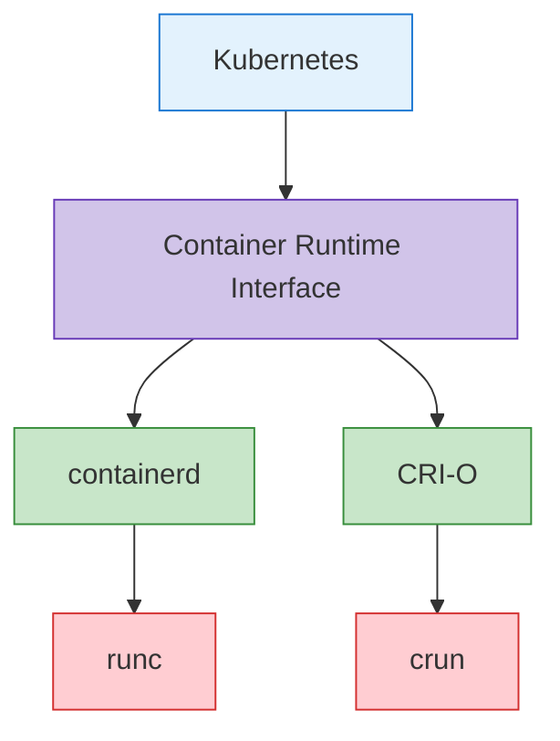

**containerd 配置示例**:
```toml
# /etc/containerd/config.toml
version = 2

[plugins]
  [plugins."io.containerd.grpc.v1.cri"]
    sandbox_image = "k8s.gcr.io/pause:3.6"
    [plugins."io.containerd.grpc.v1.cri".containerd]
      default_runtime_name = "runc"
      [plugins."io.containerd.grpc.v1.cri".containerd.runtimes]
        [plugins."io.containerd.grpc.v1.cri".containerd.runtimes.runc]
          runtime_type = "io.containerd.runc.v2"
          [plugins."io.containerd.grpc.v1.cri".containerd.runtimes.runc.options]
            SystemdCgroup = true
```

**CRI-O 配置示例**:
```toml
# /etc/crio/crio.conf
[crio]
root = "/var/lib/containers/storage"
runroot = "/var/run/containers/storage"
storage_driver = "overlay"
storage_option = ["overlay.mountopt=nodev"]

[crio.runtime]
default_runtime = "runc"
conmon = "/usr/bin/conmon"
conmon_cgroup = "pod"
cgroup_manager = "systemd"

[crio.image]
pause_image = "k8s.gcr.io/pause:3.6"
```

### Add-on 组件

Add-ons 是扩展 Kubernetes clusters 功能的附加组件。一些重要的 add-ons 包括：

1. **CNI Network Plugins**: 实现 pod networking
   - Calico、Cilium、Flannel、Weave Net 等

2. **DNS**: 在 cluster 内提供 DNS service
   - CoreDNS（默认）

3. **Dashboard**: 提供基于 Web 的 UI
   - Kubernetes Dashboard

4. **Ingress Controller**: 管理 HTTP/HTTPS 路由
   - NGINX Ingress Controller、Traefik、HAProxy 等

5. **Metrics Server**: 收集资源使用指标
   - Metrics Server

6. **Logging and Monitoring**: 日志收集和监控
   - Prometheus、Grafana、Elasticsearch、Fluentd、Kibana 等

**CoreDNS 配置示例**:
```yaml
apiVersion: v1
kind: ConfigMap
metadata:
  name: coredns
  namespace: kube-system
data:
  Corefile: |
    .:53 {
        errors
        health {
            lameduck 5s
        }
        ready
        kubernetes cluster.local in-addr.arpa ip6.arpa {
            pods insecure
            fallthrough in-addr.arpa ip6.arpa
            ttl 30
        }
        prometheus :9153
        forward . /etc/resolv.conf {
            max_concurrent 1000
        }
        cache 30
        loop
        reload
        loadbalance
    }
```

**Calico CNI 配置示例**:
```yaml
apiVersion: v1
kind: ConfigMap
metadata:
  name: calico-config
  namespace: kube-system
data:
  calico_backend: "bird"
  cni_network_config: |-
    {
      "name": "k8s-pod-network",
      "cniVersion": "0.3.1",
      "plugins": [
        {
          "type": "calico",
          "log_level": "info",
          "datastore_type": "kubernetes",
          "nodename": "__KUBERNETES_NODE_NAME__",
          "mtu": __CNI_MTU__,
          "ipam": {
            "type": "calico-ipam"
          },
          "policy": {
            "type": "k8s"
          },
          "kubernetes": {
            "kubeconfig": "__KUBECONFIG_FILEPATH__"
          }
        },
        {
          "type": "portmap",
          "snat": true,
          "capabilities": {"portMappings": true}
        }
      ]
    }
```

## Cluster 通信路径

Kubernetes cluster 内会发生各组件之间的通信。理解这些通信路径对于 cluster 设计、安全性和故障排查非常重要。

### Control Plane 内部通信

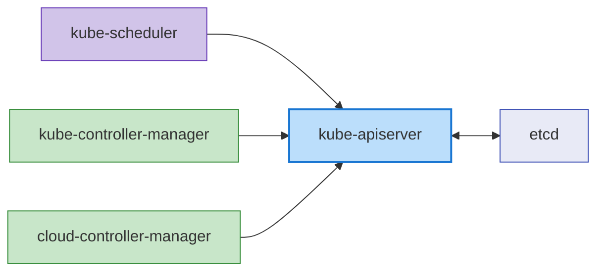

control plane 组件之间的通信如下：

1. **kube-apiserver 和 etcd**: kube-apiserver 与 etcd 通信以存储和检索 cluster 状态。
   - 协议: gRPC
   - 端口: 2379/TCP
   - 安全性: 基于 TLS certificate 的认证

2. **kube-scheduler 和 kube-apiserver**: kube-scheduler 与 kube-apiserver 通信以进行 pod 调度。
   - 协议: HTTPS
   - 端口: 6443/TCP (kube-apiserver)
   - 安全性: 基于 TLS certificate 的认证

3. **kube-controller-manager 和 kube-apiserver**: Controllers 与 kube-apiserver 通信，以监听和修改 cluster 状态。
   - 协议: HTTPS
   - 端口: 6443/TCP (kube-apiserver)
   - 安全性: 基于 TLS certificate 的认证

4. **cloud-controller-manager 和 kube-apiserver**: Cloud controller 与 kube-apiserver 通信，以监听 cluster 状态并管理 cloud resources。
   - 协议: HTTPS
   - 端口: 6443/TCP (kube-apiserver)
   - 安全性: 基于 TLS certificate 的认证

### Control Plane 与 Node 通信

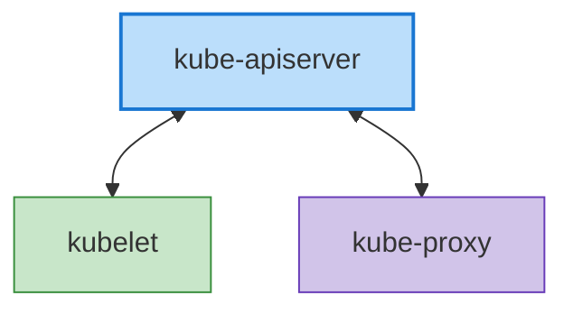

control plane 与 nodes 之间的通信如下：

1. **kube-apiserver 和 kubelet**: kube-apiserver 与 kubelet 通信，以交付 pod specs 并收集 node 状态。
   - 协议: HTTPS
   - 端口: 10250/TCP (kubelet)
   - 安全性: 基于 TLS certificate 的认证

2. **kubelet 和 kube-apiserver**: kubelet 与 kube-apiserver 通信，用于 node 注册、pod 状态报告和事件传输。
   - 协议: HTTPS
   - 端口: 6443/TCP (kube-apiserver)
   - 安全性: 基于 TLS certificate 的认证

3. **kube-proxy 和 kube-apiserver**: kube-proxy 与 kube-apiserver 通信，以检索 service 信息。
   - 协议: HTTPS
   - 端口: 6443/TCP (kube-apiserver)
   - 安全性: 基于 TLS certificate 的认证

### Node 间通信

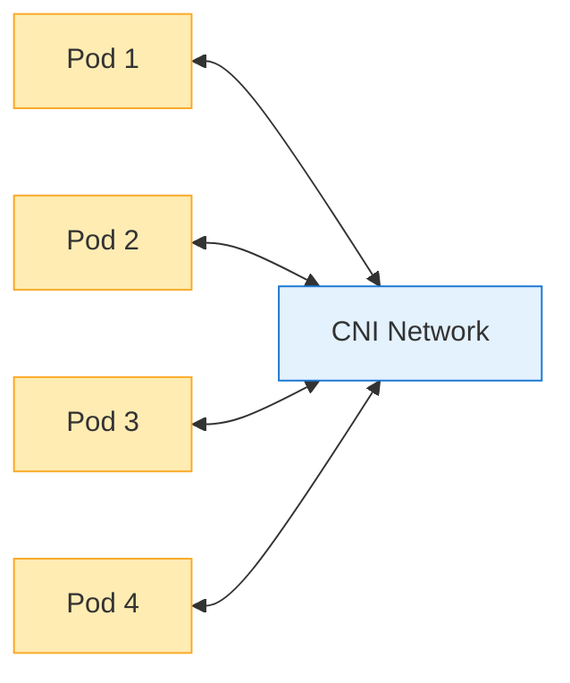

Node 间通信如下：

1. **Pod-to-Pod Communication**: Pods 通过 CNI plugins 提供的网络彼此通信。
   - 协议: 取决于应用程序（TCP、UDP 等）
   - 端口: 取决于应用程序
   - 安全性: 可通过 network policies 控制

2. **Cross-Node Pod Communication**: 不同 nodes 上的 pods 之间的通信由 CNI plugin 处理。
   - 协议: 取决于应用程序（TCP、UDP 等）
   - 端口: 取决于应用程序
   - 安全性: 可通过 network policies 控制

### 外部通信

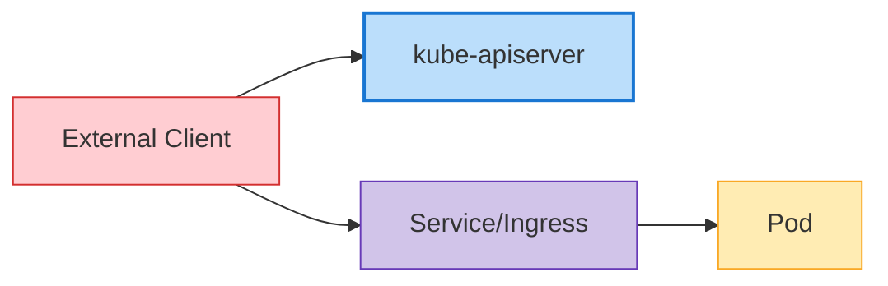

与外部实体的通信如下：

1. **Client 和 kube-apiserver**: 用户和外部系统通过 kube-apiserver 与 cluster 交互。
   - 协议: HTTPS
   - 端口: 6443/TCP (kube-apiserver)
   - 安全性: TLS certificates、tokens、用户认证等

2. **External Traffic and Services**: 外部流量通过 NodePort、LoadBalancer services 或 Ingress 访问 cluster 内的应用程序。
   - 协议: HTTP、HTTPS、TCP、UDP 等
   - 端口: 取决于 service 配置
   - 安全性: 取决于 ingress controller 和 service 配置

### 通信安全性

Kubernetes cluster 内通信的安全性通过以下方法实现：

1. **TLS Certificates**: control plane 组件之间的所有通信都使用 TLS certificates 加密。
2. **Authentication and Authorization**: 所有发往 API server 的请求都经过认证和授权流程。
3. **Network Policies**: 可以通过 network policies 限制 Pod-to-pod 通信。
4. **Encrypted Secrets**: 存储在 etcd 中的 Secrets 可以加密。

**API Server 通信安全配置示例**:
```yaml
apiVersion: apiserver.config.k8s.io/v1
kind: EncryptionConfiguration
resources:
  - resources:
    - secrets
    providers:
    - aescbc:
        keys:
        - name: key1
          secret: <base64-encoded-key>
    - identity: {}
```

### 高可用性 Cluster 配置

高可用性 (HA) Kubernetes clusters 旨在消除单点故障，并在不中断 service 的情况下继续运行。

### Control Plane 高可用性

control plane 的高可用性通过以下方法实现：

1. **多个 Control Plane Nodes**: 通常部署 3 个或 5 个 control plane nodes 以实现冗余
2. **etcd Cluster**: 部署由多个 etcd 实例组成的 cluster（通常为 3 个或 5 个）
3. **Load Balancer**: 在 API servers 前放置 load balancer 以分发流量

**高可用性 Control Plane 架构**:

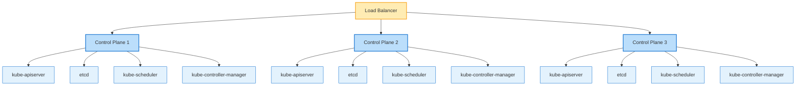

**etcd Cluster 配置**:

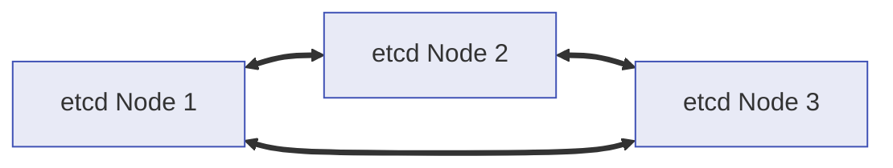

### Worker Node 高可用性

worker nodes 的高可用性通过以下方法实现：

1. **多个 Worker Nodes**: 将 workloads 分布到多个 worker nodes 上
2. **自动 Node 恢复**: 利用 cloud provider 的自动恢复功能
3. **Auto Scaling**: 通过 cluster autoscaler 自动扩缩 node
4. **多个 Availability Zones**: 跨多个 availability zones 部署 nodes

**Worker Node 分布式部署**:

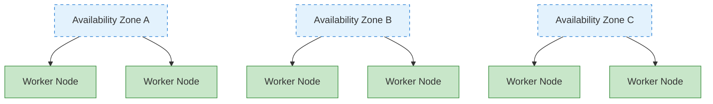

### 应用程序高可用性

应用程序的高可用性通过以下方法实现：

1. **ReplicaSet/Deployment**: 运行多个 pod 副本
2. **Pod 分布规则**: 通过 pod anti-affinity 将 pods 分布到多个 nodes 上
3. **PodDisruptionBudget**: 在计划中断期间确保最低可用性
4. **Service 和 Load Balancing**: 将流量分发到多个 pods

**Pod Anti-Affinity 示例**:
```yaml
apiVersion: apps/v1
kind: Deployment
metadata:
  name: web-server
spec:
  replicas: 3
  template:
    metadata:
      labels:
        app: web-server
    spec:
      affinity:
        podAntiAffinity:
          requiredDuringSchedulingIgnoredDuringExecution:
          - labelSelector:
              matchExpressions:
              - key: app
                operator: In
                values:
                - web-server
            topologyKey: "kubernetes.io/hostname"
      containers:
      - name: web-server
        image: nginx:1.21
```

**PodDisruptionBudget 示例**:
```yaml
apiVersion: policy/v1
kind: PodDisruptionBudget
metadata:
  name: web-server-pdb
spec:
  minAvailable: 2
  selector:
    matchLabels:
      app: web-server
```

### 灾难恢复策略

Kubernetes clusters 的灾难恢复策略通过以下方法实现：

1. **etcd Backup and Recovery**: 建立定期 etcd 数据备份和恢复流程
2. **Multi-Region Deployment**: 跨多个 regions 部署 clusters
3. **Cluster Federation**: 在 federation 中管理多个 clusters
4. **Continuous Backup**: 对应用程序数据进行持续备份

**etcd 备份脚本示例**:
```bash
#!/bin/bash
ETCDCTL_API=3 etcdctl snapshot save /backup/etcd-snapshot-$(date +%Y%m%d-%H%M%S).db \
  --endpoints=https://127.0.0.1:2379 \
  --cacert=/etc/kubernetes/pki/etcd/ca.crt \
  --cert=/etc/kubernetes/pki/etcd/server.crt \
  --key=/etc/kubernetes/pki/etcd/server.key
```

**etcd 恢复脚本示例**:
```bash
#!/bin/bash
# Stop cluster
systemctl stop kubelet
docker stop $(docker ps -q)

# Recover etcd data
ETCDCTL_API=3 etcdctl snapshot restore /backup/etcd-snapshot.db \
  --data-dir=/var/lib/etcd-restore \
  --name=master \
  --initial-cluster=master=https://127.0.0.1:2380 \
  --initial-cluster-token=etcd-cluster \
  --initial-advertise-peer-urls=https://127.0.0.1:2380

# Replace etcd directory with recovered data
mv /var/lib/etcd /var/lib/etcd.old
mv /var/lib/etcd-restore /var/lib/etcd

# Restart cluster
systemctl start kubelet
```

## Cluster Networking

Kubernetes networking 支持 pods、services 与外部世界之间的通信。Kubernetes networking model 假设每个 pod 都有唯一的 IP address，并且 pods 之间可以在没有 NAT 的情况下相互通信。

### Networking Model

Kubernetes networking model 具有以下要求：

1. **Pod-to-Pod Communication**: 所有 pods 必须能够在没有 NAT 的情况下与所有其他 pods 通信
2. **Node-to-Pod Communication**: Nodes 必须能够在没有 NAT 的情况下与所有 pods 通信
3. **Pod-to-External Communication**: Pods 必须能够与外部世界通信（通常使用 NAT）

### CNI (Container Network Interface)

CNI 是在 Kubernetes 中实现 networking 的标准接口。有多种 CNI plugins，每种都有不同的功能和性能特征。

**主要 CNI Plugins**:

1. **Calico**: 基于 BGP 的 networking，支持 network policy
   - 特性: 高性能、network policies、加密、eBPF 支持
   - 使用场景: 大型 clusters、注重安全的环境

2. **Cilium**: 基于 eBPF 的 networking 和安全
   - 特性: L3-L7 安全策略、高性能、可观测性
   - 使用场景: Microservices、注重安全的环境

3. **Flannel**: 简单的 overlay network
   - 特性: 设置简单、轻量级
   - 使用场景: 小型 clusters、开发环境

4. **Weave Net**: 多主机 container networking
   - 特性: 加密、network policies、multi-cloud
   - 使用场景: Hybrid cloud、multi-cloud

**CNI 配置示例 (Calico)**:
```yaml
apiVersion: v1
kind: ConfigMap
metadata:
  name: calico-config
  namespace: kube-system
data:
  calico_backend: "bird"
  cni_network_config: |-
    {
      "name": "k8s-pod-network",
      "cniVersion": "0.3.1",
      "plugins": [
        {
          "type": "calico",
          "log_level": "info",
          "datastore_type": "kubernetes",
          "nodename": "__KUBERNETES_NODE_NAME__",
          "mtu": __CNI_MTU__,
          "ipam": {
            "type": "calico-ipam"
          },
          "policy": {
            "type": "k8s"
          },
          "kubernetes": {
            "kubeconfig": "__KUBECONFIG_FILEPATH__"
          }
        },
        {
          "type": "portmap",
          "snat": true,
          "capabilities": {"portMappings": true}
        }
      ]
    }
```

### Service Networking

Kubernetes Services 为一组 pods 提供稳定的 endpoints。Services 有多种类型，包括 ClusterIP、NodePort、LoadBalancer 和 ExternalName。

**Service Networking 组件**:

1. **ClusterIP**: 仅可在 cluster 内访问的虚拟 IP
2. **kube-proxy**: 将发往 service IPs 的流量路由到 pods
3. **CoreDNS**: 用于 service discovery 的 DNS service

**Service Networking 流程**:
```
Client -> Service (ClusterIP) -> kube-proxy -> Pod
```

**Service 示例**:
```yaml
apiVersion: v1
kind: Service
metadata:
  name: my-service
spec:
  selector:
    app: my-app
  ports:
  - port: 80
    targetPort: 8080
  type: ClusterIP
```

### Ingress Networking

Ingress 管理从 cluster 外部到 cluster 内 services 的 HTTP 和 HTTPS 路由。Ingress controllers 实现 ingress resources。

**主要 Ingress Controllers**:
1. **NGINX Ingress Controller**: 基于 NGINX 的 ingress controller
2. **AWS ALB Ingress Controller**: 基于 AWS Application Load Balancer
3. **Traefik**: 云原生 edge router
4. **HAProxy Ingress**: 基于 HAProxy 的 ingress controller

**Ingress Networking 流程**:
```
Client -> Ingress Controller -> Service -> Pod
```

**Ingress 示例**:
```yaml
apiVersion: networking.k8s.io/v1
kind: Ingress
metadata:
  name: my-ingress
  annotations:
    nginx.ingress.kubernetes.io/rewrite-target: /
spec:
  ingressClassName: nginx
  rules:
  - host: example.com
    http:
      paths:
      - path: /app
        pathType: Prefix
        backend:
          service:
            name: my-service
            port:
              number: 80
```

### Network Policies

Network policies 提供了一种控制 pods 之间通信的方式。默认情况下，所有 pods 都可以相互通信，但 network policies 可以对此进行限制。

**Network Policy 示例**:
```yaml
apiVersion: networking.k8s.io/v1
kind: NetworkPolicy
metadata:
  name: db-network-policy
spec:
  podSelector:
    matchLabels:
      role: db
  policyTypes:
  - Ingress
  - Egress
  ingress:
  - from:
    - podSelector:
        matchLabels:
          role: frontend
    ports:
    - protocol: TCP
      port: 3306
  egress:
  - to:
    - podSelector:
        matchLabels:
          role: monitoring
    ports:
    - protocol: TCP
      port: 9090
```

### 网络故障排查

用于排查 Kubernetes networking 问题的常用工具和命令：

1. **ping, traceroute**: 基本网络连通性测试
2. **tcpdump**: 网络包捕获和分析
3. **netstat, ss**: 检查网络连接状态
4. **nslookup, dig**: DNS lookup 测试
5. **kubectl exec**: 在 pods 内执行网络命令

**网络调试示例**:
```bash
# Test network connectivity within a pod
kubectl exec -it <pod-name> -- ping <target-ip>

# Test DNS lookup within a pod
kubectl exec -it <pod-name> -- nslookup <service-name>

# Capture network packets within a pod
kubectl exec -it <pod-name> -- tcpdump -i eth0 -n

# Check service endpoints
kubectl get endpoints <service-name>
```

## Cluster Storage

Kubernetes storage 为容器化应用程序提供数据持久性。Kubernetes 提供多种 storage 选项和抽象，帮助应用程序高效使用 storage。

### Storage Architecture

Kubernetes storage architecture 由以下组件组成：

1. **Volumes**: 可挂载到 pods 内 containers 的目录
2. **Persistent Volumes (PV)**: cluster 中的 storage resources
3. **Persistent Volume Claims (PVC)**: 用户的 storage 请求
4. **Storage Classes**: 定义 storage 的“classes”或类型
5. **CSI (Container Storage Interface)**: 与 storage systems 对接的标准接口

**Storage Architecture 流程**:

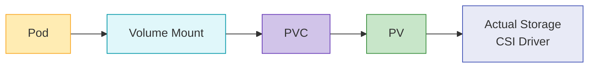

### Volume 类型

Kubernetes 支持多种类型的 volumes：

1. **Ephemeral Volumes**:
   - **emptyDir**: 以空目录开始，并在 pod 被删除时删除
   - **configMap**: 将 ConfigMap 作为 volume 挂载
   - **secret**: 将 Secret 作为 volume 挂载
   - **downwardAPI**: 将 pod 和 container 信息作为文件暴露

2. **Persistent Volumes**:
   - **awsElasticBlockStore**: AWS EBS volumes
   - **azureDisk**: Azure Disk
   - **gcePersistentDisk**: GCE Persistent Disk
   - **nfs**: NFS volumes
   - **csi**: 通过 CSI drivers 提供的 volumes

**Volume 示例**:
```yaml
apiVersion: v1
kind: Pod
metadata:
  name: test-pd
spec:
  containers:
  - name: test-container
    image: nginx
    volumeMounts:
    - mountPath: /test-pd
      name: test-volume
  volumes:
  - name: test-volume
    persistentVolumeClaim:
      claimName: test-pvc
```

### Persistent Volumes 和 Claims

Persistent Volumes (PV) 是 cluster 中的 storage resources，可由管理员预置，也可通过 storage classes 动态预置。Persistent Volume Claims (PVC) 是用户的 storage 请求。

**Persistent Volume 示例**:
```yaml
apiVersion: v1
kind: PersistentVolume
metadata:
  name: pv-example
spec:
  capacity:
    storage: 10Gi
  accessModes:
    - ReadWriteOnce
  persistentVolumeReclaimPolicy: Retain
  storageClassName: standard
  awsElasticBlockStore:
    volumeID: vol-0123456789abcdef0
    fsType: ext4
```

**Persistent Volume Claim 示例**:
```yaml
apiVersion: v1
kind: PersistentVolumeClaim
metadata:
  name: pvc-example
spec:
  accessModes:
    - ReadWriteOnce
  resources:
    requests:
      storage: 5Gi
  storageClassName: standard
```

### Storage Classes

Storage classes 描述管理员提供的 storage “classes”。当请求 PVCs 时，storage classes 允许动态预置 PVs。

**Storage Class 示例**:
```yaml
apiVersion: storage.k8s.io/v1
kind: StorageClass
metadata:
  name: standard
provisioner: kubernetes.io/aws-ebs
parameters:
  type: gp3
  fsType: ext4
reclaimPolicy: Delete
allowVolumeExpansion: true
```

### CSI (Container Storage Interface)

CSI 在 Kubernetes 和 storage systems 之间提供标准接口。通过 CSI，storage providers 可以在不修改 Kubernetes 代码的情况下开发自己的 storage drivers。

**CSI 架构**:

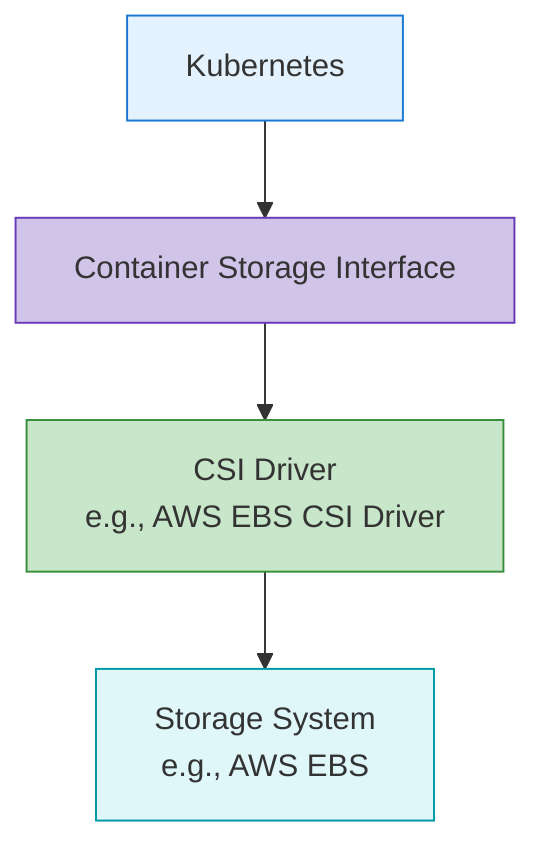

**CSI Driver 部署示例**:
```yaml
apiVersion: storage.k8s.io/v1
kind: StorageClass
metadata:
  name: ebs-sc
provisioner: ebs.csi.aws.com
parameters:
  type: gp3
  fsType: ext4
  encrypted: "true"
volumeBindingMode: WaitForFirstConsumer
```

### Storage 最佳实践

使用 Kubernetes storage 的最佳实践：

1. **选择合适的 Storage 类型**: 选择与 workload 特征匹配的 storage 类型
2. **使用动态预置**: 通过 storage classes 利用动态预置
3. **选择合适的 Access Modes**: 选择与 workload 需求匹配的 access modes
4. **设置 Resource Requests 和 Limits**: 请求合适的 storage 容量
5. **建立备份和恢复策略**: 为关键数据准备备份和恢复策略
6. **监控 Storage**: 监控 storage 使用情况和性能

## Cluster Scalability

Kubernetes cluster scalability 指 cluster 处理不断增长的负载和需求的能力。Scalability 可以通过 horizontal scaling（横向扩展，scale out）和 vertical scaling（纵向扩展，scale up）实现。

### Cluster Scale Limits

Kubernetes clusters 具有以下规模限制：

1. **Number of Nodes**: 最多 5,000 个 nodes
2. **Number of Pods**: 每个 cluster 最多 150,000 个 pods
3. **Pods per Node**: 每个 node 最多 110 个 pods（默认）
4. **Number of Services**: 每个 cluster 最多 10,000 个 services
5. **Containers per Pod**: 每个 pod 最多 20 个 containers

这些限制可能因 Kubernetes 版本和 cluster 配置而异。

### Horizontal Scaling

Horizontal scaling 通过添加更多 nodes 来增加 cluster 容量。

**Node Auto Scaling**:
Kubernetes Cluster Autoscaler 会根据 workload 需求自动调整 nodes 数量。

```yaml
# AWS Auto Scaling Group tags example
tags:
  k8s.io/cluster-autoscaler/enabled: "true"
  k8s.io/cluster-autoscaler/my-cluster: "owned"
```

**Cluster Autoscaler 部署示例**:
```yaml
apiVersion: apps/v1
kind: Deployment
metadata:
  name: cluster-autoscaler
  namespace: kube-system
spec:
  replicas: 1
  selector:
    matchLabels:
      app: cluster-autoscaler
  template:
    metadata:
      labels:
        app: cluster-autoscaler
    spec:
      containers:
      - name: cluster-autoscaler
        image: k8s.gcr.io/autoscaling/cluster-autoscaler:v1.24.0
        command:
        - ./cluster-autoscaler
        - --cloud-provider=aws
        - --nodes=2:10:my-asg-group
        - --scale-down-unneeded-time=10m
```

**Karpenter**:
Karpenter 是 AWS 开发的新型 node auto-scaling 工具，提供更快、更高效的 node provisioning。

```yaml
apiVersion: karpenter.sh/v1
kind: NodePool
metadata:
  name: default
spec:
  template:
    spec:
      requirements:
        - key: karpenter.sh/capacity-type
          operator: In
          values: ["spot", "on-demand"]
      nodeClassRef:
        name: default-class
  limits:
    cpu: 1000
    memory: 1000Gi
---
apiVersion: karpenter.k8s.aws/v1
kind: EC2NodeClass
metadata:
  name: default-class
spec:
  subnetSelector:
    karpenter.sh/discovery: my-cluster
  securityGroupSelector:
    karpenter.sh/discovery: my-cluster
```

### Vertical Scaling

Vertical scaling 增加现有 nodes 的资源（CPU、内存）。

**Vertical Pod Autoscaler (VPA)**:
VPA 会自动调整 pods 的 CPU 和内存 requests。

```yaml
apiVersion: autoscaling.k8s.io/v1
kind: VerticalPodAutoscaler
metadata:
  name: my-app-vpa
spec:
  targetRef:
    apiVersion: "apps/v1"
    kind: Deployment
    name: my-app
  updatePolicy:
    updateMode: "Auto"
  resourcePolicy:
    containerPolicies:
    - containerName: '*'
      minAllowed:
        cpu: 100m
        memory: 50Mi
      maxAllowed:
        cpu: 1
        memory: 500Mi
```

### 应用程序扩缩

应用层扩缩通过调整 pod 副本数量实现。

**Horizontal Pod Autoscaler (HPA)**:
HPA 会根据 CPU 利用率或自定义指标自动调整 pod 副本数量。

```yaml
apiVersion: autoscaling/v2
kind: HorizontalPodAutoscaler
metadata:
  name: my-app-hpa
spec:
  scaleTargetRef:
    apiVersion: apps/v1
    kind: Deployment
    name: my-app
  minReplicas: 2
  maxReplicas: 10
  metrics:
  - type: Resource
    resource:
      name: cpu
      target:
        type: Utilization
        averageUtilization: 80
```

**KEDA (Kubernetes Event-driven Autoscaling)**:
KEDA 提供事件驱动的 autoscaling，可基于各种事件源进行扩缩。

```yaml
apiVersion: keda.sh/v1alpha1
kind: ScaledObject
metadata:
  name: my-app-scaledobject
spec:
  scaleTargetRef:
    name: my-app
  minReplicaCount: 0
  maxReplicaCount: 10
  triggers:
  - type: kafka
    metadata:
      bootstrapServers: kafka.svc:9092
      consumerGroup: my-group
      topic: my-topic
      lagThreshold: "10"
```

### Scalability 最佳实践

Kubernetes cluster scalability 的最佳实践：

1. **设置 Resource Requests 和 Limits**: 为所有 pods 设置合适的 resource requests 和 limits
2. **Node Pool 策略**: 为不同 workload 特征配置多个 node pools
3. **配置 Auto Scaling**: 正确配置 Cluster Autoscaler、HPA、VPA
4. **高效的 Pod 放置**: 利用 node affinity、pod affinity/anti-affinity
5. **Cluster 监控**: 持续监控资源使用情况和性能
6. **负载测试**: 定期进行负载测试以验证扩缩策略

## Cluster Security

Kubernetes cluster security 必须在多个层面实现。这包括认证、授权、network policies、pod security 等。

### Authentication

对 Kubernetes API server 访问进行认证的方法：

1. **X.509 Certificates**: 使用 TLS client certificates 进行认证
2. **Service Account Tokens**: pods 内访问 API server 的 tokens
3. **OpenID Connect (OIDC)**: 通过外部 identity providers 进行认证
4. **Webhook Token Authentication**: 通过外部认证服务进行认证
5. **Authentication Proxy**: 通过 authentication proxies 进行认证

**kubeconfig 示例**:
```yaml
apiVersion: v1
kind: Config
clusters:
- name: my-cluster
  cluster:
    certificate-authority-data: <CA-DATA>
    server: https://api.my-cluster.example.com
users:
- name: admin
  user:
    client-certificate-data: <CERT-DATA>
    client-key-data: <KEY-DATA>
contexts:
- name: my-context
  context:
    cluster: my-cluster
    user: admin
current-context: my-context
```

### Authorization

控制已认证用户操作的方法：

1. **RBAC (Role-Based Access Control)**: 基于角色的访问控制
2. **ABAC (Attribute-Based Access Control)**: 基于属性的访问控制
3. **Node Authorization**: 针对 nodes 的特殊授权
4. **Webhook Authorization**: 通过外部服务进行授权

**RBAC 示例**:
```yaml
# Role definition
apiVersion: rbac.authorization.k8s.io/v1
kind: Role
metadata:
  namespace: default
  name: pod-reader
rules:
- apiGroups: [""]
  resources: ["pods"]
  verbs: ["get", "watch", "list"]

# Role binding
apiVersion: rbac.authorization.k8s.io/v1
kind: RoleBinding
metadata:
  name: read-pods
  namespace: default
subjects:
- kind: User
  name: jane
  apiGroup: rbac.authorization.k8s.io
roleRef:
  kind: Role
  name: pod-reader
  apiGroup: rbac.authorization.k8s.io
```

### Network Security

保护 cluster 内网络流量的方法：

1. **Network Policies**: 控制 pod-to-pod 通信
2. **Encrypted Communication**: 通过 TLS 加密通信
3. **Service Mesh**: 通过 Istio、Linkerd 等实现高级网络安全

**Network Policy 示例**:
```yaml
apiVersion: networking.k8s.io/v1
kind: NetworkPolicy
metadata:
  name: default-deny-all
spec:
  podSelector: {}
  policyTypes:
  - Ingress
  - Egress
```

### Pod Security

在 pod 级别的安全实现：

1. **Pod Security Context**: pod 和 container 级别的安全设置
2. **Pod Security Standards**: 定义 pod 安全要求
3. **seccomp Profiles**: 系统调用限制
4. **AppArmor/SELinux**: 强制访问控制

**Pod Security Context 示例**:
```yaml
apiVersion: v1
kind: Pod
metadata:
  name: security-context-pod
spec:
  securityContext:
    runAsUser: 1000
    runAsGroup: 3000
    fsGroup: 2000
  containers:
  - name: app
    image: myapp:1.0
    securityContext:
      allowPrivilegeEscalation: false
      capabilities:
        drop:
        - ALL
```

### Secret Management

安全管理敏感信息的方法：

1. **Kubernetes Secrets**: 使用基本 secret resources
2. **Encrypted etcd**: 加密存储在 etcd 中的 secrets
3. **External Secret Management**: 利用 HashiCorp Vault、AWS Secrets Manager 等

**Encrypted etcd 配置示例**:
```yaml
apiVersion: apiserver.config.k8s.io/v1
kind: EncryptionConfiguration
resources:
  - resources:
    - secrets
    providers:
    - aescbc:
        keys:
        - name: key1
          secret: <base64-encoded-key>
    - identity: {}
```

### Security 最佳实践

Kubernetes cluster security 的最佳实践：

1. **最小权限原则**: 只授予必要的最低权限
2. **定期更新**: 定期更新 cluster 和组件
3. **网络隔离**: 通过 network policies 限制 pod-to-pod 通信
4. **镜像安全**: 仅使用可信镜像，并实施漏洞扫描
5. **Audit Logging**: 为 cluster 活动启用 audit logs
6. **Security Benchmarks**: 遵循 CIS benchmarks 等安全标准

## Cluster Upgrades

Kubernetes cluster upgrades 对于应用新功能、安全补丁和 bug 修复是必要的。Upgrades 必须仔细规划并执行。

### Upgrade Strategies

Kubernetes cluster upgrades 的策略：

1. **Blue/Green Upgrade**: 单独创建一个新版本 cluster 并迁移 workloads
2. **In-Place Upgrade**: 直接升级现有 cluster
3. **Canary Upgrade**: 先只升级部分 nodes 进行验证

### Upgrade Order

Kubernetes cluster upgrades 的典型顺序：

1. **Control Plane Upgrade**: kube-apiserver、kube-controller-manager、kube-scheduler、etcd
2. **DNS and CNI Upgrade**: CoreDNS、CNI plugins 以及其他主要 add-ons
3. **Worker Node Upgrade**: 依次升级 worker nodes

**kubeadm Upgrade 示例**:
```bash
# Control plane upgrade
kubeadm upgrade plan
kubeadm upgrade apply v1.24.0

# Worker node upgrade
kubectl drain <node-name> --ignore-daemonsets
# Upgrade kubelet and kubeadm on the node
apt-get update && apt-get install -y kubelet=1.24.0-00 kubeadm=1.24.0-00
kubeadm upgrade node
systemctl restart kubelet
kubectl uncordon <node-name>
```

### Upgrade 注意事项

升级 Kubernetes clusters 时的注意事项：

1. **API Changes**: 检查新版本中的 API changes
2. **Feature Gates**: 检查新的 feature gates 和默认值变化
3. **Dependencies**: 检查 CNI、CSI 等依赖组件的兼容性
4. **Downtime**: 规划升级期间预期的 downtime
5. **Rollback Plan**: 建立发生问题时的 rollback plan

### Upgrade 最佳实践

Kubernetes cluster upgrades 的最佳实践：

1. **先在测试环境测试**: 生产升级前先在测试环境验证
2. **渐进式升级**: 每次升级一个 minor version
3. **备份**: 升级前备份 etcd 数据
4. **文档记录**: 记录升级流程和结果
5. **监控**: 在升级期间和升级后监控 cluster 状态
6. **Upgrade Window**: 在低流量时段执行 upgrades

## Amazon EKS Cluster Architecture

Amazon EKS (Elastic Kubernetes Service) 是 AWS 提供的 managed Kubernetes service。EKS 提供所有基本 Kubernetes 功能，同时增加了与 AWS services 的集成以及管理便利性。

### EKS Architecture Overview

EKS clusters 由以下组件组成：

1. **EKS Control Plane**: 由 AWS 管理的 Kubernetes control plane
2. **EKS Nodes**: 由用户管理的 worker nodes（EC2 instances）
3. **EKS Managed Node Groups**: 由 AWS 管理的 node groups
4. **EKS Fargate Profiles**: Serverless container execution environment
5. **VPC and Subnets**: 用于 cluster networking 的 VPC 和 subnets

**EKS Architecture Diagram**:

```mermaid
graph TD
    classDef aws fill:#e8f5e9,stroke:#2e7d32,stroke-width:1px;
    classDef eks fill:#fce4ec,stroke:#c2185b,stroke-width:1px;
    classDef controlplane fill:#bbdefb,stroke:#1976d2,stroke-width:2px;
    classDef nodes fill:#c8e6c9,stroke:#388e3c,stroke-width:1px;
    classDef services fill:#d1c4e9,stroke:#673ab7,stroke-width:1px;
    classDef network fill:#f3e5f5,stroke:#7b1fa2,stroke-width:1px;

    AWS[AWS Cloud] --> CP[EKS Control Plane<br>AWS Managed]
    AWS --> WN[Worker Nodes]
    AWS --> AWSS[AWS Services]
    AWS --> VPC[VPC & Networking]

    CP --> API[kube-apiserver]
    CP --> ETCD[etcd]
    CP --> SCHED[kube-scheduler]
    CP --> CTRL[kube-controller-manager]

    WN --> NG1[Node Group 1<br>EC2 instances]
    WN --> NG2[Node Group 2<br>EC2 instances]
    WN --> FG[Fargate Profile<br>Serverless]

    AWSS --> IAM[IAM]
    AWSS --> ECR[ECR]
    AWSS --> ELB[ELB/ALB/NLB]
    AWSS --> EBS[EBS/EFS/FSx]
    AWSS --> CW[CloudWatch]

    VPC --> VPCM[VPC]
    VPC --> SN[Subnets]
    VPC --> SG[Security Groups]
    VPC --> RT[Route Tables]
    VPC --> CNI[VPC CNI]

    class AWS aws;
    class CP controlplane;
    class WN nodes;
    class AWSS,IAM,ECR,ELB,EBS,CW services;
    class VPC,VPCM,SN,SG,RT,CNI network;
    class API,ETCD,SCHED,CTRL,NG1,NG2,FG eks;
```

### EKS Control Plane

EKS control plane 由 AWS 管理，并跨多个 availability zones 提供高可用性。

**关键特性**:
1. **Managed Service**: AWS 管理 control plane 维护和 upgrades
2. **High Availability**: 跨多个 availability zones 部署
3. **Auto Scaling**: 根据负载自动扩缩
4. **Security**: 与 AWS security services 集成

### EKS Node 类型

EKS 支持多种类型的 nodes：

1. **Self-Managed Nodes**: 用户直接管理 EC2 instances
2. **Managed Node Groups**: AWS 管理 node 生命周期
3. **Fargate**: Serverless container execution environment
4. **Bottlerocket Nodes**: 针对 container workloads 优化的 OS

**Managed Node Group 示例**:
```yaml
apiVersion: eksctl.io/v1alpha5
kind: ClusterConfig
metadata:
  name: my-cluster
  region: ap-northeast-2
managedNodeGroups:
  - name: ng-1
    instanceType: m5.large
    desiredCapacity: 3
    minSize: 2
    maxSize: 5
    volumeSize: 80
    privateNetworking: true
    labels:
      role: worker
    tags:
      nodegroup-role: worker
    iam:
      withAddonPolicies:
        autoScaler: true
        albIngress: true
```

### EKS Networking

EKS networking 基于 Amazon VPC，并包括以下组件：

1. **VPC CNI Plugin**: 与 AWS VPC networking 集成
2. **Security Groups**: node 和 pod 级别的网络安全
3. **Load Balancer Integration**: 与 ELB、ALB、NLB 集成
4. **VPC Endpoints**: 与 AWS services 的私有通信

**VPC CNI 配置示例**:
```yaml
apiVersion: v1
kind: ConfigMap
metadata:
  name: amazon-vpc-cni
  namespace: kube-system
data:
  enable-network-policy: "true"
  enable-pod-eni: "true"
  warm-ip-target: "5"
  minimum-ip-target: "10"
```

### EKS Storage

EKS 与多种 AWS storage services 集成：

1. **EBS CSI Driver**: Amazon EBS volume 管理
2. **EFS CSI Driver**: Amazon EFS file system 管理
3. **FSx for Lustre CSI Driver**: FSx for Lustre file system 管理
4. **S3**: Object storage

**EBS CSI Driver 示例**:
```yaml
apiVersion: storage.k8s.io/v1
kind: StorageClass
metadata:
  name: ebs-sc
provisioner: ebs.csi.aws.com
parameters:
  type: gp3
  encrypted: "true"
volumeBindingMode: WaitForFirstConsumer
```

### EKS Security

EKS 与 AWS security services 集成，以提供强安全性：

1. **IAM Integration**: AWS IAM 与 Kubernetes RBAC 集成
2. **VPC Security**: VPC security groups 和 network ACLs
3. **AWS KMS**: 用于 secret encryption 的 KMS 集成
4. **AWS WAF**: Web application firewall 集成
5. **AWS Shield**: DDoS 保护

**IAM Role Service Account 示例**:
```yaml
apiVersion: v1
kind: ServiceAccount
metadata:
  name: s3-reader
  namespace: default
  annotations:
    eks.amazonaws.com/role-arn: arn:aws:iam::123456789012:role/s3-reader-role
```

### EKS Monitoring and Logging

EKS 与 AWS monitoring 和 logging services 集成：

1. **CloudWatch Container Insights**: Container 监控
2. **CloudWatch Logs**: 日志收集和分析
3. **X-Ray**: 分布式追踪
4. **Prometheus and Grafana**: 开源 monitoring tool 集成

**CloudWatch Container Insights 示例**:
```yaml
apiVersion: v1
kind: Namespace
metadata:
  name: amazon-cloudwatch
---
apiVersion: apps/v1
kind: DaemonSet
metadata:
  name: cloudwatch-agent
  namespace: amazon-cloudwatch
spec:
  selector:
    matchLabels:
      name: cloudwatch-agent
  template:
    metadata:
      labels:
        name: cloudwatch-agent
    spec:
      containers:
      - name: cloudwatch-agent
        image: amazon/cloudwatch-agent:1.247347.6b250880
        # ... additional configuration
```

### EKS 成本优化

优化 EKS cluster 成本的方法：

1. **Spot Instances**: 利用成本更低的 Spot instances
2. **Fargate**: 通过 serverless container execution 降低空闲资源成本
3. **Auto Scaling**: 通过 cluster autoscaler 实现资源优化
4. **Graviton Processors**: 利用基于 ARM 的 Graviton instances
5. **Resource Request Optimization**: 设置合适的 resource requests 和 limits

**Spot Instance Node Group 示例**:
```yaml
apiVersion: eksctl.io/v1alpha5
kind: ClusterConfig
metadata:
  name: my-cluster
  region: ap-northeast-2
managedNodeGroups:
  - name: spot-ng
    instanceTypes: ["m5.large", "m5a.large", "m5d.large", "m5ad.large"]
    spot: true
    desiredCapacity: 3
    minSize: 2
    maxSize: 10
```

## 了解更多

要加深对本文档中介绍的 cluster architecture 的理解，请参考以下主题：

- [Kubernetes 简介](../basics/04-kubernetes-introduction.md) - Kubernetes 的基本概念和历史
- [Pods 和 Workloads](./02-pods-and-workloads.md) - 管理 cluster 中运行的 workloads
- [Services 和 Networking](./03-services-networking.md) - cluster 内的 networking 配置
- [Scheduling, Preemption, and Eviction](./08-scheduling-preemption-eviction.md) - pods 如何放置到 nodes 上
- [Cluster Administration](./09-cluster-administration.md) - Cluster 运行和管理
- [EKS 简介](../eks/01-eks-introduction.md) - Amazon EKS service 概览
- [EKS Cluster 创建](../eks/02-eks-cluster-creation-part1.md) - 如何创建 EKS clusters

### 动手实践和进阶学习

- [Kubernetes 官方教程](https://kubernetes.io/docs/tutorials/) - 通过动手实践学习
- [Kubernetes The Hard Way](https://github.com/kelseyhightower/kubernetes-the-hard-way) - 手动构建 Kubernetes cluster
- [Cilium Networking](../networking/cilium/01-introduction.md) - 高级 networking 和安全功能

## 结论

在本文档中，我们了解了 Kubernetes clusters 的架构、主要组件以及它们如何协同工作。我们还介绍了 cluster networking、storage、scalability、security 和 upgrades 等重要方面，以及 Amazon EKS clusters 的架构。

理解 Kubernetes cluster architecture 是有效进行 cluster 设计、部署和运行的基础。掌握这些知识后，你可以构建稳定、可扩展且安全性增强的 Kubernetes 环境。

## 测验

要测试你在本章学到的内容，请尝试 [Cluster Architecture 测验](../quizzes/core/01-cluster-architecture-quiz.md)。

## 参考资料

- [Kubernetes 官方文档](https://kubernetes.io/docs/)
- [Amazon EKS 文档](https://docs.aws.amazon.com/eks/)
- [Kubernetes The Hard Way](https://github.com/kelseyhightower/kubernetes-the-hard-way)
- [Kubernetes Patterns](https://www.oreilly.com/library/view/kubernetes-patterns/9781492050278/)
- [Kubernetes Up & Running](https://www.oreilly.com/library/view/kubernetes-up-and/9781492046523/)
- [Kubernetes Best Practices](https://www.oreilly.com/library/view/kubernetes-best-practices/9781492056461/)
