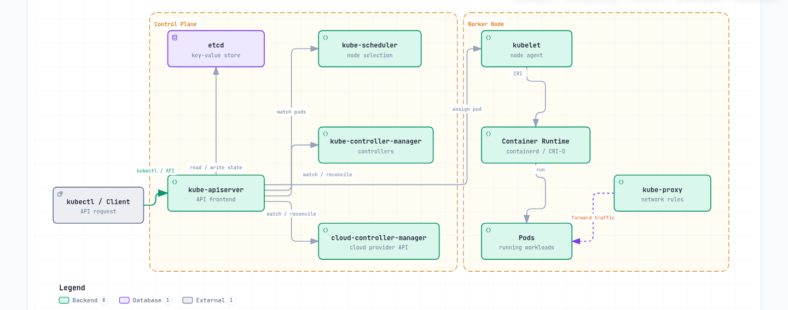
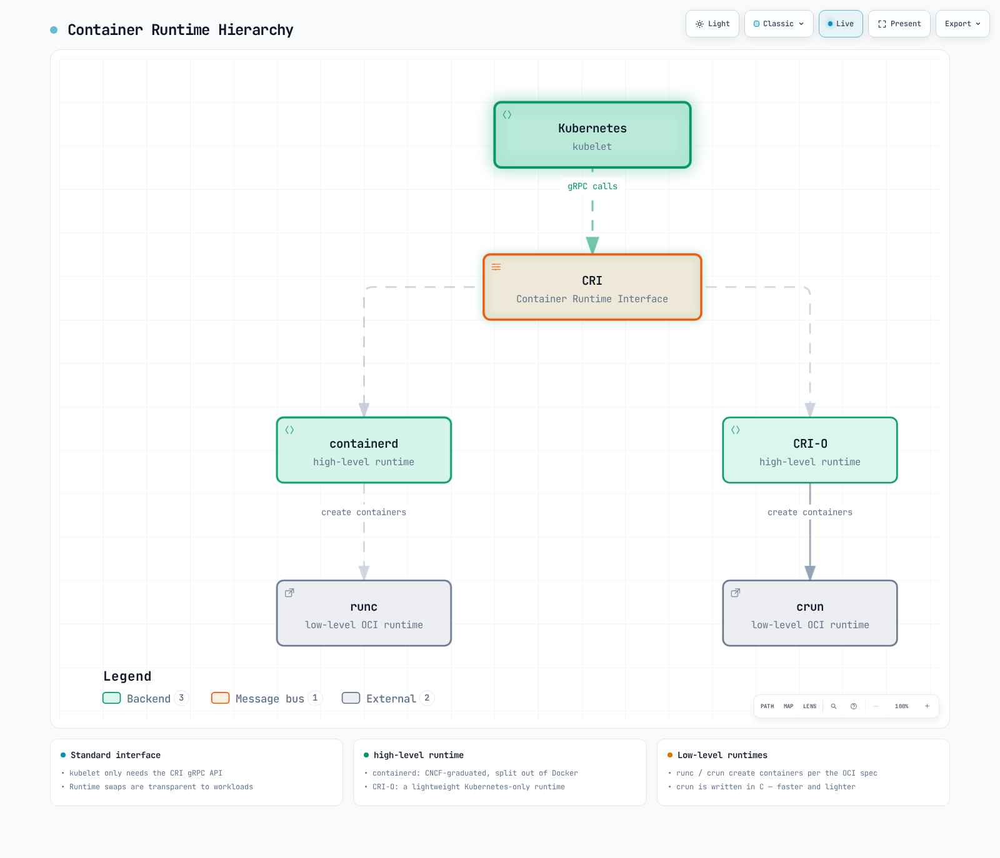
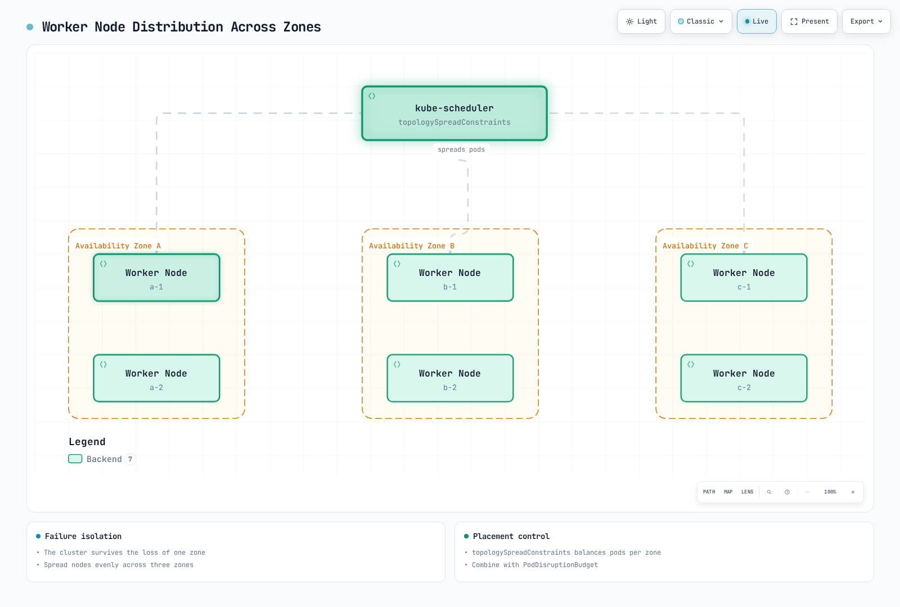
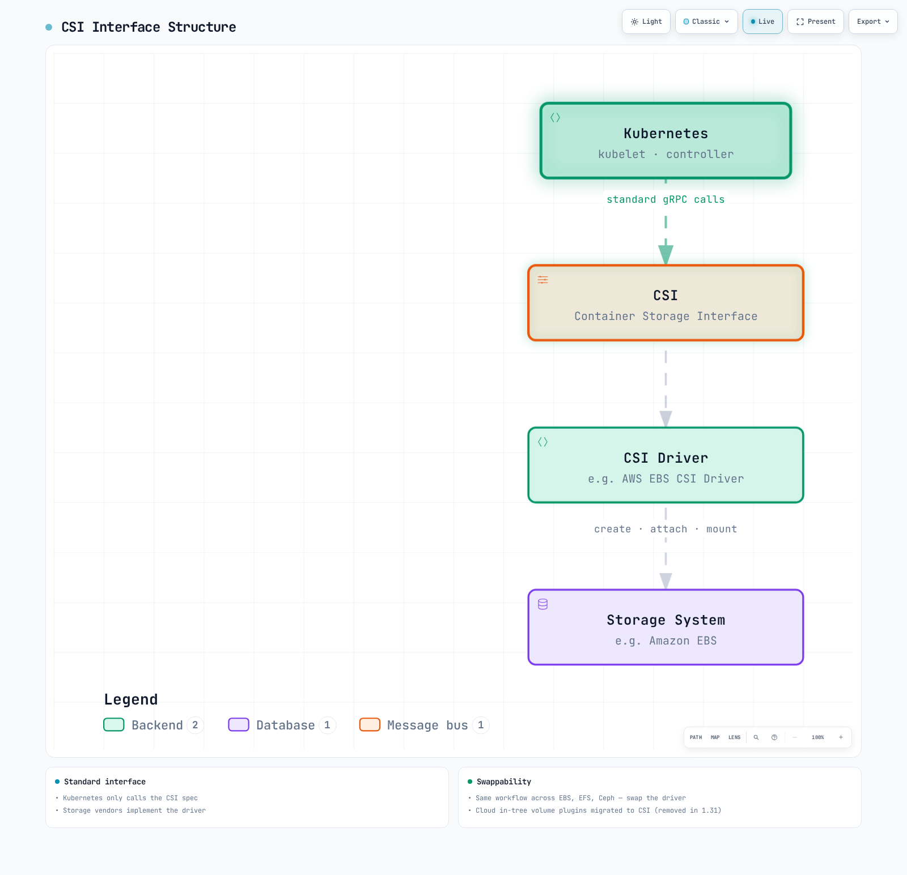

# 集群架构

> **支持的版本**：Kubernetes 1.35、1.36、1.37
> **最后更新**：2026 年 10 月 16 日

版本标题指的是上游 Kubernetes。项目维护最近三个次要版本（1.35–1.37）的发布分支。上游 1.34 处于维护模式，在其生命周期于 **2026 年 10 月 27 日** 结束之前，仍会收到补丁版本；这与其在 EKS 上的 AWS 支持结束日期不同。

截至 2026 年 10 月 12 日，EKS 标准支持涵盖 1.34–1.37；EKS 1.37 于 2026 年 10 月 1 日开始提供。在选择版本之前，请查看 [Kubernetes 发布状态](https://kubernetes.io/releases/)和 [EKS 生命周期](https://docs.aws.amazon.com/eks/latest/userguide/kubernetes-versions.html)。

下面的组件命令展示的是自行管理的集群；EKS 会管理其控制平面。镜像标签和基础设施 ID 均为示例：请选择兼容且仍受维护的镜像，并在使用前替换占位符。

## 实验环境设置

若要练习本文档中的概念，需要以下工具和环境：

### 必需工具
- 与 API 服务器的次要版本相差不超过一个版本的 kubectl
- 可正常工作的 Kubernetes 集群（EKS、minikube、kind 等）

### 本地开发环境设置

```bash
# Install minikube (for local development)
curl -LO https://storage.googleapis.com/minikube/releases/latest/minikube-linux-amd64
sudo install minikube-linux-amd64 /usr/local/bin/minikube

# Start cluster
minikube start

# Check cluster status
kubectl cluster-info

# Check control plane components
kubectl get pods -n kube-system
```

## 集群架构概览

> **核心概念**：Kubernetes 集群由控制平面和工作节点组成，各自包含多个执行特定职责的组件。

Kubernetes 集群由一组用于运行容器化应用程序的节点（虚拟机或物理机）组成。集群大致分为控制平面和工作节点。

### 集群架构图



[🔍 查看交互式图表](https://www.atomai.click/kubernetes-docs/archmaps/en-core-01-cluster-architecture-0.html)

**控制平面组件**：
- **kube-apiserver**：提供 Kubernetes API 的前端
- **etcd**：存储 Kubernetes API 状态的键值存储
- **kube-scheduler**：选择运行新建 Pod 的节点
- **kube-controller-manager**：运行用于管理集群状态的控制器
- **cloud-controller-manager**：与云提供商 API 交互

**工作节点组件**：
- **kubelet**：运行在每个节点上的代理，负责管理容器执行
- **kube-proxy**：维护网络规则并转发连接
- **容器运行时**：运行容器（containerd、CRI-O 等）

## 控制平面组件

控制平面是 Kubernetes 集群的“大脑”，负责管理和控制集群的整体状态。控制平面组件通常运行在专用机器上，并可复制到多个实例，以实现高可用性。

### 控制平面组件详情

| 组件 | 主要功能 | 通信目标 | 高可用配置 |
|-----------|---------------|----------------------|--------------------------------|
| **kube-apiserver** | - 提供 Kubernetes API<br>- 身份验证和授权<br>- API 请求处理 | - 所有组件<br>- etcd | 通过多个实例进行水平扩展 |
| **etcd** | - 存储集群数据<br>- 分布式键值存储<br>- 确保一致性 | - kube-apiserver | 多节点集群 |
| **kube-scheduler** | - 决定 Pod 放置位置<br>- 评估节点资源<br>- 应用亲和性/反亲和性 | - kube-apiserver | 主动-备用配置 |
| **kube-controller-manager** | - 节点控制器<br>- 副本控制器<br>- 端点控制器<br>- ServiceAccount 控制器 | - kube-apiserver | 主动-备用配置 |
| **cloud-controller-manager** | - 云提供商集成<br>- 节点生命周期<br>- 路由和负载均衡 | - kube-apiserver<br>- 云 API | 主动-备用配置 |

### 控制平面通信流程

1. 用户或控制器向 kube-apiserver 发送请求
2. kube-apiserver 执行身份验证、授权和准入
3. kube-apiserver 从 etcd 读取数据或向其写入数据
4. 控制器和 scheduler 通过 kube-apiserver 监视集群状态
5. kubelet 向 kube-apiserver 报告节点状态

### kube-apiserver

kube-apiserver 是控制平面的前端，负责提供 Kubernetes API。所有内部和外部请求都通过此 API 服务器处理。

**主要功能**：
- 提供 REST API
- 身份验证和授权
- 请求验证和处理
- 与 etcd 通信
- 支持水平扩展（可扩展到多个实例）

**主要标志和配置选项**：
```bash
# Basic configuration example
kube-apiserver \
  --advertise-address=192.168.1.10 \
  --allow-privileged=true \
  --authorization-mode=Node,RBAC \
  --client-ca-file=/etc/kubernetes/pki/ca.crt \
  --enable-admission-plugins=NodeRestriction \
  --enable-bootstrap-token-auth=true \
  --etcd-servers=https://127.0.0.1:2379 \
  --etcd-cafile=/etc/kubernetes/pki/etcd/ca.crt \
  --etcd-certfile=/etc/kubernetes/pki/apiserver-etcd-client.crt \
  --etcd-keyfile=/etc/kubernetes/pki/apiserver-etcd-client.key \
  --kubelet-client-certificate=/etc/kubernetes/pki/apiserver-kubelet-client.crt \
  --kubelet-client-key=/etc/kubernetes/pki/apiserver-kubelet-client.key \
  --service-account-key-file=/etc/kubernetes/pki/sa.pub \
  --service-account-signing-key-file=/etc/kubernetes/pki/sa.key \
  --service-account-issuer=https://kubernetes.default.svc.cluster.local \
  --service-cluster-ip-range=10.96.0.0/12 \
  --tls-cert-file=/etc/kubernetes/pki/apiserver.crt \
  --tls-private-key-file=/etc/kubernetes/pki/apiserver.key
```

**API 服务器安全**：
- 通过 TLS 证书进行安全通信
- 支持多种身份验证方法（X.509 证书、ServiceAccount token、OIDC、webhook 等）
- 通过 RBAC（基于角色的访问控制）管理权限
- 通过准入控制器验证和修改请求

### etcd

etcd 是一个一致且高度可用的键值存储，用于保存 Kubernetes API 状态。它是 Kubernetes 的“事实来源”。

**主要特性**：
- 分布式系统
- 强一致性（使用 Raft 共识算法）
- 高可用性（可配置多个节点）
- 安全的数据存储
- 可通过 Watch 功能监控变更

**etcd 集群配置**：
```bash
# etcd cluster configuration example (3 nodes)
etcd \
  --name etcd-1 \
  --initial-advertise-peer-urls https://192.168.1.11:2380 \
  --listen-peer-urls https://192.168.1.11:2380 \
  --listen-client-urls https://192.168.1.11:2379,https://127.0.0.1:2379 \
  --advertise-client-urls https://192.168.1.11:2379 \
  --initial-cluster-token etcd-cluster \
  --initial-cluster etcd-1=https://192.168.1.11:2380,etcd-2=https://192.168.1.12:2380,etcd-3=https://192.168.1.13:2380 \
  --initial-cluster-state new \
  --data-dir=/var/lib/etcd \
  --cert-file=/etc/kubernetes/pki/etcd/server.crt \
  --key-file=/etc/kubernetes/pki/etcd/server.key \
  --trusted-ca-file=/etc/kubernetes/pki/etcd/ca.crt \
  --client-cert-auth=true \
  --peer-cert-file=/etc/kubernetes/pki/etcd/peer.crt \
  --peer-key-file=/etc/kubernetes/pki/etcd/peer.key \
  --peer-trusted-ca-file=/etc/kubernetes/pki/etcd/ca.crt \
  --peer-client-cert-auth=true
```

**etcd 备份与恢复**：
```bash
# etcd backup
ETCDCTL_API=3 etcdctl snapshot save snapshot.db \
  --endpoints=https://127.0.0.1:2379 \
  --cacert=/etc/kubernetes/pki/etcd/ca.crt \
  --cert=/etc/kubernetes/pki/etcd/server.crt \
  --key=/etc/kubernetes/pki/etcd/server.key

# etcd recovery
etcdutl snapshot restore snapshot.db \
  --bump-revision=1000000000 --mark-compacted \
  --data-dir=/var/lib/etcd-restore \
  --name=etcd-1 \
  --initial-cluster=etcd-1=https://192.168.1.11:2380 \
  --initial-cluster-token=etcd-cluster \
  --initial-advertise-peer-urls=https://192.168.1.11:2380
```

**etcd 性能优化**：
- 优化磁盘 I/O（建议使用 SSD）
- 合理分配内存
- 定期进行压缩和碎片整理
- 根据集群规模选择合适数量的 etcd 节点（通常为 3 或 5 个）

#### 2026 年 7 月更新：etcd v3.7.0 已发布

2026 年 7 月 8 日，SIG etcd 发布了 etcd v3.7.0。主要亮点：

- **RangeStream**：将大型范围查询结果分块流式传输，而不是将整个响应缓存在内存中（这是一项期待已久的功能）
- **性能改进**：优化仅返回键的范围请求，使租约更快、更可靠
- 移除了旧版 v2store 的最后遗留部分，并完成了重大 protobuf 改造
- 搭载更新后的核心依赖 bbolt v1.5.0 和 raft v3.7.0

详情请参阅[官方公告](https://kubernetes.io/blog/2026/07/08/announcing-etcd-3.7/)和 [etcd v3.7 更新日志](https://github.com/etcd-io/etcd/blob/main/CHANGELOG/CHANGELOG-3.7.md)。

### kube-scheduler

kube-scheduler 是控制平面组件，负责选择运行新建 Pod 的节点。

**调度流程**：
1. **筛选**：确定能够运行该 Pod 的节点
   - 资源需求（CPU、内存）
   - 节点选择器、节点亲和性
   - 污点和容忍度
   - 卷约束

2. **评分**：为符合条件的节点打分
   - 资源利用率
   - Pod 间亲和性/反亲和性
   - 数据本地性
   - 跨节点负载均衡

3. **绑定**：将 Pod 分配到最合适的节点

**Scheduler 配置**：
```bash
# Basic configuration example
kube-scheduler \
  --kubeconfig=/etc/kubernetes/scheduler.conf \
  --leader-elect=true \
  --v=2
```

**Scheduler 配置文件和插件**：
- 默认 scheduler 配置文件
- 自定义 scheduler 配置文件
- Scheduler 扩展点（filter、score、bind 等）
- 支持多个 scheduler

**调度策略**：
```yaml
# Scheduling policy example
apiVersion: kubescheduler.config.k8s.io/v1
kind: KubeSchedulerConfiguration
profiles:
- schedulerName: default-scheduler
  pluginConfig:
  - name: NodeResourcesFit
    args:
      scoringStrategy:
        type: MostAllocated
        resources:
        - name: cpu
          weight: 1
        - name: memory
          weight: 1
```

### kube-controller-manager

kube-controller-manager 是运行多个控制器进程的控制平面组件。每个控制器负责管理集群的某个特定方面。

**主要控制器**：
- **节点控制器**：监控并响应节点状态
- **副本控制器**：维持 Pod 副本数
- **EndpointSlice 控制器**：在 EndpointSlice 中跟踪 Service 后端
- **ServiceAccount 和 Token 控制器**：创建默认 ServiceAccount，并维护显式请求的旧式 token Secret；当前的 Pod 使用短期 TokenRequest token
- **Job 控制器**：管理一次性任务
- **CronJob 控制器**：管理定时任务
- **DaemonSet 控制器**：确保所有节点上都运行指定的 Pod
- **StatefulSet 控制器**：管理有状态应用程序
- **PV 控制器**：管理持久卷
- **Namespace 控制器**：管理 Namespace 生命周期
- **垃圾回收器**：清理孤立对象

**Controller Manager 配置**：
```bash
# Basic configuration example
kube-controller-manager \
  --kubeconfig=/etc/kubernetes/controller-manager.conf \
  --leader-elect=true \
  --use-service-account-credentials=true \
  --root-ca-file=/etc/kubernetes/pki/ca.crt \
  --service-account-private-key-file=/etc/kubernetes/pki/sa.key \
  --cluster-signing-cert-file=/etc/kubernetes/pki/ca.crt \
  --cluster-signing-key-file=/etc/kubernetes/pki/ca.key \
  --controllers=*,bootstrapsigner,tokencleaner
```

**控制器运行方式**：
1. 控制器持续通过 API 服务器监视集群状态
2. 检测当前状态与期望状态之间的差异
3. 执行操作以协调这些差异
4. 向 API 服务器报告状态变更

### cloud-controller-manager

cloud-controller-manager 是包含云平台专用控制逻辑的控制平面组件。它将 Kubernetes 核心与云提供商 API 分离。

**主要控制器**：
- **节点控制器**：通过云提供商 API 检查节点状态
- **路由控制器**：在云环境中配置路由
- **Service 控制器**：创建、更新和删除云负载均衡器

云存储的置备和挂载由 CSI 控制器处理；挂载操作由 kubelet 和 CSI 节点插件处理。这些并非 cloud-controller-manager 的职责。

**云提供商实现**：
- AWS Cloud Controller Manager
- Azure Cloud Controller Manager
- GCP Cloud Controller Manager
- OpenStack Cloud Controller Manager
- vSphere Cloud Controller Manager

**Cloud Controller Manager 配置**：
```bash
# AWS Cloud Controller Manager example
cloud-controller-manager \
  --cloud-provider=aws \
  --cloud-config=/etc/kubernetes/cloud-config \
  --kubeconfig=/etc/kubernetes/cloud-controller-manager.conf \
  --leader-elect=true
```

**Cloud Controller Manager 的优势**：
- 将云提供商专用代码与 Kubernetes 核心分离
- 云提供商可以独立开发自己的功能
- 无需修改 Kubernetes 核心即可添加云功能

## 节点组件

节点是 Kubernetes 集群中的工作机器，用于运行容器化应用程序。每个节点都由控制平面管理，并包含多个组件。

### kubelet

kubelet 是运行在每个节点上的代理，负责管理 Pod 内的容器。kubelet 通过各种机制接收 PodSpec，并确保容器按照这些规范正常运行。

**主要功能**：
- 按照 PodSpec 运行容器
- 监控并报告容器状态
- 管理容器生命周期
- 管理卷挂载
- 报告节点状态
- 执行容器健康检查

**kubelet 配置**：
```bash
# Basic configuration example
kubelet \
  --kubeconfig=/etc/kubernetes/kubelet.conf \
  --config=/var/lib/kubelet/config.yaml \
  --container-runtime-endpoint=unix:///run/containerd/containerd.sock
```

**kubelet 配置文件示例**：
```yaml
# /var/lib/kubelet/config.yaml
apiVersion: kubelet.config.k8s.io/v1beta1
kind: KubeletConfiguration
address: 0.0.0.0
authentication:
  anonymous:
    enabled: false
  webhook:
    cacheTTL: 2m0s
    enabled: true
  x509:
    clientCAFile: /etc/kubernetes/pki/ca.crt
authorization:
  mode: Webhook
  webhook:
    cacheAuthorizedTTL: 5m0s
    cacheUnauthorizedTTL: 30s
cgroupDriver: systemd
clusterDomain: cluster.local
cpuManagerPolicy: none
evictionHard:
  memory.available: 100Mi
  nodefs.available: 10%
  nodefs.inodesFree: 5%
failSwapOn: true
healthzBindAddress: 127.0.0.1
healthzPort: 10248
```

**静态 Pod**：下面的清单只是一个片段，并非完整的控制平面安装配置；它还需要主机网络、证书、挂载以及完整的 API 服务器配置。
kubelet 可以运行由其直接管理、无需经过 API 服务器的静态 Pod。这通常用于运行控制平面组件。

```yaml
# /etc/kubernetes/manifests/kube-apiserver.yaml
apiVersion: v1
kind: Pod
metadata:
  name: kube-apiserver
  namespace: kube-system
spec:
  containers:
  - name: kube-apiserver
    image: registry.k8s.io/kube-apiserver:v1.37.1
    command:
    - kube-apiserver
    - --advertise-address=192.168.1.10
    # ... additional flags
```

### kube-proxy

kube-proxy 是运行在每个节点上的网络代理，用于实现 Kubernetes Service 概念。它在节点上维护网络规则并转发连接。

**主要功能**：
- 维护 Service IP 和端口的网络规则
- 转发连接
- 实现负载均衡
- 支持服务发现

**运行模式**：
1. **iptables**：Linux 默认模式；安装内核数据包处理规则
2. **nftables**：自 v1.33 起稳定；请检查内核和 CNI 兼容性
3. **IPVS**：Linux 旧模式，自 v1.35 起已弃用；请迁移到受支持的替代方案
4. **kernelspace**：Windows 模式

旧的 `userspace` 模式已被移除。某些网络实现会完全取代 kube-proxy。

**kube-proxy 配置**：
```bash
# Basic configuration example
kube-proxy \
  --config=/var/lib/kube-proxy/config.conf \
  --hostname-override=node1
```

**kube-proxy 配置文件示例**：
```yaml
# /var/lib/kube-proxy/config.conf
apiVersion: kubeproxy.config.k8s.io/v1alpha1
kind: KubeProxyConfiguration
bindAddress: 0.0.0.0
clientConnection:
  acceptContentTypes: ""
  burst: 10
  contentType: application/vnd.kubernetes.protobuf
  kubeconfig: /var/lib/kube-proxy/kubeconfig.conf
  qps: 5
clusterCIDR: 10.244.0.0/16
configSyncPeriod: 15m0s
conntrack:
  maxPerCore: 32768
  min: 131072
  tcpCloseWaitTimeout: 1h0m0s
  tcpEstablishedTimeout: 24h0m0s
enableProfiling: false
healthzBindAddress: 0.0.0.0:10256
hostnameOverride: node1
iptables:
  masqueradeAll: false
  masqueradeBit: 14
  minSyncPeriod: 0s
  syncPeriod: 30s
ipvs:
  excludeCIDRs: null
  minSyncPeriod: 0s
  scheduler: ""
  syncPeriod: 30s
mode: "iptables"
```

**IPVS 与 iptables 模式对比**：

| 特性 | iptables 模式 | IPVS 模式 |
|----------------|---------------|-----------|
| 性能 | Service 数量较多时性能会下降 | 在大型集群中性能更佳 |
| 负载均衡算法 | 默认随机选择后端 | 支持多种算法（rr、lc、dh、sh、sed、nq） |
| 实现方式 | 网络数据包过滤链 | 基于哈希表 |
| 内核要求 | 默认内核模块 | 需要 IPVS 内核模块 |

### 容器运行时

容器运行时是用于运行容器的软件。Kubernetes 通过容器运行时接口（CRI）支持各种容器运行时。

**主要容器运行时**：
1. **containerd**：轻量级容器运行时（目前使用最广泛）
2. **CRI-O**：专为 Kubernetes 设计的轻量级运行时
3. **Docker Engine**：需要 cri-dockerd 等外部 CRI 适配器；内置的 dockershim 已在 v1.24 中移除。使用 Docker 构建的 OCI 镜像仍可与 containerd/CRI-O 配合使用。

**容器运行时分层结构**：



[🔍 查看交互式图表](https://www.atomai.click/kubernetes-docs/archmaps/en-core-01-cluster-architecture-1.html)

**containerd 1.x 配置示例**（2.x 使用不同的插件 ID；请为已安装的版本生成默认配置）：
```toml
# /etc/containerd/config.toml
version = 2

[plugins]
  [plugins."io.containerd.grpc.v1.cri"]
    sandbox_image = "registry.k8s.io/pause:3.10"
    [plugins."io.containerd.grpc.v1.cri".containerd]
      default_runtime_name = "runc"
      [plugins."io.containerd.grpc.v1.cri".containerd.runtimes]
        [plugins."io.containerd.grpc.v1.cri".containerd.runtimes.runc]
          runtime_type = "io.containerd.runc.v2"
          [plugins."io.containerd.grpc.v1.cri".containerd.runtimes.runc.options]
            SystemdCgroup = true
```

**CRI-O 配置示例**：
```toml
# /etc/crio/crio.conf
[crio]
root = "/var/lib/containers/storage"
runroot = "/var/run/containers/storage"
storage_driver = "overlay"
storage_option = ["overlay.mountopt=nodev"]

[crio.runtime]
default_runtime = "runc"
conmon = "/usr/bin/conmon"
conmon_cgroup = "pod"
cgroup_manager = "systemd"

[crio.image]
pause_image = "registry.k8s.io/pause:3.10"
```

### 附加组件

附加组件是用于扩展 Kubernetes 集群功能的组件。重要的附加组件包括：

1. **CNI 网络插件**：实现 Pod 网络
   - Calico、Cilium、Flannel 等

2. **DNS**：在集群内提供 DNS 服务
   - CoreDNS（默认）

3. **Dashboard**：提供基于 Web 的 UI
   - Headlamp（Kubernetes Dashboard 已归档）

4. **Ingress Controller**：管理 HTTP/HTTPS 路由
   - Traefik、HAProxy 等

5. **Metrics Server**：收集资源使用指标
   - Metrics Server

6. **日志和监控**：日志收集和监控
   - Prometheus、Grafana、Elasticsearch、Fluentd、Kibana 等

**CoreDNS 配置示例**：
```yaml
apiVersion: v1
kind: ConfigMap
metadata:
  name: coredns
  namespace: kube-system
data:
  Corefile: |
    .:53 {
        errors
        health {
            lameduck 5s
        }
        ready
        kubernetes cluster.local in-addr.arpa ip6.arpa {
            pods insecure
            fallthrough in-addr.arpa ip6.arpa
            ttl 30
        }
        prometheus :9153
        forward . /etc/resolv.conf {
            max_concurrent 1000
        }
        cache 30
        loop
        reload
        loadbalance
    }
```

**Calico CNI 配置示例**：
```yaml
apiVersion: v1
kind: ConfigMap
metadata:
  name: calico-config
  namespace: kube-system
data:
  calico_backend: "bird"
  cni_network_config: |-
    {
      "name": "k8s-pod-network",
      "cniVersion": "0.3.1",
      "plugins": [
        {
          "type": "calico",
          "log_level": "info",
          "datastore_type": "kubernetes",
          "nodename": "__KUBERNETES_NODE_NAME__",
          "mtu": __CNI_MTU__,
          "ipam": {
            "type": "calico-ipam"
          },
          "policy": {
            "type": "k8s"
          },
          "kubernetes": {
            "kubeconfig": "__KUBECONFIG_FILEPATH__"
          }
        },
        {
          "type": "portmap",
          "snat": true,
          "capabilities": {"portMappings": true}
        }
      ]
    }
```

## 集群通信路径

Kubernetes 集群内的各个组件之间会进行通信。了解这些通信路径对于集群设计、安全和故障排查都很重要。

### 控制平面内部通信


[🔍 查看交互式图表](https://www.atomai.click/kubernetes-docs/archmaps/en-core-01-cluster-architecture-2.html)

控制平面组件之间的通信如下：

1. **kube-apiserver 与 etcd**：kube-apiserver 与 etcd 通信，以存储和检索集群状态。
   - 协议：gRPC
   - 端口：2379/TCP
   - 安全性：基于 TLS 证书的身份验证

2. **kube-scheduler 与 kube-apiserver**：kube-scheduler 与 kube-apiserver 通信以调度 Pod。
   - 协议：HTTPS
   - 端口：6443/TCP（kube-apiserver）
   - 安全性：基于 TLS 证书的身份验证

3. **kube-controller-manager 与 kube-apiserver**：控制器与 kube-apiserver 通信，以监视和修改集群状态。
   - 协议：HTTPS
   - 端口：6443/TCP（kube-apiserver）
   - 安全性：基于 TLS 证书的身份验证

4. **cloud-controller-manager 与 kube-apiserver**：云控制器与 kube-apiserver 通信，以监视集群状态并管理云资源。
   - 协议：HTTPS
   - 端口：6443/TCP（kube-apiserver）
   - 安全性：基于 TLS 证书的身份验证

### 控制平面与节点通信


[🔍 查看交互式图表](https://www.atomai.click/kubernetes-docs/archmaps/en-core-01-cluster-architecture-3.html)

控制平面与节点之间的通信如下：

1. **kube-apiserver → kubelet**：API 服务器调用 kubelet API，以获取日志、执行 exec/attach 操作并进行端口转发。
   - 协议：HTTPS
   - 端口：10250/TCP（kubelet）
   - 安全性：基于 TLS 证书的身份验证

2. **kubelet 与 kube-apiserver**：kubelet 与 kube-apiserver 通信，以监视分配给它的 PodSpec、注册节点，并报告节点/Pod 状态和事件。
   - 协议：HTTPS
   - 端口：6443/TCP（kube-apiserver）
   - 安全性：基于 TLS 证书的身份验证

3. **kube-proxy 与 kube-apiserver**：kube-proxy 与 kube-apiserver 通信以检索 Service 信息。
   - 协议：HTTPS
   - 端口：6443/TCP（kube-apiserver）
   - 安全性：基于 TLS 证书的身份验证

### 节点间通信


[🔍 查看交互式图表](https://www.atomai.click/kubernetes-docs/archmaps/en-core-01-cluster-architecture-4.html)

节点间通信如下：

1. **Pod 到 Pod 通信**：Pod 通过 CNI 插件提供的网络相互通信。
   - 协议：取决于应用程序（TCP、UDP 等）
   - 端口：取决于应用程序
   - 安全性：可通过网络策略进行控制

2. **跨节点 Pod 通信**：不同节点上的 Pod 之间的通信由 CNI 插件处理。
   - 协议：取决于应用程序（TCP、UDP 等）
   - 端口：取决于应用程序
   - 安全性：可通过网络策略进行控制

### 外部通信


[🔍 查看交互式图表](https://www.atomai.click/kubernetes-docs/archmaps/en-core-01-cluster-architecture-5.html)

与外部实体的通信如下：

1. **客户端与 kube-apiserver**：用户和外部系统通过 kube-apiserver 与集群交互。
   - 协议：HTTPS
   - 端口：6443/TCP（kube-apiserver）
   - 安全性：TLS 证书、token、用户身份验证等

2. **外部流量与 Service**：外部流量通过 NodePort、LoadBalancer Service 或 Ingress 访问集群内的应用程序。
   - 协议：HTTP、HTTPS、TCP、UDP 等
   - 端口：取决于 Service 配置
   - 安全性：取决于 Ingress Controller 和 Service 配置

### 通信安全

Kubernetes 集群内的通信安全通过以下方式实现：

1. **TLS 证书**：控制平面组件之间的所有通信均使用 TLS 证书加密。
2. **身份验证和授权**：所有发往 API 服务器的请求都要经过身份验证和授权流程。
3. **网络策略**：可通过网络策略限制 Pod 之间的通信。
4. **加密 Secret**：可对存储在 etcd 中的 Secret 进行加密。

**API 数据静态加密示例**（使用 `--encryption-provider-config` 配置 API 服务器；需重写现有 Secret 才能对其进行加密）：
```yaml
apiVersion: apiserver.config.k8s.io/v1
kind: EncryptionConfiguration
resources:
  - resources:
    - secrets
    providers:
    - aescbc:
        keys:
        - name: key1
          secret: <base64-encoded-key>
    - identity: {}
```

### 高可用集群配置

高可用（HA）Kubernetes 集群旨在消除单点故障，并在不中断服务的情况下持续运行。

### 控制平面高可用性

控制平面的高可用性通过以下方式实现：

1. **多个控制平面节点**：通常部署 3 或 5 个控制平面节点以实现冗余
2. **etcd 集群**：部署由多个 etcd 实例组成的集群（通常为 3 或 5 个）
3. **负载均衡器**：在 API 服务器前放置负载均衡器以分配流量

**高可用控制平面架构**：


[🔍 查看交互式图表](https://www.atomai.click/kubernetes-docs/archmaps/en-core-01-cluster-architecture-6.html)

**etcd 集群配置**：


[🔍 查看交互式图表](https://www.atomai.click/kubernetes-docs/archmaps/en-core-01-cluster-architecture-7.html)

### 工作节点高可用性

工作节点的高可用性通过以下方式实现：

1. **多个工作节点**：将工作负载分布到多个工作节点
2. **自动节点恢复**：利用云提供商的自动恢复功能
3. **自动扩缩容**：通过 Cluster Autoscaler 自动扩缩节点
4. **多个可用区**：在多个可用区中部署节点

**工作节点分布式部署**：



[🔍 查看交互式图表](https://www.atomai.click/kubernetes-docs/archmaps/en-core-01-cluster-architecture-8.html)

### 应用程序高可用性

应用程序的高可用性通过以下方式实现：

1. **ReplicaSet/Deployment**：运行多个 Pod 副本
2. **Pod 分布规则**：通过 Pod 反亲和性将 Pod 分布到多个节点
3. **PodDisruptionBudget**：在计划内中断期间确保最低可用性
4. **Service 和负载均衡**：将流量分配到多个 Pod

**Pod 反亲和性示例**：
```yaml
apiVersion: apps/v1
kind: Deployment
metadata:
  name: web-server
spec:
  replicas: 3
  selector:
    matchLabels:
      app: web-server
  template:
    metadata:
      labels:
        app: web-server
    spec:
      affinity:
        podAntiAffinity:
          requiredDuringSchedulingIgnoredDuringExecution:
          - labelSelector:
              matchExpressions:
              - key: app
                operator: In
                values:
                - web-server
            topologyKey: "kubernetes.io/hostname"
      containers:
      - name: web-server
        image: nginx:1.30.6
```

**PodDisruptionBudget 示例**：
```yaml
apiVersion: policy/v1
kind: PodDisruptionBudget
metadata:
  name: web-server-pdb
spec:
  minAvailable: 2
  selector:
    matchLabels:
      app: web-server
```

### 灾难恢复策略

Kubernetes 集群的灾难恢复策略通过以下方式实现：

1. **etcd 备份与恢复**：建立定期备份和恢复 etcd 数据的流程
2. **多区域部署**：跨多个区域部署集群
3. **集群联邦**：通过联邦管理多个集群
4. **持续备份**：持续备份应用程序数据

**etcd 备份脚本示例**：
```bash
#!/bin/bash
ETCDCTL_API=3 etcdctl snapshot save /backup/etcd-snapshot-$(date +%Y%m%d-%H%M%S).db \
  --endpoints=https://127.0.0.1:2379 \
  --cacert=/etc/kubernetes/pki/etcd/ca.crt \
  --cert=/etc/kubernetes/pki/etcd/server.crt \
  --key=/etc/kubernetes/pki/etcd/server.key
```

**etcd 恢复流程（自行管理的集群）**：

1. 使用 `etcdutl snapshot status` 验证快照。使用兼容的 `etcdutl` 将快照恢复到新的数据目录，如上所示。
2. 切换数据目录之前，请按照集群运行手册停止所有 API 服务器实例和受影响的 etcd 进程。仅停止 kubelet 并不会停止已存在的静态 Pod 容器。
3. 对于多成员恢复，请在每个成员上恢复相同的快照，并为每个成员使用唯一的名称/peer URL，同时使用相同的完整 `--initial-cluster` 成员配置。上面的单成员示例并非 HA 恢复方案。
4. 对于 Kubernetes watch 缓存，请使用 `--bump-revision` 和 `--mark-compacted`；所选增量应超过快照之后产生的修订版本号（示例中的数值仅供参考）。
5. 将 etcd 静态 Pod 的 hostPath 更新为恢复后的目录，重启 etcd，验证法定人数/健康状况，然后重启 API 服务器和控制器。在验证完成之前，请保留原始数据和备份。

请遵循 [etcd 恢复指南](https://etcd.io/docs/v3.6/op-guide/recovery/)。EKS 用户不会直接操作或恢复托管控制平面的 etcd。

## 集群网络

Kubernetes 网络支持 Pod、Service 和外部世界之间的通信。Kubernetes 网络模型假定每个 Pod 都有唯一的 IP 地址，并且彼此之间可以在不使用 NAT 的情况下通信。

### 网络模型

Kubernetes 网络模型有以下要求：

1. **Pod 到 Pod 通信**：所有 Pod 都必须能够在不使用 NAT 的情况下与其他 Pod 通信
2. **节点到 Pod 通信**：节点代理必须能够与该节点上的 Pod 通信
3. **Pod 到外部通信**：外部连接能力取决于路由、必要时使用的 NAT 以及安全/出口策略；并不要求每个 Pod 都能访问互联网

### CNI（容器网络接口）

CNI 是用于在 Kubernetes 中实现网络的标准接口。CNI 插件种类繁多，各自具有不同的功能和性能特点。

**主要 CNI 插件**：

1. **Calico**：基于 BGP 的网络，支持网络策略
   - 特性：高性能、网络策略、加密、支持 eBPF
   - 使用场景：大型集群、注重安全的环境

2. **Cilium**：基于 eBPF 的网络和安全
   - 特性：L3-L7 安全策略、高性能、可观测性
   - 使用场景：微服务、注重安全的环境

3. **Flannel**：简单的覆盖网络
   - 特性：设置简单、轻量
   - 使用场景：小型集群、开发环境

4. **Weave Net（历史项目）**：该项目于 2024 年 6 月归档；对于新的部署，请评估仍受维护的替代方案。

**CNI 配置示例（Calico）**：
```yaml
apiVersion: v1
kind: ConfigMap
metadata:
  name: calico-config
  namespace: kube-system
data:
  calico_backend: "bird"
  cni_network_config: |-
    {
      "name": "k8s-pod-network",
      "cniVersion": "0.3.1",
      "plugins": [
        {
          "type": "calico",
          "log_level": "info",
          "datastore_type": "kubernetes",
          "nodename": "__KUBERNETES_NODE_NAME__",
          "mtu": __CNI_MTU__,
          "ipam": {
            "type": "calico-ipam"
          },
          "policy": {
            "type": "k8s"
          },
          "kubernetes": {
            "kubeconfig": "__KUBECONFIG_FILEPATH__"
          }
        },
        {
          "type": "portmap",
          "snat": true,
          "capabilities": {"portMappings": true}
        }
      ]
    }
```

### Service 网络

Kubernetes Service 为一组 Pod 提供稳定的端点。Service 有多种类型，包括 ClusterIP、NodePort、LoadBalancer 和 ExternalName。

**Service 网络组件**：

1. **ClusterIP**：仅可在集群内部访问的虚拟 IP
2. **kube-proxy**：将发往 Service IP 的流量路由到 Pod
3. **CoreDNS**：用于服务发现的 DNS 服务

**Service 网络流量路径**：
```
Client -> kernel rules programmed by kube-proxy (ClusterIP DNAT) -> Pod
```

**Service 示例**：
```yaml
apiVersion: v1
kind: Service
metadata:
  name: my-service
spec:
  selector:
    app: my-app
  ports:
  - port: 80
    targetPort: 8080
  type: ClusterIP
```

### Ingress 网络

Ingress 管理从集群外部到集群内部 Service 的 HTTP 和 HTTPS 路由。Ingress Controller 负责实现 Ingress 资源。

**主要 Ingress Controller**：
1. **仍受维护的 Ingress/Gateway Controller**：请检查 Controller 生命周期及其对 Gateway API 的支持情况
2. **AWS Load Balancer Controller**：为 Ingress 配置 ALB
3. **Traefik**：云原生边缘路由器
4. **HAProxy Ingress**：基于 HAProxy 的 Ingress Controller

**Ingress 网络流量路径**：
```
Client -> Ingress Controller -> Service -> Pod
```

社区维护的 ingress-nginx 已于 2026 年 3 月退役；请参阅[退役公告](https://kubernetes.io/blog/2025/11/11/ingress-nginx-retirement/)。此示例需要安装一个 IngressClass 名为 `traefik` 的 Traefik Controller；`/app` 会原样转发。

**Ingress 示例**：
```yaml
apiVersion: networking.k8s.io/v1
kind: Ingress
metadata:
  name: my-ingress
spec:
  ingressClassName: traefik
  rules:
  - host: example.com
    http:
      paths:
      - path: /app
        pathType: Prefix
        backend:
          service:
            name: my-service
            port:
              number: 80
```

### 网络策略

网络策略用于控制 Pod 之间的通信。默认情况下，所有 Pod 都可以相互通信，但网络策略可以对此加以限制。

**网络策略示例**：
```yaml
apiVersion: networking.k8s.io/v1
kind: NetworkPolicy
metadata:
  name: db-network-policy
spec:
  podSelector:
    matchLabels:
      role: db
  policyTypes:
  - Ingress
  - Egress
  ingress:
  - from:
    - podSelector:
        matchLabels:
          role: frontend
    ports:
    - protocol: TCP
      port: 3306
  egress:
  - to:
    - podSelector:
        matchLabels:
          role: monitoring
    ports:
    - protocol: TCP
      port: 9090
```

### 网络故障排查

用于排查 Kubernetes 网络问题的常用工具和命令：

1. **ping、traceroute**：基本网络连通性测试
2. **tcpdump**：网络数据包捕获和分析
3. **netstat、ss**：检查网络连接状态
4. **nslookup、dig**：DNS 查询测试
5. **kubectl exec**：在 Pod 内执行网络命令

**网络调试示例**：
```bash
# Test network connectivity within a pod
kubectl exec -it <pod-name> -- ping <target-ip>

# Test DNS lookup within a pod
kubectl exec -it <pod-name> -- nslookup <service-name>

# Capture network packets within a pod
kubectl exec -it <pod-name> -- tcpdump -i eth0 -n

# Check service endpoints
kubectl get endpointslices -l kubernetes.io/service-name=<service-name>
```

## 集群存储

Kubernetes 存储为容器化应用程序提供数据持久化能力。Kubernetes 提供多种存储选项和抽象，帮助应用程序高效使用存储。

### 存储架构

Kubernetes 存储架构由以下组件组成：

1. **卷**：可挂载到 Pod 内容器的目录
2. **持久卷（PV）**：集群中的存储资源
3. **持久卷声明（PVC）**：用户的存储请求
4. **StorageClass**：定义存储的“类别”或类型
5. **CSI（容器存储接口）**：与存储系统交互的标准接口

**存储架构流程**：


[🔍 查看交互式图表](https://www.atomai.click/kubernetes-docs/archmaps/en-core-01-cluster-architecture-9.html)

### 卷类型

Kubernetes 支持多种类型的卷：

1. **临时卷**：
   - **emptyDir**：初始为空目录，并在 Pod 删除时一并删除
   - **configMap**：将 ConfigMap 挂载为卷
   - **secret**：将 Secret 挂载为卷
   - **downwardAPI**：以文件形式公开 Pod 和容器信息

2. **持久卷**：
   - **通过 CSI 使用云块存储**：AWS EBS、Azure Disk 和 GCE Persistent Disk；其旧式内置实现已被移除
   - **nfs**：NFS 卷
   - **csi**：通过 CSI 驱动提供的卷

**卷示例**：
```yaml
apiVersion: v1
kind: Pod
metadata:
  name: test-pd
spec:
  containers:
  - name: test-container
    image: nginx
    volumeMounts:
    - mountPath: /test-pd
      name: test-volume
  volumes:
  - name: test-volume
    persistentVolumeClaim:
      claimName: test-pvc
```

### 持久卷和声明

持久卷（PV）是集群中的存储资源，由管理员置备，或通过 StorageClass 动态置备。持久卷声明（PVC）是用户的存储请求。

请先安装 EBS CSI 驱动并配置 IAM 权限。对于下面的静态 PV，请将卷 ID 和可用区替换为现有 EBS 卷及其实际所在的可用区。EBS 不能挂载到 Fargate；EKS Auto Mode 使用 `ebs.csi.eks.amazonaws.com`。

**持久卷示例**：
```yaml
apiVersion: v1
kind: PersistentVolume
metadata:
  name: pv-example
spec:
  capacity:
    storage: 10Gi
  accessModes:
    - ReadWriteOnce
  persistentVolumeReclaimPolicy: Retain
  storageClassName: standard
  csi:
    driver: ebs.csi.aws.com
    volumeHandle: vol-0123456789abcdef0
    fsType: ext4
  nodeAffinity:
    required:
      nodeSelectorTerms:
      - matchExpressions:
        - key: topology.kubernetes.io/zone
          operator: In
          values: [ap-northeast-2a]
```

**持久卷声明示例**：
```yaml
apiVersion: v1
kind: PersistentVolumeClaim
metadata:
  name: pvc-example
spec:
  accessModes:
    - ReadWriteOnce
  resources:
    requests:
      storage: 5Gi
  storageClassName: standard
```

### StorageClass

StorageClass 描述管理员提供的存储“类别”。PVC 请求存储时，StorageClass 可用于动态置备 PV。

**StorageClass 示例**：
```yaml
apiVersion: storage.k8s.io/v1
kind: StorageClass
metadata:
  name: standard
provisioner: ebs.csi.aws.com
parameters:
  type: gp3
  csi.storage.k8s.io/fstype: ext4
  encrypted: "true"
reclaimPolicy: Delete
allowVolumeExpansion: true
volumeBindingMode: WaitForFirstConsumer
```

### CSI（容器存储接口）

CSI 为 Kubernetes 与存储系统之间提供标准接口。通过 CSI，存储提供商可以开发自己的存储驱动，而无需修改 Kubernetes 代码。

**CSI 架构**：



[🔍 查看交互式图表](https://www.atomai.click/kubernetes-docs/archmaps/en-core-01-cluster-architecture-10.html)

**CSI 驱动部署示例**：
```yaml
apiVersion: storage.k8s.io/v1
kind: StorageClass
metadata:
  name: ebs-sc
provisioner: ebs.csi.aws.com
parameters:
  type: gp3
  csi.storage.k8s.io/fstype: ext4
  encrypted: "true"
volumeBindingMode: WaitForFirstConsumer
```

### 存储最佳实践

使用 Kubernetes 存储的最佳实践：

1. **选择合适的存储类型**：选择与工作负载特性相匹配的存储类型
2. **使用动态置备**：通过 StorageClass 使用动态置备
3. **选择合适的访问模式**：选择符合工作负载要求的访问模式
4. **设置资源请求和限制**：请求合适的存储容量
5. **制定备份和恢复策略**：为关键数据准备备份和恢复策略
6. **监控存储**：监控存储用量和性能

## 集群可扩展性

Kubernetes 集群可扩展性是指集群处理不断增长的负载和需求的能力。可通过水平扩展（横向扩展）和垂直扩展（纵向扩展）实现可扩展性。

### 集群规模限制

上游[大型集群指南](https://kubernetes.io/docs/setup/best-practices/cluster-large/)说明了经过测试的支持范围：5,000 个节点、总计 150,000 个 Pod、总计 300,000 个容器，以及每个节点 110 个 Pod。这些条件需同时满足；它们并非普遍适用的 API 硬性限制。Pod 不存在通用的 20 个容器上限。Service 容量也取决于地址范围和数据平面。云网络限制和配额可能更低。

### 水平扩展

水平扩展通过添加更多节点来增加集群容量。

**节点自动扩缩容**：
Kubernetes Cluster Autoscaler 会根据工作负载需求自动调整节点数量。

```yaml
# AWS Auto Scaling Group tags example
tags:
  k8s.io/cluster-autoscaler/enabled: "true"
  k8s.io/cluster-autoscaler/my-cluster: "owned"
```

**Cluster Autoscaler 部署片段（v1.36 集群示例）**：请选择与集群次要版本匹配的已修补版本。请配置 ServiceAccount、Kubernetes RBAC 和专用 IAM 角色；此片段并非完整安装配置。
```yaml
apiVersion: apps/v1
kind: Deployment
metadata:
  name: cluster-autoscaler
  namespace: kube-system
spec:
  replicas: 1
  selector:
    matchLabels:
      app: cluster-autoscaler
  template:
    metadata:
      labels:
        app: cluster-autoscaler
    spec:
      containers:
      - name: cluster-autoscaler
        image: registry.k8s.io/autoscaling/cluster-autoscaler:v1.36.1
        command:
        - ./cluster-autoscaler
        - --cloud-provider=aws
        - --nodes=2:10:my-asg-group
        - --scale-down-unneeded-time=10m
```

**Karpenter**：
Karpenter 是 AWS 开发的新型节点自动扩缩容工具，可更快速、更高效地置备节点。

```yaml
apiVersion: karpenter.sh/v1
kind: NodePool
metadata:
  name: default
spec:
  template:
    spec:
      requirements:
        - key: karpenter.sh/capacity-type
          operator: In
          values: ["spot", "on-demand"]
      nodeClassRef:
        group: karpenter.k8s.aws
        kind: EC2NodeClass
        name: default-class
  limits:
    cpu: 1000
    memory: 1000Gi
---
apiVersion: karpenter.k8s.aws/v1
kind: EC2NodeClass
metadata:
  name: default-class
spec:
  role: KarpenterNodeRole-my-cluster
  amiSelectorTerms:
    - alias: al2023@latest
  subnetSelectorTerms:
    - tags:
        karpenter.sh/discovery: my-cluster
  securityGroupSelectorTerms:
    - tags:
        karpenter.sh/discovery: my-cluster
```

### 垂直扩展

工作负载垂直扩展用于调整 Pod 的 CPU/内存请求。VPA 不会调整底层节点的大小；必须单独置备额外的节点容量。

**Vertical Pod Autoscaler（VPA）**：
VPA 会自动调整 Pod 的 CPU 和内存请求。

```yaml
apiVersion: autoscaling.k8s.io/v1
kind: VerticalPodAutoscaler
metadata:
  name: my-app-vpa
spec:
  targetRef:
    apiVersion: "apps/v1"
    kind: Deployment
    name: my-app
  updatePolicy:
    updateMode: "Recreate"
  resourcePolicy:
    containerPolicies:
    - containerName: '*'
      minAllowed:
        cpu: 100m
        memory: 50Mi
      maxAllowed:
        cpu: 1
        memory: 500Mi
```

### 应用程序扩缩容

应用程序级扩缩容通过调整 Pod 副本数实现。

**Horizontal Pod Autoscaler（HPA）**：
HPA 会根据 CPU 利用率或自定义指标自动调整 Pod 副本数。

```yaml
apiVersion: autoscaling/v2
kind: HorizontalPodAutoscaler
metadata:
  name: my-app-hpa
spec:
  scaleTargetRef:
    apiVersion: apps/v1
    kind: Deployment
    name: my-app
  minReplicas: 2
  maxReplicas: 10
  metrics:
  - type: Resource
    resource:
      name: cpu
      target:
        type: Utilization
        averageUtilization: 80
```

**KEDA（Kubernetes 事件驱动自动扩缩容）**：
KEDA 提供事件驱动的自动扩缩容功能，可基于各种事件源进行扩缩容。

```yaml
apiVersion: keda.sh/v1alpha1
kind: ScaledObject
metadata:
  name: my-app-scaledobject
spec:
  scaleTargetRef:
    name: my-app
  minReplicaCount: 0
  maxReplicaCount: 10
  triggers:
  - type: kafka
    metadata:
      bootstrapServers: kafka.svc:9092
      consumerGroup: my-group
      topic: my-topic
      lagThreshold: "10"
```

### 可扩展性最佳实践

Kubernetes 集群可扩展性的最佳实践：

1. **设置资源请求和限制**：为所有 Pod 设置合适的资源请求和限制
2. **节点池策略**：针对不同的工作负载特性配置多个节点池
3. **配置自动扩缩容**：正确配置 Cluster Autoscaler、HPA 和 VPA
4. **高效放置 Pod**：利用节点亲和性、Pod 亲和性/反亲和性
5. **集群监控**：持续监控资源用量和性能
6. **负载测试**：定期进行负载测试，以验证扩缩容策略

## 集群安全

Kubernetes 集群安全需要在多个层面实施，包括身份验证、授权、网络策略、Pod 安全等。

### 身份验证

Kubernetes API 服务器访问身份验证方法：

1. **X.509 证书**：使用 TLS 客户端证书进行身份验证
2. **ServiceAccount Token**：供 Pod 在集群内访问 API 服务器的 token
3. **OpenID Connect（OIDC）**：通过外部身份提供商进行身份验证
4. **Webhook Token 身份验证**：通过外部身份验证服务进行身份验证
5. **身份验证代理**：通过身份验证代理进行身份验证

**kubeconfig 示例**：
```yaml
apiVersion: v1
kind: Config
clusters:
- name: my-cluster
  cluster:
    certificate-authority-data: <CA-DATA>
    server: https://api.my-cluster.example.com
users:
- name: admin
  user:
    client-certificate-data: <CERT-DATA>
    client-key-data: <KEY-DATA>
contexts:
- name: my-context
  context:
    cluster: my-cluster
    user: admin
current-context: my-context
```

### 授权

控制已通过身份验证的用户可执行哪些操作的方法：

1. **RBAC（基于角色的访问控制）**：基于角色的访问控制
2. **ABAC（基于属性的访问控制）**：基于属性的访问控制
3. **节点授权**：针对节点的特殊授权
4. **Webhook 授权**：通过外部服务进行授权

**RBAC 示例**：
```yaml
# Role definition
apiVersion: rbac.authorization.k8s.io/v1
kind: Role
metadata:
  namespace: default
  name: pod-reader
rules:
- apiGroups: [""]
  resources: ["pods"]
  verbs: ["get", "watch", "list"]
---
# Role binding
apiVersion: rbac.authorization.k8s.io/v1
kind: RoleBinding
metadata:
  name: read-pods
  namespace: default
subjects:
- kind: User
  name: jane
  apiGroup: rbac.authorization.k8s.io
roleRef:
  kind: Role
  name: pod-reader
  apiGroup: rbac.authorization.k8s.io
```

### 网络安全

保护集群内网络流量的方法：

1. **网络策略**：控制 Pod 之间的通信
2. **加密通信**：通过 TLS 加密通信
3. **服务网格**：通过 Istio、Linkerd 等实现高级网络安全

**网络策略示例**：
```yaml
apiVersion: networking.k8s.io/v1
kind: NetworkPolicy
metadata:
  name: default-deny-all
spec:
  podSelector: {}
  policyTypes:
  - Ingress
  - Egress
```

### Pod 安全

在 Pod 层面实施安全措施：

1. **Pod 安全上下文**：Pod 和容器级别的安全设置
2. **Pod 安全标准**：定义 Pod 安全要求
3. **seccomp 配置文件**：系统调用限制
4. **AppArmor/SELinux**：强制访问控制

**Pod 安全上下文示例**：
```yaml
apiVersion: v1
kind: Pod
metadata:
  name: security-context-pod
spec:
  securityContext:
    runAsUser: 1000
    runAsGroup: 3000
    fsGroup: 2000
  containers:
  - name: app
    image: myapp:1.0
    securityContext:
      allowPrivilegeEscalation: false
      capabilities:
        drop:
        - ALL
```

### Secret 管理

安全管理敏感信息的方法：

1. **Kubernetes Secret**：使用基本的 Secret 资源
2. **加密 etcd**：加密存储在 etcd 中的 Secret
3. **外部 Secret 管理**：使用 HashiCorp Vault、AWS Secrets Manager 等

**加密 etcd 配置示例**：
```yaml
apiVersion: apiserver.config.k8s.io/v1
kind: EncryptionConfiguration
resources:
  - resources:
    - secrets
    providers:
    - aescbc:
        keys:
        - name: key1
          secret: <base64-encoded-key>
    - identity: {}
```

### 安全最佳实践

Kubernetes 集群安全最佳实践：

1. **最小权限原则**：仅授予必需的最低权限
2. **定期更新**：定期更新集群和组件
3. **网络隔离**：通过网络策略限制 Pod 之间的通信
4. **镜像安全**：仅使用可信镜像，并实施漏洞扫描
5. **审计日志**：启用集群活动审计日志
6. **安全基准**：遵循 CIS 基准等安全标准

## 集群升级

升级 Kubernetes 集群是应用新功能、安全补丁和错误修复的必要步骤。必须仔细规划和执行升级。

### 2026 年 8 月更新：Kubernetes v1.37 “Garhwal” 已发布

[Kubernetes v1.37 “Garhwal”](https://kubernetes.io/blog/2026/08/26/kubernetes-v1-37-release/) 于 2026 年 8 月 26 日如期发布。此版本包含 67 项增强功能：16 项升级为 Stable，23 项升级为 Beta，27 项以 Alpha 阶段加入，另有 1 项弃用/移除。主要亮点：

- **Pod 证书和 ClusterTrustBundle 升级为 Stable**：PodCertificate 功能可自动为工作负载签发和轮换 X.509 证书，作为 ServiceAccount Token 的替代方案；用于分发信任锚的 ClusterTrustBundle 资源也已成为标准功能（[详细文章](https://kubernetes.io/blog/2026/08/28/kubernetes-v1-37-pod-certificates-and-cluster-trust-bundles/)）
- **Metrics API（metrics.k8s.io）正式 GA**：`kubectl top` 和 HPA 使用的资源指标 API 已升级为稳定版（[详细文章](https://kubernetes.io/blog/2026/08/27/kubernetes-v1-37-metrics-api-ga/)）
- 其他升级为 **Stable** 的功能：若干 DRA（动态资源分配）功能、弹性 watchcache 初始化等；**Beta**：HPA 缩容至零、基于清单的准入控制配置等；**Alpha**：Pod 级检查点和恢复等
- **弃用**：kube-dns 和 `kubectl run --filename/-f` 已弃用；kube-proxy `ipvs` 模式已在 v1.35 中弃用，现在计划于 v1.40 默认禁用，并于 v1.43 移除（[KEP-5495](https://kep.k8s.io/5495)）；静态 Pod 也不再允许引用 Secret 或 ConfigMap。移除对 cgroup v1 的支持也在继续推进。

升级之前，请务必查看[官方发布说明](https://github.com/kubernetes/kubernetes/blob/master/CHANGELOG/CHANGELOG-1.37.md)中的弃用和移除内容。

### 2026 年 9 月更新：v1.37.1 及其他常规补丁版本

2026 年 9 月 23 日，所有受支持的次要版本都发布了补丁版本：[v1.37.1](https://github.com/kubernetes/kubernetes/releases/tag/v1.37.1)、v1.36.5、v1.35.9 和 v1.34.12。v1.37.1 是常规错误修复版本：将构建环境升级到 Go 1.26.8，并修复了多个问题，包括未设置 `spec.deviceSelector` 的 DeviceTaintRule 会导致所有 DRA 设备都无法调度，以及 Windows kube-proxy（winkernel）在枚举不带端口映射的 HNS 负载均衡器时可能发生 panic 并退出的问题。

同一周还发布了 v1.37 深入解析文章[跟踪 PersistentVolumeClaim 的最后使用时间（Beta）](https://kubernetes.io/blog/2026/09/21/kubernetes-v1-37-pvc-last-used-time/)：`PersistentVolumeClaimUnusedSinceTime` 功能门控已升级为 Beta（默认启用），因此 PVC 保护控制器现在会为每个 PVC 添加 `Unused` 条件，让你无需使用自定义工具即可识别没有任何运行中的 Pod 引用的孤立 PVC。

### 2026 年 9 月更新：v1.37 功能深入解析

2026 年 9 月 14 日至 16 日期间，Kubernetes 博客发布了一系列关于 v1.37 功能的深入解析文章：

- **[Memory QoS 升级为 Beta](https://kubernetes.io/blog/2026/09/14/kubernetes-v1-37-memory-qos-graduates-to-beta/)**：`MemoryQoS` 功能门控现已进入 Beta 阶段，并在 v1.37 kubelet 中默认启用。在运行 cgroup v2 的 Linux 节点上，它会使用内存控制器，为内核如何处理容器内存提供更明确的指引。默认 kubelet 配置不会写入 `memory.high`/`memory.min`/`memory.low` 的值，因此除非显式设置 `memoryThrottlingFactor` 等字段，否则不会发生任何变化。
- **[Pod 级资源管理器升级为 Beta](https://kubernetes.io/blog/2026/09/15/kubernetes-v1-37-pod-level-resource-managers-beta/)**（默认禁用）：kubelet 的 Topology Manager、CPU Manager 和 Memory Manager 现在可以直接使用 Pod 级资源声明（`.spec.resources`）实现 NUMA 对齐放置。这样可以进行混合分配：为主要容器分配专用核心，同时让轻量 sidecar 共享 Pod 隔离的资源池。
- **[强化容器存储安全](https://kubernetes.io/blog/2026/09/16/kubernetes-v1-37-hardening-container-storage/)**：新增的 `emptyDir` 权限模式和绑定挂载选项（`noexec`、`nosuid`、`nodev`）让你可以直接在 Kubernetes 中实施安全策略，例如禁止从可写卷执行任意二进制文件，而无需使用变通方案。

### 升级策略

Kubernetes 集群升级策略：

1. **蓝绿升级**：单独创建新版本集群，并迁移工作负载
2. **原地升级**：直接升级现有集群
3. **金丝雀升级**：先升级部分节点以进行验证

### 升级顺序

Kubernetes 集群升级的典型顺序：

1. **控制平面升级**：kube-apiserver、kube-controller-manager、kube-scheduler、etcd
2. **DNS 和 CNI 升级**：CoreDNS、CNI 插件和其他主要附加组件
3. **工作节点升级**：按顺序升级工作节点

**kubeadm 升级顺序**：

请遵循[针对具体版本的 kubeadm 升级指南](https://kubernetes.io/docs/tasks/administer-cluster/kubeadm/kubeadm-upgrade/)，并配置目标次要版本的 `pkgs.k8s.io` 软件包仓库。每次只升级一个次要版本。

1. 备份 etcd 并验证附加组件兼容性。在第一个控制平面节点上升级 `kubeadm`，运行 `kubeadm upgrade plan`，然后运行 `kubeadm upgrade apply <target-version>`。
2. 在其他控制平面节点上升级 `kubeadm` 并运行 `kubeadm upgrade node`。
3. 升级 kubelet 之前，先排空每个节点；将 kubelet/kubectl 软件包升级到所选补丁版本，重新加载 systemd，重启 kubelet，验证节点就绪，然后取消隔离。
4. 在工作节点上，升级 `kubeadm`，运行 `kubeadm upgrade node`，然后按顺序执行排空、升级 kubelet 和取消隔离。kubelet 版本不得高于 API 服务器。

### 升级注意事项

升级 Kubernetes 集群时的注意事项：

1. **API 变更**：检查新版本中的 API 变更
2. **功能门控**：检查新的功能门控及默认值变更
3. **依赖项**：检查 CNI、CSI 等依赖组件的兼容性
4. **停机时间**：规划升级期间预期的停机时间
5. **回滚计划**：制定发生问题时的回滚计划

### 升级最佳实践

Kubernetes 集群升级的最佳实践：

1. **先在测试环境中验证**：生产环境升级之前，先在测试环境中验证
2. **逐步升级**：每次升级一个次要版本
3. **备份**：升级前备份 etcd 数据
4. **文档记录**：记录升级流程和结果
5. **监控**：在升级期间及升级后监控集群状态
6. **升级窗口**：在流量较低时执行升级

## Amazon EKS 集群架构

Amazon EKS（Elastic Kubernetes Service）是 AWS 提供的托管 Kubernetes 服务。EKS 提供 Kubernetes 的所有基本功能，同时增加与 AWS 服务的集成和便捷的管理能力。

### EKS 架构概览

EKS 集群由以下组件组成：

1. **EKS 控制平面**：由 AWS 管理的 Kubernetes 控制平面
2. **EKS 节点**：由用户管理的工作节点（EC2 实例）
3. **EKS 托管节点组**：由 AWS 管理的节点组
4. **EKS Fargate 配置文件**：无服务器容器执行环境
5. **VPC 和子网**：用于集群网络的 VPC 和子网

**EKS 架构图**：


[🔍 查看交互式图表](https://www.atomai.click/kubernetes-docs/archmaps/en-core-01-cluster-architecture-11.html)

### EKS 控制平面

EKS 控制平面由 AWS 管理，并通过跨多个可用区部署实现高可用性。

**主要特性**：
1. **托管服务**：AWS 管理控制平面的维护和升级
2. **高可用性**：跨多个可用区部署
3. **自动扩缩容**：根据负载自动扩缩
4. **安全性**：与 AWS 安全服务集成

### EKS 节点类型

EKS 支持多种类型的节点：

1. **自行管理的节点**：用户直接管理 EC2 实例
2. **托管节点组**：AWS 管理节点生命周期
3. **Fargate**：无服务器容器执行环境
4. **EKS Auto Mode**：AWS 管理计算资源和集成基础设施
5. **EKS Hybrid Nodes**：由客户管理的本地节点

Bottlerocket 是一种节点操作系统，而不是单独的计算资源管理类型。

**托管节点组示例**：
```yaml
apiVersion: eksctl.io/v1alpha5
kind: ClusterConfig
metadata:
  name: my-cluster
  region: ap-northeast-2
managedNodeGroups:
  - name: ng-1
    instanceType: m5.large
    desiredCapacity: 3
    minSize: 2
    maxSize: 5
    volumeSize: 80
    privateNetworking: true
    labels:
      role: worker
    tags:
      nodegroup-role: worker
```

### EKS 网络

EKS 网络基于 Amazon VPC，并包含以下组件：

1. **VPC CNI 插件**：与 AWS VPC 网络集成
2. **安全组**：节点和 Pod 级别的网络安全
3. **负载均衡器集成**：与 ELB、ALB、NLB 集成
4. **VPC 端点**：与 AWS 服务进行私有通信

**VPC CNI 附加组件配置示例**（JSON 配置值，不是 ConfigMap）：

```json
{
  "enableNetworkPolicy": "true",
  "env": {
    "WARM_IP_TARGET": "5",
    "MINIMUM_IP_TARGET": "10"
  }
}
```

更新前，请将这些值与已安装附加组件的配置合并，并验证其架构。Pod ENI 支持使用 `ENABLE_POD_ENI` 环境变量，并且还需要兼容的节点、IAM 权限和 SecurityGroupPolicy；仅设置 ConfigMap 键并不能启用该功能。请参阅[网络策略设置](https://docs.aws.amazon.com/eks/latest/userguide/cni-network-policy-configure.html)。

### EKS 存储

EKS 与多种 AWS 存储服务集成：

1. **EBS CSI Driver**：Amazon EBS 卷管理
2. **EFS CSI Driver**：Amazon EFS 文件系统管理
3. **FSx for Lustre CSI Driver**：FSx for Lustre 文件系统管理
4. **S3**：对象存储

**EBS CSI Driver 示例**：
```yaml
apiVersion: storage.k8s.io/v1
kind: StorageClass
metadata:
  name: ebs-sc
provisioner: ebs.csi.aws.com
parameters:
  type: gp3
  encrypted: "true"
volumeBindingMode: WaitForFirstConsumer
```

### EKS 安全

EKS 与 AWS 安全服务集成，以提供强大的安全性：

1. **IAM 集成**：集成 AWS IAM 和 Kubernetes RBAC
2. **VPC 安全**：VPC 安全组和网络 ACL
3. **AWS KMS**：集成 KMS 以加密 Secret
4. **AWS WAF**：Web 应用程序防火墙集成
5. **AWS Shield**：DDoS 防护

**IAM Role ServiceAccount 示例**：
```yaml
apiVersion: v1
kind: ServiceAccount
metadata:
  name: s3-reader
  namespace: default
  annotations:
    eks.amazonaws.com/role-arn: arn:aws:iam::123456789012:role/s3-reader-role
```

### EKS 监控和日志记录

EKS 与 AWS 监控和日志服务集成：

1. **CloudWatch Container Insights**：容器监控
2. **CloudWatch Logs**：日志收集和分析
3. **X-Ray**：分布式追踪
4. **Prometheus 和 Grafana**：开源监控工具集成

**CloudWatch Container Insights 示例**：
```yaml
apiVersion: v1
kind: Namespace
metadata:
  name: amazon-cloudwatch
---
apiVersion: apps/v1
kind: DaemonSet
metadata:
  name: cloudwatch-agent
  namespace: amazon-cloudwatch
spec:
  selector:
    matchLabels:
      name: cloudwatch-agent
  template:
    metadata:
      labels:
        name: cloudwatch-agent
    spec:
      containers:
      - name: cloudwatch-agent
        image: amazon/cloudwatch-agent:1.300073.0b1828
        # ... additional configuration
```

### EKS 成本优化

优化 EKS 集群成本的方法：

1. **Spot 实例**：使用经济实惠的 Spot 实例
2. **Fargate**：使用无服务器容器执行来降低闲置资源成本
3. **自动扩缩容**：通过 Cluster Autoscaler 优化资源配置
4. **Graviton 处理器**：使用基于 ARM 的 Graviton 实例
5. **优化资源请求**：设置合适的资源请求和限制

**Spot 实例节点组示例**：
```yaml
apiVersion: eksctl.io/v1alpha5
kind: ClusterConfig
metadata:
  name: my-cluster
  region: ap-northeast-2
managedNodeGroups:
  - name: spot-ng
    instanceTypes: ["m5.large", "m5a.large", "m5d.large", "m5ad.large"]
    spot: true
    desiredCapacity: 3
    minSize: 2
    maxSize: 10
```

## 了解更多

若要深入了解本文档介绍的集群架构，请参阅以下主题：

- [Kubernetes 简介](../basics/04-kubernetes-introduction.md) - Kubernetes 的基本概念和历史
- [Pod 和工作负载](./02-pods-and-workloads.md) - 管理集群中运行的工作负载
- [Service 和网络](./03-services-networking.md) - 集群内的网络配置
- [调度、抢占和驱逐](./08-scheduling-preemption-eviction.md) - Pod 如何放置到节点上
- [集群管理](./09-cluster-administration.md) - 集群运维和管理
- [EKS 简介](../eks/01-eks-introduction.md) - Amazon EKS 服务概览
- [EKS 集群创建](../eks/02-eks-cluster-creation-part1.md) - 如何创建 EKS 集群

### 动手实践和进阶学习

- [Kubernetes 官方教程](https://kubernetes.io/docs/tutorials/) - 通过动手实践进行学习
- [Kubernetes The Hard Way](https://github.com/kelseyhightower/kubernetes-the-hard-way) - 手动构建 Kubernetes 集群
- [Cilium 网络](../networking/cilium/01-introduction.md) - 高级网络和安全功能

## 总结

本文档介绍了 Kubernetes 集群的架构、主要组件以及它们的协同工作方式。我们还介绍了集群网络、存储、可扩展性、安全和升级等重要方面，以及 Amazon EKS 集群的架构。

了解 Kubernetes 集群架构是有效设计、部署和运维集群的基础。掌握这些知识后，你就可以构建稳定、可扩展且安全性更强的 Kubernetes 环境。

## 测验

要检验你对本章内容的掌握情况，请尝试[集群架构测验](../quizzes/core/01-cluster-architecture-quiz.md)。

## 参考资料

- [Kubernetes 官方文档](https://kubernetes.io/docs/)
- [Amazon EKS 文档](https://docs.aws.amazon.com/eks/)
- [Kubernetes The Hard Way](https://github.com/kelseyhightower/kubernetes-the-hard-way)
- [Kubernetes Patterns](https://www.oreilly.com/library/view/kubernetes-patterns/9781492050278/)
- [Kubernetes Up & Running](https://www.oreilly.com/library/view/kubernetes-up-and/9781492046523/)
- [Kubernetes Best Practices](https://www.oreilly.com/library/view/kubernetes-best-practices/9781492056461/)
