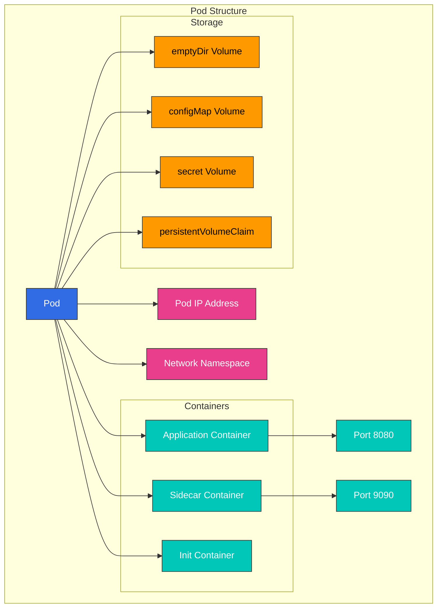

# Kubernetes Pods 和 Workloads

> **支持的版本**: Kubernetes 1.32, 1.33, 1.34
> **最后更新**: February 23, 2026

本文档详细说明 Kubernetes 中的基本执行单元 Pod（容器组），以及用于管理它们的各种 Workload 资源。从 Pod 的概念开始，我们将介绍包括 Deployments、StatefulSets、DaemonSets 等各种 Workload 资源的特性和使用场景。

## 实验环境设置

要跟随本文档中的示例进行操作，你需要以下工具和环境：

### 必需工具
- kubectl v1.34 或更高版本
- 可用的 Kubernetes cluster（EKS、minikube、kind 等）

### 部署示例应用程序

```bash
# Create namespace
kubectl create namespace workloads-demo

# Create a simple deployment
kubectl -n workloads-demo apply -f - <<EOF
apiVersion: apps/v1
kind: Deployment
metadata:
  name: nginx-deployment
  labels:
    app: nginx
spec:
  replicas: 3
  selector:
    matchLabels:
      app: nginx
  template:
    metadata:
      labels:
        app: nginx
    spec:
      containers:
      - name: nginx
        image: nginx:1.21
        ports:
        - containerPort: 80
        resources:
          requests:
            memory: "64Mi"
            cpu: "100m"
          limits:
            memory: "128Mi"
            cpu: "200m"
EOF

# Check deployment status
kubectl -n workloads-demo get deployments,pods
```

## 目录
- [Pod 概念](#pod-concepts)
- [Pod 生命周期](#pod-lifecycle)
- [Pod 设计模式](#pod-design-patterns)
- [Workload 资源概览](#workload-resources-overview)
- [ReplicaSet](#replicaset)
- [Deployment](#deployment)
- [StatefulSet](#statefulset)
- [DaemonSet](#daemonset)
- [Jobs 和 CronJobs](#jobs-and-cronjobs)
- [资源管理](#resource-management)
- [Pod Disruption Budget](#pod-disruption-budget)
- [Horizontal Pod Autoscaling](#horizontal-pod-autoscaling)
- [Vertical Pod Autoscaling](#vertical-pod-autoscaling)
- [Workload 最佳实践](#workload-best-practices)
- [Amazon EKS Workload 注意事项](#amazon-eks-workload-considerations)

## Pod 概念

> **关键概念**: Pod 是 Kubernetes 中最小的可部署计算单元，由一个或多个共享存储和网络的 container 组组成。

Pod 是 Kubernetes 中最小的可部署计算单元。Pod 是一组共享存储和网络，并被一起调度的一个或多个 container。

### Pod 特性

1. **共享上下文**: Pod 内的所有 container 共享同一个网络命名空间、IPC 命名空间和 UTS 命名空间。
2. **同一 Node**: Pod 中的所有 container 始终运行在同一个 node 上。
3. **唯一 IP 地址**: 每个 Pod 在 cluster 内都有唯一的 IP 地址。
4. **临时性**: Pod 本质上是临时的，在发生故障时可以被新的 Pod 替换。
5. **原子单元**: Pod 是部署、调度和复制的原子单元。

### Pod 结构

Pod 由以下组件组成：

1. **Containers**: 在 Pod 内运行的一个或多个 container
2. **Volumes**: Pod 内 container 共享的存储
3. **Network**: 分配给 Pod 的 IP 地址和端口
4. **Container Spec**: Container image、环境变量、资源需求等



### Pod 示例

```yaml
apiVersion: v1
kind: Pod
metadata:
  name: multi-container-pod
  labels:
    app: web
spec:
  containers:
  - name: web
    image: nginx:1.21
    ports:
    - containerPort: 80
    volumeMounts:
    - name: shared-data
      mountPath: /usr/share/nginx/html
  - name: content-updater
    image: alpine
    command: ["/bin/sh", "-c"]
    args:
    - while true; do
        echo "Current time: $(date)" > /content/index.html;
        sleep 10;
      done
    volumeMounts:
    - name: shared-data
      mountPath: /content
  volumes:
  - name: shared-data
    emptyDir: {}
```

### 实践示例：Web 应用程序 Pod

以下是包含 web 应用程序和 sidecar container 的 Pod 示例：

```yaml
apiVersion: v1
kind: Pod
metadata:
  name: web-app
  labels:
    app: web
    environment: production
spec:
  containers:
  - name: web-application
    image: nginx:1.21
    ports:
    - containerPort: 80
    resources:
      requests:
        memory: "128Mi"
        cpu: "100m"
      limits:
        memory: "256Mi"
        cpu: "500m"
  - name: log-collector
    image: fluentd:v1.14
    volumeMounts:
    - name: log-volume
      mountPath: /var/log/nginx
    resources:
      requests:
        memory: "64Mi"
        cpu: "50m"
      limits:
        memory: "128Mi"
        cpu: "100m"
  volumes:
  - name: log-volume
    emptyDir: {}
```

此示例展示了以下真实场景：
- 将 Nginx web server 作为主 container 运行
- 将 Fluentd log collector 作为 sidecar container 运行
- 在两个 container 之间共享 log volume
- 为每个 container 设置 resource requests 和 limits

此配置适合在 microservice 架构中运行紧密关联的 container，同时将日志记录、监控和代理等功能分离出来。
    classDef k8sComponent fill:#326CE5,stroke:#333,stroke-width:1px,color:white;
    classDef userApp fill:#00C7B7,stroke:#333,stroke-width:1px,color:white;
    classDef dataStore fill:#3B48CC,stroke:#333,stroke-width:1px,color:white;
    classDef default fill:#f9f9f9,stroke:#333,stroke-width:1px,color:black;

    %% Apply classes
    class Pod default;
    class Container1,Container2 userApp;
    class Volume dataStore;
    class IP default;
```

### Pod 定义

Pods 使用 YAML 或 JSON 格式的 manifest 文件进行定义。下面是一个基本的 Pod 定义示例：

```yaml
apiVersion: v1
kind: Pod
metadata:
  name: nginx-pod
  labels:
    app: nginx
spec:
  containers:
  - name: nginx
    image: nginx:1.21
    ports:
    - containerPort: 80
    resources:
      requests:
        memory: "64Mi"
        cpu: "250m"
      limits:
        memory: "128Mi"
        cpu: "500m"
```

### 单 Container 与多 Container Pod

**单 Container Pod**:
- 最常见的使用场景
- 仅包含一个 application container
- 结构简单直观

**多 Container Pod**:
- 包含多个紧密耦合的 container
- Container 之间可以进行本地通信（localhost）
- 通过 shared volumes 共享数据
- 一起扩缩容并一起放置

### 多 Container Pod 模式

1. **Sidecar Pattern**: 扩展主 container 功能的辅助 container
   - 示例：log collector、文件同步、proxy

```yaml
apiVersion: v1
kind: Pod
metadata:
  name: web-with-sidecar
spec:
  containers:
  - name: web
    image: nginx:1.21
  - name: log-collector
    image: fluentd:v1.14
    volumeMounts:
    - name: logs
      mountPath: /var/log/nginx
  volumes:
  - name: logs
    emptyDir: {}
```

2. **Ambassador Pattern**: 充当外部 services 代理的 container
   - 示例：database proxy、service mesh sidecar

```yaml
apiVersion: v1
kind: Pod
metadata:
  name: app-with-ambassador
spec:
  containers:
  - name: app
    image: myapp:1.0
  - name: ambassador
    image: envoy:v1.20
    ports:
    - containerPort: 9901
```

3. **Adapter Pattern**: 使主 container 输出标准化的 container
   - 示例：log 格式转换、metrics 转换

```yaml
apiVersion: v1
kind: Pod
metadata:
  name: app-with-adapter
spec:
  containers:
  - name: app
    image: myapp:1.0
  - name: adapter
    image: adapter:1.0
    volumeMounts:
    - name: app-logs
      mountPath: /var/log/app
  volumes:
  - name: app-logs
    emptyDir: {}
```

4. **Init Container Pattern**: 在主 container 启动之前运行的 container
   - 示例：配置文件创建、database migration、权限设置

```yaml
apiVersion: v1
kind: Pod
metadata:
  name: app-with-init
spec:
  initContainers:
  - name: init-db
    image: busybox:1.34
    command: ['sh', '-c', 'until nslookup db; do echo waiting for db; sleep 2; done;']
  containers:
  - name: app
    image: myapp:1.0
```

### Pod 网络

Pod 内的 container 具有以下网络特性：

1. **相同 IP 地址**: Pod 内的所有 container 共享同一个 IP 地址。
2. **端口共享**: Pod 内的 container 共享端口空间，因此不能使用相同端口。
3. **Localhost 通信**: Pod 内的 container 可以通过 localhost 相互通信。
4. **Pod 间通信**: 每个 Pod 都有唯一的 IP 地址，并且可以直接与其他 Pods 通信。

### Pod 存储

Pods 可以使用各种类型的 volumes 来存储和共享数据：

1. **emptyDir**: 创建 Pod 时创建、删除 Pod 时删除的临时 volume
2. **hostPath**: 从 host node 的文件系统挂载到 Pod 的 volume
3. **persistentVolumeClaim**: 请求持久存储的 volume
4. **configMap**: 作为 volume 挂载的 ConfigMap
5. **secret**: 作为 volume 挂载的 Secret
6. **projected**: 将多个 volume sources 映射到同一目录

```yaml
apiVersion: v1
kind: Pod
metadata:
  name: pod-with-volumes
spec:
  containers:
  - name: app
    image: myapp:1.0
    volumeMounts:
    - name: data
      mountPath: /data
    - name: config
      mountPath: /etc/config
  volumes:
  - name: data
    emptyDir: {}
  - name: config
    configMap:
      name: app-config
```

## Pod 生命周期

Pods 从创建到终止会经历多个生命周期阶段。理解这个生命周期对于确保应用程序的稳定性和可用性非常重要。

### Pod 阶段

Pods 会经历以下阶段：

1. **Pending**: Pod 已被 cluster 接受，但一个或多个 container 尚未完成设置
2. **Running**: Pod 已绑定到某个 node，所有 container 已创建，并且至少有一个 container 正在运行或正在启动/重启
3. **Succeeded**: Pod 中的所有 container 都已成功终止，并且不会被重启
4. **Failed**: Pod 中的所有 container 都已终止，并且至少有一个 container 因失败而终止
5. **Unknown**: 由于某种原因无法获取 Pod 的状态

### Container 状态

Pod 内的每个 container 可以具有以下状态：

1. **Waiting**: Container 运行之前的状态（下载 image、等待依赖等）
2. **Running**: Container 正在正常运行
3. **Terminated**: Container 已完成执行或因某种原因失败

### Pod Conditions

Pods 通过以下 conditions 更具体地表示其状态：

1. **PodScheduled**: Pod 是否已被调度到某个 node
2. **ContainersReady**: Pod 中的所有 container 是否已就绪
3. **Initialized**: 所有 init containers 是否已成功完成
4. **Ready**: Pod 是否可以处理请求，并可以加入 services 的负载均衡池

### Container Probes

Kubernetes 提供以下 probes 来检查 container 状态：

1. **livenessProbe**: 检查 container 是否存活；失败时重启 container
2. **readinessProbe**: 检查 container 是否已准备好处理请求；失败时从 service traffic 中排除
3. **startupProbe**: 检查 container 内的应用程序是否已启动；成功之前禁用其他 probes

```yaml
apiVersion: v1
kind: Pod
metadata:
  name: pod-with-probes
spec:
  containers:
  - name: app
    image: myapp:1.0
    ports:
    - containerPort: 8080
    livenessProbe:
      httpGet:
        path: /healthz
        port: 8080
      initialDelaySeconds: 30
      periodSeconds: 10
      timeoutSeconds: 5
      failureThreshold: 3
    readinessProbe:
      httpGet:
        path: /ready
        port: 8080
      initialDelaySeconds: 5
      periodSeconds: 5
    startupProbe:
      httpGet:
        path: /startup
        port: 8080
      failureThreshold: 30
      periodSeconds: 10
```

### Pod 终止过程

当 Pod 被终止时，会发生以下过程：

1. **向 API Server 发出删除请求**: 用户或 controller 请求删除 Pod
2. **终止期限开始**: 设置默认终止期限（30 秒）
3. **API 更新**: API server 更新 Pod 的删除时间戳
4. **从 Service 中移除**: Endpoint controller 从 service endpoints 中移除 Pod
5. **SIGTERM 信号**: kubelet 向 container 发送 SIGTERM 信号
6. **优雅关闭等待**: 为应用程序提供优雅关闭的时间
7. **SIGKILL 信号**: 如果 container 在终止期限后仍未终止，则发送 SIGKILL 信号
8. **资源清理**: kubelet 清理 Pod 资源

### Init Containers

Init containers 是在 Pod 中 app containers 启动之前运行的特殊 container：

1. **顺序执行**: Init containers 按定义顺序一次运行一个
2. **前置条件**: 每个 init container 只有在前一个 container 成功完成后才会启动
3. **失败时重启**: 如果 init container 失败，它会根据 Pod 的 restart policy 重启
4. **用途**: App container 启动前的设置、依赖验证、权限设置等

```yaml
apiVersion: v1
kind: Pod
metadata:
  name: init-pod
spec:
  initContainers:
  - name: init-myservice
    image: busybox:1.34
    command: ['sh', '-c', 'until nslookup myservice; do echo waiting for myservice; sleep 2; done;']
  - name: init-mydb
    image: busybox:1.34
    command: ['sh', '-c', 'until nslookup mydb; do echo waiting for mydb; sleep 2; done;']
  containers:
  - name: app
    image: myapp:1.0
```

### Pod Disruption

Pod disruptions 可以分为自愿中断和非自愿中断：

1. **自愿中断**: 由 cluster 管理员或自动化工具引起的中断
   - Node draining
   - Deployment updates
   - Pod deletion

2. **非自愿中断**: 由硬件故障、kernel panic、网络分区等导致的中断

PodDisruptionBudget 可以在自愿中断期间确保最低可用性。

## Pod 设计模式

设计 Pods 时需要考虑若干模式和最佳实践。理解并应用这些模式可以提升应用程序的稳定性、可扩展性和可维护性。

### 单一职责原则

Pods 应遵循单一职责原则：

1. **一个主要功能**: 每个 Pod 应负责一个主要功能或进程
2. **独立扩缩容**: 设计时应使每个功能都可以独立扩缩容
3. **独立生命周期**: 设计时应使每个功能都可以拥有自己的生命周期

### Pod Templates

Pod templates 是在 Workload 资源（Deployments、StatefulSets 等）中用于创建 Pods 的规范：

```yaml
apiVersion: apps/v1
kind: Deployment
metadata:
  name: nginx-deployment
spec:
  replicas: 3
  selector:
    matchLabels:
      app: nginx
  template:  # Pod template starts
    metadata:
      labels:
        app: nginx
    spec:
      containers:
      - name: nginx
        image: nginx:1.21
        ports:
        - containerPort: 80
  # Pod template ends
```

### Pod Affinity 和 Anti-Affinity

Pod affinity 和 anti-affinity 是控制 Pods 被调度到哪些 nodes 上的规则：

1. **Pod Affinity**: 调度到与特定 Pods 相同的 node 或 topology domain 上
2. **Pod Anti-Affinity**: 调度到与特定 Pods 不同的 node 或 topology domain 上

```yaml
apiVersion: v1
kind: Pod
metadata:
  name: web-pod
spec:
  affinity:
    podAffinity:
      requiredDuringSchedulingIgnoredDuringExecution:
      - labelSelector:
          matchExpressions:
          - key: app
            operator: In
            values:
            - cache
        topologyKey: "kubernetes.io/hostname"
    podAntiAffinity:
      preferredDuringSchedulingIgnoredDuringExecution:
      - weight: 100
        podAffinityTerm:
          labelSelector:
            matchExpressions:
            - key: app
              operator: In
              values:
              - web
          topologyKey: "kubernetes.io/hostname"
  containers:
  - name: web
    image: nginx:1.21
```

### Node Affinity

Node affinity 是限制 Pods 调度到特定 nodes 上的规则：

```yaml
apiVersion: v1
kind: Pod
metadata:
  name: gpu-pod
spec:
  affinity:
    nodeAffinity:
      requiredDuringSchedulingIgnoredDuringExecution:
        nodeSelectorTerms:
        - matchExpressions:
          - key: gpu
            operator: In
            values:
            - "true"
  containers:
  - name: gpu-container
    image: gpu-app:1.0
```

### Taints 和 Tolerations

Taints 应用于 nodes，用于阻止某些 Pods 被调度；tolerations 应用于 Pods，用于允许调度到带有 taints 的 nodes 上：

```yaml
# Apply taint to node
kubectl taint nodes node1 key=value:NoSchedule

# Apply toleration to Pod
apiVersion: v1
kind: Pod
metadata:
  name: tolerant-pod
spec:
  tolerations:
  - key: "key"
    operator: "Equal"
    value: "value"
    effect: "NoSchedule"
  containers:
  - name: app
    image: myapp:1.0
```

### Resource Requests 和 Limits

为 Pods 中的 container 设置 resource requests 和 limits，对于高效使用 cluster 资源以及确保稳定性非常重要：

```yaml
apiVersion: v1
kind: Pod
metadata:
  name: resource-pod
spec:
  containers:
  - name: app
    image: myapp:1.0
    resources:
      requests:
        memory: "64Mi"
        cpu: "250m"
      limits:
        memory: "128Mi"
        cpu: "500m"
```

### Pod Security Context

Security context 定义 Pod 或 container 级别的安全设置：

```yaml
apiVersion: v1
kind: Pod
metadata:
  name: security-pod
spec:
  securityContext:
    runAsUser: 1000
    runAsGroup: 3000
    fsGroup: 2000
  containers:
  - name: app
    image: myapp:1.0
    securityContext:
      allowPrivilegeEscalation: false
      capabilities:
        drop:
        - ALL
```

### Pod Priority 和 Preemption

Pod priority 和 preemption 决定在 cluster 资源不足时哪些 Pods 会被调度，哪些 Pods 会被抢占：

```yaml
# Priority class definition
apiVersion: scheduling.k8s.io/v1
kind: PriorityClass
metadata:
  name: high-priority
value: 1000000
globalDefault: false
description: "This priority class should be used for critical pods only."

# Pod using priority class
apiVersion: v1
kind: Pod
metadata:
  name: high-priority-pod
spec:
  priorityClassName: high-priority
  containers:
  - name: app
    image: myapp:1.0
```

## Workload 资源概览

Kubernetes 提供多种 Workload 资源来管理 Pods。每种 Workload 资源都面向特定的使用场景和需求而设计。

### Workload 资源类型

Kubernetes 中的主要 Workload 资源包括：

1. **ReplicaSet**: 维护指定数量的 Pod replicas
2. **Deployment**: 管理 ReplicaSets 以提供声明式更新
3. **StatefulSet**: 用于需要状态持久性的应用程序的资源
4. **DaemonSet**: 在所有 nodes 上运行一个 Pod 副本
5. **Job**: 完成后终止的一次性任务
6. **CronJob**: 按计划周期性运行 Jobs

### Workload 资源选择标准

选择合适 Workload 资源的标准：

1. **状态持久性**: 应用程序是否需要维护状态
2. **执行模式**: 是持续运行、一次性运行还是周期性运行
3. **部署需求**: 对 rolling updates、blue/green deployments 等的需求
4. **Node 覆盖范围**: 是否需要在所有 nodes 上运行
5. **可扩展性需求**: 是否需要水平扩缩容

## ReplicaSet

ReplicaSet 确保指定数量的 Pod replicas 始终运行。如果 Pods 失败或被删除，ReplicaSet 会自动创建替代 Pods。

### ReplicaSet 的主要特性

1. **维护 Pod Replicas**: 维护指定数量的 Pod replicas
2. **Pod 选择**: 通过 label selectors 识别要管理的 Pods
3. **Pod 创建**: 必要时创建新的 Pods
4. **Pod 删除**: 删除多余的 Pods

### ReplicaSet 定义

```yaml
apiVersion: apps/v1
kind: ReplicaSet
metadata:
  name: frontend
  labels:
    app: guestbook
    tier: frontend
spec:
  replicas: 3
  selector:
    matchLabels:
      tier: frontend
  template:
    metadata:
      labels:
        tier: frontend
    spec:
      containers:
      - name: php-redis
        image: gcr.io/google_samples/gb-frontend:v3
        resources:
          requests:
            cpu: 100m
            memory: 100Mi
        ports:
        - containerPort: 80
```

### ReplicaSet 工作方式

1. **Label Selector 匹配**: ReplicaSet 识别匹配 label selector 的 Pods
2. **检查当前状态**: 验证当前正在运行的 Pods 数量
3. **与期望状态比较**: 将当前 Pod 数量与期望 replica 数量进行比较
4. **调整操作**: 根据需要创建或删除 Pods

### ReplicaSet vs Replication Controller

ReplicaSet 是 Replication Controller 的后继者，并提供更强大的 label selectors：

1. **Replication Controller**: 仅支持基于等值的 selectors（例如 app=nginx）
2. **ReplicaSet**: 支持基于集合的 selectors（例如 app in (nginx, apache)）

### ReplicaSet 使用场景

ReplicaSets 通常通过 Deployments 间接使用，而不是直接使用。不过，在以下情况下也可以直接使用：

1. **简单复制**: 仅需维护 Pod replicas 时
2. **自定义更新**: 需要自定义更新机制时
3. **旧版支持**: 支持 legacy applications

## Deployment

Deployment 管理 ReplicaSets，以便为 Pods 提供声明式更新。Deployments 为应用程序管理 rolling updates、rollbacks、scaling 等。

### Deployment 的主要特性

1. **声明式更新**: 声明期望状态，Deployment 将当前状态变更为期望状态
2. **Rolling Updates**: 无停机更新应用程序
3. **Rollback**: 轻松回滚到以前版本
4. **Scaling**: 调整应用程序 replicas 数量
5. **Deployment History**: 维护以前部署版本的记录

### Deployment 定义

```yaml
apiVersion: apps/v1
kind: Deployment
metadata:
  name: nginx-deployment
  labels:
    app: nginx
spec:
  replicas: 3
  selector:
    matchLabels:
      app: nginx
  strategy:
    type: RollingUpdate
    rollingUpdate:
      maxSurge: 1
      maxUnavailable: 0
  template:
    metadata:
      labels:
        app: nginx
    spec:
      containers:
      - name: nginx
        image: nginx:1.21
        ports:
        - containerPort: 80
        resources:
          requests:
            cpu: 100m
            memory: 100Mi
          limits:
            cpu: 200m
            memory: 200Mi
        livenessProbe:
          httpGet:
            path: /
            port: 80
          initialDelaySeconds: 30
          periodSeconds: 10
        readinessProbe:
          httpGet:
            path: /
            port: 80
          initialDelaySeconds: 5
          periodSeconds: 5
```

### Deployment 更新策略

Deployments 提供两种更新策略：

1. **RollingUpdate**: 为部署逐步更新 Pods，避免停机（默认）
   - **maxSurge**: 可在期望 Pod 数量之上额外创建的最大 Pods 数量
   - **maxUnavailable**: 更新期间不可用的最大 Pods 数量

2. **Recreate**: 创建新 Pods 之前删除所有现有 Pods（会导致临时停机）

### Deployment 回滚

Deployments 支持回滚到以前版本：

```bash
# Check deployment history
kubectl rollout history deployment/nginx-deployment

# Check details of specific version
kubectl rollout history deployment/nginx-deployment --revision=2

# Rollback to previous version
kubectl rollout undo deployment/nginx-deployment

# Rollback to specific version
kubectl rollout undo deployment/nginx-deployment --to-revision=2
```

### Deployment 扩缩容

Deployments 可以轻松扩缩容：

```bash
# Imperative scaling
kubectl scale deployment/nginx-deployment --replicas=5

# Declarative scaling (after modifying YAML file)
kubectl apply -f deployment.yaml
```

### Deployment 暂停与恢复

Deployment rollouts 可以暂停和恢复：

```bash
# Pause rollout
kubectl rollout pause deployment/nginx-deployment

# Apply multiple changes
kubectl set image deployment/nginx-deployment nginx=nginx:1.22
kubectl set resources deployment/nginx-deployment -c=nginx --limits=cpu=200m,memory=256Mi

# Resume rollout
kubectl rollout resume deployment/nginx-deployment
```

### Deployment 状态

Deployments 可以具有以下状态：

1. **Progressing**: 正在创建新的 ReplicaSet 或进行扩缩容
2. **Complete**: 所有 replicas 都已更新并可用
3. **Failed**: 部署期间发生错误（例如 image 拉取失败、资源不足）

## StatefulSet

StatefulSet 是用于需要状态持久性的应用程序的 Workload 资源。它为每个 Pod 分配唯一标识符，并提供稳定的网络标识符和持久存储。

### StatefulSet 的主要特性

1. **稳定且唯一的网络标识符**: Pod names 和 hostnames 即使在重启后也会保持不变
2. **稳定且持久的存储**: 即使 Pods 被重新调度，也能访问相同的存储
3. **顺序部署和扩缩容**: Pods 按顺序创建、更新和删除
4. **顺序自动 Rolling Updates**: Pods 按顺序更新

### StatefulSet 定义

```yaml
apiVersion: apps/v1
kind: StatefulSet
metadata:
  name: web
spec:
  selector:
    matchLabels:
      app: nginx
  serviceName: "nginx"
  replicas: 3
  updateStrategy:
    type: RollingUpdate
  podManagementPolicy: OrderedReady
  template:
    metadata:
      labels:
        app: nginx
    spec:
      containers:
      - name: nginx
        image: nginx:1.21
        ports:
        - containerPort: 80
          name: web
        volumeMounts:
        - name: www
          mountPath: /usr/share/nginx/html
  volumeClaimTemplates:
  - metadata:
      name: www
    spec:
      accessModes: [ "ReadWriteOnce" ]
      storageClassName: "standard"
      resources:
        requests:
          storage: 1Gi
```

### StatefulSet Pod 标识符

StatefulSet 按以下格式为 Pods 分配唯一标识符：
```
<StatefulSet name>-<ordinal index>
```

例如，`web` StatefulSet 会创建类似 `web-0`、`web-1`、`web-2` 的 Pods。

### StatefulSet Headless Service

StatefulSets 通常与 headless service（clusterIP: None）一起使用。这会为每个 Pod 创建 DNS 记录：

```yaml
apiVersion: v1
kind: Service
metadata:
  name: nginx
  labels:
    app: nginx
spec:
  ports:
  - port: 80
    name: web
  clusterIP: None
  selector:
    app: nginx
```

这样，每个 Pod 都拥有以下格式的 DNS 名称：
```
<Pod name>.<service name>.<namespace>.svc.cluster.local
```

示例：`web-0.nginx.default.svc.cluster.local`

### StatefulSet 存储

StatefulSets 使用 `volumeClaimTemplates` 为每个 Pod 自动创建 Persistent Volume Claims（PVCs）。即使 Pods 被重新调度，这些 PVCs 也会被保留。

### StatefulSet 更新策略

StatefulSets 提供两种更新策略：

1. **RollingUpdate**: 按顺序更新 Pods（默认）
2. **OnDelete**: 仅在 Pods 被删除时更新

### Pod 管理策略

StatefulSets 提供两种 Pod 管理策略：

1. **OrderedReady**: 按顺序创建和终止 Pods（默认）
2. **Parallel**: 并行创建和终止 Pods

### StatefulSet 使用场景

StatefulSets 适用于以下应用程序：

1. **Databases**: MySQL、PostgreSQL、MongoDB 等
2. **Distributed Systems**: Kafka、ZooKeeper、Elasticsearch 等
3. **Message Queues**: RabbitMQ 等
4. **其他 Stateful Applications**: File servers、session stores 等

### StatefulSet 示例：MySQL Replication

```yaml
apiVersion: v1
kind: Service
metadata:
  name: mysql
  labels:
    app: mysql
spec:
  ports:
  - port: 3306
    name: mysql
  clusterIP: None
  selector:
    app: mysql
---
apiVersion: apps/v1
kind: StatefulSet
metadata:
  name: mysql
spec:
  selector:
    matchLabels:
      app: mysql
  serviceName: mysql
  replicas: 3
  template:
    metadata:
      labels:
        app: mysql
    spec:
      initContainers:
      - name: init-mysql
        image: mysql:5.7
        command:
        - bash
        - "-c"
        - |
          set -ex
          # Generate server ID based on Pod index
          [[ `hostname` =~ -([0-9]+)$ ]] || exit 1
          ordinal=${BASH_REMATCH[1]}
          echo [mysqld] > /mnt/conf.d/server-id.cnf
          echo server-id=$((100 + $ordinal)) >> /mnt/conf.d/server-id.cnf
          # Master or slave configuration
          if [[ $ordinal -eq 0 ]]; then
            echo [mysqld] > /mnt/conf.d/master.cnf
            echo log-bin=mysql-bin >> /mnt/conf.d/master.cnf
          else
            echo [mysqld] > /mnt/conf.d/slave.cnf
            echo super-read-only >> /mnt/conf.d/slave.cnf
          fi
        volumeMounts:
        - name: conf
          mountPath: /mnt/conf.d
      - name: clone-mysql
        image: gcr.io/google-samples/xtrabackup:1.0
        command:
        - bash
        - "-c"
        - |
          set -ex
          # Only perform replication if not the first Pod
          [[ `hostname` =~ -([0-9]+)$ ]] || exit 1
          ordinal=${BASH_REMATCH[1]}
          if [[ $ordinal -eq 0 ]]; then
            exit 0
          fi
          # Replicate data from previous Pod
          ncat --recv-only mysql-$(($ordinal-1)).mysql 3307 | xbstream -x -C /var/lib/mysql
          # Prepare backup
          xtrabackup --prepare --target-dir=/var/lib/mysql
        volumeMounts:
        - name: data
          mountPath: /var/lib/mysql
          subPath: mysql
        - name: conf
          mountPath: /etc/mysql/conf.d
      containers:
      - name: mysql
        image: mysql:5.7
        env:
        - name: MYSQL_ROOT_PASSWORD
          valueFrom:
            secretKeyRef:
              name: mysql-secret
              key: password
        ports:
        - name: mysql
          containerPort: 3306
        volumeMounts:
        - name: data
          mountPath: /var/lib/mysql
          subPath: mysql
        - name: conf
          mountPath: /etc/mysql/conf.d
        resources:
          requests:
            cpu: 500m
            memory: 1Gi
        livenessProbe:
          exec:
            command: ["mysqladmin", "ping"]
          initialDelaySeconds: 30
          periodSeconds: 10
          timeoutSeconds: 5
        readinessProbe:
          exec:
            command: ["mysql", "-h", "127.0.0.1", "-e", "SELECT 1"]
          initialDelaySeconds: 5
          periodSeconds: 2
          timeoutSeconds: 1
      - name: xtrabackup
        image: gcr.io/google-samples/xtrabackup:1.0
        ports:
        - name: xtrabackup
          containerPort: 3307
        command:
        - bash
        - "-c"
        - |
          set -ex
          cd /var/lib/mysql
          # Start slave
          if [[ -f xtrabackup_slave_info ]]; then
            cat xtrabackup_slave_info | sed -E 's/;$//g' > change_master_to.sql
            mysql -h 127.0.0.1 -e "$(cat change_master_to.sql); RESET SLAVE; START SLAVE;"
          # If replicated from master
          elif [[ -f xtrabackup_binlog_info ]]; then
            [[ `hostname` =~ -([0-9]+)$ ]] || exit 1
            ordinal=${BASH_REMATCH[1]}
            [[ $ordinal -eq 0 ]] && exit 0
            master_host=mysql-0.mysql
            master_log_file=$(cat xtrabackup_binlog_info | awk '{print $1}')
            master_log_pos=$(cat xtrabackup_binlog_info | awk '{print $2}')
            mysql -h 127.0.0.1 -e "CHANGE MASTER TO MASTER_HOST='$master_host', MASTER_USER='root', MASTER_PASSWORD='$MYSQL_ROOT_PASSWORD', MASTER_LOG_FILE='$master_log_file', MASTER_LOG_POS=$master_log_pos; RESET SLAVE; START SLAVE;"
          fi
          # Start backup server
          exec ncat --listen --keep-open --send-only --max-conns=1 3307 -c "xtrabackup --backup --slave-info --stream=xbstream --host=127.0.0.1"
        volumeMounts:
        - name: data
          mountPath: /var/lib/mysql
          subPath: mysql
        - name: conf
          mountPath: /etc/mysql/conf.d
        resources:
          requests:
            cpu: 100m
            memory: 100Mi
      volumes:
      - name: conf
        emptyDir: {}
  volumeClaimTemplates:
  - metadata:
      name: data
    spec:
      accessModes: ["ReadWriteOnce"]
      storageClassName: standard
      resources:
        requests:
          storage: 10Gi
```

## DaemonSet

DaemonSet 确保一个 Pod 的副本运行在所有 nodes（或特定 nodes）上。当 node 添加到 cluster 时，Pods 会自动添加；当 node 被移除时，Pods 也会被移除。

### DaemonSet 的主要特性

1. **在所有 Nodes 上运行**: 在 cluster 中的所有 nodes 上运行 Pods
2. **Node 选择**: 可以通过 node selectors 仅在特定 nodes 上运行
3. **自动部署**: 添加新 nodes 时自动部署 Pods
4. **自动清理**: 移除 nodes 时自动清理 Pods

### DaemonSet 定义

```yaml
apiVersion: apps/v1
kind: DaemonSet
metadata:
  name: fluentd-elasticsearch
  namespace: kube-system
  labels:
    k8s-app: fluentd-logging
spec:
  selector:
    matchLabels:
      name: fluentd-elasticsearch
  updateStrategy:
    type: RollingUpdate
    rollingUpdate:
      maxUnavailable: 1
  template:
    metadata:
      labels:
        name: fluentd-elasticsearch
    spec:
      tolerations:
      - key: node-role.kubernetes.io/master
        effect: NoSchedule
      containers:
      - name: fluentd-elasticsearch
        image: quay.io/fluentd_elasticsearch/fluentd:v2.5.2
        resources:
          limits:
            memory: 200Mi
          requests:
            cpu: 100m
            memory: 200Mi
        volumeMounts:
        - name: varlog
          mountPath: /var/log
        - name: varlibdockercontainers
          mountPath: /var/lib/docker/containers
          readOnly: true
      terminationGracePeriodSeconds: 30
      volumes:
      - name: varlog
        hostPath:
          path: /var/log
      - name: varlibdockercontainers
        hostPath:
          path: /var/lib/docker/containers
```

### DaemonSet 更新策略

DaemonSets 提供两种更新策略：

1. **RollingUpdate**: 按顺序更新 Pods（默认）
   - **maxUnavailable**: 更新期间不可用的最大 Pods 数量

2. **OnDelete**: 仅在 Pods 被删除时更新

### DaemonSet Node 选择

DaemonSets 可以配置为仅在特定 nodes 上运行：

```yaml
spec:
  template:
    spec:
      nodeSelector:
        disk: ssd
```

### DaemonSet Taint Tolerations

DaemonSets 可以设置 tolerations，以便在带有 taints 的 nodes 上运行：

```yaml
spec:
  template:
    spec:
      tolerations:
      - key: node-role.kubernetes.io/master
        effect: NoSchedule
```

### DaemonSet 使用场景

DaemonSets 用于以下目的：

1. **Log Collectors**: Fluentd、Logstash 等
2. **Monitoring Agents**: Prometheus Node Exporter、Datadog Agent 等
3. **Network Plugins**: Calico、Cilium、Weave Net 等
4. **Storage Daemons**: Ceph、GlusterFS 等
5. **Security Agents**: Falco、Sysdig 等

### DaemonSet 示例：Prometheus Node Exporter

```yaml
apiVersion: apps/v1
kind: DaemonSet
metadata:
  name: node-exporter
  namespace: monitoring
  labels:
    app: node-exporter
spec:
  selector:
    matchLabels:
      app: node-exporter
  template:
    metadata:
      labels:
        app: node-exporter
    spec:
      hostNetwork: true
      hostPID: true
      containers:
      - name: node-exporter
        image: prom/node-exporter:v1.3.1
        args:
        - --path.procfs=/host/proc
        - --path.sysfs=/host/sys
        - --path.rootfs=/host/root
        - --web.listen-address=:9100
        ports:
        - containerPort: 9100
          protocol: TCP
          name: http
        resources:
          limits:
            cpu: 250m
            memory: 180Mi
          requests:
            cpu: 102m
            memory: 180Mi
        volumeMounts:
        - name: proc
          mountPath: /host/proc
          readOnly: true
        - name: sys
          mountPath: /host/sys
          readOnly: true
        - name: root
          mountPath: /host/root
          readOnly: true
      tolerations:
      - operator: "Exists"
      volumes:
      - name: proc
        hostPath:
          path: /proc
      - name: sys
        hostPath:
          path: /sys
      - name: root
        hostPath:
          path: /
```

## Jobs 和 CronJobs

Jobs 和 CronJobs 是用于运行一次性或周期性任务的 Workload 资源。

### Job

Job 创建一个或多个 Pods，并持续执行，直到指定数量的 Pods 成功终止。

#### Job 的主要特性

1. **完成保证**: 一直运行，直到指定数量的 Pods 成功完成
2. **并行执行**: 可以并行运行多个 Pods
3. **重试**: 自动重试失败的 Pods
4. **完成后清理**: 可选地在 job 完成后清理 Pods

#### Job 定义

```yaml
apiVersion: batch/v1
kind: Job
metadata:
  name: pi
spec:
  completions: 5      # Number of Pods that must successfully complete
  parallelism: 2      # Number of Pods to run in parallel
  backoffLimit: 4     # Number of retries on failure
  activeDeadlineSeconds: 100  # Job time limit (seconds)
  ttlSecondsAfterFinished: 100  # Deletion time after completion (seconds)
  template:
    spec:
      containers:
      - name: pi
        image: perl:5.34
        command: ["perl", "-Mbignum=bpi", "-wle", "print bpi(2000)"]
        resources:
          requests:
            cpu: 100m
            memory: 50Mi
          limits:
            cpu: 100m
            memory: 100Mi
      restartPolicy: Never  # or OnFailure
```

#### Job 完成模式

Jobs 提供两种完成模式：

1. **NonIndexed**: 标准 job 模式，在指定数量的 Pods 成功完成时 job 完成
2. **Indexed**: 每个 Pod 从 0 开始分配一个 index，用于处理特定 index 范围的任务

```yaml
apiVersion: batch/v1
kind: Job
metadata:
  name: indexed-job
spec:
  completions: 5
  parallelism: 3
  completionMode: Indexed  # Enable Indexed mode
  template:
    spec:
      containers:
      - name: worker
        image: busybox:1.34
        command: ["sh", "-c", "echo Processing item ${JOB_COMPLETION_INDEX}"]
      restartPolicy: Never
```

#### Job 使用场景

Jobs 用于以下目的：

1. **Batch Processing**: 数据处理、ETL tasks
2. **Computation Tasks**: 科学计算、rendering
3. **Database Migrations**: Schema updates
4. **一次性管理任务**: Backups、cleanup tasks

### CronJob

CronJobs 根据指定计划周期性运行 Jobs。它们的工作方式类似于 Linux cron jobs。

#### CronJob 的主要特性

1. **计划执行**: 使用 cron expressions 指定执行计划
2. **Job 管理**: 根据计划创建 Jobs
3. **Concurrency Policy**: 定义前一个 job 仍在运行时的行为
4. **History Limit**: 限制已完成 jobs 的历史记录

#### CronJob 定义

```yaml
apiVersion: batch/v1
kind: CronJob
metadata:
  name: hello
spec:
  schedule: "*/1 * * * *"  # Run every minute
  timeZone: "America/New_York"  # Timezone (Kubernetes 1.24+)
  concurrencyPolicy: Forbid  # Allow, Forbid, Replace
  successfulJobsHistoryLimit: 3
  failedJobsHistoryLimit: 1
  startingDeadlineSeconds: 60
  jobTemplate:
    spec:
      template:
        spec:
          containers:
          - name: hello
            image: busybox:1.34
            command:
            - /bin/sh
            - -c
            - date; echo Hello from the Kubernetes cluster
          restartPolicy: OnFailure
```

#### Cron Expression

Cron expressions 具有以下格式：
```
+------------------- minute (0 - 59)
| +----------------- hour (0 - 23)
| | +--------------- day of month (1 - 31)
| | | +------------- month (1 - 12)
| | | | +----------- day of week (0 - 6) (Sunday to Saturday; 7 is also Sunday)
| | | | |
| | | | |
* * * * *
```

常见 cron expression 示例：
- `*/5 * * * *`: 每 5 分钟
- `0 * * * *`: 每小时整点
- `0 0 * * *`: 每天午夜
- `0 0 * * 0`: 每周日午夜
- `0 0 1 * *`: 每月 1 日午夜
- `0 0 1 1 *`: 每年 1 月 1 日午夜

#### Concurrency Policy

CronJobs 提供三种 concurrency policies：

1. **Allow**: 多个 Jobs 可以同时运行（默认）
2. **Forbid**: 如果前一个 Job 仍在运行，则跳过新的 Job
3. **Replace**: 如果前一个 Job 仍在运行，则用新的 Job 替换前一个 Job

#### CronJob 使用场景

CronJobs 用于以下目的：

1. **Regular Backups**: Database backups、snapshot creation
2. **Data Synchronization**: 周期性数据同步
3. **Report Generation**: 每日/每周/每月报告生成
4. **Cleanup Tasks**: 临时文件清理、log rotation
5. **Notifications and Monitoring**: 状态检查、alert sending

#### CronJob 示例：Database Backup

```yaml
apiVersion: batch/v1
kind: CronJob
metadata:
  name: database-backup
spec:
  schedule: "0 2 * * *"  # Run daily at 02:00
  concurrencyPolicy: Forbid
  successfulJobsHistoryLimit: 3
  failedJobsHistoryLimit: 1
  jobTemplate:
    spec:
      template:
        spec:
          containers:
          - name: backup
            image: postgres:14
            env:
            - name: PGHOST
              value: postgres-service
            - name: PGUSER
              valueFrom:
                secretKeyRef:
                  name: postgres-secret
                  key: username
            - name: PGPASSWORD
              valueFrom:
                secretKeyRef:
                  name: postgres-secret
                  key: password
            command:
            - /bin/sh
            - -c
            - |
              pg_dump -Fc > /backup/db-$(date +%Y%m%d-%H%M%S).dump
              find /backup -type f -mtime +7 -delete  # Delete backups older than 7 days
            volumeMounts:
            - name: backup-volume
              mountPath: /backup
          restartPolicy: OnFailure
          volumes:
          - name: backup-volume
            persistentVolumeClaim:
              claimName: backup-pvc
```

## 总结

本文档介绍了 Pods（Kubernetes 的基本构建块）以及各种 Workload 资源。从 Pod 的概念开始，我们探讨了包括 Deployments、StatefulSets、DaemonSets、Jobs 和 CronJobs 在内的各种 Workload 资源的特性和使用场景。这些资源各自具有独特的目的和功能，适当地使用它们可以实现高效的应用程序部署和管理。

## 测验

要测试你在本章中学到的内容，请尝试 [Pods 和 Workloads 测验](../quizzes/core/02-pods-and-workloads-quiz.md)。
