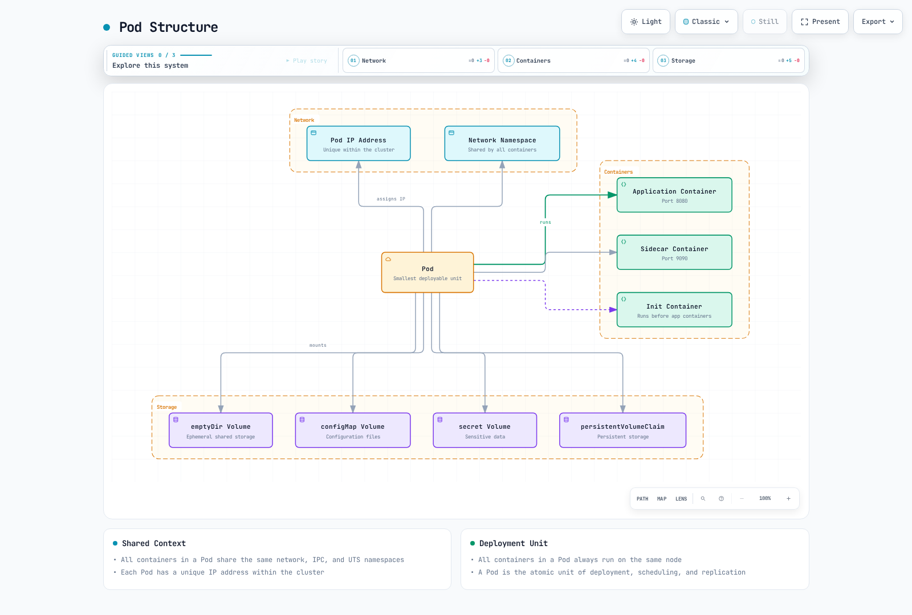

# Kubernetes Pod 和工作负载

> **支持的版本**: Kubernetes 1.32, 1.33, 1.34
> **最后更新**: February 23, 2026

本文详细说明 Kubernetes 的基本执行单元 Pod，以及用于管理它们的各类工作负载资源。我们将从 Pod 的概念出发，介绍 Deployment、StatefulSet、DaemonSet 等各种工作负载资源的特性和使用场景。

## 实验环境设置

要跟随本文中的示例，您需要以下工具和环境：

### 所需工具
- kubectl v1.34 或更高版本
- 可用的 Kubernetes 集群（EKS、minikube、kind 等）

### 部署示例应用程序

```bash
# Create namespace
kubectl create namespace workloads-demo

# Create a simple deployment
kubectl -n workloads-demo apply -f - <<EOF
apiVersion: apps/v1
kind: Deployment
metadata:
  name: nginx-deployment
  labels:
    app: nginx
spec:
  replicas: 3
  selector:
    matchLabels:
      app: nginx
  template:
    metadata:
      labels:
        app: nginx
    spec:
      containers:
      - name: nginx
        image: nginx:1.21
        ports:
        - containerPort: 80
        resources:
          requests:
            memory: "64Mi"
            cpu: "100m"
          limits:
            memory: "128Mi"
            cpu: "200m"
EOF

# Check deployment status
kubectl -n workloads-demo get deployments,pods
```

## 目录
- [Pod 概念](#pod-concepts)
- [Pod 生命周期](#pod-lifecycle)
- [Pod 设计模式](#pod-design-patterns)
- [工作负载资源概览](#workload-resources-overview)
- [ReplicaSet](#replicaset)
- [Deployment](#deployment)
- [StatefulSet](#statefulset)
- [DaemonSet](#daemonset)
- [Job 和 CronJob](#jobs-and-cronjobs)
- [资源管理](#resource-management)
- [Pod 中断预算](#pod-disruption-budget)
- [水平 Pod 自动扩缩容](#horizontal-pod-autoscaling)
- [垂直 Pod 自动扩缩容](#vertical-pod-autoscaling)
- [工作负载最佳实践](#workload-best-practices)
- [Amazon EKS 工作负载注意事项](#amazon-eks-workload-considerations)

## Pod 概念

> **关键概念**：Pod 是 Kubernetes 中最小的可部署计算单元，由共享存储和网络的一个或多个容器组构成。

Pod 是 Kubernetes 中最小的可部署计算单元。Pod 是由一个或多个共享存储和网络、并一同调度的容器组成的组。

### Pod 特性

1. **共享上下文**：Pod 中的所有容器共享相同的网络命名空间、IPC 命名空间和 UTS 命名空间。
2. **相同 Node**：Pod 中的所有容器始终在同一 Node 上运行。
3. **唯一 IP 地址**：每个 Pod 在集群中都有唯一的 IP 地址。
4. **临时性**：Pod 本质上是临时的，发生故障时可以由新的 Pod 替换。
5. **原子单元**：Pod 是部署、调度和副本管理的原子单元。

### Pod 结构

Pod 由以下组件构成：

1. **容器**：在 Pod 内运行的一个或多个容器
2. **卷**：Pod 内各容器共享的存储
3. **网络**：分配给 Pod 的 IP 地址和端口
4. **容器规格**：容器镜像、环境变量、资源需求等



[🔍 查看交互式图表](https://www.atomai.click/kubernetes-docs/archmaps/en-core-02-pods-and-workloads-0.html)

### Pod 示例

```yaml
apiVersion: v1
kind: Pod
metadata:
  name: multi-container-pod
  labels:
    app: web
spec:
  containers:
  - name: web
    image: nginx:1.21
    ports:
    - containerPort: 80
    volumeMounts:
    - name: shared-data
      mountPath: /usr/share/nginx/html
  - name: content-updater
    image: alpine
    command: ["/bin/sh", "-c"]
    args:
    - while true; do
        echo "Current time: $(date)" > /content/index.html;
        sleep 10;
      done
    volumeMounts:
    - name: shared-data
      mountPath: /content
  volumes:
  - name: shared-data
    emptyDir: {}
```

### 实践示例：Web 应用程序 Pod

以下是包含 Web 应用程序和 sidecar 容器的 Pod 示例：

```yaml
apiVersion: v1
kind: Pod
metadata:
  name: web-app
  labels:
    app: web
    environment: production
spec:
  containers:
  - name: web-application
    image: nginx:1.21
    ports:
    - containerPort: 80
    resources:
      requests:
        memory: "128Mi"
        cpu: "100m"
      limits:
        memory: "256Mi"
        cpu: "500m"
  - name: log-collector
    image: fluentd:v1.14
    volumeMounts:
    - name: log-volume
      mountPath: /var/log/nginx
    resources:
      requests:
        memory: "64Mi"
        cpu: "50m"
      limits:
        memory: "128Mi"
        cpu: "100m"
  volumes:
  - name: log-volume
    emptyDir: {}
```

此示例演示了以下实际场景：
- 将 Nginx Web 服务器作为主容器运行
- 将 Fluentd 日志收集器作为 sidecar 容器运行
- 在两个容器之间共享日志卷
- 为每个容器设置资源请求和限制

此配置适用于运行紧密关联的容器，同时在微服务架构中分离日志记录、监控和代理等功能。
    classDef k8sComponent fill:#326CE5,stroke:#333,stroke-width:1px,color:white;
    classDef userApp fill:#00C7B7,stroke:#333,stroke-width:1px,color:white;
    classDef dataStore fill:#3B48CC,stroke:#333,stroke-width:1px,color:white;
    classDef default fill:#f9f9f9,stroke:#333,stroke-width:1px,color:black;

    %% Apply classes
    class Pod default;
    class Container1,Container2 userApp;
    class Volume dataStore;
    class IP default;
```

### Pod 定义

Pod 使用 YAML 或 JSON 格式的清单文件定义。以下是基本 Pod 定义示例：

```yaml
apiVersion: v1
kind: Pod
metadata:
  name: nginx-pod
  labels:
    app: nginx
spec:
  containers:
  - name: nginx
    image: nginx:1.21
    ports:
    - containerPort: 80
    resources:
      requests:
        memory: "64Mi"
        cpu: "250m"
      limits:
        memory: "128Mi"
        cpu: "500m"
```

### 单容器与多容器 Pod

**单容器 Pod**：
- 最常见的使用场景
- 仅包含一个应用程序容器
- 结构简单直观

**多容器 Pod**：
- 包含多个紧密耦合的容器
- 容器之间可以进行本地通信（localhost）
- 通过共享卷共享数据
- 一同扩缩容和放置

### 多容器 Pod 模式

1. **Sidecar 模式**：扩展主容器功能的辅助容器
   - 示例：日志收集器、文件同步、代理

```yaml
apiVersion: v1
kind: Pod
metadata:
  name: web-with-sidecar
spec:
  containers:
  - name: web
    image: nginx:1.21
  - name: log-collector
    image: fluentd:v1.14
    volumeMounts:
    - name: logs
      mountPath: /var/log/nginx
  volumes:
  - name: logs
    emptyDir: {}
```

2. **Ambassador 模式**：充当外部服务代理的容器
   - 示例：数据库代理、Service Mesh sidecar

```yaml
apiVersion: v1
kind: Pod
metadata:
  name: app-with-ambassador
spec:
  containers:
  - name: app
    image: myapp:1.0
  - name: ambassador
    image: envoy:v1.20
    ports:
    - containerPort: 9901
```

3. **Adapter 模式**：标准化主容器输出的容器
   - 示例：日志格式转换、指标转换

```yaml
apiVersion: v1
kind: Pod
metadata:
  name: app-with-adapter
spec:
  containers:
  - name: app
    image: myapp:1.0
  - name: adapter
    image: adapter:1.0
    volumeMounts:
    - name: app-logs
      mountPath: /var/log/app
  volumes:
  - name: app-logs
    emptyDir: {}
```

4. **Init 容器模式**：在主容器启动前运行的容器
   - 示例：创建配置文件、数据库迁移、权限设置

```yaml
apiVersion: v1
kind: Pod
metadata:
  name: app-with-init
spec:
  initContainers:
  - name: init-db
    image: busybox:1.34
    command: ['sh', '-c', 'until nslookup db; do echo waiting for db; sleep 2; done;']
  containers:
  - name: app
    image: myapp:1.0
```

### Pod 网络

Pod 内的容器具有以下网络特性：

1. **相同 IP 地址**：Pod 内的所有容器共享同一个 IP 地址。
2. **端口共享**：Pod 内的容器共享端口空间，因此不能使用相同端口。
3. **Localhost 通信**：Pod 内的容器可以通过 localhost 相互通信。
4. **Pod 间通信**：每个 Pod 都有唯一的 IP 地址，并可直接与其他 Pod 通信。

### Pod 存储

Pod 可以使用各种类型的卷来存储和共享数据：

1. **emptyDir**：在 Pod 创建时创建、在 Pod 删除时删除的临时卷
2. **hostPath**：从宿主 Node 的文件系统挂载到 Pod 的卷
3. **persistentVolumeClaim**：请求持久化存储的卷
4. **configMap**：作为卷挂载的 ConfigMap
5. **secret**：作为卷挂载的 Secret
6. **projected**：映射到同一目录的多个卷来源

```yaml
apiVersion: v1
kind: Pod
metadata:
  name: pod-with-volumes
spec:
  containers:
  - name: app
    image: myapp:1.0
    volumeMounts:
    - name: data
      mountPath: /data
    - name: config
      mountPath: /etc/config
  volumes:
  - name: data
    emptyDir: {}
  - name: config
    configMap:
      name: app-config
```

## Pod 生命周期

Pod 从创建到终止会经历多个生命周期阶段。理解该生命周期对于确保应用程序的稳定性和可用性非常重要。

### Pod 阶段

Pod 会经历以下阶段：

1. **Pending**：Pod 已被集群接受，但尚未设置好一个或多个容器
2. **Running**：Pod 已绑定到 Node，所有容器均已创建，并且至少一个容器正在运行、启动或重启
3. **Succeeded**：Pod 中所有容器均已成功终止，且不会重启
4. **Failed**：Pod 中所有容器均已终止，且至少一个容器以失败状态终止
5. **Unknown**：由于某些原因无法获取 Pod 状态

### 容器状态

Pod 内的每个容器都可以具有以下状态：

1. **Waiting**：容器运行前的状态（下载镜像、等待依赖项等）
2. **Running**：容器正常运行
3. **Terminated**：容器已完成执行或因某些原因失败

### Pod 条件

Pod 通过以下条件更具体地表明其状态：

1. **PodScheduled**：Pod 是否已调度到 Node
2. **ContainersReady**：Pod 中所有容器是否均已就绪
3. **Initialized**：所有 init 容器是否均已成功完成
4. **Ready**：Pod 是否能够处理请求并添加到 Service 的负载均衡池

### 容器探针

Kubernetes 提供以下探针来检查容器状态：

1. **livenessProbe**：检查容器是否存活；失败时重启容器
2. **readinessProbe**：检查容器是否已准备好处理请求；失败时将其从 Service 流量中移除
3. **startupProbe**：检查容器内的应用程序是否已启动；成功前禁用其他探针

```yaml
apiVersion: v1
kind: Pod
metadata:
  name: pod-with-probes
spec:
  containers:
  - name: app
    image: myapp:1.0
    ports:
    - containerPort: 8080
    livenessProbe:
      httpGet:
        path: /healthz
        port: 8080
      initialDelaySeconds: 30
      periodSeconds: 10
      timeoutSeconds: 5
      failureThreshold: 3
    readinessProbe:
      httpGet:
        path: /ready
        port: 8080
      initialDelaySeconds: 5
      periodSeconds: 5
    startupProbe:
      httpGet:
        path: /startup
        port: 8080
      failureThreshold: 30
      periodSeconds: 10
```

### Pod 终止过程

当 Pod 终止时，将发生以下过程：

1. **向 API Server 发出删除请求**：用户或控制器请求删除 Pod
2. **开始终止期**：设置默认终止期（30 秒）
3. **API 更新**：API Server 更新 Pod 的删除时间戳
4. **从 Service 中移除**：Endpoint 控制器将 Pod 从 Service endpoint 中移除
5. **SIGTERM 信号**：kubelet 向容器发送 SIGTERM 信号
6. **等待优雅关闭**：为应用程序提供优雅关闭的时间
7. **SIGKILL 信号**：如果容器在终止期后仍未终止，则发送 SIGKILL 信号
8. **资源清理**：kubelet 清理 Pod 资源

### Init 容器

Init 容器是在 Pod 中应用程序容器启动前运行的特殊容器：

1. **顺序执行**：Init 容器按照定义顺序一次运行一个
2. **前置条件**：每个 init 容器仅在前一个容器成功完成后才启动
3. **失败后重启**：如果 init 容器失败，将根据 Pod 的重启策略重启
4. **用途**：应用程序容器启动前的设置、依赖项验证、权限设置等

```yaml
apiVersion: v1
kind: Pod
metadata:
  name: init-pod
spec:
  initContainers:
  - name: init-myservice
    image: busybox:1.34
    command: ['sh', '-c', 'until nslookup myservice; do echo waiting for myservice; sleep 2; done;']
  - name: init-mydb
    image: busybox:1.34
    command: ['sh', '-c', 'until nslookup mydb; do echo waiting for mydb; sleep 2; done;']
  containers:
  - name: app
    image: myapp:1.0
```

### Pod 中断

Pod 中断可分为自愿中断或非自愿中断：

1. **自愿中断**：由集群管理员或自动化工具导致的中断
   - Node 腾空
   - Deployment 更新
   - Pod 删除

2. **非自愿中断**：由硬件故障、内核崩溃、网络分区等导致的中断。

PodDisruptionBudget 可以在自愿中断期间确保最低可用性。

## Pod 设计模式

设计 Pod 时需要考虑多种模式和最佳实践。理解并应用这些模式可以提高应用程序的稳定性、可扩展性和可维护性。

### 单一职责原则

Pod 应遵循单一职责原则：

1. **一个主要功能**：每个 Pod 应负责一个主要功能或进程
2. **独立扩缩容**：应设计为每个功能都可独立扩缩容
3. **独立生命周期**：应设计为每个功能都可以拥有自己的生命周期

### Pod 模板

Pod 模板是在工作负载资源（Deployment、StatefulSet 等）中用于创建 Pod 的规格：

```yaml
apiVersion: apps/v1
kind: Deployment
metadata:
  name: nginx-deployment
spec:
  replicas: 3
  selector:
    matchLabels:
      app: nginx
  template:  # Pod template starts
    metadata:
      labels:
        app: nginx
    spec:
      containers:
      - name: nginx
        image: nginx:1.21
        ports:
        - containerPort: 80
  # Pod template ends
```

### Pod 亲和性与反亲和性

Pod 亲和性和反亲和性是控制 Pod 被调度到哪些 Node 的规则：

1. **Pod 亲和性**：调度到与特定 Pod 相同的 Node 或拓扑域
2. **Pod 反亲和性**：调度到与特定 Pod 不同的 Node 或拓扑域

```yaml
apiVersion: v1
kind: Pod
metadata:
  name: web-pod
spec:
  affinity:
    podAffinity:
      requiredDuringSchedulingIgnoredDuringExecution:
      - labelSelector:
          matchExpressions:
          - key: app
            operator: In
            values:
            - cache
        topologyKey: "kubernetes.io/hostname"
    podAntiAffinity:
      preferredDuringSchedulingIgnoredDuringExecution:
      - weight: 100
        podAffinityTerm:
          labelSelector:
            matchExpressions:
            - key: app
              operator: In
              values:
              - web
          topologyKey: "kubernetes.io/hostname"
  containers:
  - name: web
    image: nginx:1.21
```

### Node 亲和性

Node 亲和性是一种将 Pod 调度限制到特定 Node 的规则：

```yaml
apiVersion: v1
kind: Pod
metadata:
  name: gpu-pod
spec:
  affinity:
    nodeAffinity:
      requiredDuringSchedulingIgnoredDuringExecution:
        nodeSelectorTerms:
        - matchExpressions:
          - key: gpu
            operator: In
            values:
            - "true"
  containers:
  - name: gpu-container
    image: gpu-app:1.0
```

### Taint 和 Toleration

Taint 应用于 Node 以阻止调度某些 Pod，而 Toleration 应用于 Pod 以允许在带有 Taint 的 Node 上调度：

```yaml
# Apply taint to node
kubectl taint nodes node1 key=value:NoSchedule

# Apply toleration to Pod
apiVersion: v1
kind: Pod
metadata:
  name: tolerant-pod
spec:
  tolerations:
  - key: "key"
    operator: "Equal"
    value: "value"
    effect: "NoSchedule"
  containers:
  - name: app
    image: myapp:1.0
```

### 资源请求和限制

为 Pod 中的容器设置资源请求和限制，对于高效使用集群资源并确保稳定性非常重要：

```yaml
apiVersion: v1
kind: Pod
metadata:
  name: resource-pod
spec:
  containers:
  - name: app
    image: myapp:1.0
    resources:
      requests:
        memory: "64Mi"
        cpu: "250m"
      limits:
        memory: "128Mi"
        cpu: "500m"
```

### Pod 安全上下文

安全上下文定义 Pod 或容器级别的安全设置：

```yaml
apiVersion: v1
kind: Pod
metadata:
  name: security-pod
spec:
  securityContext:
    runAsUser: 1000
    runAsGroup: 3000
    fsGroup: 2000
  containers:
  - name: app
    image: myapp:1.0
    securityContext:
      allowPrivilegeEscalation: false
      capabilities:
        drop:
        - ALL
```

### Pod 优先级和抢占

当集群资源不足时，Pod 优先级和抢占决定哪些 Pod 被调度、哪些 Pod 被抢占：

```yaml
# Priority class definition
apiVersion: scheduling.k8s.io/v1
kind: PriorityClass
metadata:
  name: high-priority
value: 1000000
globalDefault: false
description: "This priority class should be used for critical pods only."

# Pod using priority class
apiVersion: v1
kind: Pod
metadata:
  name: high-priority-pod
spec:
  priorityClassName: high-priority
  containers:
  - name: app
    image: myapp:1.0
```

## 工作负载资源概览

Kubernetes 提供多种用于管理 Pod 的工作负载资源。每种工作负载资源均针对特定的使用场景和要求而设计。

### 工作负载资源类型

Kubernetes 中的主要工作负载资源有：

1. **ReplicaSet**：维护指定数量的 Pod 副本
2. **Deployment**：管理 ReplicaSet 以提供声明式更新
3. **StatefulSet**：用于需要状态持久化的应用程序的资源
4. **DaemonSet**：在所有 Node 上运行一个 Pod 副本
5. **Job**：完成后终止的一次性任务
6. **CronJob**：按计划定期运行 Job

### 工作负载资源选择标准

选择合适工作负载资源的标准：

1. **状态持久化**：应用程序是否需要维护状态
2. **执行模式**：是持续运行、一次性运行还是定期运行
3. **部署要求**：滚动更新、蓝绿部署等的要求
4. **Node 覆盖范围**：是否需要在所有 Node 上运行
5. **可扩展性要求**：是否需要水平扩缩容

## ReplicaSet

ReplicaSet 确保指定数量的 Pod 副本始终运行。如果 Pod 失败或被删除，ReplicaSet 会自动创建替代 Pod。

### ReplicaSet 的主要功能

1. **维护 Pod 副本**：维护指定数量的 Pod 副本
2. **Pod 选择**：通过标签选择器识别要管理的 Pod
3. **Pod 创建**：必要时创建新的 Pod
4. **Pod 删除**：删除多余的 Pod

### ReplicaSet 定义

```yaml
apiVersion: apps/v1
kind: ReplicaSet
metadata:
  name: frontend
  labels:
    app: guestbook
    tier: frontend
spec:
  replicas: 3
  selector:
    matchLabels:
      tier: frontend
  template:
    metadata:
      labels:
        tier: frontend
    spec:
      containers:
      - name: php-redis
        image: gcr.io/google_samples/gb-frontend:v3
        resources:
          requests:
            cpu: 100m
            memory: 100Mi
        ports:
        - containerPort: 80
```

### ReplicaSet 操作

1. **标签选择器匹配**：ReplicaSet 识别与标签选择器匹配的 Pod
2. **检查当前状态**：验证当前运行的 Pod 数量
3. **与期望状态比较**：将当前 Pod 数量与期望副本数进行比较
4. **调整操作**：根据需要创建或删除 Pod

### ReplicaSet 与 Replication Controller

ReplicaSet 是 Replication Controller 的后继者，并提供了更强大的标签选择器：

1. **Replication Controller**：仅支持基于相等性的选择器（例如，app=nginx）
2. **ReplicaSet**：支持基于集合的选择器（例如，app in (nginx, apache)）

### ReplicaSet 使用场景

ReplicaSet 通常通过 Deployment 间接使用，而不是直接使用。不过，在以下情况下可以直接使用：

1. **简单副本管理**：仅需维护 Pod 副本时
2. **自定义更新**：需要自定义更新机制时
3. **遗留支持**：支持遗留应用程序

## Deployment

Deployment 管理 ReplicaSet 以提供 Pod 的声明式更新。Deployment 管理应用程序的滚动更新、回滚、扩缩容等操作。

### Deployment 的主要功能

1. **声明式更新**：声明期望状态，Deployment 将当前状态变更为期望状态
2. **滚动更新**：在不中断服务的情况下更新应用程序
3. **回滚**：轻松回滚到先前版本
4. **扩缩容**：调整应用程序副本数
5. **部署历史**：保留先前部署版本的记录

### Deployment 定义

```yaml
apiVersion: apps/v1
kind: Deployment
metadata:
  name: nginx-deployment
  labels:
    app: nginx
spec:
  replicas: 3
  selector:
    matchLabels:
      app: nginx
  strategy:
    type: RollingUpdate
    rollingUpdate:
      maxSurge: 1
      maxUnavailable: 0
  template:
    metadata:
      labels:
        app: nginx
    spec:
      containers:
      - name: nginx
        image: nginx:1.21
        ports:
        - containerPort: 80
        resources:
          requests:
            cpu: 100m
            memory: 100Mi
          limits:
            cpu: 200m
            memory: 200Mi
        livenessProbe:
          httpGet:
            path: /
            port: 80
          initialDelaySeconds: 30
          periodSeconds: 10
        readinessProbe:
          httpGet:
            path: /
            port: 80
          initialDelaySeconds: 5
          periodSeconds: 5
```

### Deployment 更新策略

Deployment 提供两种更新策略：

1. **RollingUpdate**：逐步更新 Pod，实现不中断服务的部署（默认）
   - **maxSurge**：可在期望 Pod 数量之上创建的最大 Pod 数量
   - **maxUnavailable**：更新期间不可用的最大 Pod 数量

2. **Recreate**：在创建新 Pod 前删除所有现有 Pod（会造成暂时停机）

### Deployment 回滚

Deployment 支持回滚到先前版本：

```bash
# Check deployment history
kubectl rollout history deployment/nginx-deployment

# Check details of specific version
kubectl rollout history deployment/nginx-deployment --revision=2

# Rollback to previous version
kubectl rollout undo deployment/nginx-deployment

# Rollback to specific version
kubectl rollout undo deployment/nginx-deployment --to-revision=2
```

### Deployment 扩缩容

Deployment 可以轻松扩缩容：

```bash
# Imperative scaling
kubectl scale deployment/nginx-deployment --replicas=5

# Declarative scaling (after modifying YAML file)
kubectl apply -f deployment.yaml
```

### 暂停和恢复 Deployment

可以暂停和恢复 Deployment rollout：

```bash
# Pause rollout
kubectl rollout pause deployment/nginx-deployment

# Apply multiple changes
kubectl set image deployment/nginx-deployment nginx=nginx:1.22
kubectl set resources deployment/nginx-deployment -c=nginx --limits=cpu=200m,memory=256Mi

# Resume rollout
kubectl rollout resume deployment/nginx-deployment
```

### Deployment 状态

Deployment 可以具有以下状态：

1. **Progressing**：正在创建新的 ReplicaSet 或进行扩缩容
2. **Complete**：所有副本均已更新且可用
3. **Failed**：部署期间发生错误（例如，拉取镜像失败、资源不足）

## StatefulSet

StatefulSet 是一种用于需要状态持久化的应用程序的工作负载资源。它为每个 Pod 分配唯一标识符，并提供稳定的网络标识符和持久化存储。

### StatefulSet 的主要功能

1. **稳定且唯一的网络标识符**：Pod 名称和主机名即使在重启后也会保留
2. **稳定且持久化的存储**：即使 Pod 被重新调度，仍可访问相同的存储
3. **顺序部署和扩缩容**：按顺序创建、更新和删除 Pod
4. **顺序自动滚动更新**：按顺序更新 Pod

### StatefulSet 定义

```yaml
apiVersion: apps/v1
kind: StatefulSet
metadata:
  name: web
spec:
  selector:
    matchLabels:
      app: nginx
  serviceName: "nginx"
  replicas: 3
  updateStrategy:
    type: RollingUpdate
  podManagementPolicy: OrderedReady
  template:
    metadata:
      labels:
        app: nginx
    spec:
      containers:
      - name: nginx
        image: nginx:1.21
        ports:
        - containerPort: 80
          name: web
        volumeMounts:
        - name: www
          mountPath: /usr/share/nginx/html
  volumeClaimTemplates:
  - metadata:
      name: www
    spec:
      accessModes: [ "ReadWriteOnce" ]
      storageClassName: "standard"
      resources:
        requests:
          storage: 1Gi
```

### StatefulSet Pod 标识符

StatefulSet 按以下格式为 Pod 分配唯一标识符：
```
<StatefulSet name>-<ordinal index>
```

例如，`web` StatefulSet 会创建 `web-0`、`web-1`、`web-2` 等 Pod。

### StatefulSet Headless Service

StatefulSet 通常与 headless Service（clusterIP: None）一起使用。这会为每个 Pod 创建 DNS 记录：

```yaml
apiVersion: v1
kind: Service
metadata:
  name: nginx
  labels:
    app: nginx
spec:
  ports:
  - port: 80
    name: web
  clusterIP: None
  selector:
    app: nginx
```

这样，每个 Pod 都具有以下格式的 DNS 名称：
```
<Pod name>.<service name>.<namespace>.svc.cluster.local
```

示例：`web-0.nginx.default.svc.cluster.local`

### StatefulSet 存储

StatefulSet 使用 `volumeClaimTemplates` 为每个 Pod 自动创建 Persistent Volume Claim（PVC）。即使 Pod 被重新调度，这些 PVC 也会保留。

### StatefulSet 更新策略

StatefulSet 提供两种更新策略：

1. **RollingUpdate**：按顺序更新 Pod（默认）
2. **OnDelete**：仅在删除 Pod 时更新

### Pod 管理策略

StatefulSet 提供两种 Pod 管理策略：

1. **OrderedReady**：按顺序创建和终止 Pod（默认）
2. **Parallel**：并行创建和终止 Pod

### StatefulSet 使用场景

StatefulSet 适用于以下应用程序：

1. **数据库**：MySQL、PostgreSQL、MongoDB 等
2. **分布式系统**：Kafka、ZooKeeper、Elasticsearch 等
3. **消息队列**：RabbitMQ 等
4. **其他有状态应用程序**：文件服务器、会话存储等

### StatefulSet 示例：MySQL 复制

```yaml
apiVersion: v1
kind: Service
metadata:
  name: mysql
  labels:
    app: mysql
spec:
  ports:
  - port: 3306
    name: mysql
  clusterIP: None
  selector:
    app: mysql
---
apiVersion: apps/v1
kind: StatefulSet
metadata:
  name: mysql
spec:
  selector:
    matchLabels:
      app: mysql
  serviceName: mysql
  replicas: 3
  template:
    metadata:
      labels:
        app: mysql
    spec:
      initContainers:
      - name: init-mysql
        image: mysql:5.7
        command:
        - bash
        - "-c"
        - |
          set -ex
          # Generate server ID based on Pod index
          [[ `hostname` =~ -([0-9]+)$ ]] || exit 1
          ordinal=${BASH_REMATCH[1]}
          echo [mysqld] > /mnt/conf.d/server-id.cnf
          echo server-id=$((100 + $ordinal)) >> /mnt/conf.d/server-id.cnf
          # Master or slave configuration
          if [[ $ordinal -eq 0 ]]; then
            echo [mysqld] > /mnt/conf.d/master.cnf
            echo log-bin=mysql-bin >> /mnt/conf.d/master.cnf
          else
            echo [mysqld] > /mnt/conf.d/slave.cnf
            echo super-read-only >> /mnt/conf.d/slave.cnf
          fi
        volumeMounts:
        - name: conf
          mountPath: /mnt/conf.d
      - name: clone-mysql
        image: gcr.io/google-samples/xtrabackup:1.0
        command:
        - bash
        - "-c"
        - |
          set -ex
          # Only perform replication if not the first Pod
          [[ `hostname` =~ -([0-9]+)$ ]] || exit 1
          ordinal=${BASH_REMATCH[1]}
          if [[ $ordinal -eq 0 ]]; then
            exit 0
          fi
          # Replicate data from previous Pod
          ncat --recv-only mysql-$(($ordinal-1)).mysql 3307 | xbstream -x -C /var/lib/mysql
          # Prepare backup
          xtrabackup --prepare --target-dir=/var/lib/mysql
        volumeMounts:
        - name: data
          mountPath: /var/lib/mysql
          subPath: mysql
        - name: conf
          mountPath: /etc/mysql/conf.d
      containers:
      - name: mysql
        image: mysql:5.7
        env:
        - name: MYSQL_ROOT_PASSWORD
          valueFrom:
            secretKeyRef:
              name: mysql-secret
              key: password
        ports:
        - name: mysql
          containerPort: 3306
        volumeMounts:
        - name: data
          mountPath: /var/lib/mysql
          subPath: mysql
        - name: conf
          mountPath: /etc/mysql/conf.d
        resources:
          requests:
            cpu: 500m
            memory: 1Gi
        livenessProbe:
          exec:
            command: ["mysqladmin", "ping"]
          initialDelaySeconds: 30
          periodSeconds: 10
          timeoutSeconds: 5
        readinessProbe:
          exec:
            command: ["mysql", "-h", "127.0.0.1", "-e", "SELECT 1"]
          initialDelaySeconds: 5
          periodSeconds: 2
          timeoutSeconds: 1
      - name: xtrabackup
        image: gcr.io/google-samples/xtrabackup:1.0
        ports:
        - name: xtrabackup
          containerPort: 3307
        command:
        - bash
        - "-c"
        - |
          set -ex
          cd /var/lib/mysql
          # Start slave
          if [[ -f xtrabackup_slave_info ]]; then
            cat xtrabackup_slave_info | sed -E 's/;$//g' > change_master_to.sql
            mysql -h 127.0.0.1 -e "$(cat change_master_to.sql); RESET SLAVE; START SLAVE;"
          # If replicated from master
          elif [[ -f xtrabackup_binlog_info ]]; then
            [[ `hostname` =~ -([0-9]+)$ ]] || exit 1
            ordinal=${BASH_REMATCH[1]}
            [[ $ordinal -eq 0 ]] && exit 0
            master_host=mysql-0.mysql
            master_log_file=$(cat xtrabackup_binlog_info | awk '{print $1}')
            master_log_pos=$(cat xtrabackup_binlog_info | awk '{print $2}')
            mysql -h 127.0.0.1 -e "CHANGE MASTER TO MASTER_HOST='$master_host', MASTER_USER='root', MASTER_PASSWORD='$MYSQL_ROOT_PASSWORD', MASTER_LOG_FILE='$master_log_file', MASTER_LOG_POS=$master_log_pos; RESET SLAVE; START SLAVE;"
          fi
          # Start backup server
          exec ncat --listen --keep-open --send-only --max-conns=1 3307 -c "xtrabackup --backup --slave-info --stream=xbstream --host=127.0.0.1"
        volumeMounts:
        - name: data
          mountPath: /var/lib/mysql
          subPath: mysql
        - name: conf
          mountPath: /etc/mysql/conf.d
        resources:
          requests:
            cpu: 100m
            memory: 100Mi
      volumes:
      - name: conf
        emptyDir: {}
  volumeClaimTemplates:
  - metadata:
      name: data
    spec:
      accessModes: ["ReadWriteOnce"]
      storageClassName: standard
      resources:
        requests:
          storage: 10Gi
```

## DaemonSet

DaemonSet 确保在所有 Node（或特定 Node）上运行一个 Pod 副本。将 Node 添加到集群时，系统会自动添加 Pod；移除 Node 时，也会移除 Pod。

### DaemonSet 的主要功能

1. **在所有 Node 上运行**：在集群中的所有 Node 上运行 Pod
2. **Node 选择**：可通过 Node 选择器仅在特定 Node 上运行
3. **自动部署**：添加新 Node 时自动部署 Pod
4. **自动清理**：移除 Node 时自动清理 Pod

### DaemonSet 定义

```yaml
apiVersion: apps/v1
kind: DaemonSet
metadata:
  name: fluentd-elasticsearch
  namespace: kube-system
  labels:
    k8s-app: fluentd-logging
spec:
  selector:
    matchLabels:
      name: fluentd-elasticsearch
  updateStrategy:
    type: RollingUpdate
    rollingUpdate:
      maxUnavailable: 1
  template:
    metadata:
      labels:
        name: fluentd-elasticsearch
    spec:
      tolerations:
      - key: node-role.kubernetes.io/master
        effect: NoSchedule
      containers:
      - name: fluentd-elasticsearch
        image: quay.io/fluentd_elasticsearch/fluentd:v2.5.2
        resources:
          limits:
            memory: 200Mi
          requests:
            cpu: 100m
            memory: 200Mi
        volumeMounts:
        - name: varlog
          mountPath: /var/log
        - name: varlibdockercontainers
          mountPath: /var/lib/docker/containers
          readOnly: true
      terminationGracePeriodSeconds: 30
      volumes:
      - name: varlog
        hostPath:
          path: /var/log
      - name: varlibdockercontainers
        hostPath:
          path: /var/lib/docker/containers
```

### DaemonSet 更新策略

DaemonSet 提供两种更新策略：

1. **RollingUpdate**：按顺序更新 Pod（默认）
   - **maxUnavailable**：更新期间不可用的最大 Pod 数量

2. **OnDelete**：仅在删除 Pod 时更新

### DaemonSet Node 选择

可以将 DaemonSet 配置为仅在特定 Node 上运行：

```yaml
spec:
  template:
    spec:
      nodeSelector:
        disk: ssd
```

### DaemonSet Taint Toleration

DaemonSet 可以设置 Toleration，以便在带有 Taint 的 Node 上运行：

```yaml
spec:
  template:
    spec:
      tolerations:
      - key: node-role.kubernetes.io/master
        effect: NoSchedule
```

### DaemonSet 使用场景

DaemonSet 用于以下目的：

1. **日志收集器**：Fluentd、Logstash 等
2. **监控 Agent**：Prometheus Node Exporter、Datadog Agent 等
3. **网络插件**：Calico、Cilium、Weave Net 等
4. **存储 Daemon**：Ceph、GlusterFS 等
5. **安全 Agent**：Falco、Sysdig 等

### DaemonSet 示例：Prometheus Node Exporter

```yaml
apiVersion: apps/v1
kind: DaemonSet
metadata:
  name: node-exporter
  namespace: monitoring
  labels:
    app: node-exporter
spec:
  selector:
    matchLabels:
      app: node-exporter
  template:
    metadata:
      labels:
        app: node-exporter
    spec:
      hostNetwork: true
      hostPID: true
      containers:
      - name: node-exporter
        image: prom/node-exporter:v1.3.1
        args:
        - --path.procfs=/host/proc
        - --path.sysfs=/host/sys
        - --path.rootfs=/host/root
        - --web.listen-address=:9100
        ports:
        - containerPort: 9100
          protocol: TCP
          name: http
        resources:
          limits:
            cpu: 250m
            memory: 180Mi
          requests:
            cpu: 102m
            memory: 180Mi
        volumeMounts:
        - name: proc
          mountPath: /host/proc
          readOnly: true
        - name: sys
          mountPath: /host/sys
          readOnly: true
        - name: root
          mountPath: /host/root
          readOnly: true
      tolerations:
      - operator: "Exists"
      volumes:
      - name: proc
        hostPath:
          path: /proc
      - name: sys
        hostPath:
          path: /sys
      - name: root
        hostPath:
          path: /
```

## Job 和 CronJob

Job 和 CronJob 是用于运行一次性或定期任务的工作负载资源。

### Job

Job 创建一个或多个 Pod，并持续执行直到指定数量的 Pod 成功终止。

#### Job 的主要功能

1. **完成保证**：运行直到指定数量的 Pod 成功完成
2. **并行执行**：可并行运行多个 Pod
3. **重试**：自动重试失败的 Pod
4. **完成后清理**：可选择在 Job 完成后清理 Pod

#### Job 定义

```yaml
apiVersion: batch/v1
kind: Job
metadata:
  name: pi
spec:
  completions: 5      # Number of Pods that must successfully complete
  parallelism: 2      # Number of Pods to run in parallel
  backoffLimit: 4     # Number of retries on failure
  activeDeadlineSeconds: 100  # Job time limit (seconds)
  ttlSecondsAfterFinished: 100  # Deletion time after completion (seconds)
  template:
    spec:
      containers:
      - name: pi
        image: perl:5.34
        command: ["perl", "-Mbignum=bpi", "-wle", "print bpi(2000)"]
        resources:
          requests:
            cpu: 100m
            memory: 50Mi
          limits:
            cpu: 100m
            memory: 100Mi
      restartPolicy: Never  # or OnFailure
```

#### Job 完成模式

Job 提供两种完成模式：

1. **NonIndexed**：标准 Job 模式，当指定数量的 Pod 成功完成时 Job 完成
2. **Indexed**：为每个 Pod 分配从 0 开始的索引，以执行特定索引范围的任务

```yaml
apiVersion: batch/v1
kind: Job
metadata:
  name: indexed-job
spec:
  completions: 5
  parallelism: 3
  completionMode: Indexed  # Enable Indexed mode
  template:
    spec:
      containers:
      - name: worker
        image: busybox:1.34
        command: ["sh", "-c", "echo Processing item ${JOB_COMPLETION_INDEX}"]
      restartPolicy: Never
```

#### Job 使用场景

Job 用于以下目的：

1. **批处理**：数据处理、ETL 任务
2. **计算任务**：科学计算、渲染
3. **数据库迁移**：Schema 更新
4. **一次性管理任务**：备份、清理任务

### CronJob

CronJob 会按照指定的计划定期运行 Job。它们的工作方式类似于 Linux cron job。

#### CronJob 的主要功能

1. **计划执行**：使用 cron 表达式指定执行计划
2. **Job 管理**：根据计划创建 Job
3. **并发策略**：定义先前 Job 仍在运行时的行为
4. **历史记录限制**：限制已完成 Job 的历史记录

#### CronJob 定义

```yaml
apiVersion: batch/v1
kind: CronJob
metadata:
  name: hello
spec:
  schedule: "*/1 * * * *"  # Run every minute
  timeZone: "America/New_York"  # Timezone (Kubernetes 1.24+)
  concurrencyPolicy: Forbid  # Allow, Forbid, Replace
  successfulJobsHistoryLimit: 3
  failedJobsHistoryLimit: 1
  startingDeadlineSeconds: 60
  jobTemplate:
    spec:
      template:
        spec:
          containers:
          - name: hello
            image: busybox:1.34
            command:
            - /bin/sh
            - -c
            - date; echo Hello from the Kubernetes cluster
          restartPolicy: OnFailure
```

#### Cron 表达式

Cron 表达式采用以下格式：
```
+------------------- minute (0 - 59)
| +----------------- hour (0 - 23)
| | +--------------- day of month (1 - 31)
| | | +------------- month (1 - 12)
| | | | +----------- day of week (0 - 6) (Sunday to Saturday; 7 is also Sunday)
| | | | |
| | | | |
* * * * *
```

常见 cron 表达式示例：
- `*/5 * * * *`：每 5 分钟
- `0 * * * *`：每小时整点
- `0 0 * * *`：每天午夜
- `0 0 * * 0`：每周日午夜
- `0 0 1 * *`：每月 1 日午夜
- `0 0 1 1 *`：每年 1 月 1 日午夜

#### 并发策略

CronJob 提供三种并发策略：

1. **Allow**：可同时运行多个 Job（默认）
2. **Forbid**：如果先前 Job 仍在运行，则跳过新 Job
3. **Replace**：如果先前 Job 仍在运行，则用新 Job 替换它

#### CronJob 使用场景

CronJob 用于以下目的：

1. **定期备份**：数据库备份、创建快照
2. **数据同步**：定期数据同步
3. **报告生成**：每日/每周/每月报告生成
4. **清理任务**：临时文件清理、日志轮转
5. **通知和监控**：状态检查、发送告警

#### CronJob 示例：数据库备份

```yaml
apiVersion: batch/v1
kind: CronJob
metadata:
  name: database-backup
spec:
  schedule: "0 2 * * *"  # Run daily at 02:00
  concurrencyPolicy: Forbid
  successfulJobsHistoryLimit: 3
  failedJobsHistoryLimit: 1
  jobTemplate:
    spec:
      template:
        spec:
          containers:
          - name: backup
            image: postgres:14
            env:
            - name: PGHOST
              value: postgres-service
            - name: PGUSER
              valueFrom:
                secretKeyRef:
                  name: postgres-secret
                  key: username
            - name: PGPASSWORD
              valueFrom:
                secretKeyRef:
                  name: postgres-secret
                  key: password
            command:
            - /bin/sh
            - -c
            - |
              pg_dump -Fc > /backup/db-$(date +%Y%m%d-%H%M%S).dump
              find /backup -type f -mtime +7 -delete  # Delete backups older than 7 days
            volumeMounts:
            - name: backup-volume
              mountPath: /backup
          restartPolicy: OnFailure
          volumes:
          - name: backup-volume
            persistentVolumeClaim:
              claimName: backup-pvc
```

## 结语

本文介绍了 Kubernetes 的基本构建块 Pod 和各种工作负载资源。我们从 Pod 的概念出发，探讨了 Deployment、StatefulSet、DaemonSet、Job 和 CronJob 等各种工作负载资源的特性和使用场景。这些资源各有独特的用途和功能，恰当使用它们能够实现高效的应用程序部署和管理。

## 测验

要检验您在本章所学的内容，请尝试 [Pod 和工作负载测验](../quizzes/core/02-pods-and-workloads-quiz.md)。
