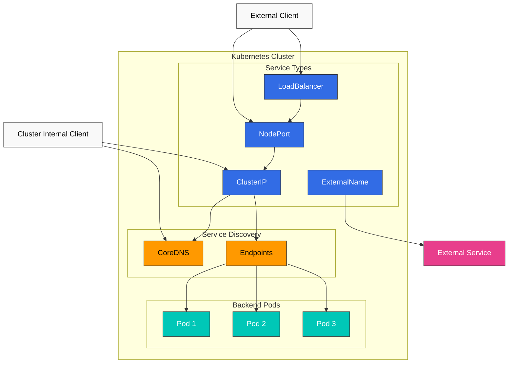
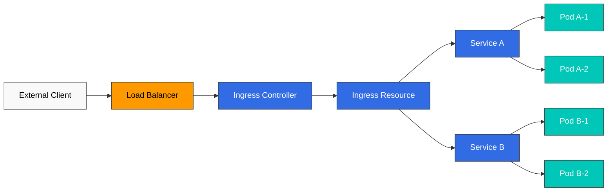
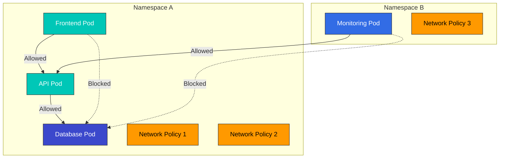
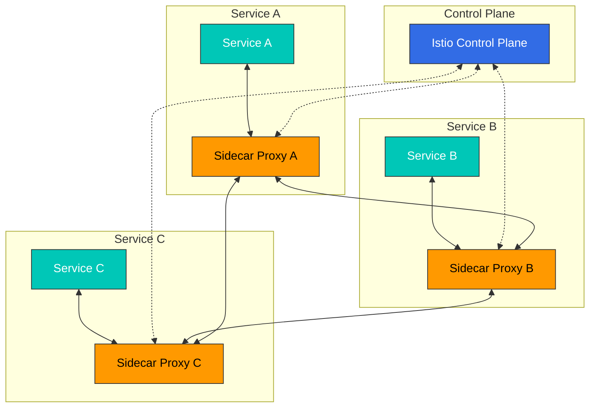
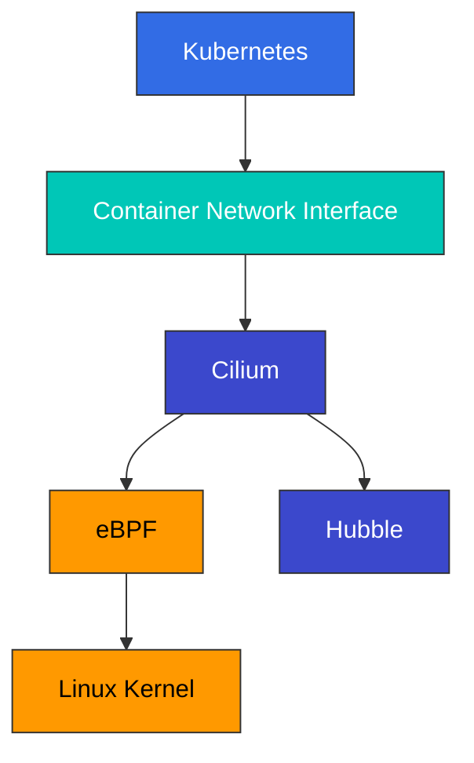

# Services 和 Networking

> **支持的版本**: Kubernetes 1.32, 1.33, 1.34
> **最后更新**: February 23, 2026

在 Kubernetes 中，Service（服务）是一个抽象层，为一组 Pod（容器组）提供单一访问点。在本章中，我们将详细探讨 Kubernetes networking 概念，包括各种 service 类型、Ingress、network policies 等内容。

## 实验环境设置

要跟随本文档中的示例进行操作，你需要以下工具和环境：

### 必需工具
- kubectl v1.34 或更高版本
- 可用的 Kubernetes cluster（EKS、minikube、kind 等）

### 部署示例应用程序

```bash
# Create namespace
kubectl create namespace networking-demo

# Deploy a simple application
kubectl -n networking-demo apply -f - <<EOF
apiVersion: apps/v1
kind: Deployment
metadata:
  name: web-app
  labels:
    app: web
spec:
  replicas: 3
  selector:
    matchLabels:
      app: web
  template:
    metadata:
      labels:
        app: web
    spec:
      containers:
      - name: nginx
        image: nginx:1.21
        ports:
        - containerPort: 80
---
apiVersion: v1
kind: Service
metadata:
  name: web-service
spec:
  selector:
    app: web
  ports:
  - port: 80
    targetPort: 80
  type: ClusterIP
EOF

# Verify services
kubectl -n networking-demo get svc,pods
```

## 目录

1. [Service 类型](#service-types)
2. [Ingress](#ingress)
3. [Endpoints](#endpoints)
4. [Service Discovery](#service-discovery)
5. [CoreDNS](#coredns)
6. [Network Policies](#network-policies)
7. [Service Mesh](#service-mesh)
8. [CNI (Container Network Interface)](#cnicontainer-network-interface)
9. [Cilium](#cilium)
   - [Cilium 简介](#introduction-to-cilium)
   - [eBPF 技术](#ebpf-technology)
   - [Cilium Networking 模型](#cilium-networking-model)
   - [Cilium Network Policies](#cilium-network-policies)
   - [使用 Hubble 实现网络可视化](#network-visibility-with-hubble)
   - [在 Amazon EKS 上配置 Cilium](#configuring-cilium-on-amazon-eks)

## Service 类型

> **关键概念**: Kubernetes Services 为一组 Pod 提供稳定的网络 endpoint，并通过多种类型控制内部和外部访问。

Kubernetes 提供多种类型的 services，以支持多种暴露应用程序的方式。

### Service 架构



### Service 类型比较

| Service Type | Access Scope | External IP | Use Case | Features |
|-------------|-------------|-------------|----------|----------|
| **ClusterIP** | Cluster 内部 | 否 | 内部 microservice 通信 | 默认 service 类型，仅可在 cluster 内访问 |
| **NodePort** | Cluster 外部 | 否 | 开发和测试环境 | 通过所有 node 上的特定端口 (30000-32767) 访问 |
| **LoadBalancer** | Cluster 外部 | 是 | 生产环境外部 services | 预置 cloud provider load balancer |
| **ExternalName** | Cluster 内部 | 否 | 外部 services 的内部别名 | 通过 DNS CNAME record 重定向 |
| **Headless** | Cluster 内部 | 否 | 需要直接访问 Pod IP 时 | 不带 ClusterIP 的特殊 service |

### ClusterIP

ClusterIP 是最基本的 service 类型，它提供一个仅可在 cluster 内访问的固定 IP 地址。

```yaml
apiVersion: v1
kind: Service
metadata:
  name: my-service
spec:
  selector:
    app: MyApp
  ports:
  - protocol: TCP
    port: 80
    targetPort: 9376
  type: ClusterIP  # Default, can be omitted
```

### NodePort

NodePort services 允许通过所有 node 上的特定端口访问 service。

```yaml
apiVersion: v1
kind: Service
metadata:
  name: my-service
spec:
  selector:
    app: MyApp
  ports:
  - protocol: TCP
    port: 80        # Port used within cluster
    targetPort: 9376 # Pod's port
    nodePort: 30007  # Port exposed on nodes (30000-32767)
  type: NodePort
```

ClusterIP 是默认 service 类型，提供一个仅可在 cluster 内访问的 IP 地址。

```yaml
apiVersion: v1
kind: Service
metadata:
  name: my-service
spec:
  selector:
    app: MyApp
  ports:
  - port: 80
    targetPort: 9376
  type: ClusterIP
```

此 service 可以在 cluster 内通过 `my-service:80` 访问。

### NodePort

NodePort services 允许通过所有 node 上的特定端口访问 service。

```yaml
apiVersion: v1
kind: Service
metadata:
  name: my-service
spec:
  selector:
    app: MyApp
  ports:
  - port: 80
    targetPort: 9376
    nodePort: 30007  # Optional, auto-assigned from 30000-32767 if not specified
  type: NodePort
```

此 service 可以在 cluster 中的所有 node 上通过 `<Node IP>:30007` 访问。

### LoadBalancer

LoadBalancer services 会从 cloud provider 预置 load balancer，以便对外暴露 service。

```yaml
apiVersion: v1
kind: Service
metadata:
  name: my-service
  annotations:
    service.beta.kubernetes.io/aws-load-balancer-type: nlb  # Use NLB on AWS
spec:
  selector:
    app: MyApp
  ports:
  - port: 80
    targetPort: 9376
  type: LoadBalancer
```

此 service 可以通过 cloud provider 的 load balancer 从外部访问。

### ExternalName

ExternalName services 为外部 services 提供别名。

```yaml
apiVersion: v1
kind: Service
metadata:
  name: my-service
spec:
  type: ExternalName
  externalName: my.database.example.com
```

此 service 将 DNS 名称 `my-service` 映射到 `my.database.example.com`。

### Headless Service

Headless service 是没有 cluster IP 的 service，它会为每个 Pod 创建 DNS records。

```yaml
apiVersion: v1
kind: Service
metadata:
  name: my-service
spec:
  clusterIP: None  # Headless service
  selector:
    app: MyApp
  ports:
  - port: 80
    targetPort: 9376
```

此 service 不分配 cluster IP，并为每个 Pod 创建 DNS records。

### External IP

Services 可以指定 external IP，将外部资源暴露为 Kubernetes services。

```yaml
apiVersion: v1
kind: Service
metadata:
  name: my-service
spec:
  selector:
    app: MyApp
  ports:
  - port: 80
    targetPort: 9376
  externalIPs:
  - 80.11.12.10
```

## Ingress

Ingress 是一个 API object，用于将 cluster 外部的 HTTP 和 HTTPS 路由暴露给 cluster 内部的 services。Ingress 提供 load balancing、SSL termination 和基于名称的 virtual hosting。



### Ingress Controller

要使用 Ingress resources，cluster 中必须运行一个 Ingress controller。Ingress controllers 有多种：

- NGINX Ingress Controller
- AWS ALB Ingress Controller
- GCE Ingress Controller
- Traefik
- HAProxy
- Istio Ingress

### Basic Ingress

```yaml
apiVersion: networking.k8s.io/v1
kind: Ingress
metadata:
  name: minimal-ingress
spec:
  ingressClassName: nginx  # Ingress controller class to use
  rules:
  - host: example.com
    http:
      paths:
      - path: /
        pathType: Prefix
        backend:
          service:
            name: example-service
            port:
              number: 80
```

此 Ingress 将发送到 `example.com` host 的所有请求路由到 `example-service:80`。

### 基于路径的 Routing

```yaml
apiVersion: networking.k8s.io/v1
kind: Ingress
metadata:
  name: path-based-ingress
spec:
  ingressClassName: nginx
  rules:
  - host: example.com
    http:
      paths:
      - path: /api
        pathType: Prefix
        backend:
          service:
            name: api-service
            port:
              number: 80
      - path: /web
        pathType: Prefix
        backend:
          service:
            name: web-service
            port:
              number: 80
```

此 Ingress 将以 `example.com/api` 开头的请求路由到 `api-service`，并将以 `example.com/web` 开头的请求路由到 `web-service`。

### 基于名称的 Virtual Hosting

```yaml
apiVersion: networking.k8s.io/v1
kind: Ingress
metadata:
  name: name-based-ingress
spec:
  ingressClassName: nginx
  rules:
  - host: foo.example.com
    http:
      paths:
      - path: /
        pathType: Prefix
        backend:
          service:
            name: foo-service
            port:
              number: 80
  - host: bar.example.com
    http:
      paths:
      - path: /
        pathType: Prefix
        backend:
          service:
            name: bar-service
            port:
              number: 80
```

此 Ingress 将发送到 `foo.example.com` 的请求路由到 `foo-service`，并将发送到 `bar.example.com` 的请求路由到 `bar-service`。

### TLS 配置

```yaml
apiVersion: networking.k8s.io/v1
kind: Ingress
metadata:
  name: tls-ingress
spec:
  ingressClassName: nginx
  tls:
  - hosts:
    - example.com
    secretName: example-tls
  rules:
  - host: example.com
    http:
      paths:
      - path: /
        pathType: Prefix
        backend:
          service:
            name: example-service
            port:
              number: 80
```

此 Ingress 使用存储在 `example-tls` secret 中的 TLS certificate 终止到 `example.com` 的 HTTPS connections。

TLS secret 创建：

```bash
kubectl create secret tls example-tls --cert=path/to/cert.crt --key=path/to/key.key
```

### AWS ALB Ingress Controller

在 AWS EKS 上，你可以使用 AWS ALB Ingress Controller 来预置 Application Load Balancers。

```yaml
apiVersion: networking.k8s.io/v1
kind: Ingress
metadata:
  name: alb-ingress
  annotations:
    kubernetes.io/ingress.class: alb
    alb.ingress.kubernetes.io/scheme: internet-facing
    alb.ingress.kubernetes.io/target-type: ip
    alb.ingress.kubernetes.io/listen-ports: '[{"HTTP": 80}, {"HTTPS": 443}]'
    alb.ingress.kubernetes.io/certificate-arn: arn:aws:acm:region:account-id:certificate/certificate-id
spec:
  rules:
  - host: example.com
    http:
      paths:
      - path: /
        pathType: Prefix
        backend:
          service:
            name: example-service
            port:
              number: 80
```

此 Ingress 使用 AWS ALB 处理发送到 `example.com` 的请求。

## Endpoints

Endpoints 是一种 resource，用于存储 service 指向的 Pod 的 IP 地址和端口。当存在匹配 service selector 的 Pod 时，Kubernetes 会自动创建并管理 Endpoints object。

```yaml
apiVersion: v1
kind: Endpoints
metadata:
  name: my-service
subsets:
- addresses:
  - ip: 192.168.1.1
  ports:
  - port: 9376
```

此 Endpoints 使 `my-service` 指向 `192.168.1.1:9376`。

### EndpointSlice

EndpointSlice 是 Endpoints 的可扩展替代方案，可在大型 clusters 中提供更好的性能。

```yaml
apiVersion: discovery.k8s.io/v1
kind: EndpointSlice
metadata:
  name: my-service-abc
  labels:
    kubernetes.io/service-name: my-service
addressType: IPv4
ports:
- name: http
  protocol: TCP
  port: 80
endpoints:
- addresses:
  - "10.1.2.3"
  conditions:
    ready: true
  hostname: pod-1
  topology:
    kubernetes.io/hostname: node-1
    topology.kubernetes.io/zone: us-west-2a
```

## Service Discovery

Kubernetes 提供两种主要的 service discovery 方法：

1. **Environment Variables**: Kubernetes 会在 Pod 创建时，将活动 services 的 environment variables 注入到 Pod 中。
2. **DNS**: Kubernetes 通过 cluster DNS server 为 services 提供 DNS records。

### Environment Variables

创建 Pod 时，Kubernetes 会将当时存在的所有 services 的 environment variables 注入到 Pod 中。例如，如果有一个名为 `my-service` 的 service，则会创建以下 environment variables：

```
MY_SERVICE_SERVICE_HOST=10.0.0.11
MY_SERVICE_SERVICE_PORT=80
```

### DNS

Kubernetes DNS 会为 services 创建 DNS records。Pod 可以使用 service 名称访问 services。

- Regular service: `my-service.my-namespace.svc.cluster.local`
- Pod of headless service: `pod-name.my-service.my-namespace.svc.cluster.local`

## CoreDNS

CoreDNS 是一个灵活且可扩展的 DNS server，用作 Kubernetes clusters 的 DNS server。

### CoreDNS 配置

CoreDNS 通过 ConfigMap 进行配置：

```yaml
apiVersion: v1
kind: ConfigMap
metadata:
  name: coredns
  namespace: kube-system
data:
  Corefile: |
    .:53 {
        errors
        health {
            lameduck 5s
        }
        ready
        kubernetes cluster.local in-addr.arpa ip6.arpa {
            pods insecure
            fallthrough in-addr.arpa ip6.arpa
            ttl 30
        }
        prometheus :9153
        forward . /etc/resolv.conf
        cache 30
        loop
        reload
        loadbalance
    }
```

此配置提供以下功能：

- `errors`: Error logging
- `health`: Health check endpoint
- `ready`: Readiness check endpoint
- `kubernetes`: Kubernetes services 和 Pods 的 DNS records
- `prometheus`: Prometheus metrics 暴露
- `forward`: 转发外部 DNS queries
- `cache`: DNS response caching
- `loop`: Loop detection
- `reload`: 配置文件变更时自动 reload
- `loadbalance`: Load balancing

### DNS Policy

Pod 的 DNS policy 可以通过 `dnsPolicy` 字段进行配置：

- `ClusterFirst`: 默认值，优先使用 Kubernetes DNS server；如果没有匹配项，则转发到 upstream nameservers。
- `Default`: 继承运行该 Pod 的 node 的 DNS settings。
- `ClusterFirstWithHostNet`: 对于带有 `hostNetwork: true` 的 Pods，推荐使用此 policy。
- `None`: 必须通过 `dnsConfig` 字段提供所有 DNS settings。

```yaml
apiVersion: v1
kind: Pod
metadata:
  name: custom-dns
spec:
  containers:
  - name: nginx
    image: nginx
  dnsPolicy: "None"
  dnsConfig:
    nameservers:
    - 1.1.1.1
    - 8.8.8.8
    searches:
    - ns1.svc.cluster.local
    - my.dns.search.suffix
    options:
    - name: ndots
      value: "2"
    - name: edns0
```

## Network Policies

Network policies 提供一种控制 Pods 之间通信的方式。要使用 network policies，network plugin 必须支持它们（例如 Calico、Cilium、Weave Net）。



### Basic Network Policy

```yaml
apiVersion: networking.k8s.io/v1
kind: NetworkPolicy
metadata:
  name: default-deny-ingress
spec:
  podSelector: {}  # Applies to all Pods
  policyTypes:
  - Ingress
```

此 network policy 会阻止到所有 Pods 的 ingress traffic。

### 允许到特定 Pods 的 Ingress

```yaml
apiVersion: networking.k8s.io/v1
kind: NetworkPolicy
metadata:
  name: allow-nginx-ingress
spec:
  podSelector:
    matchLabels:
      app: nginx
  policyTypes:
  - Ingress
  ingress:
  - from:
    - podSelector:
        matchLabels:
          access: allowed
    ports:
    - protocol: TCP
      port: 80
```

此 network policy 允许来自带有 `access: allowed` label 的 Pods 的 TCP 端口 80 ingress traffic 到带有 `app: nginx` label 的 Pods。

### 基于 Namespace 的 Policy

```yaml
apiVersion: networking.k8s.io/v1
kind: NetworkPolicy
metadata:
  name: allow-from-prod-namespace
spec:
  podSelector:
    matchLabels:
      app: db
  policyTypes:
  - Ingress
  ingress:
  - from:
    - namespaceSelector:
        matchLabels:
          purpose: production
```

此 network policy 允许来自带有 `purpose: production` label 的 namespaces 中所有 Pods 的 ingress traffic 到带有 `app: db` label 的 Pods。

### Egress Policy

```yaml
apiVersion: networking.k8s.io/v1
kind: NetworkPolicy
metadata:
  name: limit-egress
spec:
  podSelector:
    matchLabels:
      app: frontend
  policyTypes:
  - Egress
  egress:
  - to:
    - podSelector:
        matchLabels:
          app: api
    ports:
    - protocol: TCP
      port: 8080
  - to:
    - namespaceSelector:
        matchLabels:
          purpose: monitoring
```

此 network policy 允许带有 `app: frontend` label 的 Pods 的 egress traffic 到带有 `app: api` label 的 Pods 上的 TCP 端口 8080，并允许其到带有 `purpose: monitoring` label 的 namespaces 中的所有 Pods。

### 基于 CIDR 的 Policy

```yaml
apiVersion: networking.k8s.io/v1
kind: NetworkPolicy
metadata:
  name: allow-external-traffic
spec:
  podSelector:
    matchLabels:
      app: web
  policyTypes:
  - Ingress
  ingress:
  - from:
    - ipBlock:
        cidr: 192.168.1.0/24
        except:
        - 192.168.1.1/32
```

此 network policy 允许来自 `192.168.1.0/24` CIDR block（排除 192.168.1.1）的 ingress traffic 到带有 `app: web` label 的 Pods。

## Service Mesh

Service mesh（服务网格）是一个 infrastructure layer，用于管理 microservices 之间的通信。Service meshes 提供 service discovery、load balancing、encryption、authentication、authorization 和 observability 等功能。



### Istio

Istio 是常用的 service mesh 实现之一。Istio 使用 sidecar pattern 将 Envoy proxies 注入到每个 Pod 中。

#### Istio Virtual Service

```yaml
apiVersion: networking.istio.io/v1alpha3
kind: VirtualService
metadata:
  name: reviews
spec:
  hosts:
  - reviews
  http:
  - match:
    - headers:
        end-user:
          exact: jason
    route:
    - destination:
        host: reviews
        subset: v2
  - route:
    - destination:
        host: reviews
        subset: v1
```

此 VirtualService 将带有 `end-user: jason` header 的请求路由到 `reviews` service 的 `v2` subset，并将所有其他请求路由到 `v1` subset。

#### Istio Destination Rule

```yaml
apiVersion: networking.istio.io/v1alpha3
kind: DestinationRule
metadata:
  name: reviews
spec:
  host: reviews
  trafficPolicy:
    loadBalancer:
      simple: RANDOM
  subsets:
  - name: v1
    labels:
      version: v1
  - name: v2
    labels:
      version: v2
    trafficPolicy:
      loadBalancer:
        simple: ROUND_ROBIN
```

此 DestinationRule 为 `reviews` service 定义两个 subsets（`v1` 和 `v2`），并为每个 subset 设置 load balancing policies。

### Linkerd

Linkerd 是一个轻量级 service mesh，其特点是安装和使用简单。

#### Linkerd Service Profile

```yaml
apiVersion: linkerd.io/v1alpha2
kind: ServiceProfile
metadata:
  name: nginx.default.svc.cluster.local
  namespace: default
spec:
  routes:
  - name: GET /
    condition:
      method: GET
      pathRegex: /
    responseClasses:
    - condition:
        status:
          min: 500
          max: 599
      isFailure: true
  retryBudget:
    retryRatio: 0.2
    minRetriesPerSecond: 10
    ttl: 10s
```

此 ServiceProfile 为 `nginx` service 定义 routes 和 retry policies。

## Cilium



[Cilium 详情](../networking/cilium/README.md)

### Cilium 简介

Cilium 是开源软件，利用 Linux kernel 中强大的 eBPF technology，为 containerized applications 提供 network connectivity、security 和 observability。它旨在为 Kubernetes、Docker、Mesos 等 container orchestration platforms 提供 networking、security 和 observability。

#### 关键特性

- **基于 eBPF**: 通过 kernel 内的 programmable data path 提供高性能 networking 和 security 功能
- **API-aware Networking**: 支持 L3-L7 layers 的 API-aware network security policies
- **Kubernetes 集成**: 提供 Kubernetes CNI (Container Network Interface) 实现
- **Distributed Load Balancing**: 为高效的 service-to-service 通信提供 distributed load balancing
- **Network Visibility**: 通过 Hubble 进行 network flow monitoring 和 troubleshooting
- **Multi-cluster Support**: 支持 cross-cluster networking 和 security policies

#### Cilium 的差异化特点

与其他 CNI solutions 相比，Cilium 提供多个独特优势。

**技术差异化**:
- **eBPF Utilization**: 通过 kernel 内的 programmable data path 实现高性能和灵活性
- **API-aware Networking**: 支持最高到 L7 layer 的 network policy
- **XDP (eXpress Data Path)**: Packet processing 性能优化
- **Kube-proxy Replacement**: 更高效的 service load balancing
- **Hubble Integration**: 强大的 network observability 工具

**按用例划分的收益**:
- **Microservice Architecture**: 细粒度 network policies 和 observability
- **Multi-cluster Deployment**: 跨 clusters 的无缝 networking
- **Security-focused Environment**: 健壮的 network security policies
- **High-performance Requirements**: 优化的 data path
- **Service Mesh Integration**: 与 Istio 等 service meshes 集成

### eBPF 技术

eBPF (extended Berkeley Packet Filter) 是一种允许程序在 Linux kernel 内安全运行的技术。Cilium 使用 eBPF 实现 networking、security 和 observability 功能。

#### eBPF 的关键特性

1. **In-kernel Execution**: eBPF programs 直接在 kernel 内执行，提供高性能。
2. **Safety**: eBPF verifier 确保 programs 不会损坏 kernel。
3. **Dynamic Loading**: eBPF programs 可以在不重启 kernel 的情况下加载和卸载。
4. **Maps**: eBPF maps 用于存储数据，并在 user space 和 kernel space 之间共享数据。

#### Cilium 中的 eBPF 使用方式

Cilium 通过以下方式使用 eBPF：

1. **Network Data Path**: eBPF programs 处理和路由 network packets。
2. **Policy Enforcement**: eBPF programs 执行 network policies。
3. **Load Balancing**: eBPF programs 为 services 执行 load balancing。
4. **Observability**: eBPF programs 收集 network flows 的 metrics。

#### eBPF 与传统 Networking 方法对比

| Feature | eBPF | Traditional Approach (iptables) |
|---------|------|--------------------------------|
| Performance | 非常高 | 中等 |
| Scalability | 非常高 | 有限 |
| Programmability | 高 | 有限 |
| Observability | 高 | 有限 |
| Implementation Complexity | 高 | 中等 |

### Cilium Networking 模型

Cilium 支持多种 networking models，可根据不同环境和需求进行配置。

#### Overlay Networking

Cilium 默认使用 VXLAN 实现 overlay networking，但也支持 Geneve 等其他 encapsulation protocols。

**工作原理**:
1. Packets 在源 node 上创建。
2. Cilium 通过使用 encapsulation headers 包装原始 packet 来封装该 packet。
3. Encapsulated packet 通过 physical network 传输到目标 node。
4. 在目标 node 上，Cilium 解封装该 packet，以提取原始 packet。
5. 提取出的 packet 被传递到目标 container。

**优势**:
- 与现有 network infrastructure 兼容
- 不依赖 network topology
- 防止 multi-cluster environments 中的 IP 冲突

**劣势**:
- Encapsulation overhead 导致性能影响
- MTU size 减小
- 额外 CPU usage

#### Native Routing

Native routing 使用不带封装的 direct routing。在此模式下，底层 network infrastructure 必须能够路由 Pod IP addresses。

**工作原理**:
1. 每个 node 通告运行在该 node 上的 Pods 的 CIDR block。
2. 配置 routing tables，将每个 Pod CIDR block 路由到对应 node。
3. Packets 不经封装，直接路由到目标 node。

**优势**:
- 无 encapsulation overhead
- 提升 network performance
- 更低 CPU usage

**劣势**:
- 依赖底层 network infrastructure
- Network topology constraints
- IP address management complexity

#### Hybrid Mode

Cilium 还支持结合 overlay networking 和 native routing 的 hybrid mode。

**工作原理**:
1. 在可能时使用 native routing。
2. 当 native routing 不可用时，回退到 overlay networking。

**优势**:
- 灵活性与性能之间的平衡
- 支持多种 network topologies
- 可逐步迁移

#### AWS ENI Mode

在 AWS EKS 上，Cilium 可以利用 AWS Elastic Network Interfaces (ENIs) 为 Pods 分配 native VPC IP addresses。

**关键特性**:
- 为 Pods 分配 VPC native IP addresses
- 无 overlay network 的 VPC native networking
- AWS security groups 和 network policy 集成
- 提升 network performance

### Cilium Network Policies

Cilium 扩展了 Kubernetes network policies，以在 L3-L7 layers 提供细粒度 network security policies。

#### L3/L4 Policies

Cilium 支持标准 Kubernetes network policies，以基于 IP addresses、ports 和 protocols 定义 policies。

```yaml
apiVersion: "cilium.io/v2"
kind: CiliumNetworkPolicy
metadata:
  name: "l3-l4-policy"
spec:
  endpointSelector:
    matchLabels:
      app: myapp
  ingress:
  - fromEndpoints:
    - matchLabels:
        app: frontend
    toPorts:
    - ports:
      - port: "80"
        protocol: TCP
```

此 policy 允许来自带有 `app: frontend` label 的 Pods 的 TCP 端口 80 ingress traffic 到带有 `app: myapp` label 的 Pods。

#### L7 Policies

Cilium 支持 L7（application layer）policies，用于为 HTTP、gRPC 和 Kafka 等 protocols 定义细粒度 policies。

```yaml
apiVersion: "cilium.io/v2"
kind: CiliumNetworkPolicy
metadata:
  name: "l7-policy"
spec:
  endpointSelector:
    matchLabels:
      app: myapp
  ingress:
  - fromEndpoints:
    - matchLabels:
        app: frontend
    toPorts:
    - ports:
      - port: "80"
        protocol: TCP
      rules:
        http:
        - method: "GET"
          path: "/api/v1/products"
```

此 policy 仅允许来自带有 `app: frontend` label 的 Pods 的 HTTP GET 请求访问带有 `app: myapp` label 的 Pods 上的 `/api/v1/products` path。

#### Cluster-wide Policies

Cilium 支持 cluster-wide network policies，用于定义适用于所有 Pods 的 policies。

```yaml
apiVersion: "cilium.io/v2"
kind: CiliumClusterwideNetworkPolicy
metadata:
  name: "cluster-wide-policy"
spec:
  endpointSelector:
    matchLabels: {}  # Applies to all Pods
  ingress:
  - fromEndpoints:
    - matchLabels:
        io.kubernetes.pod.namespace: kube-system
```

此 policy 允许来自 `kube-system` namespace 中 Pods 的 ingress traffic 到所有 Pods。

### 使用 Hubble 实现网络可视化

Hubble 是 Cilium 的 observability layer，使用 eBPF 监控 network flows 并排查问题。

#### Hubble 的关键特性

1. **Network Flow Monitoring**: 实时监控 Pod-to-Pod 通信。
2. **Service Dependency Mapping**: 可视化 service-to-service 依赖关系。
3. **Security Observation**: 检测 network policy violations。
4. **Performance Analysis**: 分析 network latency 和 throughput。
5. **Troubleshooting**: 诊断 network connectivity 问题。

#### Hubble 架构

Hubble 由以下组件组成：

1. **Hubble Server**: 嵌入 Cilium agent 的 server，用于收集 network flow data。
2. **Hubble Relay**: 聚合来自多个 Hubble Servers 的数据。
3. **Hubble UI**: 用于可视化 network flows 的 Web interface。
4. **Hubble CLI**: 用于查询 network flows 的 command-line tool。

#### Hubble 使用示例

```bash
# Install Hubble CLI
curl -L --remote-name-all https://github.com/cilium/hubble/releases/latest/download/hubble-linux-amd64.tar.gz
sudo tar xzvfC hubble-linux-amd64.tar.gz /usr/local/bin
rm hubble-linux-amd64.tar.gz

# Enable Hubble
cilium hubble enable

# Observe network flows
hubble observe

# Observe HTTP requests
hubble observe --protocol http

# Observe network flows for specific Pod
hubble observe --pod app=myapp

# Observe network policy violations
hubble observe --verdict DROPPED
```

### 在 Amazon EKS 上配置 Cilium

在 Amazon EKS 上配置 Cilium 有多种方式。这里我们将介绍一些常见配置方法。

#### 基本安装

```bash
# Install Cilium CLI
curl -L --remote-name-all https://github.com/cilium/cilium-cli/releases/latest/download/cilium-linux-amd64.tar.gz
sudo tar xzvfC cilium-linux-amd64.tar.gz /usr/local/bin
rm cilium-linux-amd64.tar.gz

# Install Cilium
cilium install

# Check installation status
cilium status

# Test connectivity
cilium connectivity test
```

#### AWS ENI Mode 配置

```bash
# Install Cilium with AWS ENI mode
cilium install --config aws-eni-mode=true

# Or install using Helm
helm install cilium cilium/cilium \
  --namespace kube-system \
  --set eni.enabled=true \
  --set ipam.mode=eni \
  --set egressMasqueradeInterfaces=eth0 \
  --set tunnel=disabled
```

#### 启用 Hubble

```bash
# Enable Hubble
cilium hubble enable --ui

# Access Hubble UI
kubectl port-forward -n kube-system svc/hubble-ui 12000:80
```

#### Cilium Network Policy 示例

```yaml
apiVersion: "cilium.io/v2"
kind: CiliumNetworkPolicy
metadata:
  name: "eks-app-policy"
spec:
  endpointSelector:
    matchLabels:
      app: api
  ingress:
  - fromEndpoints:
    - matchLabels:
        app: frontend
    toPorts:
    - ports:
      - port: "8080"
        protocol: TCP
      rules:
        http:
        - method: "GET"
          path: "/api/v1/.*"
  egress:
  - toEndpoints:
    - matchLabels:
        app: database
    toPorts:
    - ports:
      - port: "3306"
        protocol: TCP
```

此 policy 仅允许来自带有 `app: frontend` label 的 Pods 的 HTTP GET 请求访问带有 `app: api` label 的 Pods 上的 `/api/v1/` path，并允许带有 `app: api` label 的 Pods 的 egress traffic 到带有 `app: database` label 的 Pods 上的 TCP 端口 3306。

#### EKS 上的 Cilium 优化

1. **Node Group 配置**:
   - 选择提供足够 ENIs 和 IP addresses 的 instance types
   - 配置适当的最大 Pod 数量

2. **性能优化**:
   - 使用 direct routing mode
   - 启用 XDP acceleration
   - 启用 BBR congestion control algorithm

3. **Monitoring 和 Logging**:
   - 启用 Hubble
   - Prometheus metrics collection
   - 与 CloudWatch 集成

## 结论

在本章中，我们学习了 Kubernetes services 和 networking。Services 为一组 Pods 提供稳定 endpoints，Ingress 将外部 traffic 路由到 cluster 内的 services。Network policies 控制 Pods 之间的通信，service meshes 在 microservice architectures 中管理 service-to-service 通信。我们还探讨了如何通过 CNI 和 Cilium 实现高级 networking 功能。

理解并使用 Kubernetes networking 功能，可以帮助你构建安全且可扩展的应用程序。

在下一章中，我们将学习 Kubernetes storage options。

## 参考资料

- [Kubernetes Official Documentation - Services](https://kubernetes.io/docs/concepts/services-networking/service/)
- [Kubernetes Official Documentation - Ingress](https://kubernetes.io/docs/concepts/services-networking/ingress/)
- [Kubernetes Official Documentation - Network Policies](https://kubernetes.io/docs/concepts/services-networking/network-policies/)
- [Kubernetes Official Documentation - DNS for Services and Pods](https://kubernetes.io/docs/concepts/services-networking/dns-pod-service/)
- [Istio Official Documentation](https://istio.io/latest/docs/)
- [Linkerd Official Documentation](https://linkerd.io/2.11/overview/)
- [Cilium Official Documentation](https://docs.cilium.io/)
- [CNI Official Documentation](https://github.com/containernetworking/cni)

## Quiz

要测试你在本章中学到的内容，请尝试 [Services and Networking Quiz](../quizzes/core/03-services-networking-quiz.md)。
