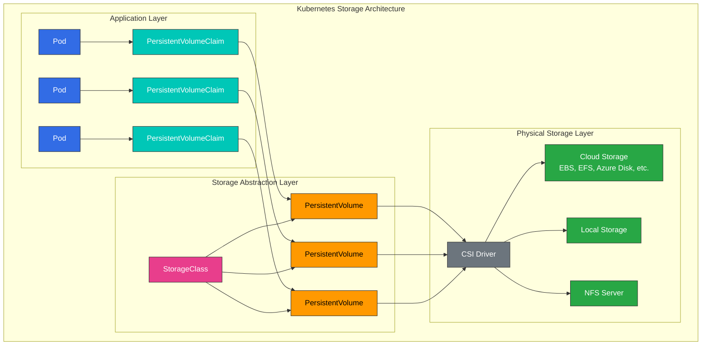
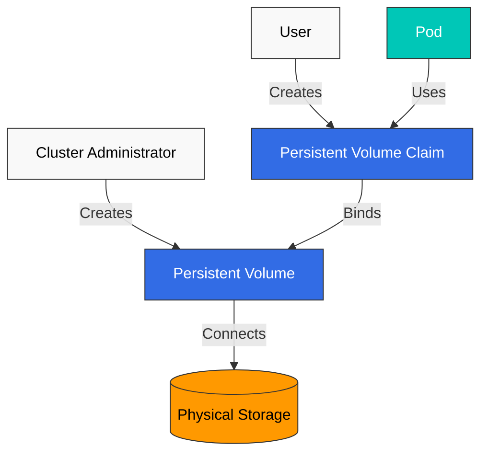
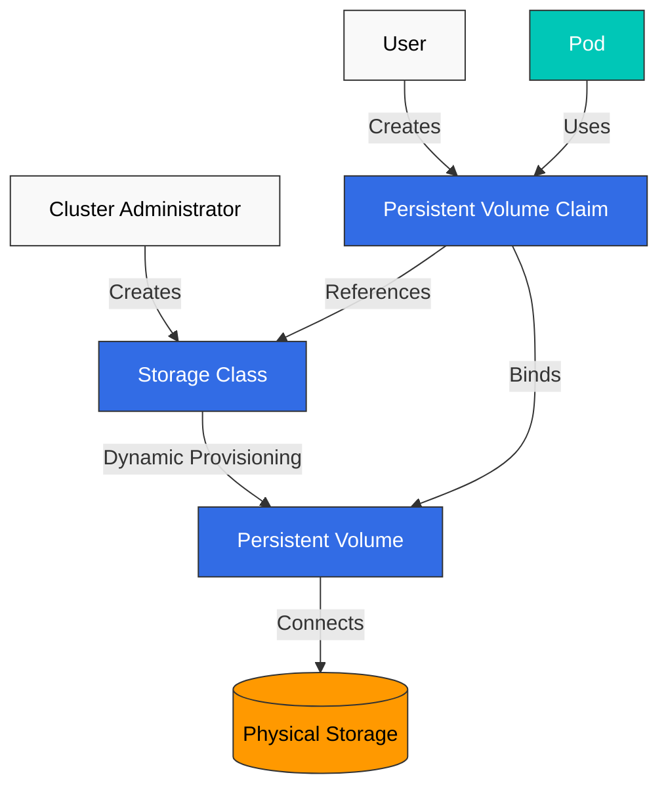
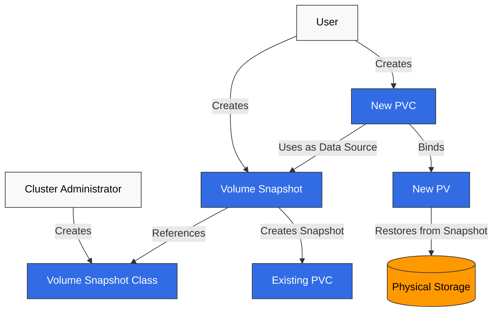
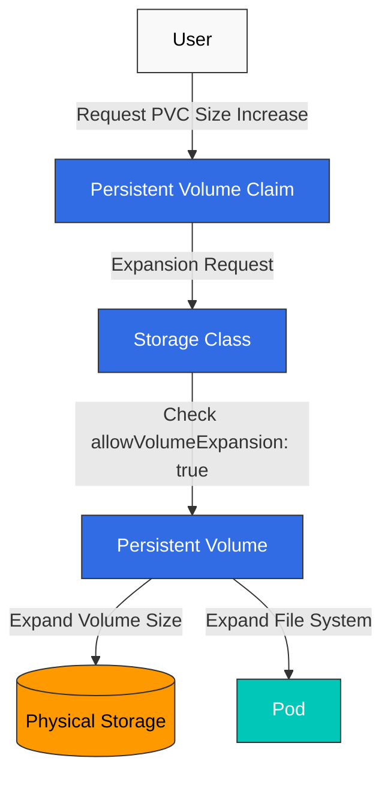
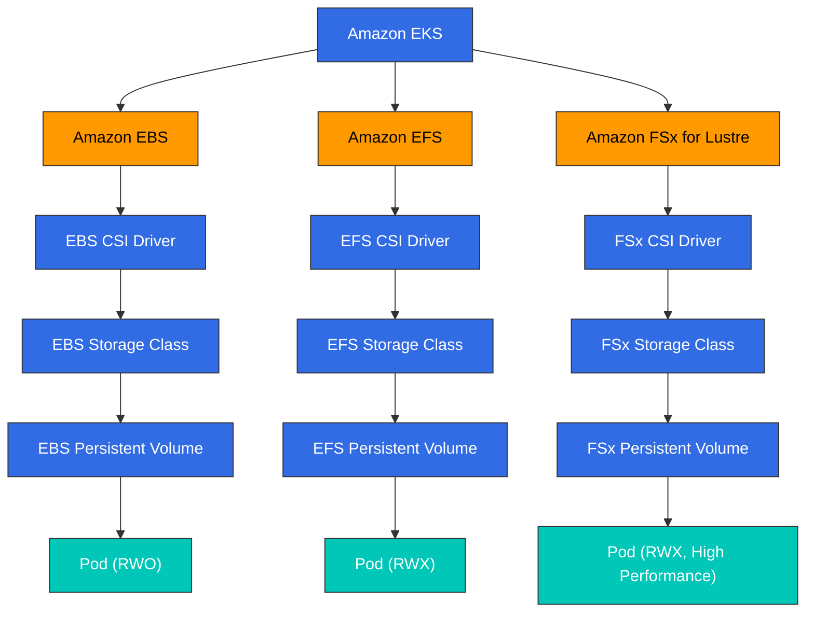

# 存储

> **支持的版本**: Kubernetes 1.32, 1.33, 1.34
> **最后更新**: February 19, 2026

在 Kubernetes 中，存储是为容器化应用程序存放和管理数据的重要组成部分。在本章中，我们将详细探讨 Kubernetes 存储概念，包括 Volumes（卷）、Persistent Volumes（持久卷）、Persistent Volume Claims（持久卷声明）和 Storage Classes（存储类）。

## 实验环境设置

要跟随本文档中的示例进行操作，你需要以下工具和环境：

### 必需工具
- kubectl v1.34 或更高版本
- 可用的 Kubernetes cluster（EKS、minikube、kind 等）
- Storage provisioner（EKS 的 EBS CSI driver）

### 存储示例设置

```bash
# Create namespace
kubectl create namespace storage-demo

# Create a simple PVC and Pod
kubectl -n storage-demo apply -f - <<EOF
apiVersion: v1
kind: PersistentVolumeClaim
metadata:
  name: data-pvc
spec:
  accessModes:
    - ReadWriteOnce
  resources:
    requests:
      storage: 1Gi
---
apiVersion: v1
kind: Pod
metadata:
  name: data-pod
spec:
  containers:
  - name: data-container
    image: busybox
    command: ["sh", "-c", "while true; do echo \$(date) >> /data/output.txt; sleep 5; done"]
    volumeMounts:
    - name: data-volume
      mountPath: /data
  volumes:
  - name: data-volume
    persistentVolumeClaim:
      claimName: data-pvc
EOF

# Check storage resources
kubectl -n storage-demo get pvc,pod
```

## 目录

1. [Volumes（卷）](#volumes)
2. [Persistent Volumes（持久卷）](#persistent-volumes)
3. [Persistent Volume Claims（持久卷声明）](#persistent-volume-claims)
4. [Storage Classes（存储类）](#storage-classes)
5. [动态供应](#dynamic-provisioning)
6. [Volume Snapshots（卷快照）](#volume-snapshots)
7. [Volume Expansion（卷扩容）](#volume-expansion)
8. [Projected Volumes（投射卷）](#projected-volumes)
9. [Generic Ephemeral Volumes（通用临时卷）](#generic-ephemeral-volumes)
10. [Block Volume Mode（块卷模式）](#block-volume-mode)
11. [Volume Cloning（卷克隆）](#volume-cloning)
12. [Storage ResourceQuota](#storage-resourcequota)
13. [EKS 中的存储选项](#storage-options-in-eks)

## Volumes（卷）

> **关键概念**: Kubernetes Volumes 是 Pod 中的容器可以存储和共享数据的目录，即使容器重启也能保留数据。

Kubernetes Volumes 是 Pod 中的容器可以存储和共享数据的目录。Volumes 与 Pod 的生命周期绑定，当 Pod 被删除时，volume 也会被删除（某些 volume 类型除外）。

### Kubernetes 存储架构



### 为什么需要 Volumes

1. **容器重启时的数据持久性**: 当容器重启时，其文件系统会被重置，但使用 volumes 可以让数据保留下来。
2. **容器之间的数据共享**: 同一个 Pod 中的多个容器可以通过 volumes 共享数据。

### 主要 Volume 类型比较

| Volume Type | Lifecycle | Data Persistence | Use Case | Features |
|------------|----------|-----------------|----------|----------|
| **emptyDir** | Pod | 临时 | 临时数据、缓存、检查点 | Pod 被删除时数据会被删除 |
| **hostPath** | Node | Node 级别 | 访问 Node 文件系统、监控 | 存在安全风险 - 请谨慎使用 |
| **configMap** | 配置 | 配置数据 | 应用程序配置 | 将配置数据作为 volume 挂载 |
| **secret** | 配置 | 敏感数据 | 证书、密码 | 将敏感数据作为 volume 挂载 |
| **persistentVolumeClaim** | Cluster | 永久 | 数据库、文件存储 | Pod 重启和重新调度后数据仍会保留 |

### emptyDir

当 Pod 被分配到某个 node 时，会创建 `emptyDir` volume，并且在该 Pod 在该 node 上运行期间一直存在。当 Pod 从该 node 移除时，`emptyDir` 中的数据会被永久删除。

```yaml
apiVersion: v1
kind: Pod
metadata:
  name: test-pd
spec:
  containers:
  - image: nginx
    name: test-container
    volumeMounts:
    - mountPath: /cache
      name: cache-volume
  volumes:
  - name: cache-volume
    emptyDir: {}
```

### hostPath

`hostPath` volume 会将 node 文件系统中的文件或目录挂载到 Pod。这对需要访问 node 文件系统的 Pods 很有用，但由于存在安全风险，应谨慎使用。

```yaml
apiVersion: v1
kind: Pod
metadata:
  name: test-hostpath
spec:
  containers:
  - image: nginx
    name: test-container
    volumeMounts:
    - mountPath: /test-pd
      name: test-volume
  volumes:
  - name: test-volume
    hostPath:
      path: /data
      type: Directory  # DirectoryOrCreate, Directory, FileOrCreate, File, Socket, CharDevice, BlockDevice
```

```yaml
apiVersion: v1
kind: Pod
metadata:
  name: test-pd
spec:
  containers:
  - image: nginx
    name: test-container
    volumeMounts:
    - mountPath: /test-pd
      name: test-volume
  volumes:
  - name: test-volume
    hostPath:
      path: /data
      type: Directory
```

#### configMap

`configMap` volume 会将 ConfigMap 数据挂载到 Pod。ConfigMaps 用于以键值对形式存储配置数据。

```yaml
apiVersion: v1
kind: Pod
metadata:
  name: configmap-pod
spec:
  containers:
  - name: test
    image: busybox
    volumeMounts:
    - name: config-vol
      mountPath: /etc/config
  volumes:
  - name: config-vol
    configMap:
      name: log-config
      items:
      - key: log_level
        path: log_level
```

#### secret

`secret` volume 会将 Secret 数据挂载到 Pod。Secrets 用于存储密码、令牌和密钥等敏感信息。

```yaml
apiVersion: v1
kind: Pod
metadata:
  name: secret-pod
spec:
  containers:
  - name: test
    image: busybox
    volumeMounts:
    - name: secret-vol
      mountPath: /etc/secret
      readOnly: true
  volumes:
  - name: secret-vol
    secret:
      secretName: mysecret
      items:
      - key: username
        path: my-username
```

#### nfs

`nfs` volume 会将现有的 NFS (Network File System) 共享挂载到 Pod。

```yaml
apiVersion: v1
kind: Pod
metadata:
  name: nfs-pod
spec:
  containers:
  - name: test
    image: busybox
    volumeMounts:
    - name: nfs-vol
      mountPath: /mnt/nfs
  volumes:
  - name: nfs-vol
    nfs:
      server: nfs-server.example.com
      path: /share
```

#### persistentVolumeClaim

`persistentVolumeClaim` volume 会将 PersistentVolumeClaim 挂载到 Pod。这是最常用的 volume 类型之一。

```yaml
apiVersion: v1
kind: Pod
metadata:
  name: pvc-pod
spec:
  containers:
  - name: test
    image: busybox
    volumeMounts:
    - name: pvc-vol
      mountPath: /mnt/pvc
  volumes:
  - name: pvc-vol
    persistentVolumeClaim:
      claimName: my-pvc
```

#### CSI (Container Storage Interface)

CSI volumes 在 Kubernetes 和外部存储系统之间提供标准接口。使用 CSI，存储供应商可以在不修改 Kubernetes 代码的情况下开发自己的存储驱动程序。

```yaml
apiVersion: v1
kind: Pod
metadata:
  name: csi-pod
spec:
  containers:
  - name: test
    image: busybox
    volumeMounts:
    - name: csi-vol
      mountPath: /mnt/csi
  volumes:
  - name: csi-vol
    csi:
      driver: csi-driver.example.com
      volumeAttributes:
        foo: bar
      nodePublishSecretRef:
        name: csi-secret
```

## Persistent Volumes（持久卷）

Persistent Volume (PV) 是由管理员预置或使用 Storage Class 动态预置的 cluster 存储。PV 的生命周期独立于 Pods，即使 Pods 被删除，PV 也会保留。



### PV 创建

```yaml
apiVersion: v1
kind: PersistentVolume
metadata:
  name: pv0001
spec:
  capacity:
    storage: 5Gi
  volumeMode: Filesystem
  accessModes:
    - ReadWriteOnce
  persistentVolumeReclaimPolicy: Recycle
  storageClassName: slow
  mountOptions:
    - hard
    - nfsvers=4.1
  nfs:
    path: /tmp
    server: 172.17.0.2
```

### PV Access Modes

PVs 支持以下 access modes：

- **ReadWriteOnce (RWO)**: Volume 可以被单个 node 以读写方式挂载。
- **ReadOnlyMany (ROX)**: Volume 可以被多个 nodes 以只读方式挂载。
- **ReadWriteMany (RWX)**: Volume 可以被多个 nodes 以读写方式挂载。
- **ReadWriteOncePod (RWOP)**: Volume 可以被单个 Pod 以读写方式挂载（Kubernetes 1.22+）。

### PV Reclaim Policies

PVs 可以具有以下 reclaim policies：

- **Retain**: PVC 被删除时，PV 和数据会保留。管理员必须手动清理。
- **Delete**: PVC 被删除时，PV 和外部存储资产会自动删除。
- **Recycle**: PVC 被删除时，PV 中的数据会被删除，PV 重新变为可用（已弃用）。

### PV 状态

PVs 可以具有以下状态：

- **Available**: 资源可用，尚未绑定到 claim。
- **Bound**: 已绑定到 claim。
- **Released**: Claim 已被删除，但资源尚未被 cluster 回收。
- **Failed**: 自动回收失败。

## Persistent Volume Claims（持久卷声明）

Persistent Volume Claim (PVC) 是用户的存储请求。PVCs 类似于 PVs，但 PVCs 是用户请求存储的方式，而 PVs 是管理员提供存储的方式。

### PVC 创建

```yaml
apiVersion: v1
kind: PersistentVolumeClaim
metadata:
  name: myclaim
spec:
  accessModes:
    - ReadWriteOnce
  volumeMode: Filesystem
  resources:
    requests:
      storage: 8Gi
  storageClassName: slow
  selector:
    matchLabels:
      release: "stable"
    matchExpressions:
      - {key: environment, operator: In, values: [dev]}
```

### PVC 和 PV 绑定

创建 PVC 时，Kubernetes 会查找并绑定满足 PVC 要求（存储大小、access modes、storage class、selector 等）的 PV。如果没有合适的 PV，PVC 会保持 Pending 状态。

### 使用 PVC

PVCs 可以作为 volumes 在 Pods 中使用：

```yaml
apiVersion: v1
kind: Pod
metadata:
  name: mypod
spec:
  containers:
    - name: myfrontend
      image: nginx
      volumeMounts:
      - mountPath: "/var/www/html"
        name: mypd
  volumes:
    - name: mypd
      persistentVolumeClaim:
        claimName: myclaim
```

## Storage Classes（存储类）

Storage Classes 描述管理员提供的存储“类别”。Storage Classes 用于动态预置 PVs。



### Storage Class 创建

```yaml
apiVersion: storage.k8s.io/v1
kind: StorageClass
metadata:
  name: standard
provisioner: kubernetes.io/aws-ebs
parameters:
  type: gp3
  fsType: ext4
reclaimPolicy: Delete
allowVolumeExpansion: true
volumeBindingMode: WaitForFirstConsumer
```

此示例创建了一个用于预置 AWS EBS gp3 volumes 的 storage class。

### Provisioners

Storage classes 指定用于预置 volumes 的 provisioner。常见 provisioners 包括：

- `kubernetes.io/aws-ebs`: AWS EBS volumes
- `kubernetes.io/gce-pd`: GCE Persistent Disks
- `kubernetes.io/azure-disk`: Azure Disks
- `kubernetes.io/azure-file`: Azure File
- `kubernetes.io/cinder`: OpenStack Cinder volumes
- `kubernetes.io/glusterfs`: GlusterFS volumes
- `kubernetes.io/rbd`: Ceph RBD volumes
- `kubernetes.io/nfs`: NFS volumes

### Volume Binding Modes

Storage classes 支持以下 volume binding modes：

- **Immediate**: 默认值，创建 PVC 时立即预置 volumes。
- **WaitForFirstConsumer**: 延迟 volume 预置，直到某个 Pod 尝试使用该 PVC。这有助于确保 volumes 与 Pods 位于同一区域。

### Default Storage Class

可以为 cluster 设置默认 storage class。如果 PVC 中未指定 storage class，则会使用默认 storage class。

```yaml
apiVersion: storage.k8s.io/v1
kind: StorageClass
metadata:
  name: standard
  annotations:
    storageclass.kubernetes.io/is-default-class: "true"
provisioner: kubernetes.io/aws-ebs
parameters:
  type: gp3
```

## 动态供应

动态供应是一项在创建 PVCs 时自动创建 PVs 的功能。这允许用户在需要时请求存储，而无需管理员预先创建 PVs。

### 动态供应示例

1. 创建 Storage Class：

```yaml
apiVersion: storage.k8s.io/v1
kind: StorageClass
metadata:
  name: fast
provisioner: kubernetes.io/aws-ebs
parameters:
  type: gp3
  iopsPerGB: "10"
```

2. 创建 PVC：

```yaml
apiVersion: v1
kind: PersistentVolumeClaim
metadata:
  name: myclaim
spec:
  accessModes:
    - ReadWriteOnce
  resources:
    requests:
      storage: 100Gi
  storageClassName: fast
```

3. 在 Pod 中使用 PVC：

```yaml
apiVersion: v1
kind: Pod
metadata:
  name: mypod
spec:
  containers:
    - name: myfrontend
      image: nginx
      volumeMounts:
      - mountPath: "/var/www/html"
        name: mypd
  volumes:
    - name: mypd
      persistentVolumeClaim:
        claimName: myclaim
```

## Volume Snapshots（卷快照）

Kubernetes 支持 volume snapshots，用于创建 PVs 的时间点副本。这对备份和恢复场景很有用。



### Volume Snapshot Class

```yaml
apiVersion: snapshot.storage.k8s.io/v1
kind: VolumeSnapshotClass
metadata:
  name: csi-hostpath-snapclass
driver: hostpath.csi.k8s.io
deletionPolicy: Delete
```

### 创建 Volume Snapshot

```yaml
apiVersion: snapshot.storage.k8s.io/v1
kind: VolumeSnapshot
metadata:
  name: new-snapshot
spec:
  volumeSnapshotClassName: csi-hostpath-snapclass
  source:
    persistentVolumeClaimName: myclaim
```

### 从 Snapshot 创建 PVC

```yaml
apiVersion: v1
kind: PersistentVolumeClaim
metadata:
  name: restore-pvc
spec:
  storageClassName: csi-hostpath-sc
  dataSource:
    name: new-snapshot
    kind: VolumeSnapshot
    apiGroup: snapshot.storage.k8s.io
  accessModes:
    - ReadWriteOnce
  resources:
    requests:
      storage: 10Gi
```

## Volume Expansion（卷扩容）

Kubernetes 支持扩展 PVCs 大小的能力。为此，必须在 storage class 中设置 `allowVolumeExpansion: true`。



### PVC 扩容

```yaml
apiVersion: v1
kind: PersistentVolumeClaim
metadata:
  name: myclaim
spec:
  accessModes:
    - ReadWriteOnce
  resources:
    requests:
      storage: 16Gi  # Expanded from original 8Gi to 16Gi
  storageClassName: standard
```

## Projected Volumes（投射卷）

Projected volumes 允许你将多个 volume sources 合并到一个 volume mount 中。当你需要在单个目录中一起暴露 secrets、configMaps、downwardAPI 和 serviceAccountToken 时，这很有用。

### 支持的来源

- **secret**: 挂载 secret 数据
- **configMap**: 挂载配置数据
- **downwardAPI**: 暴露 pod 和 container 元数据
- **serviceAccountToken**: 挂载带有可配置过期时间的 service account tokens

### Projected Volume 示例

```yaml
apiVersion: v1
kind: Pod
metadata:
  name: projected-volume-pod
spec:
  containers:
  - name: app
    image: busybox
    command: ["sh", "-c", "ls -la /etc/projected && sleep 3600"]
    volumeMounts:
    - name: all-in-one
      mountPath: /etc/projected
      readOnly: true
  volumes:
  - name: all-in-one
    projected:
      sources:
      - secret:
          name: db-credentials
          items:
          - key: username
            path: db/username
          - key: password
            path: db/password
      - configMap:
          name: app-config
          items:
          - key: config.yaml
            path: config/app.yaml
      - downwardAPI:
          items:
          - path: labels
            fieldRef:
              fieldPath: metadata.labels
          - path: cpu-request
            resourceFieldRef:
              containerName: app
              resource: requests.cpu
      - serviceAccountToken:
          path: token
          expirationSeconds: 3600
          audience: api
```

此配置会在 `/etc/projected` 创建一个单一 volume，其中包含：
- 来自 secret 的 `/etc/projected/db/username` 和 `/etc/projected/db/password`
- 来自 configMap 的 `/etc/projected/config/app.yaml`
- 来自 downwardAPI 的 `/etc/projected/labels` 和 `/etc/projected/cpu-request`
- 位于 `/etc/projected/token` 的自动轮换 service account token

### Service Account Token Projection

Service account token projection 提供具有受限生命周期和 audience 的 tokens：

```yaml
apiVersion: v1
kind: Pod
metadata:
  name: token-projected-pod
spec:
  serviceAccountName: my-service-account
  containers:
  - name: app
    image: myapp:latest
    volumeMounts:
    - name: token
      mountPath: /var/run/secrets/tokens
  volumes:
  - name: token
    projected:
      sources:
      - serviceAccountToken:
          path: api-token
          expirationSeconds: 7200  # 2 hours
          audience: my-api-service
```

## Generic Ephemeral Volumes（通用临时卷）

Generic ephemeral volumes 提供类似 PVC 的存储，并与 pod 的生命周期绑定。与 emptyDir 不同，它们使用 PVCs 和 StorageClasses 的完整能力，包括动态供应。

### 与 emptyDir 的差异

| Feature | emptyDir | Generic Ephemeral Volume |
|---------|----------|--------------------------|
| **Storage backend** | Node 本地存储或内存 | 任意 CSI driver |
| **Provisioning** | 自动、简单 | 使用 StorageClass，动态供应 |
| **Size limits** | sizeLimit（软限制） | 完整 PVC 容量管理 |
| **Snapshots** | 不支持 | 支持（如果 CSI driver 支持） |
| **Storage features** | 基础 | 完整 CSI 功能（加密、IOPS 等） |
| **Persistence** | pod 删除时丢失 | pod 删除时丢失 |

### Generic Ephemeral Volume 示例

```yaml
apiVersion: v1
kind: Pod
metadata:
  name: ephemeral-volume-pod
spec:
  containers:
  - name: app
    image: busybox
    command: ["sh", "-c", "dd if=/dev/zero of=/scratch/data bs=1M count=100 && sleep 3600"]
    volumeMounts:
    - name: scratch
      mountPath: /scratch
  volumes:
  - name: scratch
    ephemeral:
      volumeClaimTemplate:
        metadata:
          labels:
            type: scratch-storage
        spec:
          accessModes:
          - ReadWriteOnce
          storageClassName: fast-ssd
          resources:
            requests:
              storage: 10Gi
```

### 使用场景

1. **CI/CD pipelines**: 具有有保证存储容量的临时构建产物
2. **数据处理**: 具有特定性能要求的 scratch space
3. **测试**: 具有 CSI 功能的临时数据库或缓存
4. **机器学习**: 使用高性能存储的临时模型检查点

### 使用 Generic Ephemeral Volumes 的 Deployment

```yaml
apiVersion: apps/v1
kind: Deployment
metadata:
  name: ml-training
spec:
  replicas: 3
  selector:
    matchLabels:
      app: ml-training
  template:
    metadata:
      labels:
        app: ml-training
    spec:
      containers:
      - name: trainer
        image: ml-trainer:latest
        volumeMounts:
        - name: checkpoint-storage
          mountPath: /checkpoints
      volumes:
      - name: checkpoint-storage
        ephemeral:
          volumeClaimTemplate:
            spec:
              accessModes:
              - ReadWriteOnce
              storageClassName: high-iops
              resources:
                requests:
                  storage: 50Gi
```

## Block Volume Mode（块卷模式）

除了 filesystem volumes 之外，Kubernetes 还支持 raw block volumes。Block volumes 会将存储呈现为没有文件系统的原始块设备，适用于自行管理数据布局的应用程序。

### Filesystem vs Block Mode

| Aspect | Filesystem (default) | Block |
|--------|---------------------|-------|
| **volumeMode** | `Filesystem` | `Block` |
| **Mount type** | 作为目录挂载 | 作为设备文件暴露 |
| **Filesystem** | ext4、xfs 等 | 无（raw） |
| **Access in pod** | `/mnt/data/` | `/dev/xvda` |
| **Use case** | 通用应用程序 | 数据库、专用应用程序 |

### Block Volume PV 和 PVC

```yaml
# PersistentVolume with Block mode
apiVersion: v1
kind: PersistentVolume
metadata:
  name: block-pv
spec:
  capacity:
    storage: 100Gi
  volumeMode: Block
  accessModes:
  - ReadWriteOnce
  persistentVolumeReclaimPolicy: Retain
  storageClassName: block-storage
  csi:
    driver: ebs.csi.aws.com
    volumeHandle: vol-0123456789abcdef0
---
# PersistentVolumeClaim for Block volume
apiVersion: v1
kind: PersistentVolumeClaim
metadata:
  name: block-pvc
spec:
  volumeMode: Block
  accessModes:
  - ReadWriteOnce
  storageClassName: block-storage
  resources:
    requests:
      storage: 100Gi
```

### 在 Pods 中使用 Block Volumes

```yaml
apiVersion: v1
kind: Pod
metadata:
  name: block-volume-pod
spec:
  containers:
  - name: database
    image: custom-database:latest
    volumeDevices:
    - name: data
      devicePath: /dev/xvda
  volumes:
  - name: data
    persistentVolumeClaim:
      claimName: block-pvc
```

注意：Block volumes 使用 `volumeDevices` 和 `devicePath`，而不是 `volumeMounts` 和 `mountPath`。

### Block Volumes 的使用场景

1. **数据库**: MySQL、PostgreSQL 或 MongoDB，它们可从原始磁盘访问中受益
2. **自定义文件系统**: 使用 ZFS 或 LVM 等专用文件系统的应用程序
3. **高性能存储**: 需要直接 I/O 且不希望有文件系统开销的应用程序
4. **存储虚拟化**: 软件定义存储解决方案

## Volume Cloning（卷克隆）

Volume cloning 会创建一个包含现有 PVC 内容的新 PVC。这对创建测试环境、复制数据或迁移工作负载很有用。

### 先决条件

- CSI driver 必须支持 volume cloning
- 源 PVC 和目标 PVC 必须位于同一个 namespace
- 源和目标必须使用相同的 StorageClass
- 源和目标必须具有相同的 volumeMode

### PVC 克隆示例

```yaml
# Source PVC (existing)
apiVersion: v1
kind: PersistentVolumeClaim
metadata:
  name: source-pvc
  namespace: production
spec:
  accessModes:
  - ReadWriteOnce
  storageClassName: ebs-sc
  resources:
    requests:
      storage: 100Gi
---
# Clone PVC using dataSource
apiVersion: v1
kind: PersistentVolumeClaim
metadata:
  name: cloned-pvc
  namespace: production
spec:
  accessModes:
  - ReadWriteOnce
  storageClassName: ebs-sc
  resources:
    requests:
      storage: 100Gi  # Must be >= source size
  dataSource:
    kind: PersistentVolumeClaim
    name: source-pvc
```

### 克隆 vs Snapshots

| Feature | Volume Cloning | Volume Snapshots |
|---------|---------------|------------------|
| **Result** | 带有数据的新 PVC | Snapshot 对象 |
| **Use case** | 复制 live volume | 时间点备份 |
| **Performance** | 可能较慢（完整复制） | 通常更快（copy-on-write） |
| **Cross-namespace** | 否 | 否 |
| **Storage overhead** | 完整副本 | 增量 |

### 用于测试的克隆

```yaml
apiVersion: v1
kind: PersistentVolumeClaim
metadata:
  name: test-db-clone
  namespace: staging
spec:
  accessModes:
  - ReadWriteOnce
  storageClassName: ebs-sc
  resources:
    requests:
      storage: 100Gi
  dataSource:
    kind: PersistentVolumeClaim
    name: production-db-pvc
---
apiVersion: v1
kind: Pod
metadata:
  name: test-database
  namespace: staging
spec:
  containers:
  - name: postgres
    image: postgres:15
    volumeMounts:
    - name: data
      mountPath: /var/lib/postgresql/data
  volumes:
  - name: data
    persistentVolumeClaim:
      claimName: test-db-clone
```

## Storage ResourceQuota

ResourceQuota 可以限制 namespace 内的存储消耗，包括 PVCs 数量和总存储容量。

### 与存储相关的 Quota 字段

| Field | Description |
|-------|-------------|
| **persistentvolumeclaims** | 允许的 PVCs 总数 |
| **requests.storage** | 所有 PVCs 的总存储容量 |
| **\<storage-class\>.storageclass.storage.k8s.io/requests.storage** | 特定 StorageClass 的存储容量 |
| **\<storage-class\>.storageclass.storage.k8s.io/persistentvolumeclaims** | 特定 StorageClass 的 PVC 数量 |

### ResourceQuota 示例

```yaml
apiVersion: v1
kind: ResourceQuota
metadata:
  name: storage-quota
  namespace: team-a
spec:
  hard:
    # Total limits
    persistentvolumeclaims: "10"
    requests.storage: "500Gi"

    # Per-StorageClass limits
    ebs-sc.storageclass.storage.k8s.io/requests.storage: "200Gi"
    ebs-sc.storageclass.storage.k8s.io/persistentvolumeclaims: "5"

    efs-sc.storageclass.storage.k8s.io/requests.storage: "300Gi"
    efs-sc.storageclass.storage.k8s.io/persistentvolumeclaims: "5"
```

### 检查 ResourceQuota 状态

```bash
# View quota status
kubectl get resourcequota storage-quota -n team-a -o yaml

# Example output
status:
  hard:
    persistentvolumeclaims: "10"
    requests.storage: "500Gi"
  used:
    persistentvolumeclaims: "3"
    requests.storage: "150Gi"
```

### 存储的 LimitRange

LimitRange 可以为 PVC 存储请求设置默认值和限制值：

```yaml
apiVersion: v1
kind: LimitRange
metadata:
  name: storage-limits
  namespace: team-a
spec:
  limits:
  - type: PersistentVolumeClaim
    min:
      storage: 1Gi
    max:
      storage: 100Gi
    default:
      storage: 10Gi
```

这会确保：
- 最小 PVC 大小为 1Gi
- 最大 PVC 大小为 100Gi
- 默认大小（如果未指定）为 10Gi

## EKS 中的存储选项

Amazon EKS 中提供了多种存储选项。每种选项都有不同的使用场景和性能特征，因此为应用程序需求选择合适的存储非常重要。



### Amazon EBS

Amazon EBS (Elastic Block Store) 提供可附加到 EC2 instances 的 block storage volumes。在 EKS 中，你可以使用 EBS CSI driver 将 EBS volumes 挂载到 Kubernetes Pods。

#### EBS CSI Driver 安装

```bash
kubectl apply -k "github.com/kubernetes-sigs/aws-ebs-csi-driver/deploy/kubernetes/overlays/stable/?ref=master"
```

#### EBS Storage Class

```yaml
apiVersion: storage.k8s.io/v1
kind: StorageClass
metadata:
  name: ebs-sc
provisioner: ebs.csi.aws.com
parameters:
  type: gp3
  fsType: ext4
  encrypted: "true"
volumeBindingMode: WaitForFirstConsumer
```

#### EBS Volume 类型

Amazon EBS 提供多种 volume 类型：

1. **gp3**: 适用于大多数 workloads 的通用 SSD volumes。提供基线 3,000 IOPS 和 125MB/s 吞吐量，并可通过额外成本扩展到最高 16,000 IOPS 和 1,000MB/s。

2. **io2**: 适用于需要高 IOPS 的 workloads 的高性能 SSD volumes。每 GiB 最多提供 500 IOPS，并可扩展到最高 64,000 IOPS。

3. **st1**: 吞吐优化型 HDD volumes，适用于大数据、数据仓库和日志处理等吞吐密集型 workloads。

4. **sc1**: 冷 HDD volumes，适用于不常访问的数据。

#### EBS Storage Class 示例 (gp3)

```yaml
apiVersion: storage.k8s.io/v1
kind: StorageClass
metadata:
  name: ebs-gp3
provisioner: ebs.csi.aws.com
parameters:
  type: gp3
  iops: "3000"
  throughput: "125"
  encrypted: "true"
  kmsKeyId: "arn:aws:kms:us-west-2:111122223333:key/1234abcd-12ab-34cd-56ef-1234567890ab"
volumeBindingMode: WaitForFirstConsumer
```

#### EBS Storage Class 示例 (io2)

```yaml
apiVersion: storage.k8s.io/v1
kind: StorageClass
metadata:
  name: ebs-io2
provisioner: ebs.csi.aws.com
parameters:
  type: io2
  iops: "10000"
  encrypted: "true"
volumeBindingMode: WaitForFirstConsumer
```

### Amazon EFS

Amazon EFS (Elastic File System) 提供可由多个 EC2 instances 同时访问的可扩展文件存储。EFS 支持 ReadWriteMany access mode，因此当多个 Pods 需要共享同一个 volume 时非常有用。

#### EFS CSI Driver 安装

```bash
kubectl apply -k "github.com/kubernetes-sigs/aws-efs-csi-driver/deploy/kubernetes/overlays/stable/?ref=master"
```

#### 创建 EFS File System

要创建 EFS file system，你可以使用 AWS Management Console、AWS CLI 或 AWS CloudFormation。

AWS CLI 示例：

```bash
# Create EFS file system
aws efs create-file-system \
  --creation-token eks-efs \
  --performance-mode generalPurpose \
  --throughput-mode bursting \
  --tags Key=Name,Value=EKS-EFS

# Store file system ID
FS_ID=$(aws efs describe-file-systems \
  --creation-token eks-efs \
  --query "FileSystems[0].FileSystemId" \
  --output text)

# Create mount target (for each subnet)
aws efs create-mount-target \
  --file-system-id $FS_ID \
  --subnet-id subnet-0eabfaa81fb22bcaf \
  --security-groups sg-068000ccf82dfba88
```

#### EFS Storage Class

```yaml
apiVersion: storage.k8s.io/v1
kind: StorageClass
metadata:
  name: efs-sc
provisioner: efs.csi.aws.com
parameters:
  provisioningMode: efs-ap
  fileSystemId: fs-1234abcd
  directoryPerms: "700"
```

#### 使用 PV 和 PVC 的 EFS Access Point

```yaml
# Persistent Volume
apiVersion: v1
kind: PersistentVolume
metadata:
  name: efs-pv
spec:
  capacity:
    storage: 5Gi
  volumeMode: Filesystem
  accessModes:
    - ReadWriteMany
  persistentVolumeReclaimPolicy: Retain
  storageClassName: efs-sc
  csi:
    driver: efs.csi.aws.com
    volumeHandle: fs-1234abcd::fsap-0123456789abcdef

# Persistent Volume Claim
apiVersion: v1
kind: PersistentVolumeClaim
metadata:
  name: efs-pvc
spec:
  accessModes:
    - ReadWriteMany
  storageClassName: efs-sc
  resources:
    requests:
      storage: 5Gi
```

#### EFS Performance Modes

EFS 提供两种 performance modes：

1. **General Purpose**: 默认模式，推荐用于大多数 file system workloads。提供低延迟。

2. **Max I/O**: 适用于需要高吞吐量和并行处理的 workloads。延迟略高，但提供更高吞吐量。

#### EFS Throughput Modes

EFS 提供三种 throughput modes：

1. **Bursting**: 基础吞吐量根据 file system 大小分配，burst credits 可临时提供更高吞吐量。

2. **Provisioned**: 无论 file system 大小如何，都提供指定吞吐量。

3. **Elastic**: 根据 workload 自动上下扩展吞吐量。

### Amazon FSx for Lustre

Amazon FSx for Lustre 为高性能计算 workloads 提供高性能 file systems。FSx for Lustre 适用于大规模数据处理、机器学习和分析 workloads。

#### FSx for Lustre CSI Driver 安装

```bash
kubectl apply -k "github.com/kubernetes-sigs/aws-fsx-csi-driver/deploy/kubernetes/overlays/stable/?ref=master"
```

#### 创建 FSx for Lustre File System

AWS CLI 示例：

```bash
aws fsx create-file-system \
  --file-system-type LUSTRE \
  --storage-capacity 1200 \
  --subnet-ids subnet-0eabfaa81fb22bcaf \
  --lustre-configuration DeploymentType=SCRATCH_2,PerUnitStorageThroughput=200
```

#### FSx for Lustre Storage Class

```yaml
apiVersion: storage.k8s.io/v1
kind: StorageClass
metadata:
  name: fsx-sc
provisioner: fsx.csi.aws.com
parameters:
  subnetId: subnet-0eabfaa81fb22bcaf
  securityGroupIds: sg-068000ccf82dfba88
  deploymentType: SCRATCH_2
  automaticBackupRetentionDays: "0"
  dailyAutomaticBackupStartTime: "00:00"
  copyTagsToBackups: "false"
  perUnitStorageThroughput: "200"
  dataCompressionType: "NONE"
  weeklyMaintenanceStartTime: "7:09:00"
```

#### FSx for Lustre Deployment Types

FSx for Lustre 提供三种 deployment types：

1. **SCRATCH_1**: 临时存储和短期处理的最便宜选项。没有数据复制，因此持久性较低。

2. **SCRATCH_2**: 相比 SCRATCH_1 提供更高的 burst throughput，并在服务器故障时自动恢复数据。

3. **PERSISTENT**: 适用于需要长期存储和吞吐量的 workloads。提供数据复制和自动恢复。

#### FSx for Lustre 存储容量和吞吐量

FSx for Lustre 存储容量和吞吐量配置如下：

- **Storage Capacity**: 最低从 1.2 TiB 开始，以 2.4 TiB 为增量增加。
- **Throughput**: 由 deployment type 和 storage capacity 决定。
  - SCRATCH_2: 每 TiB 存储 200 MB/s 或 1,000 MB/s
  - PERSISTENT: 每 TiB 存储 50 MB/s、100 MB/s 或 200 MB/s

### vLLM Workloads 的 FSx for Lustre 配置

像 vLLM (Vector Language Model) 这样的大规模 AI model workloads 需要高吞吐量和低延迟的存储。FSx for Lustre 是满足这些要求的理想解决方案。

#### vLLM 的 FSx for Lustre Storage Class

```yaml
apiVersion: storage.k8s.io/v1
kind: StorageClass
metadata:
  name: fsx-lustre-vllm
provisioner: fsx.csi.aws.com
parameters:
  subnetId: subnet-0eabfaa81fb22bcaf
  securityGroupIds: sg-068000ccf82dfba88
  deploymentType: PERSISTENT_1
  perUnitStorageThroughput: "200"
  dataCompressionType: "NONE"
  storageCapacity: "4800"  # 4.8 TiB
reclaimPolicy: Retain
volumeBindingMode: Immediate
```

#### vLLM Workloads 的 PVC

```yaml
apiVersion: v1
kind: PersistentVolumeClaim
metadata:
  name: vllm-model-storage
spec:
  accessModes:
    - ReadWriteMany
  resources:
    requests:
      storage: 4800Gi
  storageClassName: fsx-lustre-vllm
```

#### vLLM Deployment 示例

```yaml
apiVersion: apps/v1
kind: Deployment
metadata:
  name: vllm-inference
spec:
  replicas: 1
  selector:
    matchLabels:
      app: vllm-inference
  template:
    metadata:
      labels:
        app: vllm-inference
    spec:
      nodeSelector:
        node.kubernetes.io/instance-type: g5.12xlarge
      containers:
      - name: vllm
        image: vllm-inference:latest
        resources:
          limits:
            nvidia.com/gpu: 4
          requests:
            nvidia.com/gpu: 4
            memory: "64Gi"
            cpu: "32"
        volumeMounts:
        - name: model-storage
          mountPath: /models
      volumes:
      - name: model-storage
        persistentVolumeClaim:
          claimName: vllm-model-storage
```

#### vLLM 性能优化提示

1. **选择合适的吞吐量**: 对于 vLLM workloads，建议选择每 TiB 至少 200 MB/s 的吞吐量。

2. **优化存储容量**: 考虑模型大小和数据集大小，分配足够的存储容量。

3. **网络优化**: 确保 FSx for Lustre file system 和 EKS nodes 位于同一个 availability zone。

4. **Instance Type 选择**: 使用 GPU instances（例如 g5.12xlarge）来优化 vLLM workload 性能。

5. **内存配置**: 根据模型大小分配足够的内存。

6. **File System 挂载选项**: 使用合适的 mount options 以获得最佳性能。

   ```bash
   mount -t lustre -o noatime,flock fs-1234abcd.fsx.us-west-2.amazonaws.com@tcp:/fsx /mnt/fsx
   ```

### 存储选项比较

| Storage Option | Access Mode | Use Case | Performance | Cost | Scalability |
|---------------|-------------|----------|-------------|------|-------------|
| Amazon EBS | ReadWriteOnce | 单个 Pod 的 block storage | 中-高 | 中 | 有限（单个 Node） |
| Amazon EFS | ReadWriteMany | 多个 Pods 共享的 file storage | 中 | 中-高 | 高（多个 Nodes） |
| Amazon FSx for Lustre | ReadWriteMany | HPC、ML、分析 | 非常高 | 高 | 非常高（并行访问） |

### EKS 存储选择指南

1. **需要单个 Pod 的 block storage 时**: Amazon EBS
   - 数据库
   - 有状态应用程序
   - 在单个 node 上运行的 workloads

2. **需要多个 Pods 共享的 file storage 时**: Amazon EFS
   - Web server 内容
   - 共享配置文件
   - 中等规模数据处理

3. **需要高性能 file storage 时**: Amazon FSx for Lustre
   - 大规模数据处理
   - 机器学习和 AI workloads（vLLM 等）
   - 高性能计算 (HPC)
   - 大数据分析

## 总结

在本章中，我们学习了 Kubernetes 存储概念。Volumes 为 Pod 中的容器提供了存储和共享数据的方式，而 Persistent Volumes 和 Persistent Volume Claims 提供了生命周期独立于 Pods 的存储。Storage Classes 通过动态供应让用户能够在需要时请求存储。

在 EKS 中，有多种存储选项可用，包括 Amazon EBS、Amazon EFS 和 Amazon FSx for Lustre，每种选项都有不同的使用场景和性能特征。对于像 vLLM 这样的大规模 AI model workloads，FSx for Lustre 凭借其高吞吐量和低延迟，是一个理想选择。FSx for Lustre 是一个并行 file system，允许从多个 nodes 同时访问数据，因此适合大规模模型训练和推理任务。

为应用程序的需求选择合适的存储选项非常重要。当需要单个 Pod 的 block storage 时选择 Amazon EBS，当需要多个 Pods 共享的 file storage 时选择 Amazon EFS，当需要高性能 file storage 时选择 Amazon FSx for Lustre。

在下一章中，我们将学习 Kubernetes 配置和 secrets。

## 测验

要测试你在本章学到的内容，请尝试 [Storage 测验](../quizzes/core/04-storage-quiz.md)。

## 参考资料

- [Kubernetes 官方文档 - Volumes](https://kubernetes.io/docs/concepts/storage/volumes/)
- [Kubernetes 官方文档 - Persistent Volumes](https://kubernetes.io/docs/concepts/storage/persistent-volumes/)
- [Kubernetes 官方文档 - Storage Classes](https://kubernetes.io/docs/concepts/storage/storage-classes/)
- [Kubernetes 官方文档 - Volume Snapshots](https://kubernetes.io/docs/concepts/storage/volume-snapshots/)
- [AWS EBS CSI Driver](https://github.com/kubernetes-sigs/aws-ebs-csi-driver)
- [AWS EFS CSI Driver](https://github.com/kubernetes-sigs/aws-efs-csi-driver)
- [AWS FSx for Lustre CSI Driver](https://github.com/kubernetes-sigs/aws-fsx-csi-driver)
- [AWS Blog - Scaling your LLM inference workloads: Multi-node deployment with TensorRT-LLM and Triton on Amazon EKS](https://aws.amazon.com/ko/blogs/hpc/scaling-your-llm-inference-workloads-multi-node-deployment-with-tensorrt-llm-and-triton-on-amazon-eks/)
- [AWS Workshop - GenAI FSx EKS](https://catalog.workshops.aws/genaifsxeks/en-US/200-module2-genai/210-deploy)
