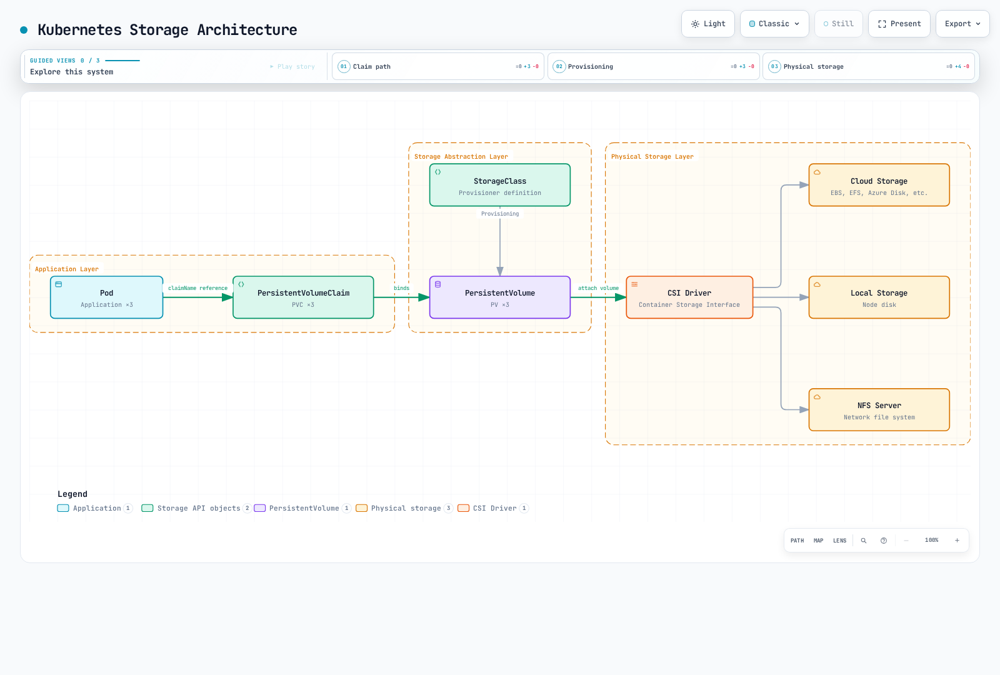
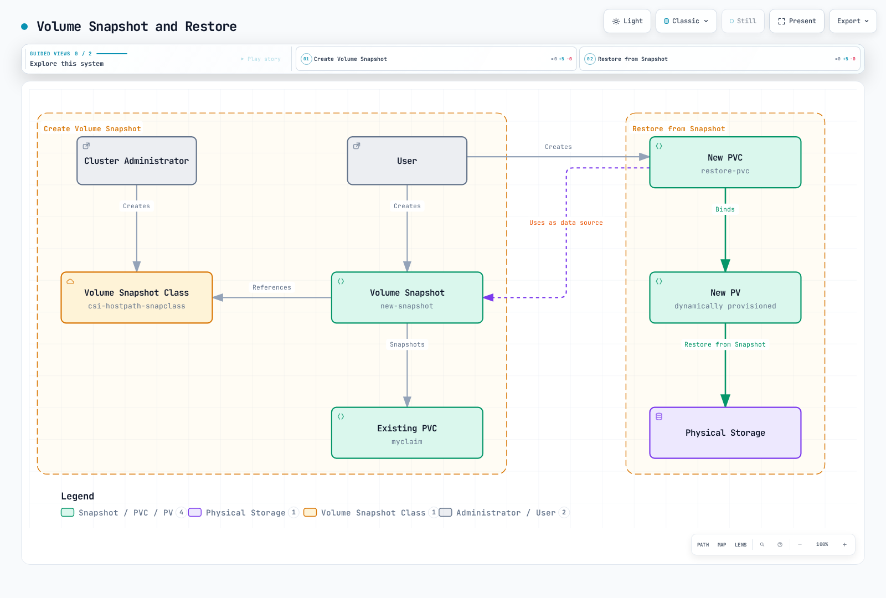
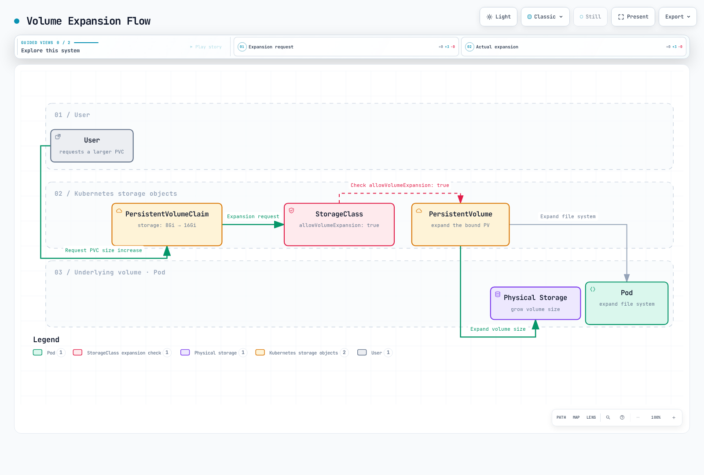
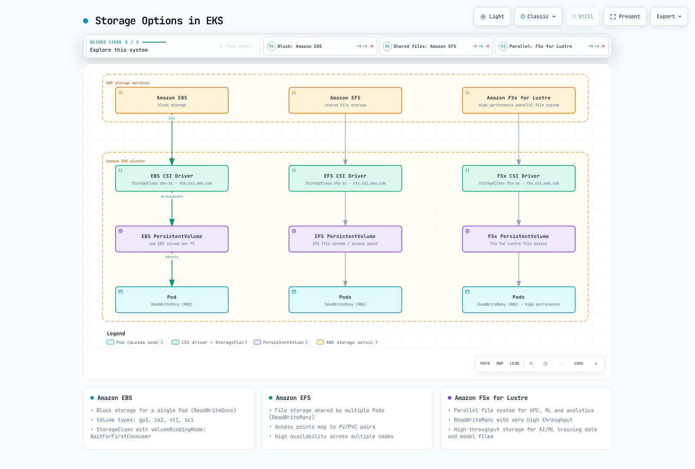

# 存储

> **支持的版本**: Kubernetes 1.32, 1.33, 1.34
> **最后更新**: February 19, 2026

在 Kubernetes 中，存储是为容器化应用存储和管理数据的重要组成部分。本章将详细介绍 Kubernetes 存储概念，包括 Volumes、Persistent Volumes、Persistent Volume Claims 和 Storage Classes。

## 实验环境设置

要跟随本文档中的示例，需要以下工具和环境：

### 必备工具
- kubectl v1.34 或更高版本
- 可正常运行的 Kubernetes 集群（EKS、minikube、kind 等）
- 存储预配器（适用于 EKS 的 EBS CSI driver）

### 存储示例设置

```bash
# Create namespace
kubectl create namespace storage-demo

# Create a simple PVC and Pod
kubectl -n storage-demo apply -f - <<EOF
apiVersion: v1
kind: PersistentVolumeClaim
metadata:
  name: data-pvc
spec:
  accessModes:
    - ReadWriteOnce
  resources:
    requests:
      storage: 1Gi
---
apiVersion: v1
kind: Pod
metadata:
  name: data-pod
spec:
  containers:
  - name: data-container
    image: busybox
    command: ["sh", "-c", "while true; do echo \$(date) >> /data/output.txt; sleep 5; done"]
    volumeMounts:
    - name: data-volume
      mountPath: /data
  volumes:
  - name: data-volume
    persistentVolumeClaim:
      claimName: data-pvc
EOF

# Check storage resources
kubectl -n storage-demo get pvc,pod
```

## 目录

1. [Volumes](#volumes)
2. [Persistent Volumes](#persistent-volumes)
3. [Persistent Volume Claims](#persistent-volume-claims)
4. [Storage Classes](#storage-classes)
5. [动态预配](#dynamic-provisioning)
6. [Volume Snapshots](#volume-snapshots)
7. [Volume 扩容](#volume-expansion)
8. [Projected Volumes](#projected-volumes)
9. [通用临时 Volumes](#generic-ephemeral-volumes)
10. [块 Volume 模式](#block-volume-mode)
11. [Volume 克隆](#volume-cloning)
12. [存储 ResourceQuota](#storage-resourcequota)
13. [EKS 中的存储选项](#storage-options-in-eks)

## Volumes

> **核心概念**：Kubernetes Volumes 是 Pod 内的容器可用于存储和共享数据的目录，即使容器重启，数据仍可保留。

Kubernetes Volumes 是 Pod 内的容器可用于存储和共享数据的目录。Volumes 与 Pod 的生命周期绑定；当 Pod 被删除时，Volume 也会被删除（某些 Volume 类型除外）。

### Kubernetes 存储架构



[🔍 查看交互式图表](https://www.atomai.click/kubernetes-docs/archmaps/en-core-04-storage-0.html)

### 为什么需要 Volumes

1. **容器重启时的数据持久化**：容器重启时，其文件系统会被重置；但使用 Volumes 可以保留数据。
2. **容器之间的数据共享**：同一 Pod 中的多个容器可以通过 Volumes 共享数据。

### 主要 Volume 类型对比

| Volume 类型 | 生命周期 | 数据持久性 | 使用场景 | 特性 |
|------------|----------|-----------------|----------|----------|
| **emptyDir** | Pod | 临时 | 临时数据、缓存、检查点 | Pod 删除时数据被删除 |
| **hostPath** | Node | Node 级别 | Node 文件系统访问、监控 | 存在安全风险，请谨慎使用 |
| **configMap** | 配置 | 配置数据 | 应用配置 | 将配置数据作为 Volume 挂载 |
| **secret** | 配置 | 敏感数据 | 证书、密码 | 将敏感数据作为 Volume 挂载 |
| **persistentVolumeClaim** | 集群 | 永久 | 数据库、文件存储 | Pod 重启和重新调度后数据仍会保留 |

### emptyDir

当 Pod 被分配到 Node 时，会创建 `emptyDir` Volume，并在 Pod 于该 Node 上运行期间持续存在。当 Pod 从 Node 中移除时，`emptyDir` 中的数据将被永久删除。

```yaml
apiVersion: v1
kind: Pod
metadata:
  name: test-pd
spec:
  containers:
  - image: nginx
    name: test-container
    volumeMounts:
    - mountPath: /cache
      name: cache-volume
  volumes:
  - name: cache-volume
    emptyDir: {}
```

### hostPath

`hostPath` Volume 会将 Node 文件系统中的文件或目录挂载到 Pod。对于需要访问 Node 文件系统的 Pod，这非常有用；但由于存在安全风险，应谨慎使用。

```yaml
apiVersion: v1
kind: Pod
metadata:
  name: test-hostpath
spec:
  containers:
  - image: nginx
    name: test-container
    volumeMounts:
    - mountPath: /test-pd
      name: test-volume
  volumes:
  - name: test-volume
    hostPath:
      path: /data
      type: Directory  # DirectoryOrCreate, Directory, FileOrCreate, File, Socket, CharDevice, BlockDevice
```

```yaml
apiVersion: v1
kind: Pod
metadata:
  name: test-pd
spec:
  containers:
  - image: nginx
    name: test-container
    volumeMounts:
    - mountPath: /test-pd
      name: test-volume
  volumes:
  - name: test-volume
    hostPath:
      path: /data
      type: Directory
```

#### configMap

`configMap` Volume 会将 ConfigMap 数据挂载到 Pod。ConfigMaps 用于以键值对形式存储配置数据。

```yaml
apiVersion: v1
kind: Pod
metadata:
  name: configmap-pod
spec:
  containers:
  - name: test
    image: busybox
    volumeMounts:
    - name: config-vol
      mountPath: /etc/config
  volumes:
  - name: config-vol
    configMap:
      name: log-config
      items:
      - key: log_level
        path: log_level
```

#### secret

`secret` Volume 会将 Secret 数据挂载到 Pod。Secrets 用于存储密码、token 和密钥等敏感信息。

```yaml
apiVersion: v1
kind: Pod
metadata:
  name: secret-pod
spec:
  containers:
  - name: test
    image: busybox
    volumeMounts:
    - name: secret-vol
      mountPath: /etc/secret
      readOnly: true
  volumes:
  - name: secret-vol
    secret:
      secretName: mysecret
      items:
      - key: username
        path: my-username
```

#### nfs

`nfs` Volume 会将现有的 NFS (Network File System) 共享挂载到 Pod。

```yaml
apiVersion: v1
kind: Pod
metadata:
  name: nfs-pod
spec:
  containers:
  - name: test
    image: busybox
    volumeMounts:
    - name: nfs-vol
      mountPath: /mnt/nfs
  volumes:
  - name: nfs-vol
    nfs:
      server: nfs-server.example.com
      path: /share
```

#### persistentVolumeClaim

`persistentVolumeClaim` Volume 会将 PersistentVolumeClaim 挂载到 Pod。这是最常用的 Volume 类型之一。

```yaml
apiVersion: v1
kind: Pod
metadata:
  name: pvc-pod
spec:
  containers:
  - name: test
    image: busybox
    volumeMounts:
    - name: pvc-vol
      mountPath: /mnt/pvc
  volumes:
  - name: pvc-vol
    persistentVolumeClaim:
      claimName: my-pvc
```

#### CSI (Container Storage Interface)

CSI Volumes 为 Kubernetes 与外部存储系统之间提供标准接口。借助 CSI，存储供应商无需修改 Kubernetes 代码即可开发自己的存储 driver。

```yaml
apiVersion: v1
kind: Pod
metadata:
  name: csi-pod
spec:
  containers:
  - name: test
    image: busybox
    volumeMounts:
    - name: csi-vol
      mountPath: /mnt/csi
  volumes:
  - name: csi-vol
    csi:
      driver: csi-driver.example.com
      volumeAttributes:
        foo: bar
      nodePublishSecretRef:
        name: csi-secret
```

## Persistent Volumes

Persistent Volume (PV) 是由管理员预配或使用 Storage Class 动态预配的集群存储。PVs 的生命周期独立于 Pods，即使 Pods 被删除，PVs 仍会保留。


[🔍 查看交互式图表](https://www.atomai.click/kubernetes-docs/archmaps/en-core-04-storage-1.html)

### PV 创建

```yaml
apiVersion: v1
kind: PersistentVolume
metadata:
  name: pv0001
spec:
  capacity:
    storage: 5Gi
  volumeMode: Filesystem
  accessModes:
    - ReadWriteOnce
  persistentVolumeReclaimPolicy: Recycle
  storageClassName: slow
  mountOptions:
    - hard
    - nfsvers=4.1
  nfs:
    path: /tmp
    server: 172.17.0.2
```

### PV 访问模式

PVs 支持以下访问模式：

- **ReadWriteOnce (RWO)**：Volume 可由单个 Node 以读写方式挂载。
- **ReadOnlyMany (ROX)**：Volume 可由多个 Nodes 以只读方式挂载。
- **ReadWriteMany (RWX)**：Volume 可由多个 Nodes 以读写方式挂载。
- **ReadWriteOncePod (RWOP)**：Volume 可由单个 Pod 以读写方式挂载（Kubernetes 1.22+）。

### PV 回收策略

PVs 可以具有以下回收策略：

- **Retain**：PVC 删除时，PV 和数据会保留。管理员必须手动清理。
- **Delete**：PVC 删除时，PV 和外部存储资产会自动删除。
- **Recycle**：PVC 删除时，PV 中的数据会被删除，PV 会再次变为可用状态（已弃用）。

### PV 状态

PVs 可以具有以下状态：

- **Available**：可用但尚未绑定到声明的资源。
- **Bound**：已绑定到声明。
- **Released**：声明已删除，但资源尚未被集群回收。
- **Failed**：自动回收失败。

## Persistent Volume Claims

Persistent Volume Claim (PVC) 是用户的存储请求。PVCs 与 PVs 类似，但 PVCs 是用户请求存储的方式，而 PVs 是管理员提供存储的方式。

### PVC 创建

```yaml
apiVersion: v1
kind: PersistentVolumeClaim
metadata:
  name: myclaim
spec:
  accessModes:
    - ReadWriteOnce
  volumeMode: Filesystem
  resources:
    requests:
      storage: 8Gi
  storageClassName: slow
  selector:
    matchLabels:
      release: "stable"
    matchExpressions:
      - {key: environment, operator: In, values: [dev]}
```

### PVC 和 PV 绑定

创建 PVC 时，Kubernetes 会查找并绑定满足 PVC 要求（存储大小、访问模式、存储类、selector 等）的 PV。如果不存在合适的 PV，PVC 将保持 Pending 状态。

### 使用 PVC

PVCs 可以作为 Pods 中的 Volumes 使用：

```yaml
apiVersion: v1
kind: Pod
metadata:
  name: mypod
spec:
  containers:
    - name: myfrontend
      image: nginx
      volumeMounts:
      - mountPath: "/var/www/html"
        name: mypd
  volumes:
    - name: mypd
      persistentVolumeClaim:
        claimName: myclaim
```

## Storage Classes

Storage Classes 描述管理员提供的存储“类别”。Storage Classes 用于动态预配 PVs。


[🔍 查看交互式图表](https://www.atomai.click/kubernetes-docs/archmaps/en-core-04-storage-2.html)

### Storage Class 创建

```yaml
apiVersion: storage.k8s.io/v1
kind: StorageClass
metadata:
  name: standard
provisioner: kubernetes.io/aws-ebs
parameters:
  type: gp3
  fsType: ext4
reclaimPolicy: Delete
allowVolumeExpansion: true
volumeBindingMode: WaitForFirstConsumer
```

此示例创建了一个预配 AWS EBS gp3 Volumes 的存储类。

### Provisioners

Storage Classes 指定用于预配 Volumes 的 provisioner。常见的 provisioner 包括：

- `kubernetes.io/aws-ebs`：AWS EBS Volumes
- `kubernetes.io/gce-pd`：GCE Persistent Disks
- `kubernetes.io/azure-disk`：Azure Disks
- `kubernetes.io/azure-file`：Azure File
- `kubernetes.io/cinder`：OpenStack Cinder Volumes
- `kubernetes.io/glusterfs`：GlusterFS Volumes
- `kubernetes.io/rbd`：Ceph RBD Volumes
- `kubernetes.io/nfs`：NFS Volumes

### Volume 绑定模式

Storage Classes 支持以下 Volume 绑定模式：

- **Immediate**：默认模式，创建 PVC 时立即预配 Volumes。
- **WaitForFirstConsumer**：延迟 Volume 预配，直到 Pod 尝试使用 PVC。这有助于确保 Volumes 在与 Pods 相同的可用区中预配。

### 默认 Storage Class

可以为集群设置默认 Storage Class。如果 PVC 中未指定 Storage Class，则会使用默认 Storage Class。

```yaml
apiVersion: storage.k8s.io/v1
kind: StorageClass
metadata:
  name: standard
  annotations:
    storageclass.kubernetes.io/is-default-class: "true"
provisioner: kubernetes.io/aws-ebs
parameters:
  type: gp3
```

## 动态预配

动态预配是一项在创建 PVC 时自动创建 PVs 的功能。这样，用户可以按需请求存储，而无需管理员预先创建 PVs。

### 动态预配示例

1. 创建 Storage Class：

```yaml
apiVersion: storage.k8s.io/v1
kind: StorageClass
metadata:
  name: fast
provisioner: kubernetes.io/aws-ebs
parameters:
  type: gp3
  iopsPerGB: "10"
```

2. 创建 PVC：

```yaml
apiVersion: v1
kind: PersistentVolumeClaim
metadata:
  name: myclaim
spec:
  accessModes:
    - ReadWriteOnce
  resources:
    requests:
      storage: 100Gi
  storageClassName: fast
```

3. 在 Pod 中使用 PVC：

```yaml
apiVersion: v1
kind: Pod
metadata:
  name: mypod
spec:
  containers:
    - name: myfrontend
      image: nginx
      volumeMounts:
      - mountPath: "/var/www/html"
        name: mypd
  volumes:
    - name: mypd
      persistentVolumeClaim:
        claimName: myclaim
```

## Volume Snapshots

Kubernetes 支持 Volume Snapshots，可创建 PVs 的时间点副本。这对于备份和恢复场景非常有用。



[🔍 查看交互式图表](https://www.atomai.click/kubernetes-docs/archmaps/en-core-04-storage-3.html)

### Volume Snapshot Class

```yaml
apiVersion: snapshot.storage.k8s.io/v1
kind: VolumeSnapshotClass
metadata:
  name: csi-hostpath-snapclass
driver: hostpath.csi.k8s.io
deletionPolicy: Delete
```

### 创建 Volume Snapshot

```yaml
apiVersion: snapshot.storage.k8s.io/v1
kind: VolumeSnapshot
metadata:
  name: new-snapshot
spec:
  volumeSnapshotClassName: csi-hostpath-snapclass
  source:
    persistentVolumeClaimName: myclaim
```

### 从 Snapshot 创建 PVC

```yaml
apiVersion: v1
kind: PersistentVolumeClaim
metadata:
  name: restore-pvc
spec:
  storageClassName: csi-hostpath-sc
  dataSource:
    name: new-snapshot
    kind: VolumeSnapshot
    apiGroup: snapshot.storage.k8s.io
  accessModes:
    - ReadWriteOnce
  resources:
    requests:
      storage: 10Gi
```

## Volume 扩容

Kubernetes 支持扩展 PVCs 的大小。为此，必须在 Storage Class 中设置 `allowVolumeExpansion: true`。



[🔍 查看交互式图表](https://www.atomai.click/kubernetes-docs/archmaps/en-core-04-storage-4.html)

### PVC 扩容

```yaml
apiVersion: v1
kind: PersistentVolumeClaim
metadata:
  name: myclaim
spec:
  accessModes:
    - ReadWriteOnce
  resources:
    requests:
      storage: 16Gi  # Expanded from original 8Gi to 16Gi
  storageClassName: standard
```

## Projected Volumes

Projected Volumes 允许将多个 Volume 源合并为单个 Volume 挂载。当需要在一个目录中同时公开 secrets、configMaps、downwardAPI 和 serviceAccountToken 时，这非常有用。

### 支持的源

- **secret**：挂载 secret 数据
- **configMap**：挂载配置数据
- **downwardAPI**：公开 Pod 和容器元数据
- **serviceAccountToken**：挂载具有可配置过期时间的 service account tokens

### Projected Volume 示例

```yaml
apiVersion: v1
kind: Pod
metadata:
  name: projected-volume-pod
spec:
  containers:
  - name: app
    image: busybox
    command: ["sh", "-c", "ls -la /etc/projected && sleep 3600"]
    volumeMounts:
    - name: all-in-one
      mountPath: /etc/projected
      readOnly: true
  volumes:
  - name: all-in-one
    projected:
      sources:
      - secret:
          name: db-credentials
          items:
          - key: username
            path: db/username
          - key: password
            path: db/password
      - configMap:
          name: app-config
          items:
          - key: config.yaml
            path: config/app.yaml
      - downwardAPI:
          items:
          - path: labels
            fieldRef:
              fieldPath: metadata.labels
          - path: cpu-request
            resourceFieldRef:
              containerName: app
              resource: requests.cpu
      - serviceAccountToken:
          path: token
          expirationSeconds: 3600
          audience: api
```

此配置会在 `/etc/projected` 创建一个包含以下内容的单个 Volume：
- 来自 secret 的 `/etc/projected/db/username` 和 `/etc/projected/db/password`
- 来自 configMap 的 `/etc/projected/config/app.yaml`
- 来自 downwardAPI 的 `/etc/projected/labels` 和 `/etc/projected/cpu-request`
- 包含自动轮换 service account token 的 `/etc/projected/token`

### Service Account Token 投影

Service account token 投影提供具有受限生命周期和 audience 的 tokens：

```yaml
apiVersion: v1
kind: Pod
metadata:
  name: token-projected-pod
spec:
  serviceAccountName: my-service-account
  containers:
  - name: app
    image: myapp:latest
    volumeMounts:
    - name: token
      mountPath: /var/run/secrets/tokens
  volumes:
  - name: token
    projected:
      sources:
      - serviceAccountToken:
          path: api-token
          expirationSeconds: 7200  # 2 hours
          audience: my-api-service
```

## 通用临时 Volumes

通用临时 Volumes 提供与 PVC 类似、且与 Pod 生命周期绑定的存储。与 emptyDir 不同，它们会使用 PVCs 和 StorageClasses 的完整功能，包括动态预配。

### 与 emptyDir 的差异

| 特性 | emptyDir | 通用临时 Volume |
|---------|----------|--------------------------|
| **存储后端** | Node 本地存储或内存 | 任意 CSI driver |
| **预配** | 自动、简单 | 使用 StorageClass、动态预配 |
| **大小限制** | sizeLimit（软限制） | 完整 PVC 容量管理 |
| **Snapshots** | 不支持 | 支持（如果 CSI driver 支持） |
| **存储功能** | 基础 | 完整 CSI 功能（加密、IOPS 等） |
| **持久性** | Pod 删除时丢失 | Pod 删除时丢失 |

### 通用临时 Volume 示例

```yaml
apiVersion: v1
kind: Pod
metadata:
  name: ephemeral-volume-pod
spec:
  containers:
  - name: app
    image: busybox
    command: ["sh", "-c", "dd if=/dev/zero of=/scratch/data bs=1M count=100 && sleep 3600"]
    volumeMounts:
    - name: scratch
      mountPath: /scratch
  volumes:
  - name: scratch
    ephemeral:
      volumeClaimTemplate:
        metadata:
          labels:
            type: scratch-storage
        spec:
          accessModes:
          - ReadWriteOnce
          storageClassName: fast-ssd
          resources:
            requests:
              storage: 10Gi
```

### 使用场景

1. **CI/CD pipelines**：具有保证存储容量的临时构建产物
2. **数据处理**：具有特定性能要求的暂存空间
3. **测试**：具有 CSI 功能的临时数据库或缓存
4. **机器学习**：具有高性能存储的临时模型检查点

### 使用通用临时 Volumes 的 Deployment

```yaml
apiVersion: apps/v1
kind: Deployment
metadata:
  name: ml-training
spec:
  replicas: 3
  selector:
    matchLabels:
      app: ml-training
  template:
    metadata:
      labels:
        app: ml-training
    spec:
      containers:
      - name: trainer
        image: ml-trainer:latest
        volumeMounts:
        - name: checkpoint-storage
          mountPath: /checkpoints
      volumes:
      - name: checkpoint-storage
        ephemeral:
          volumeClaimTemplate:
            spec:
              accessModes:
              - ReadWriteOnce
              storageClassName: high-iops
              resources:
                requests:
                  storage: 50Gi
```

## 块 Volume 模式

除文件系统 Volumes 外，Kubernetes 还支持原始块 Volumes。块 Volumes 将存储呈现为不带文件系统的原始块设备，适用于自行管理数据布局的应用程序。

### 文件系统与块模式

| 方面 | Filesystem（默认） | Block |
|--------|---------------------|-------|
| **volumeMode** | `Filesystem` | `Block` |
| **挂载类型** | 挂载为目录 | 公开为设备文件 |
| **文件系统** | ext4、xfs 等 | 无（原始） |
| **在 Pod 中的访问方式** | `/mnt/data/` | `/dev/xvda` |
| **使用场景** | 通用应用程序 | 数据库、专用应用程序 |

### 块 Volume PV 和 PVC

```yaml
# PersistentVolume with Block mode
apiVersion: v1
kind: PersistentVolume
metadata:
  name: block-pv
spec:
  capacity:
    storage: 100Gi
  volumeMode: Block
  accessModes:
  - ReadWriteOnce
  persistentVolumeReclaimPolicy: Retain
  storageClassName: block-storage
  csi:
    driver: ebs.csi.aws.com
    volumeHandle: vol-0123456789abcdef0
---
# PersistentVolumeClaim for Block volume
apiVersion: v1
kind: PersistentVolumeClaim
metadata:
  name: block-pvc
spec:
  volumeMode: Block
  accessModes:
  - ReadWriteOnce
  storageClassName: block-storage
  resources:
    requests:
      storage: 100Gi
```

### 在 Pods 中使用块 Volumes

```yaml
apiVersion: v1
kind: Pod
metadata:
  name: block-volume-pod
spec:
  containers:
  - name: database
    image: custom-database:latest
    volumeDevices:
    - name: data
      devicePath: /dev/xvda
  volumes:
  - name: data
    persistentVolumeClaim:
      claimName: block-pvc
```

注意：块 Volumes 使用 `volumeDevices` 和 `devicePath`，而不是 `volumeMounts` 和 `mountPath`。

### 块 Volumes 的使用场景

1. **数据库**：受益于原始磁盘访问的 MySQL、PostgreSQL 或 MongoDB
2. **自定义文件系统**：使用 ZFS 或 LVM 等专用文件系统的应用程序
3. **高性能存储**：需要直接 I/O 且不承受文件系统开销的应用程序
4. **存储虚拟化**：软件定义存储解决方案

## Volume 克隆

Volume 克隆会使用现有 PVC 的内容创建新的 PVC。这对于创建测试环境、复制数据或迁移工作负载非常有用。

### 前提条件

- CSI driver 必须支持 Volume 克隆
- 源 PVC 和目标 PVC 必须位于同一 namespace
- 源和目标必须使用相同的 StorageClass
- 源和目标必须具有相同的 volumeMode

### PVC 克隆示例

```yaml
# Source PVC (existing)
apiVersion: v1
kind: PersistentVolumeClaim
metadata:
  name: source-pvc
  namespace: production
spec:
  accessModes:
  - ReadWriteOnce
  storageClassName: ebs-sc
  resources:
    requests:
      storage: 100Gi
---
# Clone PVC using dataSource
apiVersion: v1
kind: PersistentVolumeClaim
metadata:
  name: cloned-pvc
  namespace: production
spec:
  accessModes:
  - ReadWriteOnce
  storageClassName: ebs-sc
  resources:
    requests:
      storage: 100Gi  # Must be >= source size
  dataSource:
    kind: PersistentVolumeClaim
    name: source-pvc
```

### 克隆与 Snapshots 对比

| 特性 | Volume 克隆 | Volume Snapshots |
|---------|---------------|------------------|
| **结果** | 包含数据的新 PVC | Snapshot 对象 |
| **使用场景** | 复制活动 Volume | 时间点备份 |
| **性能** | 可能较慢（完整复制） | 通常更快（copy-on-write） |
| **跨 namespace** | 否 | 否 |
| **存储开销** | 完整复制 | 增量 |

### 用于测试的克隆

```yaml
apiVersion: v1
kind: PersistentVolumeClaim
metadata:
  name: test-db-clone
  namespace: staging
spec:
  accessModes:
  - ReadWriteOnce
  storageClassName: ebs-sc
  resources:
    requests:
      storage: 100Gi
  dataSource:
    kind: PersistentVolumeClaim
    name: production-db-pvc
---
apiVersion: v1
kind: Pod
metadata:
  name: test-database
  namespace: staging
spec:
  containers:
  - name: postgres
    image: postgres:15
    volumeMounts:
    - name: data
      mountPath: /var/lib/postgresql/data
  volumes:
  - name: data
    persistentVolumeClaim:
      claimName: test-db-clone
```

## 存储 ResourceQuota

ResourceQuota 可以限制 namespace 内的存储消耗，包括 PVCs 的数量和总存储容量。

### 存储相关配额字段

| 字段 | 描述 |
|-------|-------------|
| **persistentvolumeclaims** | 允许的 PVC 总数 |
| **requests.storage** | 所有 PVCs 的总存储容量 |
| **\<storage-class\>.storageclass.storage.k8s.io/requests.storage** | 特定 StorageClass 的存储容量 |
| **\<storage-class\>.storageclass.storage.k8s.io/persistentvolumeclaims** | 特定 StorageClass 的 PVC 数量 |

### ResourceQuota 示例

```yaml
apiVersion: v1
kind: ResourceQuota
metadata:
  name: storage-quota
  namespace: team-a
spec:
  hard:
    # Total limits
    persistentvolumeclaims: "10"
    requests.storage: "500Gi"

    # Per-StorageClass limits
    ebs-sc.storageclass.storage.k8s.io/requests.storage: "200Gi"
    ebs-sc.storageclass.storage.k8s.io/persistentvolumeclaims: "5"

    efs-sc.storageclass.storage.k8s.io/requests.storage: "300Gi"
    efs-sc.storageclass.storage.k8s.io/persistentvolumeclaims: "5"
```

### 检查 ResourceQuota 状态

```bash
# View quota status
kubectl get resourcequota storage-quota -n team-a -o yaml

# Example output
status:
  hard:
    persistentvolumeclaims: "10"
    requests.storage: "500Gi"
  used:
    persistentvolumeclaims: "3"
    requests.storage: "150Gi"
```

### 用于存储的 LimitRange

LimitRange 可以为 PVC 存储请求设置默认值和限制值：

```yaml
apiVersion: v1
kind: LimitRange
metadata:
  name: storage-limits
  namespace: team-a
spec:
  limits:
  - type: PersistentVolumeClaim
    min:
      storage: 1Gi
    max:
      storage: 100Gi
    default:
      storage: 10Gi
```

这可确保：
- 最小 PVC 大小为 1Gi
- 最大 PVC 大小为 100Gi
- 默认大小（未指定时）为 10Gi

## EKS 中的存储选项

Amazon EKS 提供多种存储选项。每种选项的使用场景和性能特征各不相同，因此为应用程序的需求选择合适的存储非常重要。



[🔍 查看交互式图表](https://www.atomai.click/kubernetes-docs/archmaps/en-core-04-storage-5.html)

### Amazon EBS

Amazon EBS (Elastic Block Store) 提供可附加到 EC2 instances 的块存储 Volumes。在 EKS 中，可以使用 EBS CSI driver 将 EBS Volumes 挂载到 Kubernetes Pods。

#### EBS CSI Driver 安装

```bash
kubectl apply -k "github.com/kubernetes-sigs/aws-ebs-csi-driver/deploy/kubernetes/overlays/stable/?ref=master"
```

#### EBS Storage Class

```yaml
apiVersion: storage.k8s.io/v1
kind: StorageClass
metadata:
  name: ebs-sc
provisioner: ebs.csi.aws.com
parameters:
  type: gp3
  fsType: ext4
  encrypted: "true"
volumeBindingMode: WaitForFirstConsumer
```

#### EBS Volume 类型

Amazon EBS 提供多种 Volume 类型：

1. **gp3**：适用于大多数工作负载的通用 SSD Volumes。提供基准 3,000 IOPS 和 125MB/s 吞吐量，额外付费后可扩展到 16,000 IOPS 和 1,000MB/s。

2. **io2**：适用于需要高 IOPS 工作负载的高性能 SSD Volumes。每 GiB 最多可提供 500 IOPS，并可扩展至 64,000 IOPS。

3. **st1**：针对吞吐量优化的 HDD Volumes，适用于大数据、数据仓库和日志处理等吞吐量密集型工作负载。

4. **sc1**：适用于不经常访问数据的冷 HDD Volumes。

#### EBS Storage Class 示例 (gp3)

```yaml
apiVersion: storage.k8s.io/v1
kind: StorageClass
metadata:
  name: ebs-gp3
provisioner: ebs.csi.aws.com
parameters:
  type: gp3
  iops: "3000"
  throughput: "125"
  encrypted: "true"
  kmsKeyId: "arn:aws:kms:us-west-2:111122223333:key/1234abcd-12ab-34cd-56ef-1234567890ab"
volumeBindingMode: WaitForFirstConsumer
```

#### EBS Storage Class 示例 (io2)

```yaml
apiVersion: storage.k8s.io/v1
kind: StorageClass
metadata:
  name: ebs-io2
provisioner: ebs.csi.aws.com
parameters:
  type: io2
  iops: "10000"
  encrypted: "true"
volumeBindingMode: WaitForFirstConsumer
```

### Amazon EFS

Amazon EFS (Elastic File System) 提供可由多个 EC2 instances 同时访问的可扩展文件存储。EFS 支持 ReadWriteMany 访问模式，因此在多个 Pods 需要共享同一个 Volume 时非常有用。

#### EFS CSI Driver 安装

```bash
kubectl apply -k "github.com/kubernetes-sigs/aws-efs-csi-driver/deploy/kubernetes/overlays/stable/?ref=master"
```

#### 创建 EFS File System

要创建 EFS file system，可以使用 AWS Management Console、AWS CLI 或 AWS CloudFormation。

AWS CLI 示例：

```bash
# Create EFS file system
aws efs create-file-system \
  --creation-token eks-efs \
  --performance-mode generalPurpose \
  --throughput-mode bursting \
  --tags Key=Name,Value=EKS-EFS

# Store file system ID
FS_ID=$(aws efs describe-file-systems \
  --creation-token eks-efs \
  --query "FileSystems[0].FileSystemId" \
  --output text)

# Create mount target (for each subnet)
aws efs create-mount-target \
  --file-system-id $FS_ID \
  --subnet-id subnet-0eabfaa81fb22bcaf \
  --security-groups sg-068000ccf82dfba88
```

#### EFS Storage Class

```yaml
apiVersion: storage.k8s.io/v1
kind: StorageClass
metadata:
  name: efs-sc
provisioner: efs.csi.aws.com
parameters:
  provisioningMode: efs-ap
  fileSystemId: fs-1234abcd
  directoryPerms: "700"
```

#### 带有 PV 和 PVC 的 EFS Access Point

```yaml
# Persistent Volume
apiVersion: v1
kind: PersistentVolume
metadata:
  name: efs-pv
spec:
  capacity:
    storage: 5Gi
  volumeMode: Filesystem
  accessModes:
    - ReadWriteMany
  persistentVolumeReclaimPolicy: Retain
  storageClassName: efs-sc
  csi:
    driver: efs.csi.aws.com
    volumeHandle: fs-1234abcd::fsap-0123456789abcdef

# Persistent Volume Claim
apiVersion: v1
kind: PersistentVolumeClaim
metadata:
  name: efs-pvc
spec:
  accessModes:
    - ReadWriteMany
  storageClassName: efs-sc
  resources:
    requests:
      storage: 5Gi
```

#### EFS 性能模式

EFS 提供两种性能模式：

1. **General Purpose**：推荐用于大多数 file system 工作负载的默认模式。提供低延迟。

2. **Max I/O**：适用于需要高吞吐量和并行处理的工作负载。延迟略高，但可提供更高吞吐量。

#### EFS 吞吐量模式

EFS 提供三种吞吐量模式：

1. **Bursting**：根据 file system 大小分配基础吞吐量，突增积分可在短时间内提供更高吞吐量。

2. **Provisioned**：无论 file system 大小如何，均提供指定的吞吐量。

3. **Elastic**：根据工作负载自动扩展或缩减吞吐量。

### Amazon FSx for Lustre

Amazon FSx for Lustre 为高性能计算工作负载提供高性能 file systems。FSx for Lustre 适用于大规模数据处理、机器学习和分析工作负载。

#### FSx for Lustre CSI Driver 安装

```bash
kubectl apply -k "github.com/kubernetes-sigs/aws-fsx-csi-driver/deploy/kubernetes/overlays/stable/?ref=master"
```

#### 创建 FSx for Lustre File System

AWS CLI 示例：

```bash
aws fsx create-file-system \
  --file-system-type LUSTRE \
  --storage-capacity 1200 \
  --subnet-ids subnet-0eabfaa81fb22bcaf \
  --lustre-configuration DeploymentType=SCRATCH_2,PerUnitStorageThroughput=200
```

#### FSx for Lustre Storage Class

```yaml
apiVersion: storage.k8s.io/v1
kind: StorageClass
metadata:
  name: fsx-sc
provisioner: fsx.csi.aws.com
parameters:
  subnetId: subnet-0eabfaa81fb22bcaf
  securityGroupIds: sg-068000ccf82dfba88
  deploymentType: SCRATCH_2
  automaticBackupRetentionDays: "0"
  dailyAutomaticBackupStartTime: "00:00"
  copyTagsToBackups: "false"
  perUnitStorageThroughput: "200"
  dataCompressionType: "NONE"
  weeklyMaintenanceStartTime: "7:09:00"
```

#### FSx for Lustre 部署类型

FSx for Lustre 提供三种部署类型：

1. **SCRATCH_1**：用于临时存储和短期处理的最低成本选项。没有数据复制，因此持久性较低。

2. **SCRATCH_2**：比 SCRATCH_1 提供更高的突增吞吐量，并会在服务器故障时自动恢复数据。

3. **PERSISTENT**：适用于需要长期存储和吞吐量的工作负载。提供数据复制和自动恢复。

#### FSx for Lustre 存储容量和吞吐量

FSx for Lustre 的存储容量和吞吐量配置如下：

- **存储容量**：最小为 1.2 TiB，以 2.4 TiB 为增量增加。
- **吞吐量**：由部署类型和存储容量决定。
  - SCRATCH_2：每 TiB 存储 200 MB/s 或 1,000 MB/s
  - PERSISTENT：每 TiB 存储 50 MB/s、100 MB/s 或 200 MB/s

### 用于 vLLM 工作负载的 FSx for Lustre 配置

vLLM (Vector Language Model) 等大规模 AI 模型工作负载需要高吞吐量和低延迟的存储。FSx for Lustre 是满足这些要求的理想解决方案。

#### 用于 vLLM 的 FSx for Lustre Storage Class

```yaml
apiVersion: storage.k8s.io/v1
kind: StorageClass
metadata:
  name: fsx-lustre-vllm
provisioner: fsx.csi.aws.com
parameters:
  subnetId: subnet-0eabfaa81fb22bcaf
  securityGroupIds: sg-068000ccf82dfba88
  deploymentType: PERSISTENT_1
  perUnitStorageThroughput: "200"
  dataCompressionType: "NONE"
  storageCapacity: "4800"  # 4.8 TiB
reclaimPolicy: Retain
volumeBindingMode: Immediate
```

#### 用于 vLLM 工作负载的 PVC

```yaml
apiVersion: v1
kind: PersistentVolumeClaim
metadata:
  name: vllm-model-storage
spec:
  accessModes:
    - ReadWriteMany
  resources:
    requests:
      storage: 4800Gi
  storageClassName: fsx-lustre-vllm
```

#### vLLM Deployment 示例

```yaml
apiVersion: apps/v1
kind: Deployment
metadata:
  name: vllm-inference
spec:
  replicas: 1
  selector:
    matchLabels:
      app: vllm-inference
  template:
    metadata:
      labels:
        app: vllm-inference
    spec:
      nodeSelector:
        node.kubernetes.io/instance-type: g5.12xlarge
      containers:
      - name: vllm
        image: vllm-inference:latest
        resources:
          limits:
            nvidia.com/gpu: 4
          requests:
            nvidia.com/gpu: 4
            memory: "64Gi"
            cpu: "32"
        volumeMounts:
        - name: model-storage
          mountPath: /models
      volumes:
      - name: model-storage
        persistentVolumeClaim:
          claimName: vllm-model-storage
```

#### vLLM 性能优化提示

1. **选择合适的吞吐量**：对于 vLLM 工作负载，建议选择每 TiB 至少 200 MB/s 的吞吐量。

2. **优化存储容量**：根据模型大小和数据集大小分配充足的存储容量。

3. **网络优化**：确保 FSx for Lustre file system 和 EKS Nodes 位于同一可用区。

4. **Instance 类型选择**：使用 GPU instances（例如 g5.12xlarge）来优化 vLLM 工作负载性能。

5. **内存配置**：根据模型大小分配足够的内存。

6. **File System 挂载选项**：使用合适的挂载选项以获得最佳性能。

   ```bash
   mount -t lustre -o noatime,flock fs-1234abcd.fsx.us-west-2.amazonaws.com@tcp:/fsx /mnt/fsx
   ```

### 存储选项对比

| 存储选项 | 访问模式 | 使用场景 | 性能 | 成本 | 可扩展性 |
|---------------|-------------|----------|-------------|------|-------------|
| Amazon EBS | ReadWriteOnce | 单个 Pod 的块存储 | 中高 | 中等 | 有限（单个 Node） |
| Amazon EFS | ReadWriteMany | 多个 Pods 共享的文件存储 | 中等 | 中高 | 高（多个 Nodes） |
| Amazon FSx for Lustre | ReadWriteMany | HPC、ML、分析 | 极高 | 高 | 极高（并行访问） |

### EKS 存储选择指南

1. **需要单个 Pod 的块存储时**：Amazon EBS
   - 数据库
   - Stateful 应用程序
   - 在单个 Node 上运行的工作负载

2. **需要多个 Pods 共享的文件存储时**：Amazon EFS
   - Web server 内容
   - 共享配置文件
   - 中等规模数据处理

3. **需要高性能文件存储时**：Amazon FSx for Lustre
   - 大规模数据处理
   - 机器学习和 AI 工作负载（vLLM 等）
   - 高性能计算 (HPC)
   - 大数据分析

## 总结

本章学习了 Kubernetes 存储概念。Volumes 为 Pod 内的容器提供了存储和共享数据的方式，而 Persistent Volumes 和 Persistent Volume Claims 则提供了生命周期独立于 Pods 的存储。Storage Classes 让用户能够通过动态预配按需请求存储。

在 EKS 中，Amazon EBS、Amazon EFS 和 Amazon FSx for Lustre 等提供了多种存储选项，每种选项都有不同的使用场景和性能特征。对于 vLLM 等大规模 AI 模型工作负载，具有高吞吐量和低延迟的 FSx for Lustre 是理想之选。FSx for Lustre 是并行 file system，允许多个 Nodes 同时访问数据，因此适合大规模模型训练和推理任务。

为应用程序的需求选择合适的存储选项非常重要。当需要单个 Pod 的块存储时选择 Amazon EBS；需要多个 Pods 共享的文件存储时选择 Amazon EFS；需要高性能文件存储时选择 Amazon FSx for Lustre。

下一章将学习 Kubernetes 配置和 secrets。

## 测验

要测试在本章中学到的内容，请尝试[存储测验](../quizzes/core/04-storage-quiz.md)。

## 参考资料

- [Kubernetes 官方文档 - Volumes](https://kubernetes.io/docs/concepts/storage/volumes/)
- [Kubernetes 官方文档 - Persistent Volumes](https://kubernetes.io/docs/concepts/storage/persistent-volumes/)
- [Kubernetes 官方文档 - Storage Classes](https://kubernetes.io/docs/concepts/storage/storage-classes/)
- [Kubernetes 官方文档 - Volume Snapshots](https://kubernetes.io/docs/concepts/storage/volume-snapshots/)
- [AWS EBS CSI Driver](https://github.com/kubernetes-sigs/aws-ebs-csi-driver)
- [AWS EFS CSI Driver](https://github.com/kubernetes-sigs/aws-efs-csi-driver)
- [AWS FSx for Lustre CSI Driver](https://github.com/kubernetes-sigs/aws-fsx-csi-driver)
- [AWS 博客 - 扩展 LLM 推理工作负载：在 Amazon EKS 上使用 TensorRT-LLM 和 Triton 进行多 Node 部署](https://aws.amazon.com/ko/blogs/hpc/scaling-your-llm-inference-workloads-multi-node-deployment-with-tensorrt-llm-and-triton-on-amazon-eks/)
- [AWS Workshop - GenAI FSx EKS](https://catalog.workshops.aws/genaifsxeks/en-US/200-module2-genai/210-deploy)
