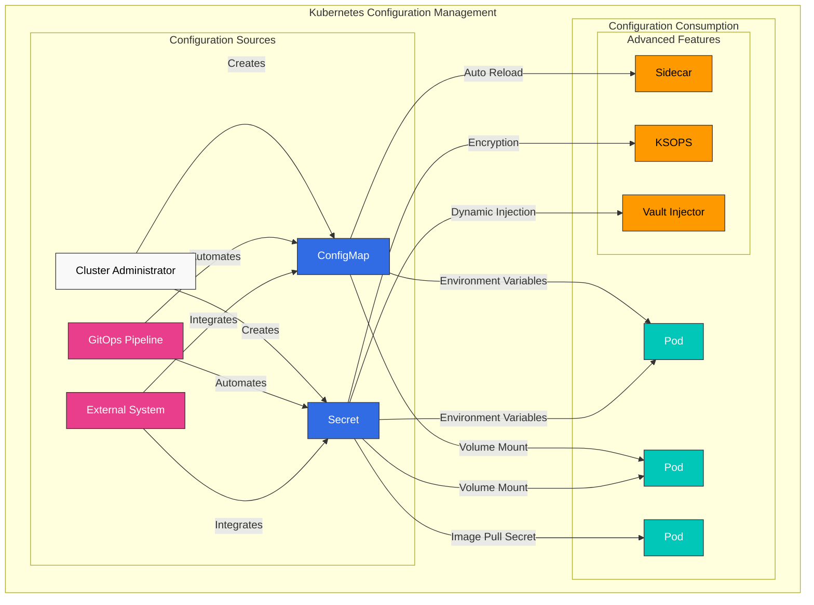
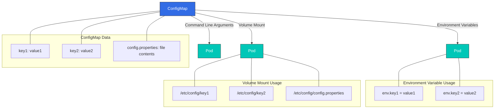
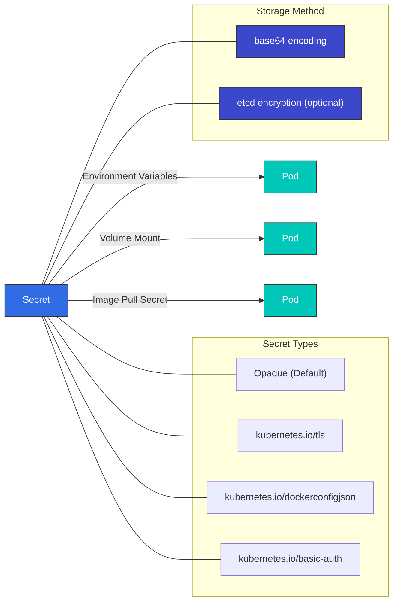
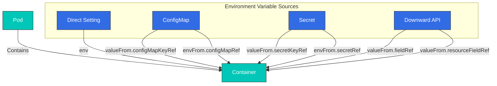
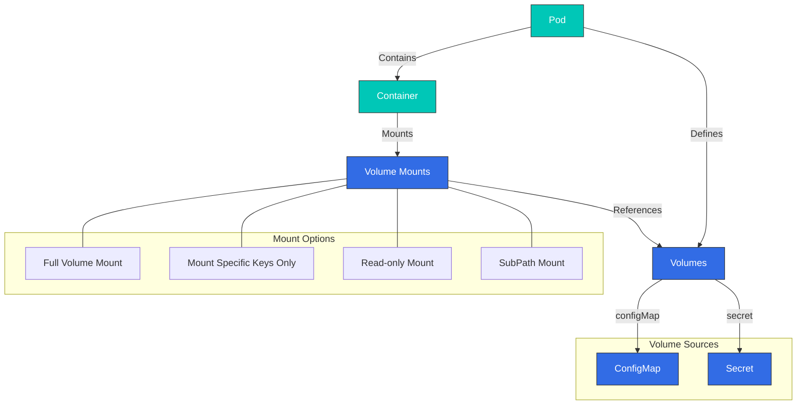
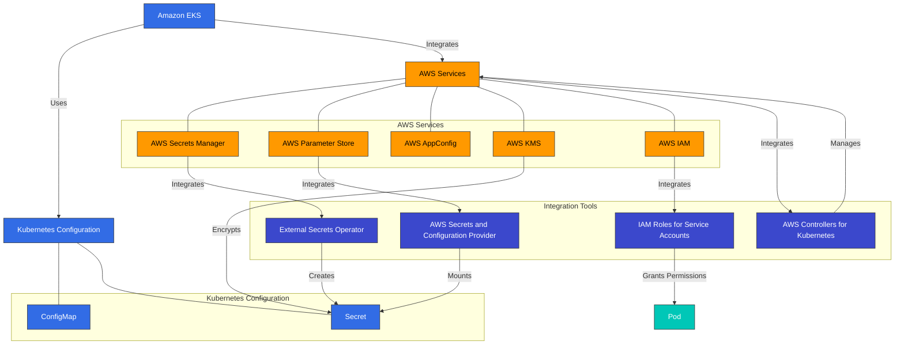

# 配置和 Secrets

> **支持的版本**: Kubernetes 1.32, 1.33, 1.34
> **最后更新**: February 22, 2026

在 Kubernetes 中，配置管理是将应用程序设置与代码分离管理的重要组成部分。在本章中，我们将详细探讨 Kubernetes 配置管理方法，包括 ConfigMaps、Secrets、environment variables，以及通过 volumes 挂载配置。

## 实验环境设置

要跟随本文档中的示例进行操作，你需要以下工具和环境：

### 必需工具
- kubectl v1.34 或更高版本
- 可用的 Kubernetes cluster（EKS、minikube、kind 等）

### 配置示例设置

```bash
# Create namespace
kubectl create namespace config-demo

# Create ConfigMap
kubectl -n config-demo create configmap app-config \
  --from-literal=APP_ENV=production \
  --from-literal=APP_DEBUG=false \
  --from-literal=APP_PORT=8080

# Create Secret
kubectl -n config-demo create secret generic app-secrets \
  --from-literal=DB_USER=admin \
  --from-literal=DB_PASSWORD=s3cr3t \
  --from-literal=API_KEY=abcdef123456

# Create Pod using ConfigMap and Secret
kubectl -n config-demo apply -f - <<EOF
apiVersion: v1
kind: Pod
metadata:
  name: config-test-pod
spec:
  containers:
  - name: test-container
    image: busybox
    command: ["sh", "-c", "env | sort && sleep 3600"]
    env:
    - name: APP_ENV
      valueFrom:
        configMapKeyRef:
          name: app-config
          key: APP_ENV
    - name: DB_PASSWORD
      valueFrom:
        secretKeyRef:
          name: app-secrets
          key: DB_PASSWORD
  restartPolicy: Never
EOF

# Check Pod logs
kubectl -n config-demo logs config-test-pod
```

## 配置管理概览



## 目录

1. [ConfigMap](#configmap)
2. [Secret](#secret)
3. [Environment Variables](#environment-variables)
4. [通过 Volumes 挂载配置](#mounting-configuration-through-volumes)
5. [配置最佳实践](#configuration-best-practices)
6. [外部配置管理工具](#external-configuration-management-tools)

## ConfigMap

> **核心概念**: ConfigMaps 以键值对形式存储配置数据，将应用程序代码与配置分离。

ConfigMaps 是以键值对形式存储配置数据的 API objects。使用 ConfigMaps 可以将配置数据与 container images 分离，从而提高应用程序的可移植性。

### ConfigMap 与 Secret 对比

| 功能 | ConfigMap | Secret |
|---------|-----------|--------|
| **用途** | 通用配置数据 | 敏感配置数据 |
| **存储格式** | 纯文本 | Base64 编码（默认） |
| **大小限制** | 1MB | 1MB |
| **加密** | 默认无 | 支持 etcd 加密 |
| **Volume 类型** | configMap | secret |
| **使用场景** | Environment variables、配置文件 | 密码、tokens、证书 |
| **自动更新** | 挂载为 volume 时可能有延迟 | 挂载为 volume 时可能有延迟 |

### ConfigMap 创建方法

ConfigMaps 可以通过多种方式创建：

1. **Imperative 创建**：

```bash
# Create from literal values
kubectl create configmap my-config --from-literal=key1=value1 --from-literal=key2=value2

# Create from file
kubectl create configmap my-config --from-file=config.properties

# Create from directory
kubectl create configmap my-config --from-file=config-dir/
```

2. **Declarative 创建**：

```yaml
apiVersion: v1
kind: ConfigMap
metadata:
  name: my-config
data:
  # Simple key-value pairs
  database.host: "mysql"
  database.port: "3306"

  # File-like configuration
  config.yaml: |
    server:
      port: 8080
    logging:
      level: INFO
    features:
      enabled: true
```

### ConfigMap 使用方法

ConfigMaps 可以通过以下方式使用：

1. **用作 environment variables**：

```yaml
apiVersion: v1
kind: Pod
metadata:
  name: config-env-pod
spec:
  containers:
  - name: app
    image: nginx
    env:
    # Single key-value reference
    - name: DB_HOST
      valueFrom:
        configMapKeyRef:
          name: my-config
          key: database.host
    # All key-value references
    envFrom:
    - configMapRef:
        name: my-config
```



### ConfigMap 创建

ConfigMaps 可以通过多种方式创建：

#### Imperative

```bash
# Create from literal values
kubectl create configmap my-config --from-literal=key1=value1 --from-literal=key2=value2

# Create from file
kubectl create configmap my-config --from-file=config.properties

# Create from directory
kubectl create configmap my-config --from-file=config-dir/
```

#### Declarative

```yaml
apiVersion: v1
kind: ConfigMap
metadata:
  name: my-config
data:
  # Simple key-value pairs
  key1: value1
  key2: value2
  # File-like configuration
  config.properties: |
    property1=value1
    property2=value2
  # JSON configuration
  config.json: |
    {
      "property1": "value1",
      "property2": "value2"
    }
```

### ConfigMap 使用

ConfigMaps 可以在 Pods 中通过以下方式使用：

#### 用作 Environment Variables

```yaml
apiVersion: v1
kind: Pod
metadata:
  name: configmap-pod
spec:
  containers:
  - name: test-container
    image: busybox
    command: [ "/bin/sh", "-c", "env" ]
    env:
    # Use single key-value pair
    - name: SPECIAL_KEY
      valueFrom:
        configMapKeyRef:
          name: my-config
          key: key1
    # Use all key-value pairs as environment variables
    envFrom:
    - configMapRef:
        name: my-config
  restartPolicy: Never
```

#### 挂载为 Volume

```yaml
apiVersion: v1
kind: Pod
metadata:
  name: configmap-pod
spec:
  containers:
  - name: test-container
    image: busybox
    command: [ "/bin/sh", "-c", "ls /etc/config/" ]
    volumeMounts:
    - name: config-volume
      mountPath: /etc/config
  volumes:
  - name: config-volume
    configMap:
      name: my-config
  restartPolicy: Never
```

#### 仅挂载特定 Keys

```yaml
apiVersion: v1
kind: Pod
metadata:
  name: configmap-pod
spec:
  containers:
  - name: test-container
    image: busybox
    command: [ "/bin/sh", "-c", "cat /etc/config/key1" ]
    volumeMounts:
    - name: config-volume
      mountPath: /etc/config
  volumes:
  - name: config-volume
    configMap:
      name: my-config
      items:
      - key: key1
        path: key1
  restartPolicy: Never
```

### ConfigMap 更新

当 ConfigMap 更新时，以 volume 形式挂载的 ConfigMap 内容会自动更新。但是，用作 environment variables 的 ConfigMaps 需要重启 Pod 才能更新。

```bash
kubectl edit configmap my-config
```

或者

```yaml
apiVersion: v1
kind: ConfigMap
metadata:
  name: my-config
data:
  key1: updated-value1
  key2: value2
```

```bash
kubectl apply -f updated-configmap.yaml
```

## Secret

Secrets 是用于存储密码、OAuth tokens 和 SSH keys 等敏感信息的 API objects。Secrets 类似于 ConfigMaps，但为存储敏感数据提供了额外的安全功能。



### Secret 类型

Kubernetes 提供多种类型的 secrets：

- **Opaque**：默认类型，存储任意用户定义的数据。
- **kubernetes.io/service-account-token**：存储 service account tokens。
- **kubernetes.io/dockercfg**：存储 `.dockercfg` 文件的序列化形式。
- **kubernetes.io/dockerconfigjson**：存储 `.docker/config.json` 文件的序列化形式。
- **kubernetes.io/basic-auth**：存储 basic authentication 的凭据。
- **kubernetes.io/ssh-auth**：存储 SSH authentication 的凭据。
- **kubernetes.io/tls**：存储 TLS 证书和 keys。
- **bootstrap.kubernetes.io/token**：存储 bootstrap token 数据。

### Secret 创建

Secrets 可以通过多种方式创建：

#### Imperative

```bash
# Create from literal values
kubectl create secret generic my-secret --from-literal=username=admin --from-literal=password=secret

# Create from files
kubectl create secret generic my-secret --from-file=username.txt --from-file=password.txt

# Create TLS secret
kubectl create secret tls my-tls-secret --cert=path/to/cert.crt --key=path/to/key.key

# Create Docker registry secret
kubectl create secret docker-registry my-registry-secret \
  --docker-server=DOCKER_REGISTRY_SERVER \
  --docker-username=DOCKER_USER \
  --docker-password=DOCKER_PASSWORD \
  --docker-email=DOCKER_EMAIL
```

#### Declarative

```yaml
apiVersion: v1
kind: Secret
metadata:
  name: my-secret
type: Opaque
data:
  # base64 encoded values
  username: YWRtaW4=  # admin
  password: c2VjcmV0  # secret
```

或者你可以使用 `stringData` 字段提供未编码的值：

```yaml
apiVersion: v1
kind: Secret
metadata:
  name: my-secret
type: Opaque
stringData:
  # Unencoded values
  username: admin
  password: secret
```

### Secret 使用

Secrets 可以在 Pods 中通过以下方式使用：

#### 用作 Environment Variables

```yaml
apiVersion: v1
kind: Pod
metadata:
  name: secret-pod
spec:
  containers:
  - name: test-container
    image: busybox
    command: [ "/bin/sh", "-c", "env" ]
    env:
    # Use single key-value pair
    - name: USERNAME
      valueFrom:
        secretKeyRef:
          name: my-secret
          key: username
    # Use all key-value pairs as environment variables
    envFrom:
    - secretRef:
        name: my-secret
  restartPolicy: Never
```

#### 挂载为 Volume

```yaml
apiVersion: v1
kind: Pod
metadata:
  name: secret-pod
spec:
  containers:
  - name: test-container
    image: busybox
    command: [ "/bin/sh", "-c", "ls /etc/secret/" ]
    volumeMounts:
    - name: secret-volume
      mountPath: /etc/secret
  volumes:
  - name: secret-volume
    secret:
      secretName: my-secret
  restartPolicy: Never
```

#### Image Pull Secrets

```yaml
apiVersion: v1
kind: Pod
metadata:
  name: private-image-pod
spec:
  containers:
  - name: private-image-container
    image: private-registry.example.com/my-app:v1
  imagePullSecrets:
  - name: my-registry-secret
```

### Secret 安全注意事项

Secrets 默认使用 base64 编码，但这不是加密。为增强 secret 安全性，请考虑以下方法：

1. **etcd 加密**：加密存储在 etcd 中的 secrets。
2. **RBAC**：限制对 secrets 的访问。
3. **Network Policies**：限制可以访问 secrets 的 Pods。
4. **外部 Secret 管理工具**：使用 AWS Secrets Manager、HashiCorp Vault 等外部 secret 管理工具。

#### etcd 加密配置

```yaml
apiVersion: apiserver.config.k8s.io/v1
kind: EncryptionConfiguration
resources:
  - resources:
    - secrets
    providers:
    - aescbc:
        keys:
        - name: key1
          secret: <base64 encoded key>
    - identity: {}
```

## Environment Variables

Environment variables 是向 containers 传递配置信息的简单方式。Kubernetes 提供了多种设置 environment variables 的方式。



### 直接设置

```yaml
apiVersion: v1
kind: Pod
metadata:
  name: env-pod
spec:
  containers:
  - name: test-container
    image: busybox
    command: [ "/bin/sh", "-c", "env" ]
    env:
    - name: ENVIRONMENT
      value: "production"
    - name: LOG_LEVEL
      value: "INFO"
  restartPolicy: Never
```

### 从 ConfigMap 设置

```yaml
apiVersion: v1
kind: Pod
metadata:
  name: env-pod
spec:
  containers:
  - name: test-container
    image: busybox
    command: [ "/bin/sh", "-c", "env" ]
    env:
    - name: ENVIRONMENT
      valueFrom:
        configMapKeyRef:
          name: my-config
          key: environment
  restartPolicy: Never
```

### 从 Secret 设置

```yaml
apiVersion: v1
kind: Pod
metadata:
  name: env-pod
spec:
  containers:
  - name: test-container
    image: busybox
    command: [ "/bin/sh", "-c", "env" ]
    env:
    - name: DATABASE_PASSWORD
      valueFrom:
        secretKeyRef:
          name: my-secret
          key: password
  restartPolicy: Never
```

### 通过 Downward API 设置

Downward API 允许你将 Pod 和 container 信息作为 environment variables 暴露出来。

```yaml
apiVersion: v1
kind: Pod
metadata:
  name: downward-api-pod
  labels:
    app: myapp
spec:
  containers:
  - name: test-container
    image: busybox
    command: [ "/bin/sh", "-c", "env" ]
    env:
    - name: POD_NAME
      valueFrom:
        fieldRef:
          fieldPath: metadata.name
    - name: POD_NAMESPACE
      valueFrom:
        fieldRef:
          fieldPath: metadata.namespace
    - name: POD_IP
      valueFrom:
        fieldRef:
          fieldPath: status.podIP
    - name: NODE_NAME
      valueFrom:
        fieldRef:
          fieldPath: spec.nodeName
    - name: CONTAINER_CPU_REQUEST
      valueFrom:
        resourceFieldRef:
          containerName: test-container
          resource: requests.cpu
  restartPolicy: Never
```

## 通过 Volumes 挂载配置

通过 volumes 将配置文件挂载到 containers，相比 environment variables 提供了更灵活的配置管理方法。



### ConfigMap Volume

```yaml
apiVersion: v1
kind: Pod
metadata:
  name: configmap-volume-pod
spec:
  containers:
  - name: test-container
    image: busybox
    command: [ "/bin/sh", "-c", "ls -la /etc/config" ]
    volumeMounts:
    - name: config-volume
      mountPath: /etc/config
  volumes:
  - name: config-volume
    configMap:
      name: my-config
  restartPolicy: Never
```

### Secret Volume

```yaml
apiVersion: v1
kind: Pod
metadata:
  name: secret-volume-pod
spec:
  containers:
  - name: test-container
    image: busybox
    command: [ "/bin/sh", "-c", "ls -la /etc/secret" ]
    volumeMounts:
    - name: secret-volume
      mountPath: /etc/secret
  volumes:
  - name: secret-volume
    secret:
      secretName: my-secret
  restartPolicy: Never
```

### 特定文件挂载

```yaml
apiVersion: v1
kind: Pod
metadata:
  name: specific-file-pod
spec:
  containers:
  - name: test-container
    image: busybox
    command: [ "/bin/sh", "-c", "cat /etc/config/config.properties" ]
    volumeMounts:
    - name: config-volume
      mountPath: /etc/config
  volumes:
  - name: config-volume
    configMap:
      name: my-config
      items:
      - key: config.properties
        path: config.properties
  restartPolicy: Never
```

### 只读挂载

```yaml
apiVersion: v1
kind: Pod
metadata:
  name: readonly-mount-pod
spec:
  containers:
  - name: test-container
    image: busybox
    command: [ "/bin/sh", "-c", "ls -la /etc/config" ]
    volumeMounts:
    - name: config-volume
      mountPath: /etc/config
      readOnly: true
  volumes:
  - name: config-volume
    configMap:
      name: my-config
  restartPolicy: Never
```

### SubPath 挂载

```yaml
apiVersion: v1
kind: Pod
metadata:
  name: subpath-mount-pod
spec:
  containers:
  - name: test-container
    image: busybox
    command: [ "/bin/sh", "-c", "cat /etc/nginx/nginx.conf" ]
    volumeMounts:
    - name: config-volume
      mountPath: /etc/nginx/nginx.conf
      subPath: nginx.conf
  volumes:
  - name: config-volume
    configMap:
      name: my-config
  restartPolicy: Never
```

## 配置最佳实践

在 Kubernetes 中管理配置时，请考虑以下最佳实践：

### 1. 将配置与代码分离

分别管理应用程序代码和配置。这样在更改配置时无需重新构建应用程序。

### 2. 按环境管理配置

针对 development、testing 和 production 等不同环境分别管理配置。你可以使用 namespaces 分离环境，并为每个环境使用不同的 ConfigMaps 和 Secrets。

```yaml
apiVersion: v1
kind: ConfigMap
metadata:
  name: my-config
  namespace: development
data:
  environment: development
  log_level: DEBUG
---
apiVersion: v1
kind: ConfigMap
metadata:
  name: my-config
  namespace: production
data:
  environment: production
  log_level: INFO
```

### 3. 对敏感信息使用 Secrets

始终使用 Secrets 存储密码、API keys 和证书等敏感信息。仅将 ConfigMaps 用于非敏感配置数据。

### 4. 保持不可变性

更改配置时，创建新版本而不是修改现有版本。这可以让回滚更容易，并允许跟踪配置变更历史。

```yaml
apiVersion: v1
kind: ConfigMap
metadata:
  name: my-config-v1
data:
  # Configuration data
---
apiVersion: v1
kind: ConfigMap
metadata:
  name: my-config-v2
data:
  # Updated configuration data
```

### 5. 配置变更时重启 Pods

用作 environment variables 的配置需要重启 Pod 才能更新。使用 Deployments 执行滚动更新。

```bash
kubectl rollout restart deployment/my-deployment
```

### 6. 验证配置

在应用配置之前先验证配置。无效配置可能导致应用程序故障。

### 7. 记录配置文档

记录配置选项及其影响。这有助于团队成员理解和管理配置。

## Amazon EKS 中的配置管理

在 Amazon EKS 中，除了 Kubernetes 的基础配置管理功能外，你还可以使用 AWS 的各种服务来管理配置和 secrets。本节介绍在 EKS 中管理配置的多种方式，以及与 AWS services 的集成。



### AWS Secrets Manager 集成

AWS Secrets Manager 是一项服务，可让你安全地存储和管理数据库凭据、API keys 以及其他 secret 信息。在 EKS 中，你可以使用 External Secrets Operator 或 AWS Secrets and Configuration Provider (ASCP) 将 secrets 从 AWS Secrets Manager 同步到 Kubernetes secrets。

#### External Secrets Operator 安装

```bash
# Install External Secrets Operator using Helm
helm repo add external-secrets https://charts.external-secrets.io
helm install external-secrets external-secrets/external-secrets \
  --namespace external-secrets \
  --create-namespace
```

#### 创建 SecretStore

```yaml
apiVersion: external-secrets.io/v1beta1
kind: SecretStore
metadata:
  name: aws-secretsmanager
  namespace: my-namespace
spec:
  provider:
    aws:
      service: SecretsManager
      region: us-west-2
      auth:
        jwt:
          serviceAccountRef:
            name: my-serviceaccount
```

#### 创建 ExternalSecret

```yaml
apiVersion: external-secrets.io/v1beta1
kind: ExternalSecret
metadata:
  name: database-credentials
  namespace: my-namespace
spec:
  refreshInterval: 1h
  secretStoreRef:
    name: aws-secretsmanager
    kind: SecretStore
  target:
    name: db-credentials
  data:
  - secretKey: username
    remoteRef:
      key: prod/db/credentials
      property: username
  - secretKey: password
    remoteRef:
      key: prod/db/credentials
      property: password
```

#### IRSA (IAM Roles for Service Accounts) 设置

External Secrets Operator 需要适当的 IAM 权限才能访问 AWS Secrets Manager。你可以使用 IRSA 将 IAM roles 与 Kubernetes service accounts 关联起来。

```bash
# Create OIDC provider
eksctl utils associate-iam-oidc-provider \
  --cluster my-cluster \
  --approve

# Create IAM role and service account
eksctl create iamserviceaccount \
  --cluster my-cluster \
  --namespace my-namespace \
  --name my-serviceaccount \
  --attach-policy-arn arn:aws:iam::aws:policy/SecretsManagerReadWrite \
  --approve
```

### 使用 AWS Parameter Store

AWS Systems Manager Parameter Store 是一项服务，可让你以层级结构存储和管理配置数据及 secret values。Parameter Store 比 Secrets Manager 成本更低，适合存储简单的配置值。

#### ASCP (AWS Secrets and Configuration Provider) 安装

```bash
# Install ASCP
helm repo add secrets-store-csi-driver https://kubernetes-sigs.github.io/secrets-store-csi-driver/charts
helm install csi-secrets-store secrets-store-csi-driver/secrets-store-csi-driver \
  --namespace kube-system

# Install AWS provider
kubectl apply -f https://raw.githubusercontent.com/aws/secrets-store-csi-driver-provider-aws/main/deployment/aws-provider-installer.yaml
```

#### 创建 SecretProviderClass

```yaml
apiVersion: secrets-store.csi.x-k8s.io/v1
kind: SecretProviderClass
metadata:
  name: aws-parameters
  namespace: my-namespace
spec:
  provider: aws
  parameters:
    objects: |
      - objectName: /my-app/config/log-level
        objectType: ssmparameter
      - objectName: /my-app/config/environment
        objectType: ssmparameter
```

#### 在 Pods 中使用 Parameter Store 值

```yaml
apiVersion: v1
kind: Pod
metadata:
  name: parameter-store-pod
  namespace: my-namespace
spec:
  containers:
  - name: app
    image: my-app:latest
    volumeMounts:
    - name: parameters-store-volume
      mountPath: "/mnt/parameters"
      readOnly: true
  volumes:
  - name: parameters-store-volume
    csi:
      driver: secrets-store.csi.k8s.io
      readOnly: true
      volumeAttributes:
        secretProviderClass: aws-parameters
```

### 使用 AWS AppConfig 实现动态配置

AWS AppConfig 是一项用于管理和部署应用程序配置的服务。使用 AppConfig 可以在不重新部署应用程序的情况下动态更新配置。

#### AppConfig Agent Sidecar Pattern

```yaml
apiVersion: apps/v1
kind: Deployment
metadata:
  name: my-app
  namespace: my-namespace
spec:
  replicas: 3
  selector:
    matchLabels:
      app: my-app
  template:
    metadata:
      labels:
        app: my-app
    spec:
      containers:
      - name: app
        image: my-app:latest
        env:
        - name: CONFIG_PATH
          value: /config/config.json
        volumeMounts:
        - name: config-volume
          mountPath: /config
      - name: appconfig-agent
        image: public.ecr.aws/aws-appconfig/aws-appconfig-agent:2.0
        env:
        - name: AWS_APPCONFIG_EXTENSION_POLL_INTERVAL_SECONDS
          value: "45"
        - name: AWS_APPCONFIG_EXTENSION_POLL_TIMEOUT_SECONDS
          value: "15"
        - name: AWS_APPCONFIG_EXTENSION_HTTP_PORT
          value: "2772"
        - name: AWS_APPCONFIG_EXTENSION_PREFETCH_LIST
          value: '{"Applications":[{"ApplicationId":"MyApp","Environments":[{"EnvironmentId":"Production","Configurations":[{"ConfigurationProfileId":"MyConfig","VersionNumber":null}]}]}]}'
        volumeMounts:
        - name: config-volume
          mountPath: /config
      volumes:
      - name: config-volume
        emptyDir: {}
```

### 使用 EKS Fargate Profiles 进行配置

使用 EKS Fargate 可以在不管理 nodes 的情况下运行 Kubernetes Pods。你可以使用 Fargate profiles 配置 Pod 执行环境。

```yaml
apiVersion: eks.amazonaws.com/v1beta1
kind: FargateProfile
metadata:
  name: my-profile
  namespace: my-namespace
spec:
  clusterName: my-cluster
  podExecutionRoleArn: arn:aws:iam::123456789012:role/my-pod-execution-role
  selectors:
  - namespace: my-namespace
    labels:
      environment: production
  subnets:
  - subnet-1234567890abcdef0
  - subnet-0abcdef1234567890
```

### 使用 AWS KMS 加密 Secret

Kubernetes secrets 默认使用 base64 编码，这不是加密。你可以使用 AWS KMS (Key Management Service) 对 EKS cluster 中的 secrets 进行加密。

#### 创建 KMS Key

```bash
# Create KMS key
aws kms create-key --description "EKS Secret Encryption Key"

# Store key ID
KEY_ID=$(aws kms create-key --query KeyMetadata.KeyId --output text)

# Create key alias
aws kms create-alias --alias-name alias/eks-secrets --target-key-id $KEY_ID
```

#### 将加密配置应用到 EKS Cluster

```bash
# Apply encryption configuration
aws eks update-cluster-config \
  --name my-cluster \
  --encryption-config '[{"resources":["secrets"],"provider":{"keyArn":"arn:aws:kms:us-west-2:123456789012:key/'$KEY_ID'"}}]'
```

### 使用 AWS IAM 控制 Secret 访问

使用 IRSA (IAM Roles for Service Accounts) 将 IAM roles 与 Kubernetes service accounts 关联起来，可以让 Pods 安全地访问 AWS services。

#### 创建 Service Account

```yaml
apiVersion: v1
kind: ServiceAccount
metadata:
  name: my-service-account
  namespace: my-namespace
  annotations:
    eks.amazonaws.com/role-arn: arn:aws:iam::123456789012:role/my-iam-role
```

#### 在 Pods 中使用 Service Account

```yaml
apiVersion: v1
kind: Pod
metadata:
  name: my-pod
  namespace: my-namespace
spec:
  serviceAccountName: my-service-account
  containers:
  - name: app
    image: my-app:latest
```

### EKS 配置最佳实践

在 EKS 中管理配置时，请考虑以下最佳实践：

1. **使用 IRSA**：在访问 AWS services 时，始终使用 IRSA 为 Pods 授予最小权限。

2. **加密 Secrets**：使用 KMS 加密 EKS cluster 中的 secrets。

3. **外部 Secret 管理**：使用 AWS Secrets Manager 或 Parameter Store 等外部 secret 管理服务来管理敏感信息。

4. **配置版本管理**：使用 AWS AppConfig 或 Parameter Store 管理配置版本。

5. **按环境分离配置**：针对 development、testing 和 production 环境分别管理配置。使用 Kubernetes namespaces 和 AWS resource tags。

6. **最小化 IAM Policies**：访问 AWS services 时遵循最小权限原则。

7. **配置自动化**：使用 AWS CloudFormation、AWS CDK 或 Terraform 等工具自动化配置管理。

### EKS 配置管理工具

下面来看一些有助于在 EKS 中管理配置的工具：

#### AWS Controllers for Kubernetes (ACK)

ACK 是一个允许你从 Kubernetes 管理 AWS resources 的工具。使用 ACK，你可以通过 Kubernetes manifests 创建和管理 AWS resources。

```yaml
apiVersion: secretsmanager.services.k8s.aws/v1alpha1
kind: Secret
metadata:
  name: my-secret
spec:
  name: my-secret
  description: "My secret created via ACK"
  forceDeleteWithoutRecovery: true
  generateSecretString:
    excludeCharacters: "\"@/\\"
    excludePunctuation: true
    includeSpace: false
    passwordLength: 16
```

#### eksctl

eksctl 是用于创建和管理 EKS clusters 的命令行工具。你可以使用 eksctl 管理 cluster 配置。

```yaml
# cluster.yaml
apiVersion: eksctl.io/v1alpha5
kind: ClusterConfig
metadata:
  name: my-cluster
  region: us-west-2
secretsEncryption:
  keyARN: arn:aws:kms:us-west-2:123456789012:key/1234abcd-12ab-34cd-56ef-1234567890ab
```

```bash
eksctl create cluster -f cluster.yaml
```

#### AWS CDK

AWS CDK (Cloud Development Kit) 是使用编程语言定义 AWS resources 的工具。你可以使用 CDK 定义 EKS clusters 及相关 resources。

```typescript
import * as cdk from 'aws-cdk-lib';
import * as eks from 'aws-cdk-lib/aws-eks';
import * as iam from 'aws-cdk-lib/aws-iam';

const app = new cdk.App();
const stack = new cdk.Stack(app, 'EksStack');

// Create EKS cluster
const cluster = new eks.Cluster(stack, 'Cluster', {
  version: eks.KubernetesVersion.V1_21,
  secretsEncryptionKey: new kms.Key(stack, 'Key'),
});

// Create service account
const serviceAccount = cluster.addServiceAccount('ServiceAccount', {
  name: 'my-service-account',
  namespace: 'my-namespace',
});

// Attach IAM policy
serviceAccount.role.addManagedPolicy(
  iam.ManagedPolicy.fromAwsManagedPolicyName('SecretsManagerReadWrite')
);
```

## 总结

在本章中，我们学习了 Kubernetes 配置管理方法。ConfigMaps 和 Secrets 提供了管理应用程序配置的基本方式，你可以通过 environment variables 和 volumes 将这些配置传递给 containers。我们还介绍了配置管理最佳实践和外部配置管理工具。

在 Amazon EKS 环境中，你可以在 Kubernetes 基础配置管理功能的基础上结合 AWS services，实现更强大且更安全的配置管理。通过集成 AWS Secrets Manager、Parameter Store、KMS 和 IAM 等服务，你可以安全地管理 secrets，并通过 IRSA 为 Pods 授予最小权限。此外，你可以使用 AWS AppConfig 在不重新部署应用程序的情况下动态更新配置。

有效的配置管理对于提升 Kubernetes applications 的可维护性、可扩展性和安全性非常重要。为你的应用程序需求选择合适的配置管理策略并遵循最佳实践非常重要。在 EKS 环境中，你可以通过与 AWS services 集成来构建更强大的配置管理解决方案。

在下一章中，我们将学习 Kubernetes security。

## 测验

要测试你在本章中学到的内容，请尝试完成 [配置和 Secrets 测验](../quizzes/core/05-configuration-secrets-quiz.md)。

## 参考资料

- [Kubernetes 官方文档 - ConfigMaps](https://kubernetes.io/docs/concepts/configuration/configmap/)
- [Kubernetes 官方文档 - Secrets](https://kubernetes.io/docs/concepts/configuration/secret/)
- [Kubernetes 官方文档 - Environment Variables](https://kubernetes.io/docs/tasks/inject-data-application/define-environment-variable-container/)
- [Kubernetes 官方文档 - Configure a Pod to Use a ConfigMap](https://kubernetes.io/docs/tasks/configure-pod-container/configure-pod-configmap/)
- [Kubernetes 官方文档 - Distribute Credentials Securely Using Secrets](https://kubernetes.io/docs/tasks/inject-data-application/distribute-credentials-secure/)
- [Helm 官方文档](https://helm.sh/docs/)
- [Kustomize 官方文档](https://kustomize.io/)
- [External Secrets Operator 官方文档](https://external-secrets.io/latest/)
- [AWS Secrets Manager 官方文档](https://docs.aws.amazon.com/secretsmanager/latest/userguide/intro.html)
- [AWS Systems Manager Parameter Store 官方文档](https://docs.aws.amazon.com/systems-manager/latest/userguide/systems-manager-parameter-store.html)
- [AWS AppConfig 官方文档](https://docs.aws.amazon.com/appconfig/latest/userguide/what-is-appconfig.html)
- [EKS 官方文档 - IRSA](https://docs.aws.amazon.com/eks/latest/userguide/iam-roles-for-service-accounts.html)
- [EKS 官方文档 - Secrets Encryption](https://docs.aws.amazon.com/eks/latest/userguide/enable-kms.html)
- [AWS Controllers for Kubernetes (ACK) 官方文档](https://aws-controllers-k8s.github.io/community/)
